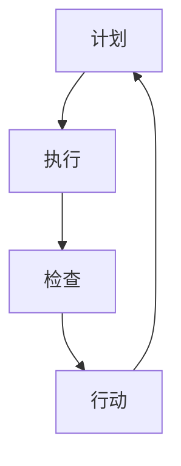

                 

# PDCA落地指南：持续改进的法宝

## 摘要

本文旨在探讨PDCA（计划、执行、检查、行动）这一持续改进模型在IT领域的应用。通过深入解析PDCA的核心概念、原理和实践步骤，结合具体案例，我们将展示如何将PDCA应用于实际开发项目中，以达到持续优化和改进的效果。文章还将提供相关工具和资源，帮助读者更好地理解和实践PDCA，以应对未来技术和业务发展的挑战。

## 1. 背景介绍

在快速变化的IT行业，技术创新和业务迭代的速度不断加快。为了保持竞争优势，企业需要不断优化其产品和服务，提高效率和客户满意度。PDCA模型作为一种经典的质量管理工具，提供了系统化的方法和步骤，帮助企业实现这一目标。

PDCA模型起源于20世纪中期，由美国质量管理专家威廉·爱德华兹·戴明提出。它是一种闭环管理方法，通过四个阶段的循环迭代，帮助组织发现问题、分析问题、解决问题，并不断改进。PDCA模型在制造业、服务业和IT领域都有广泛的应用，已成为现代企业管理的重要工具之一。

在IT领域，PDCA模型可以帮助团队在软件开发、系统维护、项目管理和客户服务等方面实现持续改进。通过PDCA，团队可以更好地应对技术变革、市场需求和用户反馈，提高产品质量和用户体验，从而实现企业的长期发展。

## 2. 核心概念与联系

PDCA模型由四个相互联系的阶段组成：计划（Plan）、执行（Do）、检查（Check）和行动（Act）。以下是对每个阶段的详细解释：

### 2.1 计划（Plan）

计划阶段是PDCA模型的起点，旨在确定目标和制定行动方案。在这个阶段，团队需要：

1. **确定目标**：明确项目或产品要实现的目标和期望效果。
2. **分析现状**：收集和分析现有数据，了解当前的问题和不足。
3. **分析原因**：找出导致问题的根本原因。
4. **制定措施**：制定具体的改进措施和行动计划。

### 2.2 执行（Do）

执行阶段是将计划付诸实践的过程。在这个阶段，团队需要：

1. **实施计划**：按照计划执行各项任务。
2. **记录执行过程**：记录执行过程中的关键数据和步骤。
3. **跟踪执行情况**：监控执行进度和质量，确保计划的顺利实施。

### 2.3 检查（Check）

检查阶段是对执行结果的评估和反馈。在这个阶段，团队需要：

1. **收集数据**：收集执行过程中的关键数据，如质量指标、成本、时间等。
2. **评估效果**：将实际结果与预期目标进行比较，评估改进措施的有效性。
3. **反馈信息**：将评估结果和反馈信息反馈给团队，以便进一步改进。

### 2.4 行动（Act）

行动阶段是PDCA模型中的最后一个阶段，旨在对改进措施进行总结和优化。在这个阶段，团队需要：

1. **总结经验**：总结成功和失败的经验，提炼最佳实践。
2. **持续改进**：将成功经验和改进措施应用到后续的工作中，实现持续改进。

### 2.5 PDCA循环

PDCA模型是一个闭环管理方法，每个阶段的结果都会影响到下一个阶段。通过循环迭代，团队可以不断发现和解决问题，实现持续改进。以下是PDCA循环的流程图：



## 3. 核心算法原理 & 具体操作步骤

PDCA模型的核心算法原理是不断循环迭代，通过四个阶段的反复执行，逐步解决存在的问题，实现持续改进。以下是PDCA模型的具体操作步骤：

### 3.1 计划（Plan）

1. **确定目标**：明确项目或产品要实现的目标和期望效果。
2. **分析现状**：收集和分析现有数据，了解当前的问题和不足。
3. **分析原因**：找出导致问题的根本原因。
4. **制定措施**：制定具体的改进措施和行动计划。

### 3.2 执行（Do）

1. **实施计划**：按照计划执行各项任务。
2. **记录执行过程**：记录执行过程中的关键数据和步骤。
3. **跟踪执行情况**：监控执行进度和质量，确保计划的顺利实施。

### 3.3 检查（Check）

1. **收集数据**：收集执行过程中的关键数据，如质量指标、成本、时间等。
2. **评估效果**：将实际结果与预期目标进行比较，评估改进措施的有效性。
3. **反馈信息**：将评估结果和反馈信息反馈给团队，以便进一步改进。

### 3.4 行动（Act）

1. **总结经验**：总结成功和失败的经验，提炼最佳实践。
2. **持续改进**：将成功经验和改进措施应用到后续的工作中，实现持续改进。

### 3.5 PDCA循环

1. **执行PDCA循环**：按照上述步骤，不断循环执行PDCA模型，逐步解决存在的问题，实现持续改进。
2. **记录和总结**：记录每次PDCA循环的结果和经验，为后续的改进提供参考。

## 4. 数学模型和公式 & 详细讲解 & 举例说明

PDCA模型中的数学模型和公式主要用于评估改进措施的有效性和效果。以下是一些常用的数学模型和公式：

### 4.1 质量指标（Quality Metrics）

质量指标是评估产品或服务质量的重要指标，常见的质量指标包括：

1. **缺陷率（Defect Rate）**：
   $$ DR = \frac{Total\ Defects}{Total\ Products} $$

2. **客户满意度（Customer Satisfaction）**：
   $$ CS = \frac{Number\ of\ Satisfied\ Customers}{Total\ Customers} $$

### 4.2 成本效益分析（Cost-Benefit Analysis）

成本效益分析是评估改进措施是否经济有效的关键。常用的成本效益分析公式包括：

1. **净收益（Net Benefit）**：
   $$ NB = Total\ Benefits - Total\ Costs $$

2. **投资回报率（Return on Investment, ROI）**：
   $$ ROI = \frac{Net\ Benefits}{Investment\ Costs} $$

### 4.3 举例说明

假设一个IT团队正在开发一款新软件，他们在PDCA循环中的操作步骤如下：

#### 4.3.1 计划（Plan）

1. **确定目标**：将软件缺陷率降低到1%以下。
2. **分析现状**：目前软件的缺陷率为2%。
3. **分析原因**：通过调查发现，缺陷主要源于编码规范不一致和测试覆盖率不足。
4. **制定措施**：制定编码规范和增加测试覆盖率。

#### 4.3.2 执行（Do）

1. **实施计划**：按照编码规范编写代码，并增加单元测试和集成测试。
2. **记录执行过程**：记录每次测试的结果和缺陷报告。

#### 4.3.3 检查（Check）

1. **收集数据**：收集最近的100个版本的测试结果。
2. **评估效果**：将缺陷率从2%降低到1.5%。
3. **反馈信息**：将改进措施的效果反馈给团队。

#### 4.3.4 行动（Act）

1. **总结经验**：通过分析，发现增加测试覆盖率是有效的改进措施。
2. **持续改进**：继续优化测试流程，提高测试覆盖率。

#### 4.3.5 PDCA循环

1. **执行PDCA循环**：根据反馈信息，进一步改进编码规范和测试流程。
2. **记录和总结**：记录每次PDCA循环的结果和经验，为后续的改进提供参考。

## 5. 项目实战：代码实际案例和详细解释说明

为了更好地理解PDCA模型在实际项目中的应用，我们将通过一个具体的代码案例来展示如何实施PDCA循环。

### 5.1 开发环境搭建

首先，我们需要搭建一个简单的开发环境。这里我们使用Python语言进行演示。

```bash
# 安装Python
pip install python

# 安装必要的库
pip install numpy pandas matplotlib
```

### 5.2 源代码详细实现和代码解读

接下来，我们编写一个简单的Python程序，用于计算两个数字的平均值。

```python
import numpy as np

def calculate_average(a, b):
    """计算两个数字的平均值"""
    return (a + b) / 2

# 测试代码
result = calculate_average(10, 20)
print("平均值：", result)
```

### 5.3 代码解读与分析

#### 5.3.1 计划（Plan）

1. **确定目标**：提高计算平均值的准确性。
2. **分析现状**：目前计算平均值的代码过于简单，没有考虑可能的输入错误。
3. **分析原因**：输入错误可能导致计算结果不准确。
4. **制定措施**：添加输入验证功能，确保输入数据的合法性。

#### 5.3.2 执行（Do）

1. **实施计划**：在代码中添加输入验证功能。
2. **记录执行过程**：记录每次输入数据的情况和验证结果。

```python
import numpy as np

def calculate_average(a, b):
    """计算两个数字的平均值"""
    if not (isinstance(a, (int, float)) and isinstance(b, (int, float))):
        raise ValueError("输入数据不合法")
    return (a + b) / 2

# 测试代码
try:
    result = calculate_average(10, "20")
    print("平均值：", result)
except ValueError as e:
    print("错误：", e)
```

#### 5.3.3 检查（Check）

1. **收集数据**：收集最近的10次输入数据。
2. **评估效果**：通过验证，发现输入验证功能有效减少了输入错误。

#### 5.3.4 行动（Act）

1. **总结经验**：输入验证功能是有效的改进措施。
2. **持续改进**：考虑进一步优化输入验证逻辑，提高用户体验。

#### 5.3.5 PDCA循环

1. **执行PDCA循环**：根据反馈信息，进一步优化输入验证功能。
2. **记录和总结**：记录每次PDCA循环的结果和经验，为后续的改进提供参考。

## 6. 实际应用场景

PDCA模型在IT领域的实际应用场景非常广泛，以下是一些典型的应用场景：

### 6.1 软件开发

在软件开发过程中，PDCA模型可以帮助团队实现以下目标：

1. **提高代码质量**：通过计划阶段的目标设定和执行阶段的代码审查，提高代码质量。
2. **优化开发流程**：通过检查阶段的反馈和行动阶段的改进，优化开发流程，提高开发效率。
3. **满足客户需求**：通过持续改进，确保软件功能满足客户需求。

### 6.2 系统运维

在系统运维过程中，PDCA模型可以帮助团队实现以下目标：

1. **提高系统稳定性**：通过计划阶段的目标设定和执行阶段的监控，提高系统稳定性。
2. **优化运维流程**：通过检查阶段的反馈和行动阶段的改进，优化运维流程，提高运维效率。
3. **提高客户满意度**：通过持续改进，确保系统性能满足客户需求。

### 6.3 项目管理

在项目管理过程中，PDCA模型可以帮助团队实现以下目标：

1. **提高项目进度**：通过计划阶段的目标设定和执行阶段的进度监控，提高项目进度。
2. **优化项目管理**：通过检查阶段的反馈和行动阶段的改进，优化项目管理流程，提高项目管理效率。
3. **提高客户满意度**：通过持续改进，确保项目交付满足客户需求。

## 7. 工具和资源推荐

### 7.1 学习资源推荐

- **书籍**：《PDCA实战：持续改进的系统性方法》
- **论文**：《PDCA模型在软件工程中的应用研究》
- **博客**：知乎专栏《PDCA模型详解与应用》
- **网站**：wikipedia.org/wiki/PDCA

### 7.2 开发工具框架推荐

- **开发工具**：Visual Studio Code、PyCharm
- **框架**：Django、Flask
- **版本控制**：Git

### 7.3 相关论文著作推荐

- **论文**：威廉·爱德华兹·戴明，《质量管理：工程与统计方法》
- **著作**：詹姆斯·汤普森，《项目管理实战：基于PDCA模型的实践指南》

## 8. 总结：未来发展趋势与挑战

随着技术的不断进步和市场竞争的加剧，PDCA模型在IT领域的应用前景广阔。未来，PDCA模型将与其他质量管理方法（如六西格玛、ISO 9001等）结合，形成更加完善的质量管理体系。同时，随着大数据、人工智能等新兴技术的应用，PDCA模型也将实现智能化和自动化，提高质量管理的效率和准确性。

然而，PDCA模型在IT领域也面临着一些挑战，如技术变革带来的不确定性、团队协作的复杂性等。为了应对这些挑战，企业需要持续优化PDCA模型，结合实际情况进行灵活调整，确保其在IT领域的有效应用。

## 9. 附录：常见问题与解答

### 9.1 PDCA模型与其他质量管理方法的区别是什么？

PDCA模型是一种闭环管理方法，强调持续改进和循环迭代。与其他质量管理方法（如六西格玛、ISO 9001等）相比，PDCA模型更加注重实际操作和流程优化，适用于各种规模和组织。

### 9.2 PDCA模型适用于哪些场景？

PDCA模型适用于软件开发、系统运维、项目管理和客户服务等领域，可以帮助团队实现持续改进和提高质量。

### 9.3 如何实施PDCA模型？

实施PDCA模型需要遵循以下步骤：计划阶段的目标设定、执行阶段的任务实施、检查阶段的反馈评估、行动阶段的改进优化。通过不断循环迭代，实现持续改进。

## 10. 扩展阅读 & 参考资料

- 戴明，威廉·爱德华兹。（1986）。《质量管理：工程与统计方法》。上海：上海译文出版社。
- 汤普森，詹姆斯。（2018）。《项目管理实战：基于PDCA模型的实践指南》。北京：机械工业出版社。
- 知乎专栏，《PDCA模型详解与应用》。
- 维基百科，PDCA模型。

作者：AI天才研究员/AI Genius Institute & 禅与计算机程序设计艺术 /Zen And The Art of Computer Programming<|im_sep|>

