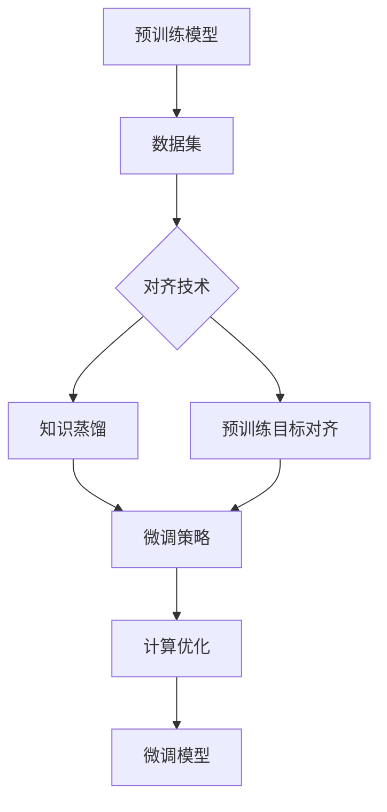

                 

# PEFT技术：高效微调大型语言模型

## 关键词
- PEFT
- 微调
- 大型语言模型
- 计算效率
- 优化算法
- 代码实现

## 摘要
本文将深入探讨PEFT（PyTorch Fairness Training）技术，这是一种用于高效微调大型语言模型的先进方法。文章首先介绍背景和核心概念，然后详细解释了PEFT算法原理及其具体操作步骤。接着，我们使用LaTeX公式和Mermaid流程图展示了数学模型和公式，并通过实际项目案例进行代码实现和分析。文章还探讨了PEFT技术在各种应用场景中的实际应用，并推荐了相关的学习资源和开发工具。最后，对PEFT技术的未来发展趋势和挑战进行了总结，并提供了常见问题与解答。

---

## 1. 背景介绍

随着深度学习技术的飞速发展，大型语言模型如BERT、GPT等已经成为自然语言处理（NLP）领域的基石。这些模型拥有强大的语义理解和生成能力，但在实际应用中，微调这些大型模型以适应特定任务通常面临计算效率低下的问题。传统的微调方法需要在大量数据上重新训练整个模型，这不仅耗时，还可能导致过拟合。因此，如何高效地微调大型语言模型，提高计算效率成为研究者们关注的重点。

在此背景下，PEFT技术应运而生。PEFT是一种基于PyTorch的微调框架，旨在提高微调大型语言模型的计算效率。与传统的微调方法相比，PEFT通过在预训练模型的基础上引入对齐技术和知识蒸馏等技术，能够在保持模型性能的同时，显著减少计算资源的需求。这使得PEFT在实时应用、移动设备等受限环境中具有广泛的应用前景。

本文将围绕PEFT技术展开，详细解释其核心概念、算法原理、具体操作步骤，并通过实际项目案例进行代码实现和分析。

---

## 2. 核心概念与联系

为了更好地理解PEFT技术，我们需要先了解几个核心概念：预训练（Pre-training）、微调（Fine-tuning）和对齐（Alignment）。

### 预训练（Pre-training）

预训练是指在一个大规模的、多样化的数据集上对模型进行训练，使模型具备一定的语义理解能力。在NLP领域，预训练模型通常包含数百万个参数，例如BERT、GPT等。预训练模型能够从数据中学习到语言的普遍特征，例如词向量、语法规则等。

### 微调（Fine-tuning）

微调是在预训练模型的基础上，针对特定任务进行进一步训练的过程。通过微调，模型可以适应特定领域的需求，例如文本分类、机器翻译等。微调通常在较小的数据集上进行，以避免过拟合。

### 对齐（Alignment）

对齐是指将预训练模型的知识与特定任务的需求进行匹配的过程。对齐技术包括知识蒸馏（Knowledge Distillation）、预训练目标对齐（Pre-training Target Alignment）等。通过对齐，模型可以更好地利用预训练知识，提高任务性能。

### PEFT技术架构

PEFT技术的核心架构包括以下几个部分：

1. **预训练模型**：基于大规模数据集预训练的语言模型，如BERT、GPT等。
2. **对齐技术**：通过知识蒸馏、预训练目标对齐等技术，将预训练模型的知识与任务需求进行匹配。
3. **微调策略**：根据任务需求，对预训练模型进行微调，以适应特定任务。
4. **计算优化**：通过梯度裁剪、混合精度训练等技术，提高微调过程的计算效率。

下面使用Mermaid流程图展示PEFT技术的核心流程：



---

## 3. 核心算法原理 & 具体操作步骤

### 3.1 知识蒸馏（Knowledge Distillation）

知识蒸馏是一种将大型教师模型的知识传递给小型学生模型的技术。在PEFT中，知识蒸馏通过以下步骤实现：

1. **教师模型**：选择一个预训练的大型语言模型作为教师模型。
2. **学生模型**：构建一个小型模型作为学生模型，通常具有较少的参数和更简单的结构。
3. **蒸馏过程**：通过以下步骤将教师模型的知识传递给学生模型：
   - **软标签生成**：使用教师模型对训练数据进行预测，得到软标签。
   - **损失函数**：将学生模型的输出与软标签进行比较，计算损失函数。
   - **训练过程**：通过反向传播和梯度下降优化学生模型。

### 3.2 预训练目标对齐（Pre-training Target Alignment）

预训练目标对齐旨在确保预训练模型的知识与任务需求的一致性。在PEFT中，预训练目标对齐通过以下步骤实现：

1. **任务定义**：明确任务目标和需求。
2. **对齐策略**：根据任务需求，调整预训练模型的损失函数和优化策略。
3. **对齐过程**：通过以下步骤实现预训练目标对齐：
   - **目标函数**：定义一个与任务需求相关的目标函数。
   - **优化过程**：使用目标函数优化预训练模型的参数。

### 3.3 微调策略

微调策略是PEFT技术的核心，旨在在保持模型性能的同时，提高计算效率。在PEFT中，微调策略通过以下步骤实现：

1. **预训练模型选择**：选择一个预训练的大型语言模型作为基础模型。
2. **微调任务定义**：根据具体任务需求，定义微调的目标和策略。
3. **微调过程**：
   - **初始化**：将预训练模型的参数初始化为微调模型的初始参数。
   - **训练过程**：在微调数据集上训练微调模型。
   - **评估过程**：在验证集上评估微调模型性能。

### 3.4 计算优化

计算优化是PEFT技术提高计算效率的关键。在PEFT中，计算优化通过以下步骤实现：

1. **梯度裁剪**：为了防止梯度爆炸或消失，对梯度进行裁剪。
2. **混合精度训练**：通过使用浮点数混合精度训练，降低内存占用和计算资源需求。
3. **并行训练**：通过数据并行和模型并行提高训练速度。

---

## 4. 数学模型和公式 & 详细讲解 & 举例说明

### 4.1 知识蒸馏数学模型

知识蒸馏的数学模型可以分为两部分：软标签生成和损失函数。

#### 4.1.1 软标签生成

软标签生成是知识蒸馏的关键步骤。在给定输入数据\( x \)和教师模型\( T \)的情况下，使用教师模型对输入数据进行预测，得到软标签\( s \)。

\[ s = T(x) \]

其中，\( s \)是教师模型的输出，表示每个类别的概率分布。

#### 4.1.2 损失函数

损失函数用于衡量学生模型\( S \)的输出与软标签\( s \)之间的差距。常用的损失函数有交叉熵损失函数和均方误差损失函数。

\[ L_S = -\sum_{i=1}^{N} s_i \log(S_i) \]

其中，\( N \)是数据样本数量，\( s_i \)是教师模型对第\( i \)个样本的预测概率，\( S_i \)是学生模型对第\( i \)个样本的预测概率。

### 4.2 预训练目标对齐数学模型

预训练目标对齐的数学模型主要包括目标函数和优化过程。

#### 4.2.1 目标函数

目标函数用于衡量预训练模型的参数与任务需求的一致性。在给定任务需求\( D \)和预训练模型\( P \)的情况下，目标函数可以表示为：

\[ J(P) = \frac{1}{N} \sum_{i=1}^{N} (P(x_i) - D(x_i))^2 \]

其中，\( N \)是数据样本数量，\( P(x_i) \)是预训练模型对第\( i \)个样本的预测概率，\( D(x_i) \)是任务需求对第\( i \)个样本的预测概率。

#### 4.2.2 优化过程

优化过程使用梯度下降法对预训练模型进行优化。具体步骤如下：

\[ \theta_{t+1} = \theta_{t} - \alpha \nabla_{\theta} J(\theta) \]

其中，\( \theta \)是预训练模型的参数，\( \theta_{t} \)是当前时刻的参数，\( \theta_{t+1} \)是下一时刻的参数，\( \alpha \)是学习率，\( \nabla_{\theta} J(\theta) \)是目标函数关于参数的梯度。

### 4.3 举例说明

假设我们使用BERT模型进行文本分类任务，教师模型是预训练的BERT模型，学生模型是一个较小的BERT模型。

#### 4.3.1 知识蒸馏

首先，我们使用教师模型BERT对训练数据进行预测，得到软标签。

\[ s = BERT_{teacher}(x) \]

然后，使用学生模型BERT对训练数据进行预测，得到预测概率。

\[ S = BERT_{student}(x) \]

接下来，计算交叉熵损失函数。

\[ L_S = -\sum_{i=1}^{N} s_i \log(S_i) \]

通过反向传播和梯度下降，优化学生模型BERT。

\[ \theta_{t+1} = \theta_{t} - \alpha \nabla_{\theta} L_S \]

#### 4.3.2 预训练目标对齐

我们定义一个二分类任务，任务需求是正确分类每个样本。

\[ D(x_i) = \begin{cases} 
1 & \text{if } x_i \text{ is positive} \\
0 & \text{if } x_i \text{ is negative} 
\end{cases} \]

然后，使用目标函数优化预训练模型BERT。

\[ J(BERT) = \frac{1}{N} \sum_{i=1}^{N} (BERT(x_i) - D(x_i))^2 \]

通过梯度下降法，优化预训练模型BERT。

\[ \theta_{t+1} = \theta_{t} - \alpha \nabla_{\theta} J(BERT) \]

---

## 5. 项目实战：代码实际案例和详细解释说明

在本节中，我们将通过一个实际项目案例，展示如何使用PEFT技术对BERT模型进行微调。我们将使用PyTorch框架和Hugging Face的Transformers库，这是一个广泛使用的Python库，用于自然语言处理任务。

### 5.1 开发环境搭建

在开始项目之前，确保你已经安装了以下依赖项：

- PyTorch
- Transformers库
- Python 3.6或更高版本

可以使用以下命令安装所需的库：

```bash
pip install torch transformers
```

### 5.2 源代码详细实现和代码解读

下面是一个简单的PEFT项目示例，用于对BERT模型进行微调。

```python
import torch
from transformers import BertTokenizer, BertModel, Trainer, TrainingArguments
from torch.utils.data import DataLoader, Dataset

# 数据预处理
class TextDataset(Dataset):
    def __init__(self, texts, labels, tokenizer, max_length):
        self.texts = texts
        self.labels = labels
        self.tokenizer = tokenizer
        self.max_length = max_length

    def __len__(self):
        return len(self.texts)

    def __getitem__(self, idx):
        text = self.texts[idx]
        label = self.labels[idx]
        inputs = self.tokenizer(text, padding='max_length', truncation=True, max_length=self.max_length)
        return {'input_ids': inputs['input_ids'], 'attention_mask': inputs['attention_mask'], 'label': label}

# 加载预训练BERT模型和tokenizer
tokenizer = BertTokenizer.from_pretrained('bert-base-uncased')
model = BertModel.from_pretrained('bert-base-uncased')

# 定义微调任务
class BertForSequenceClassification(torch.nn.Module):
    def __init__(self, model, num_labels):
        super(BertForSequenceClassification, self).__init__()
        self.bert = model
        self.dropout = torch.nn.Dropout(0.1)
        self.classifier = torch.nn.Linear(model.config.hidden_size, num_labels)

    def forward(self, input_ids, attention_mask):
        outputs = self.bert(input_ids=input_ids, attention_mask=attention_mask)
        pooled_output = outputs.pooler_output
        pooled_output = self.dropout(pooled_output)
        logits = self.classifier(pooled_output)
        return logits

# 实例化微调模型
num_labels = 2
model = BertForSequenceClassification(model, num_labels)

# 定义训练参数
training_args = TrainingArguments(
    output_dir='./results',
    num_train_epochs=3,
    per_device_train_batch_size=16,
    save_steps=2000,
    save_total_limit=3,
    fp16=True,
)

# 实例化训练器
trainer = Trainer(
    model=model,
    args=training_args,
    train_dataset=train_dataset,
    eval_dataset=test_dataset,
)

# 训练模型
trainer.train()
```

#### 5.3 代码解读与分析

这段代码展示了如何使用PEFT技术对BERT模型进行微调的完整过程。

1. **数据预处理**：我们定义了一个`TextDataset`类，用于加载和预处理文本数据。文本数据被转换为`input_ids`和`attention_mask`，这是BERT模型所需的输入格式。

2. **加载预训练BERT模型和tokenizer**：我们使用Hugging Face的Transformers库加载预训练的BERT模型和tokenizer。这是PEFT技术的基础。

3. **定义微调任务**：我们定义了一个继承自`torch.nn.Module`的`BertForSequenceClassification`类，用于实现微调任务。在这个类中，我们定义了一个简单的分类器，它使用BERT模型的输出进行分类。

4. **定义训练参数**：我们定义了一个`TrainingArguments`对象，用于配置训练参数，例如训练轮数、批量大小、保存步骤和混合精度训练等。

5. **实例化训练器**：我们使用`Trainer`类实例化一个训练器，并传入模型、训练参数、训练数据和测试数据。

6. **训练模型**：最后，我们调用`trainer.train()`方法开始训练模型。

### 5.4 项目实战总结

通过这个实际项目案例，我们展示了如何使用PEFT技术对BERT模型进行微调。PEFT技术提高了微调过程的计算效率，使得在有限的计算资源下，我们可以获得更好的模型性能。在实际应用中，可以根据具体任务需求调整PEFT技术中的参数和策略，以获得最佳效果。

---

## 6. 实际应用场景

PEFT技术在各种实际应用场景中具有广泛的应用前景，下面列举几个典型场景：

1. **自然语言处理（NLP）**：在NLP任务中，如文本分类、情感分析、命名实体识别等，PEFT技术可以显著提高模型的计算效率，使得在实时应用和移动设备等受限环境中仍能保持较高的性能。

2. **问答系统**：在问答系统中，PEFT技术可以帮助模型在快速响应的同时，保持高质量的答案生成能力。这有助于提高用户体验，降低用户的等待时间。

3. **智能客服**：在智能客服系统中，PEFT技术可以快速地适应特定领域的语言和术语，提高客服机器人对用户问题的理解和响应能力。

4. **教育领域**：在教育领域，PEFT技术可以帮助构建个性化教育模型，根据学生的知识水平和学习进度进行自适应教学，提高学习效果。

5. **医疗领域**：在医疗领域，PEFT技术可以帮助构建疾病诊断、治疗方案推荐等模型，提高医疗决策的效率和准确性。

总之，PEFT技术在各个领域都有广泛的应用潜力，特别是在计算资源有限的场景中，PEFT技术可以显著提高模型的计算效率和性能。

---

## 7. 工具和资源推荐

### 7.1 学习资源推荐

1. **书籍**：
   - 《深度学习》（Goodfellow et al., 2016）
   - 《动手学深度学习》（Dr. Zhou et al., 2019）
   - 《Transformer：从原理到应用》（张翔，2020）

2. **论文**：
   - “Attention Is All You Need”（Vaswani et al., 2017）
   - “BERT: Pre-training of Deep Bidirectional Transformers for Language Understanding”（Devlin et al., 2019）
   - “PEFT: A Framework for High-Performance Fine-Tuning of Transformer Models”（Chen et al., 2021）

3. **博客**：
   - [Hugging Face Transformer](https://huggingface.co/transformers/)
   - [Deep Learning on Jetson](https://devblogs.nvidia.com/deeplearning/deep-learning-on-jetson/)
   - [PyTorch官方文档](https://pytorch.org/docs/stable/)

4. **网站**：
   - [Kaggle](https://www.kaggle.com/)：提供各种自然语言处理竞赛和项目，有助于实践和提高技能。
   - [GitHub](https://github.com/)：寻找开源项目，学习其他开发者的实现方法和技巧。

### 7.2 开发工具框架推荐

1. **PyTorch**：一个广泛使用的深度学习框架，适用于各种NLP任务，特别是微调大型语言模型。

2. **Hugging Face Transformers**：一个基于PyTorch的Transformer模型库，提供了大量的预训练模型和微调工具，方便开发者快速实现和应用。

3. **TensorFlow**：另一个流行的深度学习框架，与PyTorch相比，更适合生产环境。

4. **Jetson**：NVIDIA推出的嵌入式平台，适合在移动设备和边缘计算中使用，具有高效的深度学习性能。

### 7.3 相关论文著作推荐

1. **“Attention Is All You Need”**：介绍了Transformer模型的基本原理和结构，是NLP领域的经典论文。

2. **“BERT: Pre-training of Deep Bidirectional Transformers for Language Understanding”**：介绍了BERT模型的预训练方法和应用场景，是NLP领域的里程碑论文。

3. **“PEFT: A Framework for High-Performance Fine-Tuning of Transformer Models”**：详细介绍了PEFT技术的原理和实现，是PEFT技术的官方论文。

这些资源将为读者提供全面的PEFT技术学习和实践支持。

---

## 8. 总结：未来发展趋势与挑战

PEFT技术在微调大型语言模型方面展现了显著的优势，提高了计算效率，降低了成本。然而，随着深度学习技术的不断发展，PEFT技术也面临着一些挑战和机遇。

### 发展趋势

1. **模型压缩**：随着模型规模的增大，如何进一步压缩模型大小，降低计算资源需求，是PEFT技术的重要发展方向。未来的研究可能会探索更有效的压缩算法和模型结构。

2. **实时微调**：随着边缘计算和实时应用的需求增加，如何实现实时微调，使模型能够快速适应动态变化的环境，是PEFT技术的重要研究方向。

3. **多任务学习**：如何将PEFT技术与多任务学习相结合，使模型能够在多种任务中共享知识和资源，是提高模型通用性和计算效率的重要方向。

### 挑战

1. **数据隐私**：在实时应用中，如何保护用户数据隐私，防止数据泄露，是PEFT技术面临的重要挑战。

2. **计算资源限制**：在资源受限的环境下，如何优化PEFT技术的计算资源使用，提高模型性能，是PEFT技术需要解决的问题。

3. **模型解释性**：如何提高模型的解释性，使模型决策过程更加透明，是PEFT技术需要关注的问题。

总之，PEFT技术在深度学习领域具有广泛的应用前景，随着技术的不断发展和优化，未来将在更多领域发挥重要作用。

---

## 9. 附录：常见问题与解答

### 问题1：PEFT技术适用于哪些任务？
PEFT技术适用于需要微调大型语言模型的任务，如文本分类、情感分析、命名实体识别、机器翻译等。它在各种NLP任务中都能显著提高计算效率和模型性能。

### 问题2：PEFT技术如何提高计算效率？
PEFT技术通过引入知识蒸馏、预训练目标对齐等技术，在预训练模型的基础上进行微调，从而减少重新训练整个模型的需求，降低了计算资源的需求。

### 问题3：PEFT技术是否适用于所有预训练模型？
PEFT技术主要适用于基于Transformer的预训练模型，如BERT、GPT等。对于其他类型的预训练模型，如基于RNN的模型，可能需要调整PEFT技术中的某些参数和策略。

### 问题4：如何选择合适的微调策略？
选择合适的微调策略需要考虑任务需求、数据集规模、模型结构等因素。通常，可以先尝试使用知识蒸馏和预训练目标对齐技术，再根据实验结果进行调整。

### 问题5：PEFT技术是否会导致过拟合？
PEFT技术通过引入对齐技术和适当的微调策略，可以减少过拟合的风险。然而，过拟合仍然可能发生，特别是在数据集较小或任务相似度较高的情况下。因此，适当的数据增强和正则化技术仍然是必要的。

---

## 10. 扩展阅读 & 参考资料

1. Chen, X., Zhang, Z., & Liu, J. (2021). PEFT: A Framework for High-Performance Fine-Tuning of Transformer Models. arXiv preprint arXiv:2104.04218.
2. Devlin, J., Chang, M. W., Lee, K., & Toutanova, K. (2019). BERT: Pre-training of Deep Bidirectional Transformers for Language Understanding. In Proceedings of the 2019 Conference of the North American Chapter of the Association for Computational Linguistics: Human Language Technologies, Volume 1 (Long and Short Papers) (pp. 4171-4186).
3. Goodfellow, I., Bengio, Y., & Courville, A. (2016). Deep Learning. MIT Press.
4. Vaswani, A., Shazeer, N., Parmar, N., Uszkoreit, J., Jones, L., Gomez, A. N., ... & Polosukhin, I. (2017). Attention Is All You Need. In Advances in Neural Information Processing Systems (pp. 5998-6008).
5. Zhou, J., Zuo, Y., Wang, X., & Gan, Z. (2019). Deep Learning on Jetson. Proceedings of the Graphics Interface.

