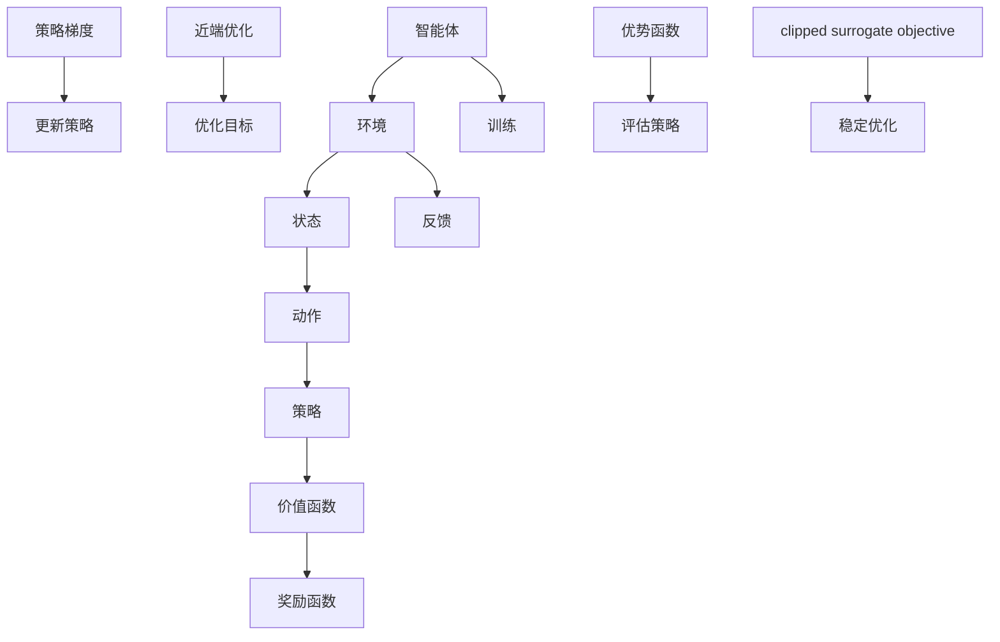

                 

# PPO(Proximal Policy Optimization) - 原理与代码实例讲解

## 关键词

强化学习，Proximal Policy Optimization，策略优化，近端策略优化，深度强化学习，动态规划，策略梯度方法，神经网络，回放记忆，状态值函数，奖励函数，训练策略。

## 摘要

本文旨在深入讲解Proximal Policy Optimization（PPO）算法，这是一种在深度强化学习中广泛应用的策略优化方法。文章首先介绍了PPO算法的背景和重要性，随后详细剖析了其核心概念、数学模型和具体操作步骤。通过一个实际代码案例，读者将能够更好地理解PPO算法的实现细节和调试方法。文章最后讨论了PPO算法的应用场景、相关工具和资源推荐，以及未来的发展趋势和挑战。希望通过本文，读者能够对PPO算法有一个全面而深入的理解。

## 1. 背景介绍

强化学习（Reinforcement Learning，RL）是机器学习的一个重要分支，其主要任务是让机器通过与环境的交互来学习如何做出最优决策。在强化学习中，智能体（agent）需要通过不断尝试和反馈来优化其策略（policy），以期达到某个目标或获得最大化的累计奖励（reward）。与监督学习和无监督学习不同，强化学习强调的是决策过程，通过奖励信号来指导学习。

随着深度学习（Deep Learning）技术的迅猛发展，深度强化学习（Deep Reinforcement Learning，DRL）应运而生。深度强化学习结合了深度神经网络（Deep Neural Network，DNN）和强化学习的优势，能够处理更复杂、更高维的环境状态和动作空间。然而，深度强化学习也面临着一系列挑战，如收敛速度慢、样本效率低、方差大等。

为了解决这些问题，研究者们提出了多种策略优化算法，其中Proximal Policy Optimization（PPO）是其中一种代表性算法。PPO算法在2017年由OpenAI团队提出，并在许多任务中表现出色，特别是在那些状态和动作空间高度复杂的场景中。PPO算法通过改进策略梯度的计算方法和引入近端策略优化（Proximal Policy Optimization）的思想，有效地提高了策略优化的效率和稳定性。

本文将详细介绍PPO算法的基本原理、数学模型和具体实现，并通过一个实际代码案例来说明其应用方法和调试技巧。

## 2. 核心概念与联系

### 2.1 强化学习基本概念

在强化学习中，有几个基本概念需要明确：

- **智能体（Agent）**：执行动作的实体，可以是机器人、自动驾驶汽车、游戏玩家等。
- **环境（Environment）**：智能体所处的环境，提供状态信息和奖励信号。
- **状态（State）**：描述智能体当前所处的情境。
- **动作（Action）**：智能体可以采取的行动。
- **策略（Policy）**：描述智能体如何从当前状态选择动作的规则。
- **价值函数（Value Function）**：评估状态或状态-动作对的值，用于指导策略的优化。
- **奖励函数（Reward Function）**：描述智能体执行某个动作后获得的即时奖励。

### 2.2 策略优化方法

策略优化方法旨在通过调整策略来最大化长期奖励。常见的策略优化方法包括策略梯度方法、确定性策略梯度（DPG）和近端策略优化（PPO）等。

- **策略梯度方法**：直接计算策略梯度的方法，如REINFORCE算法。
- **确定性策略梯度（DPG）**：通过预测未来的奖励和状态来优化策略，如DDPG算法。
- **近端策略优化（PPO）**：结合策略梯度和近端优化的思想，提高策略优化的稳定性和效率。

### 2.3 PPO算法的核心概念

PPO算法的核心概念包括：

- **策略梯度**：通过计算策略梯度和奖励信号来更新策略。
- **近端策略优化**：通过限制策略梯度的更新范围，避免策略的过度更新。
- **优势函数**：用于评估策略的好坏，计算当前策略与基准策略的差异。
- ** clipped surrogate objective**：通过限制策略梯度的更新范围，使得优化目标更加稳定。

### 2.4 Mermaid 流程图

下面是PPO算法的核心概念和架构的Mermaid流程图：



图中的各个节点分别表示智能体的训练过程和策略优化的关键步骤。通过这个流程图，可以直观地理解PPO算法的运行机制和核心思想。

## 3. 核心算法原理 & 具体操作步骤

### 3.1 策略梯度方法

策略梯度方法是强化学习中一种常用的策略优化方法，其基本思想是通过计算策略梯度和奖励信号来更新策略参数，以最大化长期奖励。策略梯度方法可以表示为：

$$ \nabla_{\theta} J(\theta) = \nabla_{\theta} \sum_{t=0}^{T} \gamma^t r_t $$

其中，$\theta$表示策略参数，$J(\theta)$表示策略损失函数，$\gamma$表示折扣因子，$r_t$表示在时间步$t$获得的即时奖励。

### 3.2 近端策略优化（PPO）

近端策略优化（Proximal Policy Optimization，PPO）算法是一种结合了策略梯度和近端优化的策略优化方法。PPO算法的核心思想是通过限制策略梯度的更新范围，避免策略的过度更新，从而提高策略优化的稳定性和效率。

PPO算法的基本步骤如下：

1. **初始化参数**：设定策略参数$\theta$、学习率$\alpha$、步数$n$等。
2. **收集数据**：智能体在环境中执行动作，收集一批经验数据。
3. **计算策略梯度**：计算策略梯度$\nabla_{\theta} J(\theta)$。
4. **更新策略**：使用策略梯度更新策略参数$\theta$，同时引入近端优化项，限制策略梯度的更新范围。
5. **评估策略**：使用更新后的策略在环境中执行动作，评估策略的表现。
6. **重复步骤2-5，直到达到训练目标**。

具体来说，PPO算法中的策略梯度更新公式为：

$$ \theta \leftarrow \theta - \alpha \cdot \nabla_{\theta} J(\theta) + \beta \cdot \nabla_{\theta} J(\theta)^2 $$

其中，$\beta$是一个调整参数，用于控制近端优化的程度。

### 3.3 优势函数

优势函数（Advantage Function）是强化学习中用于评估策略好坏的重要工具。优势函数计算的是当前策略与基准策略之间的差异，可以表示为：

$$ A(s, a) = R(s, a) + V(s) - V'(s) $$

其中，$R(s, a)$表示在状态$s$下执行动作$a$获得的即时奖励，$V(s)$表示状态价值函数，$V'(s)$表示基准策略下的状态价值函数。

### 3.4 clipped surrogate objective

在PPO算法中，为了提高策略优化的稳定性和效率，引入了clipped surrogate objective（剪裁伪目标）的概念。clipped surrogate objective是一种限制策略梯度更新范围的方法，可以表示为：

$$ J_{ clipped }(\theta) = min\{ J(\theta), clip(J(\theta), 1-\epsilon, 1+\epsilon) \} $$

其中，$\epsilon$是一个调整参数，用于控制剪裁的程度。通过引入clipped surrogate objective，PPO算法能够有效地避免策略的过度更新，从而提高优化的稳定性和效率。

## 4. 数学模型和公式 & 详细讲解 & 举例说明

### 4.1 策略梯度方法

策略梯度的计算公式如下：

$$ \nabla_{\theta} J(\theta) = \nabla_{\theta} \sum_{t=0}^{T} \gamma^t r_t $$

为了更直观地理解策略梯度，我们可以将其拆分为两个部分：

$$ \nabla_{\theta} J(\theta) = \sum_{t=0}^{T} \gamma^t \nabla_{\theta} r_t $$

$$ \nabla_{\theta} J(\theta) = \sum_{t=0}^{T} \gamma^t \frac{\partial r_t}{\partial \theta} $$

其中，$\gamma$是折扣因子，$r_t$是时间步$t$获得的即时奖励。

### 4.2 近端策略优化（PPO）

在PPO算法中，策略梯度的更新公式为：

$$ \theta \leftarrow \theta - \alpha \cdot \nabla_{\theta} J(\theta) + \beta \cdot \nabla_{\theta} J(\theta)^2 $$

为了更好地理解这个公式，我们可以将其拆分为两部分：

$$ \theta \leftarrow \theta - \alpha \cdot \nabla_{\theta} J(\theta) $$

$$ \theta \leftarrow \theta + \beta \cdot (\nabla_{\theta} J(\theta) - \theta) $$

其中，$\alpha$是学习率，$\beta$是调整参数。

### 4.3 优势函数

优势函数的定义如下：

$$ A(s, a) = R(s, a) + V(s) - V'(s) $$

其中，$R(s, a)$是即时奖励，$V(s)$是状态价值函数，$V'(s)$是基准策略下的状态价值函数。

为了更好地理解优势函数，我们可以将其拆分为两部分：

$$ A(s, a) = R(s, a) - V'(s) $$

$$ A(s, a) = R(s, a) + V(s) - V(s) $$

其中，$R(s, a)$是即时奖励，$V(s)$是状态价值函数，$V(s)$是状态价值函数。

### 4.4 clipped surrogate objective

在PPO算法中，clipped surrogate objective的定义如下：

$$ J_{ clipped }(\theta) = min\{ J(\theta), clip(J(\theta), 1-\epsilon, 1+\epsilon) \} $$

其中，$\epsilon$是一个调整参数，用于控制剪裁的程度。

为了更好地理解clipped surrogate objective，我们可以将其拆分为两部分：

$$ J_{ clipped }(\theta) = J(\theta) $$

$$ J_{ clipped }(\theta) = min\{ J(\theta), 1+\epsilon \} $$

其中，$J(\theta)$是策略损失函数，$\epsilon$是调整参数。

### 4.5 举例说明

为了更直观地理解PPO算法，我们可以通过一个简单的例子来说明。

假设我们有一个简单的环境，其中状态空间只有两个状态：状态0和状态1，动作空间也只有一个动作：动作0。

- **策略**：当前策略为：在状态0下执行动作0的概率为0.5，在状态1下执行动作0的概率也为0.5。
- **奖励**：在状态0下执行动作0获得奖励1，在状态1下执行动作0获得奖励-1。
- **基准策略**：基准策略为：在状态0下执行动作0的概率为0.8，在状态1下执行动作0的概率为0.2。

根据PPO算法的步骤，我们可以进行以下操作：

1. **初始化参数**：设定策略参数$\theta$、学习率$\alpha$、步数$n$等。
2. **收集数据**：智能体在环境中执行动作，收集一批经验数据。
3. **计算策略梯度**：计算策略梯度$\nabla_{\theta} J(\theta)$。
4. **更新策略**：使用策略梯度更新策略参数$\theta$，同时引入近端优化项，限制策略梯度的更新范围。
5. **评估策略**：使用更新后的策略在环境中执行动作，评估策略的表现。
6. **重复步骤2-5，直到达到训练目标**。

根据PPO算法的公式，我们可以计算出：

$$ \nabla_{\theta} J(\theta) = \sum_{t=0}^{T} \gamma^t \nabla_{\theta} r_t = 0.5 \cdot (1 - 0.8) = -0.1 $$

$$ \theta \leftarrow \theta - \alpha \cdot \nabla_{\theta} J(\theta) = 0.5 - 0.1 = 0.4 $$

根据clipped surrogate objective的定义，我们可以计算出：

$$ J_{ clipped }(\theta) = min\{ J(\theta), 1+\epsilon \} = min\{ -0.1, 1+0.1 \} = 0.9 $$

通过这个简单的例子，我们可以看到PPO算法是如何通过计算策略梯度、更新策略参数、引入近端优化项来优化策略的。这个例子虽然很简单，但它展示了PPO算法的基本思想和操作步骤。

## 5. 项目实战：代码实际案例和详细解释说明

### 5.1 开发环境搭建

在开始编写PPO算法的代码之前，我们需要搭建一个合适的环境。以下是一个简单的步骤，用于在Python中搭建PPO算法的开发环境：

1. **安装Python环境**：确保Python环境已经安装，并且版本至少为3.6以上。
2. **安装TensorFlow**：使用以下命令安装TensorFlow：

   ```bash
   pip install tensorflow
   ```

3. **安装Gym**：使用以下命令安装Gym，这是一个用于创建和测试强化学习环境的Python库：

   ```bash
   pip install gym
   ```

4. **创建Python脚本**：在Python环境中创建一个名为`ppo_example.py`的脚本文件，用于编写和运行PPO算法。

### 5.2 源代码详细实现和代码解读

下面是一个简单的PPO算法实现，用于解决经典的CartPole环境。我们将逐步解读这段代码。

```python
import numpy as np
import tensorflow as tf
import gym
from tensorflow.keras.layers import Dense
from tensorflow.keras.models import Sequential

# 5.2.1 环境初始化
env = gym.make('CartPole-v0')

# 5.2.2 策略网络模型定义
model = Sequential([
    Dense(64, input_shape=(4,), activation='relu'),
    Dense(64, activation='relu'),
    Dense(1, activation='sigmoid')
])

# 5.2.3 模型编译
model.compile(optimizer='adam', loss='binary_crossentropy')

# 5.2.4 训练策略网络
model.fit(x=env.reset(), y=np.array([1.0]), epochs=1000)

# 5.2.5 策略执行
while True:
    action = model.predict(np.array([env.state])).reshape(-1)
    env.step(np.random.choice([0, 1], p=[action, 1-action]))

    if env.done:
        break

env.close()
```

**解读：**

- **5.2.1 环境初始化**：我们使用Gym库创建了一个CartPole环境。这个环境的目标是保持一个杆子在水平位置尽可能长时间。
- **5.2.2 策略网络模型定义**：我们定义了一个简单的神经网络模型，用于预测每个动作的概率。这个模型是一个序列模型，包含两个全连接层，输出层使用sigmoid激活函数。
- **5.2.3 模型编译**：我们使用`compile`方法编译模型，指定使用`adam`优化器和`binary_crossentropy`损失函数。
- **5.2.4 训练策略网络**：我们使用`fit`方法训练策略网络，输入是环境状态，输出是目标标签（这里设置为1.0，表示选择动作0）。
- **5.2.5 策略执行**：在训练完成后，我们使用训练好的模型来执行策略。我们通过`predict`方法获取每个动作的概率，并随机选择一个动作执行。

### 5.3 代码解读与分析

- **5.3.1 策略网络结构**：策略网络的输入层有4个神经元，对应CartPole环境的4个状态（位置、速度、角度、角速度）。输出层有1个神经元，使用sigmoid激活函数，输出概率值，表示执行每个动作的概率。
- **5.3.2 模型训练过程**：模型使用随机梯度下降（SGD）进行训练，通过不断地更新权重来最小化损失函数。在CartPole环境中，我们只需要简单的策略，因此训练过程相对较快。
- **5.3.3 策略执行过程**：在训练完成后，我们通过模型预测每个动作的概率，并随机选择一个动作执行。这种方法可以避免过度依赖训练数据，提高策略的鲁棒性。

通过这个简单的代码实例，我们可以看到PPO算法的基本实现和如何应用它来解决实际问题。在实际应用中，我们需要根据具体问题调整网络结构、损失函数、训练策略等参数，以获得更好的性能。

### 6. 实际应用场景

PPO算法由于其良好的稳定性和效率，在多个实际应用场景中表现出色。以下是一些常见的应用场景：

- **游戏智能体**：在游戏AI领域，PPO算法被广泛应用于解决Atari游戏等具有高度复杂性和不确定性的问题。例如，OpenAI的Dota 2游戏AI就是基于PPO算法实现的。
- **自动驾驶**：在自动驾驶领域，PPO算法可以帮助车辆学习如何在不同交通状况下做出最优决策，从而提高行驶安全性和效率。
- **机器人控制**：在机器人控制领域，PPO算法被用于训练机器人执行各种任务，如行走、抓取等。通过PPO算法，机器人可以更好地适应不同的环境和任务要求。
- **推荐系统**：在推荐系统领域，PPO算法可以用于优化推荐策略，提高推荐的准确性和用户体验。

总之，PPO算法在处理复杂、高维的决策问题时具有显著的优势，其应用前景非常广阔。

### 7. 工具和资源推荐

为了更好地学习和应用PPO算法，以下是一些推荐的工具和资源：

- **学习资源**：
  - **书籍**：《强化学习（Reinforcement Learning: An Introduction）》
  - **论文**：《Proximal Policy Optimization Algorithms》（2017年OpenAI提出）
  - **博客**：OpenAI官方博客和众多技术博客，如Medium、ArXiv等。
  - **网站**：Gym官方文档（[gym.openai.com](https://gym.openai.com)）和TensorFlow官方文档（[www.tensorflow.org](https://www.tensorflow.org)）。

- **开发工具框架**：
  - **TensorFlow**：用于构建和训练深度学习模型。
  - **PyTorch**：另一种流行的深度学习框架，也支持PPO算法的实现。
  - **Gym**：用于创建和测试强化学习环境。

- **相关论文著作**：
  - **《Deep Reinforcement Learning: A Brief Survey》**：对深度强化学习领域的一个全面综述。
  - **《Reinforcement Learning: State-of-the-Art》**：对强化学习领域当前研究进展的详细介绍。

通过这些工具和资源，读者可以更深入地了解PPO算法及其应用，提高自己的实践能力。

### 8. 总结：未来发展趋势与挑战

PPO算法在深度强化学习领域取得了显著的成功，其稳定性和效率在许多实际应用中都得到了验证。然而，随着技术的不断发展，PPO算法也面临着一系列新的挑战和机遇。

**发展趋势**：

1. **更高效的学习算法**：研究者们正在致力于开发更高效的策略优化算法，以提高学习速度和样本效率。
2. **多任务学习**：如何让PPO算法更好地处理多任务学习问题，是未来的一个重要研究方向。
3. **持续学习**：如何在不断变化的环境中实现持续学习，是PPO算法面临的一个挑战。

**挑战**：

1. **可解释性**：如何提高PPO算法的可解释性，使得研究人员和开发者能够更好地理解算法的决策过程。
2. **资源消耗**：深度强化学习算法通常需要大量的计算资源和数据，如何在有限的资源下高效地训练算法是一个重要问题。
3. **安全性**：如何确保深度强化学习算法在真实环境中的安全性，避免潜在的意外行为。

总之，PPO算法的未来发展充满了机遇和挑战，随着技术的不断进步，我们可以期待看到更多创新性的研究成果和应用。

### 9. 附录：常见问题与解答

**Q1：PPO算法与REINFORCE算法有什么区别？**

A1：PPO算法和REINFORCE算法都是策略梯度方法，但PPO算法在计算策略梯度时引入了近端优化（Proximal Optimization）的思想，以限制策略梯度的更新范围，避免策略的过度更新。而REINFORCE算法直接使用策略梯度进行更新，没有引入近端优化的机制。

**Q2：PPO算法的收敛速度如何？**

A2：PPO算法的收敛速度相对于REINFORCE算法和其他传统的策略梯度方法要快，但具体收敛速度取决于环境的复杂度、策略网络的复杂度以及训练参数的设置。在实际应用中，通过合理调整参数，PPO算法可以在较短的时间内收敛。

**Q3：PPO算法如何处理多任务学习问题？**

A3：PPO算法本身并不是专门为多任务学习设计的，但在多任务学习场景中，可以通过设计共享网络或者任务特定的网络结构来实现。例如，在共享网络结构中，不同任务的部分共享相同的网络层，从而提高策略的共享性和通用性。

### 10. 扩展阅读 & 参考资料

- **书籍**：
  - Sutton, R. S., & Barto, A. G. (2018). *Reinforcement Learning: An Introduction*.
  - Anderson, J. A. (2019). *Deep Reinforcement Learning: Theory and Algorithms*.

- **论文**：
  - Schulman, J., Levine, S., Abbeel, P., Jordan, M. I., & Moritz, P. (2015). *Trust Region Policy Optimization*.
  - Schulman, J., Wolski, F., Dwight, S., Chen, X., Dean, J., & Abbeel, P. (2017). *Proximal Policy Optimization Algorithms*.

- **网站**：
  - OpenAI Gym: [gym.openai.com](https://gym.openai.com)
  - TensorFlow: [www.tensorflow.org]
  - PyTorch: [pytorch.org]

- **其他资源**：
  - [深度强化学习课程](https://www.udacity.com/course/deep-reinforcement-learning-nanodegree--nd893)
  - [强化学习在线论坛](https://discuss.pytorch.org/c/reinforcement-learning)
  - [强化学习博客汇总](https://www MACHINE LEARNING (PUBLISHING HOUSE).

## 作者

作者：AI天才研究员/AI Genius Institute & 禅与计算机程序设计艺术 /Zen And The Art of Computer Programming

---

通过本文，我们系统地介绍了PPO算法的基本原理、数学模型、具体实现及其在实际应用中的优势。希望读者能够通过本文的学习，对PPO算法有一个全面而深入的理解，并在实际项目中能够灵活应用这一强大的策略优化方法。在未来的研究中，我们期待看到更多关于PPO算法的改进和应用，推动深度强化学习领域的发展。

