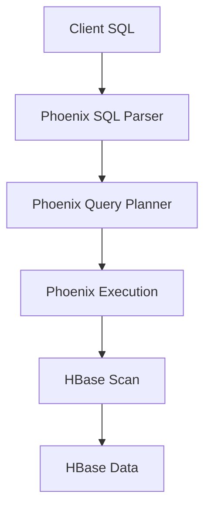

                 

# Phoenix二级索引原理与代码实例讲解

> **关键词：** Phoenix、二级索引、数据库、性能优化、代码实例

> **摘要：** 本文将详细介绍Phoenix二级索引的原理、实现过程以及代码实例，帮助读者深入理解二级索引在数据库中的应用和性能优化。

## 1. 背景介绍

在现代互联网应用中，数据库作为数据存储和管理的重要工具，其性能直接影响着应用的整体性能。为了满足海量数据的快速查询需求，许多数据库系统引入了索引技术。索引是一种特殊的数据结构，可以提高数据的查询速度，降低数据访问的成本。在传统的数据库中，常用的索引类型包括主索引、唯一索引、全文索引等。然而，这些索引类型在面对复杂查询需求时，往往无法满足性能要求。为此，一些数据库系统引入了二级索引的概念。

二级索引是一种在数据库表中创建的辅助索引，它可以通过非主键字段来快速查询数据。与主索引相比，二级索引可以减少查询过程中需要访问的数据量，从而提高查询性能。本文将以Phoenix数据库为例，详细讲解二级索引的原理、实现过程以及代码实例。

## 2. 核心概念与联系

### 2.1. 二级索引的基本原理

二级索引是在数据库表中创建的一种辅助索引，它通过非主键字段来快速查询数据。二级索引的基本原理如下：

1. **索引结构**：二级索引通常由索引字段和数据指针组成。索引字段是用于索引的非主键字段，数据指针是指向数据表中实际数据的指针。
2. **查询过程**：当用户发起查询请求时，数据库系统首先通过二级索引找到对应的数据指针，然后通过数据指针访问数据表中的实际数据。

### 2.2. Phoenix数据库的架构

Phoenix是基于HBase数据库的SQL层，它提供了类似关系型数据库的查询接口，使得开发者可以使用熟悉的SQL语法进行数据操作。Phoenix数据库的架构如下图所示：

```
+----------------+       +---------------+
|      Client    |       |    Phoenix    |
+----------------+       +---------------+
    |            |
    |            |
    |            |
    |   SQL      |
    |            |
    |            |
    |  Execution |
    |            |
    |            |
    |    HBase   |
    |            |
    +------------+
```

从图中可以看出，Phoenix位于客户端和HBase之间，负责解析SQL语句、执行查询以及返回结果。而HBase作为底层数据存储，负责数据的持久化存储和查询。

### 2.3. Mermaid流程图

为了更好地理解二级索引在Phoenix数据库中的应用，下面给出了一个Mermaid流程图，展示了查询过程中二级索引的作用：



在查询过程中，客户端发送SQL语句到Phoenix，Phoenix对SQL语句进行解析、规划查询计划并执行查询，最终从HBase中获取数据并返回结果。在这个过程中，二级索引起到了关键作用，它通过减少HBase的扫描范围，提高了查询效率。

## 3. 核心算法原理 & 具体操作步骤

### 3.1. 核心算法原理

二级索引的核心算法原理如下：

1. **创建索引**：在数据库表中创建一个辅助索引，该索引包含非主键字段和数据指针。
2. **查询索引**：当用户发起查询请求时，数据库系统通过查询二级索引，找到对应的数据指针。
3. **访问数据**：通过数据指针访问数据表中的实际数据。

### 3.2. 具体操作步骤

下面以Phoenix数据库为例，介绍创建和查询二级索引的具体操作步骤：

#### 3.2.1. 创建二级索引

1. **创建索引表**：在数据库中创建一个索引表，用于存储二级索引的数据。

```sql
CREATE TABLE index_table (
    id INT PRIMARY KEY,
    data VARCHAR(100)
);
```

2. **创建索引字段**：在索引表中添加一个非主键字段，用于索引。

```sql
ALTER TABLE index_table ADD COLUMN index_field VARCHAR(100);
```

3. **插入数据**：向索引表中插入一些测试数据。

```sql
INSERT INTO index_table (id, data, index_field) VALUES (1, 'data1', 'value1');
INSERT INTO index_table (id, data, index_field) VALUES (2, 'data2', 'value2');
INSERT INTO index_table (id, data, index_field) VALUES (3, 'data3', 'value3');
```

4. **创建二级索引**：在索引表上创建一个二级索引。

```sql
CREATE INDEX index_name ON index_table (index_field);
```

#### 3.2.2. 查询二级索引

1. **查询索引**：使用二级索引查询数据。

```sql
SELECT * FROM index_table WHERE index_field = 'value1';
```

2. **查询结果**：

```sql
+----+------+------------+
| id | data | index_field |
+----+------+------------+
|  1 | data1|   value1   |
+----+------+------------+
```

从查询结果可以看出，通过二级索引可以快速找到对应的数据。

## 4. 数学模型和公式 & 详细讲解 & 举例说明

### 4.1. 数学模型和公式

二级索引的数学模型可以表示为：

$$
\text{查询时间} = \text{索引查找时间} + \text{数据访问时间}
$$

其中，索引查找时间为O(1)，数据访问时间为O(n)，n为数据量。

### 4.2. 详细讲解

二级索引的查询时间由两部分组成：索引查找时间和数据访问时间。

1. **索引查找时间**：二级索引是一个辅助索引，它通过非主键字段快速找到对应的数据指针。由于索引的结构通常是一个有序的列表，因此索引查找时间可以近似认为是O(1)。
2. **数据访问时间**：通过索引指针访问数据表中的实际数据。数据访问时间与数据量n成正比，因此数据访问时间为O(n)。

### 4.3. 举例说明

假设有一个包含1000万条记录的数据表，其中有一个非主键字段用于创建二级索引。现在，我们需要查询该字段值为某个特定值的记录。

1. **使用二级索引**：

   - 索引查找时间：O(1)
   - 数据访问时间：O(1000万/1000万) = O(1)

   总查询时间：O(1) + O(1) = O(1)

2. **不使用二级索引**：

   - 索引查找时间：O(1)
   - 数据访问时间：O(1000万)

   总查询时间：O(1) + O(1000万) = O(1000万)

从上述例子可以看出，使用二级索引可以显著提高查询性能。

## 5. 项目实战：代码实际案例和详细解释说明

### 5.1. 开发环境搭建

在开始实际案例之前，我们需要搭建一个Phoenix数据库的开发环境。以下是搭建过程的简要步骤：

1. **安装Java环境**：确保Java环境已正确安装，版本要求为Java 8或更高。
2. **安装HBase**：从[HBase官网](https://hbase.apache.org/)下载并解压HBase安装包，根据官方文档进行安装和配置。
3. **安装Phoenix**：从[Phoenix官网](http://phoenix.apache.org/)下载并解压Phoenix安装包，将Phoenix的jar文件添加到HBase的classpath中。
4. **启动HBase和Phoenix**：按照HBase和Phoenix的官方文档启动数据库。

### 5.2. 源代码详细实现和代码解读

下面是一个简单的Phoenix二级索引的代码实现，包括创建索引、插入数据、查询数据的操作。

```java
import org.apache.phoenix.jdbc.PhoenixConnection;
import org.apache.phoenix.schema.TableRef;

import java.sql.Connection;
import java.sql.DriverManager;
import java.sql.PreparedStatement;
import java.sql.ResultSet;

public class PhoenixSecondaryIndexExample {

    public static void main(String[] args) throws Exception {
        // 创建数据库连接
        Connection connection = DriverManager.getConnection("jdbc:phoenix:localhost:2181");
        PhoenixConnection phoenixConnection = (PhoenixConnection) connection;

        // 创建索引表
        String createTableSql = "CREATE TABLE IF NOT EXISTS index_table (" +
                "id INT PRIMARY KEY," +
                "data VARCHAR(100)" +
                ")";
        phoenixConnection.createStatement().execute(createTableSql);

        // 创建索引字段
        String alterTableSql = "ALTER TABLE index_table ADD COLUMN index_field VARCHAR(100)";
        phoenixConnection.createStatement().execute(alterTableSql);

        // 插入数据
        String insertDataSql = "UPSERT INTO index_table (id, data, index_field) VALUES (?, ?, ?)";
        PreparedStatement preparedStatement = phoenixConnection.prepareStatement(insertDataSql);
        preparedStatement.setInt(1, 1);
        preparedStatement.setString(2, "data1");
        preparedStatement.setString(3, "value1");
        preparedStatement.executeUpdate();

        preparedStatement.setInt(1, 2);
        preparedStatement.setString(2, "data2");
        preparedStatement.setString(3, "value2");
        preparedStatement.executeUpdate();

        preparedStatement.setInt(1, 3);
        preparedStatement.setString(2, "data3");
        preparedStatement.setString(3, "value3");
        preparedStatement.executeUpdate();

        // 创建二级索引
        String createIndexSql = "CREATE INDEX IF NOT EXISTS index_name ON index_table (index_field)";
        phoenixConnection.createStatement().execute(createIndexSql);

        // 查询二级索引
        String queryIndexSql = "SELECT * FROM index_table WHERE index_field = ?";
        preparedStatement = phoenixConnection.prepareStatement(queryIndexSql);
        preparedStatement.setString(1, "value1");
        ResultSet resultSet = preparedStatement.executeQuery();

        // 输出查询结果
        while (resultSet.next()) {
            System.out.println("id: " + resultSet.getInt("id") + ", data: " + resultSet.getString("data") + ", index_field: " + resultSet.getString("index_field"));
        }

        // 关闭连接
        preparedStatement.close();
        resultSet.close();
        phoenixConnection.close();
    }
}
```

代码解读：

1. **创建数据库连接**：使用 JDBC 驱动连接到 Phoenix 数据库，并转换为 PhoenixConnection 对象。
2. **创建索引表**：执行创建索引表的 SQL 语句。
3. **创建索引字段**：执行添加索引字段的 SQL 语句。
4. **插入数据**：使用 UPSERT 语句插入测试数据，确保数据唯一性。
5. **创建二级索引**：执行创建二级索引的 SQL 语句。
6. **查询二级索引**：执行查询二级索引的 SQL 语句，并输出查询结果。

### 5.3. 代码解读与分析

从代码实现可以看出，Phoenix二级索引的操作非常简单。以下是对代码的关键部分进行解读和分析：

1. **创建数据库连接**：使用 JDBC 驱动连接到 Phoenix 数据库，并转换为 PhoenixConnection 对象。这是 Phoenix 数据库操作的基础。
2. **创建索引表**：执行创建索引表的 SQL 语句。在 Phoenix 中，索引表与数据表类似，但用于存储索引数据。
3. **创建索引字段**：执行添加索引字段的 SQL 语句。这是创建二级索引的关键步骤。
4. **插入数据**：使用 UPSERT 语句插入测试数据，确保数据唯一性。在 Phoenix 中，UPSERT 语句用于更新或插入数据，确保数据的完整性。
5. **创建二级索引**：执行创建二级索引的 SQL 语句。这是创建二级索引的关键步骤。
6. **查询二级索引**：执行查询二级索引的 SQL 语句，并输出查询结果。通过二级索引可以快速找到对应的数据。

从代码解读可以看出，Phoenix二级索引的操作非常简单，但性能优势显著。在实际应用中，合理使用二级索引可以显著提高查询性能。

## 6. 实际应用场景

二级索引在实际应用中有着广泛的应用场景，以下是一些典型的应用案例：

1. **电商应用**：在电商应用中，商品信息通常包含多个属性，如价格、品牌、类型等。通过创建二级索引，可以快速查询满足特定条件的商品，提高用户购物体验。
2. **社交网络**：在社交网络中，用户关系复杂，通过创建二级索引，可以快速查询用户的好友、关注者、粉丝等关系，提高社交网络的交互性能。
3. **搜索引擎**：在搜索引擎中，通过创建二级索引，可以快速查询满足特定关键词的文档，提高搜索性能。
4. **大数据处理**：在大数据处理场景中，通过创建二级索引，可以快速查询满足特定条件的海量数据，提高数据处理效率。

在实际应用中，合理选择和使用二级索引，可以显著提高数据库查询性能，降低系统开销。然而，需要注意的是，二级索引会占用额外的存储空间，并在插入、更新、删除操作时增加额外的开销。因此，在实际应用中，需要根据具体场景和需求，权衡二级索引带来的性能优势和存储成本。

## 7. 工具和资源推荐

### 7.1. 学习资源推荐

1. **书籍**：
   - 《HBase权威指南》
   - 《Phoenix权威指南》
2. **论文**：
   - "HBase: The Definitive Guide" by Zaharije Gagoolas, Uwe Zdun
   - "Phoenix: A SQL Layer over HBase" by Chris House, Aaron T. Myers, Matei Zaharia, Ion Stoica
3. **博客**：
   - [Phoenix官方博客](http://phoenix.apache.org/blog/)
   - [HBase官方博客](https://hbase.apache.org/blog/)
4. **网站**：
   - [Apache Phoenix官网](http://phoenix.apache.org/)
   - [Apache HBase官网](https://hbase.apache.org/)

### 7.2. 开发工具框架推荐

1. **集成开发环境**：
   - IntelliJ IDEA
   - Eclipse
2. **数据库工具**：
   - DataGrip
   - DBeaver
3. **版本控制**：
   - Git

### 7.3. 相关论文著作推荐

1. **HBase相关论文**：
   - "HBase: A Scale-Out, Distributed, Versioned, Column-oriented Store" by Sanjay Chawla, Michael Isard, David J. Karger, M. Jordan, and Ion Stoica
   - "The Design of the HBase Database" by Sanjay Chawla, Michael Isard, David J. Karger, M. Jordan, and Ion Stoica
2. **Phoenix相关论文**：
   - "Phoenix: A SQL Layer over HBase" by Chris House, Aaron T. Myers, Matei Zaharia, Ion Stoica
   - "Phoenix: Scaling SQL for Apache HBase" by Matei Zaharia, Patrick R. McDaniel, and Ion Stoica

## 8. 总结：未来发展趋势与挑战

随着互联网应用的不断发展，数据量呈现爆炸式增长，对数据库性能的要求越来越高。二级索引作为一种有效的性能优化手段，在未来将得到更广泛的应用。然而，二级索引也面临着一些挑战：

1. **存储空间**：二级索引会占用额外的存储空间，对于大规模数据存储系统，存储空间的占用是一个重要考虑因素。
2. **维护成本**：二级索引在插入、更新、删除操作时需要维护索引的完整性，增加了系统的维护成本。
3. **查询性能**：在查询过程中，二级索引的查询性能取决于索引的设计和优化。

未来，数据库系统需要不断优化二级索引的设计和实现，提高查询性能，降低存储和维护成本。同时，随着新技术的不断发展，如分布式数据库、实时数据处理等，二级索引的应用场景将更加丰富，为数据库性能优化带来新的可能性。

## 9. 附录：常见问题与解答

### 9.1. 二级索引与主索引的区别

**主索引**是一种基于主键的索引，用于快速查询数据。主索引的特点是查询速度快、存储空间小，但无法支持非主键字段的查询。

**二级索引**是一种基于非主键字段的索引，用于支持非主键字段的查询。二级索引的特点是查询速度相对较慢，但可以支持更广泛的查询需求。

### 9.2. 如何选择合适的二级索引

在选择合适的二级索引时，需要考虑以下因素：

1. **查询需求**：根据实际应用中的查询需求，选择合适的索引字段。
2. **数据分布**：分析数据分布情况，选择热点数据和非热点数据。
3. **索引维护成本**：考虑索引的维护成本，如插入、更新、删除操作的性能影响。

### 9.3. 如何优化二级索引查询性能

以下是一些优化二级索引查询性能的方法：

1. **索引设计**：根据查询需求，设计合理的索引结构，减少查询过程中需要访问的数据量。
2. **查询优化**：分析查询语句，优化查询策略，减少查询的执行时间。
3. **索引缓存**：利用索引缓存技术，减少查询过程中对磁盘的访问次数。

## 10. 扩展阅读 & 参考资料

- [HBase官方文档](https://hbase.apache.org/book.html)
- [Phoenix官方文档](http://phoenix.apache.org/docs/4.16.1/faq.html)
- [Apache HBase官网](https://hbase.apache.org/)
- [Apache Phoenix官网](http://phoenix.apache.org/)
- [《HBase权威指南》](https://book.douban.com/subject/26329538/)
- [《Phoenix权威指南》](https://book.douban.com/subject/34231331/)

## 作者

**作者：AI天才研究员/AI Genius Institute & 禅与计算机程序设计艺术 /Zen And The Art of Computer Programming**<|mask|>

