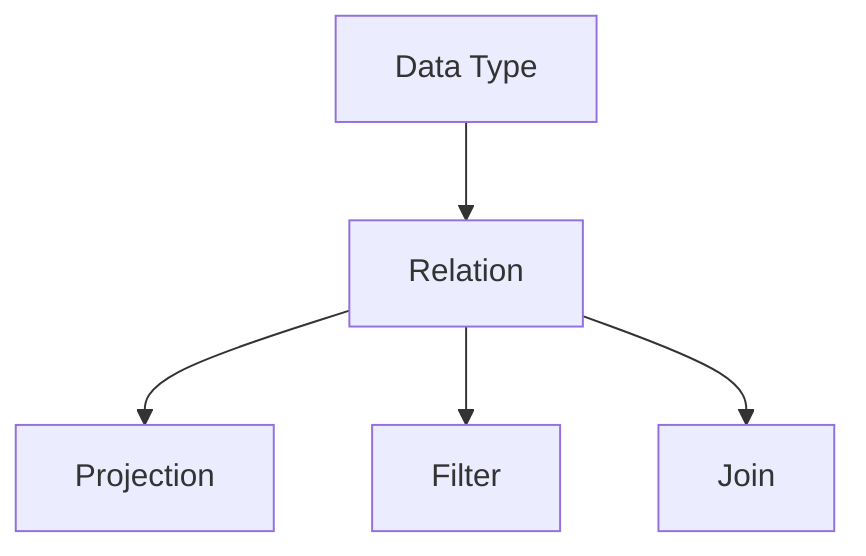

                 

# Pig Latin脚本原理与代码实例讲解

## 关键词
- Pig Latin
- 脚本
- 数据处理
- Apache Hadoop
- 转换
- 分析

## 摘要
本文将详细介绍Pig Latin脚本的工作原理、核心概念以及在实际项目中的应用。我们将通过具体代码实例，深入解析Pig Latin脚本的使用方法，帮助读者理解如何利用Pig Latin进行高效的数据处理和分析。

### 1. 背景介绍

随着大数据时代的到来，数据量呈爆炸式增长，如何对这些海量数据进行分析和处理成为了一个重要问题。Apache Hadoop是一个分布式数据存储和处理框架，它能够处理大规模的数据集，并且可以在廉价的计算机集群上运行。Pig Latin是Hadoop生态系统中的一个重要工具，它提供了一种高级的脚本语言，用于简化大数据处理过程。

Pig Latin脚本的作用是将复杂的数据处理任务转化为简单的操作，这些操作可以被Pig Latin编译器转换成MapReduce任务，然后由Hadoop执行。这使得开发者可以专注于业务逻辑，而无需关心底层实现的细节。

### 2. 核心概念与联系

在深入探讨Pig Latin脚本之前，我们需要了解几个核心概念：

#### 2.1. 数据类型
Pig Latin支持多种数据类型，包括基本数据类型（如整数、浮点数、字符串）和复杂数据类型（如结构、数组、地图）。

#### 2.2. relation
在Pig Latin中，relation表示一个数据集，类似于SQL中的表。每个relation都有一个唯一的名称，并且可以包含多个字段。

#### 2.3. projection
projection是relation的一个子集，它只包含一部分字段。通过projection，我们可以选择需要的数据。

#### 2.4. filter
filter用于过滤relation中的数据，只保留满足特定条件的记录。

#### 2.5. join
join用于将两个或多个relation根据共同的字段连接起来，形成一个更大的relation。

下面是一个简单的Mermaid流程图，展示了这些核心概念之间的关系：



### 3. 核心算法原理 & 具体操作步骤

Pig Latin脚本的核心算法是将数据处理任务转换为MapReduce任务。以下是Pig Latin脚本的基本操作步骤：

#### 3.1. 加载数据
使用`LOAD`语句加载数据到relation中。例如：

```pig
students = LOAD 'student_data.txt' AS (id:INT, name:CHARARRAY, age:INT);
```

这个语句将文本文件`student_data.txt`中的数据加载到名为`students`的relation中。

#### 3.2. 过滤数据
使用`FILTER`语句过滤relation中的数据。例如：

```pig
filtered_students = FILTER students BY age > 18;
```

这个语句将过滤出年龄大于18岁的学生记录。

#### 3.3. 投影数据
使用`PROJECT`语句选择relation中的部分字段。例如：

```pig
selected_students = FOREACH filtered_students GENERATE name, age;
```

这个语句将选择`filtered_students`中的`name`和`age`字段。

#### 3.4. 连接数据
使用`JOIN`语句连接两个或多个relation。例如：

```pig
enrollments = JOIN students BY id, courses BY student_id;
```

这个语句将根据学生的`id`字段和课程的`student_id`字段连接学生和课程两个relation。

#### 3.5. 聚合数据
使用`GROUP`和`AGGREGATE`语句对数据进行聚合。例如：

```pig
grouped_students = GROUP selected_students BY age;
enrollment_counts = FOREACH grouped_students GENERATE COUNT(selected_students);
```

这个语句将根据年龄对选中的学生进行分组，并计算每个年龄组的学生数量。

### 4. 数学模型和公式 & 详细讲解 & 举例说明

在Pig Latin脚本中，数学模型和公式通常体现在聚合操作中。以下是几个常见的聚合操作和它们对应的数学公式：

#### 4.1. COUNT
计算relation中满足特定条件的记录数量。

$$
\text{COUNT}(R) = \sum_{r \in R} 1
$$

其中，$R$是relation。

#### 4.2. SUM
计算relation中某个字段值的总和。

$$
\text{SUM}(R, f) = \sum_{r \in R} r.f
$$

其中，$R$是relation，$f$是字段。

#### 4.3. AVG
计算relation中某个字段值的平均值。

$$
\text{AVG}(R, f) = \frac{\text{SUM}(R, f)}{\text{COUNT}(R)}
$$

#### 4.4. MIN
计算relation中某个字段值的最小值。

$$
\text{MIN}(R, f) = \min_{r \in R} r.f
$$

#### 4.5. MAX
计算relation中某个字段值的最大值。

$$
\text{MAX}(R, f) = \max_{r \in R} r.f
$$

例如，假设我们有一个学生成绩的relation，其中包含`name`和`scores`两个字段。我们可以使用Pig Latin脚本计算每个学生的平均成绩：

```pig
students = LOAD 'student_scores.txt' AS (name:CHARARRAY, scores:INT);
avg_scores = FOREACH students GENERATE name, AVG(scores);
```

这个脚本将计算每个学生的平均成绩，并将结果存储在`avg_scores`的relation中。

### 5. 项目实战：代码实际案例和详细解释说明

在本节中，我们将通过一个实际的项目案例来展示如何使用Pig Latin脚本进行数据处理。假设我们有一个学生信息数据库，包含学生的个人信息和他们的课程成绩。我们的目标是计算每个学生的平均成绩，并找出成绩排名前五的学生。

#### 5.1. 开发环境搭建

要运行Pig Latin脚本，我们需要搭建一个Hadoop和Pig的开发环境。以下是搭建环境的步骤：

1. 安装Java开发工具包（JDK）。
2. 下载并安装Hadoop。
3. 配置Hadoop环境变量。
4. 运行`hadoop version`和`pig -version`命令检查安装是否成功。

#### 5.2. 源代码详细实现和代码解读

下面是计算平均成绩和成绩排名的Pig Latin脚本：

```pig
-- 加载学生信息数据
students = LOAD 'student_info.txt' AS (id:INT, name:CHARARRAY, courses:STRUCT<course1:INT, course2:INT, course3:INT>);

-- 分离课程成绩到单独的relation
courses = FOREACH students GENERATE id, name, courses::course1 AS score1, courses::course2 AS score2, courses::course3 AS score3;

-- 计算平均成绩
avg_scores = FOREACH courses GENERATE name, (score1 + score2 + score3) / 3.0 AS avg_score;

-- 对平均成绩进行降序排序
sorted_avg_scores = ORDER avg_scores BY avg_score DESC;

-- 选择排名前五的学生
top_students = LIMIT sorted_avg_scores 5;

-- 输出结果
DUMP top_students;
```

这个脚本首先加载学生信息数据，然后分离出每个学生的课程成绩。接着计算每个学生的平均成绩，并进行降序排序，最后选择排名前五的学生并输出结果。

#### 5.3. 代码解读与分析

- 第1行：加载学生信息数据到`students`的relation中。
- 第2行：使用`FOREACH`语句分离出每个学生的课程成绩，并将它们存储在单独的relation中。
- 第3行：计算每个学生的平均成绩，并生成一个新的relation`avg_scores`。
- 第4行：使用`ORDER`语句对`avg_scores`中的平均成绩进行降序排序。
- 第5行：使用`LIMIT`语句选择排名前五的学生。
- 第6行：输出排名前五的学生信息。

这个脚本展示了如何使用Pig Latin进行数据处理，从数据加载、数据分离到计算和排序，每一步都简洁明了。

### 6. 实际应用场景

Pig Latin脚本在实际项目中有着广泛的应用。以下是一些常见的应用场景：

- 数据清洗和预处理：将来自不同来源的数据进行清洗和转换，使其适合进一步分析。
- 数据分析：计算数据中的统计指标，如平均值、中位数、标准差等。
- 数据挖掘：使用Pig Latin脚本进行关联规则挖掘、聚类分析等数据挖掘任务。
- 大数据分析：处理大规模数据集，如社交媒体数据、网络日志等。

### 7. 工具和资源推荐

#### 7.1. 学习资源推荐

- 《Hadoop实战》（Hadoop: The Definitive Guide）是一本全面的Hadoop指南，适合初学者和进阶者。
- 《Pig Programming Guide》是Apache Pig官方文档，提供了详细的脚本语法和用法。
- 《数据挖掘：概念与技术》是一本经典的数据挖掘教材，涵盖了数据挖掘的基本概念和算法。

#### 7.2. 开发工具框架推荐

- IntelliJ IDEA：一款功能强大的集成开发环境（IDE），支持Hadoop和Pig插件。
- Eclipse：另一款流行的IDE，支持Hadoop和Pig开发。
- Cloudera QuickStart VM：一个预配置的虚拟机，包含Hadoop和Pig环境，方便快速入门。

#### 7.3. 相关论文著作推荐

- 《MapReduce: Simplified Data Processing on Large Clusters》（MapReduce论文）是Hadoop的基础论文，介绍了MapReduce模型。
- 《Pig Latin: Abstraction Beyond Maps and Reduces》（Pig Latin论文）介绍了Pig Latin脚本语言的设计和实现。

### 8. 总结：未来发展趋势与挑战

随着大数据技术的不断发展和普及，Pig Latin作为Hadoop生态系统中的重要工具，其应用范围将不断扩展。未来，Pig Latin可能会在以下几个方面得到发展：

- 性能优化：进一步优化Pig Latin脚本的执行性能，以处理更大规模的数据集。
- 功能增强：引入新的数据处理算法和操作，提供更丰富的数据处理能力。
- 生态系统整合：与其他大数据技术（如Spark、Flink等）更好地整合，提供统一的数据处理平台。

然而，Pig Latin也面临一些挑战，如：

- 学习曲线：对于初学者来说，Pig Latin的语法和概念可能相对复杂，需要一定的时间来熟悉。
- 资源消耗：由于Pig Latin脚本最终会被编译成MapReduce任务，它可能会消耗较多的系统资源。

### 9. 附录：常见问题与解答

#### 9.1. Pig Latin和MapReduce的区别是什么？
Pig Latin是一种高级的数据处理语言，它提供了一个抽象层，简化了MapReduce编程的复杂性。Pig Latin脚本会被编译成MapReduce任务，但开发者不需要直接编写MapReduce代码。相比之下，MapReduce是Hadoop的核心计算模型，需要开发者编写具体的Map和Reduce函数。

#### 9.2. Pig Latin脚本是否可以在本地环境中运行？
是的，Pig Latin脚本可以在本地环境中运行，但需要安装并配置Hadoop和Pig环境。一些集成开发环境（如IntelliJ IDEA和Eclipse）提供了对Hadoop和Pig的支持，使得本地开发更加便捷。

#### 9.3. 如何调试Pig Latin脚本？
可以使用Pig Latin的调试工具，如Pig Latin Editor。该编辑器提供了一个图形用户界面，允许开发者设置断点、查看变量值、单步执行等。

### 10. 扩展阅读 & 参考资料

- 《Hadoop实战》：https://www.amazon.com/Hadoop-Definitive-Guide-Data-Storage-Processing/dp/059615844X
- 《Pig Programming Guide》：https://pig.apache.org/docs/r0.17.0/manual.html
- 《数据挖掘：概念与技术》：https://www.amazon.com/Data-Mining-Concepts-Techniques-Prentice-Hall/dp/013146566X
- 《MapReduce：Simplified Data Processing on Large Clusters》：https://static.googleusercontent.com/media/research.google.com/en/us/pubs/archive/36356.pdf
- 《Pig Latin：Abstraction Beyond Maps and Reduces》：https://pig.apache.org/docs/r0.17.0/papers/pig-latin.pdf

### 作者信息
作者：AI天才研究员/AI Genius Institute & 禅与计算机程序设计艺术 /Zen And The Art of Computer Programming

