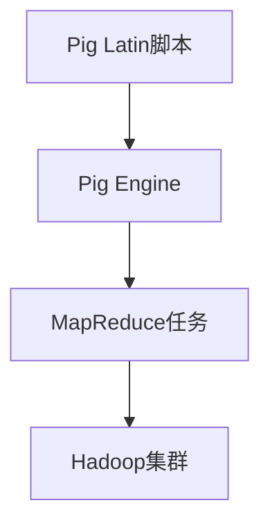

                 

# Pig UDF原理与代码实例讲解

## 摘要

本文旨在详细讲解Pig的User-Defined Function（UDF）原理及其代码实例。Pig是一种高层次的平台，用于处理大规模数据集，它提供了丰富的内置函数，同时也支持自定义函数，以适应不同的数据处理需求。本文将介绍如何实现一个自定义函数，并剖析其背后的原理。通过本文的学习，读者将能够掌握Pig UDF的开发和调试技巧，并在实际项目中应用。

## 1. 背景介绍

Pig是由Apache Software Foundation开发的一个基于Hadoop的数据处理平台。它提供了丰富的内置函数和操作，可以简化对大规模数据集的处理过程。然而，在某些特定场景下，内置函数可能无法满足需求，此时就需要自定义函数来解决问题。

Pig UDF（User-Defined Function）是Pig的一个重要特性，它允许用户使用Java、Python或Ruby等编程语言编写自定义函数，并在Pig脚本中调用。这使得Pig具备了更强大的数据处理能力，可以应对各种复杂的数据处理任务。

### Pig的工作流程

Pig的基本工作流程如下：

1. **加载数据**：将数据从文件系统中加载到Pig中。
2. **定义操作**：使用Pig的内置函数和操作对数据进行处理。
3. **存储结果**：将处理后的数据存储回文件系统或数据库中。

在Pig中，数据以`record`的形式进行操作，每个`record`是一个字段序列，字段可以是原子类型（如整数、浮点数、字符串等），也可以是复杂类型（如结构、数组等）。

### Pig与Hadoop的关系

Pig是基于Hadoop开发的一个平台，因此它与Hadoop有着紧密的联系。Pig将数据处理任务转换为MapReduce任务，然后提交给Hadoop集群执行。这使得Pig能够充分利用Hadoop的分布式计算能力，处理大规模数据集。

### Pig的优势

1. **易于使用**：Pig提供了丰富的内置函数和操作，使得数据处理变得更加简单。
2. **高扩展性**：Pig支持自定义函数，可以应对各种复杂的数据处理任务。
3. **可移植性**：Pig脚本可以在任何支持Hadoop的平台上运行。

## 2. 核心概念与联系

### 核心概念

在Pig中，自定义函数主要涉及以下几个核心概念：

1. **类型**：Pig中的数据类型包括原子类型（整数、浮点数、字符串等）和复杂类型（结构、数组等）。
2. **字段**：一个`record`包含多个字段，字段可以是不同类型的。
3. **参数**：自定义函数的参数可以是字段，也可以是其他自定义函数。
4. **返回值**：自定义函数的返回值可以是原子类型，也可以是复杂类型。

### 架构

Pig的架构可以分为以下几个部分：

1. **Pig Latin**：Pig的脚本语言，用于定义数据处理任务。
2. **Pig Engine**：负责将Pig Latin脚本转换为MapReduce任务。
3. **Hadoop**：执行MapReduce任务的分布式计算平台。

### Mermaid流程图

以下是Pig UDF的工作流程的Mermaid流程图：



## 3. 核心算法原理 & 具体操作步骤

### UDF开发步骤

1. **定义函数**：在Java、Python或Ruby中定义一个函数，并实现相应的接口。
2. **编译函数**：将自定义函数编译为字节码。
3. **加载函数**：在Pig脚本中加载自定义函数。
4. **调用函数**：在Pig脚本中调用自定义函数。

### Java UDF

以下是一个简单的Java UDF示例：

```java
import org.apache.pig.EvalFunc;
import org.apache.pig.data.Tuple;

public class MyUDF extends EvalFunc<String> {
    public String exec(Tuple input) {
        // 输入处理
        int a = (int) input.get(0);
        int b = (int) input.get(1);
        
        // 执行计算
        int result = a + b;
        
        // 返回结果
        return String.valueOf(result);
    }
}
```

### Python UDF

以下是一个简单的Python UDF示例：

```python
from pig_udf import UDF

class MyUDF(UDF):
    def exec(self, input):
        # 输入处理
        a = input[0]
        b = input[1]
        
        # 执行计算
        result = a + b
        
        # 返回结果
        return result
```

### 调用UDF

在Pig脚本中调用自定义函数：

```pig
define
    add(a INT, b INT) RETURNS INT as 'path/to/MyUDF.class';

data = load 'data.csv' using PigStorage(',');

result = foreach data generate add($0, $1);
```

## 4. 数学模型和公式 & 详细讲解 & 举例说明

### 数学模型

在自定义函数中，可能会涉及到一些数学模型和公式。以下是几个常见的数学模型和公式：

1. **求和公式**：
   $$
   \sum_{i=1}^{n} x_i = x_1 + x_2 + \ldots + x_n
   $$
2. **平均值公式**：
   $$
   \bar{x} = \frac{1}{n} \sum_{i=1}^{n} x_i
   $$
3. **方差公式**：
   $$
   \sigma^2 = \frac{1}{n} \sum_{i=1}^{n} (x_i - \bar{x})^2
   $$

### 举例说明

假设我们有一个包含五个整数的列表 `[1, 2, 3, 4, 5]`，我们可以使用上述数学模型来计算这些整数的和、平均值和方差。

1. **求和**：
   $$
   \sum_{i=1}^{5} x_i = 1 + 2 + 3 + 4 + 5 = 15
   $$
2. **平均值**：
   $$
   \bar{x} = \frac{1}{5} (1 + 2 + 3 + 4 + 5) = 3
   $$
3. **方差**：
   $$
   \sigma^2 = \frac{1}{5} ((1 - 3)^2 + (2 - 3)^2 + (3 - 3)^2 + (4 - 3)^2 + (5 - 3)^2) = 2
   $$

## 5. 项目实战：代码实际案例和详细解释说明

### 5.1 开发环境搭建

在开始编写Pig UDF之前，我们需要搭建一个开发环境。以下是步骤：

1. **安装Java**：从 [Oracle官网](https://www.oracle.com/java/technologies/javase-jdk11-downloads.html) 下载并安装Java 11。
2. **安装Pig**：从 [Apache Pig官网](https://pig.apache.org/) 下载并解压Pig。
3. **配置环境变量**：将Pig的bin目录添加到系统环境变量的PATH中。

### 5.2 源代码详细实现和代码解读

以下是一个简单的Java UDF示例，用于计算两个整数的和：

```java
import org.apache.pig.EvalFunc;
import org.apache.pig.data.Tuple;

public class AddUDF extends EvalFunc<String> {
    public String exec(Tuple input) {
        // 输入处理
        int a = (int) input.get(0);
        int b = (int) input.get(1);
        
        // 执行计算
        int result = a + b;
        
        // 返回结果
        return String.valueOf(result);
    }
}
```

1. **import语句**：引入必要的类。
2. **类定义**：继承自`EvalFunc`类。
3. **exec方法**：定义执行计算的方法。
   - 输入处理：获取输入参数并转换为整数类型。
   - 执行计算：计算两个整数的和。
   - 返回结果：将结果转换为字符串类型并返回。

### 5.3 代码解读与分析

1. **导入类**：`import org.apache.pig.EvalFunc;` 引入`EvalFunc`类，用于定义自定义函数。
2. **类定义**：`public class AddUDF extends EvalFunc<String>` 定义一个名为`AddUDF`的类，继承自`EvalFunc`类，并返回类型为`String`。
3. **exec方法**：
   - `public String exec(Tuple input)`：定义一个名为`exec`的方法，接受一个`Tuple`类型的输入参数，并返回一个`String`类型的结果。
   - `int a = (int) input.get(0);`：从输入参数中获取第一个整数。
   - `int b = (int) input.get(1);`：从输入参数中获取第二个整数。
   - `int result = a + b;`：计算两个整数的和。
   - `return String.valueOf(result);`：将结果转换为字符串类型并返回。

### 5.4 使用Pig脚本调用UDF

以下是一个Pig脚本示例，用于调用自定义的`AddUDF`函数：

```pig
define
    add(a INT, b INT) RETURNS INT as 'path/to/AddUDF.class';

data = load 'data.csv' using PigStorage(',');

result = foreach data generate add($0, $1);
```

1. **定义函数**：使用`define`语句定义一个名为`add`的函数，参数类型为`INT`，返回类型为`INT`，并指定类路径。
2. **加载数据**：使用`load`语句加载数据文件。
3. **生成结果**：使用`foreach`和`generate`语句生成结果，调用自定义函数。

## 6. 实际应用场景

Pig UDF在实际应用中有着广泛的应用，以下是一些常见场景：

1. **自定义数据处理**：在某些场景下，内置函数可能无法满足特定的数据处理需求，此时可以使用自定义函数来实现。
2. **复杂计算**：例如，计算复杂统计指标、进行机器学习模型的预测等。
3. **数据转换**：将数据从一种格式转换为另一种格式，如将JSON格式转换为CSV格式。
4. **数据清洗**：对数据进行预处理，如去除空值、缺失值等。

### 案例一：计算平均值

假设我们有一个包含学生成绩的数据集，需要计算每个学生的平均成绩。我们可以使用Pig UDF来实现这个功能。

```pig
define
    avg(scores INTARRAY) RETURNS FLOAT as 'path/to/AvgUDF.class';

data = load 'students.csv' using PigStorage(',');

scores = foreach data generate explode(TOTALEXAMSCORES) as score;

result = foreach scores generate avg(score);
```

1. **定义函数**：使用`define`语句定义一个名为`avg`的函数，接受一个整数数组作为参数，返回浮点数类型。
2. **加载数据**：使用`load`语句加载数据文件。
3. **生成成绩数组**：使用`explode`函数将总成绩数组分解为单个成绩。
4. **生成结果**：使用`foreach`和`generate`语句生成结果，调用自定义函数。

### 案例二：数据转换

假设我们需要将JSON格式的数据转换为CSV格式，我们可以使用Pig UDF来实现这个功能。

```pig
define
    json_to_csv(json STRING) RETURNS (id INT, name STRING) as 'path/to/JsonToCsvUDF.class';

data = load 'data.json' using PigStorage('');

result = foreach data generate json_to_csv($0);
```

1. **定义函数**：使用`define`语句定义一个名为`json_to_csv`的函数，接受一个字符串作为参数，返回一个包含ID和名称的元组。
2. **加载数据**：使用`load`语句加载数据文件。
3. **生成结果**：使用`foreach`和`generate`语句生成结果，调用自定义函数。

## 7. 工具和资源推荐

### 7.1 学习资源推荐

1. **书籍**：
   - 《Pig Programming in Action》：介绍Pig的编程实践。
   - 《Hadoop: The Definitive Guide》：详细讲解Hadoop及其生态系统的知识。

2. **论文**：
   - 《Pig: High-level Data Flow Language for the MapReduce System》：Pig的原始论文。

3. **博客**：
   - [Apache Pig官方博客](https://pig.apache.org/blog/)：最新的Pig相关新闻和文章。
   - [Hadoop博客](https://hadoop.apache.org/blog/)：关于Hadoop的最新动态。

4. **网站**：
   - [Apache Pig官网](https://pig.apache.org/)：下载Pig和相关文档。
   - [Hadoop官网](https://hadoop.apache.org/)：下载Hadoop和相关文档。

### 7.2 开发工具框架推荐

1. **开发工具**：
   - IntelliJ IDEA：强大的Java开发环境，支持Pig插件。
   - PyCharm：强大的Python开发环境，支持Pig插件。

2. **框架**：
   - PiggyBank：一个基于Pig的函数库，提供了许多实用的自定义函数。
   - PiggyCopy：一个基于Pig的复制工具，用于在Hadoop集群之间复制数据。

### 7.3 相关论文著作推荐

1. **《MapReduce: Simplified Data Processing on Large Clusters》**：介绍MapReduce模型和算法的原始论文。
2. **《Pig: High-level Data Flow Language for the MapReduce System》**：介绍Pig语言和系统的论文。

## 8. 总结：未来发展趋势与挑战

随着大数据技术的发展，Pig UDF的应用场景也在不断扩展。未来，Pig UDF可能会面临以下几个发展趋势和挑战：

1. **更好的性能优化**：如何提高Pig UDF的性能，以更好地适应大规模数据处理需求。
2. **更丰富的内置函数**：增加更多实用的内置函数，简化数据处理流程。
3. **更好的支持多种编程语言**：除了现有的Java、Python和Ruby，未来可能支持更多编程语言。
4. **更好的调试工具**：提供更强大的调试工具，帮助开发者更快速地定位和解决问题。

## 9. 附录：常见问题与解答

### Q：如何加载自定义UDF？

A：在Pig脚本中使用`define`语句加载自定义UDF，例如：

```pig
define
    my_function(input) RETURNS output as 'path/to/my_function.class';
```

### Q：如何调用自定义UDF？

A：在Pig脚本中使用`generate`语句调用自定义UDF，例如：

```pig
data = load 'input.data';
result = foreach data generate my_function($0);
```

### Q：如何调试自定义UDF？

A：使用IDE（如IntelliJ IDEA或PyCharm）进行调试，设置断点并逐步执行代码。

## 10. 扩展阅读 & 参考资料

1. **《Pig Programming in Action》**：深入讲解Pig编程的实践指南。
2. **《Hadoop: The Definitive Guide》**：详细讲解Hadoop及其生态系统的知识。
3. **《MapReduce: Simplified Data Processing on Large Clusters》**：介绍MapReduce模型和算法的原始论文。
4. **《Pig: High-level Data Flow Language for the MapReduce System》**：介绍Pig语言和系统的论文。
5. **[Apache Pig官方博客](https://pig.apache.org/blog/)**
6. **[Hadoop博客](https://hadoop.apache.org/blog/)**
7. **[Apache Pig官网](https://pig.apache.org/)**
8. **[Hadoop官网](https://hadoop.apache.org/)**
9. **[PiggyBank](https://github.com/apache/pig-piggybank)**
10. **[PiggyCopy](https://github.com/apache/pig-piggybank)**

### 作者

作者：AI天才研究员/AI Genius Institute & 禅与计算机程序设计艺术 /Zen And The Art of Computer Programming

