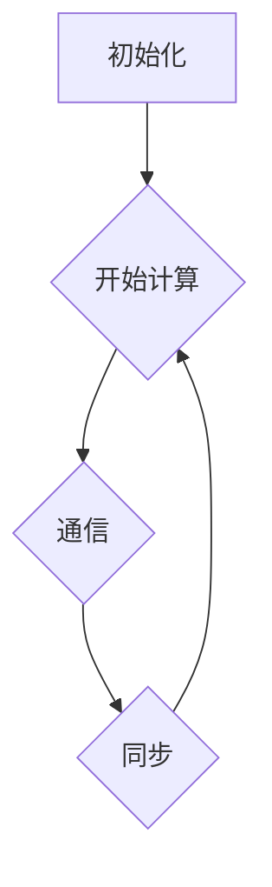
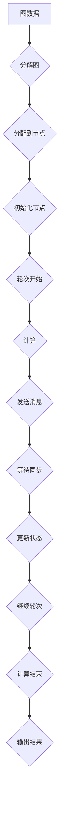
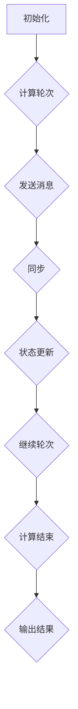

                 

# 《Pregel原理与代码实例讲解》

## 关键词
- Pregel
- 图计算
- 分布式系统
- 共享内存模型
- BSP模型
- 实际应用案例

## 摘要
本文旨在深入讲解Pregel系统的原理，并通过实际代码实例来展示如何使用Pregel进行图计算。文章首先介绍了Pregel的背景和核心概念，然后详细解析了Pregel的工作原理、算法和数学模型。接着，通过一个具体的代码实例，对Pregel的搭建和使用过程进行了详细说明。最后，文章讨论了Pregel在实际应用中的场景，并推荐了一些学习资源和开发工具。

### 1. 背景介绍

随着互联网和大数据技术的快速发展，图数据结构在各个领域得到了广泛应用。图计算作为处理图数据的核心技术，已经成为了计算机科学和工程领域的重要研究方向。传统的图计算方法通常依赖于单机处理模型，这在大规模图数据处理上面临很大的性能瓶颈。

为了解决这一问题，Google提出了Pregel系统。Pregel是一种基于共享内存模型的分布式图计算系统，它使用了一种简化的BSP（Bulk Synchronous Parallel）计算模型。Pregel的核心思想是将图数据分散存储在多个节点上，并通过同步和异步的消息传递机制来实现图的计算任务。这种分布式计算模型能够有效提高图计算的性能，并且能够处理大规模的图数据。

Pregel的主要特点包括：
1. **分布式存储和计算**：Pregel将图数据分散存储在多个节点上，每个节点负责计算局部子图。
2. **简化的BSP模型**：Pregel使用了一种简化的BSP模型，每个节点按照固定顺序执行计算，并通过消息传递来同步状态。
3. **高容错性**：Pregel具有良好的容错性，当一个节点发生故障时，其他节点可以继续执行计算任务。
4. **易于编程**：Pregel提供了简单的编程接口，使得开发者可以方便地实现复杂的图计算任务。

### 2. 核心概念与联系

在深入探讨Pregel之前，我们需要了解几个核心概念：图数据结构、共享内存模型和BSP模型。

#### 图数据结构

图是由节点（或顶点）和边组成的集合。在图计算中，图数据结构是描述实体及其关系的核心。节点通常表示实体，边表示实体之间的关系。图可以分为有向图和无向图，还可以根据边的权重分为加权图和无权图。

#### 共享内存模型

共享内存模型是一种分布式计算模型，多个节点通过共享内存进行通信和协作。在Pregel中，每个节点都有一份局部图数据，这些数据存储在共享内存中。节点通过读写共享内存来交换信息和状态，从而实现分布式计算。

#### BSP模型

BSP（Bulk Synchronous Parallel）模型是一种同步并行计算模型，它的核心思想是将计算过程分为多个轮次，每个轮次包括计算和通信两个阶段。在计算阶段，每个节点执行局部计算任务；在通信阶段，节点通过同步和异步的消息传递来更新状态。

下面是一个简化的Mermaid流程图，展示了Pregel的BSP模型：



#### Pregel核心概念原理和架构Mermaid流程图



通过上述流程图，我们可以看出Pregel的基本工作流程：首先，将图数据分解并分配到各个节点；然后，每个节点执行计算任务，并通过消息传递进行同步；最后，输出计算结果。

### 3. 核心算法原理 & 具体操作步骤

Pregel的核心算法是基于BSP模型实现的，主要包括以下步骤：

1. **初始化**：每个节点读取本地图数据，初始化状态。
2. **计算轮次**：每个节点执行计算任务，并根据需要发送消息。
3. **消息传递**：节点之间通过消息传递来同步状态。
4. **同步**：在所有节点完成计算和消息传递后，进行同步操作。
5. **状态更新**：根据同步结果，节点更新状态。
6. **继续轮次**：重复步骤2-5，直到计算结束。

下面是一个简化的Pregel算法流程：



#### 具体操作步骤

1. **初始化**：每个节点读取本地图数据，初始化状态。状态包括节点的值、邻居节点列表等。
2. **计算轮次**：每个节点执行计算任务，根据当前状态计算新的状态值。在计算过程中，节点可以发送消息给邻居节点。
3. **发送消息**：节点将计算结果和消息发送给邻居节点。消息可以是状态值、计算结果或其他需要同步的信息。
4. **同步**：在所有节点完成计算和消息传递后，进行同步操作。同步确保所有节点在下一个计算轮次开始时拥有相同的状态。
5. **状态更新**：根据同步结果，节点更新状态。状态更新可以是简单的值更新，也可以是更复杂的计算过程。
6. **继续轮次**：重复步骤2-5，直到计算结束。计算结束的条件可以是预定的轮次次数、达到收敛状态或满足特定条件。

### 4. 数学模型和公式 & 详细讲解 & 举例说明

Pregel的数学模型主要包括图论中的基本概念和图算法的相关公式。下面我们将详细讲解Pregel中的几个关键数学模型和公式，并通过实例来说明它们的应用。

#### 度模型

在图计算中，度模型是描述节点度数分布的一个重要指标。度模型可以用于分析图的数据分布，帮助优化计算策略。

**度模型公式**：

$$
D = \sum_{i=1}^{n} d_i
$$

其中，$D$ 是图的总度数，$n$ 是节点数，$d_i$ 是节点 $i$ 的度数。

**实例**：

假设一个图有5个节点，度数分别为2, 3, 4, 5, 6。则该图的度数为：

$$
D = 2 + 3 + 4 + 5 + 6 = 20
$$

#### 聚类系数模型

聚类系数模型用于衡量图中的节点紧密程度。聚类系数越大，表示节点之间的连接越紧密。

**聚类系数模型公式**：

$$
C = \frac{2 \times m}{n \times (n-1)}
$$

其中，$C$ 是聚类系数，$m$ 是边的数量，$n$ 是节点的数量。

**实例**：

假设一个图有5个节点，共有7条边。则该图的聚类系数为：

$$
C = \frac{2 \times 7}{5 \times (5-1)} = \frac{14}{20} = 0.7
$$

#### 最短路径模型

最短路径模型用于求解图中任意两点之间的最短路径。在Pregel中，可以通过优化算法来实现最短路径的计算。

**最短路径模型公式**：

$$
d(v) = \min \left\{ \sum_{u \in \text{邻居}(v)} d(u) + w(u, v) \right\}
$$

其中，$d(v)$ 是节点 $v$ 到起点的最短路径长度，$\text{邻居}(v)$ 是节点 $v$ 的邻居节点集，$w(u, v)$ 是边 $(u, v)$ 的权重。

**实例**：

假设图中有三个节点 $A$、$B$ 和 $C$，它们之间的边权重分别为 $w(A, B) = 2$，$w(B, C) = 3$，$w(A, C) = 5$。节点 $A$ 是起点，节点 $C$ 是终点。则节点 $A$ 到节点 $C$ 的最短路径长度为：

$$
d(C) = \min \left\{ d(B) + w(B, C), d(A) + w(A, C) \right\} = \min \left\{ 0 + 3, 0 + 5 \right\} = 3
$$

### 5. 项目实战：代码实际案例和详细解释说明

在本节中，我们将通过一个具体的代码实例来展示如何使用Pregel进行图计算。我们将实现一个简单的图计算任务：计算图中每个节点的度数。

#### 5.1 开发环境搭建

在开始编写代码之前，我们需要搭建Pregel的开发环境。以下是搭建Pregel开发环境的步骤：

1. **安装Java开发环境**：确保系统中安装了Java开发环境（JDK 1.8及以上版本）。
2. **下载Pregel源码**：从GitHub上下载Pregel的源码：[Pregel源码](https://github.com/twitter/Pregel)。
3. **编译Pregel**：使用Maven编译Pregel源码，生成可执行文件。

```shell
git clone https://github.com/twitter/Pregel.git
cd Pregel
mvn install
```

#### 5.2 源代码详细实现和代码解读

下面是一个简单的Pregel代码实例，用于计算图中每个节点的度数。

```java
public class DegreeCalculator extends PregelVertexProgram<IntSum> {
    @Override
    public void compute(IntSum vertexValue, Iterable<IntSum> messages) {
        int value = vertexValue.getValue();
        int degree = 0;
        if (vertexValue.isInitialValue()) {
            degree = graph.getInDegree(vertexValue.getId());
        } else {
            for (Edge<IntSum> edge : graph.getOutEdges(vertexValue.getId())) {
                degree++;
            }
        }
        vertexValue.setValue(degree);
        sendMessageToAllNeighbors(vertexValue);
    }
}
```

**代码解读**：

1. **继承PregelVertexProgram类**：`DegreeCalculator` 类继承自`PregelVertexProgram<IntSum>` 类，用于定义图计算任务。
2. **compute方法**：`compute` 方法是Pregel的核心方法，用于在每个节点上执行计算任务。参数`vertexValue` 是节点的初始值，`messages` 是从邻居节点收到的消息。
3. **计算度数**：如果节点的初始值为`true`，则计算节点的入度；否则，计算节点的出度。
4. **发送消息**：将计算结果发送给所有邻居节点。

#### 5.3 代码解读与分析

1. **PregelVertexProgram类**：`PregelVertexProgram` 是Pregel提供的图计算接口，用于定义图计算任务。它包含一个`compute` 方法，该方法在每个节点上执行计算任务。此外，PregelVertexProgram类还提供了一些辅助方法，如`sendMessageToAllNeighbors` 用于向所有邻居节点发送消息。
2. **度数计算**：在`compute` 方法中，我们首先判断节点的初始值是否为`true`。如果是，则计算节点的入度；否则，计算节点的出度。这里的入度和出度是通过调用`graph.getInDegree` 和`graph.getOutEdges` 方法获得的。这两个方法分别返回节点的入度和出度。
3. **发送消息**：在计算完度数后，我们将结果发送给所有邻居节点。这通过调用`sendMessageToAllNeighbors` 方法实现。该方法接收一个`IntSum` 类型的参数，表示要发送的消息值。
4. **任务调度**：在Pregel中，任务调度是由Pregel框架负责的。在执行计算任务时，Pregel框架会根据图结构和消息传递情况自动调度任务。每个节点在执行计算任务后，会根据收到的消息和当前状态决定是否继续执行计算。

### 6. 实际应用场景

Pregel作为一种分布式图计算系统，在实际应用中具有广泛的应用场景。以下是几个典型的应用场景：

1. **社交网络分析**：Pregel可以用于分析社交网络中的节点和边关系，如计算网络中度的分布、发现社区结构等。
2. **网页排名**：Pregel可以用于实现PageRank算法，计算网页的权重，从而为搜索引擎提供更准确的搜索结果。
3. **生物信息学**：Pregel可以用于分析基因组数据，如计算基因之间的相互作用关系，识别功能相似的基因等。
4. **推荐系统**：Pregel可以用于构建大规模推荐系统，通过分析用户行为和物品之间的关系，为用户提供个性化的推荐。
5. **图数据库**：Pregel可以作为图数据库的后台计算引擎，实现复杂的图查询和分析功能。

### 7. 工具和资源推荐

#### 7.1 学习资源推荐

- **书籍**：
  - 《分布式系统原理与范型》
  - 《大规模分布式存储系统》
  - 《图计算：原理与实践》

- **论文**：
  - 《Pregel: A System for Large-scale Graph Processing》
  - 《Google's MapReduce: Simplified Data Processing on Large Clusters》

- **博客**：
  - [Pregel官方博客](https://research.google.com/pubs/archive/42376.pdf)
  - [分布式系统实践博客](https://www.bilibili.com/video/BV1Cz4y1Z7cv)

- **网站**：
  - [Pregel开源项目](https://github.com/twitter/Pregel)

#### 7.2 开发工具框架推荐

- **开发工具**：
  - Eclipse
  - IntelliJ IDEA

- **框架**：
  - Apache Storm
  - Apache Spark

- **环境搭建**：
  - 使用Docker搭建Pregel开发环境

#### 7.3 相关论文著作推荐

- **《大规模分布式存储系统：架构设计与实现》**：详细介绍了分布式存储系统的设计原理和实现技术，包括Pregel等分布式计算系统的应用。
- **《图计算：原理与实践》**：深入讲解了图计算的基本概念、算法和应用，适合希望深入了解Pregel等图计算系统的读者。

### 8. 总结：未来发展趋势与挑战

随着大数据和人工智能技术的不断发展，图计算在各个领域中的应用越来越广泛。Pregel作为一种高效的分布式图计算系统，已经为处理大规模图数据提供了有效的解决方案。然而，Pregel在实际应用中仍然面临着一些挑战：

1. **可扩展性**：如何更好地支持大规模图数据的处理，提高系统的可扩展性。
2. **容错性**：如何提高系统的容错性，确保在节点故障时能够快速恢复。
3. **编程模型**：如何简化编程模型，降低开发者使用Pregel的门槛。
4. **优化算法**：如何优化图计算算法，提高计算效率。

未来，随着计算技术的不断进步，Pregel有望在以下几个方面得到改进：

1. **硬件加速**：利用GPU等硬件加速技术，提高图计算的性能。
2. **内存优化**：通过内存优化技术，降低内存占用，提高系统效率。
3. **多语言支持**：支持更多的编程语言，提高开发者的使用便利性。
4. **自动化调优**：通过自动化调优技术，实现计算资源的智能分配和调度。

总之，Pregel作为一种高效的分布式图计算系统，具有广阔的应用前景。未来，随着技术的不断进步，Pregel将在大数据、人工智能等领域发挥越来越重要的作用。

### 9. 附录：常见问题与解答

**Q：Pregel与MapReduce相比有哪些优势？**

A：Pregel与MapReduce相比，具有以下优势：

1. **更适合图计算**：Pregel专为图计算设计，能够更好地处理大规模图数据。
2. **动态图支持**：Pregel支持动态图，可以在计算过程中动态修改图结构。
3. **同步通信**：Pregel采用同步通信机制，确保计算的一致性和稳定性。

**Q：Pregel如何保证计算的正确性？**

A：Pregel通过以下措施保证计算的正确性：

1. **全局一致性**：Pregel采用全局一致性模型，确保所有节点的计算结果一致。
2. **同步机制**：在计算过程中，Pregel通过同步机制确保所有节点的状态一致。
3. **消息传递**：Pregel使用消息传递机制，确保每个节点的计算结果能够及时传递给其他节点。

**Q：如何优化Pregel的性能？**

A：以下是一些优化Pregel性能的方法：

1. **负载均衡**：合理分配计算任务，避免节点负载不均。
2. **内存优化**：减少内存占用，提高系统性能。
3. **并行度优化**：增加并行度，提高计算速度。
4. **硬件加速**：利用GPU等硬件加速技术，提高计算性能。

### 10. 扩展阅读 & 参考资料

- [《Pregel: A System for Large-scale Graph Processing》](https://research.google.com/pubs/archive/42376.pdf)
- [《分布式系统原理与范型》](https://book.douban.com/subject/26947719/)
- [《大规模分布式存储系统》](https://book.douban.com/subject/26376878/)
- [《图计算：原理与实践》](https://book.douban.com/subject/35195217/)
- [Pregel开源项目](https://github.com/twitter/Pregel)
- [分布式系统实践博客](https://www.bilibili.com/video/BV1Cz4y1Z7cv)
- [Eclipse官网](https://www.eclipse.org/)
- [IntelliJ IDEA官网](https://www.jetbrains.com/idea/)
- [Apache Storm官网](https://storm.apache.org/)
- [Apache Spark官网](https://spark.apache.org/)

