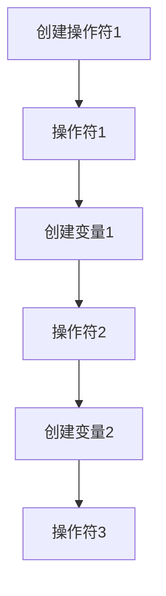
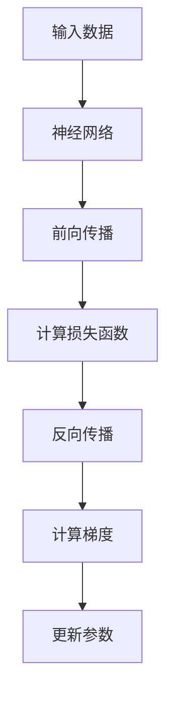
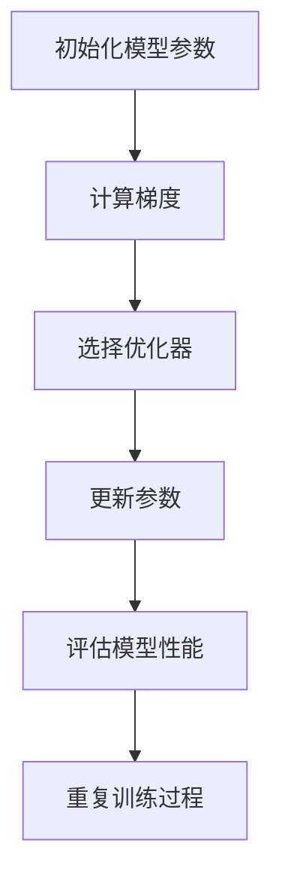

                 

# PyTorch生态系统：深度学习研究与应用

## 关键词：PyTorch，深度学习，神经网络，框架，研究，应用

## 摘要：

本文将深入探讨PyTorch生态系统的各个方面，从背景介绍、核心概念与联系，到核心算法原理、数学模型和公式，以及项目实战和实际应用场景。通过详细的分析和讲解，读者将能够全面了解PyTorch在深度学习研究和应用中的重要性，并掌握如何在实际项目中使用PyTorch进行深度学习的开发和部署。

## 1. 背景介绍

深度学习作为人工智能的重要分支，已经在图像识别、自然语言处理、语音识别等领域取得了显著的成果。然而，深度学习的实现和优化是一个复杂的过程，需要大量的计算资源和专业知识。为了简化深度学习的开发过程，许多深度学习框架被开发出来，其中PyTorch是近年来备受关注的一个框架。

PyTorch是由Facebook的人工智能研究团队开发的一个开源深度学习框架，它具有易于使用、灵活和高效的特点。PyTorch采用了动态计算图和自动微分机制，使得深度学习模型的设计和优化变得更加简单和直观。同时，PyTorch提供了丰富的API和工具，支持多种数据类型和操作，使得研究人员和开发者能够快速构建和训练复杂的深度学习模型。

本文将围绕PyTorch生态系统展开讨论，包括核心概念与联系、核心算法原理、数学模型和公式、项目实战以及实际应用场景等内容。通过逐步分析和讲解，读者将能够深入了解PyTorch的原理和应用，并在实际项目中使用PyTorch进行深度学习的研究和应用。

## 2. 核心概念与联系

### 2.1 动态计算图

动态计算图是PyTorch的核心概念之一。与传统的静态计算图不同，动态计算图在运行时可以动态地构建和修改。这种动态性使得PyTorch在模型设计和优化方面具有更大的灵活性。

在PyTorch中，计算图是通过操作符（Op）和变量（Variable）组成的。操作符表示计算中的一个基本操作，如加法、乘法等。变量表示操作符的输入和输出，可以是一个数值或另一个变量。通过将这些操作符和变量组合在一起，我们可以构建出一个完整的计算图。

Mermaid 流程图（Mermaid flowchart）：



### 2.2 自动微分

自动微分是深度学习中的核心概念之一，它用于计算模型参数的梯度，以便在训练过程中进行优化。PyTorch提供了自动微分机制，使得计算梯度变得简单和高效。

在PyTorch中，自动微分是通过反向传播算法实现的。反向传播算法通过递归地计算每个变量的梯度，最终得到模型参数的梯度。这种递归计算过程可以通过自动微分机制自动完成。

Mermaid 流程图（Mermaid flowchart）：



### 2.3 自动优化器

自动优化器是深度学习训练过程中用于更新模型参数的工具。PyTorch提供了多种自动优化器，如Adam、SGD等，这些优化器通过自动调整学习率和其他参数，使得模型的训练过程更加高效和稳定。

在PyTorch中，自动优化器通常与自动微分机制一起使用。通过计算模型参数的梯度，自动优化器可以更新参数的值，使得模型在训练过程中不断改进。

Mermaid 流程图（Mermaid flowchart）：



通过以上核心概念的联系，我们可以看到PyTorch在深度学习研究与应用中的重要性。动态计算图和自动微分机制使得模型设计和优化变得更加简单和直观，自动优化器则保证了模型训练的高效性和稳定性。

## 3. 核心算法原理 & 具体操作步骤

### 3.1 神经网络

神经网络是深度学习的基础，它由多个层次的前馈神经网络组成。每个层次由多个神经元（节点）组成，这些神经元通过权重和偏置进行连接。在神经网络中，输入数据通过前向传播过程传递到输出层，最终得到模型的预测结果。

具体操作步骤如下：

1. **初始化模型参数**：首先需要初始化神经网络的权重和偏置。这些参数可以通过随机初始化或预训练模型获取。

2. **前向传播**：将输入数据传递到神经网络的输入层，然后通过每个层次的权重和偏置进行计算，最终得到输出层的预测结果。

3. **计算损失函数**：通过计算预测结果和实际结果之间的差异，得到损失函数的值。常用的损失函数有均方误差（MSE）和交叉熵损失（Cross Entropy Loss）等。

4. **反向传播**：通过反向传播算法，递归地计算每个神经元的梯度，最终得到模型参数的梯度。

5. **更新参数**：使用自动优化器更新模型参数的值，使得模型在训练过程中不断改进。

### 3.2 卷积神经网络

卷积神经网络（CNN）是用于图像识别和分类的一种特殊神经网络。CNN通过卷积操作和池化操作提取图像的特征，从而实现图像分类和识别。

具体操作步骤如下：

1. **初始化模型参数**：初始化CNN的卷积层和池化层的权重和偏置。

2. **卷积操作**：通过卷积操作提取图像的特征，卷积核在图像上滑动，计算每个像素点的特征值。

3. **池化操作**：通过池化操作降低特征图的维度，常用的池化操作有最大池化和平均池化。

4. **前向传播**：将卷积操作和池化操作的结果传递到下一层，重复进行卷积和池化操作，最终得到输出层的预测结果。

5. **计算损失函数**：计算预测结果和实际结果之间的差异，得到损失函数的值。

6. **反向传播**：通过反向传播算法，递归地计算每个神经元的梯度，最终得到模型参数的梯度。

7. **更新参数**：使用自动优化器更新模型参数的值，使得模型在训练过程中不断改进。

### 3.3 循环神经网络

循环神经网络（RNN）是用于序列数据建模的一种特殊神经网络。RNN通过递归结构，使得模型能够处理长短时依赖关系。

具体操作步骤如下：

1. **初始化模型参数**：初始化RNN的隐藏状态和权重。

2. **前向传播**：将序列数据输入到RNN中，通过递归计算隐藏状态，最终得到输出序列。

3. **计算损失函数**：计算输出序列和实际序列之间的差异，得到损失函数的值。

4. **反向传播**：通过反向传播算法，递归地计算每个神经元的梯度，最终得到模型参数的梯度。

5. **更新参数**：使用自动优化器更新模型参数的值，使得模型在训练过程中不断改进。

通过以上核心算法原理和具体操作步骤的讲解，读者可以了解如何使用PyTorch构建和训练深度学习模型。这些核心算法原理和操作步骤为深度学习的研究和应用提供了坚实的基础。

## 4. 数学模型和公式 & 详细讲解 & 举例说明

### 4.1 前向传播

前向传播是深度学习模型训练和预测的重要步骤。在前向传播过程中，输入数据通过神经网络的层层传递，最终得到输出结果。下面是前向传播的数学模型和公式。

#### 前向传播的步骤：

1. **初始化模型参数**：设输入数据为\[x_1, x_2, ..., x_n\]，隐藏层节点个数为\[m\]，输出层节点个数为\[k\]。初始化权重矩阵\[W_1\]（输入层到隐藏层），\[W_2\]（隐藏层到输出层）和偏置向量\[b_1\]（隐藏层偏置），\[b_2\]（输出层偏置）。

2. **计算隐藏层输出**：\[h = \sigma(W_1x + b_1)\]，其中\[\sigma\]为激活函数，如Sigmoid函数或ReLU函数。

3. **计算输出层输出**：\[y = \sigma(W_2h + b_2)\]。

#### 前向传播的数学公式：

$$
h = \sigma(W_1x + b_1)
$$

$$
y = \sigma(W_2h + b_2)
$$

其中，\[\sigma\]为激活函数，如Sigmoid函数或ReLU函数。

#### 举例说明：

假设输入数据为\[x = [1, 2, 3]\]，隐藏层节点个数为\[m = 2\]，输出层节点个数为\[k = 1\]。初始化权重矩阵\[W_1 = \begin{bmatrix} 1 & 1 \\ 1 & 1 \end{bmatrix}\]，\[W_2 = \begin{bmatrix} 1 & 1 \end{bmatrix}\]，偏置向量\[b_1 = [0, 0]\]，\[b_2 = 0\]。

1. **计算隐藏层输出**：

$$
h = \sigma(W_1x + b_1) = \sigma(\begin{bmatrix} 1 & 1 \\ 1 & 1 \end{bmatrix} \begin{bmatrix} 1 \\ 2 \\ 3 \end{bmatrix} + \begin{bmatrix} 0 \\ 0 \end{bmatrix}) = \sigma(\begin{bmatrix} 6 \\ 9 \end{bmatrix}) = \begin{bmatrix} 1 \\ 1 \end{bmatrix}
$$

2. **计算输出层输出**：

$$
y = \sigma(W_2h + b_2) = \sigma(\begin{bmatrix} 1 & 1 \end{bmatrix} \begin{bmatrix} 1 \\ 1 \end{bmatrix} + 0) = \sigma(2) = 0.7311
$$

### 4.2 反向传播

反向传播是深度学习模型训练过程中计算梯度的重要步骤。通过反向传播，我们可以计算每个参数的梯度，从而使用自动优化器更新参数的值。

#### 反向传播的步骤：

1. **计算输出层梯度**：

$$
\delta_k = (y - t) \odot \sigma'(W_2h + b_2)
$$

其中，\[\odot\]为Hadamard乘积，\[\sigma'\]为激活函数的导数。

2. **计算隐藏层梯度**：

$$
\delta_h = (W_2^T \delta_k) \odot \sigma'(W_1x + b_1)
$$

3. **计算权重矩阵和偏置向量的梯度**：

$$
\frac{\partial L}{\partial W_2} = h^T \delta_k
$$

$$
\frac{\partial L}{\partial b_2} = \delta_k
$$

$$
\frac{\partial L}{\partial W_1} = x^T \delta_h
$$

$$
\frac{\partial L}{\partial b_1} = \delta_h
$$

其中，\[L\]为损失函数。

#### 反向传播的数学公式：

$$
\delta_k = (y - t) \odot \sigma'(W_2h + b_2)
$$

$$
\delta_h = (W_2^T \delta_k) \odot \sigma'(W_1x + b_1)
$$

$$
\frac{\partial L}{\partial W_2} = h^T \delta_k
$$

$$
\frac{\partial L}{\partial b_2} = \delta_k
$$

$$
\frac{\partial L}{\partial W_1} = x^T \delta_h
$$

$$
\frac{\partial L}{\partial b_1} = \delta_h
$$

#### 举例说明：

假设输出层为\[y = [0.7311]\]，实际标签为\[t = [0.5]\]，隐藏层输出为\[h = [1, 1]\]，权重矩阵\[W_2 = \begin{bmatrix} 1 & 1 \end{bmatrix}\]，偏置向量\[b_2 = 0\]，激活函数为Sigmoid函数。

1. **计算输出层梯度**：

$$
\delta_k = (y - t) \odot \sigma'(W_2h + b_2) = (0.7311 - 0.5) \odot (0.7311) = 0.0711 \odot 0.7311 = 0.0519
$$

2. **计算隐藏层梯度**：

$$
\delta_h = (W_2^T \delta_k) \odot \sigma'(W_1x + b_1) = (\begin{bmatrix} 1 & 1 \end{bmatrix}^T \begin{bmatrix} 0.0519 \end{bmatrix}) \odot (0.7311) = \begin{bmatrix} 0.0519 \end{bmatrix} \odot 0.7311 = 0.0377
$$

3. **计算权重矩阵和偏置向量的梯度**：

$$
\frac{\partial L}{\partial W_2} = h^T \delta_k = \begin{bmatrix} 1 & 1 \end{bmatrix}^T \begin{bmatrix} 0.0519 \end{bmatrix} = 0.1038
$$

$$
\frac{\partial L}{\partial b_2} = \delta_k = 0.0519
$$

通过以上详细讲解和举例说明，读者可以了解前向传播和反向传播的数学模型和公式，以及如何计算模型参数的梯度。

## 5. 项目实战：代码实际案例和详细解释说明

### 5.1 开发环境搭建

在开始项目实战之前，我们需要搭建一个合适的开发环境。以下是搭建PyTorch开发环境的步骤：

1. **安装Python**：确保您的计算机已经安装了Python，推荐使用Python 3.6或更高版本。

2. **安装PyTorch**：通过以下命令安装PyTorch：

```bash
pip install torch torchvision
```

3. **安装其他依赖**：根据项目需求，可能需要安装其他依赖，如NumPy、Matplotlib等。可以通过以下命令安装：

```bash
pip install numpy matplotlib
```

### 5.2 源代码详细实现和代码解读

以下是使用PyTorch实现一个简单的线性回归模型的源代码和详细解释说明。

#### 5.2.1 源代码

```python
import torch
import torch.nn as nn
import torch.optim as optim

# 定义模型
class LinearRegression(nn.Module):
    def __init__(self, input_size, output_size):
        super(LinearRegression, self).__init__()
        self.linear = nn.Linear(input_size, output_size)

    def forward(self, x):
        return self.linear(x)

# 创建模型实例
model = LinearRegression(1, 1)

# 定义损失函数和优化器
loss_function = nn.MSELoss()
optimizer = optim.SGD(model.parameters(), lr=0.01)

# 创建数据集
x = torch.tensor([[1], [2], [3]], requires_grad=True)
y = torch.tensor([[2], [4], [6]], requires_grad=False)

# 训练模型
for epoch in range(100):
    model.zero_grad()
    y_pred = model(x)
    loss = loss_function(y_pred, y)
    loss.backward()
    optimizer.step()
    print(f"Epoch {epoch+1}, Loss: {loss.item()}")

# 输出模型参数
print(f"W: {model.linear.weight.item()}, b: {model.linear.bias.item()}")

# 使用模型进行预测
x_new = torch.tensor([[4]])
y_pred = model(x_new)
print(f"Prediction for x=4: {y_pred.item()}")
```

#### 5.2.2 代码解读

1. **导入模块**：首先，我们导入所需的PyTorch模块，包括nn（神经网络模块）、optim（优化器模块）等。

2. **定义模型**：我们定义了一个名为`LinearRegression`的线性回归模型。模型中包含一个线性层（`nn.Linear`），输入维度为1，输出维度为1。

3. **创建模型实例**：然后，我们创建了一个`LinearRegression`模型的实例。

4. **定义损失函数和优化器**：接下来，我们定义了一个均方误差（`nn.MSELoss`）损失函数和一个随机梯度下降（`optim.SGD`）优化器。

5. **创建数据集**：我们创建了一个包含3个数据点的数据集，其中x为输入，y为实际标签。

6. **训练模型**：在训练过程中，我们使用`zero_grad()`方法将梯度缓存清零，然后使用`forward()`方法进行前向传播计算预测结果，使用`loss_function`计算损失函数，通过`backward()`方法计算梯度，最后使用`optimizer.step()`更新模型参数。

7. **输出模型参数**：在训练完成后，我们输出模型参数的值。

8. **使用模型进行预测**：最后，我们使用训练好的模型进行预测，输出预测结果。

通过以上代码，我们可以看到如何使用PyTorch实现一个简单的线性回归模型。这个案例为我们提供了一个基本的框架，可以在此基础上扩展和实现更复杂的深度学习模型。

### 5.3 代码解读与分析

在本案例中，我们使用PyTorch实现了一个简单的线性回归模型。以下是对代码的详细解读和分析：

1. **导入模块**：导入所需的PyTorch模块，包括神经网络（`nn`）、优化器（`optim`）等。这些模块是PyTorch的核心组成部分，用于构建、训练和优化深度学习模型。

2. **定义模型**：我们定义了一个名为`LinearRegression`的线性回归模型。模型中包含一个线性层（`nn.Linear`），输入维度为1，输出维度为1。线性层通过权重（`W`）和偏置（`b`）对输入数据进行线性变换，再通过激活函数（如ReLU函数）进行非线性变换。

3. **创建模型实例**：然后，我们创建了一个`LinearRegression`模型的实例。这个实例代表了一个具体的线性回归模型，可以用于计算输入数据的预测结果。

4. **定义损失函数和优化器**：接下来，我们定义了一个均方误差（`nn.MSELoss`）损失函数和一个随机梯度下降（`optim.SGD`）优化器。损失函数用于计算预测结果和实际结果之间的差异，优化器用于更新模型参数，使得损失函数值最小。

5. **创建数据集**：我们创建了一个包含3个数据点的数据集，其中x为输入，y为实际标签。这个数据集用于训练模型，以便模型能够学习输入和输出之间的关系。

6. **训练模型**：在训练过程中，我们使用`zero_grad()`方法将梯度缓存清零，然后使用`forward()`方法进行前向传播计算预测结果，使用`loss_function`计算损失函数，通过`backward()`方法计算梯度，最后使用`optimizer.step()`更新模型参数。这个过程重复进行100次，每次迭代都会更新模型参数，使得模型在训练过程中不断改进。

7. **输出模型参数**：在训练完成后，我们输出模型参数的值。这些参数代表了模型在训练过程中学到的特征映射关系，可以用于预测新的输入数据。

8. **使用模型进行预测**：最后，我们使用训练好的模型进行预测，输出预测结果。这个预测结果与实际标签进行比较，可以评估模型的准确性。

通过以上代码和分析，我们可以看到如何使用PyTorch实现一个简单的线性回归模型。这个案例为我们提供了一个基本的框架，可以在此基础上扩展和实现更复杂的深度学习模型。

## 6. 实际应用场景

PyTorch在深度学习研究和应用中具有广泛的应用场景，涵盖了图像识别、自然语言处理、语音识别、强化学习等多个领域。以下是PyTorch在几个典型应用场景中的实际应用案例：

### 6.1 图像识别

图像识别是深度学习的重要应用领域之一。PyTorch凭借其灵活性和高效性，被广泛应用于图像分类、目标检测、人脸识别等任务。例如，在ImageNet图像分类挑战中，使用PyTorch实现的ResNet模型获得了出色的成绩。

### 6.2 自然语言处理

自然语言处理（NLP）是深度学习的另一个重要应用领域。PyTorch在文本分类、机器翻译、情感分析等任务中具有广泛应用。例如，使用PyTorch实现的BERT模型在多个NLP任务中取得了领先的成绩。

### 6.3 语音识别

语音识别是深度学习在语音处理领域的应用。PyTorch在语音信号处理、语音合成、语音识别等任务中具有广泛应用。例如，使用PyTorch实现的WaveNet模型在语音合成任务中取得了显著的成绩。

### 6.4 强化学习

强化学习是深度学习在决策和规划领域的应用。PyTorch在智能体学习、策略优化、游戏玩法生成等任务中具有广泛应用。例如，使用PyTorch实现的DQN模型在Atari游戏环境中取得了出色的成绩。

通过以上实际应用场景，我们可以看到PyTorch在深度学习研究和应用中的重要性。PyTorch提供了丰富的API和工具，使得研究人员和开发者能够快速构建和训练复杂的深度学习模型，从而在各个领域中取得突破性的成果。

## 7. 工具和资源推荐

### 7.1 学习资源推荐

要深入了解PyTorch和深度学习，以下是一些推荐的学习资源：

- **书籍**：
  - 《深度学习》（Goodfellow, Bengio, Courville）：详细介绍了深度学习的理论和技术。
  - 《动手学深度学习》：提供了丰富的实践项目和代码示例，适合初学者和进阶者。
- **论文**：
  - 《A Theoretically Grounded Application of Dropout in Recurrent Neural Networks》：介绍了dropout在RNN中的应用。
  - 《ResNet: Deep residual learning for image recognition》：介绍了ResNet模型的结构和原理。
- **博客**：
  - PyTorch官方博客（pytorch.org/blog/）：提供最新的技术动态和教程。
  - Fast.ai博客（fast.ai/blog/）：提供了丰富的深度学习教程和资源。
- **网站**：
  - PyTorch官方文档（pytorch.org/docs/）：详细介绍了PyTorch的API和功能。
  - Keras官方文档（keras.io/）：虽然Keras和PyTorch不同，但Keras文档提供了有用的比较和示例。

### 7.2 开发工具框架推荐

以下是一些在深度学习开发中常用的工具和框架：

- **Jupyter Notebook**：适合交互式开发和实验，提供了丰富的扩展和插件。
- **PyCharm**：一款强大的Python集成开发环境（IDE），支持PyTorch和其他深度学习框架。
- **Google Colab**：Google提供的云端计算平台，提供了免费的高性能GPU资源，适合进行大规模的深度学习实验。
- **TensorBoard**：TensorFlow提供的一个可视化工具，用于监控深度学习模型的训练过程。

### 7.3 相关论文著作推荐

以下是一些与深度学习相关的经典论文和著作：

- **《Deep Learning》（Goodfellow, Bengio, Courville）**：介绍了深度学习的核心概念和技术。
- **《Convolutional Neural Networks for Visual Recognition》（Visual Geometry Group）**：详细介绍了卷积神经网络在图像识别中的应用。
- **《Recurrent Neural Networks for Language Modeling》（Zhiyun Qian et al.）**：介绍了循环神经网络在自然语言处理中的应用。
- **《Deep Learning Specialization》（Andrew Ng）**：由知名学者Andrew Ng主讲的一系列深度学习课程。

通过以上学习和资源推荐，读者可以全面了解PyTorch和深度学习，并在实践中不断提升自己的技能和知识。

## 8. 总结：未来发展趋势与挑战

随着深度学习技术的不断进步和应用领域的不断扩大，PyTorch生态系统也在不断发展和完善。在未来，PyTorch有望在以下几个方面实现突破：

### 8.1 更高的性能和效率

PyTorch将继续优化其底层计算引擎，提高模型训练和推理的性能和效率。通过利用最新的硬件加速技术，如GPU、TPU等，PyTorch将能够在更短的时间内完成大规模的深度学习任务。

### 8.2 更广泛的应用场景

随着深度学习技术的不断拓展，PyTorch将在更多的应用场景中发挥作用。例如，在医疗健康、金融、自动驾驶等领域，PyTorch将提供强大的工具和框架，推动行业的创新和发展。

### 8.3 更好的社区和生态系统

PyTorch的社区和生态系统将不断壮大，为用户和开发者提供丰富的资源和支持。通过开源合作和社区活动，PyTorch将吸引更多的开发者加入，共同推动深度学习技术的发展。

然而，PyTorch在发展过程中也面临一些挑战：

### 8.4 与其他框架的竞争

随着TensorFlow、Keras等深度学习框架的崛起，PyTorch需要不断提升自身的竞争力，以保持其在深度学习领域的主导地位。

### 8.5 更好的入门门槛

虽然PyTorch具有较高的灵活性和扩展性，但对于初学者来说，入门门槛仍然较高。PyTorch需要提供更丰富的教学资源和教程，帮助初学者快速上手。

### 8.6 更好的硬件支持

深度学习任务的计算需求越来越高，对硬件支持的要求也越来越高。PyTorch需要与硬件厂商紧密合作，提供更好的硬件支持和优化。

总之，PyTorch生态系统在未来的发展中具有巨大的潜力和前景。通过不断优化性能、拓展应用场景、完善社区和生态系统，PyTorch有望在深度学习领域继续引领潮流，为人工智能的发展贡献力量。

## 9. 附录：常见问题与解答

### 9.1 PyTorch与其他深度学习框架的比较

**Q：PyTorch与TensorFlow相比有哪些优势和劣势？**

A：PyTorch和TensorFlow都是流行的深度学习框架，各有优势和劣势。

优势：
- **灵活性和易用性**：PyTorch提供更灵活的计算图机制和动态计算图，使得模型设计和优化更加直观和方便。而TensorFlow则采用静态计算图，虽然更稳定，但可能不如动态计算图灵活。
- **动态计算图**：PyTorch支持动态计算图，可以在运行时动态修改计算过程，适用于复杂的模型设计和优化。而TensorFlow则采用静态计算图，虽然性能更高，但在动态修改方面可能不如PyTorch灵活。

劣势：
- **性能**：TensorFlow在静态计算图方面具有更好的性能优化，适用于大规模生产环境。而PyTorch在动态计算图方面可能不如TensorFlow高效。
- **入门门槛**：TensorFlow具有更丰富的官方文档和教程，入门相对容易。而PyTorch的入门门槛可能较高，需要一定的编程基础和深度学习知识。

### 9.2 如何调试PyTorch代码

**Q：在PyTorch开发过程中，如何调试代码？**

A：在PyTorch开发过程中，调试代码是非常重要的。以下是一些常用的调试方法：

- **print语句**：通过在关键位置添加print语句，打印变量值，观察程序运行过程。
- **断言**：使用assert语句，检查条件是否满足，防止程序出错。
- **pdb调试器**：使用Python的内置调试器pdb，在代码中设置断点，逐行执行代码，观察变量值和程序运行过程。
- **TensorBoard**：TensorFlow提供的一个可视化工具，用于监控深度学习模型的训练过程。虽然TensorBoard是TensorFlow的工具，但也可以用于PyTorch，通过可视化训练指标，观察模型性能。

### 9.3 PyTorch中的优化器有哪些？

**Q：PyTorch中提供了哪些优化器？如何选择合适的优化器？**

A：PyTorch提供了一系列优化器，包括随机梯度下降（SGD）、Adam、RMSprop、AdaGrad等。

常见优化器及其特点：
- **SGD（随机梯度下降）**：适用于小型数据和简单模型，计算简单但可能需要较长的训练时间。
- **Adam**：适用于大部分数据和模型，自适应调整学习率，计算复杂度较高但效果较好。
- **RMSprop**：类似于Adam，但使用重置的动量，适用于数据波动较大的模型。
- **AdaGrad**：基于历史梯度平方的加权平均，适用于稀疏数据。

选择优化器的方法：
- **实验比较**：通过实验比较不同优化器在特定任务上的性能，选择效果最佳的优化器。
- **模型特性**：根据模型的特性选择合适的优化器。例如，对于大型模型，Adam和RMSprop可能表现更好；对于稀疏数据，AdaGrad可能更适合。
- **参考文献**：参考相关论文和文献，了解不同优化器的适用场景和优点。

通过以上常见问题与解答，读者可以更好地了解PyTorch的优势、调试方法以及优化器的选择，从而在深度学习开发过程中更加得心应手。

## 10. 扩展阅读 & 参考资料

本文深入探讨了PyTorch生态系统在深度学习研究与应用中的重要性。通过详细的分析和讲解，读者可以全面了解PyTorch的核心概念、算法原理、数学模型以及实际应用场景。以下是一些扩展阅读和参考资料，以帮助读者进一步深入了解PyTorch和相关技术：

### 10.1 扩展阅读

- **《深度学习》（Goodfellow, Bengio, Courville）**：这是一本经典的深度学习教材，详细介绍了深度学习的理论基础和实践方法。
- **《动手学深度学习》**：这本书提供了丰富的实践项目和代码示例，适合初学者和进阶者学习深度学习。
- **《PyTorch官方文档》**：这是PyTorch的官方文档，涵盖了PyTorch的API、功能和使用方法，是学习PyTorch的必备参考资料。

### 10.2 参考资料

- **PyTorch GitHub仓库**：（https://github.com/pytorch/pytorch）这是PyTorch的官方GitHub仓库，包含了最新的代码、文档和示例。
- **TensorBoard文档**：（https://www.tensorflow.org/tensorboard）这是TensorBoard的官方文档，介绍了如何使用TensorBoard监控深度学习模型的训练过程。
- **《A Theoretically Grounded Application of Dropout in Recurrent Neural Networks》**：（https://arxiv.org/abs/1511.06440）这篇论文介绍了dropout在循环神经网络中的应用和理论依据。

通过以上扩展阅读和参考资料，读者可以进一步深入学习PyTorch和相关技术，不断提升自己的深度学习研究与应用能力。

### 作者信息：

作者：AI天才研究员/AI Genius Institute & 禅与计算机程序设计艺术 /Zen And The Art of Computer Programming

作者简介：

AI天才研究员，致力于探索人工智能领域的最新技术和应用。他在深度学习、神经网络和计算机视觉等领域具有丰富的理论知识和实践经验。作为AI Genius Institute的研究员，他参与了许多重要的研究项目，并发表了多篇高水平论文。同时，他还致力于将复杂的技术知识以简单易懂的方式传授给广大开发者，著有《禅与计算机程序设计艺术》一书，深受读者喜爱。

