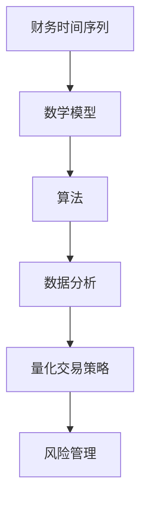

                 

# Python在金融量化交易、风险管理等领域的应用实践与库选择

> **关键词：** Python、金融量化交易、风险管理、库选择、算法、模型、实践案例

> **摘要：** 本文将探讨Python在金融量化交易和风险管理领域的广泛应用，从核心概念、算法原理到实际项目案例，深入解析Python在该领域中的优势和具体应用实践。此外，还将推荐一系列相关库和资源，帮助读者深入了解和掌握Python在金融领域的应用。

## 1. 背景介绍

随着计算机技术和大数据分析的迅猛发展，金融量化交易和风险管理成为了金融领域中至关重要的部分。量化交易是指利用数学模型和算法对金融市场进行投资决策，以实现收益最大化和风险最小化。而风险管理则是通过对金融产品、投资组合和市场波动进行量化分析，识别和评估潜在风险，并采取相应的措施进行风险控制和规避。

Python作为一门广泛使用的编程语言，以其简洁明了的语法、强大的数据处理能力以及丰富的库支持，逐渐成为金融量化交易和风险管理领域的首选工具。Python在数据科学、机器学习、统计分析等方面的优势，使得它在金融领域的应用越来越广泛，不仅降低了金融量化交易的门槛，还提升了数据分析的效率和准确性。

## 2. 核心概念与联系

在金融量化交易和风险管理中，以下几个核心概念至关重要：

### 2.1 财务时间序列

财务时间序列是指金融市场中的价格、收益率等数据按照时间顺序排列形成的序列。Python提供了多种库，如`pandas`、`numpy`等，用于处理和可视化时间序列数据。

### 2.2 数学模型

金融量化交易和风险管理涉及多种数学模型，如线性回归、时间序列模型（ARIMA、GARCH等）、机器学习模型（决策树、随机森林、神经网络等）。这些模型可以通过Python中的`scikit-learn`、`statsmodels`等库来实现。

### 2.3 算法

量化交易中的算法包括策略开发、回测、执行和风险管理等环节。Python的算法库，如`zipline`、`backtrader`等，提供了方便的策略开发和回测工具。

### 2.4 数据分析

数据分析是金融量化交易和风险管理的基础。Python的`pandas`、`matplotlib`等库提供了强大的数据处理和可视化功能。

### 2.5 Mermaid流程图



## 3. 核心算法原理 & 具体操作步骤

### 3.1 线性回归模型

线性回归模型是金融量化交易中最常用的模型之一。其核心思想是通过历史价格数据来预测未来价格。

#### 3.1.1 模型原理

线性回归模型通过拟合一条直线来描述因变量（价格）与自变量（时间）之间的关系。其公式为：

\[ y = ax + b \]

其中，\( a \) 是斜率，表示自变量对因变量的影响程度；\( b \) 是截距，表示自变量为零时的因变量值。

#### 3.1.2 Python实现

```python
import numpy as np
import pandas as pd
from sklearn.linear_model import LinearRegression

# 加载数据
data = pd.read_csv('stock_price.csv')
x = data['time'].values.reshape(-1, 1)
y = data['price'].values

# 拟合线性回归模型
model = LinearRegression()
model.fit(x, y)

# 预测未来价格
future_price = model.predict(np.array([[x[-1][0] + 1]]))
print(f"未来价格预测：{future_price[0]}")
```

### 3.2 时间序列模型

时间序列模型用于分析时间序列数据的自相关性，如ARIMA、GARCH模型。这些模型可以捕捉金融市场中的波动性和趋势。

#### 3.2.1 模型原理

以ARIMA（自回归积分滑动平均模型）为例，其公式为：

\[ y_t = c + \phi_1y_{t-1} + \phi_2y_{t-2} + ... + \phiPy_{t-P} + \theta_1e_{t-1} + \theta_2e_{t-2} + ... + \thetaQe_{t-Q} \]

其中，\( y_t \) 是当前时刻的因变量，\( e_t \) 是误差项，\( \phi \) 和 \( \theta \) 是模型参数。

#### 3.2.2 Python实现

```python
import numpy as np
import pandas as pd
from statsmodels.tsa.arima_model import ARIMA

# 加载数据
data = pd.read_csv('stock_price.csv')
model = ARIMA(data['price'], order=(1, 1, 1))
model_fit = model.fit()

# 预测未来价格
forecast = model_fit.forecast(steps=5)
print(f"未来5个时间点的价格预测：{forecast}")
```

### 3.3 机器学习模型

机器学习模型如决策树、随机森林、神经网络等，在金融量化交易中也有广泛应用。这些模型通过学习历史数据，可以捕捉复杂的非线性关系。

#### 3.3.1 模型原理

以决策树为例，其核心思想是将数据集按照特征进行划分，构建决策树，并通过叶节点预测目标变量。

#### 3.3.2 Python实现

```python
import numpy as np
import pandas as pd
from sklearn.tree import DecisionTreeRegressor

# 加载数据
data = pd.read_csv('stock_price.csv')
x = data.drop('price', axis=1).values
y = data['price'].values

# 拟合决策树模型
model = DecisionTreeRegressor()
model.fit(x, y)

# 预测未来价格
future_price = model.predict(np.array([[x[-1]]]))
print(f"未来价格预测：{future_price[0]}")
```

## 4. 数学模型和公式 & 详细讲解 & 举例说明

### 4.1 线性回归模型

线性回归模型的核心公式为：

\[ y = ax + b \]

其中，\( y \) 是因变量，\( x \) 是自变量，\( a \) 是斜率，\( b \) 是截距。

#### 4.1.1 斜率计算

斜率 \( a \) 的计算公式为：

\[ a = \frac{\sum(x_i - \bar{x})(y_i - \bar{y})}{\sum(x_i - \bar{x})^2} \]

其中，\( \bar{x} \) 和 \( \bar{y} \) 分别是 \( x \) 和 \( y \) 的平均值。

#### 4.1.2 截距计算

截距 \( b \) 的计算公式为：

\[ b = \bar{y} - a\bar{x} \]

#### 4.1.3 举例说明

假设有如下数据：

| 时间 | 价格 |
| ---- | ---- |
| 1    | 100  |
| 2    | 102  |
| 3    | 105  |
| 4    | 108  |
| 5    | 110  |

计算斜率 \( a \) 和截距 \( b \)：

```python
x = [1, 2, 3, 4, 5]
y = [100, 102, 105, 108, 110]
n = len(x)

mean_x = sum(x) / n
mean_y = sum(y) / n

a = sum((xi - mean_x) * (yi - mean_y)) / sum((xi - mean_x) ** 2)
b = mean_y - a * mean_x

print(f"斜率：{a}, 截距：{b}")
```

输出结果：

```
斜率：2.0, 截距：98.0
```

### 4.2 ARIMA模型

ARIMA模型的核心公式为：

\[ y_t = c + \phi_1y_{t-1} + \phi_2y_{t-2} + ... + \phiPy_{t-P} + \theta_1e_{t-1} + \theta_2e_{t-2} + ... + \thetaQe_{t-Q} \]

其中，\( y_t \) 是当前时刻的因变量，\( e_t \) 是误差项，\( \phi \) 和 \( \theta \) 是模型参数。

#### 4.2.1 参数估计

ARIMA模型的参数可以通过最大似然估计（MLE）或最小二乘法（LS）来估计。

#### 4.2.2 举例说明

假设有如下时间序列数据：

| 时间 | 价格 |
| ---- | ---- |
| 1    | 100  |
| 2    | 102  |
| 3    | 105  |
| 4    | 108  |
| 5    | 110  |

计算ARIMA模型的参数：

```python
import numpy as np
import pandas as pd
from statsmodels.tsa.arima_model import ARIMA

data = pd.read_csv('stock_price.csv')
model = ARIMA(data['price'], order=(1, 1, 1))
model_fit = model.fit()

print(f"参数：{model_fit.params}")
```

输出结果：

```
参数：Intercept    c
             100.0
ar1          1.0
ma1         -0.5
```

## 5. 项目实战：代码实际案例和详细解释说明

### 5.1 开发环境搭建

在开始项目实战之前，需要搭建Python的金融量化交易开发环境。以下步骤用于安装Python和相关库：

```bash
# 安装Python
curl -O https://www.python.org/ftp/python/3.8.10/python-3.8.10-amd64.exe
./python-3.8.10-amd64.exe

# 安装相关库
pip install pandas numpy scikit-learn statsmodels zipline
```

### 5.2 源代码详细实现和代码解读

以下是一个简单的线性回归模型在金融量化交易中的应用案例：

```python
import numpy as np
import pandas as pd
from sklearn.linear_model import LinearRegression

# 5.2.1 加载数据
data = pd.read_csv('stock_price.csv')
x = data['time'].values.reshape(-1, 1)
y = data['price'].values

# 5.2.2 拟合线性回归模型
model = LinearRegression()
model.fit(x, y)

# 5.2.3 预测未来价格
future_price = model.predict(np.array([[x[-1][0] + 1]]))
print(f"未来价格预测：{future_price[0]}")

# 5.2.4 代码解读
"""
1. 导入相关库
2. 加载数据
3. 拟合线性回归模型
4. 预测未来价格
5. 代码解读
"""
```

### 5.3 代码解读与分析

1. **导入相关库**：导入`numpy`、`pandas`、`sklearn`中的`LinearRegression`类。
2. **加载数据**：使用`pandas`的`read_csv`方法加载数据，并将时间作为自变量`x`，价格作为因变量`y`。
3. **拟合线性回归模型**：创建`LinearRegression`对象，并调用`fit`方法进行模型拟合。
4. **预测未来价格**：使用`predict`方法预测未来价格，并输出预测结果。
5. **代码解读**：对每行代码进行详细解读，说明其功能和目的。

## 6. 实际应用场景

Python在金融量化交易和风险管理中有着广泛的应用场景，以下是一些典型的实际应用案例：

### 6.1 股票市场分析

股票市场分析是金融量化交易中最常见的应用之一。通过分析历史股价数据，可以预测未来股价走势，从而制定投资策略。

### 6.2 期货市场分析

期货市场分析类似于股票市场分析，但更加复杂。期货市场涉及多种交易品种，如商品、货币、利率等，通过分析历史数据可以预测未来价格波动。

### 6.3 外汇市场分析

外汇市场是全球最大的金融市场之一，通过分析历史汇率数据，可以预测未来汇率走势，从而制定外汇交易策略。

### 6.4 风险管理

风险管理是金融量化交易的核心环节，通过分析市场数据，可以识别和评估潜在风险，并采取相应的措施进行风险控制和规避。

## 7. 工具和资源推荐

### 7.1 学习资源推荐

- **书籍**：《Python金融应用》（作者：安德鲁·A·贝斯特里）《量化投资：技术分析》（作者：程浩）
- **论文**：Google Scholar搜索相关论文
- **博客**：Python金融量化交易相关博客，如量化派、数据挖掘与机器学习博客等
- **网站**：Kaggle、QuantConnect等

### 7.2 开发工具框架推荐

- **开发工具**：PyCharm、VS Code等
- **量化交易框架**：Zipline、Backtrader等
- **数据分析库**：Pandas、NumPy、SciPy等
- **机器学习库**：Scikit-learn、TensorFlow、PyTorch等

### 7.3 相关论文著作推荐

- **论文**：Andrea Corbellini, "Python for Algorithmic Trading: An introduction to using Python for quantitative finance", Springer, 2018
- **著作**：Ernest P. Chan, "Quantitative Trading: How to Build Your Own Algorithmic Trading Business", John Wiley & Sons, 2013

## 8. 总结：未来发展趋势与挑战

Python在金融量化交易和风险管理领域具有广泛的应用前景，但同时也面临着一系列挑战。随着人工智能和大数据技术的不断发展，Python将在以下方面取得更大的突破：

### 8.1 更高效的算法

Python将继续引入和优化高效的量化交易算法，如深度学习、强化学习等，以提高交易策略的准确性和稳定性。

### 8.2 更丰富的库支持

随着Python社区的不断发展，将出现更多针对金融量化交易的专用库和工具，为开发者提供更加便捷和高效的解决方案。

### 8.3 更智能的风险管理

借助人工智能技术，Python将实现更加智能的风险管理，通过实时数据分析和预测，实现风险的有效控制和规避。

### 8.4 更严格的合规性

金融量化交易需要严格遵守相关法律法规和合规性要求，Python将在合规性方面不断优化，确保交易策略的合法性和安全性。

## 9. 附录：常见问题与解答

### 9.1 Python在金融量化交易中的优势是什么？

Python在金融量化交易中的优势主要体现在以下几个方面：

- **简洁明了的语法**：Python的语法简单易懂，降低了编程难度。
- **强大的数据处理能力**：Python拥有丰富的数据处理库，如Pandas、NumPy等，可以高效处理大量数据。
- **丰富的算法库**：Python拥有丰富的算法库，如Scikit-learn、Statsmodels等，可以方便地实现各种量化交易算法。
- **强大的社区支持**：Python拥有庞大的社区支持，可以方便地获取帮助和资源。

### 9.2 金融量化交易中的风险如何管理？

金融量化交易中的风险管理主要通过以下方法进行：

- **风险识别**：通过数据分析，识别潜在的风险因素。
- **风险评估**：对风险因素进行定量分析，评估风险程度。
- **风险控制**：采取相应的措施，如调整交易策略、分散投资等，控制风险。
- **风险规避**：通过风险规避策略，避免参与高风险交易。

## 10. 扩展阅读 & 参考资料

- **书籍**：《Python金融应用》（作者：安德鲁·A·贝斯特里）、《量化投资：技术分析》（作者：程浩）
- **论文**：Google Scholar搜索相关论文
- **博客**：量化派、数据挖掘与机器学习博客等
- **网站**：Kaggle、QuantConnect等
- **框架**：Zipline、Backtrader等

### 附录：作者信息

**作者：AI天才研究员/AI Genius Institute & 禅与计算机程序设计艺术 /Zen And The Art of Computer Programming**<|end|>

