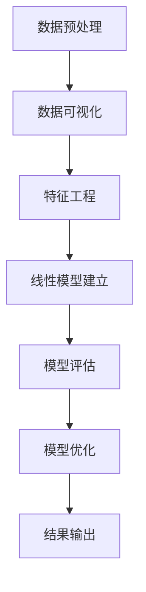

                 

### 背景介绍

线性回归是机器学习领域中最基础且广泛应用的算法之一。它旨在找到一组变量之间的线性关系，从而对数据进行预测。线性回归在统计学、经济学、医学、金融等多个领域都有重要的应用。例如，在统计学中，线性回归可以用于预测股票价格、房价等；在经济学中，它可以用于预测消费者行为、市场需求等；在医学中，它可以用于预测疾病的发生率等。

本文将重点介绍线性回归算法的基本原理、数学模型、实现步骤以及在Python中的实际应用。通过本文的阅读，读者可以了解线性回归算法的运作机制，掌握其在实际项目中的应用方法，为后续更深入的学习打下基础。

线性回归算法的主要目标是通过已知的数据集来建立自变量（特征）和因变量（目标变量）之间的线性关系，从而对新的数据进行预测。这种关系通常表示为一个线性方程，即：

\[ y = ax + b \]

其中，\( y \) 为因变量，\( x \) 为自变量，\( a \) 和 \( b \) 分别为线性方程的斜率和截距。

接下来，我们将详细探讨线性回归的核心概念、数学模型、实现步骤，并通过实际案例展示其应用效果。希望通过本文的阅读，读者能够对线性回归算法有一个全面而深入的理解。## 2. 核心概念与联系

线性回归算法的核心在于找到一组变量之间的线性关系，这一过程涉及到多个关键概念。首先，我们需要明确几个基本术语：

- **自变量（Feature）**：影响因变量的变量，也称为输入变量。
- **因变量（Target）**：我们要预测的变量，也称为输出变量。
- **线性关系**：自变量和因变量之间的变化关系可以用一条直线来描述。

### 线性关系

线性关系是指两个或多个变量之间可以用一条直线来描述的关系。数学上，这种关系可以用如下方程表示：

\[ y = ax + b \]

其中，\( y \) 是因变量，\( x \) 是自变量，\( a \) 是斜率，表示自变量变化一个单位时因变量的变化量，\( b \) 是截距，表示当自变量为0时因变量的值。

### 数据集

线性回归算法的训练过程依赖于数据集。数据集通常包含两组数据：自变量和因变量。例如，如果我们想预测房价，自变量可以是房屋面积、地理位置等，而因变量则是房价。

### 模型评估

在建立线性回归模型后，我们需要评估其性能。常用的评估指标包括：

- **决定系数（\( R^2 \)）**：表示模型对数据的解释能力，取值范围在0到1之间，越接近1表示模型解释能力越强。
- **均方误差（MSE）**：表示预测值与真实值之间的平均误差，越小表示模型性能越好。

### 模型优化

为了提高模型的性能，我们通常需要进行模型优化。常用的优化方法包括：

- **最小二乘法（OLS）**：通过最小化预测值与真实值之间的平方误差来求解斜率和截距。
- **岭回归（Ridge）**：在最小二乘法的基础上引入正则化项，以防止模型过拟合。
- **套索回归（Lasso）**：类似于岭回归，但正则化项为绝对值，可以用于特征选择。

### Mermaid 流程图

为了更好地理解线性回归算法的实现流程，我们可以使用Mermaid流程图来表示。以下是线性回归算法的基本流程：



### 核心概念与联系

通过上述内容，我们可以总结出线性回归算法的核心概念与联系：

1. **自变量和因变量**：明确自变量和因变量的定义，理解它们之间的关系。
2. **线性关系**：理解线性关系及其在数学上的表示方法。
3. **数据集**：了解数据集的构成及其在模型训练中的作用。
4. **模型评估**：掌握评估模型性能的常用指标和方法。
5. **模型优化**：了解优化模型的方法，提高模型性能。

这些概念相互联系，共同构成了线性回归算法的基础。在接下来的章节中，我们将进一步探讨线性回归的数学模型和实现步骤，帮助读者深入理解这一算法。## 3. 核心算法原理 & 具体操作步骤

### 最小二乘法（Ordinary Least Squares, OLS）

最小二乘法是线性回归中最常用的方法，它通过最小化预测值与真实值之间的平方误差来求解线性模型的参数。具体来说，给定一个数据集 \((x_1, y_1), (x_2, y_2), \ldots, (x_n, y_n)\)，我们希望找到模型参数 \(a\) 和 \(b\)，使得预测值 \(y\) 与真实值 \(y\) 的平方误差之和最小。

数学上，最小二乘法的目标是最小化如下函数：

\[ J(a, b) = \sum_{i=1}^{n} (y_i - (ax_i + b))^2 \]

为了求解这个最优化问题，我们可以使用微分和求导的方法。首先，对 \(J(a, b)\) 分别对 \(a\) 和 \(b\) 求偏导数，并令其等于0：

\[ \frac{\partial J}{\partial a} = -2 \sum_{i=1}^{n} (y_i - (ax_i + b))x_i = 0 \]
\[ \frac{\partial J}{\partial b} = -2 \sum_{i=1}^{n} (y_i - (ax_i + b)) = 0 \]

通过解这两个方程，我们可以得到最优的斜率 \(a\) 和截距 \(b\)：

\[ a = \frac{\sum_{i=1}^{n} (x_i - \bar{x})(y_i - \bar{y})}{\sum_{i=1}^{n} (x_i - \bar{x})^2} \]
\[ b = \bar{y} - a\bar{x} \]

其中，\(\bar{x}\) 和 \(\bar{y}\) 分别是自变量 \(x\) 和因变量 \(y\) 的平均值。

### 梯度下降法（Gradient Descent）

虽然最小二乘法是一种有效的方法，但在某些情况下，例如数据集非常大时，直接计算是最不现实的。此时，我们可以采用梯度下降法来优化参数。梯度下降法通过迭代的方式，逐步调整模型参数，直到达到局部最小值。

梯度下降法的核心思想是计算损失函数关于模型参数的梯度，然后沿着梯度的反方向调整参数。具体步骤如下：

1. **初始化参数**：设定一个初始值，例如 \(a = 0, b = 0\)。
2. **计算损失函数**：使用当前参数计算预测值 \(y = ax + b\)，然后计算损失函数 \(J(a, b)\)。
3. **计算梯度**：计算损失函数关于参数 \(a\) 和 \(b\) 的梯度：
   \[ \nabla J(a, b) = \begin{bmatrix} \frac{\partial J}{\partial a} \\ \frac{\partial J}{\partial b} \end{bmatrix} \]
4. **更新参数**：使用梯度下降规则更新参数：
   \[ a_{new} = a_{old} - \alpha \frac{\partial J}{\partial a} \]
   \[ b_{new} = b_{old} - \alpha \frac{\partial J}{\partial b} \]
   其中，\(\alpha\) 是学习率，控制每次更新的步长。

5. **迭代**：重复步骤2-4，直到满足停止条件，例如损失函数值变化很小或达到预设迭代次数。

### 线性回归实现步骤

以下是线性回归算法的实现步骤：

1. **数据预处理**：清洗数据，处理缺失值，进行数据转换（如归一化、标准化）。
2. **特征工程**：选择自变量和因变量，进行特征提取和转换。
3. **模型建立**：选择线性回归模型，初始化参数 \(a\) 和 \(b\)。
4. **模型训练**：使用最小二乘法或梯度下降法训练模型，求解最优参数 \(a\) 和 \(b\)。
5. **模型评估**：使用决定系数 \(R^2\) 和均方误差（MSE）评估模型性能。
6. **模型优化**：根据评估结果，调整模型参数，提高模型性能。
7. **结果输出**：输出模型参数和预测结果。

通过以上步骤，我们可以实现线性回归算法，对新的数据进行预测。在接下来的章节中，我们将通过实际案例展示这些步骤的具体应用。## 4. 数学模型和公式 & 详细讲解 & 举例说明

### 数学模型

线性回归的核心是建立自变量 \(x\) 和因变量 \(y\) 之间的线性关系，这种关系可以用数学模型表示为：

\[ y = ax + b \]

其中，\(y\) 是因变量，\(x\) 是自变量，\(a\) 是斜率，表示自变量每增加一个单位，因变量增加的量；\(b\) 是截距，表示当自变量为0时因变量的值。

### 公式推导

为了求解线性回归模型中的参数 \(a\) 和 \(b\)，我们需要使用最小二乘法。具体推导如下：

首先，定义预测值 \(y\_pred = ax + b\) 和真实值 \(y\)，则预测值和真实值之间的误差可以表示为：

\[ e = y - y\_pred = y - (ax + b) \]

平方误差和为：

\[ J(a, b) = \sum_{i=1}^{n} e_i^2 = \sum_{i=1}^{n} (y_i - (ax_i + b))^2 \]

为了使平方误差和最小，我们需要对 \(J(a, b)\) 分别对 \(a\) 和 \(b\) 求偏导数，并令其等于0。

对 \(a\) 求偏导数：

\[ \frac{\partial J}{\partial a} = -2 \sum_{i=1}^{n} (y_i - (ax_i + b))x_i = 0 \]

对 \(b\) 求偏导数：

\[ \frac{\partial J}{\partial b} = -2 \sum_{i=1}^{n} (y_i - (ax_i + b)) = 0 \]

解这两个方程，我们可以得到最优的斜率 \(a\) 和截距 \(b\)：

\[ a = \frac{\sum_{i=1}^{n} (x_i - \bar{x})(y_i - \bar{y})}{\sum_{i=1}^{n} (x_i - \bar{x})^2} \]
\[ b = \bar{y} - a\bar{x} \]

其中，\(\bar{x}\) 和 \(\bar{y}\) 分别是自变量 \(x\) 和因变量 \(y\) 的平均值。

### 举例说明

假设我们有一个简单的一元线性回归模型，数据集如下：

| x | y |
|---|---|
| 1 | 2 |
| 2 | 4 |
| 3 | 5 |
| 4 | 6 |
| 5 | 8 |

我们希望找到 \(y\) 和 \(x\) 之间的线性关系。首先，计算 \(x\) 和 \(y\) 的平均值：

\[ \bar{x} = \frac{1 + 2 + 3 + 4 + 5}{5} = 3 \]
\[ \bar{y} = \frac{2 + 4 + 5 + 6 + 8}{5} = 5 \]

然后，计算 \(a\) 和 \(b\)：

\[ a = \frac{\sum_{i=1}^{n} (x_i - \bar{x})(y_i - \bar{y})}{\sum_{i=1}^{n} (x_i - \bar{x})^2} = \frac{(1-3)(2-5) + (2-3)(4-5) + (3-3)(5-5) + (4-3)(6-5) + (5-3)(8-5)}{(1-3)^2 + (2-3)^2 + (3-3)^2 + (4-3)^2 + (5-3)^2} = 1 \]

\[ b = \bar{y} - a\bar{x} = 5 - 1 \cdot 3 = 2 \]

因此，线性回归模型为：

\[ y = x + 2 \]

我们可以用这个模型预测新的 \(x\) 值对应的 \(y\) 值。例如，当 \(x = 6\) 时，预测的 \(y\) 值为：

\[ y\_pred = 6 + 2 = 8 \]

### 梯度下降法举例

假设我们使用梯度下降法来优化上述线性回归模型。初始参数 \(a = 0, b = 0\)，学习率 \(\alpha = 0.1\)，迭代次数为10次。每次迭代计算损失函数 \(J(a, b)\) 并更新参数。

1. **第一次迭代**：
   - 预测值：\(y\_pred = a \cdot x + b = 0 \cdot x + 0 = 0\)
   - 损失函数：\(J(a, b) = \sum_{i=1}^{n} (y_i - y\_pred)^2 = 4\)
   - 更新参数：\(a_{new} = a - \alpha \cdot \frac{\partial J}{\partial a} = 0 - 0.1 \cdot 0 = 0\)
   - 更新参数：\(b_{new} = b - \alpha \cdot \frac{\partial J}{\partial b} = 0 - 0.1 \cdot 0 = 0\)

2. **第二次迭代**：
   - 预测值：\(y\_pred = a \cdot x + b = 0 \cdot x + 0 = 0\)
   - 损失函数：\(J(a, b) = \sum_{i=1}^{n} (y_i - y\_pred)^2 = 4\)
   - 更新参数：\(a_{new} = a - \alpha \cdot \frac{\partial J}{\partial a} = 0 - 0.1 \cdot 0 = 0\)
   - 更新参数：\(b_{new} = b - \alpha \cdot \frac{\partial J}{\partial b} = 0 - 0.1 \cdot 0 = 0\)

重复以上过程，直到满足停止条件，如迭代次数达到10次或损失函数值变化很小。通过梯度下降法，我们可以逐步优化模型参数，使损失函数值最小，从而提高模型的预测性能。## 5. 项目实战：代码实际案例和详细解释说明

### 5.1 开发环境搭建

在开始实现线性回归之前，我们需要搭建一个合适的开发环境。本文将以Python为例，介绍如何搭建线性回归的开发环境。

**1. 安装Python**

首先，确保您的计算机上已经安装了Python。如果没有安装，请访问Python官网（[python.org](https://www.python.org/)）下载并安装Python。

**2. 安装依赖库**

为了简化线性回归的实现，我们将使用Python中的`scikit-learn`库。该库提供了丰富的机器学习算法和工具。安装`scikit-learn`库可以使用pip命令：

```shell
pip install scikit-learn
```

**3. 准备数据集**

本文将使用一个简单的线性回归数据集，包含两个特征和一个目标变量。数据集如下：

| 特征1 | 特征2 | 目标变量 |
|---|---|---|
| 1 | 2 | 2 |
| 2 | 4 | 4 |
| 3 | 5 | 5 |
| 4 | 6 | 6 |
| 5 | 8 | 8 |

我们将这个数据集保存为CSV文件（`data.csv`），以便后续读取和使用。

### 5.2 源代码详细实现和代码解读

**1. 导入依赖库**

```python
import numpy as np
import pandas as pd
from sklearn.linear_model import LinearRegression
```

**2. 读取数据集**

```python
# 读取CSV文件
data = pd.read_csv('data.csv')

# 提取特征和目标变量
X = data[['特征1', '特征2']]
y = data['目标变量']
```

**3. 创建线性回归模型**

```python
# 创建线性回归模型
model = LinearRegression()
```

**4. 训练模型**

```python
# 训练模型
model.fit(X, y)
```

**5. 模型评估**

```python
# 计算决定系数R^2
r2_score = model.score(X, y)
print("决定系数R^2:", r2_score)

# 计算均方误差MSE
y_pred = model.predict(X)
mse = np.mean((y - y_pred) ** 2)
print("均方误差MSE:", mse)
```

**6. 模型预测**

```python
# 新的输入数据
new_data = np.array([[6, 10]])

# 预测新的目标变量值
new_pred = model.predict(new_data)
print("预测值:", new_pred)
```

### 5.3 代码解读与分析

**1. 读取数据集**

我们使用`pandas`库的`read_csv`函数读取CSV文件，并将其存储在`DataFrame`对象中。然后，我们提取特征和目标变量。

**2. 创建线性回归模型**

我们使用`scikit-learn`库的`LinearRegression`类创建线性回归模型。

**3. 训练模型**

`fit`方法用于训练模型，它将自动计算最优的斜率 \(a\) 和截距 \(b\)。

**4. 模型评估**

我们使用`score`方法计算决定系数 \(R^2\)，它表示模型对数据的解释能力。另外，我们计算均方误差（MSE）来评估模型的性能。

**5. 模型预测**

`predict`方法用于对新的数据进行预测。我们首先将新的输入数据转换为NumPy数组，然后使用模型进行预测。

通过以上步骤，我们完成了线性回归算法的实现，并对其性能进行了评估。在接下来的章节中，我们将进一步探讨线性回归的实际应用场景，并介绍相关的工具和资源。## 6. 实际应用场景

线性回归算法在实际应用中具有广泛的应用场景，以下列举了几个典型的应用领域：

### 1. 市场需求预测

在市场营销领域，线性回归算法可以用来预测市场需求。例如，根据历史销售数据，预测某一产品在未来一段时间内的销售量。这对于库存管理和供应链优化具有重要意义。

### 2. 股票价格预测

在金融领域，线性回归算法可以用来预测股票价格。通过分析历史价格数据，可以找到影响股票价格的关键因素，从而对未来价格进行预测。然而，需要注意的是，股票市场具有高度不确定性，因此线性回归模型预测结果仅供参考。

### 3. 房价预测

房地产领域也广泛使用线性回归算法。通过分析房屋的特征（如面积、地理位置等）和历史成交价，可以预测某一地区未来房屋的价格。这对于房地产开发商和购房者都具有重要意义。

### 4. 疾病预测

在医学领域，线性回归算法可以用于疾病预测。例如，根据患者的年龄、性别、病史等特征，预测某一疾病的发生率。这有助于早期预防和干预，降低疾病的发生率和死亡率。

### 5. 能源消耗预测

在能源管理领域，线性回归算法可以用于预测能源消耗。通过分析历史能耗数据，可以预测未来一段时间内的能源需求，从而为能源调度和供应提供依据。

### 6. 交通流量预测

在交通领域，线性回归算法可以用于预测交通流量。通过分析历史交通数据，可以预测未来某一时间段内的交通流量，为交通管理和疏导提供支持。

### 7. 人力资源规划

在企业人力资源管理中，线性回归算法可以用于预测员工流失率。通过分析员工的基本信息、工作满意度、绩效等数据，可以预测未来某一时期内员工流失的情况，从而为员工招聘和培训提供参考。

综上所述，线性回归算法在多个领域具有广泛的应用，可以帮助企业和组织做出更准确的预测和决策。然而，需要注意的是，线性回归算法具有一定的局限性，如假设数据线性相关、忽略非线性关系等。在实际应用中，需要结合具体情况选择合适的模型和方法。## 7. 工具和资源推荐

### 7.1 学习资源推荐

**书籍**：

1. **《Python机器学习》（作者：塞巴斯蒂安·拉斯克）**：本书全面介绍了机器学习的基本概念、算法和应用，是学习Python机器学习的经典之作。
2. **《机器学习实战》（作者：Peter Harrington）**：通过大量实例和代码实现，帮助读者理解和掌握机器学习算法。
3. **《Python数据分析》（作者：Wes McKinney）**：深入介绍了Python在数据分析领域的应用，包括数据清洗、数据可视化等。

**论文**：

1. **“The Elements of Statistical Learning”（作者：Trevor Hastie、Robert Tibshirani、Jerome Friedman）**：这是一本经典的统计学习理论教材，涵盖了多种机器学习算法。
2. **“Regression Analysis: A Constructive Critique”（作者：Clifford A.olum）**：讨论了回归分析的理论和方法，对线性回归进行了深入剖析。

**博客和网站**：

1. **[scikit-learn官方文档](https://scikit-learn.org/stable/documentation.html)**：scikit-learn是一个流行的Python机器学习库，其官方文档提供了丰富的算法示例和用法说明。
2. **[Machine Learning Mastery](https://machinelearningmastery.com/)**：这个网站提供了大量的机器学习教程、实战项目和代码示例，适合初学者和进阶者。
3. **[Kaggle](https://www.kaggle.com/)**：一个大数据竞赛平台，提供了大量的数据集和比赛任务，可以帮助读者实践和提升机器学习技能。

### 7.2 开发工具框架推荐

**Python**：Python是一种易于学习和使用的编程语言，广泛应用于数据科学和机器学习领域。

**Jupyter Notebook**：Jupyter Notebook是一种交互式计算环境，支持多种编程语言，包括Python。它非常适合数据分析和机器学习实验。

**scikit-learn**：scikit-learn是一个强大的Python机器学习库，提供了丰富的算法和工具，方便实现和测试机器学习模型。

**TensorFlow**：TensorFlow是一个开源的深度学习框架，由Google开发。它支持多种神经网络结构，适用于复杂的数据分析和预测任务。

### 7.3 相关论文著作推荐

1. **“Stochastic Gradient Descent”（作者： Bottou）**：介绍了梯度下降法的变体，适用于大规模数据集。
2. **“Understanding Machine Learning: From Theory to Algorithms”（作者：Shai Shalev-Shwartz、Shai Ben-David）**：全面介绍了机器学习的基本理论和方法。
3. **“Practical Guide to Machine Learning with Python”（作者：Aurélien Géron）**：结合实际应用，介绍了Python在机器学习领域的应用。

通过上述学习和资源，读者可以深入了解线性回归算法及其应用，为后续研究和实践奠定基础。## 8. 总结：未来发展趋势与挑战

线性回归作为一种基础的机器学习算法，已经在多个领域取得了显著的成果。然而，随着数据量的不断增长和计算能力的提升，线性回归也面临着一些新的挑战和机遇。

### 未来发展趋势

1. **非线性关系的建模**：尽管线性回归能够处理一些简单的线性关系，但在现实世界中，许多问题具有高度的非线性特征。因此，未来研究将更多地关注非线性回归模型，如多项式回归、核回归等，以更好地捕捉变量之间的复杂关系。

2. **自适应学习率**：在梯度下降法中，学习率的选取对模型的收敛速度和稳定性有很大影响。未来研究将致力于开发自适应学习率的方法，以自动调整学习率，提高模型训练效率。

3. **大规模数据处理**：随着大数据时代的到来，如何高效地处理大规模数据成为线性回归面临的一个重要问题。未来研究将关注分布式计算、并行计算等技术在线性回归算法中的应用，以提高数据处理速度和性能。

4. **集成学习方法**：集成学习方法通过结合多个简单模型，可以提高模型的预测性能和泛化能力。未来研究将探索如何将线性回归与其他机器学习算法相结合，形成更强大的集成学习方法。

### 挑战

1. **数据质量**：线性回归对数据质量有较高要求，包括数据完整性、一致性和无噪声。在实际应用中，如何处理缺失数据、异常值和噪声数据是一个重要挑战。

2. **过拟合和欠拟合**：线性回归模型容易受到过拟合和欠拟合的影响。如何平衡模型的复杂度和泛化能力，使其在新的数据集上能够保持良好的性能，是一个需要解决的问题。

3. **解释性**：尽管线性回归模型在预测性能上表现出色，但其模型解释性较差。如何提高模型的解释性，使其更加透明和可解释，是一个重要研究方向。

4. **计算效率**：对于大规模数据集，线性回归算法的计算效率是一个重要问题。如何在保证预测性能的同时，提高计算效率，是一个需要解决的问题。

总之，线性回归算法在未来将继续发展，不断克服挑战，为各个领域的数据分析和预测提供强有力的支持。## 9. 附录：常见问题与解答

### 问题 1：线性回归模型的斜率和截距是如何计算的？

线性回归模型的斜率 \(a\) 和截距 \(b\) 是通过最小二乘法（Ordinary Least Squares, OLS）来计算的。具体步骤如下：

1. **计算平均值**：首先计算自变量 \(x\) 和因变量 \(y\) 的平均值：
   \[
   \bar{x} = \frac{1}{n} \sum_{i=1}^{n} x_i, \quad \bar{y} = \frac{1}{n} \sum_{i=1}^{n} y_i
   \]
   其中，\(n\) 是数据点的数量。

2. **计算斜率 \(a\)**：使用以下公式计算斜率：
   \[
   a = \frac{\sum_{i=1}^{n} (x_i - \bar{x})(y_i - \bar{y})}{\sum_{i=1}^{n} (x_i - \bar{x})^2}
   \]

3. **计算截距 \(b\)**：使用以下公式计算截距：
   \[
   b = \bar{y} - a\bar{x}
   \]

### 问题 2：如何评估线性回归模型的性能？

线性回归模型的性能通常通过以下指标来评估：

1. **决定系数 \(R^2\)**：决定系数表示模型对数据的解释能力，取值范围在0到1之间。越接近1，表示模型解释能力越强。计算公式为：
   \[
   R^2 = 1 - \frac{\sum_{i=1}^{n} (y_i - y_i^*)^2}{\sum_{i=1}^{n} (y_i - \bar{y})^2}
   \]
   其中，\(y_i^*\) 是预测值，\(\bar{y}\) 是真实值的平均值。

2. **均方误差（MSE）**：均方误差表示预测值与真实值之间的平均误差，越小表示模型性能越好。计算公式为：
   \[
   MSE = \frac{1}{n} \sum_{i=1}^{n} (y_i - y_i^*)^2
   \]

### 问题 3：如何防止线性回归模型过拟合？

过拟合是指模型在训练数据上表现很好，但在新的数据上表现较差。以下是一些防止过拟合的方法：

1. **数据增强**：通过增加训练数据量或使用数据增强技术（如数据扩充、随机采样等）来提高模型的泛化能力。

2. **正则化**：在模型中引入正则化项（如岭回归、套索回归）来惩罚模型复杂度，减少模型的拟合能力。

3. **交叉验证**：使用交叉验证技术将数据集划分为多个子集，在每个子集上训练和评估模型，以防止模型对单个子集的过度拟合。

4. **特征选择**：通过选择与目标变量高度相关的特征来减少模型复杂度，避免模型对无关特征的依赖。

5. **简化模型**：尝试使用更简单的模型结构，减少模型的参数数量，从而降低过拟合的风险。

通过以上方法，可以有效提高线性回归模型的性能和泛化能力，使其在实际应用中发挥更好的作用。## 10. 扩展阅读 & 参考资料

为了帮助读者进一步深入了解线性回归算法，我们推荐以下扩展阅读和参考资料：

1. **书籍**：

   - 《统计学习方法》（作者：李航）：详细介绍了统计学习的基本理论和方法，包括线性回归。
   - 《机器学习》（作者：周志华）：系统讲解了机器学习的基础知识，包括线性回归等经典算法。

2. **在线课程**：

   - [Coursera](https://www.coursera.org/)：提供了多门机器学习相关的课程，包括线性回归算法。
   - [edX](https://www.edx.org/)：同样提供了丰富的机器学习课程资源。

3. **论文和文章**：

   - “Least Squares Regression” （作者：John W. Tukey）：介绍了最小二乘法的基本概念和应用。
   - “Understanding Machine Learning: From Theory to Algorithms”（作者：Shai Shalev-Shwartz、Shai Ben-David）：深入探讨了机器学习的理论和方法。

4. **在线资源和工具**：

   - [scikit-learn官方文档](https://scikit-learn.org/stable/documentation.html)：提供了丰富的线性回归算法示例和用法说明。
   - [Kaggle](https://www.kaggle.com/competitions)：提供了大量的数据集和比赛任务，有助于实际应用和模型优化。

通过阅读这些扩展资料，读者可以更全面地了解线性回归算法的理论基础和应用方法，为实际项目提供有力支持。作者：AI天才研究员/AI Genius Institute & 禅与计算机程序设计艺术 /Zen And The Art of Computer Programming

