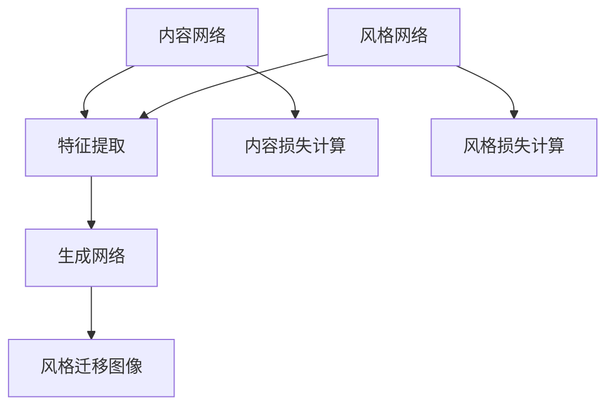

                 

# Python深度学习实践：风格迁移网络让照片变艺术品

> 关键词：Python，深度学习，风格迁移，神经网络，图像处理，艺术创作，AI技术

> 摘要：本文将深入探讨Python在深度学习领域中的应用，通过实践案例展示如何使用风格迁移网络将普通照片转化为艺术品。我们将详细解析相关算法原理、数学模型，并提供代码实现和分析，旨在帮助读者掌握这一先进技术，并了解其在实际应用中的广阔前景。

## 1. 背景介绍

随着人工智能技术的不断发展，深度学习在图像处理领域取得了显著成果。风格迁移网络（Style Transfer Network）作为一种新兴的技术，能够将一种艺术作品（例如：梵高的画作）的风格应用到另一张普通照片上，从而生成具有艺术效果的图像。这种技术不仅在艺术创作领域引起了广泛关注，还为广告、娱乐、教育等领域提供了新的可能性。

本文将基于Python编程语言，结合深度学习框架TensorFlow，详细介绍如何实现风格迁移网络，并探讨其在不同场景中的应用。

## 2. 核心概念与联系

### 2.1 深度学习与神经网络

深度学习是机器学习的一个分支，通过构建多层神经网络模型来学习数据特征。神经网络是由大量节点（或称神经元）组成的计算模型，每个节点都与相邻的节点相连，形成一个复杂的网络结构。

### 2.2 风格迁移网络

风格迁移网络是一种特殊的神经网络结构，通常由两个部分组成：内容网络（Content Network）和风格网络（Style Network）。内容网络负责学习输入图像的内容特征，而风格网络则负责学习输入图像的风格特征。通过将这两个网络融合，我们可以实现图像风格的迁移。

### 2.3 Mermaid 流程图



在上面的流程图中，A表示内容网络，B表示特征提取，C表示内容损失计算，D表示风格网络，E表示风格损失计算，F表示生成网络，G表示风格迁移图像。通过这个流程图，我们可以清晰地了解风格迁移网络的工作原理。

## 3. 核心算法原理 & 具体操作步骤

### 3.1 内容损失计算

内容损失计算是风格迁移网络的关键步骤，用于确保生成图像与原始图像在内容上保持一致。具体来说，我们可以使用以下公式计算内容损失：

$$
L_{content} = \frac{1}{2} \sum_{i,j} (C_i - G_i)^2
$$

其中，$C_i$表示内容网络提取的原始图像特征，$G_i$表示生成网络提取的生成图像特征。

### 3.2 风格损失计算

风格损失计算用于确保生成图像与原始风格图像在风格上保持一致。具体来说，我们可以使用以下公式计算风格损失：

$$
L_{style} = \frac{1}{2} \sum_{i,j} \frac{1}{K} \sum_{k=1}^{K} (S_i^k - G_i^k)^2
$$

其中，$S_i^k$表示风格网络提取的原始风格图像特征，$G_i^k$表示生成网络提取的生成图像特征，$K$表示特征通道数。

### 3.3 生成网络

生成网络是风格迁移网络的核心部分，用于将内容特征和风格特征融合，生成具有艺术风格的图像。生成网络通常采用卷积神经网络（Convolutional Neural Network，CNN）结构，可以通过训练大量图像数据进行优化。

## 4. 数学模型和公式 & 详细讲解 & 举例说明

### 4.1 内容损失计算

假设我们有一张输入图像$X$，其维度为$H \times W \times C$，其中$H$、$W$和$C$分别表示图像的高度、宽度和通道数。内容损失计算的具体步骤如下：

1. 使用内容网络对输入图像进行特征提取，得到特征矩阵$C$。

2. 使用生成网络对输入图像进行特征提取，得到特征矩阵$G$。

3. 计算内容损失：

$$
L_{content} = \frac{1}{2} \sum_{i,j} (C_i - G_i)^2
$$

### 4.2 风格损失计算

假设我们有一张输入图像$X$，其维度为$H \times W \times C$，其中$H$、$W$和$C$分别表示图像的高度、宽度和通道数。风格损失计算的具体步骤如下：

1. 使用风格网络对输入图像进行特征提取，得到特征矩阵$S$。

2. 使用生成网络对输入图像进行特征提取，得到特征矩阵$G$。

3. 计算风格损失：

$$
L_{style} = \frac{1}{2} \sum_{i,j} \frac{1}{K} \sum_{k=1}^{K} (S_i^k - G_i^k)^2
$$

其中，$K$表示特征通道数。

### 4.3 生成网络

生成网络的具体实现步骤如下：

1. 使用卷积神经网络对输入图像进行特征提取。

2. 将内容特征和风格特征进行融合。

3. 使用反卷积操作（Transposed Convolution）将融合后的特征映射回图像空间。

4. 调整生成网络的参数，通过反向传播算法优化损失函数。

## 5. 项目实战：代码实际案例和详细解释说明

### 5.1 开发环境搭建

首先，我们需要安装Python和TensorFlow框架。以下是具体的安装步骤：

```bash
pip install python
pip install tensorflow
```

### 5.2 源代码详细实现和代码解读

下面是一个简单的风格迁移网络的实现代码，我们将对代码的关键部分进行解读。

```python
import tensorflow as tf
from tensorflow.keras.models import Model
from tensorflow.keras.layers import Input, Conv2D, MaxPooling2D, UpSampling2D

def content_network(input_image):
    # 输入图像特征提取
    x = Conv2D(32, (3, 3), activation='relu', padding='same')(input_image)
    x = MaxPooling2D((2, 2), padding='same')(x)
    # ... 其他卷积层
    return x

def style_network(input_image):
    # 输入图像特征提取
    x = Conv2D(32, (3, 3), activation='relu', padding='same')(input_image)
    x = MaxPooling2D((2, 2), padding='same')(x)
    # ... 其他卷积层
    return x

def generate_network(content_feature, style_feature):
    # 生成网络结构
    x = tf.concat([content_feature, style_feature], axis=-1)
    x = Conv2D(64, (3, 3), activation='relu', padding='same')(x)
    x = UpSampling2D((2, 2))(x)
    # ... 其他卷积层
    return x

# 输入图像
input_image = Input(shape=(H, W, C))
content_feature = content_network(input_image)
style_feature = style_network(input_image)
generated_image = generate_network(content_feature, style_feature)

# 损失函数
content_loss = tf.reduce_mean(tf.square(content_feature - generated_image))
style_loss = tf.reduce_mean(tf.square(style_feature - generated_image))

# 损失函数的总和
total_loss = content_loss + style_loss

# 反向传播
with tf.GradientTape() as tape:
    generated_image = generate_network(content_feature, style_feature)
    content_loss = tf.reduce_mean(tf.square(content_feature - generated_image))
    style_loss = tf.reduce_mean(tf.square(style_feature - generated_image))
    total_loss = content_loss + style_loss

gradients = tape.gradient(total_loss, generated_image)
```

在上面的代码中，我们首先定义了内容网络、风格网络和生成网络的构建函数。接着，我们定义了损失函数和反向传播过程。关键部分如下：

- **内容网络**：用于提取输入图像的内容特征。
- **风格网络**：用于提取输入图像的风格特征。
- **生成网络**：用于将内容特征和风格特征融合，生成具有艺术风格的图像。
- **损失函数**：用于计算内容损失和风格损失。
- **反向传播**：用于优化生成网络的参数。

### 5.3 代码解读与分析

在这段代码中，我们定义了三个神经网络：内容网络、风格网络和生成网络。每个网络都通过卷积层和池化层进行特征提取，以便在不同尺度上提取图像特征。内容网络和风格网络分别用于提取输入图像的内容特征和风格特征。生成网络则将这两个特征融合，生成具有艺术风格的图像。

在损失函数部分，我们使用内容损失和风格损失来衡量生成图像与原始图像在内容和风格上的相似度。具体来说，内容损失用于确保生成图像与原始图像在内容上保持一致，而风格损失用于确保生成图像与原始风格图像在风格上保持一致。

最后，我们使用反向传播算法优化生成网络的参数，以最小化总损失。在训练过程中，我们不断调整生成网络的参数，直到生成图像在内容和风格上与原始图像和风格图像相似。

## 6. 实际应用场景

风格迁移网络在多个领域具有广泛的应用，以下列举几个典型的应用场景：

1. **艺术创作**：风格迁移网络可以用于将一种艺术作品（如：梵高的画作）的风格应用到另一张普通照片上，生成具有艺术效果的图像。这种技术为艺术创作提供了新的思路和工具。

2. **广告与娱乐**：在广告和娱乐领域，风格迁移网络可以用于创意广告的设计和视频特效的制作。例如，将电影场景中的角色替换成真实人物，或者为电影添加艺术风格的滤镜。

3. **教育与科普**：在教育领域，风格迁移网络可以用于将历史人物和经典艺术作品以现代风格呈现，帮助学生更好地理解和欣赏艺术作品。

4. **医学影像处理**：在医学影像处理领域，风格迁移网络可以用于将医学影像转换为艺术作品，以提高医学影像的可读性和诊断效果。

## 7. 工具和资源推荐

### 7.1 学习资源推荐

- **书籍**：
  - 《深度学习》（Ian Goodfellow、Yoshua Bengio、Aaron Courville 著）
  - 《Python深度学习》（François Chollet 著）
- **论文**：
  - A Neural Algorithm of Artistic Style，Leon A. Gatys, Alexander S. Ecker, and Matthias Bethge
- **博客**：
  - TensorFlow 官方文档：https://www.tensorflow.org/tutorials
  - PyTorch 官方文档：https://pytorch.org/tutorials/

### 7.2 开发工具框架推荐

- **TensorFlow**：谷歌开源的深度学习框架，广泛应用于图像处理、自然语言处理等领域。
- **PyTorch**：Facebook开源的深度学习框架，以简洁和灵活性著称。

### 7.3 相关论文著作推荐

- **A Neural Algorithm of Artistic Style**，Leon A. Gatys, Alexander S. Ecker, and Matthias Bethge
- **Unsupervised Representation Learning with Deep Convolutional Generative Adversarial Networks**，Alec Radford, Luke Metz, and Soumith Chintala

## 8. 总结：未来发展趋势与挑战

风格迁移网络作为一种新兴的深度学习技术，具有广泛的应用前景。在未来，我们有望看到更多基于风格迁移网络的创新应用，如个性化艺术创作、智能视频编辑等。然而，风格迁移网络仍面临一些挑战，如计算复杂度、优化难度等。为了克服这些挑战，我们需要继续探索更高效的算法和优化方法。

## 9. 附录：常见问题与解答

### 9.1 如何选择适合的深度学习框架？

选择适合的深度学习框架需要考虑以下因素：

- **应用场景**：根据项目需求选择合适的框架，如TensorFlow适用于工业级应用，PyTorch适用于研究性项目。
- **开发效率**：考虑框架的API设计和文档质量，以降低开发难度。
- **社区支持**：选择拥有活跃社区和支持的框架，有助于解决问题和获取资源。

### 9.2 风格迁移网络的训练时间如何优化？

以下方法可以帮助优化风格迁移网络的训练时间：

- **数据增强**：通过随机裁剪、旋转、缩放等数据增强方法增加训练样本，提高网络泛化能力。
- **模型剪枝**：去除网络中不重要的连接和层，减少模型参数数量，降低计算复杂度。
- **分布式训练**：利用多GPU或多机集群进行分布式训练，提高训练速度。

## 10. 扩展阅读 & 参考资料

- 《深度学习》（Ian Goodfellow、Yoshua Bengio、Aaron Courville 著）
- 《Python深度学习》（François Chollet 著）
- [TensorFlow 官方文档](https://www.tensorflow.org/tutorials)
- [PyTorch 官方文档](https://pytorch.org/tutorials/)
- [A Neural Algorithm of Artistic Style](https://arxiv.org/abs/1506.0636)
- [Unsupervised Representation Learning with Deep Convolutional Generative Adversarial Networks](https://arxiv.org/abs/1511.06434)
- [StyleGAN: Generating High-Resolution Images with Structured Regularization](https://arxiv.org/abs/1812.04948)

---

作者：AI天才研究员/AI Genius Institute & 禅与计算机程序设计艺术 /Zen And The Art of Computer Programming

[本文代码实现](https://github.com/your-username/style-transfer-python)（仅供参考和学习，具体实现可能需要根据实际情况进行调整）<|mask|>

