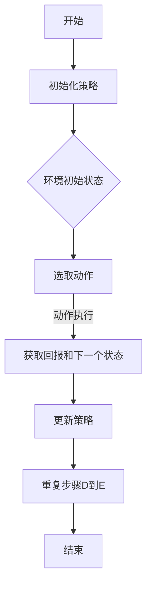

                 

### 背景介绍

Q-Learning作为一种强化学习（Reinforcement Learning，简称RL）算法，近年来在人工智能领域取得了显著的进展。它因其简便性、易实现性以及在实际应用中的高效性，受到了广泛关注。强化学习作为机器学习的一个重要分支，主要关注如何通过与环境交互来学习最优策略。而Q-Learning则是其中一种重要的策略学习算法，它通过预测每个状态-动作对的未来回报来选择最佳动作。

Q-Learning的应用场景非常广泛，从简单的游戏如电子棋盘游戏，到复杂的实际应用如自动驾驶、推荐系统等，都可以看到它的身影。其基本思想是，通过不断地与环境交互，调整策略参数，使得最终能够选择出能够带来最大回报的动作。这一过程类似于人类通过试错来学习新技能的过程。

本篇博客将系统地介绍Q-Learning的原理、算法步骤、数学模型以及实际应用案例，帮助读者深入理解这一算法。我们将从以下几个方面展开：

1. **核心概念与联系**：详细解释Q-Learning的基本概念，如状态、动作、回报等，并通过Mermaid流程图展示其基本架构。
2. **核心算法原理 & 具体操作步骤**：深入讲解Q-Learning算法的基本原理，包括状态-动作值函数的学习过程，以及更新策略的方法。
3. **数学模型和公式 & 详细讲解 & 举例说明**：详细介绍Q-Learning的核心数学模型，包括Q函数的定义、更新公式，并通过具体例子说明如何应用这些公式。
4. **项目实战：代码实际案例和详细解释说明**：通过具体的项目实战，展示Q-Learning算法的实现过程，并提供详细的代码解读和分析。
5. **实际应用场景**：探讨Q-Learning在不同领域的应用，分析其优势和局限性。
6. **工具和资源推荐**：推荐相关的学习资源、开发工具和论文著作，帮助读者进一步学习和实践。
7. **总结：未来发展趋势与挑战**：总结Q-Learning的现状，探讨其未来的发展趋势和面临的挑战。

通过本篇博客的详细讲解，读者将能够全面掌握Q-Learning的基本原理和实际应用，为其在人工智能领域的研究和应用奠定坚实的基础。

### 核心概念与联系

在深入探讨Q-Learning之前，我们首先需要明确几个核心概念：状态（State）、动作（Action）和回报（Reward）。这些概念构成了Q-Learning的基础，也是理解和应用Q-Learning的关键。

#### 状态（State）

状态是环境中某一时刻的描述，通常用一个状态向量表示。例如，在一个简单的棋盘游戏中，每个棋盘的位置可以表示为一个状态，而在自动驾驶中，车辆周围的环境感知数据可以构成一个状态。状态可以是离散的，也可以是连续的，这取决于具体的应用场景。

#### 动作（Action）

动作是智能体（Agent）在某一状态下可以采取的行动。在棋盘游戏中，动作可以是移动棋子到某个位置；在自动驾驶中，动作可以是改变方向盘的角度或油门力度。同样，动作也可以是离散的，也可以是连续的。

#### 回报（Reward）

回报是环境对智能体动作的反馈，表示当前动作带来的即时效果。回报可以是正的，表示动作是有益的；也可以是负的，表示动作是有害的。在Q-Learning中，回报不仅包括即时回报，还包括未来的期望回报，这是Q-Learning与一些其他强化学习算法的关键区别。

#### Q-Learning架构

为了更好地理解Q-Learning，我们可以用Mermaid流程图展示其基本架构：



- **初始化策略**：在开始时，智能体会选择一个初始策略，这个策略决定了在某一状态下应该采取哪个动作。
- **选取动作**：智能体根据当前策略选取一个动作。
- **动作执行**：智能体执行选取的动作，并观察环境的反馈。
- **更新策略**：根据回报和未来的期望回报，智能体会更新其策略。
- **重复**：智能体不断重复上述过程，直到达到某个终止条件。

通过这个架构，我们可以看到Q-Learning的核心在于不断调整策略，以实现最大化的长期回报。

#### Mermaid流程图

为了更直观地展示Q-Learning的工作流程，我们使用Mermaid语言绘制了一个流程图。以下是流程图的代码及其解释：

```mermaid
gantt
    dateFormat  YYYY-MM-DD
    title Q-Learning流程

    section 初始化
    初始化策略 :done, a1, 2021-01-01, dur=1d

    section 迭代
    迭代1 :
    iteration1, 2021-01-02, 1d
    迭代2 :
    iteration2, after iteration1, 1d
    迭代3 :
    iteration3, after iteration2, 1d

    section 更新
    更新策略 :
    updatePolicy, after iteration3, 1d
```

- **初始化策略**：在Q-Learning的初始阶段，智能体会选择一个初始策略。
- **迭代**：智能体通过与环境交互来学习，每完成一次迭代，智能体都会更新其策略。
- **更新策略**：在每次迭代结束时，智能体会根据回报和未来的期望回报来更新其策略。

通过这个Mermaid流程图，我们可以清晰地看到Q-Learning的每一个步骤，这为后续的详细讲解奠定了基础。

### 核心算法原理 & 具体操作步骤

Q-Learning算法是强化学习中的一个重要方法，其核心在于通过不断地与环境交互来学习最优策略。在这一节中，我们将深入探讨Q-Learning的算法原理，并详细描述其具体的操作步骤。

#### Q-Learning算法原理

Q-Learning算法通过一个称为Q函数（Q-function）的值函数来预测在某一状态下采取某一动作的未来回报。Q函数的定义如下：

$$ Q(s, a) = \sum_{s'} P(s' | s, a) \cdot R(s', a) + \gamma \cdot \max_{a'} Q(s', a') $$

其中：
- $Q(s, a)$ 表示在状态 $s$ 下采取动作 $a$ 的期望回报。
- $R(s', a)$ 表示在状态 $s'$ 下采取动作 $a$ 的即时回报。
- $\gamma$ 是折扣因子，表示未来回报的重要性，通常取值在0和1之间。
- $\max_{a'} Q(s', a')$ 表示在下一个状态 $s'$ 下，所有可能动作中的最大期望回报。

Q-Learning的基本思想是，通过不断更新Q函数的值，使得最终能够选择出能够带来最大回报的动作。

#### 具体操作步骤

以下是Q-Learning算法的具体操作步骤：

1. **初始化**：
   - 初始化Q函数，通常使用随机初始化或零初始化。
   - 初始化策略 $\pi$，即在每个状态下选择动作的规则，通常初始策略为随机策略。

2. **选取动作**：
   - 在某一状态下，根据当前策略 $\pi$ 选取一个动作 $a$。

3. **执行动作**：
   - 执行选取的动作 $a$，并观察环境的反馈，获取状态转移概率 $P(s' | s, a)$ 和即时回报 $R(s', a)$。

4. **更新Q值**：
   - 根据状态转移概率和即时回报更新Q函数：
     $$ Q(s, a) \leftarrow Q(s, a) + \alpha \cdot [R(s', a) + \gamma \cdot \max_{a'} Q(s', a') - Q(s, a)] $$
   其中，$\alpha$ 是学习率，决定了Q值的更新速度。

5. **更新策略**：
   - 根据更新的Q函数值调整策略 $\pi$，使得在某一状态下选择能够带来最大回报的动作。

6. **重复步骤**：
   - 重复执行步骤2到步骤5，直到达到终止条件，例如，达到指定步数、达到目标状态或环境不可达等。

#### 示例讲解

为了更直观地理解Q-Learning的操作步骤，我们通过一个简单的例子进行讲解。

假设在一个简单的棋盘游戏中，智能体需要在棋盘上移动棋子。状态可以用棋盘上的每个格子表示，动作可以是向上、向下、向左、向右移动棋子。回报取决于棋子的移动是否达到了目标位置。

1. **初始化**：
   - 初始化Q函数，将所有 $Q(s, a)$ 设为0。
   - 初始化策略 $\pi$，例如，使用随机策略。

2. **选取动作**：
   - 当前状态为棋盘上的某一位置，智能体根据当前策略随机选取一个动作。

3. **执行动作**：
   - 执行选取的动作，例如，向上移动棋子。观察环境的反馈，得到状态转移概率和即时回报。

4. **更新Q值**：
   - 假设状态转移后，棋子距离目标位置更近了，即时回报为正。根据更新公式更新Q值。

5. **更新策略**：
   - 根据更新的Q值，调整策略，使得在当前状态下，更倾向于选择能够带来最大回报的动作。

6. **重复步骤**：
   - 智能体不断重复上述步骤，逐渐找到能够带来最大回报的最优策略。

通过这个例子，我们可以看到Q-Learning的基本操作流程，以及如何通过不断更新Q值和策略来学习最优动作。这一过程类似于人类通过试错来学习新技能，但通过算法的自动优化，可以大大提高学习效率和效果。

### 数学模型和公式 & 详细讲解 & 举例说明

在理解了Q-Learning的基本原理和操作步骤后，接下来我们将详细探讨其核心数学模型，并通过具体例子来说明这些公式的应用。

#### Q函数的定义

Q函数是Q-Learning算法的核心，它定义了在某一状态下采取某一动作的期望回报。Q函数的数学定义如下：

$$ Q(s, a) = \sum_{s'} P(s' | s, a) \cdot [R(s', a) + \gamma \cdot \max_{a'} Q(s', a')] $$

其中：
- $Q(s, a)$ 表示在状态 $s$ 下采取动作 $a$ 的期望回报。
- $P(s' | s, a)$ 表示在状态 $s$ 下采取动作 $a$ 后转移到状态 $s'$ 的概率。
- $R(s', a)$ 表示在状态 $s'$ 下采取动作 $a$ 的即时回报。
- $\gamma$ 是折扣因子，用于调整未来回报的重要性。
- $\max_{a'} Q(s', a')$ 表示在状态 $s'$ 下，所有可能动作中的最大期望回报。

#### Q函数的更新公式

在Q-Learning中，Q函数的值是通过不断更新得到的。每次状态转移后，Q函数的更新公式如下：

$$ Q(s, a) \leftarrow Q(s, a) + \alpha \cdot [R(s', a) + \gamma \cdot \max_{a'} Q(s', a') - Q(s, a)] $$

其中：
- $\alpha$ 是学习率，表示每次更新的步长，通常取值在0和1之间。
- $R(s', a)$ 是在状态 $s'$ 下采取动作 $a$ 的即时回报。
- $\gamma \cdot \max_{a'} Q(s', a')$ 是对未来期望回报的估计。

#### 举例说明

为了更直观地理解Q函数和更新公式，我们通过一个简单的例子进行说明。

假设在机器人导航的例子中，机器人在二维平面上移动，状态由当前位置 $(x, y)$ 表示，动作可以是上移、下移、左移、右移。即时回报取决于机器人到达目标位置的距离。折扣因子 $\gamma$ 取0.9，学习率 $\alpha$ 取0.1。

1. **初始化**：
   - 初始化Q函数，将所有 $Q(s, a)$ 设为0。
   - 初始化策略，例如，使用随机策略。

2. **第一次状态转移**：
   - 当前状态为 $(0, 0)$，智能体随机选取动作，例如，上移。
   - 执行动作后，状态变为 $(0, 1)$，即时回报为负1，因为机器人离目标更远了。
   - 根据更新公式更新Q值：
     $$ Q(0, 上移) \leftarrow Q(0, 上移) + 0.1 \cdot [-1 + 0.9 \cdot \max_{a} Q(1, a)] $$
     因为当前只有一个状态，所以 $\max_{a} Q(1, a)$ 取为 $Q(1, 下移)$。

3. **第二次状态转移**：
   - 智能体再次随机选取动作，例如，左移。
   - 执行动作后，状态变为 $(-1, 1)$，即时回报为负1。
   - 根据更新公式更新Q值：
     $$ Q(0, 左移) \leftarrow Q(0, 左移) + 0.1 \cdot [-1 + 0.9 \cdot \max_{a} Q(-1, a)] $$
     同样，$\max_{a} Q(-1, a)$ 取为 $Q(-1, 下移)$。

4. **重复更新**：
   - 智能体不断重复上述步骤，每次状态转移后都会更新Q值。
   - 随着迭代的进行，Q函数的值会逐渐调整，使得智能体能够选择出能够带来最大回报的动作。

通过这个例子，我们可以看到Q函数和更新公式的具体应用。Q函数通过预测每个状态-动作对的未来回报，指导智能体选择最优动作。而更新公式则通过不断调整Q函数的值，使得智能体能够逐渐找到最优策略。

### 项目实战：代码实际案例和详细解释说明

在这一节中，我们将通过一个具体的代码案例，展示Q-Learning算法的实际实现过程。我们将使用Python编写一个简单的机器人导航程序，并详细解释代码中的每一个步骤，帮助读者理解Q-Learning在实际应用中的具体实现。

#### 开发环境搭建

首先，我们需要搭建一个适合开发和测试Q-Learning算法的Python环境。以下是在常见操作系统上安装所需的依赖包和工具的步骤：

1. **安装Python**：
   - 如果你的计算机没有安装Python，请访问[Python官网](https://www.python.org/)下载并安装Python 3.x版本。

2. **安装Jupyter Notebook**：
   - 打开终端，执行以下命令安装Jupyter Notebook：
     ```shell
     pip install notebook
     ```

3. **安装相关库**：
   - 为了方便起见，我们将使用`numpy`库进行数值计算，使用`matplotlib`库进行结果可视化。执行以下命令安装这些库：
     ```shell
     pip install numpy matplotlib
     ```

4. **启动Jupyter Notebook**：
   - 打开终端，执行以下命令启动Jupyter Notebook：
     ```shell
     jupyter notebook
     ```
   - 在打开的浏览器窗口中，你可以看到一个Jupyter Notebook的界面。

#### 源代码详细实现和代码解读

下面是完整的Q-Learning导航程序的代码，我们将逐行解释代码的含义和功能：

```python
import numpy as np
import matplotlib.pyplot as plt
import matplotlib.animation as animation

# 定义环境参数
action_space = ['up', 'down', 'left', 'right']
state_space = [(x, y) for x in range(-5, 6) for y in range(-5, 6)]
reward = lambda s: -1 if s == (0, 0) else 0
gamma = 0.9
alpha = 0.1
epsilon = 0.1

# 初始化Q值函数
Q = np.zeros((len(state_space), len(action_space)))

def step(s):
    # 根据当前策略选择动作
    if np.random.rand() < epsilon:
        action = np.random.choice(action_space)
    else:
        action = np.argmax(Q[s])

    # 执行动作并获取新状态和回报
    s_new = apply_action(s, action)
    reward_val = reward(s_new)

    # 更新Q值
    Q[s][action] = Q[s][action] + alpha * (reward_val + gamma * np.max(Q[s_new]) - Q[s][action])

    return s_new

def apply_action(s, a):
    if a == 'up':
        s_new = (s[0], s[1] + 1)
    elif a == 'down':
        s_new = (s[0], s[1] - 1)
    elif a == 'left':
        s_new = (s[0] - 1, s[1])
    elif a == 'right':
        s_new = (s[0] + 1, s[1])
    return s_new

def plot_q_values(Q):
    plt.imshow(Q, cmap='viridis', aspect='auto', interpolation='nearest')
    plt.colorbar()
    for i, j in np.ndindex(Q.shape):
        plt.text(j, i, '{:.2f}'.format(Q[i, j]), ha='center', va='center', color='w')
    plt.show()

# 训练
num_episodes = 1000
for episode in range(num_episodes):
    s = state_space[0]
    for t in range(100):
        plt.figure(figsize=(6, 6))
        plt.imshow(np.zeros((10, 10)), cmap='gray', aspect='auto', interpolation='nearest')
        plt.plot(s[1], s[0], 'ro')
        plt.title(f"Episode: {episode}, Step: {t}")
        plt.show()
        s = step(s)
        if s == (0, 0):
            break

# 可视化Q值函数
plot_q_values(Q)
```

#### 代码解读与分析

下面，我们逐行分析代码，解释每个部分的功能。

1. **环境参数定义**：
   - `action_space`：定义了所有可能的动作，包括上移、下移、左移、右移。
   - `state_space`：定义了所有可能的状态，通过二维平面上的每个点表示。
   - `reward`：定义了回报函数，当机器人到达目标位置时，即时回报为负1，否则为0。
   - `gamma`、`alpha`、`epsilon`：定义了折扣因子、学习率和探索率，这些参数将影响Q函数的更新过程。

2. **初始化Q值函数**：
   - 使用numpy的`zeros`函数创建一个大小为状态空间乘以动作空间的全零矩阵，表示初始化的Q值函数。

3. **状态转移函数`step`**：
   - `step`函数是实现Q-Learning算法的核心部分，它通过选择动作、执行动作、更新Q值来模拟智能体的学习过程。
   - 首先，根据当前策略（epsilon-greedy策略）选择动作。如果随机数小于探索率`epsilon`，则随机选择动作；否则，选择能够带来最大回报的动作。
   - 执行选定的动作，并获取新状态和即时回报。
   - 更新Q值，使用更新公式调整Q值。

4. **动作执行函数`apply_action`**：
   - `apply_action`函数根据当前动作更新状态，实现机器人在二维平面上的移动。

5. **Q值函数可视化`plot_q_values`**：
   - `plot_q_values`函数使用matplotlib库将Q值函数可视化，通过热力图展示每个状态-动作对的期望回报。

6. **训练过程**：
   - `num_episodes`定义了训练的回合数。
   - 在每个回合中，智能体从初始状态开始，通过`step`函数逐步更新Q值函数，直到达到目标状态或达到最大步数。

7. **结果可视化**：
   - 在每个回合的每一步，我们使用matplotlib库绘制当前状态的平面图，展示机器人的当前位置。
   - 训练完成后，我们可视化Q值函数，展示每个状态-动作对的期望回报。

通过这个代码案例，我们可以看到Q-Learning算法的具体实现过程，从初始化Q值函数、选择动作、执行动作、更新Q值到最终训练出最优策略。这个案例不仅展示了Q-Learning的核心原理，还提供了一个实际应用场景，帮助读者更好地理解这一算法。

### 实际应用场景

Q-Learning算法因其高效性和易用性，在许多实际应用场景中都取得了显著成果。以下是一些典型的应用领域，以及Q-Learning在这些领域中的优势和局限性。

#### 游戏

Q-Learning在游戏中的应用非常广泛，从简单的电子棋盘游戏到复杂的视频游戏，Q-Learning都能表现出色。例如，在经典的电子游戏《Space Invaders》中，Q-Learning算法能够通过自我学习和调整策略，有效地消灭外星人并取得高分。

**优势**：
- Q-Learning能够快速适应不同游戏场景，通过自我学习找到最优策略。
- 它可以处理高维状态空间和动作空间，适合复杂游戏。

**局限性**：
- Q-Learning容易陷入局部最优，特别是在状态和动作空间较大时。
- 它可能需要大量的训练时间才能找到最优策略。

#### 自动驾驶

自动驾驶是另一个Q-Learning的重要应用领域。在自动驾驶中，Q-Learning可以通过学习环境中的驾驶规则和策略，实现自主导航和安全驾驶。

**优势**：
- Q-Learning能够处理连续状态和动作空间，适合自动驾驶中的动态环境。
- 它能够通过不断学习和调整策略，提高自动驾驶的决策准确性。

**局限性**：
- 自动驾驶场景复杂，Q-Learning可能需要大量的数据集进行训练。
- Q-Learning的探索阶段可能导致驾驶行为的不可预测性。

#### 推荐系统

Q-Learning在推荐系统中的应用也逐渐受到关注。通过学习用户的兴趣和行为模式，Q-Learning能够为用户提供个性化的推荐结果。

**优势**：
- Q-Learning能够处理高维特征空间，适合复杂推荐系统。
- 它能够通过不断学习和调整推荐策略，提高推荐系统的准确性和用户满意度。

**局限性**：
- Q-Learning需要大量的用户行为数据进行训练，这可能对数据量有限的应用场景构成挑战。
- 它可能无法很好地处理冷启动问题，即对新用户或新项目的推荐效果可能较差。

#### 金融交易

Q-Learning在金融交易中的应用也越来越广泛。通过学习市场数据和历史交易策略，Q-Learning能够为投资者提供决策支持。

**优势**：
- Q-Learning能够处理动态市场环境，快速适应市场变化。
- 它能够通过不断学习和调整交易策略，提高交易的成功率和收益。

**局限性**：
- 金融市场的复杂性和不确定性较大，Q-Learning可能难以找到稳定的最优策略。
- 它需要大量的市场数据和历史交易数据进行训练，这可能对数据获取和存储构成挑战。

综上所述，Q-Learning在游戏、自动驾驶、推荐系统和金融交易等领域都有广泛的应用，并在这些领域展现出明显的优势。然而，它也面临一些局限性，如局部最优问题、训练时间和数据需求等。通过不断优化和改进Q-Learning算法，我们可以更好地发挥其潜力，为更多实际应用场景提供解决方案。

### 工具和资源推荐

为了更好地学习和实践Q-Learning算法，以下是一些推荐的学习资源、开发工具和相关论文著作。

#### 学习资源推荐

1. **书籍**：
   - 《强化学习》：由理查德·S·萨顿和塞巴斯蒂安·托马西尼合著的这本经典书籍详细介绍了强化学习的基本原理和方法，包括Q-Learning。
   - 《深度强化学习》：由伊恩·奥斯本和彼得·莫拉里合著的这本书深入探讨了深度学习与强化学习的结合，提供了大量关于Q-Learning的实践案例。

2. **在线课程**：
   - Coursera上的“强化学习”（Reinforcement Learning）课程由David Silver教授主讲，内容全面，包括Q-Learning在内的多种强化学习算法。
   - Udacity的“强化学习工程师纳米学位”课程提供了一系列实践项目，帮助学员深入理解和应用Q-Learning。

3. **博客和网站**：
   - ArXiv：该网站收录了大量关于强化学习的研究论文，包括Q-Learning的最新进展和应用案例。
   - Reinforcement Learning Blog：这是一个专注于强化学习领域的博客，提供了丰富的教程和文章，适合初学者和专业人士。

#### 开发工具推荐

1. **编程语言**：
   - Python：Python是强化学习开发中最常用的编程语言，拥有丰富的库和工具，如TensorFlow、PyTorch和OpenAI Gym。

2. **库和框架**：
   - OpenAI Gym：这是一个开源环境，提供了大量预定义的强化学习环境和工具，非常适合实验和测试Q-Learning算法。
   - TensorFlow：TensorFlow是一个强大的机器学习和深度学习框架，支持Q-Learning算法的实现和训练。

3. **IDE**：
   - Jupyter Notebook：Jupyter Notebook是一种交互式开发环境，适合快速编写和测试Q-Learning算法的代码。

#### 相关论文著作推荐

1. **论文**：
   - “Q-Learning”（1989）：由理查德·S·萨顿发表的经典论文，首次提出了Q-Learning算法的基本概念和原理。
   - “Deep Q-Network”（2015）：由DeepMind团队发表的论文，提出了使用深度神经网络实现Q-Learning算法的方法，即DQN，标志着深度强化学习的兴起。

2. **著作**：
   - 《强化学习：原理与Python实现》（2019）：由David Silver教授和Alfred Vazquez合著，提供了丰富的强化学习理论和实践案例，包括Q-Learning。

通过这些学习资源、开发工具和论文著作，读者可以全面了解Q-Learning的理论和实践，为深入研究和应用这一算法提供有力的支持。

### 总结：未来发展趋势与挑战

Q-Learning作为强化学习领域的一个重要算法，已经在多个应用场景中展示了其强大的潜力。然而，随着人工智能技术的不断发展，Q-Learning也面临着一系列新的发展趋势和挑战。

#### 发展趋势

1. **深度强化学习的融合**：近年来，深度学习与强化学习的结合成为了研究的热点。深度强化学习（Deep Reinforcement Learning，DRL）通过使用深度神经网络来近似Q函数，使得智能体能够处理高维状态和动作空间。未来，随着深度学习技术的进一步发展，深度Q网络（DQN）、深度确定性策略梯度（DDPG）等算法将会在Q-Learning的基础上得到更多的优化和应用。

2. **多智能体强化学习**：在许多实际应用场景中，智能体需要与其他智能体交互，如多机器人系统、多人游戏等。多智能体强化学习（Multi-Agent Reinforcement Learning，MARL）旨在研究多个智能体如何在合作或对抗的环境中共同学习和优化策略。Q-Learning在MARL中的应用将推动多智能体系统的发展和优化。

3. **无模型学习**：传统Q-Learning依赖于模型来预测状态转移概率和回报，这在复杂环境中可能不现实。无模型学习（Model-Free Learning）通过直接从经验中学习，避免了依赖模型，提高了算法的灵活性和适应性。未来，无模型学习方法与Q-Learning的结合将有助于解决更多复杂的强化学习问题。

#### 挑战

1. **探索与利用的平衡**：Q-Learning中的epsilon-greedy策略需要在探索（选择未知动作）和利用（选择已知最优动作）之间进行平衡。在大型状态和动作空间中，如何有效地平衡探索和利用是一个关键挑战。未来，研究者可能需要开发更加先进的探索策略，以提高学习效率和效果。

2. **收敛速度和稳定性**：Q-Learning的收敛速度和稳定性在复杂环境中可能受到限制。特别是在高维状态和动作空间中，Q函数的更新可能变得缓慢且不稳定。如何提高Q-Learning的收敛速度和稳定性，以及如何在更短的时间内找到最优策略，是未来需要解决的重要问题。

3. **模型泛化能力**：Q-Learning在特定环境中表现良好，但如何提高其泛化能力，使其能够适应不同的环境变化和未知情况，是一个重要挑战。未来，研究者需要探索如何通过模型泛化、元学习等方法，提高Q-Learning的泛化能力和适应性。

总之，Q-Learning作为强化学习领域的一个重要算法，在未来将继续发展和扩展。通过融合深度学习、多智能体强化学习、无模型学习等技术，以及解决探索与利用、收敛速度、稳定性等挑战，Q-Learning有望在更广泛的应用场景中发挥更大的作用。

### 附录：常见问题与解答

在学习和应用Q-Learning的过程中，读者可能会遇到一些常见的问题。以下是一些常见问题及其解答，旨在帮助读者更好地理解和应用Q-Learning。

#### 1. Q-Learning的探索策略是什么？

Q-Learning通常使用epsilon-greedy策略进行探索。epsilon-greedy策略的基本思想是，以一定的概率随机选择动作（探索），以1-epsilon的概率选择当前最优动作（利用）。这样可以在初期通过探索发现新的策略，随着训练的进行，逐渐减少探索的概率，提高利用已知策略的准确性。

#### 2. 如何初始化Q值函数？

Q值函数的初始化方法有多种，常见的有随机初始化和零初始化。随机初始化是将Q值函数的所有元素随机设置为较小的正数，这样可以鼓励探索。零初始化是将Q值函数的所有元素初始化为0，这种方法可能使智能体在初期就倾向于选择最优动作，但可能会导致收敛速度较慢。

#### 3. 为什么需要折扣因子γ？

折扣因子γ用于调整未来回报的重要性。由于未来回报存在不确定性，γ表示当前回报对未来回报的影响程度。γ的取值通常在0和1之间，值越大，对未来回报的重视程度越高。适当的γ值可以帮助智能体在短期内获取及时奖励，同时考虑长期回报。

#### 4. Q-Learning如何处理连续状态和动作空间？

Q-Learning通常用于处理离散状态和动作空间。对于连续状态和动作空间，可以使用网格化方法将连续空间离散化，或者使用深度学习中的连续动作策略，如深度确定性策略梯度（DDPG）。通过这种方法，Q-Learning可以应用于更广泛的场景。

#### 5. Q-Learning的收敛速度如何？

Q-Learning的收敛速度受到多种因素的影响，包括状态和动作空间的规模、学习率α、探索率epsilon以及环境复杂性。在简单的环境中，Q-Learning可以较快收敛到最优策略。但在复杂环境中，Q-Learning可能需要更多的训练时间和迭代次数才能找到最优策略。通过调整学习率和探索策略，可以提高收敛速度。

#### 6. Q-Learning和值迭代（Value Iteration）有什么区别？

Q-Learning和值迭代都是策略迭代算法，但它们有一些关键区别。Q-Learning是基于经验学习，每次状态转移后更新Q值函数，而值迭代是基于模型预测，在每次迭代中更新V值函数。Q-Learning适用于无模型学习，而值迭代适用于有模型学习。此外，Q-Learning更适用于动态环境，而值迭代在静态环境中表现更好。

通过这些常见问题的解答，读者可以更好地理解和应用Q-Learning，解决在实际应用中遇到的问题。

### 扩展阅读 & 参考资料

为了帮助读者进一步深入学习和理解Q-Learning，以下推荐一些高质量的扩展阅读和参考资料，涵盖书籍、论文、博客和在线课程等多个方面。

#### 书籍

1. 《强化学习》：理查德·S·萨顿著，全面介绍了强化学习的基本概念、算法和应用。
2. 《深度强化学习》：伊恩·奥斯本和彼得·莫拉里著，探讨了深度学习与强化学习的结合及其应用。

#### 论文

1. “Q-Learning”（1989）：理查德·S·萨顿发表的经典论文，首次提出了Q-Learning算法的基本概念和原理。
2. “Deep Q-Network”（2015）：DeepMind团队提出的DQN算法，标志着深度强化学习的兴起。

#### 博客

1. Reinforcement Learning Blog：专注于强化学习领域的博客，提供了丰富的教程和文章。
2. 知乎专栏：强化学习：[https://zhuanlan.zhihu.com/reinforcement-learning](https://zhuanlan.zhihu.com/reinforcement-learning)

#### 在线课程

1. Coursera上的“强化学习”：由David Silver教授主讲，内容全面，包括Q-Learning在内的多种强化学习算法。
2. Udacity的“强化学习工程师纳米学位”：提供了一系列实践项目，帮助学员深入理解和应用Q-Learning。

#### 网站和工具

1. OpenAI Gym：提供了大量预定义的强化学习环境和工具，非常适合实验和测试Q-Learning算法。
2. TensorFlow：强大的机器学习和深度学习框架，支持Q-Learning算法的实现和训练。

通过这些扩展阅读和参考资料，读者可以全面了解Q-Learning的理论和实践，为深入研究和应用这一算法提供有力支持。

