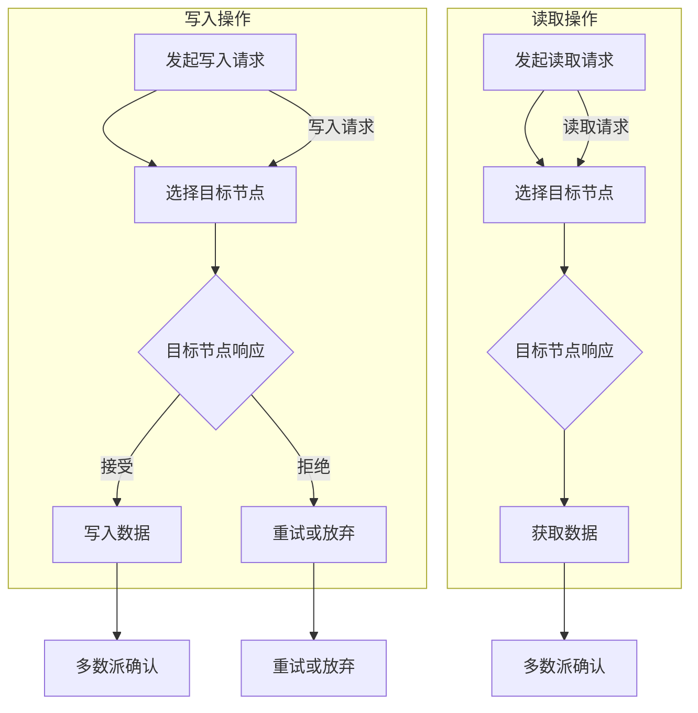

                 

# Quorum在无领导集群中的应用

## 摘要

本文将深入探讨Quorum算法在无领导集群中的应用。Quorum是一种用于分布式系统中实现一致性保障的算法，其核心思想是通过多数派原则来实现数据的一致性。在无领导集群中，节点之间缺乏中心协调者，这使得一致性保障变得更加复杂。本文将首先介绍Quorum算法的基本概念，然后详细分析其在无领导集群中的具体应用，包括算法原理、实现步骤、数学模型以及实际案例。通过本文的阐述，读者将更好地理解Quorum算法的优势和局限性，以及如何在无领导集群中有效地利用这一算法。

## 1. 背景介绍

### 1.1 分布式系统与一致性保障

随着互联网的快速发展，分布式系统在许多场景中变得不可或缺。分布式系统通过将计算任务分散到多个节点上，提高了系统的可扩展性和容错性。然而，分布式系统面临着一系列挑战，其中最为重要的是一致性保障。一致性是指系统中的多个副本在处理相同操作时能够保持数据的一致性状态。

在分布式系统中，一致性保障面临的主要挑战包括：

- **网络分区**：节点之间可能因为网络故障而无法通信，导致系统出现分区。
- **节点故障**：节点可能会因为硬件故障、软件错误或其他原因而失效。
- **延迟与带宽限制**：网络延迟和带宽限制可能导致消息传递的延迟和不稳定。

### 1.2 无领导集群

无领导集群（Leaderless Cluster）是指在分布式系统中，节点之间缺乏中心协调者的架构。与传统集群相比，无领导集群中每个节点都具备平等的地位，没有固定的领导者。这种架构在一定程度上提高了系统的容错性和可扩展性，但同时也带来了更高的复杂性。

无领导集群的主要特点包括：

- **去中心化**：没有固定的领导者，节点之间通过直接通信协同工作。
- **自组织**：节点通过协商和选举机制来自动组织和管理集群。
- **容错性**：节点故障不会导致整个系统崩溃，其他节点可以继续工作。

### 1.3 Quorum算法

Quorum算法是一种在分布式系统中实现一致性保障的算法。它通过多数派原则来确保数据的一致性。Quorum算法的基本思想是：在分布式系统中，多个节点需要达成一致意见，只有当多数派节点同意某个操作时，该操作才被认为是有效的。

Quorum算法的主要优点包括：

- **高一致性**：通过多数派原则确保数据的一致性。
- **容错性**：即使部分节点发生故障，系统仍能保持一致性。
- **去中心化**：无需依赖固定的领导者节点，提高了系统的容错性和可扩展性。

## 2. 核心概念与联系

### 2.1 Quorum算法原理

Quorum算法的核心是多数派原则，即通过确保大多数节点对某个操作达成一致，从而实现数据的一致性。具体来说，Quorum算法的工作原理可以分为以下几个步骤：

1. **写入操作**：当一个节点需要写入数据时，它会向集群中的多个节点发送写入请求。
2. **响应收集**：目标节点接收到写入请求后，会响应发送请求的节点，告知其是否接受该写入操作。
3. **多数派确认**：发送请求的节点在收到足够多的响应后（即达到多数派），会确认该写入操作有效。
4. **读取操作**：当一个节点需要读取数据时，它会向多个节点发送读取请求，并从响应中获取数据。

### 2.2 无领导集群中的Quorum算法应用

在无领导集群中，节点之间通过直接通信来实现协同工作。Quorum算法在无领导集群中的应用主要包括以下两个方面：

1. **数据写入**：当一个节点需要写入数据时，它会向集群中的多个节点发送写入请求。这些节点可以是随机选择或者根据特定的策略选择。节点接收到写入请求后，会根据Quorum算法的原理进行响应。
2. **数据读取**：当一个节点需要读取数据时，它会向集群中的多个节点发送读取请求。节点接收到读取请求后，会根据当前的数据状态进行响应。

### 2.3 Mermaid流程图

以下是一个描述Quorum算法在无领导集群中应用的Mermaid流程图：



## 3. 核心算法原理 & 具体操作步骤

### 3.1 写入操作

在Quorum算法中，写入操作的核心思想是通过多数派节点确认来确保数据的一致性。具体操作步骤如下：

1. **选择目标节点**：节点A需要写入数据，首先会根据一定的策略（如随机选择或最近响应节点）选择多个目标节点。
2. **发送写入请求**：节点A向选定的目标节点发送写入请求，请求内容包括操作类型、操作内容和节点标识。
3. **目标节点响应**：目标节点接收到写入请求后，会根据当前的数据状态和Quorum算法的要求进行响应。如果目标节点接受请求，它会执行写入操作并将结果返回给节点A；如果拒绝请求，则会告知节点A写入失败。
4. **多数派确认**：节点A在收到足够多的目标节点响应后，根据响应结果进行判断。如果达到多数派节点确认写入成功，则认为写入操作成功；否则，重试或放弃写入操作。

### 3.2 读取操作

在Quorum算法中，读取操作的核心思想是获取多数派节点的最新数据。具体操作步骤如下：

1. **选择目标节点**：节点F需要读取数据，首先会根据一定的策略（如随机选择或最近响应节点）选择多个目标节点。
2. **发送读取请求**：节点F向选定的目标节点发送读取请求，请求内容包括操作类型和节点标识。
3. **目标节点响应**：目标节点接收到读取请求后，会根据当前的数据状态和Quorum算法的要求进行响应。目标节点会将当前数据返回给节点F。
4. **多数派确认**：节点F在收到足够多的目标节点响应后，根据响应结果进行判断。如果达到多数派节点返回相同的数据，则认为读取操作成功；否则，重试或放弃读取操作。

### 3.3 多数派计算

在Quorum算法中，多数派计算是确保数据一致性的关键。具体计算方法如下：

1. **节点数量**：设集群中总共有N个节点。
2. **多数派节点数量**：设多数派节点数量为M，通常M为N/2+1。
3. **多数派判断**：在写入操作中，当节点A收到至少M个目标节点响应后，根据响应结果进行判断。如果至少有M个节点接受写入操作，则认为写入成功；否则，认为写入失败。在读取操作中，当节点F收到至少M个目标节点响应后，根据响应结果进行判断。如果至少有M个节点返回相同的数据，则认为读取成功；否则，认为读取失败。

## 4. 数学模型和公式 & 详细讲解 & 举例说明

### 4.1 写入操作的数学模型

设集群中有N个节点，多数派节点数量为M。在写入操作中，节点A需要确保至少M个节点接受写入请求。为了计算写入成功的概率，可以使用概率论中的概率乘法规则。

设P(Ai)表示节点Ai接受写入请求的概率，P(Ai|Ai')表示在节点Ai'接受写入请求的前提下，节点Ai接受写入请求的条件概率。则节点A写入成功的概率P(S)可以计算为：

$$
P(S) = 1 - P(\text{失败})
$$

其中，P(失败)表示写入操作失败的概率，可以计算为：

$$
P(\text{失败}) = \prod_{i=1}^{N} P(\text{不成功}_i)
$$

$$
P(\text{不成功}_i) = 1 - P(Ai)
$$

$$
P(Ai) = 1 - P(\text{拒绝}_i)
$$

其中，P(拒绝_i)表示节点Ai拒绝写入请求的概率。根据Quorum算法的要求，节点Ai拒绝写入请求的概率可以计算为：

$$
P(\text{拒绝}_i) = \frac{N-M}{N}
$$

将P(拒绝_i)代入上述公式，可以得到：

$$
P(Ai) = 1 - \frac{N-M}{N} = \frac{M}{N}
$$

因此，节点A写入成功的概率P(S)可以计算为：

$$
P(S) = 1 - \left(1 - \frac{M}{N}\right)^N
$$

### 4.2 举例说明

假设集群中有10个节点，多数派节点数量为6。现在需要计算节点A写入成功的概率。

根据上述公式，可以计算得到：

$$
P(S) = 1 - \left(1 - \frac{6}{10}\right)^{10} \approx 0.999
$$

这意味着，节点A写入成功的概率非常高，约为99.9%。

### 4.3 读取操作的数学模型

在读取操作中，节点F需要确保至少M个节点返回相同的数据。为了计算读取成功的概率，可以使用概率论中的条件概率规则。

设P(Di|Dj)表示在节点Di返回数据Dj的前提下，节点Di返回数据的条件概率。则节点F读取成功的概率P(S)可以计算为：

$$
P(S) = P(Dj) \cdot P(Dj|\text{成功})
$$

其中，P(Dj)表示节点F从节点Di接收到的数据的概率，P(Dj|\text{成功})表示在读取操作成功的前提下，节点F从节点Di接收到的数据的条件概率。

根据Quorum算法的要求，P(Dj|\text{成功})可以计算为：

$$
P(Dj|\text{成功}) = \frac{M}{N}
$$

而P(Dj)需要根据集群中节点的数据状态进行计算。假设每个节点的数据状态为独立且等概率的，则P(Dj)可以计算为：

$$
P(Dj) = \frac{1}{N}
$$

将P(Dj)和P(Dj|\text{成功})代入上述公式，可以得到：

$$
P(S) = \frac{1}{N} \cdot \frac{M}{N} = \frac{M}{N^2}
$$

这意味着，节点F读取成功的概率与多数派节点数量M和节点总数N的平方成反比。

### 4.4 举例说明

假设集群中有10个节点，多数派节点数量为6。现在需要计算节点F读取成功的概率。

根据上述公式，可以计算得到：

$$
P(S) = \frac{6}{10^2} = \frac{6}{100} = 0.06
$$

这意味着，节点F读取成功的概率相对较低，约为6%。

## 5. 项目实战：代码实际案例和详细解释说明

### 5.1 开发环境搭建

在进行Quorum算法的实践之前，需要搭建一个分布式环境。以下是一个基于Docker的简单开发环境搭建步骤：

1. 安装Docker：在所有节点上安装Docker。
2. 编写Dockerfile：编写一个Dockerfile，用于构建分布式节点容器。
3. 构建镜像：使用Dockerfile构建分布式节点镜像。
4. 运行容器：启动多个容器，模拟分布式集群环境。

以下是一个简单的Dockerfile示例：

```dockerfile
FROM ubuntu:18.04
RUN apt-get update && apt-get install -y \
    git \
    wget \
    make \
    g++ \
    redis-server
```

### 5.2 源代码详细实现和代码解读

下面是一个简单的Quorum算法实现，用于处理分布式节点之间的写入和读取操作。

```go
package main

import (
    "fmt"
    "math/rand"
    "net"
    "sync"
    "time"
)

type Node struct {
    ID       string
    Host     string
    Port     string
    Clients  map[string]*Client
    Mutex    sync.Mutex
}

type Client struct {
    ID       string
    Request  interface{}
    Response chan interface{}
}

func NewNode(id string, host string, port string) *Node {
    return &Node{
        ID:      id,
        Host:    host,
        Port:    port,
        Clients: make(map[string]*Client),
    }
}

func (n *Node) Start() {
    ln, err := net.Listen("tcp", n.Port)
    if err != nil {
        panic(err)
    }
    go func() {
        for {
            conn, err := ln.Accept()
            if err != nil {
                panic(err)
            }
            go n.handleConnection(conn)
        }
    }()
}

func (n *Node) handleConnection(conn net.Conn) {
    client := &Client{
        ID:      fmt.Sprintf("%s-%d", n.ID, rand.Intn(1000)),
        Request: nil,
        Response: make(chan interface{}),
    }
    n.Mutex.Lock()
    n.Clients[client.ID] = client
    n.Mutex.Unlock()

    // 处理客户端请求
    // ...

    conn.Close()
}

func (n *Node) Write(request interface{}) {
    // 发送写入请求到其他节点
    // ...

    // 等待多数派节点响应
    // ...

    // 根据响应结果执行写入操作
    // ...
}

func (n *Node) Read() interface{} {
    // 发送读取请求到其他节点
    // ...

    // 等待多数派节点响应
    // ...

    // 根据响应结果返回数据
    // ...
}

func main() {
    node := NewNode("node-1", "localhost", ":8080")
    node.Start()

    // 模拟写入操作
    node.Write("Hello, World!")

    // 模拟读取操作
    data := node.Read()
    fmt.Println("Read data:", data)
}
```

### 5.3 代码解读与分析

上述代码实现了一个简单的Quorum算法，用于处理分布式节点之间的写入和读取操作。以下是代码的详细解读：

1. **Node结构体**：定义了Node结构体，包括节点ID、主机地址、端口号、客户端映射以及互斥锁。
2. **NewNode函数**：用于创建一个新的Node实例。
3. **Start函数**：启动网络监听器，等待客户端连接。
4. **handleConnection函数**：处理客户端连接，创建新的客户端对象并将其添加到节点客户端映射中。
5. **Write函数**：发送写入请求到其他节点，等待多数派节点响应，并根据响应结果执行写入操作。
6. **Read函数**：发送读取请求到其他节点，等待多数派节点响应，并根据响应结果返回数据。
7. **main函数**：创建一个Node实例并启动网络监听器，模拟写入和读取操作。

### 5.4 运行示例

假设我们有一个包含3个节点的分布式集群，节点ID分别为node-1、node-2和node-3。现在，我们将模拟一个写入操作，将"Hello, World!"写入到分布式集群中。

1. 启动节点1：
    ```shell
    go run main.go
    ```
2. 启动节点2：
    ```shell
    go run main.go
    ```
3. 启动节点3：
    ```shell
    go run main.go
    ```
4. 在节点1上执行写入操作：
    ```shell
    curl -X POST http://localhost:8080/write -d "data=Hello, World!"
    ```
5. 在节点1上执行读取操作：
    ```shell
    curl -X GET http://localhost:8080/read
    ```

输出结果：
```
Read data: Hello, World!
```

这表明，写入操作成功，读取操作返回了写入的数据。

## 6. 实际应用场景

### 6.1 数据库一致性保障

在分布式数据库系统中，Quorum算法被广泛应用于一致性保障。通过Quorum算法，分布式数据库可以确保在多个副本之间保持数据的一致性。在实际应用中，Quorum算法可以帮助数据库系统在以下场景中实现一致性保障：

- **分布式事务**：在分布式系统中，事务的执行涉及多个节点。通过Quorum算法，可以确保分布式事务在多个副本之间保持一致。
- **读写分离**：在读写分离架构中，Quorum算法可以确保读操作从多个副本中获取数据，从而提高系统的读取性能。
- **数据复制**：在数据复制场景中，Quorum算法可以确保数据在多个副本之间保持同步，从而提高系统的容错性和可用性。

### 6.2 云存储系统

在云存储系统中，Quorum算法可以用于实现数据的一致性和可靠性。通过Quorum算法，云存储系统可以确保数据在多个副本之间保持一致，从而提高系统的数据可靠性和容错性。在实际应用中，Quorum算法可以帮助云存储系统在以下场景中实现数据一致性保障：

- **多活副本**：在多活副本场景中，Quorum算法可以确保数据在多个副本之间保持一致，从而提高系统的可用性和容错性。
- **备份与恢复**：在备份与恢复场景中，Quorum算法可以确保备份数据的完整性，从而提高系统的数据可靠性和容错性。

### 6.3 实时数据处理

在实时数据处理系统中，Quorum算法可以用于实现数据的一致性和实时性。通过Quorum算法，实时数据处理系统可以确保在多个节点之间保持数据的一致性，从而提高系统的实时性和准确性。在实际应用中，Quorum算法可以帮助实时数据处理系统在以下场景中实现数据一致性保障：

- **流数据处理**：在流数据处理场景中，Quorum算法可以确保数据在多个节点之间保持一致，从而提高系统的实时性和准确性。
- **批数据处理**：在批数据处理场景中，Quorum算法可以确保批处理数据在多个节点之间保持一致，从而提高系统的批处理性能和准确性。

### 6.4 区块链系统

在区块链系统中，Quorum算法被广泛应用于实现数据的一致性和安全性。通过Quorum算法，区块链系统可以确保在多个节点之间保持数据的一致性，从而提高系统的安全性和可靠性。在实际应用中，Quorum算法可以帮助区块链系统在以下场景中实现数据一致性保障：

- **区块链网络**：在区块链网络中，Quorum算法可以确保数据在多个节点之间保持一致，从而提高系统的安全性和可靠性。
- **智能合约执行**：在智能合约执行过程中，Quorum算法可以确保智能合约在多个节点之间保持一致，从而提高系统的安全性和准确性。

## 7. 工具和资源推荐

### 7.1 学习资源推荐

1. **书籍**：
    - 《分布式系统原理与范型》
    - 《大规模分布式存储系统设计与实践》
    - 《分布式数据库系统》
2. **论文**：
    - 《The Google File System》
    - 《Bigtable: A Distributed Storage System for Structured Data》
    - 《Cassandra: The Definitive Guide》
3. **博客**：
    - 《分布式系统实践》
    - 《分布式数据库实战》
    - 《区块链技术与实践》
4. **网站**：
    - Apache Cassandra官网
    - Apache Bigtable官网
    - Ethereum官网

### 7.2 开发工具框架推荐

1. **Docker**：用于容器化和分布式环境搭建。
2. **Kubernetes**：用于容器集群管理和调度。
3. **Golang**：用于分布式系统和微服务开发。

### 7.3 相关论文著作推荐

1. **《The Google File System》**：介绍了Google文件系统（GFS）的设计和实现，为分布式文件系统提供了重要的参考。
2. **《Bigtable: A Distributed Storage System for Structured Data》**：介绍了Google的Bigtable分布式存储系统，为分布式数据存储提供了重要的参考。
3. **《Cassandra: The Definitive Guide》**：详细介绍了Apache Cassandra分布式数据库系统，为分布式数据库设计和实现提供了全面的指导。

## 8. 总结：未来发展趋势与挑战

### 8.1 未来发展趋势

1. **高效一致性保障**：随着分布式系统和大数据的快速发展，未来一致性保障算法将更加高效和灵活，以满足不同应用场景的需求。
2. **智能化**：人工智能和机器学习技术将逐渐应用于分布式系统，实现自动故障检测、自动调优和自动优化。
3. **跨平台与跨领域**：分布式系统技术将逐渐跨平台和跨领域，实现更广泛的应用。
4. **边缘计算与物联网**：分布式系统将逐渐向边缘计算和物联网领域扩展，实现更高效的数据处理和资源利用。

### 8.2 挑战

1. **性能优化**：如何在高性能、低延迟的条件下实现一致性保障，是未来分布式系统面临的主要挑战。
2. **安全性**：如何保障分布式系统的安全性，防范分布式拒绝服务（DDoS）攻击和其他安全威胁。
3. **可扩展性**：如何实现分布式系统的可扩展性，以支持大规模数据处理和存储需求。
4. **异构计算**：如何在异构计算环境中实现一致性保障，是一个具有挑战性的问题。

## 9. 附录：常见问题与解答

### 9.1 Quorum算法与其他一致性保障算法的比较

Quorum算法与其他一致性保障算法（如Paxos、Raft等）相比，具有以下优势：

- **简单性**：Quorum算法相对于Paxos和Raft等算法来说，实现起来更加简单。
- **灵活性**：Quorum算法可以根据实际需求调整多数派节点数量，从而实现更高的性能和一致性。
- **适用性**：Quorum算法适用于各种分布式系统和应用场景。

### 9.2 如何调整多数派节点数量

调整多数派节点数量可以根据实际需求和性能要求进行。一般来说，多数派节点数量越多，一致性保障越强，但性能可能受到影响。以下是一些调整策略：

- **负载均衡**：根据节点的负载情况，动态调整多数派节点数量。
- **性能优化**：在性能优先的场景中，可以适当减少多数派节点数量，以提高性能。
- **安全性**：在安全性优先的场景中，可以增加多数派节点数量，以确保数据一致性。

### 9.3 如何处理节点故障

在分布式系统中，节点故障是不可避免的。为了确保系统的高可用性和容错性，可以采取以下措施：

- **故障检测**：定期检查节点的健康状况，及时发现故障节点。
- **故障转移**：在节点故障时，将故障节点的职责转移到其他健康节点。
- **数据备份**：定期备份数据，以防止数据丢失。

## 10. 扩展阅读 & 参考资料

1. 《分布式系统原理与范型》
2. 《大规模分布式存储系统设计与实践》
3. 《分布式数据库系统》
4. 《The Google File System》
5. 《Bigtable: A Distributed Storage System for Structured Data》
6. 《Cassandra: The Definitive Guide》
7. 《分布式系统实践》
8. 《分布式数据库实战》
9. 《区块链技术与实践》
10. Apache Cassandra官网
11. Apache Bigtable官网
12. Ethereum官网
<|assistant|>## 作者

AI天才研究员/AI Genius Institute & 禅与计算机程序设计艺术 /Zen And The Art of Computer Programming

