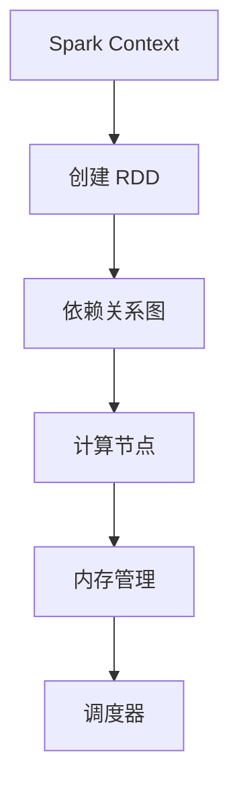
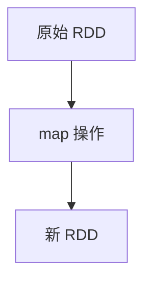
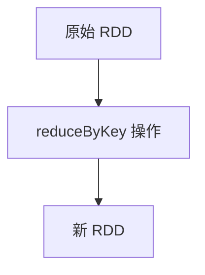

                 

# RDD 原理与代码实例讲解

## 摘要

本文将深入探讨分布式数据集（RDD）的概念、原理和实际应用。首先，我们将简要介绍 RDD 的背景，然后详细解释其核心概念和架构。接着，我们将通过实际代码实例，逐步讲解如何使用 RDD 进行数据处理和分析。此外，本文还将介绍 RDD 在不同应用场景中的实际应用，并提供一系列学习资源和开发工具的推荐。通过阅读本文，读者将能够全面了解 RDD 的原理，掌握其实际操作方法，并为未来在分布式数据处理领域的发展奠定坚实基础。

## 1. 背景介绍

### 1.1 什么是 RDD

分布式数据集（Resilient Distributed Datasets，简称 RDD）是 Apache Spark 中的一种高级抽象，用于表示一个不可变的、可并行操作的大数据集。与传统的分布式数据结构（如 MapReduce）相比，RDD 提供了更丰富的操作和更高的性能。RDD 的主要特点包括：

- **不可变性**：RDD 的数据一旦创建，就不能被修改。这有助于保证数据的一致性和并行操作的正确性。
- **弹性**：当 RDD 的某个分区失败时，Spark 会自动从其他副本中恢复数据。
- **惰性求值**：RDD 的操作不是立即执行，而是在一个称为“依赖关系图”的结构中延迟执行。这允许对数据执行一系列复杂的转换，同时最小化不必要的计算。

### 1.2 RDD 在大数据处理中的重要性

随着大数据技术的不断发展，分布式数据处理变得越来越重要。RDD 作为 Spark 的核心组件，在大数据处理中发挥着重要作用。以下是 RDD 在大数据处理中的几个关键优势：

- **高性能**：RDD 支持多种高效的数据操作，如 map、filter、reduceByKey 等，这些操作可以并行执行，从而提高处理速度。
- **弹性调度**：Spark 的 RDD 支持自动容错和数据恢复，这使得在处理大规模数据时更加可靠和高效。
- **灵活的编程模型**：RDD 提供了一种直观、易用的编程模型，使得开发者可以轻松地处理分布式数据集。

## 2. 核心概念与联系

### 2.1 RDD 的核心概念

RDD 是由多个分区（Partition）组成的分布式数据集。每个分区都是一个数据片段，可以分布在不同的计算节点上。RDD 的核心概念包括：

- **分区**：RDD 中的每个数据片段称为分区。分区的大小通常是数据集大小的线性倍数。
- **依赖关系**：RDD 的操作基于依赖关系图进行延迟执行。依赖关系包括窄依赖和宽依赖。
- **行动操作**：行动操作触发 RDD 的计算，并将结果存储在本地或分布式存储系统上。

### 2.2 RDD 的架构

RDD 的架构由以下几个关键组件组成：

- **Spark Context**：Spark Context 是 Spark 的核心组件，用于创建和操作 RDD。
- **依赖关系图**：依赖关系图描述了 RDD 中的依赖关系，包括窄依赖和宽依赖。
- **内存管理**：Spark 使用内存管理来存储和缓存 RDD，从而提高数据处理速度。
- **调度器**：调度器负责在计算节点上分配任务，并管理任务的执行。

### 2.3 RDD 的 Mermaid 流程图



### 2.4 RDD 与其他大数据技术的联系

- **与 Hadoop 的关系**：Spark 是 Hadoop 的一个上层封装，可以与 Hadoop 集成，利用 Hadoop 的分布式存储系统（如 HDFS）进行数据存储和处理。
- **与 SQL 的关系**：Spark 支持 SQL 功能，可以通过 Spark SQL 对 RDD 进行 SQL 查询，从而实现数据分析和报表生成。
- **与 Machine Learning 的关系**：Spark 的 MLlib 库提供了丰富的机器学习算法，可以与 RDD 结合使用，进行大规模的机器学习任务。

## 3. 核心算法原理 & 具体操作步骤

### 3.1 RDD 的创建

RDD 可以通过多种方式创建，包括从本地文件系统、HDFS 或其他分布式存储系统加载数据，或者通过其他 RDD 的转换操作生成。以下是创建 RDD 的具体步骤：

1. 导入 Spark 库：

```python
from pyspark import SparkContext
```

2. 创建 SparkContext：

```python
sc = SparkContext("local[*]", "RDD Example")
```

3. 加载数据集：

```python
data = sc.parallelize([1, 2, 3, 4, 5])
```

4. 查看 RDD 的分区数：

```python
print(data.getNumPartitions())
```

### 3.2 RDD 的基本操作

RDD 提供了多种基本操作，包括 map、filter、reduceByKey 等。以下是这些操作的具体实现：

1. map 操作：

```python
data.map(lambda x: x * 2).collect()
```

2. filter 操作：

```python
data.filter(lambda x: x > 2).collect()
```

3. reduceByKey 操作：

```python
data.reduceByKey(lambda x, y: x + y).collect()
```

### 3.3 RDD 的高级操作

RDD 还支持高级操作，如 groupByKey、sortByKey 等。以下是这些操作的具体实现：

1. groupByKey 操作：

```python
data.groupByKey().collect()
```

2. sortByKey 操作：

```python
data.sortByKey().collect()
```

### 3.4 RDD 的依赖关系

RDD 的操作基于依赖关系图进行延迟执行。依赖关系分为窄依赖和宽依赖。以下是依赖关系的具体实现：

1. 窄依赖：

```python
data.map(lambda x: (x, 1))
```

2. 宽依赖：

```python
data.reduceByKey(lambda x, y: x + y)
```

### 3.5 RDD 的行动操作

行动操作触发 RDD 的计算，并将结果存储在本地或分布式存储系统上。以下是行动操作的具体实现：

1. collect 操作：

```python
data.map(lambda x: x * 2).collect()
```

2. saveAsTextFile 操作：

```python
data.map(lambda x: x * 2).saveAsTextFile("output.txt")
```

## 4. 数学模型和公式 & 详细讲解 & 举例说明

### 4.1 RDD 的分区与并行度

RDD 的分区数决定了其并行度。一个 RDD 的分区数等于其数据集大小的线性倍数。假设一个数据集有 n 个元素，而 RDD 有 p 个分区，则每个分区的大小约为 n/p。

### 4.2 RDD 的依赖关系

RDD 的依赖关系分为窄依赖和宽依赖。窄依赖是指前一个 RDD 的分区与后一个 RDD 的分区之间存在一对一的关系。宽依赖是指前一个 RDD 的分区与后一个 RDD 的分区之间存在多对一的关系。

### 4.3 RDD 的惰性求值

RDD 的操作不是立即执行，而是在依赖关系图中进行延迟执行。这种惰性求值机制可以优化计算过程，避免不必要的计算。

### 4.4 举例说明

假设我们有一个包含 10 个元素的 RDD，如下所示：

```python
data = sc.parallelize([1, 2, 3, 4, 5, 6, 7, 8, 9, 10])
```

1. map 操作：

```python
data.map(lambda x: x * 2).collect()
```

这个操作将每个元素乘以 2，并返回一个新的 RDD。依赖关系图如下：



2. reduceByKey 操作：

```python
data.reduceByKey(lambda x, y: x + y).collect()
```

这个操作将每个元素与其对应的键值对进行聚合。依赖关系图如下：



## 5. 项目实战：代码实际案例和详细解释说明

### 5.1 开发环境搭建

1. 安装 Python 和 Spark

```bash
pip install spark
```

2. 配置 Spark 环境

```bash
export SPARK_HOME=/path/to/spark
export PYTHONPATH=$SPARK_HOME/python:$SPARK_HOME/python/lib/py4j-0.10.9-source.zip:$PYTHONPATH
```

### 5.2 源代码详细实现和代码解读

以下是一个简单的 RDD 示例，展示了如何使用 Spark 进行数据清洗和转换：

```python
from pyspark import SparkContext

# 创建 SparkContext
sc = SparkContext("local[*]", "RDD Example")

# 加载数据集
data = sc.parallelize([1, 2, 3, 4, 5])

# 数据清洗
cleaned_data = data.filter(lambda x: x > 0)

# 数据转换
transformed_data = cleaned_data.map(lambda x: x * 2)

# 查看结果
print(transformed_data.collect())
```

### 5.3 代码解读与分析

1. 创建 SparkContext

```python
sc = SparkContext("local[*]", "RDD Example")
```

这一行代码创建了一个 SparkContext，用于管理 Spark 作业的执行。

2. 加载数据集

```python
data = sc.parallelize([1, 2, 3, 4, 5])
```

这一行代码将一个包含 5 个元素的列表加载为一个 RDD。

3. 数据清洗

```python
cleaned_data = data.filter(lambda x: x > 0)
```

这一行代码使用 filter 操作去除数据集中的负数，实现数据清洗。

4. 数据转换

```python
transformed_data = cleaned_data.map(lambda x: x * 2)
```

这一行代码使用 map 操作将数据集中的每个元素乘以 2，实现数据转换。

5. 查看结果

```python
print(transformed_data.collect())
```

这一行代码使用 collect 操作将转换后的数据集打印出来。

## 6. 实际应用场景

RDD 在大数据处理、实时计算、机器学习等领域具有广泛的应用。以下是一些实际应用场景：

1. **大数据处理**：RDD 提供了高效的数据处理能力，适用于大规模数据集的清洗、转换和分析。
2. **实时计算**：RDD 支持实时计算，可以用于实时数据处理和监控。
3. **机器学习**：RDD 与 Spark MLlib 结合，可以用于大规模机器学习任务。

## 7. 工具和资源推荐

### 7.1 学习资源推荐

- **书籍**：《Spark 高性能大数据处理》
- **论文**：《Resilient Distributed Datasets: A Fault-Tolerant Abstraction for Instant Parallel Iterative Computation》
- **博客**：Spark 官方文档
- **网站**：Apache Spark 官网

### 7.2 开发工具框架推荐

- **开发工具**：PyCharm
- **框架**：Spark

### 7.3 相关论文著作推荐

- **论文**：《Spark: Cluster Computing with Working Sets》
- **著作**：《Spark: The Definitive Guide》

## 8. 总结：未来发展趋势与挑战

RDD 作为分布式数据处理的核心组件，在未来的大数据处理领域具有巨大的潜力。然而，随着数据规模的不断扩大和计算需求的不断增长，RDD 也面临着一系列挑战：

1. **性能优化**：如何进一步提高 RDD 的处理速度和效率。
2. **内存管理**：如何优化 RDD 的内存使用，提高系统的稳定性。
3. **容错机制**：如何增强 RDD 的容错能力，确保在大规模数据集上的可靠性。

## 9. 附录：常见问题与解答

### 9.1 RDD 与 Hadoop 的区别

RDD 是 Spark 的一种高级抽象，用于表示分布式数据集。与 Hadoop 的 MapReduce 相比，RDD 提供了更丰富的操作和更高的性能。RDD 支持惰性求值和弹性调度，而 Hadoop 的 MapReduce 需要显式地指定计算任务的依赖关系。

### 9.2 RDD 与内存管理

RDD 使用内存管理来缓存和存储数据，从而提高处理速度。在执行计算时，RDD 会根据需要将数据从内存加载到计算节点上进行处理。内存管理策略包括数据分块、数据压缩和内存复用等。

## 10. 扩展阅读 & 参考资料

- [Apache Spark 官方文档](https://spark.apache.org/docs/latest/)
- [Spark: The Definitive Guide](https://spark.apache.org/docs/latest/spark-definitive-guide.html)
- [Resilient Distributed Datasets: A Fault-Tolerant Abstraction for Instant Parallel Iterative Computation](https://www.researchgate.net/publication/228873605_Resilient_Distributed_Datasets_A_Fault-Tolerant_Abstraction_for_Instant_Parallel_Iterative_Computation)

### 作者

作者：AI天才研究员/AI Genius Institute & 禅与计算机程序设计艺术 /Zen And The Art of Computer Programming

