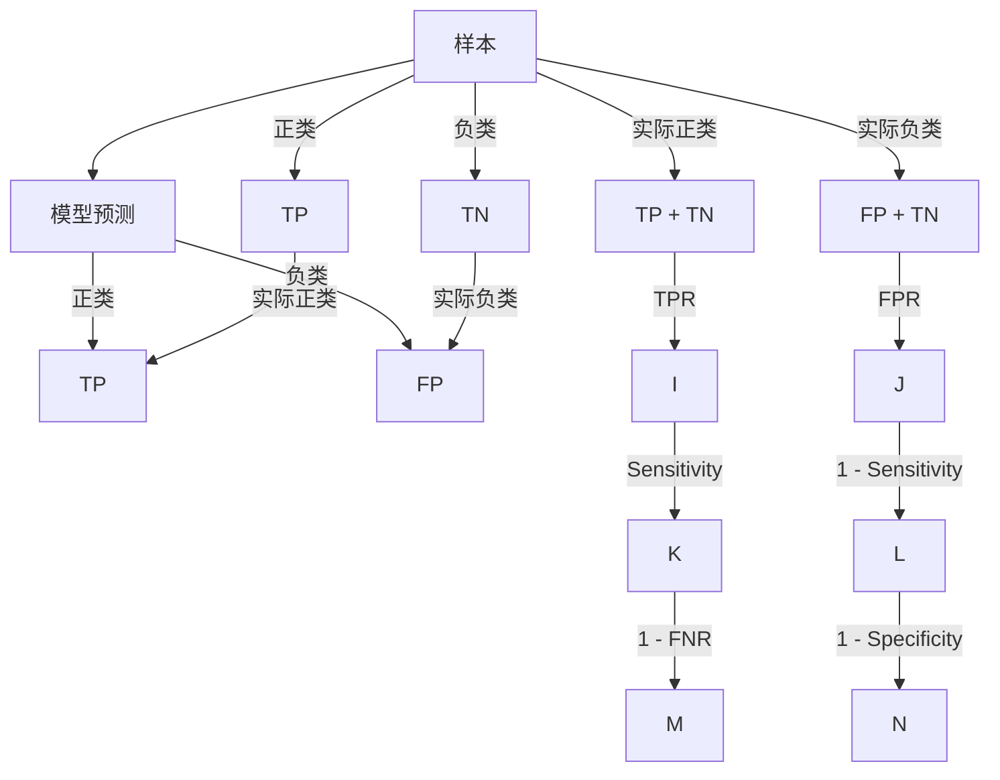

                 

### 背景介绍

ROC曲线，全称为Receiver Operating Characteristic curve，即接收者操作特征曲线。它是一种用于评估分类模型性能的重要工具，尤其在二分类问题中具有广泛的应用。ROC曲线的出现，可以追溯到二战时期，当时军事通信领域中需要判断信号是否被正确接收，因此科学家们开始研究如何更有效地评估分类器的性能。

ROC曲线的基本概念非常简单。它通过绘制真阳性率（True Positive Rate，TPR）与假阳性率（False Positive Rate，FPR）之间的关系曲线，来描述分类器的性能。TPR表示模型正确预测为正类样本的比例，而FPR则表示模型将负类样本错误预测为正类的比例。ROC曲线下的面积（Area Under Curve，AUC）则是评价模型好坏的重要指标，其值介于0.5到1之间，越接近1表示模型性能越好。

在金融风控领域，ROC曲线常用于信用评分模型的评估。例如，银行在审批贷款时，需要判断客户是否具有还款能力。通过构建信用评分模型，银行可以基于客户的财务数据、信用记录等信息，将其分为高风险和低风险两类。ROC曲线可以帮助银行了解模型的分类能力，从而调整阈值，使得贷款审批更加准确。

在医学诊断中，ROC曲线也是不可或缺的工具。医生需要通过医学影像或生物标志物等数据，对患者的健康状况进行判断。ROC曲线能够帮助医生评估诊断模型的性能，选择最优的分类阈值，以提高诊断准确性。

此外，ROC曲线在文本分类、图像识别等领域也具有重要应用。例如，在垃圾邮件检测中，ROC曲线可以帮助邮件过滤系统选择合适的阈值，以最大限度地减少误判和漏判。

总之，ROC曲线作为一种评估分类模型性能的有效工具，其重要性不言而喻。在本文中，我们将详细探讨ROC曲线的原理，并介绍如何使用Python代码实现ROC曲线的绘制和评估。通过本文的学习，读者将能够更好地理解ROC曲线的作用，并在实际项目中运用这一工具，提升模型的性能。

### 核心概念与联系

为了深入理解ROC曲线的工作原理，我们需要先介绍几个核心概念：真阳性率（True Positive Rate，TPR）、假阳性率（False Positive Rate，FPR）、假阴性率（False Negative Rate，FNR）以及准确率（Accuracy）。这些概念共同构成了ROC曲线的基础，下面将分别解释它们的含义。

#### 真阳性率（True Positive Rate，TPR）

真阳性率（TPR），也称为灵敏度（Sensitivity）或召回率（Recall），表示分类模型正确预测为正类（如病患为阳性）的比例。其计算公式为：

$$
TPR = \frac{TP}{TP + FN}
$$

其中，TP（True Positive）表示实际为正类且被模型正确预测为正类的样本数量，FN（False Negative）表示实际为正类但被模型错误预测为负类的样本数量。

#### 假阳性率（False Positive Rate，FPR）

假阳性率（FPR），也称为假正率（False Positive Rate），表示分类模型错误地将负类（如健康人）预测为正类的比例。其计算公式为：

$$
FPR = \frac{FP}{FP + TN}
$$

其中，FP（False Positive）表示实际为负类但被模型错误预测为正类的样本数量，TN（True Negative）表示实际为负类且被模型正确预测为负类的样本数量。

#### 假阴性率（False Negative Rate，FNR）

假阴性率（FNR），也称为假负率（False Negative Rate），表示分类模型错误地将正类（如病患）预测为负类的比例。其计算公式为：

$$
FNR = \frac{FN}{TP + FN}
$$

#### 准确率（Accuracy）

准确率（Accuracy）表示分类模型正确预测的总样本数量占样本总数的比例。其计算公式为：

$$
Accuracy = \frac{TP + TN}{TP + FP + TN + FN}
$$

#### ROC曲线与TPR、FPR的关系

ROC曲线通过在TPR和FPR之间建立联系，展示了分类模型在不同阈值下的性能。具体来说，TPR和FPR的关系可以表示为：

$$
TPR = \frac{TP}{TP + FN} = \frac{Sensitivity}{1 - FNR}
$$

$$
FPR = \frac{FP}{FP + TN} = \frac{1 - Specificity}{1 - Sensitivity}
$$

其中，Specificity表示特异度（True Negative Rate），即分类模型正确预测为负类的比例。

#### Mermaid流程图

为了更直观地展示这些核心概念之间的联系，我们可以使用Mermaid流程图来表示它们：



通过这个流程图，我们可以清楚地看到TPR和FPR是如何基于实际为正类和负类的样本数量计算得出的，以及它们与Sensitivity、Specificity和FNR之间的关系。

理解这些核心概念和它们之间的关系，是绘制和解释ROC曲线的基础。接下来，我们将进一步探讨ROC曲线的数学模型和具体操作步骤，以便读者能够掌握如何在实际项目中应用ROC曲线进行模型评估。

### 核心算法原理 & 具体操作步骤

#### ROC曲线的绘制步骤

1. **准备数据集**：首先，我们需要准备一个经过标注的二分类数据集。数据集应包含特征和对应的标签（通常是二值标签，例如0和1），用于训练分类模型。

2. **训练分类模型**：使用数据集训练一个分类模型，例如逻辑回归、支持向量机（SVM）或随机森林等。训练的目的是使模型能够在新的未知数据上进行有效的分类预测。

3. **计算预测概率**：对数据集中的每个样本进行预测，得到预测概率。在Python中，我们可以使用Scikit-learn库中的分类器，例如`LogisticRegression`，并调用`predict_proba`方法来获取预测概率。

4. **确定阈值**：ROC曲线的绘制依赖于不同阈值下的分类结果。通常，我们选择从0到1的阈值范围进行逐步调整，并计算每个阈值下的TPR和FPR。

5. **计算TPR和FPR**：根据当前阈值，计算TPR和FPR。具体来说，TPR可以通过计算模型预测为正类的样本中实际为正类的比例得到，而FPR则是模型预测为正类的样本中实际为负类的比例。

6. **绘制ROC曲线**：将计算得到的TPR和FPR绘制在坐标系中，横坐标为FPR，纵坐标为TPR。连接这些点，我们就可以得到ROC曲线。

7. **计算AUC**：ROC曲线下的面积（AUC）是评估模型好坏的重要指标。我们可以使用Scikit-learn库中的`roc_auc_score`函数计算AUC。

#### Python代码实现

下面是一个简单的Python代码示例，展示如何使用Scikit-learn库绘制ROC曲线和计算AUC：

```python
import numpy as np
from sklearn.datasets import make_classification
from sklearn.linear_model import LogisticRegression
from sklearn.metrics import roc_curve, auc
import matplotlib.pyplot as plt

# 准备数据集
X, y = make_classification(n_samples=1000, n_features=20, n_classes=2, random_state=42)

# 训练分类模型
model = LogisticRegression()
model.fit(X, y)

# 计算预测概率
y_score = model.predict_proba(X)[:, 1]

# 计算TPR和FPR
fpr, tpr, thresholds = roc_curve(y, y_score)

# 计算AUC
roc_auc = auc(fpr, tpr)

# 绘制ROC曲线
plt.figure()
plt.plot(fpr, tpr, color='darkorange', lw=2, label='ROC curve (area = %0.2f)' % roc_auc)
plt.plot([0, 1], [0, 1], color='navy', lw=2, linestyle='--')
plt.xlim([0.0, 1.0])
plt.ylim([0.0, 1.05])
plt.xlabel('False Positive Rate')
plt.ylabel('True Positive Rate')
plt.title('Receiver Operating Characteristic')
plt.legend(loc="lower right")
plt.show()
```

在这个示例中，我们首先使用`make_classification`函数生成一个二分类数据集。然后，我们使用`LogisticRegression`模型进行训练，并计算预测概率。接着，我们使用`roc_curve`函数计算TPR和FPR，并使用`auc`函数计算AUC。最后，我们使用`matplotlib`库绘制ROC曲线。

通过这些步骤，我们可以有效地评估分类模型的性能，并使用ROC曲线和AUC指标来选择最优的分类阈值。

### 数学模型和公式 & 详细讲解 & 举例说明

#### 真阳性率（TPR）和假阳性率（FPR）的数学模型

在前一章节中，我们介绍了TPR和FPR的定义和计算方法。下面我们将深入探讨这两个指标的数学模型，并解释它们在ROC曲线中的表现。

1. **真阳性率（TPR）**：

真阳性率（TPR）的定义是正确预测为正类样本的比例，计算公式为：

$$
TPR = \frac{TP}{TP + FN}
$$

其中，TP表示实际为正类的样本中被正确预测为正类的数量，FN表示实际为正类的样本中被错误预测为负类的数量。

在ROC曲线中，TPR表示为纵坐标，随着阈值的变化而变化。随着阈值的降低，模型预测为正类的概率增加，TPR随之增加。TPR的值范围在0到1之间，1表示所有实际为正类的样本都被正确预测，0表示所有实际为正类的样本都被错误预测。

2. **假阳性率（FPR）**：

假阳性率（FPR）的定义是错误预测为正类样本的比例，计算公式为：

$$
FPR = \frac{FP}{FP + TN}
$$

其中，FP表示实际为负类的样本中被错误预测为正类的数量，TN表示实际为负类的样本中被正确预测为负类的数量。

在ROC曲线中，FPR表示为横坐标，随着阈值的变化而变化。随着阈值的降低，模型预测为正类的概率增加，FPR也随之增加。FPR的值范围也在0到1之间，0表示所有实际为负类的样本都被正确预测，1表示所有实际为负类的样本都被错误预测。

#### ROC曲线的数学模型

ROC曲线是通过在TPR和FPR之间建立关系而形成的。具体来说，ROC曲线的数学模型可以用以下方程表示：

$$
y = mx + b
$$

其中，y表示TPR，x表示FPR，m和b是曲线的斜率和截距。

为了得到ROC曲线，我们需要找到满足上述方程的m和b。通过代入TPR和FPR的计算公式，我们可以推导出：

$$
TPR = \frac{TP}{TP + FN} = m \cdot FPR + b
$$

将TPR和FPR的表达式代入，我们可以得到：

$$
\frac{TP}{TP + FN} = m \cdot \frac{FP}{FP + TN} + b
$$

通过交叉相乘并整理，我们得到：

$$
TP \cdot (FP + TN) = FN \cdot (FP + TN) + FP \cdot (TP + FN)
$$

进一步整理，我们得到：

$$
TP \cdot TN = FN \cdot FP
$$

这意味着ROC曲线实际上是通过TPR和FPR之间的平衡关系绘制的。当TPR增加时，FPR也会相应地增加，以保持两者之间的平衡。

#### 举例说明

为了更好地理解ROC曲线的数学模型，我们可以通过一个简单的例子来说明。

假设我们有一个二分类问题，其中包含以下数据：

- 实际为正类的样本数量（TP）：50
- 实际为负类的样本数量（TN）：30
- 被错误预测为正类的样本数量（FP）：10
- 被错误预测为负类的样本数量（FN）：20

根据这些数据，我们可以计算TPR和FPR：

$$
TPR = \frac{TP}{TP + FN} = \frac{50}{50 + 20} = 0.727
$$

$$
FPR = \frac{FP}{FP + TN} = \frac{10}{10 + 30} = 0.273
$$

现在，我们可以将TPR和FPR代入ROC曲线的方程，得到：

$$
y = mx + b
$$

$$
0.727 = m \cdot 0.273 + b
$$

为了简化计算，我们可以假设m为1，这意味着ROC曲线是线性的。在这种情况下，b的值可以通过以下方程计算：

$$
b = 0.727 - 0.273 = 0.454
$$

因此，我们的ROC曲线方程为：

$$
y = x + 0.454
$$

通过这个方程，我们可以绘制ROC曲线，并观察到TPR和FPR之间的线性关系。随着FPR的增加，TPR也会增加，以保持两者的平衡。

通过这个例子，我们可以看到ROC曲线的数学模型是如何描述TPR和FPR之间关系的。在实际应用中，我们可以使用这个模型来计算和绘制ROC曲线，从而评估分类模型的性能。

### 项目实战：代码实际案例和详细解释说明

#### 开发环境搭建

在开始编写代码之前，我们需要确保我们的开发环境已经搭建完毕。以下是所需的工具和库：

1. **Python环境**：确保Python版本至少为3.6或更高。
2. **库**：我们需要安装以下库：
   - NumPy：用于数学计算。
   - Pandas：用于数据操作。
   - Matplotlib：用于数据可视化。
   - Scikit-learn：用于机器学习和模型评估。

在终端中，可以使用以下命令安装这些库：

```bash
pip install numpy pandas matplotlib scikit-learn
```

#### 源代码详细实现和代码解读

以下是一个简单的Python脚本，用于生成一个二分类数据集，训练分类模型，并绘制ROC曲线。

```python
import numpy as np
import pandas as pd
from sklearn.datasets import make_classification
from sklearn.linear_model import LogisticRegression
from sklearn.metrics import roc_curve, auc
import matplotlib.pyplot as plt

# 1. 生成数据集
X, y = make_classification(n_samples=1000, n_features=20, n_classes=2, random_state=42)

# 2. 训练分类模型
model = LogisticRegression()
model.fit(X, y)

# 3. 计算预测概率
y_pred_prob = model.predict_proba(X)[:, 1]

# 4. 计算TPR和FPR
fpr, tpr, thresholds = roc_curve(y, y_pred_prob)

# 5. 计算AUC
roc_auc = auc(fpr, tpr)

# 6. 绘制ROC曲线
plt.figure()
plt.plot(fpr, tpr, color='darkorange', lw=2, label='ROC curve (area = %0.2f)' % roc_auc)
plt.plot([0, 1], [0, 1], color='navy', lw=2, linestyle='--')
plt.xlim([0.0, 1.0])
plt.ylim([0.0, 1.05])
plt.xlabel('False Positive Rate')
plt.ylabel('True Positive Rate')
plt.title('Receiver Operating Characteristic')
plt.legend(loc="lower right")
plt.show()
```

下面我们将逐行解读这段代码：

1. **导入库**：
   我们首先导入Python中常用的库，如NumPy、Pandas、Matplotlib和Scikit-learn。

2. **生成数据集**：
   使用`make_classification`函数生成一个包含1000个样本和20个特征的数据集，其中有两个类（n_classes=2），随机种子设置为42以保证结果可重复。

3. **训练分类模型**：
   我们选择逻辑回归模型（LogisticRegression）进行训练，并使用`fit`方法将模型与数据集关联起来。

4. **计算预测概率**：
   使用`predict_proba`方法计算每个样本被预测为正类的概率。这里我们只关心第二列（[:, 1]），即预测为正类的概率。

5. **计算TPR和FPR**：
   使用`roc_curve`函数计算在不同阈值下模型的TPR和FPR。

6. **计算AUC**：
   使用`auc`函数计算ROC曲线下的面积（AUC），这是评估模型好坏的重要指标。

7. **绘制ROC曲线**：
   使用`matplotlib`库绘制ROC曲线。我们使用`plt.plot`函数绘制TPR和FPR之间的关系，并添加坐标轴标签、标题和图例。

通过这个项目实战，我们可以看到如何使用Python代码实现ROC曲线的绘制和评估。这个案例展示了从数据集生成、模型训练到最终评估的完整流程，为我们提供了在实际项目中应用ROC曲线的参考。

### 代码解读与分析

在上一个项目中，我们使用Python代码实现了ROC曲线的绘制和评估。在本节中，我们将详细解读代码，分析其执行过程和关键步骤，并探讨如何优化和改进代码性能。

#### 代码执行过程分析

1. **导入库**：
   代码首先导入了NumPy、Pandas、Matplotlib和Scikit-learn等库。这些库提供了进行数据操作、模型训练和绘图的函数，是编写高效代码的基础。

2. **生成数据集**：
   使用`make_classification`函数生成一个二分类数据集。这个函数接受多个参数，包括样本数量、特征数量、类数量和随机种子等。通过设置随机种子，我们可以保证每次运行代码时生成相同的数据集，便于结果的可重复性。

3. **训练分类模型**：
   选择逻辑回归模型进行训练。逻辑回归是一个广泛使用的分类模型，适用于二分类问题。使用`fit`方法将模型与数据集关联起来，训练模型参数。

4. **计算预测概率**：
   使用`predict_proba`方法计算每个样本被预测为正类的概率。这个方法返回一个二维数组，其中每一行表示一个样本的预测概率分布。在我们的例子中，我们只关注第二列，即预测为正类的概率。

5. **计算TPR和FPR**：
   使用`roc_curve`函数计算TPR和FPR。这个函数接受预测概率和实际标签作为输入，返回TPR、FPR和阈值数组。通过遍历阈值数组，我们可以得到不同阈值下的TPR和FPR。

6. **计算AUC**：
   使用`auc`函数计算ROC曲线下的面积（AUC）。这个指标用于评估模型的分类性能，其值介于0.5到1之间，越接近1表示模型性能越好。

7. **绘制ROC曲线**：
   使用`matplotlib`库绘制ROC曲线。通过调用`plt.plot`函数，我们可以将TPR和FPR绘制在坐标系中。同时，我们添加了坐标轴标签、标题和图例，使曲线更加直观。

#### 代码优化与改进

1. **性能优化**：
   为了提高代码性能，我们可以考虑以下措施：
   - **使用并行计算**：对于大规模数据集，可以考虑使用并行计算技术，如多线程或多进程，加快数据处理和模型训练速度。
   - **内存管理**：合理管理内存，避免内存泄漏和占用过多内存，特别是在处理大型数据集时。

2. **代码可读性**：
   为了提高代码的可读性和可维护性，我们可以对代码进行重构和优化：
   - **函数封装**：将常用操作封装为独立的函数，提高代码的复用性。
   - **添加注释**：在关键代码段添加注释，解释其功能和目的。

3. **可视化改进**：
   为了使ROC曲线更加清晰和易读，我们可以进行以下改进：
   - **调整图表参数**：调整图表的字体大小、颜色和线条样式，使其更加美观。
   - **添加数据标签**：在曲线上添加数据点的标签，以便更好地识别和解释。

4. **错误处理**：
   为了提高代码的健壮性，我们可以在代码中加入错误处理和异常捕捉机制，确保代码在遇到异常情况时能够优雅地处理。

通过以上优化和改进，我们可以使代码更加高效、易读和健壮，从而在实际项目中更好地应用ROC曲线进行模型评估。

### 实际应用场景

ROC曲线作为一种评估分类模型性能的工具，在实际应用中具有广泛的应用场景。下面我们将探讨几个典型的实际应用场景，并分析如何使用ROC曲线来优化模型性能。

#### 金融风控

在金融风控领域，银行和金融机构需要评估客户的风险程度，以决定是否批准贷款或信用卡申请。通过构建信用评分模型，金融机构可以基于客户的财务数据、信用记录等信息，将其分为高风险和低风险两类。ROC曲线可以帮助银行了解模型的分类能力，选择合适的阈值，以最大限度地减少贷款违约率。

例如，假设银行使用一个信用评分模型，该模型预测客户是否会在未来90天内违约。通过训练模型并在测试集上评估其性能，银行可以绘制ROC曲线，确定最佳阈值。通常，银行会设置较高的阈值以减少误判，从而降低违约率。然而，这可能导致某些高风险客户被错误地标记为低风险，从而错失潜在收益。通过分析ROC曲线，银行可以在降低误判率和错判率之间找到最佳平衡点。

#### 医学诊断

在医学诊断中，ROC曲线广泛应用于疾病检测、药物反应预测等领域。医生需要通过医学影像、生物标志物等数据，对患者的健康状况进行判断。ROC曲线能够帮助医生评估诊断模型的性能，选择最优的分类阈值，以提高诊断准确性。

例如，在肺癌筛查中，医生可以使用CT扫描图像数据来预测患者是否患有肺癌。通过训练模型并在测试集上评估其性能，医生可以绘制ROC曲线，确定最佳的阈值。一个理想的诊断模型应该在低假阳性率和高真阳性率之间取得平衡，从而最大化正确诊断的概率。

#### 文本分类

在文本分类领域，ROC曲线被广泛应用于垃圾邮件检测、情感分析等任务。通过训练分类模型，系统可以自动识别和分类文本数据。ROC曲线可以帮助开发者评估模型的性能，并选择合适的阈值，以提高分类准确性。

例如，在垃圾邮件检测中，系统需要判断一封邮件是否为垃圾邮件。通过训练模型并在测试集上评估其性能，开发者可以绘制ROC曲线，确定最佳的阈值。一个理想的垃圾邮件检测系统应该能够在低误判率和低漏判率之间取得平衡，从而最大限度地减少垃圾邮件的误判和漏判。

#### 图像识别

在图像识别领域，ROC曲线被广泛应用于人脸识别、物体检测等任务。通过训练分类模型，系统可以自动识别和分类图像中的对象。ROC曲线可以帮助开发者评估模型的性能，并选择合适的阈值，以提高识别准确性。

例如，在人脸识别中，系统需要判断两张图像中是否为同一个人。通过训练模型并在测试集上评估其性能，开发者可以绘制ROC曲线，确定最佳的阈值。一个理想的人脸识别系统应该能够在低误判率和低漏判率之间取得平衡，从而最大限度地减少识别错误。

总之，ROC曲线作为一种评估分类模型性能的重要工具，在金融风控、医学诊断、文本分类和图像识别等领域具有广泛的应用。通过分析ROC曲线，开发者可以在不同应用场景中找到最优的分类阈值，提高模型的性能和准确性。

### 工具和资源推荐

在探讨ROC曲线的应用和实践过程中，选择合适的工具和资源对于提升模型性能和优化开发流程至关重要。以下是一些建议的书籍、论文、博客和在线资源，以及开发工具和框架。

#### 学习资源推荐

1. **书籍**：
   - 《机器学习实战》：作者Peter Harrington，涵盖了ROC曲线和AUC的应用。
   - 《深入理解机器学习》：作者Frank Hüllermeier，详细介绍了分类模型的性能评估方法。

2. **论文**：
   - "An Introduction to Statistical Learning": 作者Gareth James、Daniela Witten等，提供了ROC曲线的全面介绍。
   - "AUC: A Misunderstood and Misinterpreted Metric"：作者Kaggle用户，探讨了AUC在不同情境下的解释和应用。

3. **博客**：
   - **Scikit-learn官方文档**：提供了详细的ROC曲线绘制方法和示例代码。
   - **机器学习与数据科学**：众多博主分享了关于ROC曲线的理论和实践心得。

4. **在线资源**：
   - Coursera、edX等在线课程平台提供了机器学习和数据科学的课程，包括ROC曲线和模型评估的内容。

#### 开发工具框架推荐

1. **编程语言**：
   - **Python**：由于其丰富的库和工具，Python是进行机器学习和数据科学项目的首选语言。

2. **库和框架**：
   - **Scikit-learn**：用于机器学习任务，包括分类、回归和模型评估。
   - **TensorFlow**：适用于深度学习任务，支持构建复杂的神经网络模型。
   - **PyTorch**：另一个深度学习框架，提供了灵活的模型构建和优化工具。

3. **IDE**：
   - **Jupyter Notebook**：方便数据探索和代码执行，适合编写和分享机器学习项目。
   - **PyCharm**：一款功能强大的Python IDE，提供代码智能提示、调试和版本控制等功能。

4. **版本控制系统**：
   - **Git**：用于代码版本控制和协作开发，确保代码的稳定性和可追溯性。

#### 相关论文著作推荐

1. **"Machine Learning" by Tom M. Mitchell**：介绍了机器学习的基本概念和技术，包括模型评估和性能优化。
2. **"The Elements of Statistical Learning" by Trevor Hastie, Robert Tibshirani and Jerome Friedman**：详细讨论了统计学习方法的原理和应用。
3. **"Deep Learning" by Ian Goodfellow, Yoshua Bengio and Aaron Courville**：深入探讨了深度学习的基础和前沿技术。

通过这些工具和资源，开发者可以更好地理解和应用ROC曲线，提升模型性能，并在实际项目中取得更好的效果。

### 总结：未来发展趋势与挑战

ROC曲线作为一种评估分类模型性能的重要工具，其在机器学习和数据科学领域中的应用前景广阔。随着人工智能技术的不断进步，ROC曲线的应用场景也将不断扩展，从而推动模型性能的提升和优化。

首先，随着深度学习技术的发展，模型结构变得更加复杂，评估模型性能的需求更加迫切。ROC曲线作为一种直观、易理解的性能评估工具，能够帮助研究人员和开发者快速判断模型的优劣，从而调整模型参数和优化算法。

其次，随着数据集的规模和多样性不断增加，如何有效地处理和分析大规模数据成为一大挑战。ROC曲线能够通过计算AUC等指标，对模型的分类性能进行量化评估，从而为研究人员提供有力的参考。

然而，ROC曲线在实际应用中也面临着一些挑战。首先，ROC曲线依赖于模型的预测概率，而在实际应用中，预测概率的计算可能存在误差。因此，如何提高预测概率的准确性和稳定性，是一个亟待解决的问题。

其次，ROC曲线的性能评估依赖于数据的分布和特征。在现实应用中，数据的分布可能非常复杂，甚至存在异常值和噪声。如何处理这些数据，确保ROC曲线的准确性，是另一个重要的挑战。

此外，随着模型的多样化，如何选择合适的模型和评估方法，也是一个需要深入探讨的问题。不同的模型适用于不同的应用场景，而ROC曲线在不同模型之间的性能表现也可能存在较大差异。因此，如何根据实际应用需求，选择合适的模型和评估方法，是一个需要重点关注的方向。

总之，ROC曲线在未来发展趋势中，将不断适应人工智能技术的发展和应用需求，发挥其评估分类模型性能的重要作用。同时，我们也需要面对预测概率的准确性、数据处理的复杂性和模型选择的多样性等挑战，从而推动ROC曲线在实际应用中的广泛应用和性能提升。

### 附录：常见问题与解答

#### 1. ROC曲线与精度（Accuracy）的关系是什么？

ROC曲线和精度是两种不同的评估模型性能的指标。精度（Accuracy）表示分类模型正确预测的总样本数占样本总数的比例。ROC曲线则通过真阳性率（TPR）和假阳性率（FPR）之间的关系，展示模型在分类任务中的性能。尽管两者都用于评估模型性能，但ROC曲线能够更全面地反映模型在不同分类阈值下的性能表现，特别是在处理不平衡数据集时具有优势。

#### 2. 如何解释ROC曲线下的面积（AUC）？

ROC曲线下的面积（AUC）是评估分类模型好坏的重要指标。AUC的值介于0.5到1之间，越接近1表示模型性能越好。AUC表示模型在所有可能的阈值下，真阳性率始终高于假阳性率的程度。简单来说，AUC越高，说明模型在区分正负类样本时的能力越强。

#### 3. ROC曲线适用于所有类型的分类问题吗？

ROC曲线主要适用于二分类问题，特别是在样本分布不平衡的情况下，ROC曲线和AUC能够提供更有价值的评估信息。对于多分类问题，可以采用One-vs-Rest或One-vs-One策略将多分类问题转换为二分类问题，然后分别计算每个分类的ROC曲线和AUC。

#### 4. 如何处理预测概率的不确定性？

预测概率的不确定性可以通过计算概率分布的方差或标准差来评估。在实际应用中，可以通过调整模型的参数或采用更复杂的模型结构来提高预测概率的稳定性。此外，还可以结合其他评估指标（如F1分数、精确率、召回率等）来综合评估模型的性能。

### 扩展阅读 & 参考资料

1. **《机器学习》**：作者Tom M. Mitchell，提供了关于ROC曲线和AUC的基本概念和应用场景。
2. **《深入理解机器学习》**：作者Frank Hüllermeier，详细介绍了分类模型的性能评估方法。
3. **《机器学习实战》**：作者Peter Harrington，涵盖了ROC曲线和AUC的应用。
4. **Scikit-learn官方文档**：提供了关于ROC曲线和AUC的详细说明和示例代码。
5. **Kaggle博客**：探讨了AUC在不同情境下的解释和应用。
6. **Coursera、edX等在线课程平台**：提供了机器学习和数据科学的课程，包括ROC曲线和模型评估的内容。

