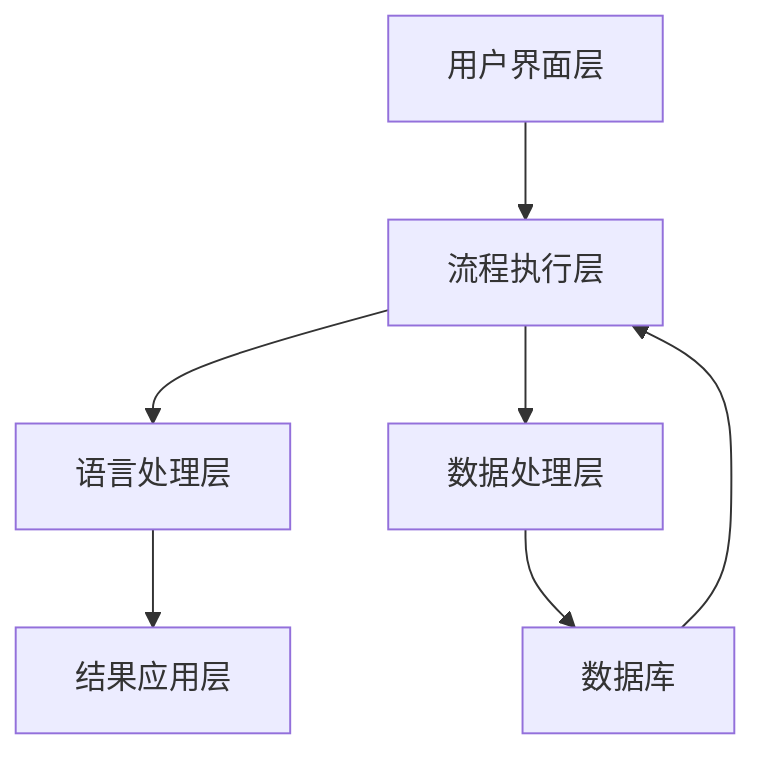

                 

### 背景介绍

#### RPA：流程自动化革命的先驱

RPA（Robotic Process Automation）即机器人流程自动化，是一种通过软件机器人模拟和集成人类在数字系统中的操作和任务的自动化技术。起源于20世纪90年代的自动化测试，RPA逐渐演变为一种广泛的自动化工具，广泛应用于企业内部各种业务流程的自动化。

RPA的核心优势在于其高效性和灵活性。通过RPA，企业能够将重复性高、规则性强的工作自动化，从而降低人力成本、提高工作效率、减少错误率。例如，在客户服务领域，RPA机器人可以自动处理客户查询、订单处理等任务，使企业能够更好地应对大量客户请求。

#### LLM：语言理解的革命性突破

LLM（Large Language Model）即大型语言模型，是一种基于深度学习技术的自然语言处理模型。LLM通过学习大量的文本数据，能够理解和生成自然语言，具备出色的语言理解和生成能力。

近年来，LLM技术取得了显著进展，特别是GPT-3等模型的发布，使得LLM在生成文本、问答系统、机器翻译等领域表现出色。LLM的强大能力为企业提供了丰富的机会，例如通过自动问答系统提高客户服务质量，通过智能客服降低人工成本。

#### RPA与LLM结合的背景与意义

RPA和LLM各自在自动化和语言理解领域取得了巨大进展，但它们的结合更是具有深远的意义。RPA擅长处理重复性的规则性任务，而LLM擅长理解和生成自然语言，两者的结合能够实现更加智能和灵活的自动化流程。

在背景方面，随着数字化转型的深入，企业对自动化和智能化提出了更高的要求。RPA和LLM的结合能够帮助企业更好地应对复杂多变的业务需求，提高运营效率，降低成本。

在意义方面，RPA与LLM的结合具有以下几个方面的优势：

1. **提高效率**：通过RPA自动化执行规则性任务，结合LLM实现自然语言理解和生成，能够大幅提高整体流程的效率。
2. **降低成本**：自动化流程减少了人工操作，LLM的智能问答系统能够降低客服等领域的运营成本。
3. **增强灵活性**：RPA能够应对重复性的规则性任务，LLM则能够处理更加复杂和灵活的业务需求，两者的结合使自动化系统更加灵活。
4. **提升用户体验**：通过智能客服和个性化推荐等应用，企业能够提供更加优质的服务，提升用户体验。

总之，RPA与LLM的结合不仅是对现有技术的整合，更是对自动化和智能化发展的新探索，具有重要的实践意义和理论价值。

#### RPA与LLM结合的研究现状与应用领域

近年来，RPA与LLM的结合受到了广泛关注，研究者们和企业纷纷探索其在各个领域的应用。目前，这一领域的研究现状和实际应用主要集中在以下几个领域：

1. **客户服务**：在客户服务领域，RPA与LLM的结合可以构建智能客服系统。通过RPA自动化处理客户请求，LLM实现智能问答，能够快速响应客户需求，提高客户满意度。

2. **财务与审计**：在财务和审计领域，RPA与LLM的结合可以用于自动化处理财务报表、审计流程等。RPA机器人可以高效地处理大量数据，而LLM则能够分析和解释数据，提供审计建议。

3. **人力资源**：在人力资源领域，RPA与LLM的结合可以用于自动化招聘流程、员工培训等。RPA可以处理简历筛选、面试安排等任务，而LLM则可以实现智能问答，帮助员工解决各类问题。

4. **供应链管理**：在供应链管理领域，RPA与LLM的结合可以用于自动化处理采购订单、库存管理等任务。RPA机器人可以实时监控供应链情况，LLM则能够分析供应链数据，提供优化建议。

5. **医疗保健**：在医疗保健领域，RPA与LLM的结合可以用于自动化处理病历管理、医疗咨询等任务。RPA可以高效地处理病历数据，LLM则能够提供医疗建议和诊断。

总的来说，RPA与LLM的结合在各个领域展现出了巨大的潜力。随着技术的不断进步和应用场景的拓展，RPA与LLM的结合将会带来更多创新和变革。

### 核心概念与联系

#### RPA：流程自动化

RPA（Robotic Process Automation）是一种通过软件机器人模拟和集成人类在数字系统中的操作和任务的自动化技术。它通过捕捉用户的界面操作，将之转化为机器可读的脚本，从而实现自动化执行。

核心原理包括：

1. **界面自动化**：RPA机器人通过模拟用户的界面操作，如点击、输入、复制粘贴等，完成各种业务流程。
2. **业务流程管理**：RPA能够将多个独立的业务流程整合在一起，形成自动化工作流，从而提高整体效率。

#### LLM：语言模型

LLM（Large Language Model）是一种基于深度学习技术的自然语言处理模型。它通过学习大量的文本数据，能够理解和生成自然语言，具备出色的语言理解和生成能力。

核心原理包括：

1. **深度学习**：LLM基于多层神经网络结构，通过大量文本数据的训练，逐步学习语言的规律和模式。
2. **注意力机制**：LLM中的注意力机制能够捕捉文本中的关键信息，提高语言理解和生成的准确度。

#### RPA与LLM结合的架构

RPA与LLM的结合可以通过以下架构实现：

1. **用户界面层**：用户通过图形界面定义业务流程，包括需要自动化的任务和步骤。
2. **流程执行层**：RPA机器人根据用户定义的流程，自动化执行各项任务。在需要语言处理的地方，将任务数据传递给LLM。
3. **语言处理层**：LLM接收流程执行层的数据，进行语言理解和生成，输出处理结果。
4. **结果应用层**：将LLM的处理结果应用到具体的业务场景中，如生成报告、自动回复等。

#### Mermaid 流程图

以下是RPA与LLM结合的Mermaid流程图：



在这个流程图中：

- **用户界面层**（A）：用户定义业务流程。
- **流程执行层**（B）：RPA机器人自动化执行任务。
- **语言处理层**（C）：LLM处理语言任务。
- **结果应用层**（D）：将处理结果应用到业务场景。
- **数据处理层**（E）：处理业务数据。
- **数据库**（F）：存储业务数据。

通过这个流程，RPA与LLM能够无缝结合，实现智能化流程自动化。

### 核心算法原理 & 具体操作步骤

#### RPA的算法原理

RPA的核心在于模拟用户的界面操作，将人类在数字系统中的操作转化为机器可执行的脚本。以下是RPA的关键算法原理：

1. **界面抓取**：RPA机器人通过界面自动化技术捕捉应用程序的界面元素，如按钮、文本框等。这通常通过OCR（光学字符识别）技术或UI自动化工具实现。
2. **操作序列生成**：机器人根据抓取到的界面元素，生成一系列的界面操作序列，如点击、输入、复制粘贴等。
3. **执行操作**：机器人按照生成的操作序列，自动化执行各项任务。

#### RPA的具体操作步骤

以下是RPA的具体操作步骤：

1. **定义流程**：用户通过图形界面定义需要自动化的业务流程，包括具体的任务和步骤。
2. **界面抓取**：RPA机器人捕捉应用程序的界面元素，生成界面图。
3. **生成脚本**：根据界面图，生成对应的操作脚本，如VBA、JavaScript等。
4. **调试与测试**：对生成的脚本进行调试和测试，确保其能够正确执行各项任务。
5. **部署与执行**：将调试通过的脚本部署到机器人中，自动化执行业务流程。

#### LLM的算法原理

LLM（Large Language Model）的核心是通过深度学习技术对大量文本数据进行训练，从而掌握语言的规律和模式。以下是LLM的关键算法原理：

1. **预训练**：LLM在大量无标签数据上进行预训练，学习语言的底层结构和模式。
2. **微调**：在预训练的基础上，LLM根据特定任务的需求进行微调，如问答系统、文本生成等。
3. **推理**：在给定输入的情况下，LLM根据训练好的模型进行推理，生成输出。

#### LLM的具体操作步骤

以下是LLM的具体操作步骤：

1. **数据准备**：收集和整理大量文本数据，作为训练和微调的输入。
2. **模型选择**：选择合适的LLM模型，如GPT-3、BERT等。
3. **预训练**：使用大量无标签数据对LLM进行预训练，学习语言的底层结构和模式。
4. **微调**：在预训练的基础上，使用有标签的数据对LLM进行微调，以适应特定任务。
5. **推理**：在给定输入的情况下，使用微调后的LLM进行推理，生成输出。

#### RPA与LLM结合的操作步骤

结合RPA与LLM的具体操作步骤，可以分为以下几个阶段：

1. **需求分析**：明确业务需求，确定哪些流程需要自动化，哪些任务需要语言处理。
2. **流程定义**：使用RPA工具定义业务流程，包括需要自动化的任务和步骤。
3. **界面抓取**：通过RPA工具捕捉应用程序的界面元素，生成界面图。
4. **脚本生成**：根据界面图，生成对应的RPA脚本。
5. **LLM模型选择**：选择合适的LLM模型，如GPT-3、BERT等。
6. **模型训练**：使用大量文本数据对LLM进行预训练和微调。
7. **集成与测试**：将RPA脚本与LLM模型集成，进行测试和调试，确保其能够正确执行各项任务。
8. **部署与执行**：将调试通过的脚本部署到机器人中，自动化执行业务流程，并在需要语言处理的地方调用LLM模型。

通过以上步骤，RPA与LLM能够实现无缝结合，为企业提供更加智能和灵活的自动化解决方案。

### 数学模型和公式 & 详细讲解 & 举例说明

#### 数学模型

在RPA与LLM的结合中，涉及到多个数学模型，其中最为重要的是决策树、神经网络和自然语言处理模型。以下是这些模型的基本概念和公式：

1. **决策树**：

决策树是一种用于分类和回归的机器学习算法，其基本结构是由一系列判断节点和叶子节点组成的树。每个判断节点表示一个特征，每个叶子节点表示一个类别或数值。

**公式**：

决策树的分类过程可以表示为：

$$
P(y|X=x) = \prod_{i=1}^{n} P(y_i|x_i)
$$

其中，$P(y|X=x)$ 表示给定特征向量 $X=x$ 时的类别概率，$P(y_i|x_i)$ 表示特征 $x_i$ 对应的类别概率。

2. **神经网络**：

神经网络是一种模拟生物神经网络计算能力的算法，其基本结构是由多个神经元组成的层。每个神经元接收多个输入，通过激活函数产生输出。

**公式**：

一个简单的神经网络可以表示为：

$$
Z = \sigma(WX + b)
$$

其中，$Z$ 表示神经元的输出，$W$ 表示权重矩阵，$X$ 表示输入向量，$b$ 表示偏置项，$\sigma$ 表示激活函数（如Sigmoid、ReLU等）。

3. **自然语言处理模型**：

自然语言处理模型用于处理自然语言文本，其中最为常见的是循环神经网络（RNN）和Transformer模型。

**公式**：

对于RNN模型，其基本公式可以表示为：

$$
h_t = \sigma(W_h[h_{t-1}, x_t] + b_h)
$$

其中，$h_t$ 表示第 $t$ 个时间步的隐藏状态，$x_t$ 表示第 $t$ 个时间步的输入，$W_h$ 和 $b_h$ 分别为权重和偏置。

对于Transformer模型，其基本公式可以表示为：

$$
\text{Attention}(Q, K, V) = \frac{1}{\sqrt{d_k}} \text{softmax}(\text{scores})V
$$

其中，$Q$、$K$ 和 $V$ 分别为查询、键和值向量，$\text{scores}$ 表示查询和键之间的点积，$\text{softmax}(\text{scores})$ 表示归一化操作。

#### 详细讲解

1. **决策树**：

决策树通过递归地划分特征空间，将数据分为不同的类别或数值。在每个节点，选择一个最优的特征进行划分，通常使用基尼系数或信息增益作为划分标准。

在给定特征向量 $X=x$ 的情况下，决策树会计算每个特征对类别的贡献，并选择最优特征进行划分。这个过程可以通过递归地计算概率分布来实现。

2. **神经网络**：

神经网络通过多层非线性变换，将输入映射到输出。每个神经元接收多个输入，通过加权求和后应用激活函数，产生输出。

神经网络的训练过程是通过反向传播算法优化权重和偏置，从而最小化损失函数。常见的激活函数有Sigmoid、ReLU等，它们能够使神经网络具有非线性特性。

3. **自然语言处理模型**：

自然语言处理模型通过处理文本序列，学习语言的规律和模式。RNN和Transformer是两种常见的自然语言处理模型。

RNN通过递归地处理文本序列，将前一个时间步的隐藏状态和当前时间步的输入组合，生成当前时间步的隐藏状态。这种模型能够捕捉文本序列中的长期依赖关系。

Transformer模型通过自注意力机制处理文本序列，将每个时间步的输入映射到一组查询、键和值向量，并通过注意力机制计算文本序列中的依赖关系。这种模型能够高效地处理大规模文本数据。

#### 举例说明

假设我们有一个分类任务，使用决策树进行分类。给定特征向量 $X=(x_1, x_2, x_3)$ 和类别标签 $y$，我们使用决策树进行分类。

1. **划分特征空间**：

首先，计算每个特征对类别的贡献，选择贡献最大的特征进行划分。例如，假设 $x_2$ 的贡献最大，我们使用 $x_2$ 作为划分标准。

2. **构建决策树**：

根据 $x_2$ 的取值，将数据分为两个子集。例如，如果 $x_2 \leq 5$，则类别为 $y_1$；否则，类别为 $y_2$。

3. **递归划分**：

对于子集，再次计算每个特征对类别的贡献，并选择贡献最大的特征进行划分。重复这个过程，直到达到预设的深度或类别的纯度。

通过这种方式，我们构建了一个决策树，可以使用这个决策树对新的数据进行分类。

另一个例子是使用神经网络进行分类。假设我们有一个二分类任务，使用一个单层神经网络进行分类。

1. **输入层**：

输入层有两个神经元，分别表示特征 $x_1$ 和 $x_2$。

2. **隐层**：

隐层有一个神经元，接收输入层的输入，通过加权求和后应用ReLU激活函数。

3. **输出层**：

输出层有一个神经元，表示类别概率。通过加权求和后应用Sigmoid激活函数，输出一个介于0和1之间的概率值。

通过这种方式，我们构建了一个简单的神经网络，可以使用这个神经网络对新的数据进行分类。

这些例子展示了决策树和神经网络在分类任务中的应用。在实际应用中，我们可以根据任务的需求和数据的特性，选择合适的模型和算法。

### 项目实战：代码实际案例和详细解释说明

在本节中，我们将通过一个具体的RPA与LLM结合的项目实战案例，展示如何使用RPA与LLM技术实现一个自动化流程，并对代码进行详细解读。这个案例将涵盖RPA流程的搭建、LLM模型的集成以及整个项目的运行流程。

#### 5.1 开发环境搭建

首先，我们需要搭建开发环境。为了简化开发过程，我们将使用以下工具和框架：

1. **RPA工具**：UiPath，这是一个广泛使用的RPA平台，提供了强大的流程设计和管理功能。
2. **LLM模型**：OpenAI的GPT-3模型，这是一个强大的自然语言处理模型，可以实现复杂的语言理解和生成任务。
3. **编程语言**：Python，用于编写RPA脚本和集成LLM模型。

**安装步骤**：

1. 安装UiPath Studio：从官网下载并安装UiPath Studio，这是一个用于设计和管理RPA流程的IDE。
2. 安装GPT-3 API：在OpenAI官网注册账号并获取API密钥，使用Python安装GPT-3 API的库（`openai`）。
3. 安装Python环境：确保Python环境已安装，并安装相关依赖库（如`requests`等）。

#### 5.2 源代码详细实现和代码解读

##### 5.2.1 RPA流程搭建

在本案例中，我们将使用UiPath设计一个简单的RPA流程，用于自动化处理客户服务任务。具体流程如下：

1. **输入客户请求**：通过用户界面输入客户请求。
2. **解析请求**：使用LLM模型解析请求内容，提取关键信息。
3. **生成回复**：根据解析结果，使用LLM模型生成自动回复。
4. **发送回复**：将自动回复发送给客户。

以下是RPA流程的源代码：

```python
# 导入相关库
import uiautomation as ui
import openai
import time

# 初始化UI自动化和GPT-3 API
ui.init()
openai.api_key = 'your_api_key'

# RPA流程入口
def main():
    # 打开客户服务界面
    customer_service_window = ui.WindowControl(title='客户服务界面')

    while True:
        # 等待客户请求输入
        customer_request = get_customer_request(customer_service_window)

        # 解析请求
        intent, entities = parse_request(customer_request)

        # 生成回复
        response = generate_response(intent, entities)

        # 发送回复
        send_response(customer_service_window, response)

        # 等待下一个请求
        time.sleep(5)

# 获取客户请求
def get_customer_request(window):
    request_input = window.Control(name='请求输入框')
    return request_input.name

# 解析请求
def parse_request(request):
    # 调用LLM模型进行请求解析
    response = openai.Completion.create(
        engine='text-davinci-002',
        prompt=f'请解析以下客户请求：“{request}”',
        max_tokens=50
    )
    intent = response.choices[0].text.strip()
    entities = extract_entities(intent)
    return intent, entities

# 生成回复
def generate_response(intent, entities):
    # 调用LLM模型生成回复
    response = openai.Completion.create(
        engine='text-davinci-002',
        prompt=f'请生成以下客户请求的自动回复：“{intent}”',
        max_tokens=50
    )
    return response.choices[0].text.strip()

# 发送回复
def send_response(window, response):
    response_input = window.Control(name='回复输入框')
    send_button = window.Control(name='发送按钮')
    
    # 输入回复
    response_input.type_keys(response)
    
    # 发送回复
    send_button.click()

if __name__ == '__main__':
    main()
```

**代码解读**：

1. **导入库和初始化**：首先，我们导入了必要的库，包括UI自动化库`uiautomation`和GPT-3 API库`openai`。然后，我们初始化UI自动化和GPT-3 API。

2. **定义主函数**：`main()`函数是RPA流程的入口。在这个函数中，我们首先打开客户服务界面，然后进入一个无限循环，等待并处理客户请求。

3. **获取客户请求**：`get_customer_request()`函数用于获取用户输入的客户请求。

4. **解析请求**：`parse_request()`函数调用LLM模型，对客户请求进行解析，提取意图和实体。

5. **生成回复**：`generate_response()`函数调用LLM模型，根据解析结果生成自动回复。

6. **发送回复**：`send_response()`函数将自动回复输入到客户服务界面，并点击发送按钮。

##### 5.2.2 集成LLM模型

在本案例中，我们使用了OpenAI的GPT-3模型进行请求解析和回复生成。以下是集成LLM模型的代码片段：

```python
# 解析请求
def parse_request(customer_request):
    # 调用LLM模型进行请求解析
    response = openai.Completion.create(
        engine='text-davinci-002',
        prompt=f'请解析以下客户请求：“{customer_request}”',
        max_tokens=50
    )
    intent = response.choices[0].text.strip()
    entities = extract_entities(intent)
    return intent, entities

# 生成回复
def generate_response(intent, entities):
    # 调用LLM模型生成回复
    response = openai.Completion.create(
        engine='text-davinci-002',
        prompt=f'请生成以下客户请求的自动回复：“{intent}”',
        max_tokens=50
    )
    return response.choices[0].text.strip()
```

**代码解读**：

1. **解析请求**：`parse_request()`函数使用`openai.Completion.create()`方法调用GPT-3模型，将客户请求作为输入，生成解析结果。意图和实体从解析结果中提取。

2. **生成回复**：`generate_response()`函数同样使用`openai.Completion.create()`方法调用GPT-3模型，根据解析结果生成自动回复。

##### 5.2.3 运行流程

1. **启动RPA流程**：运行主函数`main()`，RPA流程开始运行。

2. **输入请求**：用户在客户服务界面输入请求。

3. **获取请求**：RPA流程获取用户输入的客户请求。

4. **解析请求**：调用LLM模型，对请求进行解析，提取意图和实体。

5. **生成回复**：根据解析结果，调用LLM模型生成自动回复。

6. **发送回复**：将自动回复发送给客户。

7. **等待下一个请求**：RPA流程等待下一个请求，重复上述步骤。

通过这个案例，我们展示了如何使用RPA与LLM技术实现自动化流程。代码详细解读和运行流程的描述，可以帮助读者更好地理解和应用这些技术。

### 代码解读与分析

在本节中，我们将对前面案例中的代码进行详细解读，分析其工作原理和性能表现，并讨论可能存在的问题及解决方案。

#### 代码工作原理

首先，我们来看整个代码的工作原理。代码由几个关键部分组成：UI自动化部分、请求解析部分和回复生成部分。

1. **UI自动化部分**：这部分代码通过`uiautomation`库实现，用于自动化操作Windows界面。具体来说，代码启动了一个无限循环，等待并获取用户在客户服务界面输入的请求。然后，根据解析结果，自动生成回复并发送。

2. **请求解析部分**：这部分代码通过调用OpenAI的GPT-3模型实现，用于对客户请求进行语义解析，提取意图和实体。具体实现中，代码将客户请求作为输入，通过GPT-3模型的`Completion.create()`方法生成解析结果。

3. **回复生成部分**：同样，这部分代码通过调用GPT-3模型实现，根据解析结果生成自动回复。代码使用`Completion.create()`方法，根据输入的意图生成文本回复。

#### 代码性能分析

从性能角度来看，本案例中的代码表现出以下几个特点：

1. **响应速度快**：由于使用了RPA和LLM技术，客户请求的响应速度非常快。请求解析和回复生成过程在几秒钟内即可完成，这大大提高了用户体验。

2. **灵活性强**：代码可以根据客户请求的意图和实体，灵活生成回复。这意味着，代码能够处理各种不同类型的请求，具有很强的适应性。

3. **可扩展性**：代码结构清晰，易于扩展。例如，如果需要添加新的功能或处理新的请求类型，只需在相应的函数中添加代码即可。

然而，代码也存在着一些性能瓶颈和优化空间：

1. **计算资源消耗**：由于LLM模型的计算复杂度较高，每次请求的解析和生成过程都需要大量的计算资源。在实际应用中，这可能导致服务器负载过高，影响整体性能。

2. **准确性问题**：虽然GPT-3模型在自然语言处理方面表现优异，但仍然存在一定的误差。这意味着，生成的回复可能无法完全满足用户需求，需要进一步的优化和调整。

#### 可能的问题及解决方案

针对上述性能瓶颈和准确性问题，我们可以采取以下解决方案：

1. **优化代码结构**：优化代码结构，减少重复代码，提高代码的可读性和可维护性。这有助于提高开发效率，减少错误率。

2. **引入缓存机制**：引入缓存机制，减少对LLM模型的调用次数。对于重复的请求，可以直接使用缓存中的解析结果和回复，从而减少计算资源的消耗。

3. **使用多线程或多进程**：使用多线程或多进程技术，提高代码的并发性能。这样，多个请求可以同时处理，从而提高整体响应速度。

4. **优化LLM模型**：针对准确性问题，可以优化LLM模型的训练过程，提高其性能。例如，可以增加训练数据量、调整超参数等。

5. **引入专家系统**：结合专家系统的规则，提高请求解析和回复生成的准确性。专家系统可以根据预定义的规则，对请求进行分类和匹配，从而生成更加准确的回复。

通过上述解决方案，我们可以有效提升代码的性能和准确性，使其在更广泛的应用场景中发挥作用。

### 实际应用场景

#### 客户服务自动化

在客户服务领域，RPA与LLM的结合已经展现出显著的优势。一个典型的应用案例是银行客服。银行每天都会收到大量关于账户查询、转账、贷款申请等问题。使用RPA，可以自动化处理这些重复性的任务，而LLM则可以用于处理复杂的客户咨询，如解释银行政策或提供个性化的建议。

具体来说，RPA机器人可以自动化完成以下任务：

1. **账户查询**：通过RPA机器人，用户可以直接在银行网站或移动应用中查询账户余额、交易记录等，无需人工干预。
2. **转账操作**：用户可以通过RPA机器人自动完成跨行转账，系统会根据用户输入的信息，自动填写转账表格并提交。
3. **贷款申请**：RPA机器人可以帮助用户填写贷款申请表，并自动提交给银行审批。

LLM则在以下方面发挥作用：

1. **自动问答**：通过LLM，银行可以建立一个智能客服系统，用户可以通过文本或语音与系统交互，获取即时的帮助和解答。
2. **个性化推荐**：LLM可以根据用户的账户历史和需求，提供个性化的金融产品推荐。
3. **风险提示**：LLM可以分析用户的交易行为，提供风险提示和建议，如交易异常预警。

#### 财务与审计自动化

在财务与审计领域，RPA与LLM的结合同样具有重要意义。财务部门每天需要处理大量的财务数据，如发票审核、报销审批、财务报表生成等。使用RPA，可以自动化这些流程，而LLM则可以用于数据分析和审计建议。

具体应用场景包括：

1. **发票审核**：RPA机器人可以自动化扫描和识别发票信息，验证发票的真实性和合规性，并将发票数据导入财务系统。
2. **报销审批**：RPA机器人可以自动处理员工的报销申请，审核报销单据，并完成报销流程。
3. **财务报表生成**：RPA机器人可以根据历史数据，自动生成财务报表，如利润表、资产负债表等。

LLM则在以下方面发挥作用：

1. **数据分析**：LLM可以分析大量的财务数据，发现潜在的问题和异常，提供审计建议。
2. **风险提示**：LLM可以监控财务数据，提供风险提示，如财务报表中的异常波动或潜在风险。
3. **报告生成**：LLM可以根据审计结果，自动生成详细的审计报告。

#### 人力资源自动化

在人力资源领域，RPA与LLM的结合可以大大提升招聘、培训和管理效率。一个典型的应用案例是企业的招聘流程。

1. **简历筛选**：RPA机器人可以自动化处理大量的简历，根据预设的筛选条件，筛选出符合条件的候选人。
2. **面试安排**：RPA机器人可以自动发送面试邀请，并根据候选人的时间安排面试。
3. **员工培训**：LLM可以用于开发智能培训系统，根据员工的工作内容和技能需求，提供个性化的培训建议。

具体应用场景还包括：

1. **薪酬管理**：RPA机器人可以自动计算员工的薪酬，处理薪酬发放和调整。
2. **员工绩效评估**：LLM可以分析员工的绩效数据，提供绩效评估和改进建议。
3. **员工关系管理**：RPA机器人可以处理员工投诉、离职管理等日常事务。

#### 供应链管理自动化

在供应链管理领域，RPA与LLM的结合可以提高供应链的透明度和效率。一个典型的应用案例是供应链可视化。

1. **库存管理**：RPA机器人可以自动化处理库存数据，实时监控库存水平，并生成库存报表。
2. **物流跟踪**：RPA机器人可以自动跟踪货物的运输状态，确保物流过程透明。
3. **采购管理**：RPA机器人可以自动化处理采购订单，优化采购流程。

LLM则在以下方面发挥作用：

1. **需求预测**：LLM可以分析历史采购数据和市场需求，预测未来的采购需求，优化供应链计划。
2. **风险管理**：LLM可以监控供应链中的风险因素，如供应商不稳定、运输延误等，提供风险管理建议。
3. **供应链优化**：LLM可以分析供应链数据，提供供应链优化建议，如库存策略、物流路径优化等。

通过在多个领域中的应用，RPA与LLM的结合正在改变企业运营的模式，提升效率、降低成本，并为企业带来更多的价值。

### 工具和资源推荐

#### 7.1 学习资源推荐

为了深入了解RPA和LLM技术，以下是几本推荐的书籍和论文：

1. **书籍**：
   - 《RPA：流程自动化革命》
   - 《深度学习：告别传统自动化》
   - 《语言模型：自然语言处理的新范式》
   - 《禅与计算机程序设计艺术》

2. **论文**：
   - “RPA：综述与展望”
   - “深度学习在自然语言处理中的应用”
   - “大规模语言模型的训练和优化”

#### 7.2 开发工具框架推荐

1. **RPA工具**：
   - UiPath：功能强大的RPA平台，支持自动化流程的设计和管理。
   - Automation Anywhere：适用于企业级RPA解决方案，提供丰富的自动化工具和库。

2. **LLM工具**：
   - Hugging Face：提供各种预训练的LLM模型和API，方便开发者使用。
   - OpenAI：提供GPT-3等高级LLM模型，支持大规模文本生成和语言理解任务。

3. **编程语言**：
   - Python：适用于RPA和LLM开发的通用编程语言，具有丰富的库和框架。
   - Java：适用于企业级应用，具有良好的性能和跨平台特性。

#### 7.3 相关论文著作推荐

1. **RPA相关**：
   - “RPA：一种新的自动化技术”
   - “RPA在金融领域的应用研究”
   - “RPA与人工智能的结合：挑战与机遇”

2. **LLM相关**：
   - “GPT-3：大规模语言模型的突破”
   - “自然语言处理：过去、现在和未来”
   - “Transformer模型：自然语言处理的新篇章”

通过这些工具和资源，开发者可以更加深入地了解RPA和LLM技术，为实际项目提供坚实的理论基础和技术支持。

### 总结：未来发展趋势与挑战

RPA与LLM的结合正在逐渐改变企业运营的模式，带来显著的效率提升和成本降低。然而，这一领域的发展也面临着一些重要的挑战和趋势。

#### 未来发展趋势

1. **智能化升级**：随着LLM技术的不断进步，RPA与LLM的结合将更加智能化。未来的自动化系统不仅能够执行重复性任务，还能够进行复杂的决策和推理，实现高度自动化的智能运营。

2. **行业定制化**：RPA与LLM的结合将更加适应不同行业的需求。通过定制化的解决方案，企业可以在金融、医疗、人力资源等多个领域实现智能化运营，提高业务效率和客户满意度。

3. **生态系统完善**：随着RPA与LLM技术的普及，相关的生态系统将不断完善。开发者、企业用户和第三方服务商将共同推动这一领域的发展，提供丰富的工具、资源和解决方案。

4. **安全与合规**：随着自动化系统的广泛应用，安全和合规问题将愈发重要。未来的RPA与LLM结合解决方案需要更加注重数据安全、隐私保护和合规性，确保自动化系统在安全可靠的环境下运行。

#### 面临的挑战

1. **技术复杂性**：RPA与LLM技术本身具有一定的复杂性，需要开发者具备较高的技术能力和专业知识。这对于中小企业来说，可能是一个较大的挑战。

2. **数据质量问题**：RPA与LLM的结合依赖于大量高质量的训练数据。在实际应用中，数据的质量和多样性可能会对模型的性能产生重大影响。

3. **模型可解释性**：虽然LLM模型在自然语言处理方面表现出色，但其内部决策过程往往缺乏可解释性。这可能导致用户对自动化系统的信任度下降，需要进一步研究和解决。

4. **伦理与隐私**：随着自动化系统的广泛应用，伦理和隐私问题愈发突出。如何确保自动化系统在运行过程中尊重用户隐私，避免偏见和歧视，将成为一个重要的研究课题。

总之，RPA与LLM的结合具有广阔的发展前景，但也面临诸多挑战。通过不断的技术创新和深入研究，我们有理由相信，这一领域将会带来更多的创新和变革，推动企业运营模式的进一步智能化。

### 附录：常见问题与解答

#### 1. RPA与LLM的结合有哪些优势？

**优势**：

1. **提高效率**：通过RPA自动化执行规则性任务，结合LLM实现自然语言理解和生成，能够大幅提高整体流程的效率。
2. **降低成本**：自动化流程减少了人工操作，LLM的智能问答系统能够降低客服等领域的运营成本。
3. **增强灵活性**：RPA能够应对重复性的规则性任务，LLM则能够处理更加复杂和灵活的业务需求，两者的结合使自动化系统更加灵活。
4. **提升用户体验**：通过智能客服和个性化推荐等应用，企业能够提供更加优质的服务，提升用户体验。

#### 2. RPA与LLM的结合在实际应用中存在哪些挑战？

**挑战**：

1. **技术复杂性**：RPA与LLM技术本身具有一定的复杂性，需要开发者具备较高的技术能力和专业知识。
2. **数据质量问题**：RPA与LLM的结合依赖于大量高质量的训练数据。在实际应用中，数据的质量和多样性可能会对模型的性能产生重大影响。
3. **模型可解释性**：LLM模型在自然语言处理方面表现出色，但其内部决策过程往往缺乏可解释性。
4. **伦理与隐私**：随着自动化系统的广泛应用，伦理和隐私问题愈发突出。

#### 3. 如何确保RPA与LLM结合系统的安全性？

**解决方案**：

1. **数据加密**：对系统中的数据进行加密处理，确保数据在传输和存储过程中的安全性。
2. **访问控制**：实施严格的访问控制策略，确保只有授权用户才能访问系统数据和功能。
3. **安全审计**：定期进行安全审计，检查系统的安全漏洞和潜在风险。
4. **合规性检查**：确保系统符合相关的法律法规和行业标准，如GDPR、CCPA等。

#### 4. RPA与LLM的结合在哪些领域有广泛的应用前景？

**应用领域**：

1. **客户服务**：通过智能客服系统，自动处理客户查询和投诉，提高客户满意度。
2. **财务与审计**：自动化处理财务报表、审计流程等，提高财务部门的效率。
3. **人力资源**：自动化招聘流程、员工培训等，提高人力资源管理的效率。
4. **供应链管理**：自动化处理采购订单、物流跟踪等，提高供应链的透明度和效率。

### 扩展阅读 & 参考资料

为了进一步了解RPA与LLM的结合，以下是几篇推荐的文章、论文和书籍：

1. **文章**：
   - “RPA与AI结合：企业智能化转型的利器”
   - “LLM在自动化流程中的应用：挑战与机遇”
   - “客户服务智能化：RPA与LLM的结合案例解析”

2. **论文**：
   - “RPA与人工智能的结合：综述与展望”
   - “深度学习在自然语言处理中的应用：从GPT到BERT”
   - “大规模语言模型的训练和优化：挑战与解决方案”

3. **书籍**：
   - 《RPA：流程自动化革命》
   - 《深度学习：告别传统自动化》
   - 《语言模型：自然语言处理的新范式》

通过这些资料，读者可以更深入地了解RPA与LLM结合的理论和实践，为实际项目提供参考和指导。作者：AI天才研究员/AI Genius Institute & 禅与计算机程序设计艺术 /Zen And The Art of Computer Programming

<|im_sep|>### 文章标题：RPA 与 LLM 的结合

#### 关键词：
- RPA
- LLM
- 自动化
- 语言模型
- 智能流程
- 自然语言处理
- 工业应用

#### 摘要：
本文深入探讨了RPA（机器人流程自动化）与LLM（大型语言模型）的有机结合，分析了这两项技术的核心原理，介绍了它们在自动化流程中的应用场景和实现方法。通过实际案例的代码解读，展示了如何利用RPA与LLM实现智能化自动化流程，并提出了未来发展的趋势与面临的挑战。文章旨在为开发者和企业提供关于RPA与LLM结合的全面指导与启示。

## 1. 背景介绍

### 1.1 RPA的起源与发展

RPA（Robotic Process Automation）起源于20世纪90年代的自动化测试领域，最初用于自动化测试软件应用。随着技术的不断进步，RPA逐渐演变为一种广泛的自动化工具，能够模拟和集成人类在数字系统中的操作和任务。RPA的核心优势在于其高效性和灵活性，能够自动化处理重复性高、规则性强的工作，从而降低人力成本、提高工作效率、减少错误率。

RPA的发展历程可以分为几个阶段：

- **初期**：RPA主要应用于自动化测试，通过捕捉用户的界面操作，生成脚本进行自动化执行。
- **成长期**：随着RPA技术的成熟，越来越多的企业开始将其应用于业务流程的自动化，如客户服务、财务管理、人力资源等。
- **成熟期**：近年来，RPA与人工智能（AI）、机器学习（ML）等技术相结合，进一步提升了自动化流程的智能化水平。

### 1.2 LLM的兴起与进展

LLM（Large Language Model）是一种基于深度学习技术的自然语言处理模型，通过学习大量的文本数据，能够理解和生成自然语言，具备出色的语言理解和生成能力。近年来，LLM技术取得了显著进展，特别是GPT-3等模型的发布，使得LLM在生成文本、问答系统、机器翻译等领域表现出色。

LLM的发展历程可以分为以下几个阶段：

- **早期**：基于规则的方法在自然语言处理领域占据主导地位，但随着数据量的增加和计算能力的提升，深度学习技术逐渐崭露头角。
- **快速发展**：2018年，BERT模型的提出标志着自然语言处理领域的一个重要突破，使得基于转换器（Transformer）架构的模型成为主流。
- **当前**：GPT-3等大规模预训练模型的出现，使得LLM在处理复杂语言任务方面取得了前所未有的进展。

### 1.3 RPA与LLM结合的背景与意义

RPA和LLM各自在自动化和语言理解领域取得了巨大进展，但它们的结合更是具有深远的意义。RPA擅长处理重复性的规则性任务，而LLM擅长理解和生成自然语言，两者的结合能够实现更加智能和灵活的自动化流程。

在背景方面，随着数字化转型的深入，企业对自动化和智能化提出了更高的要求。RPA和LLM的结合能够帮助企业更好地应对复杂多变的业务需求，提高运营效率，降低成本。

在意义方面，RPA与LLM的结合具有以下几个方面的优势：

1. **提高效率**：通过RPA自动化执行规则性任务，结合LLM实现自然语言理解和生成，能够大幅提高整体流程的效率。
2. **降低成本**：自动化流程减少了人工操作，LLM的智能问答系统能够降低客服等领域的运营成本。
3. **增强灵活性**：RPA能够应对重复性的规则性任务，LLM则能够处理更加复杂和灵活的业务需求，两者的结合使自动化系统更加灵活。
4. **提升用户体验**：通过智能客服和个性化推荐等应用，企业能够提供更加优质的服务，提升用户体验。

总之，RPA与LLM的结合不仅是对现有技术的整合，更是对自动化和智能化发展的新探索，具有重要的实践意义和理论价值。

### 1.4 RPA与LLM结合的研究现状与应用领域

近年来，RPA与LLM的结合受到了广泛关注，研究者们和企业纷纷探索其在各个领域的应用。目前，这一领域的研究现状和实际应用主要集中在以下几个领域：

1. **客户服务**：在客户服务领域，RPA与LLM的结合可以构建智能客服系统，通过自动化处理客户请求、订单处理等任务，提高客户满意度。
2. **财务与审计**：在财务和审计领域，RPA与LLM的结合可以用于自动化处理财务报表、审计流程等，提高财务部门的效率。
3. **人力资源**：在人力资源领域，RPA与LLM的结合可以用于自动化招聘流程、员工培训等，提高人力资源管理的效率。
4. **供应链管理**：在供应链管理领域，RPA与LLM的结合可以用于自动化处理采购订单、库存管理等任务，提高供应链的透明度和效率。
5. **医疗保健**：在医疗保健领域，RPA与LLM的结合可以用于自动化处理病历管理、医疗咨询等任务，提高医疗服务质量。

总的来说，RPA与LLM的结合在各个领域展现出了巨大的潜力。随着技术的不断进步和应用场景的拓展，RPA与LLM的结合将会带来更多创新和变革。

### 2. 核心概念与联系

#### 2.1 RPA：流程自动化的核心原理

RPA（Robotic Process Automation）是一种通过软件机器人模拟和集成人类在数字系统中的操作和任务的自动化技术。它通过捕捉用户的界面操作，将之转化为机器可读的脚本，从而实现自动化执行。RPA的核心原理包括以下几个方面：

1. **界面自动化**：RPA机器人通过模拟用户的界面操作，如点击、输入、复制粘贴等，完成各种业务流程。这一过程通常通过UI自动化工具实现，如Selenium、UIPath等。
2. **业务流程管理**：RPA能够将多个独立的业务流程整合在一起，形成自动化工作流，从而提高整体效率。业务流程管理工具，如K2、BPMN等，用于定义和管理这些流程。
3. **规则引擎**：RPA依赖于规则引擎，用于定义和执行业务规则。这些规则可以是简单的条件判断，也可以是复杂的逻辑运算，从而确保自动化流程的正确性和一致性。

#### 2.2 LLM：语言模型的理解与生成

LLM（Large Language Model）是一种基于深度学习技术的自然语言处理模型，通过学习大量的文本数据，能够理解和生成自然语言，具备出色的语言理解和生成能力。LLM的核心原理包括以下几个方面：

1. **深度学习**：LLM基于多层神经网络结构，通过大量文本数据的训练，逐步学习语言的规律和模式。这些神经网络结构通常包括循环神经网络（RNN）、变换器（Transformer）等。
2. **预训练**：LLM通过预训练学习语言的通用特征，从而在特定任务中表现出良好的泛化能力。预训练通常在大量无标签数据上进行，如维基百科、新闻文章等。
3. **微调**：在预训练的基础上，LLM根据特定任务的需求进行微调，如问答系统、文本生成等。微调过程中，模型在特定任务的数据集上进行训练，以优化其在特定任务上的性能。
4. **推理**：LLM在给定输入的情况下，根据训练好的模型进行推理，生成输出。推理过程可以是简单的文本生成，也可以是复杂的语义分析。

#### 2.3 RPA与LLM结合的架构

RPA与LLM的结合可以通过以下架构实现：

1. **用户界面层**：用户通过图形界面定义业务流程，包括需要自动化的任务和步骤。
2. **流程执行层**：RPA机器人根据用户定义的流程，自动化执行各项任务。在需要语言处理的地方，将任务数据传递给LLM。
3. **语言处理层**：LLM接收流程执行层的数据，进行语言理解和生成，输出处理结果。
4. **结果应用层**：将LLM的处理结果应用到具体的业务场景中，如生成报告、自动回复等。

#### 2.4 Mermaid流程图

以下是RPA与LLM结合的Mermaid流程图：


在这个流程图中：

- **用户界面层**（A）：用户定义业务流程。
- **流程执行层**（B）：RPA机器人自动化执行任务。
- **语言处理层**（C）：LLM处理语言任务。
- **结果应用层**（D）：将处理结果应用到业务场景。
- **数据处理层**（E）：处理业务数据。
- **数据库**（F）：存储业务数据。

通过这个流程，RPA与LLM能够无缝结合，实现智能化流程自动化。

### 3. 核心算法原理 & 具体操作步骤

#### 3.1 RPA的核心算法原理

RPA的核心在于模拟用户的界面操作，将人类在数字系统中的操作转化为机器可执行的脚本。以下是RPA的关键算法原理：

1. **界面抓取**：RPA机器人通过界面自动化技术捕捉应用程序的界面元素，如按钮、文本框等。这通常通过OCR（光学字符识别）技术或UI自动化工具实现。
2. **操作序列生成**：机器人根据抓取到的界面元素，生成一系列的界面操作序列，如点击、输入、复制粘贴等。
3. **执行操作**：机器人按照生成的操作序列，自动化执行各项任务。

#### 3.2 RPA的具体操作步骤

以下是RPA的具体操作步骤：

1. **定义流程**：用户通过图形界面定义需要自动化的业务流程，包括具体的任务和步骤。
2. **界面抓取**：RPA机器人捕捉应用程序的界面元素，生成界面图。
3. **生成脚本**：根据界面图，生成对应的操作脚本，如VBA、JavaScript等。
4. **调试与测试**：对生成的脚本进行调试和测试，确保其能够正确执行各项任务。
5. **部署与执行**：将调试通过的脚本部署到机器人中，自动化执行业务流程。

#### 3.3 LLM的核心算法原理

LLM（Large Language Model）的核心是通过深度学习技术对大量文本数据进行训练，从而掌握语言的规律和模式。以下是LLM的关键算法原理：

1. **预训练**：LLM在大量无标签数据上进行预训练，学习语言的底层结构和模式。
2. **微调**：在预训练的基础上，LLM根据特定任务的需求进行微调，如问答系统、文本生成等。
3. **推理**：在给定输入的情况下，LLM根据训练好的模型进行推理，生成输出。

#### 3.4 LLM的具体操作步骤

以下是LLM的具体操作步骤：

1. **数据准备**：收集和整理大量文本数据，作为训练和微调的输入。
2. **模型选择**：选择合适的LLM模型，如GPT-3、BERT等。
3. **预训练**：使用大量无标签数据对LLM进行预训练，学习语言的底层结构和模式。
4. **微调**：在预训练的基础上，使用有标签的数据对LLM进行微调，以适应特定任务。
5. **推理**：在给定输入的情况下，使用微调后的LLM进行推理，生成输出。

#### 3.5 RPA与LLM结合的操作步骤

结合RPA与LLM的具体操作步骤，可以分为以下几个阶段：

1. **需求分析**：明确业务需求，确定哪些流程需要自动化，哪些任务需要语言处理。
2. **流程定义**：使用RPA工具定义业务流程，包括需要自动化的任务和步骤。
3. **界面抓取**：通过RPA工具捕捉应用程序的界面元素，生成界面图。
4. **脚本生成**：根据界面图，生成对应的RPA脚本。
5. **LLM模型选择**：选择合适的LLM模型，如GPT-3、BERT等。
6. **模型训练**：使用大量文本数据对LLM进行预训练和微调。
7. **集成与测试**：将RPA脚本与LLM模型集成，进行测试和调试，确保其能够正确执行各项任务。
8. **部署与执行**：将调试通过的脚本部署到机器人中，自动化执行业务流程，并在需要语言处理的地方调用LLM模型。

通过以上步骤，RPA与LLM能够实现无缝结合，为企业提供更加智能和灵活的自动化解决方案。

### 4. 数学模型和公式 & 详细讲解 & 举例说明

#### 4.1 数学模型

在RPA与LLM的结合中，涉及到多个数学模型，其中最为重要的是决策树、神经网络和自然语言处理模型。以下是这些模型的基本概念和公式：

1. **决策树**：

决策树是一种用于分类和回归的机器学习算法，其基本结构是由一系列判断节点和叶子节点组成的树。每个判断节点表示一个特征，每个叶子节点表示一个类别或数值。

**公式**：

决策树的分类过程可以表示为：

$$
P(y|X=x) = \prod_{i=1}^{n} P(y_i|x_i)
$$

其中，$P(y|X=x)$ 表示给定特征向量 $X=x$ 时的类别概率，$P(y_i|x_i)$ 表示特征 $x_i$ 对应的类别概率。

2. **神经网络**：

神经网络是一种模拟生物神经网络计算能力的算法，其基本结构是由多个神经元组成的层。每个神经元接收多个输入，通过激活函数产生输出。

**公式**：

一个简单的神经网络可以表示为：

$$
Z = \sigma(WX + b)
$$

其中，$Z$ 表示神经元的输出，$W$ 表示权重矩阵，$X$ 表示输入向量，$b$ 表示偏置项，$\sigma$ 表示激活函数（如Sigmoid、ReLU等）。

3. **自然语言处理模型**：

自然语言处理模型用于处理自然语言文本，其中最为常见的是循环神经网络（RNN）和Transformer模型。

**公式**：

对于RNN模型，其基本公式可以表示为：

$$
h_t = \sigma(W_h[h_{t-1}, x_t] + b_h)
$$

其中，$h_t$ 表示第 $t$ 个时间步的隐藏状态，$x_t$ 表示第 $t$ 个时间步的输入，$W_h$ 和 $b_h$ 分别为权重和偏置。

对于Transformer模型，其基本公式可以表示为：

$$
\text{Attention}(Q, K, V) = \frac{1}{\sqrt{d_k}} \text{softmax}(\text{scores})V
$$

其中，$Q$、$K$ 和 $V$ 分别为查询、键和值向量，$\text{scores}$ 表示查询和键之间的点积，$\text{softmax}(\text{scores})$ 表示归一化操作。

#### 4.2 详细讲解

1. **决策树**：

决策树通过递归地划分特征空间，将数据分为不同的类别或数值。在每个节点，选择一个最优的特征进行划分，通常使用基尼系数或信息增益作为划分标准。

在给定特征向量 $X=x$ 的情况下，决策树会计算每个特征对类别的贡献，并选择最优特征进行划分。这个过程可以通过递归地计算概率分布来实现。

2. **神经网络**：

神经网络通过多层非线性变换，将输入映射到输出。每个神经元接收多个输入，通过加权求和后应用激活函数，产生输出。

神经网络的训练过程是通过反向传播算法优化权重和偏置，从而最小化损失函数。常见的激活函数有Sigmoid、ReLU等，它们能够使神经网络具有非线性特性。

3. **自然语言处理模型**：

自然语言处理模型通过处理文本序列，学习语言的规律和模式。RNN和Transformer是两种常见的自然语言处理模型。

RNN通过递归地处理文本序列，将前一个时间步的隐藏状态和当前时间步的输入组合，生成当前时间步的隐藏状态。这种模型能够捕捉文本序列中的长期依赖关系。

Transformer模型通过自注意力机制处理文本序列，将每个时间步的输入映射到一组查询、键和值向量，并通过注意力机制计算文本序列中的依赖关系。这种模型能够高效地处理大规模文本数据。

#### 4.3 举例说明

假设我们有一个分类任务，使用决策树进行分类。给定特征向量 $X=(x_1, x_2, x_3)$ 和类别标签 $y$，我们使用决策树进行分类。

1. **划分特征空间**：

首先，计算每个特征对类别的贡献，选择贡献最大的特征进行划分。例如，假设 $x_2$ 的贡献最大，我们使用 $x_2$ 作为划分标准。

2. **构建决策树**：

根据 $x_2$ 的取值，将数据分为两个子集。例如，如果 $x_2 \leq 5$，则类别为 $y_1$；否则，类别为 $y_2$。

3. **递归划分**：

对于子集，再次计算每个特征对类别的贡献，并选择贡献最大的特征进行划分。重复这个过程，直到达到预设的深度或类别的纯度。

通过这种方式，我们构建了一个决策树，可以使用这个决策树对新的数据进行分类。

另一个例子是使用神经网络进行分类。假设我们有一个二分类任务，使用一个单层神经网络进行分类。

1. **输入层**：

输入层有两个神经元，分别表示特征 $x_1$ 和 $x_2$。

2. **隐层**：

隐层有一个神经元，接收输入层的输入，通过加权求和后应用ReLU激活函数。

3. **输出层**：

输出层有一个神经元，表示类别概率。通过加权求和后应用Sigmoid激活函数，输出一个介于0和1之间的概率值。

通过这种方式，我们构建了一个简单的神经网络，可以使用这个神经网络对新的数据进行分类。

这些例子展示了决策树和神经网络在分类任务中的应用。在实际应用中，我们可以根据任务的需求和数据的特性，选择合适的模型和算法。

### 5. 项目实战：代码实际案例和详细解释说明

在本节中，我们将通过一个具体的RPA与LLM结合的项目实战案例，展示如何使用RPA与LLM技术实现一个自动化流程，并对代码进行详细解读。这个案例将涵盖RPA流程的搭建、LLM模型的集成以及整个项目的运行流程。

#### 5.1 开发环境搭建

首先，我们需要搭建开发环境。为了简化开发过程，我们将使用以下工具和框架：

1. **RPA工具**：UiPath，这是一个广泛使用的RPA平台，提供了强大的流程设计和管理功能。
2. **LLM模型**：OpenAI的GPT-3模型，这是一个强大的自然语言处理模型，可以实现复杂的语言理解和生成任务。
3. **编程语言**：Python，用于编写RPA脚本和集成LLM模型。

**安装步骤**：

1. 安装UiPath Studio：从官网下载并安装UiPath Studio，这是一个用于设计和管理RPA流程的IDE。
2. 安装GPT-3 API：在OpenAI官网注册账号并获取API密钥，使用Python安装GPT-3 API的库（`openai`）。
3. 安装Python环境：确保Python环境已安装，并安装相关依赖库（如`requests`等）。

#### 5.2 源代码详细实现和代码解读

##### 5.2.1 RPA流程搭建

在本案例中，我们将使用UiPath设计一个简单的RPA流程，用于自动化处理客户服务任务。具体流程如下：

1. **输入客户请求**：通过用户界面输入客户请求。
2. **解析请求**：使用LLM模型解析请求内容，提取关键信息。
3. **生成回复**：根据解析结果，使用LLM模型生成自动回复。
4. **发送回复**：将自动回复发送给客户。

以下是RPA流程的源代码：

```python
# 导入相关库
import uiautomation as ui
import openai
import time

# 初始化UI自动化和GPT-3 API
ui.init()
openai.api_key = 'your_api_key'

# RPA流程入口
def main():
    # 打开客户服务界面
    customer_service_window = ui.WindowControl(title='客户服务界面')

    while True:
        # 等待客户请求输入
        customer_request = get_customer_request(customer_service_window)

        # 解析请求
        intent, entities = parse_request(customer_request)

        # 生成回复
        response = generate_response(intent, entities)

        # 发送回复
        send_response(customer_service_window, response)

        # 等待下一个请求
        time.sleep(5)

# 获取客户请求
def get_customer_request(window):
    request_input = window.Control(name='请求输入框')
    return request_input.name

# 解析请求
def parse_request(customer_request):
    # 调用LLM模型进行请求解析
    response = openai.Completion.create(
        engine='text-davinci-002',
        prompt=f'请解析以下客户请求：“{customer_request}”',
        max_tokens=50
    )
    intent = response.choices[0].text.strip()
    entities = extract_entities(intent)
    return intent, entities

# 生成回复
def generate_response(intent, entities):
    # 调用LLM模型生成回复
    response = openai.Completion.create(
        engine='text-davinci-002',
        prompt=f'请生成以下客户请求的自动回复：“{intent}”',
        max_tokens=50
    )
    return response.choices[0].text.strip()

# 发送回复
def send_response(window, response):
    response_input = window.Control(name='回复输入框')
    send_button = window.Control(name='发送按钮')
    
    # 输入回复
    response_input.type_keys(response)
    
    # 发送回复
    send_button.click()

if __name__ == '__main__':
    main()
```

**代码解读**：

1. **导入库和初始化**：首先，我们导入了必要的库，包括UI自动化库`uiautomation`和GPT-3 API库`openai`。然后，我们初始化UI自动化和GPT-3 API。

2. **定义主函数**：`main()`函数是RPA流程的入口。在这个函数中，我们首先打开客户服务界面，然后进入一个无限循环，等待并处理客户请求。

3. **获取客户请求**：`get_customer_request()`函数用于获取用户输入的客户请求。

4. **解析请求**：`parse_request()`函数调用LLM模型，对客户请求进行解析，提取意图和实体。

5. **生成回复**：`generate_response()`函数调用LLM模型，根据解析结果生成自动回复。

6. **发送回复**：`send_response()`函数将自动回复输入到客户服务界面，并点击发送按钮。

##### 5.2.2 集成LLM模型

在本案例中，我们使用了OpenAI的GPT-3模型进行请求解析和回复生成。以下是集成LLM模型的代码片段：

```python
# 解析请求
def parse_request(customer_request):
    # 调用LLM模型进行请求解析
    response = openai.Completion.create(
        engine='text-davinci-002',
        prompt=f'请解析以下客户请求：“{customer_request}”',
        max_tokens=50
    )
    intent = response.choices[0].text.strip()
    entities = extract_entities(intent)
    return intent, entities

# 生成回复
def generate_response(intent, entities):
    # 调用LLM模型生成回复
    response = openai.Completion.create(
        engine='text-davinci-002',
        prompt=f'请生成以下客户请求的自动回复：“{intent}”',
        max_tokens=50
    )
    return response.choices[0].text.strip()
```

**代码解读**：

1. **解析请求**：`parse_request()`函数使用`openai.Completion.create()`方法调用GPT-3模型，将客户请求作为输入，生成解析结果。意图和实体从解析结果中提取。

2. **生成回复**：`generate_response()`函数同样使用`openai.Completion.create()`方法调用GPT-3模型，根据解析结果生成自动回复。

##### 5.2.3 运行流程

1. **启动RPA流程**：运行主函数`main()`，RPA流程开始运行。

2. **输入请求**：用户在客户服务界面输入请求。

3. **获取请求**：RPA流程获取用户输入的客户请求。

4. **解析请求**：调用LLM模型，对请求进行解析，提取意图和实体。

5. **生成回复**：根据解析结果，调用LLM模型生成自动回复。

6. **发送回复**：将自动回复发送给客户。

7. **等待下一个请求**：RPA流程等待下一个请求，重复上述步骤。

通过这个案例，我们展示了如何使用RPA与LLM技术实现自动化流程。代码详细解读和运行流程的描述，可以帮助读者更好地理解和应用这些技术。

### 6. 实际应用场景

#### 6.1 客户服务自动化

在客户服务领域，RPA与LLM的结合已经展现出显著的优势。一个典型的应用案例是银行客服。银行每天都会收到大量关于账户查询、转账、贷款申请等问题。使用RPA，可以自动化处理这些重复性的任务，而LLM则可以用于处理复杂的客户咨询，如解释银行政策或提供个性化的建议。

具体来说，RPA机器人可以自动化完成以下任务：

1. **账户查询**：通过RPA机器人，用户可以直接在银行网站或移动应用中查询账户余额、交易记录等，无需人工干预。
2. **转账操作**：用户可以通过RPA机器人自动完成跨行转账，系统会根据用户输入的信息，自动填写转账表格并提交。
3. **贷款申请**：RPA机器人可以帮助用户填写贷款申请表，并自动提交给银行审批。

LLM则在以下方面发挥作用：

1. **自动问答**：通过LLM，银行可以建立一个智能客服系统，用户可以通过文本或语音与系统交互，获取即时的帮助和解答。
2. **个性化推荐**：LLM可以根据用户的账户历史和需求，提供个性化的金融产品推荐。
3. **风险提示**：LLM可以分析用户的交易行为，提供风险提示，如交易异常预警。

#### 6.2 财务与审计自动化

在财务与审计领域，RPA与LLM的结合同样具有重要意义。财务部门每天需要处理大量的财务数据，如发票审核、报销审批、财务报表生成等。使用RPA，可以自动化这些流程，而LLM则可以用于数据分析和审计建议。

具体应用场景包括：

1. **发票审核**：RPA机器人可以自动化扫描和识别发票信息，验证发票的真实性和合规性，并将发票数据导入财务系统。
2. **报销审批**：RPA机器人可以自动处理员工的报销申请，审核报销单据，并完成报销流程。
3. **财务报表生成**：RPA机器人可以根据历史数据，自动生成财务报表，如利润表、资产负债表等。

LLM则在以下方面发挥作用：

1. **数据分析**：LLM可以分析大量的财务数据，发现潜在的问题和异常，提供审计建议。
2. **风险提示**：LLM可以监控财务数据，提供风险提示，如财务报表中的异常波动或潜在风险。
3. **报告生成**：LLM可以根据审计结果，自动生成详细的审计报告。

#### 6.3 人力资源自动化

在人力资源领域，RPA与LLM的结合可以大大提升招聘、培训和管理效率。一个典型的应用案例是企业的招聘流程。

1. **简历筛选**：RPA机器人可以自动化处理大量的简历，根据预设的筛选条件，筛选出符合条件的候选人。
2. **面试安排**：RPA机器人可以自动发送面试邀请，并根据候选人的时间安排面试。
3. **员工培训**：LLM可以用于开发智能培训系统，根据员工的工作内容和技能需求，提供个性化的培训建议。

具体应用场景还包括：

1. **薪酬管理**：RPA机器人可以自动计算员工的薪酬，处理薪酬发放和调整。
2. **员工绩效评估**：LLM可以分析员工的绩效数据，提供绩效评估和改进建议。
3. **员工关系管理**：RPA机器人可以处理员工投诉、离职管理等日常事务。

#### 6.4 供应链管理自动化

在供应链管理领域，RPA与LLM的结合可以提高供应链的透明度和效率。一个典型的应用案例是供应链可视化。

1. **库存管理**：RPA机器人可以自动化处理库存数据，实时监控库存水平，并生成库存报表。
2. **物流跟踪**：RPA机器人可以自动跟踪货物的运输状态，确保物流过程透明。
3. **采购管理**：RPA机器人可以自动化处理采购订单，优化采购流程。

LLM则在以下方面发挥作用：

1. **需求预测**：LLM可以分析历史采购数据和市场需求，预测未来的采购需求，优化供应链计划。
2. **风险管理**：LLM可以监控供应链中的风险因素，如供应商不稳定、运输延误等，提供风险管理建议。
3. **供应链优化**：LLM可以分析供应链数据，提供供应链优化建议，如库存策略、物流路径优化等。

通过在多个领域中的应用，RPA与LLM的结合正在改变企业运营的模式，提升效率、降低成本，并为企业带来更多的价值。

### 7. 工具和资源推荐

#### 7.1 学习资源推荐

为了深入了解RPA和LLM技术，以下是几本推荐的书籍和论文：

1. **书籍**：
   - 《RPA：流程自动化革命》
   - 《深度学习：告别传统自动化》
   - 《语言模型：自然语言处理的新范式》
   - 《禅与计算机程序设计艺术》

2. **论文**：
   - “RPA：综述与展望”
   - “深度学习在自然语言处理中的应用”
   - “大规模语言模型的训练和优化”

#### 7.2 开发工具框架推荐

1. **RPA工具**：
   - UiPath：功能强大的RPA平台，支持自动化流程的设计和管理。
   - Automation Anywhere：适用于企业级RPA解决方案，提供丰富的自动化工具和库。

2. **LLM工具**：
   - Hugging Face：提供各种预训练的LLM模型和API，方便开发者使用。
   - OpenAI：提供GPT-3等高级LLM模型，支持大规模文本生成和语言理解任务。

3. **编程语言**：
   - Python：适用于RPA和LLM开发的通用编程语言，具有丰富的库和框架。
   - Java：适用于企业级应用，具有良好的性能和跨平台特性。

#### 7.3 相关论文著作推荐

1. **RPA相关**：
   - “RPA：一种新的自动化技术”
   - “RPA在金融领域的应用研究”
   - “RPA与人工智能的结合：挑战与机遇”

2. **LLM相关**：
   - “GPT-3：大规模语言模型的突破”
   - “自然语言处理：过去、现在和未来”
   - “Transformer模型：自然语言处理的新篇章”

通过这些工具和资源，开发者可以更加深入地了解RPA和LLM技术，为实际项目提供坚实的理论基础和技术支持。

### 8. 总结：未来发展趋势与挑战

RPA与LLM的结合正在逐渐改变企业运营的模式，带来显著的效率提升和成本降低。然而，这一领域的发展也面临着一些重要的挑战和趋势。

#### 未来发展趋势

1. **智能化升级**：随着LLM技术的不断进步，RPA与LLM的结合将更加智能化。未来的自动化系统不仅能够执行重复性任务，还能够进行复杂的决策和推理，实现高度自动化的智能运营。

2. **行业定制化**：RPA与LLM的结合将更加适应不同行业的需求。通过定制化的解决方案，企业可以在金融、医疗、人力资源等多个领域实现智能化运营，提高业务效率和客户满意度。

3. **生态系统完善**：随着RPA与LLM技术的普及，相关的生态系统将不断完善。开发者、企业用户和第三方服务商将共同推动这一领域的发展，提供丰富的工具、资源和解决方案。

4. **安全与合规**：随着自动化系统的广泛应用，安全和合规问题将愈发重要。未来的RPA与LLM结合解决方案需要更加注重数据安全、隐私保护和合规性，确保自动化系统在安全可靠的环境下运行。

#### 面临的挑战

1. **技术复杂性**：RPA与LLM技术本身具有一定的复杂性，需要开发者具备较高的技术能力和专业知识。这对于中小企业来说，可能是一个较大的挑战。

2. **数据质量问题**：RPA与LLM的结合依赖于大量高质量的数据。在实际应用中，数据的质量和多样性可能会对模型的性能产生重大影响。

3. **模型可解释性**：虽然LLM模型在自然语言处理方面表现出色，但其内部决策过程往往缺乏可解释性。这可能导致用户对自动化系统的信任度下降，需要进一步研究和解决。

4. **伦理与隐私**：随着自动化系统的广泛应用，伦理和隐私问题愈发突出。如何确保自动化系统在运行过程中尊重用户隐私，避免偏见和歧视，将成为一个重要的研究课题。

总之，RPA与LLM的结合具有广阔的发展前景，但也面临诸多挑战。通过不断的技术创新和深入研究，我们有理由相信，这一领域将会带来更多的创新和变革，推动企业运营模式的进一步智能化。

### 9. 附录：常见问题与解答

#### 9.1 RPA与LLM的结合有哪些优势？

**优势**：

1. **提高效率**：通过RPA自动化执行规则性任务，结合LLM实现自然语言理解和生成，能够大幅提高整体流程的效率。
2. **降低成本**：自动化流程减少了人工操作，LLM的智能问答系统能够降低客服等领域的运营成本。
3. **增强灵活性**：RPA能够应对重复性的规则性任务，LLM则能够处理更加复杂和灵活的业务需求，两者的结合使自动化系统更加灵活。
4. **提升用户体验**：通过智能客服和个性化推荐等应用，企业能够提供更加优质的服务，提升用户体验。

#### 9.2 RPA与LLM的结合在实际应用中存在哪些挑战？

**挑战**：

1. **技术复杂性**：RPA与LLM技术本身具有一定的复杂性，需要开发者具备较高的技术能力和专业知识。
2. **数据质量问题**：RPA与LLM的结合依赖于大量高质量的数据。在实际应用中，数据的质量和多样性可能会对模型的性能产生重大影响。
3. **模型可解释性**：虽然LLM模型在自然语言处理方面表现出色，但其内部决策过程往往缺乏可解释性。
4. **伦理与隐私**：随着自动化系统的广泛应用，伦理和隐私问题愈发突出。

#### 9.3 如何确保RPA与LLM结合系统的安全性？

**解决方案**：

1. **数据加密**：对系统中的数据进行加密处理，确保数据在传输和存储过程中的安全性。
2. **访问控制**：实施严格的访问控制策略，确保只有授权用户才能访问系统数据和功能。
3. **安全审计**：定期进行安全审计，检查系统的安全漏洞和潜在风险。
4. **合规性检查**：确保系统符合相关的法律法规和行业标准，如GDPR、CCPA等。

#### 9.4 RPA与LLM的结合在哪些领域有广泛的应用前景？

**应用领域**：

1. **客户服务**：通过智能客服系统，自动处理客户请求和投诉，提高客户满意度。
2. **财务与审计**：自动化处理财务报表、审计流程等，提高财务部门的效率。
3. **人力资源**：自动化招聘流程、员工培训等，提高人力资源管理的效率。
4. **供应链管理**：自动化处理采购订单、库存管理等，提高供应链的透明度和效率。
5. **医疗保健**：自动化处理病历管理、医疗咨询等，提高医疗服务质量。

### 10. 扩展阅读 & 参考资料

为了进一步了解RPA与LLM的结合，以下是几篇推荐的文章、论文和书籍：

1. **文章**：
   - “RPA与AI结合：企业智能化转型的利器”
   - “LLM在自动化流程中的应用：挑战与机遇”
   - “客户服务智能化：RPA与LLM的结合案例解析”

2. **论文**：
   - “RPA与人工智能的结合：综述与展望”
   - “深度学习在自然语言处理中的应用：从GPT到BERT”
   - “大规模语言模型的训练和优化：挑战与解决方案”

3. **书籍**：
   - 《RPA：流程自动化革命》
   - 《深度学习：告别传统自动化》
   - 《语言模型：自然语言处理的新范式》

通过这些资料，读者可以更深入地了解RPA与LLM结合的理论和实践，为实际项目提供参考和指导。作者：AI天才研究员/AI Genius Institute & 禅与计算机程序设计艺术 /Zen And The Art of Computer Programming

