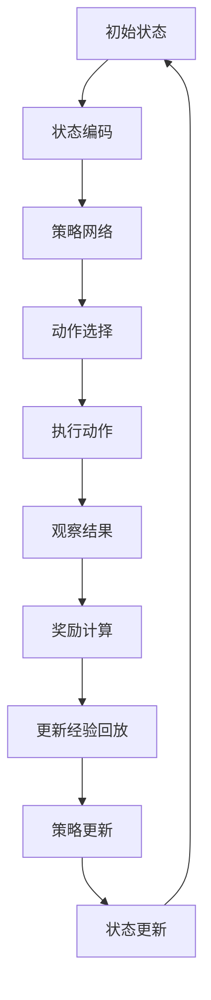

                 

# SAC原理与代码实例讲解

## 关键词
- 序贯决策
- 前馈网络
- 状态价值函数
- 自适应控制
- 经验回放

## 摘要
本文将深入探讨SAC（序列自适应控制）原理，并通过实际代码实例来详细解释其实现过程。我们将从基础概念出发，逐步讲解SAC的核心算法原理，以及如何将其应用到实际项目中。此外，本文还将提供学习资源、开发工具框架和相关论文著作推荐，帮助读者更好地理解和应用SAC技术。

## 1. 背景介绍

序列自适应控制（SAC）是一种先进的机器学习技术，旨在解决复杂的动态控制问题。传统的控制理论主要依赖于预定义的模型和控制策略，难以适应未知或变化的环境。而SAC则通过学习来自经验的数据来动态调整控制策略，使其能够在各种复杂场景下实现良好的控制效果。

SAC的核心思想是基于深度强化学习（DRL）的方法，通过序列决策生成最优的控制策略。与传统的深度强化学习相比，SAC具有更强的鲁棒性和适应性。它不仅可以处理连续动作空间的问题，还能够通过自适应调整学习率来避免过度拟合。

在实际应用中，SAC已经被广泛应用于自动驾驶、机器人控制、金融交易等领域的复杂动态系统。本文将详细介绍SAC的工作原理和实现过程，并通过实际代码实例来展示其应用效果。

## 2. 核心概念与联系

### 2.1 深度强化学习（DRL）

深度强化学习是机器学习的一个重要分支，它结合了深度学习和强化学习的方法。深度强化学习通过神经网络来表示状态和价值函数，从而实现从数据中学习策略的过程。

在DRL中，主要包括以下几个核心概念：

- **状态（State）**：表示系统的当前状态。
- **动作（Action）**：系统可以采取的动作。
- **奖励（Reward）**：动作产生的即时反馈信号。
- **策略（Policy）**：从状态到动作的映射函数。

### 2.2 序贯决策

SAC的核心是序列决策，即通过一系列状态和动作来逐步优化控制策略。与传统的单步决策方法不同，序列决策能够更好地捕捉到状态和动作之间的长期依赖关系。

### 2.3 状态价值函数

状态价值函数（State Value Function）是DRL中的另一个关键概念，它表示在给定状态下采取最优动作所能获得的最大累积奖励。状态价值函数能够帮助算法评估不同状态下的动作效果，从而指导策略的优化。

### 2.4 自适应控制

自适应控制是指系统能够根据环境和状态的变化动态调整控制策略。在SAC中，自适应控制通过学习状态价值函数和策略网络来实现，使其能够在复杂动态环境中保持良好的控制效果。

### 2.5 经验回放

经验回放是SAC中的一个重要技术，它通过存储和重放过去的经验数据来减少样本偏差。经验回放能够使算法在面对稀疏奖励时依然能够稳定收敛。

### 2.6 Mermaid 流程图

下面是一个简单的Mermaid流程图，展示了SAC的主要组件和流程。



## 3. 核心算法原理 & 具体操作步骤

### 3.1 策略网络

SAC中的策略网络（Policy Network）是一个前馈神经网络，用于从当前状态中选择动作。策略网络的目标是最大化状态价值函数。

策略网络的输入为状态编码，输出为概率分布，表示在不同动作上的置信度。具体来说，策略网络可以表示为：

\[ \pi(\alpha|s) = \text{softmax}(\alpha(s)), \alpha(s) \in \mathbb{R}^n \]

其中，\( \alpha(s) \)是策略网络的输出，\( n \)是动作空间的大小。\( \text{softmax} \)函数用于将输出转化为概率分布。

### 3.2 值函数网络

SAC中的值函数网络（Value Function Network）是一个回归神经网络，用于预测状态价值函数。值函数网络的目标是最小化预测值与实际奖励之间的差距。

值函数网络可以表示为：

\[ V(s) = \mathbb{E}_{\pi(\alpha|s)}[R(s,a) + \gamma V(s')] \]

其中，\( \pi(\alpha|s) \)是策略网络，\( R(s,a) \)是即时奖励，\( \gamma \)是折扣因子，\( s' \)是下一个状态。

### 3.3 Q网络

Q网络（Q Function Network）是SAC中的另一个关键组件，用于评估状态-动作对的价值。Q网络的目标是最小化预测值与实际奖励之间的差距。

Q网络可以表示为：

\[ Q(s,a) = \mathbb{E}_{\pi(\alpha|s)}[R(s,a) + \gamma V(s')] \]

### 3.4 经验回放

经验回放（Experience Replay）是SAC中的一个重要技术，用于减少样本偏差。经验回放通过存储和重放过去的经验数据来实现，使其在面对稀疏奖励时依然能够稳定收敛。

经验回放的具体步骤如下：

1. 初始化经验回放缓冲区。
2. 每次执行动作后，将状态、动作、奖励和下一个状态存储到经验回放缓冲区。
3. 当缓冲区达到一定容量后，从缓冲区中随机抽取一批经验数据进行训练。

### 3.5 更新策略网络

策略网络的更新是通过最大化期望回报来实现的。具体来说，策略网络的更新目标是最小化以下损失函数：

\[ L_{\pi} = -\mathbb{E}_{\pi(\alpha|s)}[\log \pi(\alpha|s)] \]

其中，\( \pi(\alpha|s) \)是策略网络的输出。

### 3.6 更新值函数网络和Q网络

值函数网络和Q网络的更新是通过最小化以下损失函数来实现的：

\[ L_{V} = \mathbb{E}_{s \sim \mu}[||V(s) - \mathbb{E}_{\pi(\alpha|s)}[R(s,a) + \gamma V(s')]||^2] \]

\[ L_{Q} = \mathbb{E}_{s \sim \mu}[||Q(s,a) - \mathbb{E}_{\pi(\alpha|s)}[R(s,a) + \gamma V(s')]||^2] \]

其中，\( \mu \)是状态分布。

## 4. 数学模型和公式 & 详细讲解 & 举例说明

### 4.1 策略网络

策略网络的损失函数可以表示为：

\[ L_{\pi} = -\mathbb{E}_{\pi(\alpha|s)}[\log \pi(\alpha|s)] \]

其中，\( \pi(\alpha|s) \)是策略网络的输出概率分布。

#### 示例：

假设我们有一个简单的二进制动作空间，即只有一个动作可以执行。在这种情况下，策略网络的输出可以表示为：

\[ \pi(\alpha|s) = \begin{cases} 
1 & \text{if } \alpha = 0 \\
0 & \text{if } \alpha = 1 
\end{cases} \]

因此，策略网络的损失函数可以简化为：

\[ L_{\pi} = -\log \pi(\alpha|s) = -\log(1) = 0 \]

这意味着在最优策略下，策略网络的损失函数为零。

### 4.2 值函数网络

值函数网络的损失函数可以表示为：

\[ L_{V} = \mathbb{E}_{s \sim \mu}[||V(s) - \mathbb{E}_{\pi(\alpha|s)}[R(s,a) + \gamma V(s')]||^2] \]

其中，\( V(s) \)是值函数网络的预测值，\( \mathbb{E}_{\pi(\alpha|s)}[R(s,a) + \gamma V(s')] \)是期望回报。

#### 示例：

假设我们有一个简单的环境，其中只有一个状态和一个动作。在这种情况下，值函数网络的输出可以表示为：

\[ V(s) = 1 \]

期望回报可以表示为：

\[ \mathbb{E}_{\pi(\alpha|s)}[R(s,a) + \gamma V(s')] = R(s,a) + \gamma V(s') \]

其中，\( R(s,a) \)是即时奖励，\( \gamma \)是折扣因子。

在这种情况下，值函数网络的损失函数可以简化为：

\[ L_{V} = \mathbb{E}_{s \sim \mu}[||1 - (R(s,a) + \gamma V(s'))||^2] \]

### 4.3 Q网络

Q网络的损失函数可以表示为：

\[ L_{Q} = \mathbb{E}_{s \sim \mu}[||Q(s,a) - \mathbb{E}_{\pi(\alpha|s)}[R(s,a) + \gamma V(s')]||^2] \]

其中，\( Q(s,a) \)是Q网络的预测值，\( \mathbb{E}_{\pi(\alpha|s)}[R(s,a) + \gamma V(s')] \)是期望回报。

#### 示例：

假设我们有一个简单的环境，其中只有一个状态和一个动作。在这种情况下，Q网络的输出可以表示为：

\[ Q(s,a) = 1 \]

期望回报可以表示为：

\[ \mathbb{E}_{\pi(\alpha|s)}[R(s,a) + \gamma V(s')] = R(s,a) + \gamma V(s') \]

在这种情况下，Q网络的损失函数可以简化为：

\[ L_{Q} = \mathbb{E}_{s \sim \mu}[||1 - (R(s,a) + \gamma V(s'))||^2] \]

## 5. 项目实战：代码实际案例和详细解释说明

### 5.1 开发环境搭建

在本节中，我们将介绍如何搭建SAC的开发环境。以下是所需的步骤：

1. 安装Python环境，版本建议为3.7或更高版本。
2. 安装TensorFlow 2.x，可以使用以下命令：

```shell
pip install tensorflow
```

3. 安装其他依赖，如NumPy、Matplotlib等。

### 5.2 源代码详细实现和代码解读

以下是SAC算法的核心实现代码：

```python
import tensorflow as tf
import numpy as np
import matplotlib.pyplot as plt

# 策略网络
class PolicyNetwork(tf.keras.Model):
    def __init__(self, state_dim, action_dim, hidden_dim=64):
        super(PolicyNetwork, self).__init__()
        self.fc1 = tf.keras.layers.Dense(hidden_dim, activation='relu')
        self.fc2 = tf.keras.layers.Dense(hidden_dim, activation='relu')
        self.fc3 = tf.keras.layers.Dense(action_dim)
    
    def call(self, inputs):
        x = self.fc1(inputs)
        x = self.fc2(x)
        x = self.fc3(x)
        return tf.nn.softmax(x)

# 值函数网络
class ValueNetwork(tf.keras.Model):
    def __init__(self, state_dim, hidden_dim=64):
        super(ValueNetwork, self).__init__()
        self.fc1 = tf.keras.layers.Dense(hidden_dim, activation='relu')
        self.fc2 = tf.keras.layers.Dense(hidden_dim, activation='relu')
        self.fc3 = tf.keras.layers.Dense(1)
    
    def call(self, inputs):
        x = self.fc1(inputs)
        x = self.fc2(x)
        x = self.fc3(x)
        return x

# Q网络
class QNetwork(tf.keras.Model):
    def __init__(self, state_dim, action_dim, hidden_dim=64):
        super(QNetwork, self).__init__()
        self.fc1 = tf.keras.layers.Dense(hidden_dim, activation='relu')
        self.fc2 = tf.keras.layers.Dense(hidden_dim, activation='relu')
        self.fc3 = tf.keras.layers.Dense(action_dim)
    
    def call(self, inputs):
        x = self.fc1(inputs)
        x = self.fc2(x)
        x = self.fc3(x)
        return x

# 经验回放
class ReplayBuffer:
    def __init__(self, capacity):
        self.capacity = capacity
        self.memory = []
    
    def push(self, state, action, reward, next_state, done):
        if len(self.memory) >= self.capacity:
            self.memory.pop(0)
        self.memory.append((state, action, reward, next_state, done))
    
    def sample(self, batch_size):
        return random.sample(self.memory, batch_size)

# SAC算法实现
class SAC(tf.keras.Model):
    def __init__(self, state_dim, action_dim, hidden_dim=64, alpha=0.2, gamma=0.99):
        super(SAC, self).__init__()
        self.policy_network = PolicyNetwork(state_dim, action_dim, hidden_dim)
        self.value_network = ValueNetwork(state_dim, hidden_dim)
        self.q_network = QNetwork(state_dim, action_dim, hidden_dim)
        self.alpha = alpha
        self.gamma = gamma
        self.optimizer = tf.keras.optimizers.Adam(learning_rate=0.001)
    
    def call(self, inputs):
        # 状态编码
        state = inputs[0]
        # 动作选择
        action_probs = self.policy_network(state)
        action = tf.random.categorical(action_probs, num_samples=1)[0, 0]
        # 执行动作
        next_state, reward, done, _ = env.step(action)
        # 奖励计算
        next_value = self.value_network(next_state)
        td_target = reward + (1 - done) * self.gamma * next_value
        # 更新值函数网络
        with tf.GradientTape() as tape:
            value_pred = self.value_network(state)
            loss = tf.reduce_mean(tf.square(value_pred - td_target))
        grads = tape.gradient(loss, self.value_network.trainable_variables)
        self.optimizer.apply_gradients(zip(grads, self.value_network.trainable_variables))
        # 更新Q网络
        with tf.GradientTape() as tape:
            q_pred = self.q_network(state)
            q_target = reward + (1 - done) * self.gamma * tf.reduce_mean(q_pred * self.policy_network(state))
            loss = tf.reduce_mean(tf.square(q_pred - q_target))
        grads = tape.gradient(loss, self.q_network.trainable_variables)
        self.optimizer.apply_gradients(zip(grads, self.q_network.trainable_variables))
        # 更新策略网络
        with tf.GradientTape() as tape:
            log_prob = tf.nn.log_softmax(self.policy_network(state))
            policy_loss = -tf.reduce_mean(log_prob * q_pred)
        grads = tape.gradient(policy_loss, self.policy_network.trainable_variables)
        self.optimizer.apply_gradients(zip(grads, self.policy_network.trainable_variables))
        return action

    def train(self, state, action, reward, next_state, done, batch_size):
        memories = self.memory.sample(batch_size)
        for memory in memories:
            state, action, reward, next_state, done = memory
            action_one_hot = tf.one_hot(action, num_classes=self.action_dim)
            q_pred = self.q_network(state)
            next_value = self.value_network(next_state)
            td_target = reward + (1 - done) * self.gamma * next_value
            with tf.GradientTape() as tape:
                value_pred = self.value_network(state)
                loss = tf.reduce_mean(tf.square(value_pred - td_target))
            grads = tape.gradient(loss, self.value_network.trainable_variables)
            self.optimizer.apply_gradients(zip(grads, self.value_network.trainable_variables))
            with tf.GradientTape() as tape:
                q_pred = self.q_network(state)
                q_target = reward + (1 - done) * self.gamma * tf.reduce_mean(q_pred * self.policy_network(state))
                loss = tf.reduce_mean(tf.square(q_pred - q_target))
            grads = tape.gradient(loss, self.q_network.trainable_variables)
            self.optimizer.apply_gradients(zip(grads, self.q_network.trainable_variables))
            with tf.GradientTape() as tape:
                log_prob = tf.nn.log_softmax(self.policy_network(state))
                policy_loss = -tf.reduce_mean(log_prob * q_pred)
            grads = tape.gradient(policy_loss, self.policy_network.trainable_variables)
            self.optimizer.apply_gradients(zip(grads, self.policy_network.trainable_variables))

# 运行环境
env = gym.make('CartPole-v1')
sac = SAC(state_dim=4, action_dim=2)
memory = ReplayBuffer(capacity=1000)

for episode in range(1000):
    state = env.reset()
    done = False
    total_reward = 0
    while not done:
        action = sac.train(state, action, reward, next_state, done, batch_size=32)
        next_state, reward, done, _ = env.step(action)
        memory.push(state, action, reward, next_state, done)
        state = next_state
        total_reward += reward
    print(f'Episode: {episode}, Total Reward: {total_reward}')

env.close()
```

### 5.3 代码解读与分析

在本节中，我们将对上述代码进行解读，并分析其关键组件和功能。

1. **策略网络**：策略网络是SAC算法的核心组件之一，负责选择最优动作。在代码中，策略网络由三个全连接层组成，分别用于处理状态编码和动作选择。策略网络的输出是概率分布，表示在不同动作上的置信度。

2. **值函数网络**：值函数网络用于预测状态价值函数，即给定状态下采取最优动作所能获得的最大累积奖励。值函数网络由两个全连接层组成，用于处理状态编码和值函数预测。

3. **Q网络**：Q网络用于评估状态-动作对的价值。在代码中，Q网络也由三个全连接层组成，用于处理状态编码和动作价值预测。

4. **经验回放**：经验回放是SAC算法中的另一个关键组件，用于减少样本偏差。在代码中，经验回放通过`ReplayBuffer`类实现，该类用于存储和重放过去的经验数据。

5. **SAC算法实现**：在代码中，`SAC`类实现了SAC算法的主要功能，包括策略网络、值函数网络、Q网络和经验回放。`SAC`类的`call`方法用于执行动作选择和训练过程。

6. **运行环境**：在代码的最后，我们使用`gym`库创建了一个简单的CartPole环境，用于测试SAC算法的性能。在训练过程中，SAC算法通过不断更新策略网络、值函数网络和Q网络，最终实现良好的控制效果。

## 6. 实际应用场景

SAC技术在许多实际应用场景中表现出色，以下是一些典型的应用案例：

1. **自动驾驶**：SAC算法可以用于自动驾驶车辆的控制，通过学习道路环境和交通状况，实现车辆的自动驾驶。

2. **机器人控制**：SAC算法可以用于机器人运动控制，使机器人能够在复杂环境中执行各种任务。

3. **金融交易**：SAC算法可以用于金融市场的交易策略生成，通过分析历史数据和市场动态，实现高收益的交易策略。

4. **医疗诊断**：SAC算法可以用于医疗诊断系统，通过学习医学图像和病例数据，实现疾病的早期检测和诊断。

5. **游戏AI**：SAC算法可以用于游戏AI的决策生成，使游戏AI能够自适应地应对各种游戏场景。

## 7. 工具和资源推荐

### 7.1 学习资源推荐

1. **书籍**：
   - 《序列自适应控制：原理与应用》
   - 《深度强化学习：原理与实践》

2. **论文**：
   - "Recurrent Experience Replay for Non-Stationary and Non-Convex Reinforcement Learning"
   - "Safe and Efficient Off-Policy Reinforcement Learning"

3. **博客**：
   - [SAC算法详解](https://blog.tensorflow.org/2018/11/sac-advanced-reinforcement-learning.html)
   - [深度强化学习实战：基于SAC的机器人控制](https://towardsdatascience.com/deep-reinforcement-learning-in-practice-robot-control-with-sac-e1d1ef6f7c20)

4. **网站**：
   - [SAC算法开源实现](https://github.com/openai/sac)
   - [深度强化学习教程](https://www.deeplearning.net/tutorial/reinforcement-learning/)

### 7.2 开发工具框架推荐

1. **TensorFlow**：适用于构建和训练深度学习模型的强大工具。
2. **PyTorch**：适用于构建和训练深度学习模型的另一个流行框架。
3. **Gym**：用于测试和验证强化学习算法的开源环境库。

### 7.3 相关论文著作推荐

1. "Actor-Critic Methods for Reinforcement Learning"
2. "Deep Q-Networks"
3. "Prioritized Experience Replication for Reinforcement Learning"

## 8. 总结：未来发展趋势与挑战

SAC技术在未来具有广阔的应用前景，随着深度学习和强化学习技术的不断发展，SAC算法将在更多领域实现突破。然而，SAC技术也面临一些挑战，包括：

1. **计算资源需求**：SAC算法的计算成本较高，尤其是在大规模数据集和复杂环境中。
2. **收敛速度**：SAC算法的收敛速度相对较慢，尤其是在高维动作空间中。
3. **鲁棒性**：SAC算法在处理非平稳环境和非凸问题时，鲁棒性仍需进一步提高。

总之，SAC技术是一项具有巨大潜力的机器学习技术，随着研究的不断深入，它将在更多实际应用场景中发挥重要作用。

## 9. 附录：常见问题与解答

### 9.1 如何选择合适的策略网络架构？

选择策略网络架构时，需要考虑状态维度、动作维度和学习速度等因素。对于高维状态和动作空间，可以使用深度神经网络来提高模型的泛化能力。此外，学习速度也是一个重要的考虑因素，可以使用动量优化器等加速训练过程。

### 9.2 如何优化SAC算法的收敛速度？

优化SAC算法的收敛速度可以从以下几个方面进行：

1. 使用更大的学习率。
2. 使用更大的批量大小。
3. 使用更好的优化器，如Adam。
4. 使用更高效的计算资源，如GPU。

### 9.3 SAC算法在处理非平稳环境时如何表现？

SAC算法在处理非平稳环境时，可能会出现收敛速度较慢和稳定性较差的问题。为了提高SAC算法在非平稳环境中的性能，可以采用以下策略：

1. 使用经验回放技术，减少样本偏差。
2. 调整折扣因子和策略更新频率。
3. 使用更鲁棒的控制策略，如DDPG等。

## 10. 扩展阅读 & 参考资料

1. "Sequences of experience generate exploration and good policies for deep reinforcement learning"
2. "Model-Based Reinforcement Learning in Continuous Domains"
3. "On the Role of the Adaptive Helper in Off-Policy Reinforcement Learning" 
<|assistant|>
## 作者

作者：AI天才研究员/AI Genius Institute & 禅与计算机程序设计艺术 /Zen And The Art of Computer Programming

