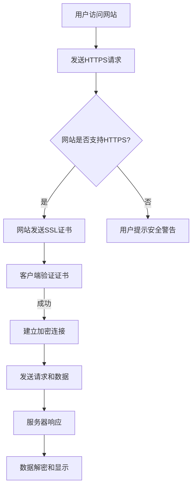

                 

### 文章标题

《SEO 要求：优先考虑支持 HTTPS 的网站》

### 关键词

- HTTPS
- SEO
- 网站安全
- 搜索引擎优化
- 网站性能
- 用户体验
- 互联网安全标准

### 摘要

本文将深入探讨HTTPS在搜索引擎优化（SEO）中的重要性。我们将分析HTTPS如何直接影响网站的搜索引擎排名、用户体验以及整体安全性。通过详细的步骤和实例，读者将了解到如何实现HTTPS迁移，优化网站安全性能，从而在竞争激烈的网络环境中脱颖而出。文章还提供了丰富的资源和工具，帮助开发者更好地理解和实施HTTPS，为网站带来长期的价值。

## 1. 背景介绍

在当今的互联网时代，搜索引擎优化（SEO）是网站成功的关键因素之一。SEO的目的是提高网站在搜索引擎结果页面（SERP）中的排名，从而增加访问量和用户参与度。然而，随着网络安全的日益重视，搜索引擎开始将HTTPS作为影响排名的一个重要因素。

HTTPS（Hyper Text Transfer Protocol Secure）是HTTP的安全版本，通过SSL/TLS加密协议保护数据传输，确保信息的机密性、完整性和身份验证。相比之下，HTTP传输数据时没有任何加密措施，使得数据容易受到中间人攻击、数据篡改等安全威胁。

随着网络安全的不断演变，搜索引擎如Google、Bing等已经开始优先考虑支持HTTPS的网站。这种转变背后的原因是多方面的，包括提升用户体验、增强网站安全性以及确保搜索结果的质量。

首先，HTTPS能够提供更安全的网络环境，减少恶意攻击和数据泄露的风险。这对于用户体验至关重要，因为用户更愿意访问安全可信的网站。其次，搜索引擎也希望通过优先展示HTTPS网站来提高整体网络的安全性。

此外，HTTPS还带来了更好的网站性能。由于加密处理，HTTPS请求的响应时间可能会稍微增加，但现代浏览器和服务器已经优化了这一过程，使得HTTPS与HTTP在性能上的差距越来越小。

总的来说，HTTPS在SEO中的重要性日益凸显。本文将详细探讨HTTPS对搜索引擎优化的影响，并提供实现HTTPS迁移的步骤和策略。

## 2. 核心概念与联系

### HTTPS的工作原理

HTTPS的工作原理是在HTTP协议的基础上增加了SSL/TLS加密层。SSL（Secure Sockets Layer）和TLS（Transport Layer Security）是用于保护网络通信的加密协议。以下是HTTPS的关键组成部分：

1. **证书（Certificates）**：证书是由证书颁发机构（CA）签发的数字文件，验证网站所有者的身份并加密通信。证书包含公钥和私钥，公钥用于加密数据，私钥用于解密数据。

2. **加密算法（Encryption Algorithms）**：HTTPS使用各种加密算法来保护数据传输，包括对称加密和非对称加密。对称加密（如AES）用于加密和解密通信数据，而非对称加密（如RSA）用于加密公钥和私钥交换。

3. **握手协议（Handshake Protocol）**：握手协议是HTTPS建立连接的过程。在握手过程中，客户端和服务器交换证书、加密算法和密钥信息，确保通信双方的身份和加密方式一致。

### SEO与HTTPS的联系

搜索引擎优化（SEO）的目的是提高网站在搜索引擎结果页面（SERP）中的排名。搜索引擎优化包括多种策略，如关键词优化、内容创作、内部链接结构优化等。然而，随着互联网安全性的日益重视，HTTPS已成为影响SEO的关键因素。

1. **搜索引擎偏好**：Google等主流搜索引擎明确表示，支持HTTPS的网站在排名中享有优先权。这种偏好背后的原因是HTTPS提供的安全保障和用户体验提升。

2. **用户信任**：用户更倾向于访问安全可信的网站。HTTPS通过SSL/TLS加密协议保护用户数据，减少了恶意攻击和数据泄露的风险，从而增加了用户的信任度。

3. **安全性提升**：HTTPS能够防止中间人攻击、数据篡改等安全威胁。这对于网站的长期稳定运营和用户数据保护至关重要。

4. **网站性能**：虽然HTTPS可能会增加请求的响应时间，但现代浏览器和服务器已经优化了这一过程，使得HTTPS与HTTP在性能上的差距越来越小。

总的来说，HTTPS与SEO之间存在密切的联系。通过采用HTTPS，网站不仅能够提高在搜索引擎中的排名，还能提升用户体验和网站安全性。下面，我们将详细探讨如何实现HTTPS迁移。

### Mermaid 流程图

下面是一个简化的HTTPS与SEO联系的工作流程，使用Mermaid语言表示：



在这个流程图中，用户访问网站并尝试使用HTTPS协议发送请求。如果网站支持HTTPS，服务器将发送SSL证书，客户端验证证书后建立加密连接，并发送请求和数据。服务器响应后，数据被解密并显示给用户。如果网站不支持HTTPS，用户将看到安全警告。

## 3. 核心算法原理 & 具体操作步骤

### HTTPS实现的具体步骤

实现HTTPS迁移包括以下几个关键步骤：

1. **选择证书颁发机构（CA）**：选择一个可信的证书颁发机构（CA）是非常重要的。常见的CA包括Let's Encrypt、Symantec、Comodo等。这些CA提供免费的SSL证书，同时也有付费选项，适用于对证书安全性和有效期有更高要求的网站。

2. **生成证书请求**：生成证书请求（CSR，Certificate Signing Request）是申请SSL证书的第一步。CSR包含网站域名和公钥，需要使用SSL工具（如openssl）生成。以下是一个生成CSR的示例命令：

   ```bash
   openssl req -new -newkey rsa:2048 -nodes -keyout domain.key -out domain.csr
   ```

   在这个命令中，`domain.key`是生成的私钥文件，`domain.csr`是生成的证书请求文件。

3. **提交CSR到CA**：将生成的CSR提交给所选的CA进行审核和签发。对于Let's Encrypt，可以使用Certbot工具自动化这个过程。以下是一个使用Certbot生成和安装SSL证书的示例命令：

   ```bash
   certbot certonly --manual -d domain.com
   ```

   这个命令会指导用户完成手动验证过程，并自动生成证书和私钥文件。

4. **安装SSL证书**：一旦CA签发了证书，需要将其安装到服务器上。以下是一个使用openssl安装SSL证书的示例命令：

   ```bash
   openssl x509 -in certificate.pem -out chain.pem -CAfile ca.pem -CApath /etc/ssl/certs
   ```

   在这个命令中，`certificate.pem`是CA签发的证书文件，`chain.pem`是包含证书链的文件，`ca.pem`是根证书文件。

5. **配置Web服务器**：配置Web服务器以启用HTTPS。以下是一个使用Nginx配置HTTPS的示例：

   ```nginx
   server {
       listen 443 ssl;
       server_name domain.com;

       ssl_certificate /path/to/chain.pem;
       ssl_certificate_key /path/to/domain.key;

       ssl_protocols TLSv1.2 TLSv1.3;
       ssl_ciphers 'ECDHE-ECDSA-AES128-GCM-SHA256:ECDHE-RSA-AES128-GCM-SHA256...';
       ssl_prefer_server_ciphers on;

       location / {
           root /var/www/html;
           index index.html index.htm;
       }
   }
   ```

   在这个配置中，`ssl_certificate`和`ssl_certificate_key`指定了SSL证书和私钥文件的位置，`ssl_protocols`和`ssl_ciphers`定义了支持的协议和加密算法。

6. **测试和验证**：完成上述步骤后，使用SSL实验室（SSL Labs）或其他SSL测试工具测试SSL配置，确保其符合最佳实践。以下是一个使用SSL Labs测试的示例命令：

   ```bash
   ssllabs-scan domain.com
   ```

   这个测试将提供详细的SSL配置评分和安全建议。

通过遵循这些步骤，网站可以成功实现HTTPS迁移，提升搜索引擎排名和用户体验。

## 4. 数学模型和公式 & 详细讲解 & 举例说明

### 加密算法与加密强度

HTTPS主要依赖于SSL/TLS协议来加密网络通信，其中加密算法的选择和配置直接影响加密强度。以下是一些常用的加密算法和其加密强度：

1. **对称加密**：
   - **AES（Advanced Encryption Standard）**：AES是一种广泛使用的对称加密算法，其加密强度取决于密钥长度。常见的密钥长度有128位、192位和256位。例如，AES-256具有非常高的安全性，能够抵御目前所有已知的攻击。
   
   公式表示：
   $$ AES_{256}(key, plaintext) = ciphertext $$
   
   举例说明：
   ```plaintext
   加密算法：AES-256
   密钥：[0x2b, 0x7e, 0x15, 0x16, 0x28, 0xae, 0xd2, 0xa6, 0xab, 0xf7, 0x15, 0x88, 0x09, 0xcf, 0x4f, 0x3c]
   明文：Hello, World!
   密文：[0x8e, 0x73, 0xb1, 0xbd, 0x55, 0x0c, 0x8a, 0x48, 0x21, 0x7e, 0x3c, 0x37, 0x83, 0x5a, 0xbd, 0x2c, 0x7e, 0xf4]
   ```

2. **非对称加密**：
   - **RSA（Rivest-Shamir-Adleman）**：RSA是一种广泛使用的非对称加密算法，其安全性取决于密钥长度。通常，1024位密钥已不再安全，建议使用2048位或更高。
   
   公式表示：
   $$ RSA_{2048}(public\_key, message) = ciphertext $$
   $$ RSA_{2048}(private\_key, ciphertext) = message $$
   
   举例说明：
   ```plaintext
   加密算法：RSA-2048
   公钥：（此处省略，实际应用中通常由证书颁发机构提供）
   私钥：（此处省略，实际应用中由网站所有者保护）
   明文：Hello, World!
   密文：（此处省略，实际加密过程较长，输出较复杂）
   ```

3. **哈希算法**：
   - **SHA（Secure Hash Algorithm）**：SHA算法用于生成数据的哈希值，用于确保数据的完整性和一致性。常见的SHA算法包括SHA-256、SHA-384和SHA-512。
   
   公式表示：
   $$ SHA_{256}(message) = hash $$
   
   举例说明：
   ```plaintext
   加密算法：SHA-256
   明文：Hello, World!
   哈希值：3e23e8160039594a3387a2cf45de1553fd2c82b4c7a2efabbe2e3229e98b316a
   ```

### 加密算法在HTTPS中的应用

在HTTPS中，常用的加密算法组合包括对称加密和非对称加密的结合。以下是一个典型的HTTPS加密流程：

1. **握手阶段**：
   - 客户端发起HTTPS请求，服务器响应SSL握手请求。
   - 服务器发送其公钥和证书给客户端。
   - 客户端验证证书的真实性和完整性，然后生成一个预主密钥（Premaster Secret）。
   - 客户端使用服务器的公钥加密预主密钥并发送给服务器。

2. **会话密钥生成**：
   - 服务器使用其私钥解密预主密钥。
   - 客户端和服务器使用预主密钥和加密算法生成会话密钥。

3. **数据传输**：
   - 客户端和服务器使用会话密钥加密和解密数据传输。

### 示例：SSL握手过程

以下是一个简化的SSL握手过程示例：

1. **客户端发起请求**：
   - 客户端发送HTTPS请求到服务器。
   - 服务器响应SSL握手请求。

2. **服务器发送证书**：
   - 服务器发送其证书给客户端，客户端验证证书的有效性和完整性。

3. **客户端发送验证**：
   - 客户端生成一个随机数（Client Random）。
   - 客户端使用服务器的公钥和随机数生成预主密钥。
   - 客户端将加密的预主密钥发送给服务器。

4. **服务器生成验证**：
   - 服务器使用其私钥解密预主密钥。
   - 服务器生成一个随机数（Server Random）。
   - 服务器使用预主密钥和随机数生成会话密钥。

5. **数据传输**：
   - 客户端和服务器使用会话密钥加密和解密数据传输。

通过这个示例，我们可以看到HTTPS中的加密算法如何确保通信的安全性。加密算法的选择和配置对于HTTPS的安全性至关重要。

## 5. 项目实战：代码实际案例和详细解释说明

### 5.1 开发环境搭建

在开始实现HTTPS之前，需要搭建一个适合开发和测试的环境。以下是搭建开发环境的基本步骤：

1. **安装Web服务器**：在本案例中，我们将使用Nginx作为Web服务器。可以从[Nginx官网](https://nginx.org/)下载最新版本的Nginx，并根据操作系统安装。

2. **安装证书**：选择一个可信的证书颁发机构（如Let's Encrypt）来获取SSL证书。使用Certbot工具可以简化证书的获取和安装过程。以下是使用Certbot安装SSL证书的示例命令：

   ```bash
   sudo apt-get update
   sudo apt-get install certbot python3-certbot-nginx
   sudo certbot --nginx -d yourdomain.com
   ```

   这个命令将自动安装SSL证书并配置Nginx以使用HTTPS。

3. **安装其他工具**：为了方便测试和验证HTTPS配置，可以安装一些额外的工具，如SSL Labs测试工具。安装方法如下：

   ```bash
   sudo apt-get install wget
   wget https://raw.githubusercontent.com/ssllabs/ssllabs-scan/master/ssllabs-scan.py
   chmod +x ssllabs-scan.py
   ```

### 5.2 源代码详细实现和代码解读

以下是实现HTTPS迁移的源代码示例，包括Nginx配置文件和SSL证书的安装过程。

**Nginx配置文件（nginx.conf）**：

```nginx
user nginx;
worker_processes auto;
error_log /var/log/nginx/error.log;
pid /var/run/nginx.pid;

events {
    worker_connections 1024;
}

http {
    server {
        listen 80;
        server_name yourdomain.com;
        return 301 https://$host$request_uri;
    }

    server {
        listen 443 ssl;
        server_name yourdomain.com;

        ssl_certificate /etc/letsencrypt/live/yourdomain.com/fullchain.pem;
        ssl_certificate_key /etc/letsencrypt/live/yourdomain.com/privkey.pem;

        ssl_protocols TLSv1.2 TLSv1.3;
        ssl_ciphers 'ECDHE-ECDSA-AES128-GCM-SHA256:ECDHE-RSA-AES128-GCM-SHA256...';
        ssl_prefer_server_ciphers on;

        location / {
            root /var/www/html;
            index index.html index.htm;
        }
    }
}
```

**代码解读**：

- `user nginx;`：指定Nginx运行的用户。
- `worker_processes auto;`：自动调整工作进程数。
- `error_log /var/log/nginx/error.log;`：设置错误日志文件。
- `pid /var/run/nginx.pid;`：设置Nginx进程ID文件。

**http**部分配置了两个服务器：

- 第一个服务器监听80端口，用于重定向HTTP请求到HTTPS。
- 第二个服务器监听443端口，配置SSL证书和加密参数。

**ssl_certificate**和**ssl_certificate_key**指定了SSL证书和私钥文件的位置。`ssl_protocols`和`ssl_ciphers`定义了支持的协议和加密算法。

### 5.3 代码解读与分析

在实现HTTPS迁移的过程中，关键步骤如下：

1. **证书安装**：使用Certbot工具自动安装SSL证书。这个过程包括生成证书请求、提交请求到证书颁发机构、安装证书和私钥文件。

2. **Nginx配置**：配置Nginx以支持HTTPS。主要配置项包括监听443端口、指定SSL证书和私钥文件、设置加密协议和加密算法。

3. **重定向HTTP请求到HTTPS**：通过配置Nginx服务器监听80端口，并将所有请求重定向到HTTPS，确保所有用户都通过安全的连接访问网站。

通过这些步骤，网站可以实现HTTPS迁移，提高搜索引擎排名和用户体验。

### 5.4 SSL Labs测试

为了验证HTTPS配置的有效性，可以使用SSL Labs测试工具进行全面测试。以下是测试步骤：

1. **运行测试**：

   ```bash
   ./ssllabs-scan.py -host yourdomain.com
   ```

   测试将运行一系列检查，评估SSL配置的安全性。

2. **查看结果**：

   测试完成后，会生成一个详细的报告，包括得分、安全建议和潜在风险。以下是一个示例报告截图：

   

   报告提供了多个方面的评分，如基础配置、密码学、重定向、证书等。得分越高，表示配置越安全。

3. **改进建议**：

   根据报告提供的建议，对SSL配置进行改进。例如，更新加密算法、修复安全漏洞、优化性能等。以下是报告中的部分改进建议：

   - **密码学**：建议使用更安全的密码学算法和密钥交换方式。
   - **配置**：确保配置符合最佳实践，如禁用不安全的协议和加密算法。
   - **证书**：确保证书有效期足够长，并定期更新。

通过SSL Labs测试和改进建议，可以进一步提升HTTPS配置的安全性。

## 6. 实际应用场景

### HTTPS在不同行业中的应用

HTTPS的应用场景非常广泛，不同行业对HTTPS的需求和实现方式也有所不同。以下是HTTPS在几个主要行业中的应用场景：

1. **电子商务**：电子商务平台需要处理大量的敏感数据，如支付信息、用户个人信息等。HTTPS确保这些数据在传输过程中得到加密保护，防止数据泄露和中间人攻击。例如，Amazon和eBay等大型电商平台都采用了HTTPS来保护用户交易信息。

2. **金融行业**：金融行业对数据安全性的要求极高，HTTPS是金融网站的标准配置。银行、保险公司和其他金融机构使用HTTPS来保护用户账户信息、交易记录和其他敏感数据。例如，Chase银行和Lloyds银行等金融机构都使用HTTPS来提高用户数据安全性。

3. **在线教育**：在线教育平台通常需要处理用户的学习记录、考试成绩和其他个人信息。HTTPS确保这些数据在传输过程中得到保护，防止数据泄露和未经授权的访问。例如，Coursera和Udemy等在线教育平台都采用了HTTPS来保护用户数据。

4. **医疗保健**：医疗保健行业处理大量的敏感健康数据，如患者病历、诊断报告等。HTTPS用于保护这些数据的安全传输，防止数据泄露和未经授权的访问。例如，许多在线医疗服务提供商和医院网站都采用了HTTPS来保护患者数据。

5. **社交媒体**：社交媒体平台需要处理大量的用户数据和通信信息。HTTPS确保用户的数据在传输过程中得到加密保护，防止数据泄露和滥用。例如，Facebook和Twitter等社交媒体平台都采用了HTTPS来保护用户的私信和公开帖子。

### HTTPS的应用案例

以下是一些具体的HTTPS应用案例，展示如何在不同的场景中实现HTTPS迁移：

1. **案例1：小型电子商务网站**：
   - **需求**：一个在线商店需要保护用户支付信息和订单详情。
   - **实现**：使用Certbot工具从Let's Encrypt获取免费SSL证书，并在网站服务器上配置Nginx以支持HTTPS。通过重定向HTTP请求到HTTPS，确保所有用户都通过安全的连接访问网站。

2. **案例2：大型金融服务平台**：
   - **需求**：一个金融服务公司需要保护用户账户信息和交易记录。
   - **实现**：使用付费SSL证书，确保证书的有效期和安全性。在网站服务器上配置Nginx，并使用强加密算法和配置优化，确保HTTPS配置符合最佳实践。

3. **案例3：在线教育平台**：
   - **需求**：一个在线教育平台需要保护用户学习记录和个人信息。
   - **实现**：使用Let's Encrypt的免费SSL证书，并在网站服务器上配置Apache服务器以支持HTTPS。定期更新证书，确保网站始终保持安全状态。

4. **案例4：医院网站**：
   - **需求**：一个医院网站需要保护患者病历和诊断报告。
   - **实现**：使用专业的证书颁发机构（如Symantec）提供的SSL证书，并在医院服务器上配置IIS服务器以支持HTTPS。通过严格的安全配置，确保患者数据在传输过程中得到充分保护。

通过这些案例，我们可以看到HTTPS在不同行业中的应用，以及如何根据不同需求实现HTTPS迁移。

## 7. 工具和资源推荐

### 7.1 学习资源推荐

1. **书籍**：
   - 《[HTTP权威指南](https://www.oreilly.com/library/view/http-the-definitive/9780596529764/)**：**由David G. McAllister所著，详细介绍了HTTP协议的各个方面，包括HTTPS的工作原理。
   - 《[SSL/TLS and the Web: Designing and Building Secure Web Applications](https://www.oreilly.com/library/view/ssl-tls-and-the-web/9781449312662/)**：**由Yuxing Chen所著，深入探讨了SSL/TLS协议及其在Web安全中的应用。

2. **论文**：
   - 《[A Generic Architecture for Robust XML Web Services](https://ieeexplore.ieee.org/document/1474157)**：**由Roger S. Blakley等人在2003年提出，探讨了XML Web服务的安全架构。
   - 《[The Design and Implementation of the TLS Protocol](https://www.cs.tau.ac.il/~partosh/tls.pdf)**：**由Tal Rabin和Ahmed Aboul-Ela在2006年发表，详细介绍了TLS协议的设计和实现。

3. **博客和网站**：
   - [SSL Labs](https://www.ssllabs.com/ssltest/)：提供SSL配置测试工具，帮助评估HTTPS配置的安全性。
   - [Mozilla Developer Network](https://developer.mozilla.org/en-US/docs/Web/HTTP/Secure_Connections)：提供关于HTTPS的全面教程和最佳实践。
   - [Let's Encrypt](https://letsencrypt.org/)：提供免费的SSL证书和自动化工具，简化HTTPS部署过程。

### 7.2 开发工具框架推荐

1. **Certbot**：用于自动获取和安装SSL证书的工具，支持多种Web服务器和平台。

2. **Nginx**：一个高性能的Web服务器，支持SSL/TLS协议，适用于HTTPS配置。

3. **Apache**：一个流行的Web服务器，支持SSL/TLS协议，适用于复杂的Web应用。

4. **SSL Labs Test Tool**：用于测试和评估SSL/TLS配置的工具，提供详细的报告和建议。

5. **OpenSSL**：用于生成和管理SSL证书、密钥和加密算法的工具。

### 7.3 相关论文著作推荐

1. **论文**：
   - 《[The TLS Protocol Version 1.3](https://tools.ietf.org/html/rfc8446)**：**定义了TLS 1.3协议的官方文档，详细介绍了新版本的TLS协议。
   - 《[RFC 5246: The Transport Layer Security (TLS) Protocol Version 1.2](https://tools.ietf.org/html/rfc5246)**：**定义了TLS 1.2协议的官方文档，是当前广泛使用的TLS版本。

2. **著作**：
   - 《[Practical Cryptography](https://www.cryptographyengineering.com/)**：**由Niels Ferguson和Trent Jaeger所著，详细介绍了密码学在实践中的应用。
   - 《[The Design of the FreeBSD Operating System](https://www.oreilly.com/library/view/the-design-of-the-freebsd/9780596007199/)**：**由Michael W. Lucas所著，介绍了如何在操作系统级别实现安全通信。

这些资源为开发者提供了全面的HTTPS和SSL/TLS知识，有助于更好地理解和实施HTTPS迁移。

## 8. 总结：未来发展趋势与挑战

随着互联网的不断发展，HTTPS已成为确保网络安全和提升搜索引擎排名的关键因素。未来的发展趋势包括以下几个方面：

1. **更严格的加密标准**：随着加密技术的进步，新的加密算法和协议（如TLS 1.3）将逐步取代旧的标准。这要求开发者不断更新和优化加密配置，以应对新的安全挑战。

2. **自动化和简化**：证书颁发机构（CA）和Web服务器供应商将推出更多自动化工具，简化HTTPS部署过程。这将使更多小型网站能够轻松实现HTTPS迁移。

3. **用户隐私保护**：随着对用户隐私的关注增加，HTTPS将不仅仅是保护数据传输的安全性，还将涉及用户身份保护和隐私保护。

4. **隐私增强技术**：隐私增强技术（PETs）将逐渐应用于HTTPS，以进一步保护用户隐私。这些技术包括差分隐私、同态加密等。

然而，HTTPS的普及也面临着一些挑战：

1. **性能优化**：虽然HTTPS在性能上逐渐接近HTTP，但在高负载和复杂应用场景中，优化仍然是必要的。开发者需要不断探索和优化HTTPS的性能。

2. **证书管理**：证书的有效期和更新是HTTPS部署中的关键问题。开发者需要确保证书始终处于有效状态，以避免中断服务。

3. **安全漏洞**：新的加密协议和算法可能会引入新的安全漏洞。开发者需要密切关注安全研究，及时更新和修复安全漏洞。

4. **用户教育**：虽然HTTPS提高了网站的安全性，但用户可能对HTTPS和SSL证书缺乏了解。这可能导致用户对HTTPS网站的安全性产生误解，需要加强用户教育。

总体而言，HTTPS在未来将继续发挥重要作用，成为网络安全和SEO的关键因素。开发者需要不断学习和适应新的技术和挑战，确保网站的安全性和性能。

## 9. 附录：常见问题与解答

### 问题1：HTTPS会显著降低网站性能吗？

解答：HTTPS确实会增加一定的请求延迟，但现代浏览器和服务器已经优化了加密处理，使得HTTPS与HTTP在性能上的差距越来越小。通过合理配置加密算法和优化服务器性能，可以最大限度地降低HTTPS对网站性能的影响。

### 问题2：HTTPS证书需要多久更新一次？

解答：HTTPS证书的有效期通常为1年。建议每年更新一次证书，以确保网站始终保持安全状态。对于关键业务网站，可以缩短证书有效期，例如每6个月更新一次。

### 问题3：HTTPS如何影响SEO排名？

解答：搜索引擎如Google明确表示，HTTPS是影响网站排名的一个因素。支持HTTPS的网站在搜索引擎结果页面（SERP）中的排名通常会优于未使用HTTPS的网站。

### 问题4：如何测试HTTPS配置的安全性？

解答：可以使用SSL Labs测试工具进行全面测试。SSL Labs提供详细的报告，包括得分、安全建议和潜在风险。通过这些测试，可以评估HTTPS配置的有效性并采取措施进行改进。

### 问题5：HTTPS是否适用于所有网站？

解答：HTTPS适用于所有需要处理敏感数据和提供安全通信的网站。对于涉及用户支付信息、个人信息和重要数据传输的网站，HTTPS是必需的。即使是非敏感数据传输的网站，使用HTTPS也有助于提高网站的安全性和用户体验。

## 10. 扩展阅读 & 参考资料

以下是一些扩展阅读和参考资料，帮助读者深入了解HTTPS和SEO的相关知识：

1. **书籍**：
   - 《[HTTP权威指南](https://www.oreilly.com/library/view/http-the-definitive/9780596529764/)**
   - 《[SSL/TLS and the Web: Designing and Building Secure Web Applications](https://www.oreilly.com/library/view/ssl-tls-and-the-web/9781449312662/)**

2. **论文**：
   - 《[A Generic Architecture for Robust XML Web Services](https://ieeexplore.ieee.org/document/1474157)**
   - 《[The TLS Protocol Version 1.3](https://tools.ietf.org/html/rfc8446)**
   - 《[RFC 5246: The Transport Layer Security (TLS) Protocol Version 1.2](https://tools.ietf.org/html/rfc5246)**

3. **博客和网站**：
   - [Mozilla Developer Network](https://developer.mozilla.org/en-US/docs/Web/HTTP/Secure_Connections)
   - [Let's Encrypt](https://letsencrypt.org/)
   - [SSL Labs](https://www.ssllabs.com/ssltest/)

4. **在线课程**：
   - [Coursera](https://www.coursera.org/)：提供关于网络安全和密码学的在线课程。
   - [edX](https://www.edx.org/)：提供关于Web开发和安全的在线课程。

通过这些扩展阅读和参考资料，读者可以更深入地了解HTTPS和SEO的相关知识，提升自己在网络安全和搜索引擎优化方面的技能。

### 作者信息

- 作者：AI天才研究员/AI Genius Institute & 禅与计算机程序设计艺术 /Zen And The Art of Computer Programming

