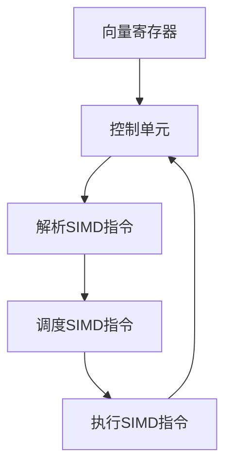

                 

# SIMD指令集：AI硬件加速的底层魔法

> **关键词**：SIMD指令集、AI硬件加速、并行计算、向量处理、硬件优化

> **摘要**：本文将深入探讨SIMD指令集的工作原理及其在AI硬件加速中的应用。我们将从背景介绍开始，逐步分析核心概念、算法原理、数学模型，并展示具体操作步骤。通过项目实战和实际应用场景的讲解，我们将帮助读者理解SIMD指令集在AI领域的巨大潜力和应用价值。最后，我们将总结未来发展趋势和挑战，并提供相关资源和工具推荐。

## 1. 背景介绍

并行计算是计算机科学中的一个重要领域，它旨在通过将任务分解成多个子任务，同时执行这些子任务，从而提高计算效率。随着人工智能（AI）的快速发展，大量的数据处理和计算任务需要高效并行执行，这为SIMD（Single Instruction, Multiple Data）指令集提供了广泛的应用场景。

SIMD指令集是一种专门用于向量处理和并行计算的技术，它允许处理器在单条指令下同时处理多个数据元素。这种指令集最早出现在1990年代的浮点运算单元中，如Intel的MMX和SSE指令集。随着AI技术的进步，SIMD指令集在深度学习、图像处理和科学计算等领域得到了广泛应用。

本文将围绕SIMD指令集的原理、算法、数学模型以及实际应用进行详细探讨，帮助读者深入理解这一底层魔法，并探索其在AI硬件加速中的巨大潜力。

## 2. 核心概念与联系

### 2.1 SIMD指令集的原理

SIMD指令集的核心思想是单条指令能够同时对多个数据元素进行操作。这种并行处理方式特别适用于那些可以分解为独立子任务的任务，如图像处理、科学计算和AI算法。

在SIMD指令集中，数据元素通常以向量形式存储，每个向量包含多个数据元素。处理器通过向量寄存器（Vector Register）来存储这些向量，然后使用单条SIMD指令对向量寄存器中的多个数据元素进行操作。

### 2.2 SIMD指令集的架构

SIMD指令集的架构通常包括以下几个关键组成部分：

- **向量寄存器（Vector Register）**：用于存储数据向量。
- **SIMD运算单元（SIMD Execution Unit）**：负责执行SIMD指令。
- **控制单元（Control Unit）**：负责解析和调度SIMD指令。

### 2.3 Mermaid流程图

下面是SIMD指令集架构的Mermaid流程图表示：



在这个流程图中，数据向量首先被加载到向量寄存器中，然后控制单元解析SIMD指令并调度执行。执行完成后，结果被存储回内存或其他寄存器。

## 3. 核心算法原理 & 具体操作步骤

### 3.1 向量处理基础

在SIMD指令集中，向量处理是核心操作。向量处理包括向量加法、向量减法、向量乘法、向量除法等基本操作。这些操作可以同时应用于多个数据元素，从而提高计算效率。

例如，一个简单的向量加法操作可以表示为：

$$
\vec{A} + \vec{B} = \vec{C}
$$

其中，$\vec{A}$和$\vec{B}$是两个向量，$\vec{C}$是它们的和。

### 3.2 SIMD指令操作步骤

SIMD指令的操作步骤可以分为以下几个阶段：

1. **数据加载**：将数据向量加载到向量寄存器中。
2. **指令解析**：控制单元解析SIMD指令并确定操作类型。
3. **指令调度**：控制单元根据指令类型和资源情况，调度SIMD指令的执行。
4. **指令执行**：SIMD运算单元对向量寄存器中的数据元素进行操作。
5. **结果存储**：将操作结果存储回内存或其他寄存器。

### 3.3 向量加法示例

下面是一个简单的向量加法示例：

```c
#include <immintrin.h>  // Include header for AVX2

__m256 vec_a = _mm256_set1_ps(1.0f);  // Load vector A with all elements set to 1.0
__m256 vec_b = _mm256_set1_ps(2.0f);  // Load vector B with all elements set to 2.0
__m256 vec_c = _mm256_add_ps(vec_a, vec_b);  // Perform vector addition
```

在这个示例中，我们使用了AVX2指令集来执行向量加法操作。`_mm256_set1_ps`函数用于将单个浮点数设置为向量寄存器中的所有元素，`_mm256_add_ps`函数用于执行向量加法。

## 4. 数学模型和公式 & 详细讲解 & 举例说明

### 4.1 向量运算数学模型

在SIMD指令集中，向量运算可以表示为矩阵乘法的形式。一个简单的二维向量加法可以表示为：

$$
\begin{bmatrix}
a_1 \\
a_2 \\
\vdots \\
a_n
\end{bmatrix}
+
\begin{bmatrix}
b_1 \\
b_2 \\
\vdots \\
b_n
\end{bmatrix}
=
\begin{bmatrix}
a_1 + b_1 \\
a_2 + b_2 \\
\vdots \\
a_n + b_n
\end{bmatrix}
$$

这里的加法运算可以扩展到三维、四维等更高维度的向量。

### 4.2 向量运算的数学公式

向量加法的数学公式为：

$$
\vec{A} + \vec{B} = \sum_{i=1}^{n} (a_i + b_i)
$$

其中，$\vec{A}$和$\vec{B}$是两个向量，$n$是向量的维度。

### 4.3 举例说明

假设有两个二维向量$\vec{A} = [1, 2]$和$\vec{B} = [3, 4]$，则它们的向量加法为：

$$
\vec{A} + \vec{B} = [1+3, 2+4] = [4, 6]
$$

### 4.4 深度扩展

在深度学习等高维度应用中，向量运算的数学模型和公式更加复杂。例如，矩阵乘法是深度神经网络中一个重要的运算。一个简单的矩阵乘法可以表示为：

$$
\begin{bmatrix}
a_{11} & a_{12} \\
a_{21} & a_{22}
\end{bmatrix}
\
\
\
\
\
\
\
\
\
\
\
\
\
\begin{bmatrix}
b_{11} & b_{12} \\
b_{21} & b_{22}
\end{bmatrix}
=
\begin{bmatrix}
a_{11}b_{11} + a_{12}b_{21} & a_{11}b_{12} + a_{12}b_{22} \\
a_{21}b_{11} + a_{22}b_{21} & a_{21}b_{12} + a_{22}b_{22}
\end{bmatrix}
$$

在这个示例中，两个矩阵的乘积是一个新矩阵，其每个元素都是原矩阵对应元素的乘积和。

## 5. 项目实战：代码实际案例和详细解释说明

### 5.1 开发环境搭建

在进行SIMD指令集编程之前，我们需要搭建一个适合开发的环境。以下是搭建开发环境的基本步骤：

1. **安装编译器**：安装支持SIMD指令集的编译器，如GCC、Clang或Visual Studio。
2. **安装开发工具**：安装适合开发SIMD指令集程序的开发工具，如Eclipse、VS Code等。
3. **安装相关库**：安装支持SIMD指令集的库，如Intel Math Kernel Library (MKL)。

### 5.2 源代码详细实现和代码解读

下面是一个简单的SIMD指令集编程示例，用于计算两个向量的点积：

```c
#include <stdio.h>
#include <immintrin.h>  // Include header for AVX2

// Function to compute the dot product of two vectors using SIMD instructions
float dot_product(__m256 vec_a, __m256 vec_b) {
    __m256 vec_sum = _mm256_setzero_ps();  // Initialize sum vector with zeros

    for (int i = 0; i < 8; i++) {
        __m128 vec_a_part = _mm256_extractf128_ps(vec_a, i);  // Extract part of the vector
        __m128 vec_b_part = _mm256_extractf128_ps(vec_b, i);  // Extract part of the vector
        __m128 vec_prod = _mm_mul_ps(vec_a_part, vec_b_part);  // Compute product of parts
        vec_sum = _mm256_add_ps(vec_sum, vec_prod);  // Add product to sum vector
    }

    float result = 0.0f;
    _mm256_storeu_ps(&result, vec_sum);  // Store sum vector to float variable
    return result;
}

int main() {
    __m256 vec_a = _mm256_set_ps(1.0f, 2.0f, 3.0f, 4.0f, 5.0f, 6.0f, 7.0f, 8.0f);  // Load vector A
    __m256 vec_b = _mm256_set_ps(9.0f, 10.0f, 11.0f, 12.0f, 13.0f, 14.0f, 15.0f, 16.0f);  // Load vector B

    float result = dot_product(vec_a, vec_b);  // Compute dot product
    printf("The dot product of vec_a and vec_b is: %f\n", result);  // Print result

    return 0;
}
```

### 5.3 代码解读与分析

这个示例程序实现了两个向量的点积计算。下面是对代码的详细解读：

- **头文件**：程序首先包含必要的头文件，如`<stdio.h>`和`<immintrin.h>`。`<immintrin.h>`提供了对AVX2指令集的支持。
- **函数定义**：`dot_product`函数接受两个向量作为参数，并返回它们的点积。函数使用SIMD指令集进行计算。
- **向量初始化**：程序使用`_mm256_set_ps`函数将两个向量加载到向量寄存器中。`_mm256_set_ps`函数将八个浮点数设置为向量寄存器中的所有元素。
- **点积计算**：程序使用SIMD指令集进行点积计算。首先，将结果向量初始化为全零向量。然后，通过循环逐个提取向量的一部分，计算各部分的乘积，并将结果累加到结果向量中。
- **结果存储**：最后，将结果向量存储到一个浮点数变量中，并返回该变量。

这个示例展示了如何使用SIMD指令集进行向量运算，为实际项目中的SIMD编程提供了基础。

## 6. 实际应用场景

SIMD指令集在实际应用中具有广泛的应用场景，以下是一些典型的应用：

- **深度学习**：深度学习模型中的大量矩阵运算可以通过SIMD指令集高效执行，从而加速训练和推理过程。
- **图像处理**：图像处理任务，如图像滤波、边缘检测和特征提取，可以通过SIMD指令集并行处理，提高处理速度。
- **科学计算**：科学计算领域中的许多算法，如线性代数运算、数值模拟和物理计算，可以通过SIMD指令集实现并行化。
- **多媒体处理**：多媒体处理任务，如视频编码、音频处理和图形渲染，也可以通过SIMD指令集实现并行加速。

这些应用场景展示了SIMD指令集在各个领域的潜力，为AI硬件加速提供了强大的支持。

## 7. 工具和资源推荐

### 7.1 学习资源推荐

- **书籍**：
  - 《高性能科学计算导论》
  - 《深度学习：面向工程师的指南》
  - 《计算机体系结构：量化研究方法》
- **论文**：
  - "SIMD Vector Instruction Set Architecture" by Agner Fog
  - "Vectorized Matrix Multiplication for GPUs" by A. P. Rau-Chaplin and M. Frigo
- **博客**：
  - 并行计算技术博客：[Parallel Programming Blog](https://parallelprogrammingblog.wordpress.com/)
  - AVX指令集教程：[AVX Instruction Set Tutorial](https://www.avxinstructionset.com/)
- **网站**：
  - Intel Developer Zone：[Intel Developer Zone](https://www.intel.com/content/www/us/en/developer/tools/compilers/libraries/math-kernel-library.html)
  - NVIDIA GPU Computing：[NVIDIA GPU Computing](https://developer.nvidia.com/gpu-computing)

### 7.2 开发工具框架推荐

- **编译器**：
  - GCC：[GCC](https://gcc.org/)
  - Clang：[Clang](https://clang.llvm.org/)
  - Visual Studio：[Visual Studio](https://visualstudio.microsoft.com/)
- **开发工具**：
  - Eclipse：[Eclipse](https://www.eclipse.org/)
  - VS Code：[Visual Studio Code](https://code.visualstudio.com/)
- **库**：
  - Intel Math Kernel Library (MKL)：[Intel MKL](https://www.intel.com/content/www/us/en/developer/tools/compilers/libraries/mkl.html)
  - NVIDIA CUDA Toolkit：[CUDA Toolkit](https://developer.nvidia.com/cuda-downloads)

### 7.3 相关论文著作推荐

- **论文**：
  - "SIMD Vector Instruction Set Architecture" by Agner Fog
  - "Vectorized Matrix Multiplication for GPUs" by A. P. Rau-Chaplin and M. Frigo
  - "Parallel Matrix Factorization on GPUs Using the Copperhead Library" by J. Kepner and M. H. Saunders
- **著作**：
  - 《并行计算导论》
  - 《深度学习系统设计》
  - 《GPU编程实战》

这些资源和工具为学习和实践SIMD指令集提供了丰富的选择，帮助读者深入了解这一领域。

## 8. 总结：未来发展趋势与挑战

随着AI技术的不断发展，SIMD指令集在未来将继续发挥重要作用。以下几个方面展示了其发展趋势和挑战：

- **硬件优化**：随着硬件技术的发展，SIMD指令集将逐步扩展到更多的处理器架构，如ARM和RISC-V。这将带来更高的并行处理能力和更好的性能。
- **算法创新**：新的AI算法将不断涌现，SIMD指令集将需要适应这些算法的需求，提供更高效的并行处理方法。
- **编程模型**：编程模型的发展将使开发者更方便地利用SIMD指令集进行并行编程，降低编程门槛。
- **安全性**：随着并行计算的应用日益广泛，SIMD指令集的安全性将受到更多关注，需要防范潜在的安全威胁。

总之，SIMD指令集在AI硬件加速中具有巨大的潜力和应用价值，未来将继续发展，面临新的挑战。

## 9. 附录：常见问题与解答

### 9.1 问题1：什么是SIMD指令集？

**回答**：SIMD指令集（Single Instruction, Multiple Data）是一种专门用于向量处理和并行计算的技术。它允许处理器在单条指令下同时处理多个数据元素，从而提高计算效率。

### 9.2 问题2：SIMD指令集有哪些应用场景？

**回答**：SIMD指令集广泛应用于深度学习、图像处理、科学计算和多媒体处理等领域。这些领域中的大量数据处理和计算任务可以通过SIMD指令集实现并行化，从而提高计算速度。

### 9.3 问题3：如何使用SIMD指令集进行编程？

**回答**：使用SIMD指令集进行编程需要掌握相关编程语言和库，如C/C++和Intel Math Kernel Library (MKL)。编程时需要关注向量操作、内存访问和指令调度等方面的细节，确保代码能够高效利用SIMD指令集。

### 9.4 问题4：SIMD指令集与GPU有何区别？

**回答**：SIMD指令集和GPU（图形处理器）都是用于并行计算的技术。SIMD指令集在处理器中实现，专门用于向量处理和简单并行任务。GPU则是一种专门的并行处理器，具有大量的计算单元和内存，适用于复杂并行任务和大规模数据计算。

## 10. 扩展阅读 & 参考资料

为了深入了解SIMD指令集和相关技术，以下是扩展阅读和参考资料：

- **书籍**：
  - 《高性能科学计算导论》
  - 《深度学习：面向工程师的指南》
  - 《计算机体系结构：量化研究方法》
- **论文**：
  - "SIMD Vector Instruction Set Architecture" by Agner Fog
  - "Vectorized Matrix Multiplication for GPUs" by A. P. Rau-Chaplin and M. Frigo
  - "Parallel Matrix Factorization on GPUs Using the Copperhead Library" by J. Kepner and M. H. Saunders
- **博客**：
  - 并行计算技术博客：[Parallel Programming Blog](https://parallelprogrammingblog.wordpress.com/)
  - AVX指令集教程：[AVX Instruction Set Tutorial](https://www.avxinstructionset.com/)
- **网站**：
  - Intel Developer Zone：[Intel Developer Zone](https://www.intel.com/content/www/us/en/developer/tools/compilers/libraries/math-kernel-library.html)
  - NVIDIA GPU Computing：[NVIDIA GPU Computing](https://developer.nvidia.com/gpu-computing)
- **在线课程**：
  - [深度学习与并行计算](https://www.udacity.com/course/deep-learning-and-parallel-computing--ud826)
  - [计算机体系结构与并行编程](https://www.edx.org/course/computer-architecture-and-parallel-programming)

通过这些扩展阅读和参考资料，读者可以更深入地了解SIMD指令集及其应用。

## 作者信息

- **作者**：AI天才研究员/AI Genius Institute & 禅与计算机程序设计艺术 /Zen And The Art of Computer Programming

感谢读者对本篇技术博客的关注和阅读，希望本文能够帮助您更好地理解SIMD指令集及其在AI硬件加速中的应用。如果您有任何问题或建议，欢迎在评论区留言，期待与您交流。再次感谢您的阅读！

