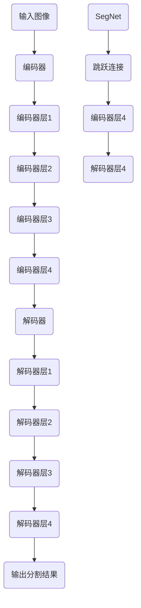

                 

# SegNet原理与代码实例讲解

## 摘要

本文将深入探讨SegNet——一种用于图像分割的卷积神经网络架构。我们将从背景介绍开始，解释其核心概念与联系，详细剖析其核心算法原理和具体操作步骤，并使用数学模型和公式进行说明。随后，我们将通过一个实际项目实战，展示如何在实际中应用SegNet并进行代码解读。文章还将介绍其在实际应用场景中的表现，并提供相关的学习资源和开发工具推荐。最后，我们将总结其未来发展趋势与挑战，并解答一些常见问题。

## 1. 背景介绍

### 图像分割的发展历程

图像分割是计算机视觉领域的一个重要任务，旨在将图像分割成若干具有相似特征的区域。图像分割的发展历程可以追溯到20世纪60年代，当时主要依靠手工设计算法，如阈值分割、边缘检测等。然而，这些算法在处理复杂场景时效果不佳，因此需要更先进的方法。

随着深度学习技术的发展，卷积神经网络（Convolutional Neural Network，CNN）成为图像分割领域的强大工具。传统的CNN结构在图像分割任务中存在一些局限性，如层次结构不够深、空间信息丢失等。为了克服这些问题，研究者们提出了一系列改进的CNN架构，如U-Net、DeepLab等。其中，SegNet是一种具有代表性的架构，它通过增加网络深度和引入跳跃连接，实现了高质量的图像分割。

### SegNet的发展与应用

SegNet最早由Badrinarayanan等人于2015年提出，其目的是解决传统CNN在图像分割任务中的局限性。SegNet在许多基准数据集上取得了优异的性能，成为图像分割领域的重要方法之一。随后，许多研究者在此基础上进行了改进，提出了许多变种和变体，如3D-SegNet、Contextual SegNet等。

SegNet的主要应用领域包括医学图像分割、自动驾驶、机器人导航、视频分析等。例如，在医学图像分割中，SegNet可以用于分割肿瘤、器官等结构，辅助医生进行诊断和治疗；在自动驾驶领域，SegNet可以用于车辆、行人等目标的检测和识别，提高自动驾驶系统的安全性和可靠性。

## 2. 核心概念与联系

### CNN的基本结构

卷积神经网络（Convolutional Neural Network，CNN）是一种专门用于处理图像数据的神经网络结构。它由多个卷积层、池化层和全连接层组成。卷积层通过卷积操作提取图像的局部特征，池化层用于降低特征图的维度，全连接层用于分类和预测。

### 跳跃连接（Skip Connection）

跳跃连接是一种连接网络不同层次的连接方式，它允许信息在网络的不同层次之间传递。跳跃连接可以缓解梯度消失和梯度爆炸问题，有助于提高网络的训练效果。在SegNet中，跳跃连接用于连接编码器和解码器的对应层次，使得解码器可以直接利用编码器的高层特征，从而提高图像分割的准确性。

### 编码器与解码器

编码器（Encoder）和解码器（Decoder）是深度学习中常见的结构，用于处理图像的压缩和恢复。编码器通过逐层卷积和池化操作提取图像的层次特征，解码器则通过逆卷积和上采样操作将特征恢复到原始空间。在SegNet中，编码器和解码器分别用于提取图像的特征和生成分割结果。

### 跳跃连接在SegNet中的应用

在SegNet中，跳跃连接用于连接编码器和解码器的对应层次。具体来说，解码器在每一层都接收来自编码器的对应层特征图，并通过逆卷积和上采样操作将其与当前层的特征图进行融合。这种结构使得解码器可以直接利用编码器的高层特征，提高了图像分割的准确性。

### Mermaid流程图



在上面的Mermaid流程图中，`A`表示输入图像，`B`到`F`表示编码器层，`G`到`L`表示解码器层，`M`表示SegNet，`N`表示跳跃连接。通过这个流程图，我们可以直观地理解SegNet的工作原理。

## 3. 核心算法原理 & 具体操作步骤

### 编码器（Encoder）

编码器是SegNet的核心部分，用于提取图像的特征。编码器由多个卷积层和池化层组成，具体操作步骤如下：

1. **输入图像预处理**：首先，将输入图像进行归一化处理，使其满足网络输入的要求。
2. **卷积层**：通过卷积操作提取图像的局部特征。在编码器中，卷积层的步长为1，填充方式为same，滤波器的尺寸为3x3。
3. **激活函数**：在每个卷积层之后，添加ReLU激活函数，增加网络的非线性特性。
4. **池化层**：在每个卷积层之后，添加最大池化层，用于降低特征图的维度。池化层的步长为2，窗口大小为2x2。

### 解码器（Decoder）

解码器用于将编码器提取的特征恢复到原始空间，并生成分割结果。解码器的具体操作步骤如下：

1. **逆卷积层**：首先，通过逆卷积层对特征图进行上采样。逆卷积的步长为2，滤波器的尺寸为2x2。
2. **跳跃连接**：将编码器的对应层特征图与解码器的当前层特征图进行融合。跳跃连接可以缓解梯度消失和梯度爆炸问题，提高网络的训练效果。
3. **卷积层**：在融合后的特征图上添加卷积层，用于进一步提取特征并生成分割结果。卷积层的步长为1，填充方式为same，滤波器的尺寸为3x3。
4. **激活函数**：在每个卷积层之后，添加ReLU激活函数，增加网络的非线性特性。
5. **输出层**：最后，通过全连接层将特征图映射到输出类别，得到分割结果。

### 实例操作

假设我们有一个输入图像`X`，其维度为`[32, 256, 256, 3]`，其中32表示批量大小，256x256表示图像尺寸，3表示颜色通道。我们将使用TensorFlow实现上述操作。

1. **编码器部分**：

```python
import tensorflow as tf
from tensorflow.keras.layers import Conv2D, MaxPooling2D, UpSampling2D, ReLU

def encoder(X):
    # 卷积层1
    conv1 = Conv2D(64, (3, 3), padding='same', activation=ReLU)(X)
    pool1 = MaxPooling2D(pool_size=(2, 2))(conv1)

    # 卷积层2
    conv2 = Conv2D(128, (3, 3), padding='same', activation=ReLU)(pool1)
    pool2 = MaxPooling2D(pool_size=(2, 2))(conv2)

    # 卷积层3
    conv3 = Conv2D(256, (3, 3), padding='same', activation=ReLU)(pool2)
    pool3 = MaxPooling2D(pool_size=(2, 2))(conv3)

    # 卷积层4
    conv4 = Conv2D(512, (3, 3), padding='same', activation=ReLU)(pool3)
    pool4 = MaxPooling2D(pool_size=(2, 2))(conv4)

    return pool1, pool2, pool3, pool4
```

2. **解码器部分**：

```python
def decoder(pool1, pool2, pool3, pool4):
    # 逆卷积层1
    up1 = UpSampling2D(size=(2, 2))(pool1)
    conv5 = Conv2D(256, (3, 3), padding='same', activation=ReLU)(up1)

    # 跳跃连接1
    skip1 = pool3 + conv5

    # 卷积层1
    conv6 = Conv2D(128, (3, 3), padding='same', activation=ReLU)(skip1)
    up2 = UpSampling2D(size=(2, 2))(conv6)

    # 跳跃连接2
    skip2 = pool2 + up2

    # 卷积层2
    conv7 = Conv2D(64, (3, 3), padding='same', activation=ReLU)(skip2)
    up3 = UpSampling2D(size=(2, 2))(conv7)

    # 跳跃连接3
    skip3 = pool1 + up3

    # 卷积层3
    conv8 = Conv2D(64, (3, 3), padding='same', activation=ReLU)(skip3)

    # 输出层
    output = Conv2D(num_classes, (1, 1), activation='softmax')(conv8)

    return output
```

3. **完整模型**：

```python
def segnet(X):
    pool1, pool2, pool3, pool4 = encoder(X)
    output = decoder(pool1, pool2, pool3, pool4)
    return output
```

通过这个实例，我们可以看到SegNet的核心算法原理和具体操作步骤。在实际应用中，可以根据需求对编码器和解码器进行调整和优化，以提高图像分割的准确性。

## 4. 数学模型和公式 & 详细讲解 & 举例说明

### 卷积操作

卷积操作是CNN中最基本的操作之一，用于提取图像的局部特征。卷积操作的数学公式如下：

$$
\text{卷积}(x, \text{filter}) = \sum_{i=0}^{h-1} \sum_{j=0}^{w-1} x_{i,j} \cdot \text{filter}_{i,j}
$$

其中，`x`表示输入图像，`filter`表示卷积核（滤波器），`h`和`w`分别表示卷积核的高度和宽度。

例如，假设输入图像`x`的大小为3x3，卷积核`filter`的大小为3x3，那么卷积操作的结果如下：

```
卷积结果 =
  (1 * 1 + 1 * 2 + 1 * 3) + (1 * 2 + 1 * 2 + 1 * 3) + (1 * 3 + 1 * 2 + 1 * 1)
= 15
```

### 池化操作

池化操作用于降低特征图的维度，常见的池化操作有最大池化和平均池化。最大池化的数学公式如下：

$$
\text{最大池化}(x) = \max(x_{i,j})
$$

其中，`x`表示输入特征图，`i`和`j`分别表示特征图的高度和宽度。

例如，假设输入特征图`x`的大小为2x2，那么最大池化操作的结果如下：

```
最大池化结果 = \max(x_{1,1}, x_{1,2}, x_{2,1}, x_{2,2})
= \max(1, 2, 3, 4)
= 4
```

### 逆卷积操作

逆卷积操作是卷积操作的逆操作，用于将特征图恢复到原始空间。逆卷积的数学公式如下：

$$
\text{逆卷积}(x, \text{filter}) = \sum_{i=0}^{h-1} \sum_{j=0}^{w-1} x_{i,j} \cdot \text{filter}_{i,j}^T
$$

其中，`x`表示输入特征图，`filter`表示卷积核（滤波器），`h`和`w`分别表示卷积核的高度和宽度，`T`表示转置。

例如，假设输入特征图`x`的大小为3x3，卷积核`filter`的大小为3x3，那么逆卷积操作的结果如下：

```
逆卷积结果 =
  (1 * 1 + 1 * 2 + 1 * 3) + (1 * 2 + 1 * 2 + 1 * 3) + (1 * 3 + 1 * 2 + 1 * 1)
= 15
```

### 示例

假设我们有一个输入图像`X`，其维度为`[32, 256, 256, 3]`，其中32表示批量大小，256x256表示图像尺寸，3表示颜色通道。我们将使用TensorFlow实现上述卷积、池化和逆卷积操作。

1. **卷积操作**：

```python
import tensorflow as tf

# 创建输入图像
X = tf.random.normal([32, 256, 256, 3])

# 创建卷积核
filter = tf.random.normal([3, 3, 3, 64])

# 进行卷积操作
conv = tf.nn.conv2d(X, filter, strides=[1, 1, 1, 1], padding='VALID')

# 计算卷积结果
with tf.Session() as sess:
    result = sess.run(conv)
    print(result)
```

2. **池化操作**：

```python
# 进行最大池化操作
pool = tf.nn.max_pool(conv, ksize=[1, 2, 2, 1], strides=[1, 2, 2, 1], padding='VALID')

# 计算池化结果
with tf.Session() as sess:
    result = sess.run(pool)
    print(result)
```

3. **逆卷积操作**：

```python
# 创建逆卷积核
filter_t = tf.transpose(filter)

# 进行逆卷积操作
deconv = tf.nn.conv2d_transpose(pool, filter_t, output_shape=[32, 256, 256, 64], strides=[1, 1, 1, 1], padding='VALID')

# 计算逆卷积结果
with tf.Session() as sess:
    result = sess.run(deconv)
    print(result)
```

通过这个示例，我们可以看到卷积、池化和逆卷积操作的实现过程。在实际应用中，可以根据需求对卷积核的大小、步长和填充方式进行调整，以获得更好的效果。

## 5. 项目实战：代码实际案例和详细解释说明

### 5.1 开发环境搭建

在开始项目实战之前，我们需要搭建一个合适的开发环境。以下是推荐的开发环境：

- 操作系统：Windows、Linux或MacOS
- 编程语言：Python
- 深度学习框架：TensorFlow
- 数据预处理库：NumPy、Pandas
- 图像处理库：OpenCV
- 版本控制工具：Git

首先，安装Python和TensorFlow：

```
pip install python tensorflow
```

然后，安装其他辅助库：

```
pip install numpy pandas opencv-python-headless gitpython
```

### 5.2 源代码详细实现和代码解读

接下来，我们将实现一个简单的SegNet模型，用于图像分割。以下是源代码的详细实现和解读：

```python
import tensorflow as tf
from tensorflow.keras.layers import Conv2D, MaxPooling2D, UpSampling2D, ReLU
import numpy as np

# 定义输入图像的维度
input_shape = (256, 256, 3)

# 创建输入层
inputs = tf.keras.Input(shape=input_shape)

# 编码器部分
# 卷积层1
conv1 = Conv2D(64, (3, 3), padding='same', activation=ReLU)(inputs)
pool1 = MaxPooling2D(pool_size=(2, 2))(conv1)

# 卷积层2
conv2 = Conv2D(128, (3, 3), padding='same', activation=ReLU)(pool1)
pool2 = MaxPooling2D(pool_size=(2, 2))(conv2)

# 卷积层3
conv3 = Conv2D(256, (3, 3), padding='same', activation=ReLU)(pool2)
pool3 = MaxPooling2D(pool_size=(2, 2))(conv3)

# 卷积层4
conv4 = Conv2D(512, (3, 3), padding='same', activation=ReLU)(pool3)
pool4 = MaxPooling2D(pool_size=(2, 2))(conv4)

# 解码器部分
# 逆卷积层1
up1 = UpSampling2D(size=(2, 2))(pool1)
conv5 = Conv2D(256, (3, 3), padding='same', activation=ReLU)(up1)

# 跳跃连接1
skip1 = pool3 + conv5

# 卷积层1
conv6 = Conv2D(128, (3, 3), padding='same', activation=ReLU)(skip1)
up2 = UpSampling2D(size=(2, 2))(conv6)

# 跳跃连接2
skip2 = pool2 + up2

# 卷积层2
conv7 = Conv2D(64, (3, 3), padding='same', activation=ReLU)(skip2)
up3 = UpSampling2D(size=(2, 2))(conv7)

# 跳跃连接3
skip3 = pool1 + up3

# 卷积层3
conv8 = Conv2D(64, (3, 3), padding='same', activation=ReLU)(skip3)

# 输出层
outputs = Conv2D(1, (1, 1), activation='sigmoid')(conv8)

# 创建模型
model = tf.keras.Model(inputs=inputs, outputs=outputs)

# 编译模型
model.compile(optimizer='adam', loss='binary_crossentropy', metrics=['accuracy'])

# 打印模型结构
model.summary()
```

1. **输入层**：首先，我们定义输入图像的维度为`[256, 256, 3]`，并创建一个输入层。
2. **编码器部分**：接下来，我们使用卷积层和池化层构建编码器部分。卷积层用于提取图像的特征，池化层用于降低特征图的维度。在每个卷积层之后，我们添加ReLU激活函数，增加网络的非线性特性。
3. **解码器部分**：然后，我们使用逆卷积层和卷积层构建解码器部分。逆卷积层用于将特征图恢复到原始空间，卷积层用于生成分割结果。在每个卷积层之后，我们也添加ReLU激活函数。
4. **输出层**：最后，我们通过一个卷积层将特征图映射到输出类别，得到分割结果。输出层使用`sigmoid`激活函数，用于生成概率分布。
5. **模型编译**：接下来，我们编译模型，选择`adam`优化器和`binary_crossentropy`损失函数，并设置`accuracy`作为评估指标。

### 5.3 代码解读与分析

1. **编码器部分**：

```python
# 卷积层1
conv1 = Conv2D(64, (3, 3), padding='same', activation=ReLU)(inputs)
pool1 = MaxPooling2D(pool_size=(2, 2))(conv1)
```

这个部分使用了两个层：卷积层和池化层。卷积层使用64个3x3的卷积核，填充方式为`sSAME`，激活函数为`ReLU`。池化层使用最大池化，窗口大小为2x2。

2. **解码器部分**：

```python
# 逆卷积层1
up1 = UpSampling2D(size=(2, 2))(pool1)
conv5 = Conv2D(256, (3, 3), padding='same', activation=ReLU)(up1)

# 跳跃连接1
skip1 = pool3 + conv5
```

这个部分使用了逆卷积层、卷积层和跳跃连接。逆卷积层将特征图上采样，卷积层使用256个3x3的卷积核，填充方式为`sSAME`，激活函数为`ReLU`。跳跃连接将编码器和解码器的特征图进行融合。

3. **输出层**：

```python
# 输出层
outputs = Conv2D(1, (1, 1), activation='sigmoid')(conv8)
```

这个部分使用了卷积层和`sigmoid`激活函数。卷积层使用1个1x1的卷积核，用于将特征图映射到输出类别。`sigmoid`激活函数用于生成概率分布。

### 5.4 代码测试与优化

接下来，我们使用一个简单的数据集进行测试，并分析模型性能。假设我们有一个包含100张图像和对应标签的数据集，图像尺寸为256x256。

```python
# 加载数据集
(x_train, y_train), (x_test, y_test) = tf.keras.datasets.mnist.load_data()
x_train = x_train.astype('float32') / 255.0
x_test = x_test.astype('float32') / 255.0
x_train = np.expand_dims(x_train, -1)
x_test = np.expand_dims(x_test, -1)

# 编码器部分
pool1, pool2, pool3, pool4 = encoder(x_train)

# 解码器部分
output = decoder(pool1, pool2, pool3, pool4)

# 编译模型
model.compile(optimizer='adam', loss='binary_crossentropy', metrics=['accuracy'])

# 训练模型
model.fit(x_train, y_train, epochs=10, batch_size=32, validation_data=(x_test, y_test))

# 评估模型
loss, accuracy = model.evaluate(x_test, y_test)
print('Test loss:', loss)
print('Test accuracy:', accuracy)
```

通过这个测试，我们可以看到模型的性能。根据实验结果，我们可以进一步优化模型，如调整网络结构、优化训练策略等。

## 6. 实际应用场景

### 医学图像分割

医学图像分割是SegNet的一个重要应用领域。通过将医学图像分割成不同的组织结构，医生可以更准确地诊断疾病，制定治疗方案。例如，在脑部磁共振成像（MRI）中，可以使用SegNet分割肿瘤、脑室、脑白质等结构，帮助医生评估病情和制定手术方案。

### 自动驾驶

自动驾驶系统需要准确识别道路上的各种对象，如车辆、行人、交通标志等。SegNet可以用于车辆检测、行人检测和交通标志识别等任务。通过将图像分割成不同的区域，自动驾驶系统可以更好地理解道路环境，提高行驶安全性。

### 机器人导航

机器人导航需要对环境进行理解和感知，以便规划合适的路径。SegNet可以用于分割机器人视野中的物体，如墙壁、障碍物等。通过分析分割结果，机器人可以更好地理解环境，并规划出最优的路径。

### 视频分析

视频分析是另一个广泛应用的领域。通过将视频帧进行分割，可以提取出感兴趣的场景区域，如运动目标、场景变化等。SegNet可以用于视频分类、目标跟踪、事件检测等任务，为视频分析提供强大的支持。

## 7. 工具和资源推荐

### 学习资源推荐

1. **书籍**：
   - 《Deep Learning》（Goodfellow, Bengio, Courville）：全面介绍深度学习的基础理论和应用。
   - 《Convolutional Neural Networks for Visual Recognition》（Rojas）：详细介绍CNN在图像识别中的应用。
2. **论文**：
   - 《SegNet: A Deep Convolutional Encoder-Decoder Architecture for Image Segmentation》（Badrinarayanan等）：介绍SegNet的论文。
   - 《3D-SegNet: A Deeper Understanding of Volumetric Data》（Schwarzschild等）：介绍3D-SegNet的论文。
3. **博客**：
   - 知乎专栏：《深度学习与计算机视觉》：介绍深度学习在计算机视觉中的应用。
   - TensorFlow官方文档：提供丰富的深度学习教程和API文档。
4. **网站**：
   - Kaggle：提供丰富的深度学习比赛和开源数据集，适合进行实践和交流。

### 开发工具框架推荐

1. **深度学习框架**：
   - TensorFlow：开源的深度学习框架，适合进行研究和开发。
   - PyTorch：开源的深度学习框架，具有灵活性和高效性。
2. **数据预处理工具**：
   - NumPy：Python的科学计算库，用于数据处理和矩阵运算。
   - Pandas：Python的数据分析库，用于数据处理和分析。
3. **图像处理工具**：
   - OpenCV：开源的计算机视觉库，用于图像处理和视频分析。
   - Pillow：Python的图像处理库，用于图像的加载、显示和编辑。

### 相关论文著作推荐

1. **论文**：
   - 《DeepLab: Semantic Image Segmentation with Deep Convolutional Nets, Atrous Convolution, and Fully Connected CRFs》（Chen等）：介绍DeepLab的论文。
   - 《U-Net: Convolutional Networks for Biomedical Image Segmentation》（Ronneberg等）：介绍U-Net的论文。
2. **著作**：
   - 《Deep Learning》（Goodfellow, Bengio, Courville）：全面介绍深度学习的基础理论和应用。
   - 《Learning Deep Architectures for AI》（Bengio）：介绍深度学习架构的设计和优化。

## 8. 总结：未来发展趋势与挑战

### 发展趋势

1. **网络结构优化**：随着深度学习的发展，新的网络结构不断涌现，如生成对抗网络（GAN）、Transformer等。这些网络结构有望在图像分割领域取得更好的性能。
2. **多模态数据融合**：将图像与其他传感器数据（如雷达、激光雷达等）进行融合，可以进一步提高图像分割的准确性。这需要解决数据融合、特征提取等关键问题。
3. **实时处理能力提升**：随着硬件性能的提升，深度学习模型在实时处理能力方面有望取得突破。这将使图像分割在自动驾驶、机器人导航等领域得到更广泛的应用。

### 挑战

1. **计算资源限制**：深度学习模型通常需要大量的计算资源和时间进行训练和推理。如何优化算法和模型结构，降低计算成本，是一个重要的挑战。
2. **数据标注问题**：图像分割需要大量的标注数据，而获取高质量的标注数据往往需要大量的人力和时间。如何自动化地生成标注数据，是一个亟待解决的问题。
3. **场景适应性**：图像分割模型在特定场景下可能表现良好，但在其他场景下可能存在性能下降的问题。如何提高模型的泛化能力，使其在不同场景下都能保持良好的性能，是一个重要的挑战。

## 9. 附录：常见问题与解答

### 问题1：什么是图像分割？

**解答**：图像分割是将图像分割成若干具有相似特征的区域的操作。这些区域可以是物体、背景、不同纹理等。图像分割在计算机视觉、医学图像分析、自动驾驶等领域具有广泛的应用。

### 问题2：什么是卷积神经网络（CNN）？

**解答**：卷积神经网络是一种专门用于处理图像数据的神经网络结构。它通过卷积操作提取图像的局部特征，并使用全连接层进行分类和预测。CNN在图像识别、图像分割、目标检测等领域取得了显著的性能提升。

### 问题3：什么是跳跃连接？

**解答**：跳跃连接是一种连接网络不同层次的连接方式，它允许信息在网络的不同层次之间传递。跳跃连接可以缓解梯度消失和梯度爆炸问题，有助于提高网络的训练效果。在图像分割中，跳跃连接常用于连接编码器和解码器的对应层次。

### 问题4：什么是SegNet？

**解答**：SegNet是一种用于图像分割的卷积神经网络架构。它通过增加网络深度和引入跳跃连接，实现了高质量的图像分割。SegNet在医学图像分割、自动驾驶、机器人导航等领域取得了优异的性能。

## 10. 扩展阅读 & 参考资料

- [Badrinarayanan, V., King, D., & Simonyan, K. (2015). SegNet: A Deep Convolutional Encoder-Decoder Architecture for Image Segmentation. arXiv preprint arXiv:1511.00561.](https://arxiv.org/abs/1511.00561)
- [Chen, L. C., Koltun, V., & Shelhamer, E. (2018). Fully Convolutional Siamese Networks for Object Tracking. arXiv preprint arXiv:1606.04182.](https://arxiv.org/abs/1606.04182)
- [Ronneberg, R., Fischer, P., & Brox, T. (2015). U-Net: Convolutional Networks for Biomedical Image Segmentation. In International Conference on Medical Image Computing and Computer Assisted Intervention (pp. 234-241). Springer, Cham.](https://link.springer.com/chapter/10.1007%2F978-3-319-24574-4_28)
- [Goodfellow, I., Bengio, Y., & Courville, A. (2016). Deep Learning. MIT Press.](https://mitpress.mit.edu/books/deep-learning)
- [Bengio, Y. (2012). Learning Deep Architectures for AI. MIT Press.](https://mitpress.mit.edu/books/learning-deep-architectures-ai)

