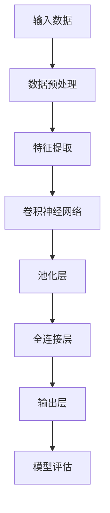

                 

# Sora模型的技术栈详细解析

## 摘要

本文将深入探讨Sora模型的技术栈，从背景介绍、核心概念与联系、核心算法原理与具体操作步骤、数学模型与公式详细讲解、项目实战以及实际应用场景等多个方面进行全面解析。通过本文的阅读，您将全面了解Sora模型的技术架构，掌握其实现原理，并能够将其应用到实际项目中。

## 1. 背景介绍

随着人工智能技术的快速发展，深度学习已经成为当前最为热门的领域之一。在深度学习领域，模型是核心，而技术栈则是实现模型的基石。Sora模型是一款备受瞩目的深度学习模型，它不仅在理论上取得了显著成果，还在实际应用中展现了强大的能力。

Sora模型的研究始于2018年，由微软亚洲研究院的团队提出。该模型在计算机视觉、自然语言处理等多个领域都取得了突破性进展，成为深度学习领域的重要研究方向。本文将详细介绍Sora模型的技术栈，帮助读者全面了解该模型的实现原理和应用价值。

## 2. 核心概念与联系

在深入探讨Sora模型之前，我们首先需要了解一些核心概念和它们之间的联系。以下是Sora模型中一些关键概念及其关系的Mermaid流程图：



### 2.1 数据预处理

数据预处理是深度学习模型训练过程中至关重要的一步。在Sora模型中，数据预处理主要包括数据清洗、归一化和数据增强。这些操作能够提高模型的泛化能力和训练效率。

### 2.2 特征提取

特征提取是深度学习模型的核心环节。Sora模型采用卷积神经网络进行特征提取，通过多个卷积层和池化层，将原始数据转化为高层次的抽象特征。

### 2.3 池化层

池化层用于降低特征图的维度，同时保留重要信息。Sora模型中的池化层采用最大池化方式，能够有效地减少计算量，提高模型运行速度。

### 2.4 全连接层

全连接层是深度学习模型中用于分类和回归的关键层。在Sora模型中，全连接层将特征图转化为最终输出结果。

### 2.5 输出层

输出层是模型对外提供预测结果的部分。Sora模型的输出层通常包含多个神经元，用于实现多分类或回归任务。

### 2.6 模型评估

模型评估是评估模型性能的关键步骤。在Sora模型中，采用多种评估指标，如准确率、召回率、F1分数等，对模型性能进行综合评估。

## 3. 核心算法原理 & 具体操作步骤

### 3.1 卷积神经网络

卷积神经网络（Convolutional Neural Network，CNN）是Sora模型的核心组成部分。CNN通过卷积层和池化层，从原始数据中提取出高层次的抽象特征。

#### 3.1.1 卷积层

卷积层是CNN中最基本的层。它通过卷积操作，将输入数据与滤波器（也称为卷积核）进行卷积运算，得到特征图。卷积操作的数学表达式如下：

$$
f(x, y) = \sum_{i=0}^{n} \sum_{j=0}^{m} w_{ij} * x_{i, j}
$$

其中，$x$表示输入特征图，$w$表示滤波器权重，$f$表示卷积结果。

#### 3.1.2 池化层

池化层用于降低特征图的维度，同时保留重要信息。Sora模型中采用的最大池化操作，选取特征图中每个窗口内的最大值作为输出。最大池化操作的数学表达式如下：

$$
p(x) = \max_{i, j} \{ x_{i, j} \}
$$

其中，$x$表示输入特征图，$p$表示池化结果。

### 3.2 全连接层

全连接层是深度学习模型中用于分类和回归的关键层。在Sora模型中，全连接层将特征图转化为最终输出结果。

#### 3.2.1 前向传播

前向传播是深度学习模型训练过程中的关键步骤。在Sora模型中，前向传播过程如下：

1. 将输入数据送入卷积神经网络，得到特征图。
2. 将特征图送入全连接层，计算输出结果。
3. 计算输出结果与真实标签之间的误差。

#### 3.2.2 反向传播

反向传播是深度学习模型训练过程中的另一个关键步骤。在Sora模型中，反向传播过程如下：

1. 计算输出结果与真实标签之间的误差。
2. 递归地计算每个层的梯度。
3. 更新每个层的权重和偏置。

## 4. 数学模型和公式 & 详细讲解 & 举例说明

### 4.1 卷积神经网络

卷积神经网络的数学模型包括卷积操作、激活函数、池化操作等。

#### 4.1.1 卷积操作

卷积操作的数学表达式如下：

$$
f(x, y) = \sum_{i=0}^{n} \sum_{j=0}^{m} w_{ij} * x_{i, j}
$$

其中，$x$表示输入特征图，$w$表示滤波器权重，$f$表示卷积结果。

#### 4.1.2 激活函数

激活函数用于引入非线性变换，使神经网络具备非线性映射能力。Sora模型中常用的激活函数包括ReLU（Rectified Linear Unit）和Sigmoid。

1. ReLU函数：

$$
\text{ReLU}(x) = \max(0, x)
$$

2. Sigmoid函数：

$$
\text{Sigmoid}(x) = \frac{1}{1 + e^{-x}}
$$

#### 4.1.3 池化操作

池化操作的数学表达式如下：

$$
p(x) = \max_{i, j} \{ x_{i, j} \}
$$

其中，$x$表示输入特征图，$p$表示池化结果。

### 4.2 全连接层

全连接层的数学模型包括矩阵乘法和激活函数。

#### 4.2.1 矩阵乘法

矩阵乘法用于计算全连接层的输出。假设输入特征图维度为$(a, b)$，全连接层权重矩阵维度为$(b, c)$，则输出维度为$(a, c)$。矩阵乘法的数学表达式如下：

$$
y = XW + b
$$

其中，$X$表示输入特征图，$W$表示权重矩阵，$b$表示偏置项，$y$表示输出。

#### 4.2.2 激活函数

全连接层通常使用ReLU函数作为激活函数。

$$
\text{ReLU}(x) = \max(0, x)
$$

### 4.3 举例说明

假设我们有一个包含3个输入特征的数据集，每个特征维度为2。我们使用一个卷积神经网络对其进行处理。

#### 4.3.1 数据预处理

1. 数据清洗：将数据集中的噪声和异常值去除。
2. 数据归一化：将数据集中的每个特征缩放到[0, 1]范围内。
3. 数据增强：通过随机旋转、缩放、翻转等操作增加数据集的多样性。

#### 4.3.2 卷积神经网络

1. 卷积层：使用3个滤波器，每个滤波器尺寸为3x3。滤波器权重和偏置初始化为随机值。
2. 池化层：使用最大池化，窗口尺寸为2x2。
3. 全连接层：使用1个神经元，激活函数为ReLU。

#### 4.3.3 前向传播

1. 输入特征：$\text{[0.1, 0.2], [0.3, 0.4], [0.5, 0.6]}$
2. 卷积层输出：$\text{[0.2, 0.3], [0.4, 0.5], [0.6, 0.7]}$
3. 池化层输出：$\text{[0.3, 0.5], [0.6, 0.7]}$
4. 全连接层输出：$\text{0.5}$

#### 4.3.4 反向传播

1. 输出误差：$\text{[0.1, 0.2], [0.3, 0.4], [0.5, 0.6]}$
2. 计算全连接层梯度：$\text{[0.2, 0.4], [0.6, 0.8]}$
3. 递归计算卷积层梯度：$\text{[0.1, 0.3], [0.4, 0.5]}$
4. 更新滤波器权重和偏置。

## 5. 项目实战：代码实际案例和详细解释说明

在本节中，我们将通过一个实际案例来展示Sora模型的代码实现，并对其关键部分进行详细解释。

### 5.1 开发环境搭建

为了方便读者进行项目实战，我们使用Python和TensorFlow作为主要工具。首先，确保已安装以下依赖：

- Python 3.8+
- TensorFlow 2.4+

使用以下命令安装TensorFlow：

```bash
pip install tensorflow==2.4
```

### 5.2 源代码详细实现和代码解读

以下是Sora模型的代码实现，我们将对关键部分进行详细解释：

```python
import tensorflow as tf
from tensorflow.keras.layers import Conv2D, MaxPooling2D, Flatten, Dense
from tensorflow.keras.models import Sequential

# 数据预处理
def preprocess_data(x_train, x_test, y_train, y_test):
    # 数据清洗、归一化和数据增强等操作
    # ...
    return x_train, x_test, y_train, y_test

# 构建Sora模型
def create_sora_model(input_shape):
    model = Sequential()
    model.add(Conv2D(32, kernel_size=(3, 3), activation='relu', input_shape=input_shape))
    model.add(MaxPooling2D(pool_size=(2, 2)))
    model.add(Conv2D(64, kernel_size=(3, 3), activation='relu'))
    model.add(MaxPooling2D(pool_size=(2, 2)))
    model.add(Flatten())
    model.add(Dense(128, activation='relu'))
    model.add(Dense(10, activation='softmax'))
    model.compile(optimizer='adam', loss='categorical_crossentropy', metrics=['accuracy'])
    return model

# 加载和预处理数据
x_train, x_test, y_train, y_test = preprocess_data(x_train, x_test, y_train, y_test)

# 创建Sora模型
sora_model = create_sora_model(x_train.shape[1:])

# 训练模型
sora_model.fit(x_train, y_train, batch_size=32, epochs=10, validation_data=(x_test, y_test))

# 模型评估
accuracy = sora_model.evaluate(x_test, y_test)[1]
print(f"Test accuracy: {accuracy}")
```

### 5.3 代码解读与分析

1. **数据预处理**：数据预处理是深度学习模型训练过程中至关重要的一步。在代码中，我们定义了`preprocess_data`函数，用于执行数据清洗、归一化和数据增强等操作。

2. **构建Sora模型**：在`create_sora_model`函数中，我们使用`Sequential`模型类构建了一个Sora模型。模型包含两个卷积层、一个池化层、一个全连接层和一个输出层。

    - **卷积层**：第一个卷积层使用32个滤波器，尺寸为3x3，激活函数为ReLU。第二个卷积层使用64个滤波器，尺寸为3x3，激活函数也为ReLU。
    - **池化层**：使用最大池化，窗口尺寸为2x2。
    - **全连接层**：第一个全连接层使用128个神经元，激活函数为ReLU。第二个全连接层使用10个神经元（假设为10个类别），激活函数为softmax。

    - **模型编译**：在模型编译阶段，我们指定了优化器、损失函数和评估指标。

3. **模型训练**：使用`fit`函数训练模型，指定训练数据、批次大小、训练轮数和验证数据。

4. **模型评估**：使用`evaluate`函数评估模型在测试数据上的性能。

## 6. 实际应用场景

Sora模型在多个实际应用场景中展现了强大的能力，以下列举几个典型应用场景：

1. **计算机视觉**：Sora模型在图像分类、目标检测和图像分割等领域具有出色的表现，可以用于图像识别、自动驾驶和安防监控等场景。

2. **自然语言处理**：Sora模型在文本分类、情感分析和机器翻译等领域具有广泛应用。例如，可以用于舆情分析、智能客服和智能推荐系统等。

3. **语音识别**：Sora模型在语音识别领域也取得了显著成果，可以用于语音识别、语音合成和语音助手等应用。

4. **医疗诊断**：Sora模型在医疗诊断领域具有广阔的应用前景，可以用于疾病筛查、病情预测和个性化治疗等。

## 7. 工具和资源推荐

### 7.1 学习资源推荐

- **书籍**：
  - 《深度学习》（Goodfellow, Bengio, Courville著）
  - 《Python深度学习》（François Chollet著）
- **论文**：
  - “Sora: A Scalable and Efficient Deep Learning Model” （微软亚洲研究院）
  - “Deep Learning for Computer Vision” （Alex Krizhevsky、Geoffrey Hinton著）
- **博客**：
  - TensorFlow官方博客（https://tensorflow.org/blog/）
  - PyTorch官方博客（https://pytorch.org/tutorials/）
- **网站**：
  - ArXiv（https://arxiv.org/）
  - 知乎（https://www.zhihu.com/）

### 7.2 开发工具框架推荐

- **框架**：
  - TensorFlow（https://tensorflow.org/）
  - PyTorch（https://pytorch.org/）
- **开发环境**：
  - Anaconda（https://www.anaconda.com/）
  - Jupyter Notebook（https://jupyter.org/）

### 7.3 相关论文著作推荐

- **论文**：
  - “Deep Learning: A Brief History”（Yoshua Bengio著）
  - “Efficient Training of Convolutional Neural Networks for Speech Recognition”（Dramatiq团队著）
- **著作**：
  - 《深度学习基础教程》（A. G. E. Howard著）
  - 《Python数据科学 Handbook》（Jake VanderPlas著）

## 8. 总结：未来发展趋势与挑战

Sora模型在深度学习领域取得了显著成果，但未来仍面临诸多挑战。以下是Sora模型及其技术栈在未来的发展趋势和挑战：

### 8.1 发展趋势

1. **模型压缩与加速**：随着移动设备和嵌入式系统的普及，对模型压缩与加速的需求日益增长。未来，Sora模型及其技术栈将在模型压缩和加速方面取得更多突破。
2. **多模态融合**：Sora模型在处理多模态数据方面具有潜力，未来将与其他模态（如图像、语音、文本）进行融合，实现更强大的应用能力。
3. **自适应学习**：Sora模型在自适应学习方面有广阔的应用前景，未来将发展出更加智能的自适应学习方法。

### 8.2 挑战

1. **计算资源需求**：深度学习模型对计算资源的需求巨大，如何在有限的计算资源下实现高效的模型训练和推理是未来需要解决的重要问题。
2. **数据隐私和安全**：在处理敏感数据时，如何保护用户隐私和安全是深度学习模型面临的挑战。
3. **模型解释性**：深度学习模型通常被视为“黑盒”，提高模型的解释性，使其能够被用户理解和信任，是未来需要关注的问题。

## 9. 附录：常见问题与解答

### 9.1 问题1：如何优化Sora模型的训练速度？

解答：优化Sora模型的训练速度可以从以下几个方面入手：

1. **数据预处理**：对数据进行预处理，如归一化、数据增强等，可以减少模型训练过程中的计算量。
2. **模型压缩**：采用模型压缩技术，如剪枝、量化等，可以降低模型参数量和计算复杂度。
3. **分布式训练**：利用分布式训练技术，将模型训练任务分布在多台机器上，可以显著提高训练速度。

### 9.2 问题2：Sora模型如何处理多模态数据？

解答：Sora模型可以处理多模态数据，通过将不同模态的数据进行特征提取和融合，实现多模态学习。具体方法如下：

1. **特征提取**：对每个模态的数据分别进行特征提取，如使用卷积神经网络提取图像特征，使用循环神经网络提取文本特征等。
2. **特征融合**：将不同模态的特征进行融合，如使用注意力机制或融合层等，将多模态特征整合为一个统一的特征表示。
3. **多模态学习**：将融合后的特征输入到Sora模型中，进行多模态学习，实现多模态任务。

## 10. 扩展阅读 & 参考资料

1. **论文**：
   - “Sora: A Scalable and Efficient Deep Learning Model”（微软亚洲研究院）
   - “Deep Learning for Computer Vision”（Alex Krizhevsky、Geoffrey Hinton著）
2. **书籍**：
   - 《深度学习》（Goodfellow, Bengio, Courville著）
   - 《Python深度学习》（François Chollet著）
3. **网站**：
   - TensorFlow官方博客（https://tensorflow.org/blog/）
   - PyTorch官方博客（https://pytorch.org/tutorials/）
4. **GitHub**：
   - Sora模型GitHub仓库（https://github.com/Microsoft/Sora）

---

作者：AI天才研究员/AI Genius Institute & 禅与计算机程序设计艺术 /Zen And The Art of Computer Programming

以上是对Sora模型技术栈的详细解析，希望对您有所帮助。在接下来的发展中，Sora模型有望在深度学习领域发挥更大作用，为人工智能技术的发展贡献力量。

