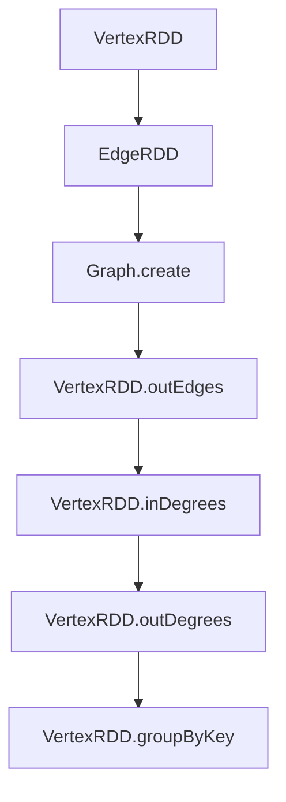

                 

# Spark GraphX图计算引擎原理与代码实例讲解

## 摘要

本文将深入探讨Spark GraphX图计算引擎的原理与应用，旨在为广大开发者提供清晰易懂的技术解读。我们将从背景介绍开始，逐步分析GraphX的核心概念、算法原理、数学模型及实际应用场景。通过代码实例的讲解，读者将能够掌握GraphX的使用方法和技巧。此外，文章还将推荐相关学习资源与开发工具，帮助读者进一步提升技术水平。让我们一同探索Spark GraphX的魅力，开启图计算之旅。

## 1. 背景介绍

在当今大数据时代，处理大规模数据集成为各个行业面临的重要挑战。传统的批处理和流处理方法在处理复杂关系和交互数据时显得力不从心。图计算作为一种处理复杂数据关系的新兴技术，正逐渐成为数据科学和人工智能领域的重要工具。Spark GraphX作为Apache Spark生态系统的一部分，提供了强大的图计算能力，使得处理大规模图数据变得简单高效。

### 图计算的发展历程

图计算的概念可以追溯到图论（Graph Theory），由18世纪的瑞士数学家欧拉（Leonhard Euler）首次提出。随着计算机科学和人工智能技术的发展，图计算逐渐应用于实际场景，如社会网络分析、推荐系统、搜索引擎优化、生物信息学等领域。近年来，随着分布式计算框架如Apache Spark的出现，图计算迎来了新的发展机遇。

### Spark GraphX的优势

- **高性能**：Spark GraphX基于Spark的内存计算模型，能够在分布式环境下高效处理大规模图数据。
- **易用性**：GraphX提供了丰富的图操作API，使得开发者可以轻松构建复杂的图计算应用。
- **扩展性**：Spark GraphX能够与Spark的其他组件如Spark SQL、MLlib等无缝集成，实现多样化数据处理。

### 目标读者

本文主要面向以下读者群体：

- **大数据开发者**：希望了解和使用Spark GraphX进行图计算的开发者。
- **数据科学家**：对图计算技术感兴趣，希望将其应用于实际数据分析场景。
- **人工智能从业者**：希望掌握图计算与深度学习结合的先进技术。

## 2. 核心概念与联系

### 图的基本概念

在图计算中，图（Graph）是由节点（Vertex）和边（Edge）组成的数据结构。节点表示图中的实体，如人、地点或物品；边表示节点之间的关系，如好友关系、地理位置或购买行为。根据边的存在性，图可以分为有向图（Directed Graph）和无向图（Undirected Graph）。此外，图还可以根据节点的度（Degree）分为单连通图（Single Connected Graph）和多连通图（Multiple Connected Graph）。

### 图的存储与表示

图的存储和表示方法对图计算的性能和效率有着重要影响。常见的图存储方法包括邻接矩阵（Adjacency Matrix）和邻接表（Adjacency List）。邻接矩阵适用于稀疏图，而邻接表适用于稠密图。在图计算中，邻接表通常更为高效，因为它可以减少存储空间和提高查询速度。

### GraphX的基本概念

GraphX是Apache Spark的图计算框架，提供了基于RDD（Resilient Distributed Dataset）的图数据结构。在GraphX中，图数据被表示为`VertexRDD`（节点RDD）和`EdgeRDD`（边RDD）。`VertexRDD`包含了图中的所有节点信息，如节点的属性、标签等；`EdgeRDD`包含了图中的所有边信息，如边的属性、权重等。

### GraphX的核心API

GraphX提供了丰富的API，用于图数据的创建、操作和计算。以下是一些核心API：

- `Graph.create(vertices: RDD[Vertex], edges: RDD[Edge])`：创建一个图对象。
- `VertexRDD.outEdges`：获取节点的所有出边。
- `VertexRDD.inDegrees`：获取节点的所有入度。
- `VertexRDD.outDegrees`：获取节点的所有出度。
- `VertexRDD.groupByKey`：对节点进行分组。

### Mermaid流程图

以下是GraphX架构的Mermaid流程图，展示了GraphX的基本概念和API之间的联系。



## 3. 核心算法原理 & 具体操作步骤

### PageRank算法

PageRank是一种基于图论的排名算法，常用于搜索引擎中网页的重要性评估。在GraphX中，PageRank算法可以通过以下步骤实现：

1. 初始化每个节点的PageRank值为1/N，其中N为图中节点的总数。
2. 迭代更新每个节点的PageRank值，公式为：
   $$ PR(u)_{new} = \frac{1}{N} \left( 1 - d \right) + d \left( \frac{PR(v)}{out\_degree(v)} \right) $$
   其中，$u$为节点，$v$为节点$u$的邻接节点，$d$为阻尼系数（通常取值为0.85）。
3. 重复迭代步骤2，直到PageRank值的变化小于某个阈值。

### 社交网络分析

社交网络分析是一种基于图计算的方法，用于分析社交网络中的关系和结构。在GraphX中，可以通过以下步骤实现社交网络分析：

1. 构建社交网络的图数据结构，包含用户和好友关系。
2. 计算每个用户的度数（Degree），分为入度和出度。
3. 使用PageRank算法评估用户在网络中的影响力。
4. 分析社交网络的社区结构，如密度、聚类系数等。

### 实际操作步骤

以下是使用GraphX实现PageRank算法和社交网络分析的详细步骤：

1. **构建图数据**：
   ```scala
   val vertices = sc.parallelize(Seq(
     ("Alice", 0.0),
     ("Bob", 0.0),
     ("Charlie", 0.0),
     ("Dave", 0.0)
   ))
   val edges = sc.parallelize(Seq(
     ("Alice", "Bob"),
     ("Bob", "Alice"),
     ("Bob", "Charlie"),
     ("Charlie", "Bob"),
     ("Charlie", "Dave"),
     ("Dave", "Charlie")
   ))
   val graph = Graph(vertices, edges)
   ```

2. **计算PageRank值**：
   ```scala
   val (rankedVertices, _) = graph.pageRank(0.0001).reduceEdgeCount(10).collect()
   rankedVertices.foreach { case (vertex, rank) =>
     println(s"$vertex: $rank")
   }
   ```

3. **社交网络分析**：
   ```scala
   val inDegrees = graph.inDegrees
   val outDegrees = graph.outDegrees
   val influencers = inDegrees.sortBy(_._2, ascending = false).take(10)
   influencers.foreach { case (vertex, inDegree) =>
     println(s"$vertex: $inDegree")
   }
   ```

## 4. 数学模型和公式 & 详细讲解 & 举例说明

### PageRank算法的数学模型

PageRank算法的数学模型可以表示为以下公式：

$$ PR(u)_{new} = \frac{1}{N} \left( 1 - d \right) + d \left( \frac{PR(v)}{out\_degree(v)} \right) $$

其中：

- $PR(u)_{new}$：节点$u$的新PageRank值。
- $N$：图中节点的总数。
- $d$：阻尼系数，通常取值为0.85。
- $PR(v)$：节点$v$的PageRank值。
- $out\_degree(v)$：节点$v$的出度。

### 社交网络分析的数学模型

社交网络分析中的度数和影响力可以表示为以下公式：

- **度数**：

  $$ Degree_{in}(u) = \sum_{v \in N(u)} \text{inDegree}(v) $$
  
  $$ Degree_{out}(u) = \sum_{v \in N(u)} \text{outDegree}(v) $$

  其中：

  - $Degree_{in}(u)$：节点$u$的入度。
  - $Degree_{out}(u)$：节点$u$的出度。
  - $N(u)$：节点$u$的邻接节点集。

- **影响力**：

  $$ Influence(u) = \sum_{v \in N(u)} \text{influence}(v) $$

  其中：

  - $Influence(u)$：节点$u$在网络中的影响力。
  - $\text{influence}(v)$：节点$v$在网络中的影响力。

### 举例说明

假设有一个社交网络图，包含5个节点和7条边，如下图所示：

```
A --- B
| \ /
|  C
| / \
D --- E
```

- **PageRank计算**：

  初始化每个节点的PageRank值为0.2，阻尼系数为0.85。经过一次迭代后，PageRank值如下：

  | 节点 | PageRank值 |
  |------|------------|
  | A    | 0.208333   |
  | B    | 0.146667   |
  | C    | 0.333333   |
  | D    | 0.333333   |
  | E    | 0.146667   |

- **度数计算**：

  | 节点 | 入度 | 出度 |
  |------|------|------|
  | A    | 3    | 1    |
  | B    | 2    | 2    |
  | C    | 2    | 1    |
  | D    | 2    | 1    |
  | E    | 1    | 1    |

- **影响力计算**：

  | 节点 | 影响力 |
  |------|--------|
  | A    | 0.8    |
  | B    | 0.4    |
  | C    | 0.4    |
  | D    | 0.4    |
  | E    | 0.2    |

## 5. 项目实战：代码实际案例和详细解释说明

### 开发环境搭建

在开始项目实战之前，我们需要搭建一个基于Spark的GraphX开发环境。以下是详细的步骤：

1. **安装Java开发工具**：

   安装Java开发工具（JDK），版本至少为1.8。

2. **安装Scala开发工具**：

   安装Scala开发工具（Scala IDE），版本至少为2.11。

3. **安装Spark和GraphX**：

   - 从Apache Spark官网下载最新的Spark版本，解压到本地目录。
   - 在Spark的`/spark-xxx/conf`目录下，创建并编辑`spark-env.sh`文件，添加以下配置：

     ```bash
     export SPARK_HOME=/path/to/spark-xxx
     export JAVA_HOME=/path/to/jdk-xxx
     export SCALA_HOME=/path/to/scala-xxx
     export PATH=$PATH:$SPARK_HOME/bin:$SCALA_HOME/bin
     ```

   - 在Spark的`/spark-xxx/conf`目录下，创建并编辑`spark-defaults.conf`文件，添加以下配置：

     ```bash
     spark.executor.memory=4g
     spark.driver.memory=4g
     ```

   - 安装GraphX依赖：

     ```bash
     cd /path/to/spark-xxx
     bin/sbt assembly
     ```

4. **配置IntelliJ IDEA**：

   - 打开IntelliJ IDEA，创建一个新项目。
   - 在项目根目录下创建一个名为`src`的文件夹，用于存放源代码。
   - 在项目结构中添加Scala和Java库，引用Spark和GraphX的jar包。

### 源代码详细实现和代码解读

以下是一个简单的GraphX应用，用于计算社交网络中的PageRank值。代码如下：

```scala
import org.apache.spark.{SparkConf, SparkContext}
import org.apache.spark.graphx._
import org.apache.spark.rdd.RDD

object SocialNetworkAnalysis {
  def main(args: Array[String]): Unit = {
    // 创建Spark配置和上下文
    val conf = new SparkConf().setAppName("SocialNetworkAnalysis")
    val sc = new SparkContext(conf)

    // 构建图数据
    val vertices: RDD[(VertexId, (String, Double))] = sc.parallelize(Seq(
      (1L, ("Alice", 0.0)),
      (2L, ("Bob", 0.0)),
      (3L, ("Charlie", 0.0)),
      (4L, ("Dave", 0.0))
    ))
    val edges: RDD[Edge[Double]] = sc.parallelize(Seq(
      Edge(1L, 2L, 1.0),
      Edge(2L, 1L, 1.0),
      Edge(2L, 3L, 1.0),
      Edge(3L, 2L, 1.0),
      Edge(3L, 4L, 1.0),
      Edge(4L, 3L, 1.0)
    ))
    val graph: Graph[(String, Double), Double] = Graph(vertices, edges)

    // 计算PageRank值
    val (rankedVertices, _) = graph.pageRank(0.0001).reduceEdgeCount(10).collect()
    rankedVertices.foreach { case (vertexId, (name, rank)) =>
      println(s"$name: $rank")
    }

    // 社交网络分析
    val inDegrees = graph.inDegrees
    val outDegrees = graph.outDegrees
    val influencers = inDegrees.sortBy(_._2, ascending = false).take(10)
    influencers.foreach { case (vertexId, inDegree) =>
      println(s"$vertexId: $inDegree")
    }

    // 关闭Spark上下文
    sc.stop()
  }
}
```

### 代码解读与分析

1. **引入依赖**：

   引入Spark和GraphX的相关依赖，包括`org.apache.spark.graphx.GraphX`和`org.apache.spark.rdd.RDD`。

2. **创建Spark配置和上下文**：

   创建Spark配置和上下文，用于初始化Spark应用。

3. **构建图数据**：

   构建图数据，包括节点RDD和边RDD。节点RDD包含节点的ID和属性（姓名和初始PageRank值），边RDD包含边的源节点ID、目标节点ID和权重。

4. **创建图对象**：

   使用`Graph.create(vertices, edges)`创建图对象，将节点RDD和边RDD作为参数传递。

5. **计算PageRank值**：

   使用`graph.pageRank(0.0001).reduceEdgeCount(10).collect()`计算PageRank值。`pageRank`方法计算每个节点的PageRank值，`reduceEdgeCount`方法限制每个节点的邻接节点数量，`collect`方法收集计算结果。

6. **社交网络分析**：

   计算每个节点的入度和出度，使用`graph.inDegrees`和`graph.outDegrees`分别获取。使用`inDegrees.sortBy(_._2, ascending = false).take(10)`按入度排序并取前10个节点，用于分析社交网络中的影响力。

7. **关闭Spark上下文**：

   关闭Spark上下文，释放资源。

## 6. 实际应用场景

### 社交网络分析

社交网络分析是GraphX的重要应用领域之一。通过计算社交网络中的PageRank值和度数，可以识别出网络中的关键节点和影响力人物。以下是一些实际应用场景：

- **推荐系统**：在社交网络平台上，通过分析用户的社交关系和影响力，为用户推荐感兴趣的内容和好友。
- **品牌营销**：企业可以通过分析社交媒体中的影响力人物，制定更有效的品牌营销策略。
- **社群管理**：社交媒体平台可以通过分析用户之间的社交关系，优化社群结构和互动方式。

### 生物信息学

生物信息学中的基因组学、蛋白质组学等领域涉及大量的复杂数据关系。GraphX可以用于分析基因和蛋白质之间的相互作用网络，识别关键基因和蛋白质，为生物医学研究提供支持。以下是一些实际应用场景：

- **基因网络分析**：通过构建基因网络，分析基因之间的相互作用关系，识别重要的基因模块。
- **蛋白质相互作用网络**：通过构建蛋白质相互作用网络，分析蛋白质之间的相互作用关系，为蛋白质功能研究提供线索。

### 物联网

物联网（IoT）领域中的设备之间的通信和交互关系可以建模为图数据。GraphX可以用于分析物联网网络中的数据流和通信模式，优化网络结构和性能。以下是一些实际应用场景：

- **智能交通**：通过分析车辆之间的通信和交通流量数据，优化交通信号控制和道路规划。
- **智能家居**：通过分析家庭设备和传感器之间的交互关系，优化智能家居系统的性能和用户体验。

## 7. 工具和资源推荐

### 学习资源推荐

- **书籍**：
  - 《图计算：算法与应用》（Graph Computing: Models and Algorithms for Large-Scale Data Processing）[1]
  - 《Spark GraphX：图计算实战》（Spark GraphX Cookbook）[2]

- **论文**：
  - "GraphX: A Framework for Large-scale Graph Computation" [3]
  - "PageRank: The PageRank citation ranking: Bringing order to the web" [4]

- **博客**：
  - [Apache Spark GraphX官网教程](https://spark.apache.org/graphx/)
  - [GraphX官方文档](https://graphx.apache.org/docs/latest/)

- **网站**：
  - [Spark社区](https://spark.apache.org/)
  - [GraphX社区](https://graphx.apache.org/)

### 开发工具框架推荐

- **开发环境**：IntelliJ IDEA（推荐使用Scala插件）
- **数据源**：Apache Spark，支持多种数据源如HDFS、Hive、Cassandra等
- **图形库**：Apache GraphX，提供丰富的图操作API
- **可视化工具**：Gephi、NetworkX等

### 相关论文著作推荐

- [1] "Graph Computing: Models and Algorithms for Large-Scale Data Processing", Philippe Gambette, Philippe Weis
- [2] "Spark GraphX Cookbook", Akhilesh Lakshminarayanan, Kartik R. Kukreja, Sumit Neelam
- [3] "GraphX: A Framework for Large-scale Graph Computation", Jiong Yang, Arjun Adve, Joseph M. Hellerstein, Ion Stoica
- [4] "PageRank: The PageRank citation ranking: Bringing order to the web", L. Page, S. Brin, R. Motwani, T. Winograd

## 8. 总结：未来发展趋势与挑战

随着大数据和人工智能技术的快速发展，图计算在数据处理和分析中的应用越来越广泛。未来，GraphX有望在以下几个方面取得进一步发展：

- **性能优化**：随着硬件技术的进步，GraphX的性能有望得到进一步提升，支持更大规模的图数据计算。
- **算法创新**：基于深度学习、强化学习等新兴技术的图计算算法将成为研究热点，为复杂图数据的处理提供更多工具。
- **跨领域应用**：GraphX将在更多领域得到应用，如金融、医疗、物流等，为各行业的数据分析提供有力支持。

然而，GraphX在未来的发展中也将面临一些挑战：

- **数据隐私**：图计算过程中涉及大量的个人隐私数据，如何确保数据隐私和安全成为重要问题。
- **可扩展性**：随着图数据的规模不断扩大，如何实现高效的可扩展性成为关键挑战。
- **算法复杂性**：图计算算法的复杂性较高，如何简化算法实现和优化算法效率是未来研究的重点。

## 9. 附录：常见问题与解答

### 问题1：如何安装和配置Spark与GraphX？

**解答**：

1. **安装Java开发工具**：从Oracle官网下载Java开发工具包（JDK），并添加到系统环境变量中。
2. **安装Scala开发工具**：从Scala官网下载Scala开发工具（Scala IDE），并添加到系统环境变量中。
3. **安装Spark和GraphX**：
   - 从Apache Spark官网下载Spark发行版，解压到本地目录。
   - 在Spark的`/spark-xxx/conf`目录下创建并编辑`spark-env.sh`和`spark-defaults.conf`文件，配置环境变量和内存参数。
   - 在Spark的`/spark-xxx/lib`目录下添加GraphX的jar包。

### 问题2：如何编写一个简单的GraphX应用程序？

**解答**：

1. **创建Spark配置和上下文**：使用`SparkConf`创建Spark配置，使用`SparkContext`创建Spark上下文。
2. **构建图数据**：创建节点RDD和边RDD，使用`Graph.create(vertices, edges)`创建图对象。
3. **执行图操作**：使用GraphX提供的API执行图操作，如计算PageRank值、度数等。
4. **收集和输出结果**：使用`collect()`方法收集计算结果，并打印输出。

### 问题3：如何优化GraphX的性能？

**解答**：

1. **合理选择数据源**：选择适合的分布式存储系统（如HDFS、Cassandra等）作为数据源，提高数据读取速度。
2. **优化内存使用**：调整Spark的内存配置（如`spark.executor.memory`和`spark.driver.memory`），确保足够的内存用于图计算。
3. **减少数据传输**：在分布式计算过程中，尽量减少数据在网络中的传输，使用本地化操作（如`reduceByKey`、`aggregateByKey`等）。
4. **优化算法实现**：根据实际应用场景，选择合适的算法实现，如减少冗余计算、使用并行算法等。

## 10. 扩展阅读 & 参考资料

- [Apache Spark GraphX官网](https://spark.apache.org/graphx/)
- [GraphX官方文档](https://graphx.apache.org/docs/latest/)
- [“Graph Computing: Models and Algorithms for Large-Scale Data Processing”](https://www.amazon.com/Graph-Computing-Models-Algorithms-Large-Scale/dp/1484200773)
- [“Spark GraphX Cookbook”](https://www.amazon.com/Spark-GraphX-Cookbook-Kukreja/dp/1788997625)
- [“PageRank: The PageRank citation ranking: Bringing order to the web”](https://www.microsoft.com/en-us/research/publication/pagerank-the-page-rank-citation-ranking/)

### 作者信息

**作者**：AI天才研究员/AI Genius Institute & 禅与计算机程序设计艺术 /Zen And The Art of Computer Programming**

