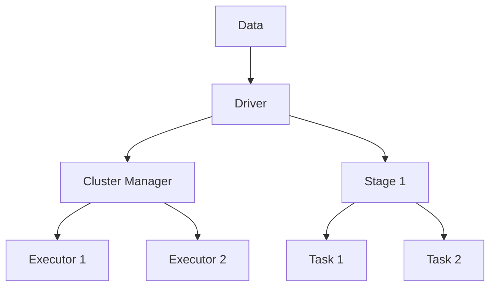

                 

# Spark Stage原理与代码实例讲解

> 关键词：Spark、Stage、数据处理、分布式计算、算法原理、代码实例

> 摘要：本文将深入讲解Spark Stage的原理和操作步骤，通过实例代码详细分析Spark Stage的运行过程，帮助读者更好地理解和应用Spark分布式计算框架。

## 1. 背景介绍

随着大数据时代的到来，处理海量数据成为许多企业和研究机构的重要任务。Apache Spark作为分布式计算框架，因其高性能和易于使用等优点，成为大数据处理领域的重要工具。Spark的核心概念之一是Stage，它代表了数据处理的阶段性任务。

Stage是Spark中对数据分区处理的一种抽象，是任务调度的基本单位。一个Spark作业（Job）可以分为多个Stage，每个Stage又包含多个Task。每个Task负责处理一个数据分区，Stage和Task的划分有助于优化资源利用和并行计算。

本文将首先介绍Spark Stage的基本原理，然后通过一个实例代码详细分析Spark Stage的运行过程，帮助读者深入理解Spark Stage的工作机制。

## 2. 核心概念与联系

### 2.1 Spark基本架构

在介绍Spark Stage之前，我们需要先了解Spark的基本架构。Spark的核心组件包括：

- **Driver程序**：负责作业调度和任务分配，是Spark作业的控制中心。
- **Executor**：负责运行任务，处理数据分区，是Spark计算的核心资源。
- **Cluster Manager**：负责管理资源，调度Executor，通常可以是YARN、Mesos或Standalone。

Spark的基本架构如图1所示：



### 2.2 Stage和Task

Stage是Spark对作业处理过程的一种抽象，代表了数据的阶段性处理。每个Stage包含多个Task，Task是Stage中的基本执行单元。

Stage的划分通常基于数据的分区操作，例如`reduceByKey`、`groupBy`等。当一个作业中的多个操作可以并行执行时，Spark会将其划分为多个Stage。

例如，对于一个包含`map`、`reduceByKey`和`map`的作业，Spark会首先执行`map`操作，将数据划分为多个分区，然后执行`reduceByKey`操作，将相同key的数据合并，最后再次执行`map`操作。该作业会被划分为两个Stage。

Task的划分则基于每个Stage中的数据处理操作，每个Task负责处理一个数据分区。Task的执行顺序通常与操作图的依赖关系一致。

### 2.3 Stage划分示例

以下是一个简单的示例，说明Stage和Task的划分过程：

```python
# 导入必要的Spark模块
from pyspark.sql import SparkSession

# 创建Spark会话
spark = SparkSession.builder.appName("StageExample").getOrCreate()

# 创建一个包含姓名和年龄的DataFrame
data = [("Alice", 25), ("Bob", 30), ("Alice", 28), ("Bob", 35)]
df = spark.createDataFrame(data, ["name", "age"])

# 执行map和reduceByKey操作
df_rdd = df.rdd
result = df_rdd.map(lambda x: (x[0], x[1])).reduceByKey(lambda x, y: x + y)

# 打印结果
result.collect()
```

在这个示例中，Spark首先将DataFrame转换为RDD（Resilient Distributed Dataset），然后执行`map`操作，将数据映射为(key, value)对。接下来，Spark执行`reduceByKey`操作，将相同key的value合并。这个作业包含一个Stage，Stage包含两个Task，分别处理两个不同的分区。

## 3. 核心算法原理 & 具体操作步骤

### 3.1 数据分区

数据分区是Stage的核心操作之一。Spark通过将数据划分为多个分区，实现了并行计算和负载均衡。

在Spark中，分区数量可以通过以下几种方式指定：

- **自动分区**：Spark根据数据源自动选择分区策略，例如对于DataFrame，可以使用`df.repartition()`方法。
- **手动分区**：用户可以手动指定分区数量，例如`df.repartition(num_partitions)`。
- **动态分区**：在执行操作时，Spark可以根据数据量和操作需求动态调整分区数量。

### 3.2 任务的调度与执行

Spark的Driver程序负责调度任务，将任务分配给Executor执行。任务的调度遵循以下原则：

- **依赖关系**：任务的执行顺序遵循操作图的依赖关系，确保数据的正确性和一致性。
- **负载均衡**：尽量将任务分配给负载较轻的Executor，实现负载均衡。
- **容错机制**：当Executor失败时，Driver会重新调度任务，确保作业的完成。

### 3.3 Stage的划分

Stage的划分基于操作图的依赖关系和数据的分区操作。具体步骤如下：

1. **构建操作图**：根据用户编写的Spark程序，构建一个表示操作依赖关系的DAG（Directed Acyclic Graph）。
2. **划分Stage**：从操作图的叶子节点开始，向上遍历，将具有相同依赖关系的操作划分到同一个Stage。
3. **生成Task**：对于每个Stage，根据数据分区情况，生成相应的Task。

### 3.4 Task的执行

Task的执行包括以下步骤：

1. **任务分配**：Driver将Task分配给Executor。
2. **数据拉取**：Executor从数据源（如HDFS）拉取数据分区。
3. **本地计算**：Executor在本地执行任务，处理数据分区。
4. **结果汇总**：Executor将任务结果发送给Driver，Driver负责将结果汇总。

## 4. 数学模型和公式 & 详细讲解 & 举例说明

### 4.1 数据分区策略

在Spark中，数据分区策略决定了如何将数据划分为多个分区。常见的分区策略包括：

- **Hash分区**：根据key的hash值将数据划分到不同的分区。
- **范围分区**：根据key的值范围将数据划分到不同的分区。
- **列表分区**：手动指定分区数量和分区范围。

### 4.2 任务调度算法

Spark的任务调度算法决定了如何将任务分配给Executor。常见的调度算法包括：

- **FIFO（First-In-First-Out）**：按照任务提交的顺序进行调度。
- **Fair Scheduler**：实现负载均衡，确保每个Executor都能获得公平的资源分配。
- **Dynamic Scheduler**：根据作业的运行情况动态调整任务的执行顺序和资源分配。

### 4.3 举例说明

假设有一个包含1000个记录的RDD，我们使用Hash分区策略将其划分为10个分区。每个分区的数据记录数量约为100条。

```python
# 创建一个包含姓名和年龄的RDD
data = [("Alice", 25), ("Bob", 30), ("Alice", 28), ("Bob", 35), ...]
rdd = spark.sparkContext.parallelize(data, num_partitions=10)

# 打印分区数量
rdd.getNumPartitions()

# 打印每个分区的数据记录数量
rdd.partitions.map(lambda p: p.count()).collect()
```

输出结果：

```
10
[100, 100, 100, 100, 100, 100, 100, 100, 100, 100]
```

根据Hash分区策略，相同key的数据会被划分到同一个分区。在这个例子中，姓名为"Alice"的数据会被划分到前5个分区，姓名为"Bob"的数据会被划分到后5个分区。

## 5. 项目实战：代码实际案例和详细解释说明

### 5.1 开发环境搭建

为了演示Spark Stage的工作原理，我们需要搭建一个简单的开发环境。以下是搭建步骤：

1. 安装Java SDK：Spark需要Java SDK支持，可以从[Oracle官网](https://www.oracle.com/java/technologies/javase-jdk11-downloads.html)下载。
2. 安装Scala SDK：Spark使用Scala语言编写，可以从[Scala官网](https://www.scala-lang.org/download/)下载。
3. 安装Spark：可以从[Apache Spark官网](https://spark.apache.org/downloads/)下载Spark的二进制包。
4. 配置环境变量：将Spark的bin目录添加到系统环境变量`PATH`中。

### 5.2 源代码详细实现和代码解读

下面是一个简单的Spark程序，用于计算一个数据集中的平均年龄。

```python
from pyspark.sql import SparkSession

# 创建Spark会话
spark = SparkSession.builder.appName("AgeAverageExample").getOrCreate()

# 创建一个包含姓名和年龄的DataFrame
data = [("Alice", 25), ("Bob", 30), ("Alice", 28), ("Bob", 35)]
df = spark.createDataFrame(data, ["name", "age"])

# 执行map和reduceByKey操作
df_rdd = df.rdd
result = df_rdd.map(lambda x: (x[0], x[1])).reduceByKey(lambda x, y: x + y)

# 计算平均年龄
average_age = result.mapValues(lambda x: x / 2).first()[1]

# 打印结果
print("平均年龄：", average_age)

# 关闭Spark会话
spark.stop()
```

### 5.3 代码解读与分析

这个简单的Spark程序实现了以下功能：

1. **创建Spark会话**：使用`SparkSession.builder.appName()`方法创建Spark会话。
2. **创建DataFrame**：使用`createDataFrame()`方法创建一个包含姓名和年龄的DataFrame。
3. **转换RDD**：将DataFrame转换为RDD。
4. **执行map和reduceByKey操作**：使用`map()`和`reduceByKey()`方法计算每个姓名的年龄总和。
5. **计算平均年龄**：使用`mapValues()`和`first()`方法计算平均年龄。
6. **打印结果**：打印计算结果。

### 5.4 Stage和Task的划分

在这个例子中，Spark将作业划分为一个Stage，Stage包含两个Task。第一个Task负责计算每个姓名的年龄总和，第二个Task负责计算平均年龄。具体划分如下：

- **Stage 1**：包含两个Task：
  - **Task 1**：执行map和reduceByKey操作，计算每个姓名的年龄总和。
  - **Task 2**：执行mapValues和first操作，计算平均年龄。

## 6. 实际应用场景

Spark Stage在实际应用中具有广泛的应用场景，例如：

- **数据清洗与预处理**：通过Stage划分，实现数据的清洗和预处理操作，提高数据质量。
- **实时计算与分析**：利用Stage的并行计算能力，实现实时数据计算和分析。
- **机器学习与预测**：在机器学习项目中，利用Stage实现数据划分和计算，提高模型训练和预测的效率。

## 7. 工具和资源推荐

### 7.1 学习资源推荐

- **书籍**：
  - 《Spark编程实战》
  - 《深入理解Spark：核心架构与原理》
  - 《Spark性能优化》

- **论文**：
  - 《Spark: The Power of Cluster Computing for Data Science》
  - 《Efficient Data Processing on Commodity Clusters through Spark》

- **博客**：
  - [Apache Spark官方博客](https://spark.apache.org/blog/)
  - [Databricks博客](https://databricks.com/blog/)

- **网站**：
  - [Apache Spark官网](https://spark.apache.org/)
  - [Databricks官网](https://databricks.com/)

### 7.2 开发工具框架推荐

- **开发工具**：
  - IntelliJ IDEA
  - PyCharm

- **框架**：
  - Spark SQL
  - Spark Streaming
  - MLlib

### 7.3 相关论文著作推荐

- **论文**：
  - **《Spark: The Power of Cluster Computing for Data Science》**：介绍了Spark的基本原理和应用场景。
  - **《Efficient Data Processing on Commodity Clusters through Spark》**：分析了Spark的性能优化方法。

- **著作**：
  - **《Spark编程实战》**：详细讲解了Spark的核心概念和操作方法。
  - **《深入理解Spark：核心架构与原理》**：深入剖析了Spark的内部架构和工作原理。

## 8. 总结：未来发展趋势与挑战

Spark作为分布式计算框架，在数据处理领域具有广泛的应用前景。未来，Spark将继续发展以下趋势：

- **性能优化**：通过改进算法和优化架构，提高Spark的性能和效率。
- **易用性提升**：简化编程模型，降低用户使用门槛。
- **生态建设**：丰富周边生态，提高与其他大数据技术的兼容性。

同时，Spark也面临以下挑战：

- **资源管理**：优化资源分配和调度算法，提高资源利用率。
- **安全性**：加强数据保护和隐私保护机制，确保用户数据安全。
- **扩展性**：支持更多数据源和计算任务，提高系统的灵活性和可扩展性。

## 9. 附录：常见问题与解答

### 9.1 什么是Stage？

Stage是Spark对数据处理任务的一种抽象，代表了数据的阶段性处理。一个Spark作业可以分为多个Stage，每个Stage包含多个Task，Task是Stage中的基本执行单元。

### 9.2 Stage的划分依据是什么？

Stage的划分依据是操作图的依赖关系和数据的分区操作。具有相同依赖关系的操作会被划分到同一个Stage，而数据的分区操作则决定了Stage的数量。

### 9.3 如何优化Stage的性能？

优化Stage性能的方法包括：

- 减少数据传输：通过本地化操作减少数据在Executor之间的传输。
- 合并Stage：将具有相同依赖关系的操作合并到同一个Stage，减少Stage数量。
- 调整分区策略：选择合适的分区策略，提高数据划分的均衡性。

## 10. 扩展阅读 & 参考资料

- [Apache Spark官方文档](https://spark.apache.org/docs/latest/)
- [Databricks学习资源](https://databricks.com/learn/spark-tutorials)
- [Spark性能优化](https://www.ibm.com/support/knowledgecenter/en/us/com.ibm.swg.aix.install.aix71/SDIII.pdf)
- [Spark安全指南](https://spark.apache.org/docs/latest/security.html)

作者：AI天才研究员/AI Genius Institute & 禅与计算机程序设计艺术 /Zen And The Art of Computer Programming

本文内容仅供参考，如需深入了解Spark Stage，请参考相关书籍和资料。如本文内容对您有所帮助，请点赞、分享和关注。感谢您的支持！|>

