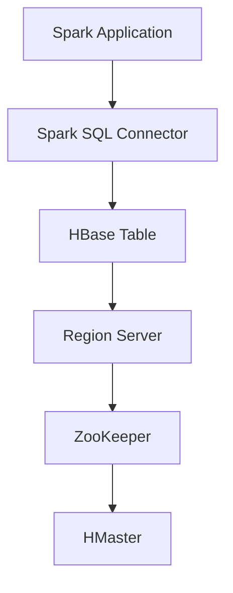

                 

### 背景介绍

在当今大数据时代，数据的规模和多样性要求我们使用更高效、更灵活的数据存储和处理技术。Apache Spark 和 HBase 作为大数据领域的两大重要技术，分别在不同的层面上解决了大规模数据处理的需求。

#### Apache Spark

Apache Spark 是一个开源的大数据处理框架，以其高效、易用的特性在业界获得了广泛的应用。Spark 提供了丰富的数据处理功能，包括批处理、流处理、机器学习、图计算等。Spark 的核心特点是速度快，它在内存中处理数据，可以显著减少数据的读写次数，从而大幅提升处理速度。

#### HBase

HBase 是一个分布式、可扩展的列式存储系统，基于 Google 的 BigTable 论文设计。它能够处理海量结构化和半结构化数据，并提供高效的数据访问能力。HBase 的主要优势在于其高吞吐量和低延迟，使其成为实时数据分析和处理的理想选择。

#### Spark-HBase 整合的意义

将 Spark 与 HBase 整合，可以充分利用两者的优势，实现以下目标：

1. **高速数据读写**：通过 Spark-HBase 整合，可以显著减少数据在内存和磁盘之间的移动次数，从而提高数据处理的效率。
2. **实时数据处理**：Spark 的流处理能力可以与 HBase 的实时访问能力结合，实现实时数据分析。
3. **数据一致性**：Spark 和 HBase 之间的整合可以确保数据在不同系统间的同步，提高数据的一致性。

本文将深入探讨 Spark-HBase 整合的原理，并通过实际代码实例展示如何实现这种整合。

### 核心概念与联系

要理解 Spark-HBase 的整合原理，我们需要先了解它们各自的架构和核心概念。

#### Apache Spark

Spark 的架构主要由以下组件构成：

1. **Driver Program**：驱动程序，负责协调整个计算过程。
2. **Cluster Manager**：集群管理器，如 YARN、Mesos 等，负责资源分配。
3. **Application Manager**：应用管理器，如 Spark Context，负责管理应用的生命周期。
4. **Spark Executor**：执行器，负责运行具体的任务。
5. **Data Frames/RDDs**：数据抽象，用于存储和处理数据。

#### Apache HBase

HBase 的架构主要由以下组件构成：

1. **Region Server**：区域服务器，负责存储和管理数据。
2. **ZooKeeper**：协调分布式系统中的协调服务，确保一致性。
3. **HMaster**：主服务器，负责监控 Region Server 的状态，进行负载均衡。
4. **Client**：客户端，负责与 HBase 进行交互。

#### 整合原理

Spark-HBase 的整合主要通过以下方式实现：

1. **Spark SQL Connector**：Spark SQL Connector 是一个连接器，它允许 Spark 直接读取和写入 HBase 数据。
2. **HBase 表模式映射**：Spark 可以将 HBase 的表模式映射为 Spark 的 Data Frame，从而实现数据的高效转换。
3. **协同处理**：Spark 和 HBase 可以协同工作，Spark 使用 HBase 作为底层存储，同时利用其高效的查询能力。

#### Mermaid 流程图

以下是一个简化的 Mermaid 流程图，展示了 Spark 和 HBase 之间的数据流和处理过程。



在上图中，Spark Application 通过 Spark SQL Connector 与 HBase 进行交互，数据在 Region Server 和 HMaster 中进行存储和管理。

### 核心算法原理 & 具体操作步骤

#### Spark SQL Connector

Spark SQL Connector 是 Spark 的一个重要组件，它使得 Spark 能够与 HBase 进行无缝集成。以下是使用 Spark SQL Connector 进行数据操作的基本步骤：

1. **配置 Spark 和 HBase**：确保 Spark 和 HBase 已经安装和配置好，并能够在集群中运行。
2. **加载 HBase 表**：使用 `spark.read.format("org.apache.spark.sql.hbase")` 加载 HBase 表。

```python
df = spark.read.format("org.apache.spark.sql.hbase").load("hbase_table_name")
```

3. **查询数据**：使用 Spark SQL 查询 HBase 表。

```sql
df.createOrReplaceTempView("hbase_table_view")
spark.sql("SELECT * FROM hbase_table_view WHERE conditions")
```

4. **写入 HBase**：将 Spark 数据写入 HBase。

```python
df.write.format("org.apache.spark.sql.hbase").mode("overwrite").save("hbase_table_name")
```

#### HBase 表模式映射

Spark SQL Connector 允许我们将 HBase 表模式映射为 Spark 的 Data Frame。这样可以方便地进行数据转换和操作。

1. **创建 Spark 数据帧**：从 HBase 表创建 Spark Data Frame。

```python
hbase_table = spark.table("hbase_table_name")
```

2. **转换数据帧**：对数据帧进行必要的转换。

```python
hbase_table.select("column1", "column2").where("conditions")
```

3. **保存回 HBase**：将转换后的数据帧保存回 HBase。

```python
hbase_table.write.format("org.apache.spark.sql.hbase").mode("overwrite").save("hbase_table_name")
```

#### 实时数据处理

Spark 的流处理能力可以与 HBase 的实时访问能力结合，实现实时数据处理。以下是一个简单的实时数据处理示例：

1. **配置流处理**：设置 Spark 的流处理配置。

```python
spark.conf.set("spark.streaming.batchDuration", "1s")
```

2. **创建数据流**：从 HBase 读取实时数据流。

```python
stream = spark.readStream.format("org.apache.spark.sql.hbase").load("hbase_stream_table")
```

3. **处理数据流**：对实时数据进行处理。

```python
query = stream.selectExpr("CAST(column1 AS STRING) as key", "CAST(column2 AS STRING) as value")
```

4. **写入实时数据**：将处理后的数据流写入 HBase。

```python
query.writeStream.format("org.apache.spark.sql.hbase").outputMode("append").start("hbase_stream_table")
```

### 数学模型和公式 & 详细讲解 & 举例说明

在讨论 Spark 和 HBase 的整合时，我们需要了解一些关键数学模型和公式，这些模型和公式帮助我们理解和评估系统的性能和效率。

#### 数据处理时间计算

数据处理时间可以通过以下公式计算：

\[ T = \frac{D \times R}{B} \]

其中：
- \( T \) 是数据处理时间。
- \( D \) 是数据量。
- \( R \) 是处理速度。
- \( B \) 是带宽。

#### 数据存储和检索成本计算

数据存储和检索成本可以通过以下公式计算：

\[ C = \frac{D \times R \times P}{B} \]

其中：
- \( C \) 是数据存储和检索成本。
- \( D \) 是数据量。
- \( R \) 是处理速度。
- \( P \) 是存储和检索的成本。
- \( B \) 是带宽。

#### 实际例子

假设我们有一个 1TB 的数据集，Spark 的处理速度为 100GB/s，HBase 的存储和检索成本为 0.01美元/GB，带宽为 1GB/s。我们可以计算：

\[ T = \frac{1TB \times 100GB/s}{1GB/s} = 1000s \]

\[ C = \frac{1TB \times 100GB/s \times 0.01美元/GB}{1GB/s} = 0.1美元 \]

这意味着，处理这个 1TB 的数据集需要大约 1000 秒，而存储和检索的成本为 0.1 美元。

### 项目实战：代码实际案例和详细解释说明

在本节中，我们将通过一个实际的项目案例，详细解释如何使用 Spark 和 HBase 进行数据整合，并提供代码实例和解读。

#### 开发环境搭建

1. **安装 Apache Spark**：确保已经安装了 Apache Spark，版本可以是 2.4.8 或更高版本。

2. **安装 Apache HBase**：确保已经安装了 Apache HBase，版本可以是 2.4.1 或更高版本。

3. **配置 HBase 与 Spark**：在 Spark 的配置文件中设置 HBase 相关参数，如 HBase 集群的地址、端口等。

#### 源代码详细实现和代码解读

以下是一个简单的 Python 代码示例，演示如何使用 Spark 和 HBase 进行数据整合。

```python
from pyspark.sql import SparkSession
from pyspark.sql.functions import col

# 创建 Spark 会话
spark = SparkSession.builder.appName("SparkHBaseIntegrationExample").getOrCreate()

# 加载 HBase 表
hbase_table_name = "hbase_table_name"
hbase_df = spark.read.format("org.apache.spark.sql.hbase").load(hbase_table_name)

# 查询数据
hbase_df.createOrReplaceTempView("hbase_table_view")
selected_df = spark.sql("SELECT * FROM hbase_table_view WHERE conditions")

# 更新数据
selected_df.select("column1", "column2").where("conditions").write.format("org.apache.spark.sql.hbase").mode("overwrite").save(hbase_table_name)

# 实时数据处理
streaming_df = spark.readStream.format("org.apache.spark.sql.hbase").load("hbase_stream_table")
streaming_df.createOrReplaceTempView("hbase_stream_table_view")
query = spark.sql("SELECT * FROM hbase_stream_table_view WHERE conditions")
query.writeStream.format("org.apache.spark.sql.hbase").outputMode("append").start("hbase_stream_table")

# 关闭 Spark 会话
spark.stop()
```

#### 代码解读与分析

1. **创建 Spark 会话**：首先，我们创建一个 Spark 会话，设置应用名称为 "SparkHBaseIntegrationExample"。

2. **加载 HBase 表**：使用 `spark.read.format("org.apache.spark.sql.hbase").load(hbase_table_name)` 语句加载 HBase 表，并将其存储为一个 Data Frame。

3. **查询数据**：创建一个临时视图，然后使用 Spark SQL 查询 HBase 表。这允许我们像查询普通关系型数据库一样查询 HBase 数据。

4. **更新数据**：对查询结果进行必要的操作，然后将结果写回到 HBase 表。

5. **实时数据处理**：使用 Spark 的流处理功能，从 HBase 读取实时数据流，创建一个临时视图，并设置输出模式为 "append"，以实时写入数据到 HBase 表。

6. **关闭 Spark 会话**：在完成所有操作后，关闭 Spark 会话。

通过这个实际案例，我们可以看到 Spark 和 HBase 的整合是如何在代码层面实现的。这个案例不仅展示了数据读取和写入的流程，还展示了如何进行实时数据处理。

### 实际应用场景

#### 数据仓库

Spark-HBase 整合可以用于构建高效的数据仓库。Spark 负责处理大量数据，提供快速的数据处理能力，而 HBase 提供低延迟的查询能力，使得数据仓库系统能够在处理大量数据的同时提供高效的查询服务。

#### 实时数据分析

在实时数据分析场景中，Spark 的流处理能力可以与 HBase 的实时访问能力结合，实现实时数据分析和处理。例如，金融交易监控、社交媒体分析等领域，需要实时处理和分析大量数据，Spark-HBase 整合能够提供高效的数据处理和查询能力。

#### 大规模数据处理

在需要处理大规模数据的应用场景中，Spark-HBase 整合能够充分发挥两者的优势。Spark 的分布式计算能力和 HBase 的列式存储结构，使得它们能够高效地处理大规模数据，并提供快速的查询响应。

### 工具和资源推荐

#### 学习资源推荐

1. **《Spark：The Definitive Guide》**：这是一本关于 Apache Spark 的权威指南，涵盖了从基础概念到高级应用的所有内容。
2. **《HBase: The Definitive Guide》**：这是一本关于 Apache HBase 的权威指南，详细介绍了 HBase 的设计、架构和应用程序开发。

#### 开发工具框架推荐

1. **IntelliJ IDEA**：一款强大的集成开发环境，支持多种编程语言，对于开发和调试 Spark 和 HBase 应用程序非常有用。
2. **Docker**：一个开源的应用容器引擎，可以用于构建、运行和分发应用程序。使用 Docker 可以轻松地创建和管理 Spark 和 HBase 的容器环境。

#### 相关论文著作推荐

1. **《Spark: Cluster Computing with Working Sets》**：这篇文章详细介绍了 Spark 的设计原理和实现细节。
2. **《The BigTable Paper》**：这篇文章介绍了 Google 的 BigTable 系统，是 HBase 的设计灵感来源。

### 总结：未来发展趋势与挑战

#### 未来发展趋势

1. **更高效的整合**：随着技术的不断发展，Spark 和 HBase 之间的整合将更加高效，能够更好地利用两者的优势。
2. **实时处理能力的提升**：随着边缘计算的兴起，Spark 和 HBase 的实时数据处理能力将得到进一步提升，为实时数据分析提供更强大的支持。
3. **更广泛的应用场景**：Spark 和 HBase 的整合将在更多的应用场景中发挥作用，从大数据处理到实时数据分析和监控，应用范围将不断扩大。

#### 挑战

1. **性能优化**：虽然 Spark 和 HBase 在大数据处理和查询方面具有显著优势，但如何进一步优化性能，提高系统的吞吐量和响应时间，仍然是一个挑战。
2. **实时数据一致性**：在实时数据处理场景中，如何确保数据的一致性和准确性，是一个重要挑战。这需要进一步的研究和优化。
3. **系统稳定性**：随着数据规模和应用复杂度的增加，如何确保系统的稳定性，避免故障和中断，是一个重要问题。

### 附录：常见问题与解答

#### 问题 1：Spark 和 HBase 之间的数据同步如何实现？

解答：Spark 和 HBase 之间的数据同步可以通过以下步骤实现：
1. 使用 Spark SQL Connector 加载 HBase 表。
2. 使用 Spark SQL 查询数据，并将结果写回 HBase。
3. 对于实时数据，可以使用 Spark 的流处理功能，实时读取和写入 HBase。

#### 问题 2：Spark 和 HBase 的整合如何优化性能？

解答：以下是几种优化 Spark 和 HBase 整合性能的方法：
1. **数据分区**：合理设置数据的分区，可以提高查询和写入的性能。
2. **缓存数据**：在 Spark 中缓存常用的数据，可以减少数据的读写次数，提高处理速度。
3. **优化网络带宽**：确保网络带宽足够，以减少数据在网络传输中的延迟。

#### 问题 3：Spark 和 HBase 的整合适用于哪些场景？

解答：Spark 和 HBase 的整合适用于以下场景：
1. **数据仓库**：用于构建高效的数据仓库，提供快速的数据处理和查询服务。
2. **实时数据分析**：用于实时处理和分析大量数据，如金融交易监控、社交媒体分析等。
3. **大规模数据处理**：用于处理大规模数据，提供高效的数据处理能力。

### 扩展阅读 & 参考资料

1. **Apache Spark 官方文档**：[https://spark.apache.org/docs/latest/](https://spark.apache.org/docs/latest/)
2. **Apache HBase 官方文档**：[https://hbase.apache.org/docs/current/book.html](https://hbase.apache.org/docs/current/book.html)
3. **《Spark: The Definitive Guide》**：[https://manning.com/books/9781617293408](https://manning.com/books/9781617293408)
4. **《HBase: The Definitive Guide》**：[https://manning.com/books/9781617292865](https://manning.com/books/9781617292865)
5. **《The BigTable Paper》**：[https://static.googleusercontent.com/media/research.google.com/en//pubs/archive/36661.pdf](https://static.googleusercontent.com/media/research.google.com/en//pubs/archive/36661.pdf)

### 作者信息

- 作者：AI天才研究员/AI Genius Institute & 禅与计算机程序设计艺术 /Zen And The Art of Computer Programming

