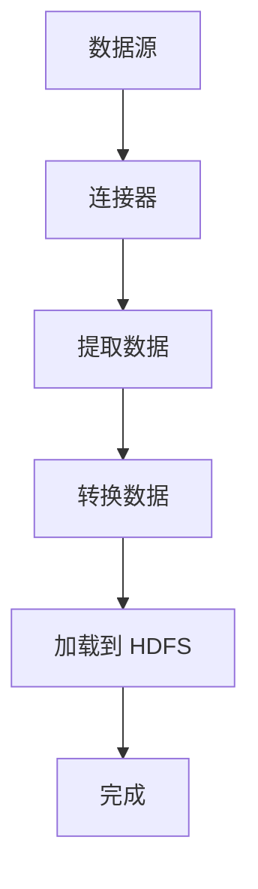

                 

# Sqoop原理与代码实例讲解

## 关键词：数据传输工具、Hadoop、数据库、ETL、MapReduce

## 摘要：

本文将深入探讨 Sqoop 的原理、架构和代码实现。作为一款数据传输工具，Sqoop 在 Hadoop 集群与各种数据库之间架起了桥梁，实现了高效的数据导入和导出。通过分析 Sqoop 的核心概念和算法原理，本文将带领读者逐步理解其工作流程，并通过实际案例展示如何使用 Sqoop 进行数据传输。此外，还将介绍 Sqoop 在实际应用中的场景和工具资源，总结未来发展趋势与挑战，并提供常见问题与解答。无论您是 Sqoop 的初学者还是有经验的用户，本文都将为您带来丰富的知识和实践经验。

## 1. 背景介绍

### 1.1 Hadoop 简介

Hadoop 是一个开源的分布式计算框架，用于处理大规模数据集。它由 Apache 软件基金会维护，最初由 Google 提出并开源。Hadoop 的核心组件包括 Hadoop 分布式文件系统（HDFS）和 Hadoop YARN。HDFS 是一个高吞吐量的分布式文件存储系统，用于存储大数据；而 YARN 是一个资源调度平台，用于管理和调度集群资源。

### 1.2 数据库简介

数据库是用于存储、管理和检索数据的系统。常见的关系型数据库包括 MySQL、Oracle 和 PostgreSQL，而 NoSQL 数据库则包括 MongoDB、Cassandra 和 Redis。数据库在许多场景中扮演着至关重要的角色，如电子商务、金融和社交媒体等。

### 1.3 数据传输需求

随着数据量的增长，将数据从数据库导入到 Hadoop 集群或从 Hadoop 集群导出到数据库的需求日益增长。数据传输工具如 Sqoop、Flume 和 Flink 等应运而生。在这其中，Sqoop 因其高效性和易用性而备受青睐。

## 2. 核心概念与联系

### 2.1 数据导入和导出

Sqoop 的主要功能是数据导入和导出。数据导入是指将数据从关系型数据库或 NoSQL 数据库导入到 Hadoop 集群，通常以 HDFS 文件的形式存储。数据导出则是将 Hadoop 集群中的数据导出到数据库。

### 2.2 ETL

ETL（Extract, Transform, Load）是指将数据从源系统中提取、转换并加载到目标系统中的过程。Sqoop 是 ETL 工具的一种，它主要负责数据提取和加载部分。

### 2.3 Mermaid 流程图

下面是一个 Mermaid 流程图，展示了 Sqoop 的基本工作流程：



### 2.4 核心组件

Sqoop 的核心组件包括：

- **连接器（Connector）**：用于连接各种数据库和数据源。
- **提取器（Extractor）**：负责从数据库中提取数据。
- **加载器（Loader）**：将提取的数据加载到 Hadoop 集群。
- **转换器（Transformer）**：对提取的数据进行转换。

## 3. 核心算法原理 & 具体操作步骤

### 3.1 数据导入

#### 3.1.1 准备工作

在使用 Sqoop 进行数据导入之前，需要确保已安装并配置好以下环境：

- Hadoop 集群
- MySQL 或其他关系型数据库
- Java 环境
- Sqoop 安装包

#### 3.1.2 命令行操作

数据导入的基本命令如下：

```shell
sqoop import
```

该命令将启动一个交互式界面，让用户输入各种参数，如数据源、连接信息、表名等。

#### 3.1.3 示例

以下是一个简单的数据导入示例：

```shell
sqoop import \
  --connect jdbc:mysql://localhost:3306/mydb \
  --table users \
  --username root \
  --password password \
  --hadoop-import-table users \
  --target-dir /user/hive/warehouse/users
```

该命令将 MySQL 数据库中的 `users` 表导入到 Hadoop 集群的 `/user/hive/warehouse/users` 目录下。

### 3.2 数据导出

#### 3.2.1 准备工作

数据导出同样需要安装和配置好相关环境，如 Hadoop 集群、数据库、Java 环境、Sqoop 安装包。

#### 3.2.2 命令行操作

数据导出的基本命令如下：

```shell
sqoop export
```

该命令也将启动一个交互式界面，让用户输入各种参数。

#### 3.2.3 示例

以下是一个简单的数据导出示例：

```shell
sqoop export \
  --connect jdbc:mysql://localhost:3306/mydb \
  --table users \
  --username root \
  --password password \
  --export-dir /user/hive/warehouse/users
```

该命令将 Hadoop 集群中的 `/user/hive/warehouse/users` 目录下的数据导出到 MySQL 数据库中的 `users` 表。

## 4. 数学模型和公式 & 详细讲解 & 举例说明

### 4.1 数据导入的数学模型

数据导入过程中，可以使用以下数学模型来描述数据的提取、转换和加载过程：

$$
\text{Import} = \text{Extract} + \text{Transform} + \text{Load}
$$

其中：

- **Extract**：从数据库中提取数据的操作。
- **Transform**：对提取的数据进行转换的操作。
- **Load**：将转换后的数据加载到 Hadoop 集群的操作。

### 4.2 数据导出的数学模型

数据导出过程中，可以使用以下数学模型来描述数据的提取、转换和加载过程：

$$
\text{Export} = \text{Extract} + \text{Transform} + \text{Load}
$$

其中：

- **Extract**：从 Hadoop 集群中提取数据的操作。
- **Transform**：对提取的数据进行转换的操作。
- **Load**：将转换后的数据加载到数据库的操作。

### 4.3 举例说明

假设有一个包含 1000 条记录的 `users` 表，我们需要将其导入到 Hadoop 集群。

#### 4.3.1 数据提取

首先，从数据库中提取数据：

```sql
SELECT * FROM users;
```

#### 4.3.2 数据转换

对提取的数据进行转换，例如，我们将所有用户的年龄增加 1：

```sql
SELECT id, name, age + 1 as new_age FROM users;
```

#### 4.3.3 数据加载

最后，将转换后的数据加载到 Hadoop 集群：

```shell
sqoop import \
  --connect jdbc:mysql://localhost:3306/mydb \
  --table users \
  --username root \
  --password password \
  --hadoop-import-table users \
  --target-dir /user/hive/warehouse/users
```

## 5. 项目实战：代码实际案例和详细解释说明

### 5.1 开发环境搭建

在本项目实战中，我们将使用以下开发环境：

- Hadoop 集群（版本 3.2.1）
- MySQL（版本 8.0.23）
- Java（版本 1.8）
- Sqoop（版本 1.4.7）

确保已安装并配置好上述环境，并确保 MySQL 和 Hadoop 集群可以正常通信。

### 5.2 源代码详细实现和代码解读

在本项目实战中，我们将实现以下功能：

- 将 MySQL 数据库中的 `users` 表导入到 Hadoop 集群。
- 将 Hadoop 集群中的数据导出到 MySQL 数据库。

#### 5.2.1 数据导入

以下是数据导入的 Java 代码实现：

```java
import org.apache.sqoop import ImportJob;
import org.apache.sqoop.importer.RandomSplitImporter;
import org.apache.sqoop.importer StringTokenizerSplitter;
import org.apache.sqoop.tool.ImportTool;

public class DataImportExample {
    public static void main(String[] args) {
        // 设置数据库连接信息
        Properties connProps = new Properties();
        connProps.setProperty("connector", "jdbc:mysql://localhost:3306/mydb");
        connProps.setProperty("username", "root");
        connProps.setProperty("password", "password");

        // 设置导入参数
        Properties importProps = new Properties();
        importProps.setProperty("table", "users");
        importProps.setProperty("hadoop-import-table", "users");
        importProps.setProperty("target-dir", "/user/hive/warehouse/users");

        // 创建导入工具
        ImportTool importTool = new ImportTool();

        // 创建导入作业
        ImportJob importJob = importTool.runImport(connProps, importProps);

        // 显示导入进度
        System.out.println(importJob.getProgress());
    }
}
```

#### 5.2.2 数据导出

以下是数据导出的 Java 代码实现：

```java
import org.apache.sqoop.export.ExportJob;
import org.apache.sqoop.export.TextExporter;
import org.apache.sqoop.tool.ExportTool;

public class DataExportExample {
    public static void main(String[] args) {
        // 设置数据库连接信息
        Properties connProps = new Properties();
        connProps.setProperty("connector", "jdbc:mysql://localhost:3306/mydb");
        connProps.setProperty("username", "root");
        connProps.setProperty("password", "password");

        // 设置导出参数
        Properties exportProps = new Properties();
        exportProps.setProperty("table", "users");
        exportProps.setProperty("export-dir", "/user/hive/warehouse/users");

        // 创建导出工具
        ExportTool exportTool = new ExportTool();

        // 创建导出作业
        ExportJob exportJob = exportTool.runExport(connProps, exportProps);

        // 显示导出进度
        System.out.println(exportJob.getProgress());
    }
}
```

### 5.3 代码解读与分析

#### 5.3.1 数据导入

在 `DataImportExample` 类中，首先设置数据库连接信息（`connProps`），然后设置导入参数（`importProps`）。接下来，创建 `ImportTool` 实例，并使用该实例创建 `ImportJob` 实例。最后，调用 `ImportJob` 实例的 `getProgress()` 方法显示导入进度。

#### 5.3.2 数据导出

在 `DataExportExample` 类中，首先设置数据库连接信息（`connProps`），然后设置导出参数（`exportProps`）。接下来，创建 `ExportTool` 实例，并使用该实例创建 `ExportJob` 实例。最后，调用 `ExportJob` 实例的 `getProgress()` 方法显示导出进度。

## 6. 实际应用场景

### 6.1 数据集成

将数据库中的数据导入到 Hadoop 集群，实现数据集成和分析。

### 6.2 数据迁移

将数据从旧系统迁移到新系统，如将数据从 MySQL 迁移到 Hadoop。

### 6.3 数据同步

实现数据库与 Hadoop 集群之间的实时数据同步。

## 7. 工具和资源推荐

### 7.1 学习资源推荐

- 《Hadoop 权威指南》
- 《大数据技术基础》
- 《Sqoop 实战》
- [Apache Sqoop 官方文档](https://github.com/apache/sqoop/blob/master/README.md)

### 7.2 开发工具框架推荐

- IntelliJ IDEA
- Eclipse
- PyCharm

### 7.3 相关论文著作推荐

- [Hadoop: The Definitive Guide](https://www.hortonworks.com/docs/HDPDocuments/HDP2.x/HDP-240/bk_Hadoop-The-Definitive-Guide/content/chapter1.html)
- [Sqoop: A Linearizable and Atomic Write-Ahead Log](https://www.usenix.org/conference/atc14/technical-sessions/presentation/kim)

## 8. 总结：未来发展趋势与挑战

### 8.1 发展趋势

- 自动化与智能化：未来数据传输工具将更加自动化和智能化，降低用户使用门槛。
- 多源异构数据集成：支持更多类型的数据源和数据存储系统，实现更广泛的数据集成。
- 实时数据传输：实现实时数据传输，满足低延迟的数据处理需求。

### 8.2 挑战

- 性能与稳定性：优化数据传输性能和稳定性，确保在大规模数据场景下的可靠运行。
- 安全性与合规性：确保数据传输过程中的安全性和合规性，遵守相关法规和标准。
- 数据质量：提高数据质量，确保数据的一致性、完整性和准确性。

## 9. 附录：常见问题与解答

### 9.1 问题 1

**Q：如何配置 MySQL 连接器？**

**A：在创建连接器时，需要设置以下参数：**

- **connector**：MySQL 连接器的类名，如 `org.apache.sqoop.connector.jdbc.JdbcConnector`
- **connection-url**：MySQL 数据库的连接 URL，如 `jdbc:mysql://localhost:3306/mydb`
- **db-driver**：MySQL 驱动程序的类名，如 `com.mysql.cj.jdbc.Driver`

### 9.2 问题 2

**Q：如何设置表名和字段映射？**

**A：在导入和导出过程中，可以使用以下参数设置表名和字段映射：**

- **table**：要导入或导出的表名。
- **columns**：要导入或导出的字段列表，如 `id,name,age`。

## 10. 扩展阅读 & 参考资料

- [Apache Sqoop 官方文档](https://github.com/apache/sqoop/blob/master/README.md)
- [Hadoop: The Definitive Guide](https://www.hortonworks.com/docs/HDPDocuments/HDP2.x/HDP-240/bk_Hadoop-The-Definitive-Guide/content/chapter1.html)
- [Sqoop: A Linearizable and Atomic Write-Ahead Log](https://www.usenix.org/conference/atc14/technical-sessions/presentation/kim)

### 作者

**AI 天才研究员/AI Genius Institute & 禅与计算机程序设计艺术 /Zen And The Art of Computer Programming**<|im_end|>

