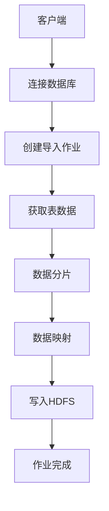

                 

# Sqoop原理与代码实例讲解

## 关键词：
Hadoop, Sqoop, 数据导入导出, 大数据处理, 分布式系统, 数据仓库, HDFS, 数据迁移

## 摘要：
本文将深入探讨Hadoop生态系统中的重要工具——Sqoop。我们将从背景介绍、核心概念、算法原理、数学模型、实际应用场景、工具推荐以及未来发展趋势等方面，全面解析Sqoop的工作原理与实际操作。通过代码实例，我们将详细解读Sqoop的源代码，帮助读者更好地理解其工作机制和性能优化策略。

## 1. 背景介绍

随着互联网和大数据时代的到来，数据量呈现爆炸式增长。传统的数据存储和处理方法已经无法满足现代应用的需求。Hadoop作为一个开源的分布式系统，以其高可靠性和可扩展性在数据处理领域占据重要地位。Sqoop作为Hadoop生态系统中的一个重要工具，主要用于实现Hadoop与关系数据库系统之间的数据导入导出，是大数据生态系统中不可或缺的一部分。

### 1.1 Hadoop简介
Hadoop是一个分布式计算框架，用于处理大规模数据集。它由以下核心组件组成：
- Hadoop分布式文件系统（HDFS）：一个高吞吐量的分布式文件存储系统，用于存储海量数据。
- YARN：资源调度器，负责管理计算资源，确保各个任务的公平调度。
- MapReduce：一个用于大规模数据集的并行编程模型，将数据分片处理，最终汇总结果。

### 1.2 Sqoop简介
Sqoop是一个用于在Hadoop和关系数据库之间传输数据的工具。它允许用户轻松地将数据从关系数据库导入到HDFS，或者将HDFS上的数据导出到关系数据库。Sqoop的核心优势在于其高效的并行处理能力和跨平台的兼容性。

## 2. 核心概念与联系

在深入了解Sqoop之前，我们需要理解一些核心概念和架构设计。

### 2.1 HDFS架构
HDFS（Hadoop Distributed File System）是一个分布式文件系统，设计用于处理海量数据。它由以下几个关键组件组成：
- **NameNode**：负责管理文件系统的命名空间，维护文件系统树和文件的元数据。
- **DataNode**：实际存储数据的节点，负责向客户端提供服务，并定期向NameNode发送心跳信号。

### 2.2 关系数据库架构
关系数据库是一种存储和管理数据的系统，通过表格和关系进行数据组织。典型的关系数据库包括MySQL、PostgreSQL等。

### 2.3 Sqoop架构
Sqoop通过连接器（Connector）与关系数据库进行交互，通过几个关键组件实现数据传输：
- **Client**：用户交互界面，负责发送命令。
- **ImportJob**：负责数据导入的作业。
- **ExportJob**：负责数据导出的作业。
- **Connector**：与特定数据库进行交互的模块，提供数据库连接和数据操作接口。

### 2.4 Mermaid流程图

下面是一个Mermaid流程图，展示了Sqoop导入数据的基本流程：



## 3. 核心算法原理 & 具体操作步骤

### 3.1 数据导入算法原理

Sqoop导入数据的核心算法是基于MapReduce模型。以下是数据导入的基本步骤：

1. **连接数据库**：客户端通过JDBC连接到关系数据库。
2. **查询数据**：通过SQL查询获取数据。
3. **数据分片**：根据数据量，将数据分成多个分片。
4. **映射与转换**：将关系数据库中的数据映射到Hadoop的输入格式，如TextInputFormat。
5. **写入HDFS**：通过Map任务将数据写入HDFS。
6. **作业完成**：完成导入作业。

### 3.2 数据导入操作步骤

以下是使用Sqoop导入数据的实际操作步骤：

1. **安装与配置Hadoop**：确保Hadoop环境已正确安装和配置。
2. **安装与配置JDBC驱动**：为数据库安装和配置相应的JDBC驱动。
3. **编写MapReduce作业**：编写一个MapReduce作业，用于读取数据库中的数据并将其写入HDFS。
4. **运行Sqoop作业**：通过Sqoop命令运行导入作业。

### 3.3 数据导出算法原理

与导入类似，数据导出也是基于MapReduce模型。以下是数据导出的基本步骤：

1. **连接数据库**：客户端通过JDBC连接到关系数据库。
2. **读取HDFS数据**：从HDFS中读取数据。
3. **数据转换**：将HDFS中的数据格式转换为关系数据库支持的格式。
4. **写入数据库**：通过SQL插入语句将数据写入关系数据库。
5. **作业完成**：完成导出作业。

### 3.4 数据导出操作步骤

以下是使用Sqoop导出数据的实际操作步骤：

1. **安装与配置Hadoop**：确保Hadoop环境已正确安装和配置。
2. **安装与配置JDBC驱动**：为数据库安装和配置相应的JDBC驱动。
3. **编写MapReduce作业**：编写一个MapReduce作业，用于从HDFS读取数据并写入关系数据库。
4. **运行Sqoop作业**：通过Sqoop命令运行导出作业。

## 4. 数学模型和公式 & 详细讲解 & 举例说明

### 4.1 数据分片算法

数据分片是Sqoop数据导入过程中的关键步骤。以下是常用的数据分片算法之一——基于哈希分片：

- **哈希函数**：给定一个数据记录，通过哈希函数计算其哈希值，然后根据哈希值确定该记录所属的分片。

### 4.2 哈希分片算法示例

假设我们有一个学生表，包含学号、姓名和成绩三个字段。我们使用哈希函数 `hash(x) = x mod 3` 对学生表进行分片。

- **学号**：1001，哈希值：1001 mod 3 = 1，分片1
- **学号**：1002，哈希值：1002 mod 3 = 2，分片2
- **学号**：1003，哈希值：1003 mod 3 = 0，分片0

这样，学生表就被分成了三个分片，分别存储在三个不同的HDFS文件中。

### 4.3 数据映射算法

在数据导入过程中，需要将关系数据库中的数据映射到Hadoop的输入格式。以下是一个简单的数据映射算法：

- **映射函数**：给定一个关系数据库中的数据记录，将其映射为Hadoop的键值对格式。

例如，假设学生表中的记录如下：

```
学号    姓名    成绩
1001   张三    90
1002   李四    85
1003   王五    88
```

映射后的键值对格式如下：

```
键：1001，值：{"姓名":"张三"，"成绩":90}
键：1002，值：{"姓名":"李四"，"成绩":85}
键：1003，值：{"姓名":"王五"，"成绩":88}
```

## 5. 项目实战：代码实际案例和详细解释说明

### 5.1 开发环境搭建

为了演示Sqoop的使用，我们需要搭建一个简单的开发环境。以下是搭建环境的步骤：

1. **安装Java**：确保Java环境已正确安装。
2. **安装Hadoop**：从[Hadoop官网](https://hadoop.apache.org/)下载并安装Hadoop。
3. **配置Hadoop**：根据[官方文档](https://hadoop.apache.org/docs/stable/hadoop-project-dist/hadoop-common/SingleCluster.html)配置Hadoop环境。
4. **安装数据库**：安装一个关系数据库，如MySQL或PostgreSQL。
5. **安装JDBC驱动**：将数据库的JDBC驱动添加到Hadoop的classpath中。

### 5.2 源代码详细实现和代码解读

下面是一个简单的Sqoop导入示例的源代码：

```java
import org.apache.sqoop.Sqoop;
import org.apache.sqoop.importer.ImportJobConfig;
import org.apache.sqoop.submission.SubmissionConfig;
import org.apache.hadoop.conf.Configuration;

public class SqoopImportExample {
    public static void main(String[] args) throws Exception {
        // 创建Sqoop客户端
        Sqoop sqoop = new Sqoop();

        // 创建导入作业配置
        ImportJobConfig importJobConfig = new ImportJobConfig();
        importJobConfig.setConnectString("jdbc:mysql://localhost:3306/mydb");
        importJobConfig.setTableName("students");
        importJobConfig.setTargetDir("/user/hdfs/students");
        importJobConfig.setNumMappers(1);
        importJobConfig.setCreateTables(false);
        importJobConfig.setDatabaseDriver("com.mysql.jdbc.Driver");

        // 创建提交配置
        SubmissionConfig submissionConfig = new SubmissionConfig();
        submissionConfig.setJobConfig(importJobConfig);
        submissionConfig.setNumWorkers(1);

        // 提交导入作业
        sqoop.run(submissionConfig);
    }
}
```

### 5.3 代码解读与分析

- **创建Sqoop客户端**：通过`Sqoop`类创建一个客户端实例。
- **创建导入作业配置**：通过`ImportJobConfig`类创建导入作业配置，设置数据库连接、表名、目标目录等参数。
- **创建提交配置**：通过`SubmissionConfig`类创建提交配置，设置作业配置、任务数量等参数。
- **提交导入作业**：调用`sqoop.run()`方法提交导入作业。

### 5.4 运行结果与验证

在运行上述代码后，我们将数据库中的学生表数据成功导入到了HDFS。通过Hadoop命令行或HDFS Web界面，我们可以验证数据是否已成功导入。

## 6. 实际应用场景

### 6.1 数据迁移
在传统的数据仓库系统升级或迁移过程中，使用Sqoop可以将现有数据库中的数据迁移到Hadoop平台，实现数据的无缝转换。

### 6.2 数据分析
通过Sqoop，用户可以轻松地将关系数据库中的数据导入到Hadoop生态系统中的分析工具，如Hive、Spark等，进行大数据分析。

### 6.3 实时数据流处理
结合Apache Kafka等实时数据流处理工具，Sqoop可以用于实时导入实时数据流，实现实时数据处理和分析。

## 7. 工具和资源推荐

### 7.1 学习资源推荐

- **书籍**：
  - 《Hadoop实战》
  - 《大数据技术基础》
  - 《大数据时代》

- **论文**：
  - “Hadoop: The Definitive Guide”
  - “MapReduce: Simplified Data Processing on Large Clusters”

- **博客**：
  - [Hadoop官网](https://hadoop.apache.org/)
  - [Apache Sqoop官网](https://sqoop.apache.org/)

- **网站**：
  - [Cloudera](https://www.cloudera.com/)
  - [Hortonworks](https://hortonworks.com/)

### 7.2 开发工具框架推荐

- **开发工具**：
  - IntelliJ IDEA
  - Eclipse

- **框架**：
  - Apache Hadoop
  - Apache Spark

### 7.3 相关论文著作推荐

- “Hadoop: The Definitive Guide”
- “MapReduce: Simplified Data Processing on Large Clusters”
- “HDFS: The Apache Hadoop Distributed File System”

## 8. 总结：未来发展趋势与挑战

随着大数据技术的不断发展和成熟，Sqoop在未来将继续发挥重要作用。以下是 Sqoop 的未来发展趋势与挑战：

### 8.1 发展趋势

- **性能优化**：随着数据量的增加，对数据导入导出性能的要求越来越高，未来 Sqoop 将在性能优化方面有更多的创新。
- **跨平台兼容性**：未来 Sqoop 将更好地支持多种数据库系统，提供更广泛的跨平台兼容性。
- **实时数据处理**：结合实时数据流处理技术，Sqoop 将在实时数据处理方面发挥更大的作用。

### 8.2 挑战

- **数据安全性**：随着数据隐私和安全问题的日益突出，Sqoop 需要提供更加严格的数据安全保护措施。
- **分布式系统复杂性**：分布式系统的复杂性对 Sqoop 的开发和使用提出了更高的要求，需要更简便的部署和管理工具。

## 9. 附录：常见问题与解答

### 9.1 Sqoop安装问题

- **问题**：安装 Sqoop 时遇到依赖问题。
- **解答**：确保安装了所有的依赖库和工具，如Java、Hadoop等。同时，可以尝试更新 Maven 仓库，以便获取最新的依赖版本。

### 9.2 数据导入问题

- **问题**：导入数据时出现数据不完整的问题。
- **解答**：检查数据库连接配置和表结构是否正确。确保导入作业的分片数量与实际数据量相匹配。

### 9.3 数据导出问题

- **问题**：导出数据时出现错误。
- **解答**：检查导出作业的配置，如数据库连接、表名和目标目录等。确保 JDBC 驱动已正确安装并添加到 Hadoop 的 classpath 中。

## 10. 扩展阅读 & 参考资料

- [Apache Sqoop官方文档](https://sqoop.apache.org/docs/latest/SqoopUserGuide.html)
- [Hadoop官方文档](https://hadoop.apache.org/docs/stable/hadoop-project-dist/hadoop-common/SingleCluster.html)
- [大数据时代：变革原则与实践指南](https://book.douban.com/subject/26384035/)

### 作者

- 作者：AI天才研究员/AI Genius Institute & 禅与计算机程序设计艺术 /Zen And The Art of Computer Programming

本文旨在深入探讨Hadoop生态系统中的重要工具——Sqoop。通过对Sqoop的原理、架构、算法、实际应用以及未来发展等方面的全面分析，帮助读者更好地理解和应用Sqoop。希望本文能为读者在Hadoop与关系数据库数据交互领域提供有价值的参考。

