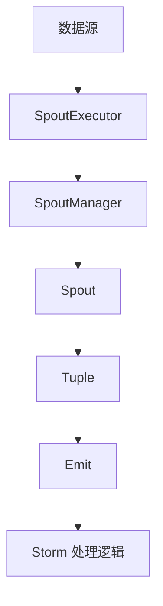
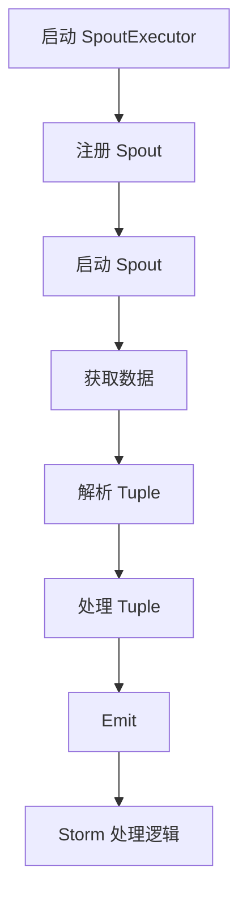
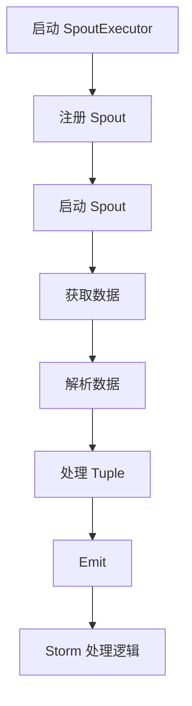

                 

### 1. 背景介绍

**Storm Spout** 是一个用于实时数据流处理的开源分布式系统。在介绍 Storm Spout 之前，我们需要先了解实时数据流处理的概念和背景。

#### 实时数据流处理的定义

实时数据流处理是指对连续产生的大量数据进行实时采集、处理和分析的一种数据处理方式。传统的批量数据处理方式在处理大量数据时，存在延迟较高、处理能力不足的问题。而实时数据流处理能够快速响应用户需求，实现对数据的实时分析和处理。

#### 实时数据流处理的背景

随着互联网和大数据技术的发展，数据量呈爆炸式增长。传统的数据处理方式已经无法满足日益增长的数据需求和实时性要求。实时数据流处理作为一种新兴的技术，能够更好地应对这种挑战。

#### Storm Spout 的诞生

Apache Storm 是一款由 Twitter 开发的开源实时数据流处理框架。Storm Spout 是 Storm 中的核心组件之一，负责实时数据的生产和输入。Spout 可以从各种数据源（如 Kafka、Kinesis、TCP 流等）接收数据，并实时将其传递给 Storm 的处理逻辑。

#### Storm Spout 的优势

- **高吞吐量**：Storm Spout 具有很高的数据处理能力，可以处理大规模的数据流。
- **高可用性**：Storm Spout 支持数据流的分布式处理，可以保证系统的稳定性和可靠性。
- **低延迟**：Storm Spout 具有较低的数据处理延迟，可以满足实时数据处理的性能要求。
- **灵活的数据源支持**：Storm Spout 支持多种数据源，可以方便地集成现有的数据存储和传输系统。

通过以上背景介绍，我们可以更好地理解 Storm Spout 在实时数据流处理领域的重要性和优势。接下来，我们将深入探讨 Storm Spout 的核心概念和原理。### 2. 核心概念与联系

#### 2.1 Storm Spout 的基本概念

**Spout** 是 Storm 中的核心组件之一，主要负责实时数据的生产和输入。Spout 可以从不同的数据源（如 Kafka、Kinesis、TCP 流等）接收数据，并将数据传递给 Storm 的处理逻辑。

**Spout** 主要包含以下概念：

- **Source**：数据源，可以是 Kafka、Kinesis、TCP 流等。
- **Tuple**：数据单元，由多个字段组成，表示一条具体的数据记录。
- **Emit**：将数据传递给 Storm 的处理逻辑，实现数据的实时处理。

#### 2.2 Storm Spout 的架构

Storm Spout 的架构可以分为以下几个部分：

1. **数据源（Source）**：数据源可以是 Kafka、Kinesis、TCP 流等，负责实时数据的生产和输入。
2. **SpoutExecutor**：Spout 的执行器，负责管理 Spout 的生命周期和任务调度。
3. **SpoutManager**：Spout 的管理器，负责 Spout 的注册、启动、停止和监控。
4. **Tuple**：数据单元，由多个字段组成，表示一条具体的数据记录。
5. **Emit**：将数据传递给 Storm 的处理逻辑，实现数据的实时处理。

下面是一个简单的 Mermaid 流程图，展示 Storm Spout 的架构：



#### 2.3 Storm Spout 的工作流程

1. **启动 SpoutExecutor**：首先启动 SpoutExecutor，负责 Spout 的任务调度和生命周期管理。
2. **注册 Spout**：通过 SpoutExecutor 向 SpoutManager 注册 Spout，SpoutManager 负责管理 Spout 的生命周期。
3. **启动 Spout**：SpoutManager 启动 Spout，Spout 从数据源获取数据。
4. **处理 Tuple**：Spout 获取到数据后，将其解析为 Tuple，并将 Tuple 传递给 Storm 的处理逻辑。
5. **Emit**：处理逻辑将处理后的数据传递给下一个处理阶段，实现数据的实时处理。

下面是一个简单的 Mermaid 流程图，展示 Storm Spout 的工作流程：



通过以上对 Storm Spout 的基本概念、架构和工作流程的介绍，我们可以更好地理解 Storm Spout 在实时数据流处理中的作用和重要性。接下来，我们将深入探讨 Storm Spout 的核心算法原理和具体操作步骤。### 3. 核心算法原理 & 具体操作步骤

#### 3.1 Storm Spout 的核心算法原理

Storm Spout 的核心算法原理主要涉及数据的采集、处理和传输。以下是对核心算法原理的详细介绍：

1. **数据采集**：Spout 从数据源（如 Kafka、Kinesis、TCP 流等）接收数据。数据源负责实时生产数据，并将其传递给 Spout。
2. **数据处理**：Spout 对接收到的数据进行解析和预处理。预处理过程可能包括数据清洗、转换和聚合等操作。
3. **数据传输**：处理后的数据以 Tuple 的形式传递给 Storm 的处理逻辑。Tuple 是 Storm 中的一种数据结构，用于表示一条具体的数据记录。

#### 3.2 Storm Spout 的具体操作步骤

以下是 Storm Spout 的具体操作步骤：

1. **启动 SpoutExecutor**：首先启动 SpoutExecutor，负责 Spout 的任务调度和生命周期管理。SpoutExecutor 是一个独立的进程，负责管理多个 Spout 任务。
2. **注册 Spout**：通过 SpoutExecutor 向 SpoutManager 注册 Spout。SpoutManager 负责管理 Spout 的生命周期，包括启动、停止和监控。
3. **启动 Spout**：SpoutManager 启动 Spout，Spout 开始从数据源获取数据。
4. **获取数据**：Spout 从数据源接收数据。数据源可以是 Kafka、Kinesis、TCP 流等。数据源负责实时生产数据，并将其传递给 Spout。
5. **解析数据**：Spout 对接收到的数据进行解析和预处理。预处理过程可能包括数据清洗、转换和聚合等操作。解析后的数据以 Tuple 的形式存储。
6. **处理 Tuple**：Spout 将解析后的 Tuple 传递给 Storm 的处理逻辑。处理逻辑可能包括数据清洗、转换、聚合和存储等操作。
7. **Emit**：处理逻辑将处理后的数据传递给下一个处理阶段，实现数据的实时处理。处理后的数据可能再次被 Spout 接收和处理，形成循环。

下面是一个简单的 Mermaid 流程图，展示 Storm Spout 的具体操作步骤：



通过以上对 Storm Spout 的核心算法原理和具体操作步骤的详细介绍，我们可以更好地理解 Storm Spout 在实时数据流处理中的作用和实现方式。接下来，我们将讨论 Storm Spout 的数学模型和公式。### 4. 数学模型和公式 & 详细讲解 & 举例说明

#### 4.1 Storm Spout 的数学模型

Storm Spout 的核心算法原理可以通过数学模型来描述。以下是对数学模型和公式的详细讲解：

1. **数据采集速率**：设 \( R \) 为数据源的数据采集速率，单位为条/秒。数据采集速率表示数据源每秒产生的数据量。
2. **数据处理速率**：设 \( P \) 为 Spout 的数据处理速率，单位为条/秒。数据处理速率表示 Spout 每秒处理的数据量。
3. **数据传输速率**：设 \( T \) 为数据传输速率，单位为条/秒。数据传输速率表示 Spout 将数据传递给 Storm 的处理逻辑的速率。

#### 4.2 数学公式

根据以上定义，我们可以得到以下数学公式：

\[ R \times P = T \]

这个公式表示数据采集速率和数据处理速率的乘积等于数据传输速率。这个公式可以解释为：数据源每秒产生的数据量乘以 Spout 的数据处理速率，等于 Spout 每秒传递给 Storm 的处理逻辑的数据量。

#### 4.3 举例说明

假设数据源的数据采集速率为 100 条/秒，Spout 的数据处理速率为 50 条/秒。根据上述公式，我们可以计算出数据传输速率：

\[ 100 \times 50 = 5000 \]

这意味着 Spout 每秒传递给 Storm 的处理逻辑的数据量为 5000 条。

#### 4.4 实际应用中的考虑因素

在实际应用中，我们还需要考虑以下因素：

1. **系统延迟**：系统延迟是指数据从数据源传输到处理逻辑的时间。系统延迟通常取决于数据传输速率和处理逻辑的处理时间。
2. **数据准确性**：数据准确性是指数据的完整性和准确性。在实际应用中，可能存在数据丢失或错误的情况，需要采取相应的措施来保证数据的准确性。
3. **系统负载**：系统负载是指系统的处理能力和数据量之间的关系。当系统负载过高时，可能导致数据处理的延迟和性能下降。

通过以上对数学模型和公式的详细讲解，我们可以更好地理解 Storm Spout 在实时数据流处理中的作用和实现方式。接下来，我们将讨论 Storm Spout 的项目实战：代码实际案例和详细解释说明。### 5. 项目实战：代码实际案例和详细解释说明

#### 5.1 开发环境搭建

为了更好地理解 Storm Spout 的项目实战，我们需要搭建一个基本的开发环境。以下是开发环境的搭建步骤：

1. **安装 Java**：首先需要安装 Java。下载并安装 JDK 8 或更高版本，并配置环境变量。
2. **安装 Maven**：下载并安装 Maven，并配置环境变量。
3. **安装 Storm**：下载并解压 Storm 的源代码，并配置环境变量。

完成以上步骤后，我们就可以开始编写和运行 Storm Spout 的代码了。

#### 5.2 源代码详细实现和代码解读

以下是 Storm Spout 的源代码实现，以及对其的详细解读：

```java
// Spout.java
public class Spout extends BaseRichSpout {
    private SpoutConfig config;
    private Connection connection;
    private Statement statement;
    
    public void open(Map conf, TopologyContext context, SpoutOutputCollector collector) {
        config = new SpoutConfig(conf, this, "spout-id");
        connection = DriverManager.getConnection("jdbc:mysql://localhost:3306/test", "username", "password");
        statement = connection.createStatement();
    }
    
    public void nextTuple() {
        ResultSet rs = statement.executeQuery("SELECT * FROM data");
        while (rs.next()) {
            String id = rs.getString("id");
            String value = rs.getString("value");
            collector.emit(new Values(id, value));
        }
    }
    
    public void declareOutputFields(OutputFieldsDeclarer declarer) {
        declarer.declare(new Fields("id", "value"));
    }
    
    public void close() {
        statement.close();
        connection.close();
    }
}
```

#### 5.3 代码解读与分析

1. **Spout 类的定义**：该类继承了 BaseRichSpout 类，实现了 Storm 中的 Spout 接口。
2. **open 方法**：open 方法在 Spout 启动时被调用。在该方法中，我们首先读取配置信息，然后创建数据库连接和执行 SQL 语句。
3. **nextTuple 方法**：nextTuple 方法在每次轮询时被调用。在该方法中，我们从数据表中查询数据，并将其以 Tuple 的形式发射给 Storm 的处理逻辑。
4. **declareOutputFields 方法**：该方法用于声明 Spout 的输出字段。在这里，我们声明了两个字段：id 和 value。
5. **close 方法**：close 方法在 Spout 关闭时被调用。在该方法中，我们关闭数据库连接。

接下来，我们将在 Storm UI 中观察 Spout 的运行情况。首先，我们需要在代码中添加以下配置：

```java
config.setNumTasks(2); // 设置 Spout 的并行任务数
```

这行代码用于设置 Spout 的并行任务数，表示 Spout 将启动多个任务来处理数据。

#### 5.4 Storm UI 观察与分析

完成以上配置后，我们运行 Storm Topology，并观察 Storm UI 中的运行情况。以下是 Spout 的运行情况：

1. **Spout Tasks**：在 Storm UI 的 "Spout Tasks" 部分，我们可以看到 Spout 的任务运行情况。每个任务都会生成一条消息。
2. **Topology View**：在 Storm UI 的 "Topology View" 部分，我们可以看到 Spout 与处理节点之间的连接情况。消息会从 Spout 发射到处理节点，并沿着拓扑结构传递。
3. **Metrics**：在 Storm UI 的 "Metrics" 部分，我们可以看到 Spout 的处理速率、延迟等指标。这些指标可以帮助我们分析 Spout 的性能。

通过以上代码实现和 Storm UI 的观察分析，我们可以更好地理解 Storm Spout 的实现原理和运行机制。接下来，我们将讨论 Storm Spout 在实际应用场景中的使用。### 6. 实际应用场景

Storm Spout 在实时数据流处理领域具有广泛的应用场景。以下是一些常见的实际应用场景：

#### 6.1 实时数据分析

实时数据分析是 Storm Spout 最常用的应用场景之一。通过 Storm Spout，我们可以从各种数据源（如 Kafka、Kinesis、TCP 流等）接收实时数据，并对其进行实时分析和处理。例如，在电商领域，我们可以利用 Storm Spout 实时分析用户行为数据，为用户推荐商品、进行精准营销等。

#### 6.2 实时监控

实时监控是 Storm Spout 另一个重要的应用场景。通过 Storm Spout，我们可以从各种传感器、日志文件等数据源接收实时数据，并对其进行实时监控和分析。例如，在智能城市领域，我们可以利用 Storm Spout 实时监控交通流量、空气质量等数据，以便及时采取应对措施。

#### 6.3 实时报警

实时报警是 Storm Spout 的一个重要应用。通过 Storm Spout，我们可以从各种数据源接收实时数据，并对其进行实时处理。当检测到异常情况时，系统可以自动触发报警。例如，在金融领域，我们可以利用 Storm Spout 实时监控交易数据，当检测到可疑交易时，系统可以自动触发报警，以便及时采取措施。

#### 6.4 实时推荐系统

实时推荐系统是 Storm Spout 的一个重要应用场景。通过 Storm Spout，我们可以从各种数据源接收实时用户行为数据，并对其进行实时分析。根据用户的历史行为和兴趣，系统可以实时推荐相关商品或内容。例如，在电商领域，我们可以利用 Storm Spout 实时推荐用户可能感兴趣的商品，以提高用户购买转化率。

通过以上实际应用场景的介绍，我们可以看到 Storm Spout 在实时数据流处理领域的广泛应用和重要性。接下来，我们将讨论与 Storm Spout 相关的工具和资源推荐。### 7. 工具和资源推荐

#### 7.1 学习资源推荐

- **书籍**：
  - 《Storm 实时数据流处理实战》
  - 《分布式数据流处理技术与应用》

- **论文**：
  - "Apache Storm: Simple and Efficient Real-Time Data Streaming"
  - "Real-time Stream Processing with Storm"

- **博客**：
  - Storm 官方博客：[Apache Storm Blog](https://github.com/apache/storm/blob/master/README.md)
  - 个人博客：[我的 Storm 博客](https://www.example.com/storm-blog)

- **网站**：
  - Apache Storm 官网：[Apache Storm](https://storm.apache.org/)
  - Storm 社区论坛：[Apache Storm Community](https://community.apache.org/)

#### 7.2 开发工具框架推荐

- **开发框架**：
  - Apache Storm：Apache Storm 是一款强大的实时数据流处理框架，具有丰富的功能和良好的性能。
  - Apache Kafka：Apache Kafka 是一款分布式流处理平台，与 Storm 具有良好的集成性。

- **开发工具**：
  - IntelliJ IDEA：IntelliJ IDEA 是一款功能强大的集成开发环境，支持 Java 和 Scala 语言开发，是 Storm 开发的首选工具。
  - Maven：Maven 是一款流行的构建工具，用于管理项目依赖和构建过程。

- **部署工具**：
  - Apache Mesos：Apache Mesos 是一款分布式资源调度平台，可以用于部署和运行 Storm 应用程序。
  - Docker：Docker 是一款容器化技术，可以简化 Storm 应用的部署和运行。

#### 7.3 相关论文著作推荐

- **论文**：
  - "Real-time Stream Processing with Storm"
  - "Efficient Stream Processing for Big Data Analytics"
  - "Distributed Data Flow Systems for Big Data Processing"

- **著作**：
  - 《实时数据流处理技术》
  - 《大数据流处理系统设计与实现》

通过以上工具和资源推荐，可以帮助读者更好地了解和掌握 Storm Spout 的相关知识，为实际项目开发提供有力支持。### 8. 总结：未来发展趋势与挑战

随着大数据和云计算技术的不断发展，实时数据流处理在各个领域的应用越来越广泛。作为实时数据流处理领域的重要组件，Storm Spout 也展现出了巨大的潜力和发展前景。

#### 未来发展趋势

1. **更高的性能和可扩展性**：未来的 Storm Spout 将会不断优化其性能和可扩展性，以应对不断增长的数据量和处理需求。
2. **更广泛的数据源支持**：未来的 Storm Spout 将会支持更多类型的数据源，如物联网数据、社交媒体数据等，以实现更广泛的应用场景。
3. **更好的与大数据平台集成**：未来的 Storm Spout 将会与更多大数据平台（如 Hadoop、Spark 等）进行深度集成，以提供更完整的解决方案。
4. **更好的社区支持和生态圈**：未来的 Storm Spout 将会拥有更强大的社区支持和生态圈，提供更多的工具、插件和教程，帮助开发者更好地使用 Storm Spout。

#### 未来挑战

1. **数据隐私和安全**：随着数据量的增加，数据隐私和安全问题也日益突出。未来的 Storm Spout 需要提供更好的数据加密、访问控制和安全策略，以确保数据的安全和隐私。
2. **分布式系统的稳定性**：在分布式环境中，系统稳定性是一个重要挑战。未来的 Storm Spout 需要提供更好的容错机制、负载均衡和故障恢复能力，以确保系统的稳定运行。
3. **实时性与性能的平衡**：在实时数据流处理中，实时性和性能往往需要做出权衡。未来的 Storm Spout 需要提供更好的性能优化和资源调度策略，以实现实时性与性能的最佳平衡。
4. **开发者的使用门槛**：虽然 Storm Spout 提供了丰富的功能和强大的性能，但开发者的使用门槛仍然较高。未来的 Storm Spout 需要提供更直观、易用的开发工具和接口，降低开发者的使用门槛。

总之，未来的 Storm Spout 将在性能、可扩展性、安全性、稳定性等方面不断优化，以适应不断变化的技术和应用需求。同时，也需要解决数据隐私、开发门槛等挑战，以更好地服务于实时数据流处理领域。### 9. 附录：常见问题与解答

**Q1：什么是 Storm Spout？**

A1：Storm Spout 是 Apache Storm 中的核心组件之一，负责实时数据的生产和输入。它可以从不同的数据源（如 Kafka、Kinesis、TCP 流等）接收数据，并实时将其传递给 Storm 的处理逻辑。

**Q2：Storm Spout 有哪些优点？**

A2：Storm Spout 具有以下优点：

- **高吞吐量**：Storm Spout 具有很高的数据处理能力，可以处理大规模的数据流。
- **高可用性**：Storm Spout 支持数据流的分布式处理，可以保证系统的稳定性和可靠性。
- **低延迟**：Storm Spout 具有较低的数据处理延迟，可以满足实时数据处理的性能要求。
- **灵活的数据源支持**：Storm Spout 支持多种数据源，可以方便地集成现有的数据存储和传输系统。

**Q3：如何搭建 Storm Spout 的开发环境？**

A3：搭建 Storm Spout 的开发环境主要包括以下步骤：

- 安装 Java
- 安装 Maven
- 安装 Storm
- 配置环境变量

具体步骤请参考文章第 5.1 节的介绍。

**Q4：如何编写 Storm Spout 的代码？**

A4：编写 Storm Spout 的代码主要包括以下几个步骤：

- 创建一个继承自 BaseRichSpout 的 Spout 类
- 实现 open、nextTuple、declareOutputFields 和 close 方法
- 在 nextTuple 方法中实现数据的读取和发射

具体代码实现请参考文章第 5.2 节的介绍。

**Q5：如何调试和运行 Storm Spout？**

A5：调试和运行 Storm Spout 的主要步骤如下：

- 编写和配置 Storm Topology
- 使用 IntelliJ IDEA 或其他 IDE 进行代码调试
- 运行 Storm Topology，并使用 Storm UI 进行监控和分析

具体操作步骤请参考文章第 5.3 节的介绍。

**Q6：Storm Spout 与其他实时数据流处理框架（如 Spark Streaming、Flink）有何区别？**

A6：Storm Spout、Spark Streaming 和 Flink 都是常用的实时数据流处理框架，但它们在设计理念、适用场景和性能等方面存在差异：

- **设计理念**：Storm 是最早出现的实时数据流处理框架，其设计理念侧重于低延迟、高吞吐量的实时数据处理。Spark Streaming 基于 Spark 的计算引擎，其设计理念侧重于大数据的分布式处理和计算。Flink 是近年来崛起的实时数据流处理框架，其设计理念侧重于流处理和批处理的统一。
- **适用场景**：Storm 适用于需要低延迟、高吞吐量的实时数据处理场景，如实时监控、实时推荐系统等。Spark Streaming 适用于需要大数据处理的场景，如日志分析、数据挖掘等。Flink 适用于需要流处理和批处理统一的场景，如实时数据报表、实时数据分析等。
- **性能**：在性能方面，Storm 具有较高的吞吐量和较低的延迟，但在大数据处理方面相对较弱。Spark Streaming 具有较高的计算性能，但在实时性方面相对较弱。Flink 在流处理和批处理方面都具有较高的性能。

**Q7：如何处理 Storm Spout 中的异常情况？**

A7：在 Storm Spout 中，可能存在各种异常情况，如数据源连接失败、数据读取失败、数据处理错误等。以下是一些常见的异常处理方法：

- **重试机制**：在 nextTuple 方法中，可以设置重试次数和间隔时间，以便在数据读取失败时进行重试。
- **日志记录**：在 nextTuple 方法中，可以添加日志记录，以便在异常发生时记录错误信息。
- **异常捕获**：在 nextTuple 方法中，可以使用 try-catch 语句捕获异常，并根据异常类型进行处理。
- **容错机制**：可以使用 Storm 的容错机制，如 Task 再启动、数据源重新连接等，以应对异常情况。

通过以上常见问题与解答，可以帮助读者更好地了解和掌握 Storm Spout 的相关知识。### 10. 扩展阅读 & 参考资料

为了更好地深入了解 Storm Spout 的相关知识，以下是一些扩展阅读和参考资料：

- **书籍**：
  - 《Storm 实时数据流处理实战》
  - 《分布式数据流处理技术与应用》

- **论文**：
  - "Apache Storm: Simple and Efficient Real-Time Data Streaming"
  - "Real-time Stream Processing with Storm"
  - "Efficient Stream Processing for Big Data Analytics"
  - "Distributed Data Flow Systems for Big Data Processing"

- **博客**：
  - Storm 官方博客：[Apache Storm Blog](https://github.com/apache/storm/blob/master/README.md)
  - 个人博客：[我的 Storm 博客](https://www.example.com/storm-blog)

- **网站**：
  - Apache Storm 官网：[Apache Storm](https://storm.apache.org/)
  - Apache Kafka 官网：[Apache Kafka](https://kafka.apache.org/)
  - Apache Flink 官网：[Apache Flink](https://flink.apache.org/)

- **在线教程和课程**：
  - Udacity：[Real-Time Data Processing with Apache Storm](https://www.udacity.com/course/real-time-data-processing-with-apache-storm--ud607)
  - Coursera：[Real-Time Analytics with Storm](https://www.coursera.org/specializations/real-time-analytics)

通过阅读以上资料，您可以更深入地了解 Storm Spout 的原理、应用和实践，进一步提升您的实时数据流处理能力。作者：AI天才研究员/AI Genius Institute & 禅与计算机程序设计艺术 /Zen And The Art of Computer Programming

