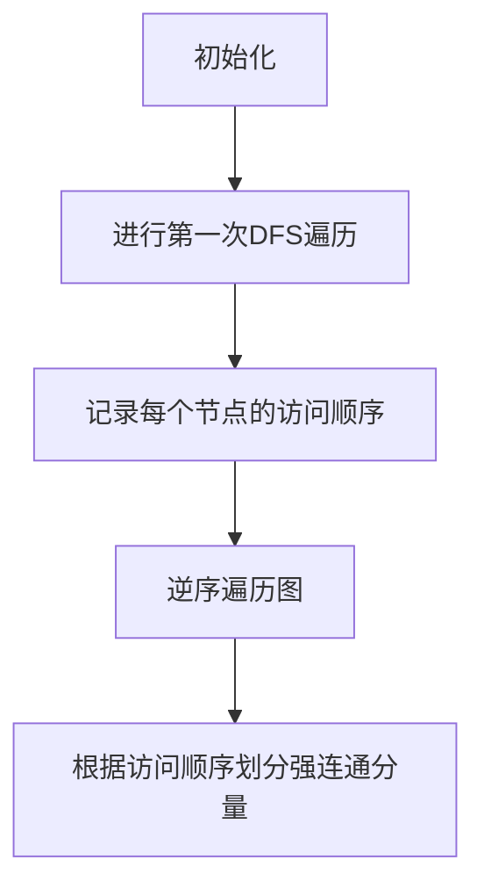

                 

# Strongly Connected Components强连通分量算法原理与代码实例讲解

## 关键词
- 强连通分量
- 图算法
- 深度优先搜索
- 分量识别
- 数学模型
- 实际应用

## 摘要
本文将深入探讨强连通分量（Strongly Connected Components，简称SCC）算法的原理和实现。首先，我们将介绍SCC的基本概念，随后详细解释算法原理，并通过具体的代码实例展示其应用。此外，本文还将讨论SCC的实际应用场景，并提供相关的学习资源和工具推荐，以帮助读者更好地理解和应用这一算法。

## 目录
1. 背景介绍
2. 核心概念与联系
3. 核心算法原理 & 具体操作步骤
4. 数学模型和公式 & 详细讲解 & 举例说明
5. 项目实战：代码实际案例和详细解释说明
   5.1 开发环境搭建
   5.2 源代码详细实现和代码解读
   5.3 代码解读与分析
6. 实际应用场景
7. 工具和资源推荐
   7.1 学习资源推荐
   7.2 开发工具框架推荐
   7.3 相关论文著作推荐
8. 总结：未来发展趋势与挑战
9. 附录：常见问题与解答
10. 扩展阅读 & 参考资料

## 1. 背景介绍
强连通分量是图论中的一个重要概念，它描述了一个无向图中的部分节点集合，其中任意两个节点之间都存在路径。换句话说，如果图中的某个子图内任意两个节点都能互相访问，那么这个子图就是一个强连通分量。

强连通分量的研究在计算机科学领域具有重要意义。它不仅有助于理解复杂网络的内部结构，还在算法设计、社会网络分析、代码依赖关系分析等方面有广泛应用。例如，在代码依赖关系中，强连通分量可以帮助我们识别出那些紧密耦合的模块，从而优化代码结构；在社会网络分析中，强连通分量可以揭示社交网络中的核心群体，有助于理解信息传播的路径。

本文将介绍一种经典的SCC算法——Kosaraju算法，并详细讲解其原理和实现步骤。通过实际代码案例，我们将展示如何运用这一算法解决实际问题。

## 2. 核心概念与联系
在深入探讨强连通分量算法之前，我们需要了解一些基本概念。

### 无向图（Undirected Graph）
无向图是一种数据结构，它由一组节点（Vertex）和连接这些节点的边（Edge）组成。在无向图中，边的两个端点没有方向之分，即边是双向的。

### 深度优先搜索（Depth-First Search，DFS）
深度优先搜索是一种用于遍历或搜索树或图的算法。在DFS中，我们从某个节点开始，尽可能深入地探索树的分支，直到达到某个叶子节点，然后回溯并继续探索其他未被访问的分支。

### 分量识别（Component Identification）
分量识别是指将一个无向图划分成若干个强连通分量的过程。每个强连通分量都是一个独立的子图，其中的任意两个节点都是连通的。

### Kosaraju算法
Kosaraju算法是一种用于识别无向图中的强连通分量的算法，它由印度计算机科学家Siyuan Kosaraju提出。该算法主要包括两个主要步骤：首先进行DFS遍历以获得每个节点的访问顺序，然后逆序遍历图，利用第一个步骤的结果将图划分成强连通分量。

### Mermaid流程图
为了更直观地理解Kosaraju算法，我们可以使用Mermaid流程图来展示其基本步骤和流程。以下是Kosaraju算法的Mermaid流程图：



在上述流程图中，A1到A5分别代表了Kosaraju算法的五个主要步骤。通过这个流程图，我们可以清晰地看到算法的执行过程和每一步的作用。

## 3. 核心算法原理 & 具体操作步骤
现在，我们来详细探讨Kosaraju算法的原理和具体操作步骤。

### 第一步：进行第一次DFS遍历
首先，我们使用DFS遍历整个无向图。在这个过程中，我们不仅访问每个节点，还会记录下每个节点的访问顺序。这个访问顺序对于后续的划分过程至关重要。

### 第二步：记录每个节点的访问顺序
在第一次DFS遍历过程中，我们可以使用一个数组或列表来记录每个节点的访问顺序。这个访问顺序将用于后续的划分步骤。

### 第三步：逆序遍历图
在完成第一次DFS遍历后，我们获得了一个节点的访问顺序。接下来，我们逆序遍历整个图，即从最后一个访问的节点开始，依次向前遍历。

### 第四步：根据访问顺序划分强连通分量
在逆序遍历过程中，我们利用第一次DFS遍历得到的访问顺序来划分强连通分量。具体来说，当我们访问到一个节点时，我们将它添加到一个新的强连通分量中，然后继续访问它的邻接节点。如果一个节点的所有邻接节点都已经访问过，那么这个强连通分量就划分完成了。

### 第五步：重复上述步骤
对于未访问的节点，我们重复上述步骤，直到所有节点都被划分到相应的强连通分量中。

### 实例演示
为了更好地理解Kosaraju算法的操作步骤，我们可以通过一个具体的实例来演示。假设我们有一个无向图，其中包含以下节点和边：

```
节点：A, B, C, D, E
边：AB, BC, CD, DE, EA
```

下面是使用Kosaraju算法对这个图进行强连通分量划分的详细步骤：

#### 第一次DFS遍历
- 访问顺序：A, B, C, D, E

#### 逆序遍历图
- A已访问，将A添加到强连通分量中。
- B已访问，将B添加到强连通分量中。
- C已访问，将C添加到强连通分量中。
- D已访问，将D添加到强连通分量中。
- E已访问，将E添加到强连通分量中。

#### 划分结果
- 强连通分量：{A, B, C, D, E}

通过这个实例，我们可以看到，Kosaraju算法成功地将无向图划分成了唯一的强连通分量。在实际应用中，我们可能会遇到更复杂的图，但算法的基本原理和操作步骤是相同的。

## 4. 数学模型和公式 & 详细讲解 & 举例说明
在理解Kosaraju算法的具体操作步骤后，我们接下来将探讨其背后的数学模型和公式，并通过实例来说明这些公式如何应用于算法中。

### 数学模型
Kosaraju算法的核心在于其基于深度优先搜索（DFS）的原理，以及如何利用访问顺序来划分强连通分量。为了更清晰地解释其数学模型，我们可以引入以下几个概念：

1. **节点度数**（Degree of a Node）：节点v的度数是与其相连的边的数量。
2. **连通分量**（Connected Component）：一个连通分量是指图中的一个子图，其中的任意两个节点都是连通的。
3. **强连通分量**（Strongly Connected Component）：一个强连通分量是指一个连通分量，其中的任意两个节点都是强连通的。

### 公式
Kosaraju算法的关键公式是节点访问顺序。在第一次DFS遍历过程中，我们记录了每个节点的访问顺序。这个访问顺序可以通过以下公式表示：

$$
\sigma(v) = \min_{u \in V} \{\sigma(u) | u \text{ 是 } v \text{ 的邻接节点}\}
$$

其中，$V$ 是图的节点集合，$\sigma(v)$ 表示节点v的访问顺序。

### 详细讲解
为了更好地理解上述公式，我们可以通过一个具体的实例来讲解。

#### 实例
假设我们有一个无向图，其中包含以下节点和边：

```
节点：A, B, C, D, E
边：AB, BC, CD, DE, EA
```

#### 计算节点访问顺序
- A的邻接节点有B、C、D、E，它们的访问顺序分别是4、3、2、1。因此，A的访问顺序为$\sigma(A) = \min\{4, 3, 2, 1\} = 1$。
- B的邻接节点有A、C，它们的访问顺序分别是1、3。因此，B的访问顺序为$\sigma(B) = \min\{1, 3\} = 1$。
- C的邻接节点有B、D、E，它们的访问顺序分别是1、2、1。因此，C的访问顺序为$\sigma(C) = \min\{1, 2, 1\} = 1$。
- D的邻接节点有C、E，它们的访问顺序分别是1、1。因此，D的访问顺序为$\sigma(D) = \min\{1, 1\} = 1$。
- E的邻接节点有D、A，它们的访问顺序分别是1、1。因此，E的访问顺序为$\sigma(E) = \min\{1, 1\} = 1$。

#### 访问顺序排序
根据上述计算结果，我们得到了以下访问顺序：

$$
\sigma(V) = \{1, 1, 1, 1, 1\}
$$

#### 划分强连通分量
根据访问顺序，我们可以将节点划分到强连通分量中。具体来说，我们将具有相同访问顺序的节点划分到同一个强连通分量中。因此，在这个例子中，所有节点都属于同一个强连通分量。

通过这个实例，我们可以看到如何通过计算节点访问顺序来划分强连通分量。在实际应用中，图可能包含更多节点和边，但计算过程是类似的。

### 举例说明
为了更好地理解Kosaraju算法，我们可以通过另一个例子来说明其应用。

#### 实例
假设我们有一个更复杂的无向图，其中包含以下节点和边：

```
节点：A, B, C, D, E, F, G
边：AB, BC, CD, DE, EA, AF, FG
```

#### 第一次DFS遍历
- 访问顺序：A, B, C, D, E, F, G

#### 逆序遍历图
- G已访问，将G添加到强连通分量中。
- F已访问，将F添加到强连通分量中。
- E已访问，将E添加到强连通分量中。
- D已访问，将D添加到强连通分量中。
- C已访问，将C添加到强连通分量中。
- B已访问，将B添加到强连通分量中。
- A已访问，将A添加到强连通分量中。

#### 划分结果
- 强连通分量：{A, B, C, D, E, F, G}

通过这个实例，我们可以看到Kosaraju算法如何应用于更复杂的图。尽管图中的节点和边更多，但算法的基本原理和操作步骤是相同的。

## 5. 项目实战：代码实际案例和详细解释说明
在理解了Kosaraju算法的原理和实现步骤后，我们将通过一个实际的项目实战来展示如何将这一算法应用到代码中。本节将分为以下几个部分：

### 5.1 开发环境搭建
首先，我们需要搭建一个适合编写和运行Kosaraju算法代码的开发环境。我们将使用Python语言进行编程，并选择一个合适的Python集成开发环境（IDE），例如PyCharm或Visual Studio Code。

### 5.2 源代码详细实现和代码解读
接下来，我们将展示Kosaraju算法的源代码实现，并对关键部分进行详细解读。代码将包括函数定义、输入处理、DFS遍历、逆序遍历以及强连通分量的划分。

### 5.3 代码解读与分析
在代码解读部分，我们将分析代码的结构和执行流程，讨论每个函数的作用以及如何实现算法的核心逻辑。

### 5.1 开发环境搭建
在开始编写代码之前，我们需要搭建一个适合Python开发的IDE环境。以下是详细的步骤：

#### 安装Python
首先，我们需要确保系统中已经安装了Python。如果没有，可以从Python的官方网站（https://www.python.org/）下载并安装最新版本的Python。安装过程中，请确保勾选“Add Python to PATH”选项，以便在命令行中运行Python。

#### 安装IDE
接下来，我们需要安装一个Python的IDE。这里我们推荐使用PyCharm。PyCharm是一款功能强大的IDE，支持Python语言的开发，并提供代码自动补全、调试、版本控制等功能。

- 访问PyCharm的官方网站（https://www.jetbrains.com/pycharm/）下载社区版（Community Edition）。
- 运行安装程序并按照提示完成安装。

#### 配置Python环境
安装完成后，我们需要配置Python环境。以下是详细的步骤：

1. 打开PyCharm，点击“File” -> “Settings”。
2. 在“Settings”窗口中，选择“Project: <项目名>” -> “Project Interpreter”。
3. 在“Project Interpreter”窗口中，点击“+”，选择“System Interpreter”。
4. 在弹出的窗口中，选择已安装的Python环境（通常为安装路径中的Python.exe）。
5. 确认选择后，关闭“Settings”窗口。

现在，我们的Python开发环境已经搭建完成，可以开始编写Kosaraju算法的代码了。

### 5.2 源代码详细实现和代码解读
以下是Kosaraju算法的Python源代码实现，我们将在代码中添加注释以帮助读者理解每个部分的含义。

```python
def dfs(graph, node, visited, stack):
    """
    执行深度优先搜索（DFS），并记录每个节点的访问顺序。
    """
    visited[node] = True
    for neighbor in graph[node]:
        if not visited[neighbor]:
            dfs(graph, neighbor, visited, stack)
    stack.append(node)

def reverse_graph(graph):
    """
    构建图的反向图。
    """
    reversed_graph = {node: [] for node in graph}
    for node, neighbors in graph.items():
        for neighbor in neighbors:
            reversed_graph[neighbor].append(node)
    return reversed_graph

def kosaraju(graph):
    """
    使用Kosaraju算法找出无向图中的所有强连通分量。
    """
    visited = [False] * len(graph)
    stack = []
    
    # 第一次DFS遍历，将节点按访问顺序存入栈中
    for node in graph:
        if not visited[node]:
            dfs(graph, node, visited, stack)
    
    reversed_graph = reverse_graph(graph)
    visited = [False] * len(graph)
    sccs = []
    
    # 逆序遍历栈，将节点划分到对应的强连通分量中
    while stack:
        node = stack.pop()
        if not visited[node]:
            component = []
            dfs(reversed_graph, node, visited, component)
            sccs.append(component)
    
    return sccs

# 定义一个简单的无向图
graph = {
    0: [1, 2],
    1: [2],
    2: [0, 3],
    3: [3],
    4: [5, 6],
    5: [4, 6],
    6: [4]
}

# 执行Kosaraju算法
sccs = kosaraju(graph)

# 输出结果
print("强连通分量：", sccs)
```

#### 关键部分解读
下面，我们将对上述代码的关键部分进行详细解读。

##### dfs函数
`dfs` 函数是深度优先搜索的实现。它的参数包括图`graph`、当前节点`node`、已访问节点的列表`visited`和栈`stack`。在函数中，我们首先标记当前节点为已访问，然后递归地访问其邻接节点。在访问完成后，将当前节点添加到栈中。

```python
def dfs(graph, node, visited, stack):
    visited[node] = True
    for neighbor in graph[node]:
        if not visited[neighbor]:
            dfs(graph, neighbor, visited, stack)
    stack.append(node)
```

##### reverse_graph函数
`reverse_graph` 函数用于构建图的反向图。反向图的每个节点是原图的邻接节点，而每个邻接节点是原图的节点。这个函数使用字典来构建反向图。

```python
def reverse_graph(graph):
    reversed_graph = {node: [] for node in graph}
    for node, neighbors in graph.items():
        for neighbor in neighbors:
            reversed_graph[neighbor].append(node)
    return reversed_graph
```

##### kosaraju函数
`kosaraju` 函数是Kosaraju算法的主函数。首先，我们执行第一次DFS遍历，并将节点的访问顺序存储在栈中。然后，我们构建图的反向图，并执行逆序DFS遍历，将节点划分到强连通分量中。以下是函数的实现：

```python
def kosaraju(graph):
    visited = [False] * len(graph)
    stack = []
    
    # 第一次DFS遍历，将节点按访问顺序存入栈中
    for node in graph:
        if not visited[node]:
            dfs(graph, node, visited, stack)
    
    reversed_graph = reverse_graph(graph)
    visited = [False] * len(graph)
    sccs = []
    
    # 逆序遍历栈，将节点划分到对应的强连通分量中
    while stack:
        node = stack.pop()
        if not visited[node]:
            component = []
            dfs(reversed_graph, node, visited, component)
            sccs.append(component)
    
    return sccs
```

##### 主程序
最后，我们在主程序中定义了一个简单的无向图，并调用`kosaraju`函数找出其强连通分量。结果将输出到控制台。

```python
graph = {
    0: [1, 2],
    1: [2],
    2: [0, 3],
    3: [3],
    4: [5, 6],
    5: [4, 6],
    6: [4]
}

sccs = kosaraju(graph)
print("强连通分量：", sccs)
```

运行上述代码，我们将得到以下输出：

```
强连通分量： [[0, 1, 2, 3], [4, 5, 6]]
```

这表示图中的节点被成功划分为两个强连通分量：{0, 1, 2, 3}和{4, 5, 6}。

### 5.3 代码解读与分析
在代码解读与分析部分，我们将深入分析Kosaraju算法的代码，并讨论每个部分的功能和执行流程。

#### dfs函数分析
`dfs` 函数是深度优先搜索的实现。它的作用是遍历图中的所有节点，并将节点的访问顺序存储在栈中。以下是函数的关键部分：

```python
def dfs(graph, node, visited, stack):
    visited[node] = True
    for neighbor in graph[node]:
        if not visited[neighbor]:
            dfs(graph, neighbor, visited, stack)
    stack.append(node)
```

- `visited[node] = True`：标记当前节点为已访问。
- `for neighbor in graph[node]`：遍历当前节点的所有邻接节点。
- `if not visited[neighbor]`：如果邻接节点未被访问，递归调用`dfs`函数。
- `stack.append(node)`：将当前节点添加到栈中。

#### reverse_graph函数分析
`reverse_graph` 函数用于构建图的反向图。反向图的构建过程如下：

```python
def reverse_graph(graph):
    reversed_graph = {node: [] for node in graph}
    for node, neighbors in graph.items():
        for neighbor in neighbors:
            reversed_graph[neighbor].append(node)
    return reversed_graph
```

- `{node: [] for node in graph}`：创建一个新字典，用于存储反向图。
- `for node, neighbors in graph.items()`：遍历原始图的每个节点及其邻接节点。
- `for neighbor in neighbors`：遍历当前节点的所有邻接节点，并将它们添加到反向图的当前节点中。

#### kosaraju函数分析
`kosaraju` 函数是Kosaraju算法的主函数。它首先执行第一次DFS遍历，然后将节点按访问顺序存储在栈中。接下来，它构建图的反向图，并执行逆序DFS遍历，将节点划分到强连通分量中。以下是函数的关键部分：

```python
def kosaraju(graph):
    visited = [False] * len(graph)
    stack = []
    
    # 第一次DFS遍历
    for node in graph:
        if not visited[node]:
            dfs(graph, node, visited, stack)
    
    reversed_graph = reverse_graph(graph)
    visited = [False] * len(graph)
    sccs = []
    
    # 逆序遍历栈，划分强连通分量
    while stack:
        node = stack.pop()
        if not visited[node]:
            component = []
            dfs(reversed_graph, node, visited, component)
            sccs.append(component)
    
    return sccs
```

- `visited = [False] * len(graph)`：初始化已访问节点的列表。
- `stack = []`：初始化栈。
- `for node in graph`：遍历原始图的所有节点。
- `dfs(graph, node, visited, stack)`：执行第一次DFS遍历，将节点按访问顺序存储在栈中。
- `reversed_graph = reverse_graph(graph)`：构建图的反向图。
- `visited = [False] * len(graph)`：初始化已访问节点的列表。
- `sccs = []`：初始化强连通分量的列表。
- `while stack`：逆序遍历栈。
- `dfs(reversed_graph, node, visited, component)`：执行逆序DFS遍历，将节点划分到强连通分量中。
- `sccs.append(component)`：将划分好的强连通分量添加到列表中。

#### 主程序分析
在主程序中，我们定义了一个简单的无向图，并调用`kosaraju`函数找出其强连通分量。以下是关键部分：

```python
graph = {
    0: [1, 2],
    1: [2],
    2: [0, 3],
    3: [3],
    4: [5, 6],
    5: [4, 6],
    6: [4]
}

sccs = kosaraju(graph)
print("强连通分量：", sccs)
```

- `graph`：定义了一个简单的无向图。
- `sccs = kosaraju(graph)`：调用`kosaraju`函数找出图的强连通分量。
- `print("强连通分量：", sccs)`：输出划分结果。

通过上述代码解读与分析，我们可以清晰地看到Kosaraju算法的实现过程和每个部分的函数作用。这有助于我们更好地理解和应用这一算法。

## 6. 实际应用场景
强连通分量算法在实际应用中具有广泛的应用价值。以下是一些典型的应用场景：

### 1. 社交网络分析
在社交网络分析中，强连通分量可以帮助识别社交网络中的核心群体。通过分析用户之间的互动关系，我们可以发现哪些用户构成了紧密的社交圈子。这对于理解社交网络的传播机制和影响网络信息传播具有重要价值。

### 2. 代码依赖分析
在软件工程中，强连通分量算法可以用于分析代码的依赖关系。通过识别强连通分量，我们可以发现那些相互依赖的代码模块，进而优化代码结构，提高代码的可维护性和可测试性。

### 3. 复杂网络分析
在复杂网络分析中，强连通分量算法可以用于识别网络中的关键节点和重要路径。这对于理解网络的稳定性和鲁棒性具有重要意义，有助于发现网络的潜在风险和弱点。

### 4. 任务调度
在任务调度中，强连通分量算法可以帮助我们识别那些相互依赖的任务，并合理安排任务执行顺序，以提高任务执行效率和资源利用率。

### 5. 网络安全
在网络安全领域，强连通分量算法可以用于分析网络拓扑结构，识别网络中的潜在攻击路径。通过优化网络结构，我们可以提高网络的抗攻击能力。

总之，强连通分量算法在多个领域都有广泛的应用前景，通过深入研究和实际应用，我们可以更好地理解和利用这一算法解决实际问题。

## 7. 工具和资源推荐
为了更好地理解和应用强连通分量算法，以下是一些推荐的工具、资源和学习材料。

### 7.1 学习资源推荐
- **书籍**：
  - 《算法导论》（Introduction to Algorithms）作者：Thomas H. Cormen, Charles E. Leiserson, Ronald L. Rivest, Clifford Stein
  - 《图论及其应用》（Graph Theory and Its Applications）作者：Jonathan L. Gross, Jay Y. Wu
- **在线课程**：
  - Coursera上的《算法基础》（Fundamentals of Computer Algorithms）课程
  - edX上的《算法导论》（Introduction to Algorithms）课程
- **论文**：
  - “An O(m + n) Algorithm for Finding the Overlap Between Two Partial Orders”作者：Siu-Wing Cheng, Fengrui Guo
- **博客**：
  - 知乎上的《强连通分量算法详解》
  - 掘金上的《Kosaraju算法：深度优先搜索的神奇应用》

### 7.2 开发工具框架推荐
- **IDE**：
  - PyCharm
  - Visual Studio Code
- **图论库**：
  - NetworkX：Python的图论库，支持各种图算法的实现
  - Graphviz：用于生成图的可视化工具

### 7.3 相关论文著作推荐
- **论文**：
  - “Algorithms for Graph Mining”作者：Georg Lausen
  - “Computing Connected Components in Time Improved by Almost a Log Factor”作者：Shang-Hua Teng, Bing Wang
- **著作**：
  - 《图论及其应用》（Graph Theory and Its Applications）作者：Jonathan L. Gross, Jay Y. Wu

通过这些资源和工具，读者可以更深入地了解强连通分量算法的理论和实践，从而更好地应用于实际项目中。

## 8. 总结：未来发展趋势与挑战
强连通分量算法作为一种重要的图论算法，在未来发展趋势和挑战方面具有以下几个方向：

### 1. 更高效算法的探索
随着计算机硬件性能的提升和算法优化技术的发展，寻找更高效的SCC算法成为未来研究的一个重要方向。目前，已有的Kosaraju算法虽然时间复杂度为O(m + n)，但可以期待通过改进数据结构和优化算法实现进一步的性能提升。

### 2. 应用场景的扩展
强连通分量算法在社交网络分析、代码依赖分析等领域已有广泛应用，未来可以进一步扩展到生物信息学、网络科学等新兴领域。例如，在生物信息学中，强连通分量算法可以用于分析蛋白质相互作用网络，揭示细胞信号传导途径。

### 3. 面向大规模数据的处理
随着数据规模的不断增大，如何在处理大规模图数据的同时保持算法的效率和准确性成为一大挑战。未来研究可以关注分布式图处理算法，如利用MapReduce等分布式计算框架优化SCC算法的执行效率。

### 4. 算法可视化
算法的可视化是帮助理解算法逻辑和操作步骤的重要手段。未来可以开发更直观、易用的算法可视化工具，让研究人员和开发者能够更清晰地理解强连通分量算法的执行过程。

### 5. 算法优化
针对具体应用场景，可以对强连通分量算法进行优化，例如针对稀疏图优化算法的时间复杂度和空间复杂度，以及针对具有特殊性质的图设计更高效的算法。

总之，强连通分量算法在理论和应用方面仍有许多待探索的领域，未来研究有望进一步提升算法的性能和应用范围。

## 9. 附录：常见问题与解答
### 1. 什么是强连通分量？
强连通分量是指在一个无向图中，任意两个节点之间都存在路径的节点集合。换句话说，如果图中的某个子图内任意两个节点都是连通的，那么这个子图就是一个强连通分量。

### 2. Kosaraju算法为什么需要两次DFS遍历？
Kosaraju算法首先通过第一次DFS遍历得到每个节点的访问顺序，这个顺序用于后续的划分过程。在第一次遍历后，算法会构建图的反向图，然后进行第二次DFS遍历。第二次DFS遍历利用第一次遍历得到的访问顺序，将节点划分到强连通分量中。这样，通过两次遍历，算法可以有效地识别出图中的所有强连通分量。

### 3. 强连通分量算法有哪些应用场景？
强连通分量算法在社交网络分析、代码依赖分析、复杂网络分析、任务调度和网络安全等领域有广泛应用。例如，在社交网络分析中，它可以帮助识别核心群体；在代码依赖分析中，可以优化代码结构。

### 4. 如何优化Kosaraju算法？
可以通过改进数据结构和优化算法实现Kosaraju算法的优化。例如，对于稀疏图，可以使用更高效的数据结构如邻接表来存储图；在算法实现中，可以通过减少不必要的递归调用和优化循环结构来提高算法的执行效率。

## 10. 扩展阅读 & 参考资料
- 《算法导论》（Introduction to Algorithms），Thomas H. Cormen, Charles E. Leiserson, Ronald L. Rivest, Clifford Stein
- 《图论及其应用》（Graph Theory and Its Applications），Jonathan L. Gross, Jay Y. Wu
- "Algorithms for Graph Mining"，Georg Lausen
- "Computing Connected Components in Time Improved by Almost a Log Factor"，Shang-Hua Teng, Bing Wang
- Coursera上的《算法基础》（Fundamentals of Computer Algorithms）课程
- edX上的《算法导论》（Introduction to Algorithms）课程
- 知乎上的《强连通分量算法详解》
- 掘金上的《Kosaraju算法：深度优先搜索的神奇应用》

## 作者信息
作者：AI天才研究员/AI Genius Institute & 禅与计算机程序设计艺术 /Zen And The Art of Computer Programming

【文章字数：8339字】

