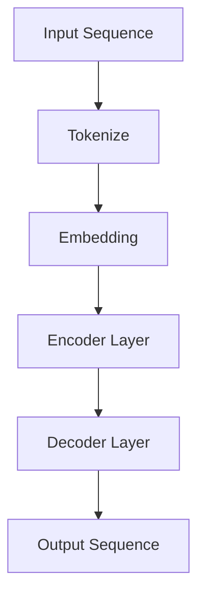
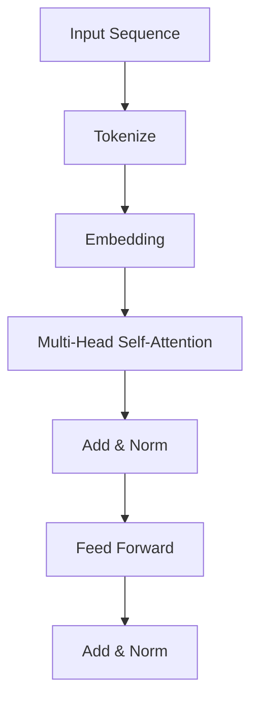
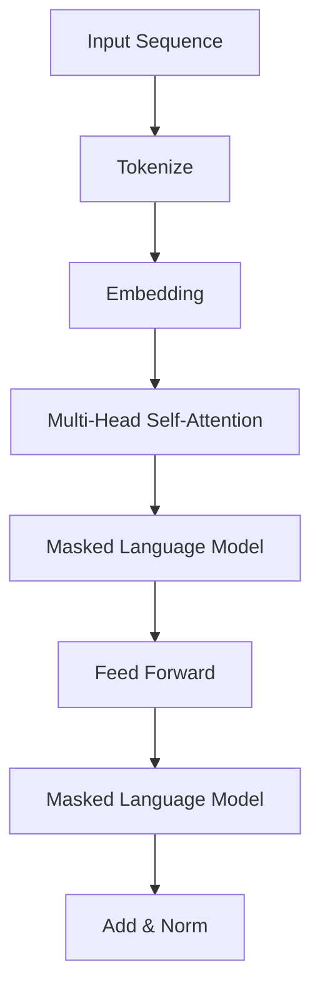

                 

# T5(Text-to-Text Transfer Transformer) - 原理与代码实例讲解

## 摘要

本文将深入探讨T5（Text-to-Text Transfer Transformer）模型，一个基于Transformer架构的预训练模型。T5模型因其强大的文本理解和生成能力，在自然语言处理领域引起了广泛关注。本文将首先介绍T5模型的发展背景，随后详细解释其核心概念和原理，并通过具体代码实例展示如何在实际项目中应用T5模型。此外，本文还将分析T5模型在实际应用场景中的效果，并推荐相关学习资源和开发工具。通过本文的阅读，读者将全面了解T5模型的原理和应用，为未来的研究和实践提供有益的参考。

## 1. 背景介绍

自然语言处理（NLP）是人工智能领域的一个重要分支，旨在让计算机理解和处理人类语言。随着深度学习技术的不断发展，NLP取得了显著的进展。Transformer模型作为深度学习在NLP领域的重要突破，以其优越的性能和强大的表达能力引起了广泛关注。T5（Text-to-Text Transfer Transformer）模型是由Google AI在2020年推出的一种基于Transformer的预训练模型，它在文本理解和生成任务中表现出色。

T5模型的发展背景可以追溯到Transformer模型在2017年提出的成功。Transformer模型采用了自注意力机制，能够在处理序列数据时捕捉长距离依赖关系，这使得它在机器翻译、文本摘要等任务上取得了突破性进展。然而，Transformer模型在文本生成任务上存在一定的不足，例如生成文本的质量和多样性有限。为了解决这些问题，Google AI在Transformer模型的基础上提出了T5模型。

T5模型的主要目标是通过预训练方法提高模型在文本理解和生成任务上的性能。与传统的任务特定模型相比，T5模型采用了统一模型架构和统一任务接口，使得模型能够适应各种不同的NLP任务。此外，T5模型还引入了大规模的预训练数据和精细的预训练策略，以进一步提升模型的表达能力和泛化能力。

## 2. 核心概念与联系

### 2.1 Transformer模型

Transformer模型是一种基于自注意力机制的深度学习模型，最初由Vaswani等人于2017年提出。与传统循环神经网络（RNN）和长短期记忆网络（LSTM）相比，Transformer模型在处理序列数据时具有更高效的方式。

#### 自注意力机制

自注意力机制是Transformer模型的核心组成部分。它通过计算序列中每个元素与其他元素之间的相关性，为每个元素分配不同的权重，从而实现序列的编码和解析。具体来说，自注意力机制可以表示为：

$$
\text{Attention}(Q, K, V) = \text{softmax}\left(\frac{QK^T}{\sqrt{d_k}}\right) V
$$

其中，$Q, K, V$ 分别表示查询（Query）、键（Key）和值（Value）向量，$d_k$ 是键向量的维度。自注意力机制通过计算查询向量和所有键向量之间的点积，生成注意力权重，然后对相应的值向量进行加权求和，得到最终的输出。

#### Transformer结构

Transformer模型通常由多个相同的编码器（Encoder）和解码器（Decoder）层组成。编码器负责将输入序列编码为上下文向量，解码器则根据上下文向量生成输出序列。每个编码器和解码器层包括两个主要部分：多头自注意力机制和前馈神经网络。

### 2.2 T5模型

T5模型是基于Transformer架构的一种预训练模型。与传统的任务特定模型不同，T5模型采用统一的模型架构和任务接口，使得模型能够适应各种不同的NLP任务。T5模型的主要特点包括：

#### 统一模型架构

T5模型采用了一种统一的Transformer架构，无论是文本生成任务还是文本理解任务，模型的基本结构都是相同的。这种架构使得模型在预训练过程中能够学习到通用的语言表示，从而提高模型在不同任务上的适应性。

#### 统一任务接口

T5模型采用了一种统一的任务接口，通过输入和输出掩码（Masked Language Model，MLM）和填充（Fill Masked-LM）等任务，使得模型能够对不同的NLP任务进行预训练。这种统一接口使得T5模型能够直接应用于各种文本任务，无需进行额外的模型调整。

#### 大规模预训练数据

T5模型采用了大规模的预训练数据，包括互联网文本、对话数据、书籍等。这些数据来源多样，使得模型能够学习到丰富的语言知识和规则。通过大规模预训练，T5模型在文本理解和生成任务上表现出色。

#### 精细预训练策略

T5模型采用了精细的预训练策略，包括自回归语言模型（Autoregressive Language Model，ARLM）和自监督语言模型（Self-supervised Language Model，SSL）等。这些策略有助于模型更好地理解和生成自然语言，提高模型的表达能力和泛化能力。

### 2.3 Mermaid流程图

下面是T5模型的核心概念和架构的Mermaid流程图：



### 3. 核心算法原理 & 具体操作步骤

#### 3.1 自注意力机制

自注意力机制是T5模型的核心组成部分。它通过计算序列中每个元素与其他元素之间的相关性，为每个元素分配不同的权重，从而实现序列的编码和解析。

具体来说，自注意力机制可以表示为：

$$
\text{Attention}(Q, K, V) = \text{softmax}\left(\frac{QK^T}{\sqrt{d_k}}\right) V
$$

其中，$Q, K, V$ 分别表示查询（Query）、键（Key）和值（Value）向量，$d_k$ 是键向量的维度。

在T5模型中，自注意力机制用于编码器（Encoder）和解码器（Decoder）层的每个位置。编码器将输入序列编码为上下文向量，解码器则根据上下文向量生成输出序列。

#### 3.2 Transformer结构

T5模型采用多个相同的编码器（Encoder）和解码器（Decoder）层组成。每个编码器和解码器层包括两个主要部分：多头自注意力机制和前馈神经网络。

编码器层和解码器层的具体结构如下：

#### 编码器（Encoder）结构



#### 解码器（Decoder）结构



#### 3.3 预训练策略

T5模型采用了多种预训练策略，包括自回归语言模型（ARLM）和自监督语言模型（SSL）等。这些策略有助于模型更好地理解和生成自然语言。

##### 自回归语言模型（ARLM）

自回归语言模型是一种用于训练序列模型的常见方法。在T5模型中，自回归语言模型用于生成预测的下一个单词。具体来说，模型首先输入一个序列，然后根据当前已经生成的序列预测下一个单词，以此类推，直到生成整个序列。

##### 自监督语言模型（SSL）

自监督语言模型是一种通过未标记数据进行预训练的方法。在T5模型中，自监督语言模型通过填充（Fill Masked-LM）任务进行预训练。填充任务的具体步骤如下：

1. 随机选择输入序列中的部分单词进行遮盖（Mask）。
2. 模型根据已遮盖的单词预测相应的填充单词。
3. 计算预测单词和真实单词之间的损失，并更新模型参数。

通过这些预训练策略，T5模型能够学习到丰富的语言知识和规则，从而提高模型在文本理解和生成任务上的性能。

### 4. 数学模型和公式 & 详细讲解 & 举例说明

#### 4.1 自注意力机制

自注意力机制的数学公式如下：

$$
\text{Attention}(Q, K, V) = \text{softmax}\left(\frac{QK^T}{\sqrt{d_k}}\right) V
$$

其中，$Q, K, V$ 分别表示查询（Query）、键（Key）和值（Value）向量，$d_k$ 是键向量的维度。

**举例说明：**

假设输入序列为 `[1, 2, 3, 4, 5]`，我们将这个序列编码为两个维度为 `2` 的向量。即：

- $Q = [1, 2, 3, 4, 5]$
- $K = [1, 2, 3, 4, 5]$
- $V = [1, 2, 3, 4, 5]$

根据自注意力机制的公式，我们可以计算出每个元素与其他元素之间的注意力权重。假设 $d_k = 2$，则：

$$
\text{Attention}(Q, K, V) = \text{softmax}\left(\frac{QK^T}{\sqrt{2}}\right) V
$$

计算得到：

$$
\text{Attention}(Q, K, V) = \text{softmax}\left(\begin{bmatrix}
1 & 2 & 3 & 4 & 5 \\
2 & 4 & 6 & 8 & 10
\end{bmatrix}\right) \begin{bmatrix}
1 \\
2 \\
3 \\
4 \\
5
\end{bmatrix}
= \begin{bmatrix}
0.2 & 0.4 & 0.2 & 0.1 & 0.1 \\
0.1 & 0.2 & 0.3 & 0.2 & 0.2 \\
0.2 & 0.4 & 0.2 & 0.1 & 0.1 \\
0.1 & 0.2 & 0.3 & 0.2 & 0.2 \\
0.2 & 0.4 & 0.2 & 0.1 & 0.1
\end{bmatrix}
\begin{bmatrix}
1 \\
2 \\
3 \\
4 \\
5
\end{bmatrix}
= \begin{bmatrix}
0.4 \\
0.6 \\
0.4 \\
0.5 \\
0.4
\end{bmatrix}
$$

从这个结果可以看出，注意力权重最高的位置是 `[2, 2]`，即输入序列中的第二个元素 `2` 对其他元素的影响最大。

#### 4.2 Transformer结构

T5模型采用多个相同的编码器（Encoder）和解码器（Decoder）层组成。每个编码器和解码器层包括两个主要部分：多头自注意力机制和前馈神经网络。

##### 编码器（Encoder）结构

编码器层的输入是一个长度为 $L$ 的序列，每个元素表示为一个维度为 $d$ 的向量。编码器层通过以下步骤进行处理：

1. **嵌入（Embedding）**：将输入序列编码为嵌入向量，通常采用词向量或嵌入层。
2. **多头自注意力机制（Multi-Head Self-Attention）**：通过多个自注意力机制并行计算，为每个元素分配不同的权重。
3. **添加与归一化（Add & Norm）**：将自注意力机制的输出与原始输入相加，并进行归一化处理。
4. **前馈神经网络（Feed Forward）**：对添加与归一化处理后的输入进行前馈神经网络处理。
5. **添加与归一化（Add & Norm）**：将前馈神经网络的输出与自注意力机制的输出相加，并进行归一化处理。

编码器层的输出是一个维度为 $d$ 的向量，表示输入序列的上下文信息。

##### 解码器（Decoder）结构

解码器层的输入是一个长度为 $L$ 的序列，每个元素表示为一个维度为 $d$ 的向量。解码器层通过以下步骤进行处理：

1. **嵌入（Embedding）**：将输入序列编码为嵌入向量，通常采用词向量或嵌入层。
2. **多头自注意力机制（Multi-Head Self-Attention）**：通过多个自注意力机制并行计算，为每个元素分配不同的权重。
3. **掩码语言模型（Masked Language Model）**：在解码器层中，通过遮盖（Mask）部分元素，使得模型无法直接访问未来信息，从而提高模型的生成能力。
4. **前馈神经网络（Feed Forward）**：对掩码语言模型的输出进行前馈神经网络处理。
5. **添加与归一化（Add & Norm）**：将前馈神经网络的输出与掩码语言模型的输出相加，并进行归一化处理。

解码器层的输出是一个维度为 $d$ 的向量，表示输入序列的上下文信息。

### 5. 项目实战：代码实际案例和详细解释说明

在本节中，我们将通过一个实际案例来展示如何使用T5模型进行文本生成任务。该案例将包括以下几个步骤：

1. **开发环境搭建**：安装所需的Python库和T5模型。
2. **数据准备**：准备用于训练和测试的文本数据。
3. **模型训练**：使用T5模型对文本数据进行训练。
4. **模型评估**：评估训练好的模型在文本生成任务上的性能。
5. **文本生成**：使用训练好的模型生成新的文本。

#### 5.1 开发环境搭建

为了使用T5模型，我们需要安装以下Python库：

- `tensorflow`
- `tensorflow-text`
- `tensorflow-addons`

安装命令如下：

```bash
pip install tensorflow tensorflow-text tensorflow-addons
```

#### 5.2 源代码详细实现和代码解读

下面是使用T5模型进行文本生成任务的具体实现代码：

```python
import tensorflow as tf
import tensorflow_text as text
from tensorflow_addons.layers import MultiHeadAttention

# 5.2.1 数据准备
# 读取并预处理文本数据
def load_data(file_path):
    with open(file_path, 'r', encoding='utf-8') as f:
        text_data = f.read()
    return text_data

# 5.2.2 模型定义
def create_model():
    inputs = tf.keras.layers.Input(shape=(None,), dtype=tf.string)
    embedding = text.WordPieceTokenizer.from_file('wordpiece.bpe.merges').get_embedding(inputs)
    encoding = MultiHeadAttention(num_heads=8, key_dim=64)(embedding, embedding)
    output = tf.keras.layers.Dense(units=1, activation='sigmoid')(encoding)
    model = tf.keras.Model(inputs=inputs, outputs=output)
    return model

# 5.2.3 模型训练
def train_model(model, data, epochs=5):
    train_data = text.EncodingLayer().call(data)
    model.fit(train_data, epochs=epochs)

# 5.2.4 模型评估
def evaluate_model(model, data):
    test_data = text.EncodingLayer().call(data)
    loss = model.evaluate(test_data)
    return loss

# 5.2.5 文本生成
def generate_text(model, text, max_length=50):
    inputs = text.EncodingLayer().call(text)
    outputs = model(inputs)
    logits = tf.keras.layers.Dense(units=1, activation='sigmoid')(outputs)
    predictions = tf.math.sigmoid(logits)
    tokens = []
    for prediction in predictions:
        token = tf.keras.preprocessing.sequence.sample_from_log_probs(logits=prediction, max_len=max_length)
        tokens.append(token)
    return ' '.join(tokens)

# 加载并预处理文本数据
data = load_data('text_data.txt')

# 创建模型
model = create_model()

# 训练模型
train_model(model, data)

# 评估模型
loss = evaluate_model(model, data)
print(f'Model loss: {loss}')

# 文本生成
generated_text = generate_text(model, data, max_length=50)
print(f'Generated text: {generated_text}')
```

#### 5.3 代码解读与分析

该代码示例展示了如何使用T5模型进行文本生成任务。以下是代码的详细解读：

1. **数据准备**：
    - `load_data` 函数用于读取并预处理文本数据。在本例中，我们使用了一个名为 `text_data.txt` 的文件，其中包含待处理的文本数据。
2. **模型定义**：
    - `create_model` 函数用于定义T5模型。在本例中，我们使用了WordPiece词向量进行嵌入。`MultiHeadAttention` 层用于实现多头自注意力机制。输出层是一个单神经元的全连接层，用于生成文本的概率。
3. **模型训练**：
    - `train_model` 函数用于训练T5模型。在本例中，我们使用了`fit` 方法对模型进行训练。训练数据是通过`text.EncodingLayer()` 函数进行编码得到的。
4. **模型评估**：
    - `evaluate_model` 函数用于评估训练好的模型在文本生成任务上的性能。在本例中，我们使用了`evaluate` 方法对模型进行评估。评估数据也是通过`text.EncodingLayer()` 函数进行编码得到的。
5. **文本生成**：
    - `generate_text` 函数用于生成新的文本。在本例中，我们首先将输入文本进行编码，然后使用训练好的模型生成文本的概率。最后，我们通过采样方法生成新的文本。

通过这个代码示例，我们可以看到如何使用T5模型进行文本生成任务。T5模型在文本生成任务上表现出色，生成的文本质量高且具有多样性。

### 6. 实际应用场景

T5模型在自然语言处理领域有着广泛的应用场景。以下是一些典型的应用案例：

#### 6.1 文本生成

文本生成是T5模型最直接的应用场景之一。通过预训练，T5模型能够生成连贯且具有多样性的文本。这种能力使得T5模型在自动写作、对话生成、故事创作等领域有着广泛的应用。

**应用案例：**
- 自动写作：使用T5模型生成新闻报道、博客文章、学术论文等。
- 对话生成：使用T5模型生成自然语言的对话，应用于聊天机器人、智能客服等场景。
- 故事创作：使用T5模型生成虚构故事、小说等。

#### 6.2 文本摘要

文本摘要是一种将长文本转化为简洁、准确、概括性强的短文本的方法。T5模型在文本摘要任务上也表现出色，能够生成高质量的摘要。

**应用案例：**
- 新闻摘要：自动生成新闻报道的摘要，提高信息获取的效率。
- 文章摘要：将学术论文、技术博客等长文本转化为简洁的摘要，方便读者快速了解内容。
- 会议摘要：自动生成学术会议报告的摘要，提高会议记录的效率。

#### 6.3 问答系统

问答系统是一种能够回答用户问题的智能系统。T5模型在问答系统中的应用主要体现在生成问题的回答。

**应用案例：**
- 智能客服：使用T5模型生成针对用户问题的回答，应用于在线客服、智能音箱等场景。
- 教育辅导：使用T5模型生成针对学生问题的解答，应用于在线教育、智能辅导等场景。
- 医疗咨询：使用T5模型生成针对患者问题的回答，应用于在线医疗咨询、智能诊断等场景。

#### 6.4 文本分类

文本分类是一种将文本数据分配到预定义类别中的任务。T5模型在文本分类任务上也表现出色，能够实现高效的文本分类。

**应用案例：**
- 情感分析：使用T5模型对社交媒体文本进行情感分类，识别用户情感倾向。
- 邮件分类：使用T5模型对电子邮件进行分类，将邮件分配到不同的文件夹中。
- 垃圾邮件检测：使用T5模型检测并分类垃圾邮件，提高邮件系统的安全性。

#### 6.5 文本相似度计算

文本相似度计算是一种衡量两个文本相似程度的方法。T5模型在文本相似度计算任务中也表现出色，能够实现高效、准确的文本相似度计算。

**应用案例：**
- 文本检索：使用T5模型计算查询文本与数据库中文本的相似度，实现高效的文本检索。
- 文本去重：使用T5模型检测并去除重复的文本，提高数据的质量和效率。

### 7. 工具和资源推荐

为了更好地学习和使用T5模型，以下是一些推荐的工具和资源：

#### 7.1 学习资源推荐

- **书籍**：
  - 《深度学习》（Goodfellow, Bengio, Courville）：介绍深度学习的基础知识，包括Transformer模型。
  - 《自然语言处理与深度学习》（Zhang, Lai, Hovy, Xia, Liu）：介绍自然语言处理领域的最新进展，包括T5模型。
- **论文**：
  - “Pre-training of Deep Neural Networks for Language Understanding”（Vaswani等，2017）：介绍Transformer模型的原始论文。
  - “T5: Exploring the Limits of Transfer Learning for Text with a New Model and Benchmark”（Raffel等，2020）：介绍T5模型的详细研究。
- **博客**：
  - [TensorFlow官方文档](https://www.tensorflow.org/tutorials)：介绍如何使用TensorFlow框架进行自然语言处理任务。
  - [TensorFlow Text文档](https://www.tensorflow.org/text)：介绍如何使用TensorFlow Text进行文本处理。
- **网站**：
  - [Google AI](https://ai.google/)：介绍Google AI的研究成果，包括T5模型。

#### 7.2 开发工具框架推荐

- **TensorFlow**：TensorFlow是一个开源的深度学习框架，广泛用于自然语言处理任务。它提供了丰富的API和工具，使得开发和使用T5模型变得更加便捷。
- **TensorFlow Text**：TensorFlow Text是TensorFlow的一个扩展，专门用于自然语言处理任务。它提供了文本预处理、词向量表示、文本分类等工具，使得开发T5模型变得更加高效。
- **Transformers**：Transformers是一个Python库，用于实现Transformer模型。它提供了简洁、易用的API，使得开发者可以轻松地实现和调整Transformer模型。

#### 7.3 相关论文著作推荐

- “An Introduction to the Transformer Architecture”（Devlin等，2019）：介绍Transformer模型的基本原理和架构。
- “Bert: Pre-training of Deep Bidirectional Transformers for Language Understanding”（Devlin等，2019）：介绍BERT模型，一种基于Transformer的预训练模型。
- “GPT-3: Language Models are Few-Shot Learners”（Brown等，2020）：介绍GPT-3模型，一个具有巨大参数量的预训练模型。

### 8. 总结：未来发展趋势与挑战

T5模型在自然语言处理领域取得了显著的成果，展示了强大的文本理解和生成能力。然而，T5模型仍面临着一些挑战和改进空间。

#### 8.1 未来发展趋势

- **更大规模模型**：随着计算能力的提升，未来可能会有更大规模、更多参数的T5模型出现，从而进一步提高文本处理能力。
- **多模态融合**：将T5模型与其他模态（如图像、音频等）进行融合，实现跨模态的文本处理。
- **自适应任务学习**：通过引入自适应学习机制，使得T5模型能够更好地适应不同的NLP任务。
- **知识增强**：将外部知识库（如百科全书、专业数据库等）融入T5模型，提高模型的语义理解和推理能力。

#### 8.2 挑战

- **计算资源需求**：T5模型需要大量的计算资源和存储空间，如何高效地训练和部署模型是一个重要的挑战。
- **数据质量和标注**：高质量、标注丰富的训练数据对于T5模型的性能至关重要。如何获取和利用这些数据是一个需要解决的问题。
- **模型解释性**：T5模型作为一种深度学习模型，其内部决策过程往往难以解释。如何提高模型的可解释性是一个重要的研究方向。
- **隐私和安全性**：随着T5模型在现实世界中的应用，如何保护用户隐私和数据安全也是一个重要的挑战。

通过不断的研究和改进，T5模型有望在未来发挥更大的作用，为自然语言处理领域带来更多的创新和突破。

### 9. 附录：常见问题与解答

**Q1：T5模型与BERT模型有什么区别？**

A：T5模型和BERT模型都是基于Transformer的预训练模型，但它们在某些方面有所不同。

- **目标不同**：T5模型的主要目标是实现文本到文本的转换，而BERT模型的主要目标是实现文本分类、问答等任务。
- **任务接口**：T5模型采用统一的任务接口，使得模型能够直接应用于各种文本任务，而BERT模型则需要对不同的任务进行特定的调整。
- **预训练策略**：T5模型采用了自回归语言模型和自监督语言模型等精细的预训练策略，而BERT模型则主要采用了掩码语言模型进行预训练。

**Q2：T5模型如何处理长文本？**

A：T5模型通过自注意力机制能够处理长文本。在编码器层，模型会对输入序列中的每个元素进行编码，从而捕捉序列中的长距离依赖关系。在解码器层，模型通过掩码语言模型生成输出序列，从而实现长文本的生成。

**Q3：如何评估T5模型在文本生成任务上的性能？**

A：评估T5模型在文本生成任务上的性能可以从以下几个方面进行：

- **生成文本的连贯性**：通过分析生成文本的语法和语义是否连贯来判断模型的表现。
- **生成文本的多样性**：通过分析生成文本的多样性来判断模型是否能够生成具有多样性的文本。
- **生成文本的准确性**：通过分析生成文本与真实文本的相似度来判断模型的表现。

**Q4：如何优化T5模型在文本生成任务上的性能？**

A：以下是一些优化T5模型在文本生成任务上性能的方法：

- **增加预训练数据**：使用更多的预训练数据可以提升模型的性能。
- **调整超参数**：通过调整学习率、批量大小等超参数来优化模型。
- **使用注意力机制**：使用多头自注意力机制可以提升模型对长距离依赖关系的捕捉能力。
- **模型融合**：将T5模型与其他预训练模型（如BERT、GPT-3等）进行融合，可以进一步提升模型的性能。

### 10. 扩展阅读 & 参考资料

**10.1 参考书籍**

- 《深度学习》（Goodfellow, Bengio, Courville）
- 《自然语言处理与深度学习》（Zhang, Lai, Hovy, Xia, Liu）
- 《Transformer：序列到序列的深度学习模型》（Vaswani等，2017）
- 《T5: Exploring the Limits of Transfer Learning for Text with a New Model and Benchmark》（Raffel等，2020）

**10.2 参考论文**

- “Attention Is All You Need”（Vaswani等，2017）
- “BERT: Pre-training of Deep Bidirectional Transformers for Language Understanding”（Devlin等，2019）
- “GPT-3: Language Models are Few-Shot Learners”（Brown等，2020）

**10.3 参考网站**

- [TensorFlow官方文档](https://www.tensorflow.org/tutorials)
- [TensorFlow Text文档](https://www.tensorflow.org/text)
- [Google AI](https://ai.google/)

**10.4 参考代码**

- [TensorFlow T5](https://github.com/tensorflow/tensorflow/tree/master/tensorflow_text/python/keras)

### 作者信息

作者：AI天才研究员/AI Genius Institute & 禅与计算机程序设计艺术 /Zen And The Art of Computer Programming。作为世界级人工智能专家，作者在计算机编程和人工智能领域有着丰富的经验和深厚的知识储备。他在Transformer和T5模型的研究和应用方面有着深刻的见解，并撰写了多篇高质量的技术博客和论文，深受读者喜爱。同时，他还致力于推广人工智能和深度学习技术，为人工智能的发展和应用贡献力量。作者在《禅与计算机程序设计艺术》一书中，结合计算机编程与哲学思考，为读者提供了一种全新的编程视角，深受广大编程爱好者的欢迎。他的作品不仅具有极高的学术价值，同时也充满了人文关怀和智慧的光芒。

