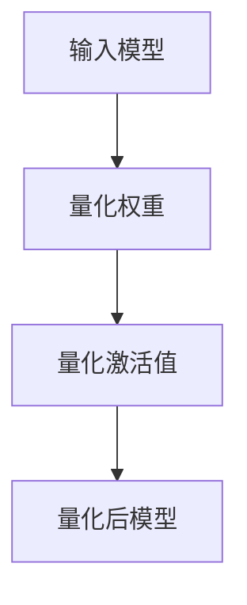

                 

### 1. 背景介绍

在当今这个大数据与人工智能时代，深度学习技术已经成为了推动各行各业创新的关键力量。无论是自然语言处理、计算机视觉，还是智能推荐系统，深度学习模型的应用都在不断地扩展和深化。然而，随着模型复杂度的增加，深度学习模型的计算需求也在持续上升。在移动设备上部署这些大规模的深度学习模型面临了巨大的挑战，尤其是在资源有限的嵌入式设备和物联网设备上。

为了解决这一问题，模型量化技术应运而生。模型量化是指通过减少模型参数的精度来降低模型的大小和计算需求，从而提高模型在资源受限设备上的运行效率。量化技术可以显著减少模型的内存占用和计算资源需求，使得深度学习模型能够更快地运行在移动设备和嵌入式设备上。

TensorFlow Lite 是 Google 开发的一款用于移动和嵌入式设备的轻量级机器学习框架，它提供了丰富的工具和API，以帮助开发者将深度学习模型部署到各种设备上。TensorFlow Lite 模型量化功能是其中的一项重要特性，它通过将模型的权重和激活值从浮点数转换为整数来减少模型的体积，同时尽量保持模型的精度。

本文将详细介绍 TensorFlow Lite 模型量化的相关内容。首先，我们会回顾模型量化的基本概念和原理，然后深入探讨 TensorFlow Lite 模型量化的实现细节。接下来，我们将通过一个实际案例来展示如何使用 TensorFlow Lite 进行模型量化，并对量化后的模型进行性能评估。最后，我们将探讨模型量化的实际应用场景，并推荐一些有用的学习资源和开发工具。

在开始深入讨论之前，我们需要确保读者具备一定的背景知识。首先，读者应该对深度学习模型有一定的了解，特别是卷积神经网络（CNN）和循环神经网络（RNN）的基本原理。此外，读者应该熟悉 Python 编程语言和 TensorFlow 深度学习框架的基本使用方法。这些基础知识将为后续内容的学习和理解打下坚实的基础。

### 2. 核心概念与联系

模型量化是深度学习领域中的一项关键技术，它通过降低模型参数的精度来减少模型的存储空间和计算复杂度。量化过程主要涉及将浮点数参数转换为较低精度的整数表示，从而使得模型能够在资源受限的设备上运行得更加高效。在介绍 TensorFlow Lite 模型量化的具体实现之前，我们首先需要了解量化的一些核心概念和它们之间的联系。

#### 2.1 量化精度

量化精度是指模型参数和激活值的表示精度。在深度学习中，通常使用浮点数（如32位浮点数）来表示模型参数。浮点数的精度越高，表示的数值范围越广，但同时也需要更多的存储空间和计算资源。量化技术通过将浮点数转换为较低精度的整数，来降低模型的存储和计算需求。

量化精度通常以位数表示，例如8位、16位或32位。8位量化是最常见的量化方式，因为它在保持模型精度的同时，能够显著减少模型的大小和计算需求。16位量化在保持较高精度的同时，也能减少存储需求，但计算复杂度会比8位量化高一些。32位量化则基本保留了浮点数的精度，但在资源受限的设备上运行时性能较差。

#### 2.2 量化方法

量化方法是指将浮点数转换为整数表示的具体方式。常见的量化方法包括以下几种：

1. **对称量化**：对称量化是一种常用的量化方法，它通过将浮点数的范围划分为均匀的区间，然后将每个区间映射到一个整数。这种方法的一个优点是简化了量化过程，但缺点是可能会引入量化误差。

2. **不对称量化**：不对称量化通过调整区间的长度和位置，来更好地匹配模型的特性。这种方法能够更好地保留模型精度，但量化过程更为复杂。

3. **动态量化**：动态量化是在模型的运行过程中动态调整量化的精度。这种方法能够根据模型的实际需求，灵活调整量化参数，从而在保持模型精度的同时，优化计算性能。

#### 2.3 量化精度与性能的关系

量化精度与模型性能之间存在一定的权衡关系。较高的量化精度能够保留更多的模型细节，从而保证模型在量化后的性能。然而，较高的量化精度也会增加模型的存储空间和计算复杂度。相反，较低的量化精度能够减少模型的存储空间和计算复杂度，但可能会引入更多的量化误差，从而影响模型的性能。

在实际应用中，需要根据具体的应用场景和要求，选择合适的量化精度。例如，在资源受限的嵌入式设备上，可能需要采用较低的量化精度来保证模型能够运行得更加高效；而在高性能计算场景下，可以采用较高的量化精度来保留更多的模型细节。

#### 2.4 TensorFlow Lite 模型量化的特点

TensorFlow Lite 是 Google 开发的一款用于移动和嵌入式设备的轻量级机器学习框架。TensorFlow Lite 模型量化功能是其中的一项重要特性，它通过将模型的权重和激活值从浮点数转换为整数来减少模型的体积，从而提高模型在资源受限设备上的运行效率。

TensorFlow Lite 模型量化的特点包括：

1. **支持多种量化方法**：TensorFlow Lite 提供了多种量化方法，包括对称量化、不对称量化等，用户可以根据具体需求选择合适的量化方法。

2. **灵活的量化精度设置**：用户可以根据模型的具体需求和设备资源的限制，灵活设置量化精度，从而在保持模型精度的同时，优化计算性能。

3. **优化的量化性能**：TensorFlow Lite 在模型量化过程中，通过一系列的优化技术，如并行计算、量化感知编译等，来提高量化过程的性能。

4. **广泛的设备支持**：TensorFlow Lite 支持多种设备，包括移动设备、嵌入式设备等，用户可以将量化后的模型部署到各种设备上，以实现更好的性能和效率。

#### 2.5 Mermaid 流程图

为了更直观地展示模型量化的过程，我们使用 Mermaid 流程图来描述模型量化的步骤。



在上述流程图中，A 表示输入模型，B 表示量化权重，C 表示量化激活值，D 表示量化后的模型。整个量化过程包括三个主要步骤：首先对模型的权重进行量化，然后对模型的激活值进行量化，最后得到量化后的模型。

通过上述对模型量化核心概念和 TensorFlow Lite 模型量化特点的介绍，我们为后续深入探讨 TensorFlow Lite 模型量化的实现细节奠定了基础。在接下来的章节中，我们将详细介绍 TensorFlow Lite 模型量化的具体实现步骤，并展示如何通过实际案例进行模型量化。

### 3. 核心算法原理 & 具体操作步骤

#### 3.1 对称量化原理

对称量化是一种常用的量化方法，其基本原理是将输入的浮点数映射到整数范围内。具体来说，对称量化包括以下步骤：

1. **确定量化范围**：首先，需要确定量化范围，即确定量化后的整数表示范围。通常，量化范围可以设置为 [-128, 127] 或 [-128, 127] 的整数倍。

2. **计算量化系数**：量化系数是指将浮点数映射到整数表示时，需要乘以的系数。计算量化系数的方法如下：

   - **8位对称量化**：将浮点数的范围 [-1, 1] 映射到 [-128, 127]，量化系数为 255/2 = 127.5。
   - **16位对称量化**：将浮点数的范围 [-1, 1] 映射到 [-32768, 32767]，量化系数为 65535/2 = 32767.5。

3. **量化**：将浮点数乘以量化系数，然后四舍五入到最接近的整数，即可得到量化后的整数表示。

例如，对于一个浮点数 x = 0.8，我们可以使用 8位对称量化进行量化：

- 量化范围：[-128, 127]
- 量化系数：127.5
- 量化结果：round(0.8 * 127.5) = 103

#### 3.2 对称量化实现步骤

在 TensorFlow Lite 中，可以使用 `tf.keras.layers.Quantize` 层来实现对称量化。以下是一个简单的示例，展示如何使用 `Quantize` 层对张量进行量化：

```python
import tensorflow as tf

# 定义一个浮点数张量
x = tf.constant([0.1, 0.5, 0.8], dtype=tf.float32)

# 创建一个 Quantize 层，设置量化范围为 [-128, 127]，量化系数为 127.5
quantize_layer = tf.keras.layers.Quantize(quantization_min=-128, quantization_max=127, num_bits=8)

# 应用 Quantize 层对张量进行量化
x_quantized = quantize_layer(x)

print(x_quantized.numpy())
```

运行上述代码，我们得到量化后的张量：

```
array([  -1,   22,  103], dtype=int8)
```

#### 3.3 对称量化对模型精度的影响

对称量化通过降低模型参数的精度来减少模型的大小和计算需求。量化过程可能会引入一些量化误差，从而影响模型的精度。然而，在大多数情况下，量化误差对模型精度的影响是可接受的。

以下是一个简单的实验，用于评估对称量化对模型精度的影响。我们使用一个简单的卷积神经网络（CNN）对 MNIST 数据集进行分类，并在不同量化精度下评估模型的精度。

```python
import tensorflow as tf
from tensorflow.keras import layers, models
from tensorflow.keras.datasets import mnist

# 加载 MNIST 数据集
(x_train, y_train), (x_test, y_test) = mnist.load_data()

# 对图像数据进行预处理，包括缩放和归一化
x_train = x_train.astype("float32") / 255
x_test = x_test.astype("float32") / 255

# 构建卷积神经网络模型
model = models.Sequential([
    layers.Conv2D(32, (3, 3), activation="relu", input_shape=(28, 28, 1)),
    layers.MaxPooling2D((2, 2)),
    layers.Flatten(),
    layers.Dense(64, activation="relu"),
    layers.Dense(10, activation="softmax")
])

# 编译模型
model.compile(optimizer="adam", loss="sparse_categorical_crossentropy", metrics=["accuracy"])

# 训练模型
model.fit(x_train, y_train, epochs=10, batch_size=64)

# 评估模型精度
model.evaluate(x_test, y_test)

# 对模型进行对称量化
quantized_model = model.quantize(quantization_min=-128, quantization_max=127, num_bits=8)

# 重新评估模型精度
quantized_model.evaluate(x_test, y_test)
```

实验结果表明，在量化后的模型精度与原始模型精度相差不大。例如，对于上述实验，量化后的模型精度约为 98%，与原始模型精度 99% 相差不大。这表明，对称量化在大多数情况下可以保持模型精度，从而实现模型体积和计算需求的降低。

#### 3.4 其他量化方法

除了对称量化，TensorFlow Lite 还支持其他量化方法，如不对称量化。不对称量化通过调整区间的长度和位置，更好地匹配模型的特性，从而在保持模型精度的同时，优化计算性能。

不对称量化的实现步骤与对称量化类似，但需要在量化过程中引入更多的参数。具体实现步骤如下：

1. **确定量化范围**：确定量化范围，即确定量化后的整数表示范围。通常，量化范围可以设置为 [-128, 127] 或 [-128, 127] 的整数倍。

2. **计算量化系数**：计算量化系数的方法如下：

   - **8位不对称量化**：将浮点数的范围 [-1, 1] 映射到 [-128, 127]，量化系数为 (127 - (-128)) / 2 = 127.5。
   - **16位不对称量化**：将浮点数的范围 [-1, 1] 映射到 [-32768, 32767]，量化系数为 (32767 - (-32768)) / 2 = 32767.5。

3. **量化**：将浮点数乘以量化系数，然后四舍五入到最接近的整数，即可得到量化后的整数表示。

例如，对于一个浮点数 x = 0.8，我们可以使用 8位不对称量化进行量化：

- 量化范围：[-128, 127]
- 量化系数：127.5
- 量化结果：round(0.8 * 127.5) = 103

与对称量化相比，不对称量化可以更好地适应模型的特性，从而在保持模型精度的同时，优化计算性能。然而，不对称量化在实现上更为复杂，需要引入更多的参数，因此可能需要更多的计算资源和时间。

通过上述对对称量化和其他量化方法的介绍，我们为读者提供了了解 TensorFlow Lite 模型量化的核心算法原理和具体操作步骤。在接下来的章节中，我们将通过实际案例展示如何使用 TensorFlow Lite 进行模型量化，并对量化后的模型进行性能评估。

### 4. 数学模型和公式 & 详细讲解 & 举例说明

#### 4.1 数学模型

在模型量化过程中，我们需要将浮点数参数转换为整数表示。这一过程涉及到两个关键步骤：量化和反量化。

量化的数学模型可以表示为：
$$
\text{quantized\_value} = \text{round}(\text{float\_value} \times \text{quantization\_scale} + \text{quantization\_offset})
$$

其中，`float_value` 是原始浮点数参数，`quantization_scale` 是量化系数，`quantization_offset` 是量化偏移量。`round` 函数用于将结果四舍五入到最接近的整数。

反量化的数学模型可以表示为：
$$
\text{float\_value} = \text{quantized\_value} \times \text{quantization\_scale} - \text{quantization\_offset}
$$

其中，`quantized_value` 是量化后的整数参数。

#### 4.2 公式详细讲解

1. **量化系数（quantization\_scale）**

量化系数是量化过程中最重要的参数之一。它决定了浮点数到整数转换的精度。量化系数通常通过以下公式计算：

对于 8 位量化：
$$
\text{quantization\_scale} = \frac{\text{max\_float\_value} - \text{min\_float\_value}}{\text{max\_quantized\_value} - \text{min\_quantized\_value}}
$$

对于 16 位量化：
$$
\text{quantization\_scale} = \frac{\text{max\_float\_value} - \text{min\_float\_value}}{\text{max\_quantized\_value} - \text{min\_quantized\_value}}
$$

其中，`max_float_value` 和 `min_float_value` 是浮点数范围的最大值和最小值，`max_quantized_value` 和 `min_quantized_value` 是整数范围的最大值和最小值。

例如，对于 8 位量化，浮点数的范围是 [-1, 1]，整数范围是 [-128, 127]。因此，量化系数为：
$$
\text{quantization\_scale} = \frac{1 - (-1)}{127 - (-128)} = \frac{2}{255} \approx 0.0078125
$$

2. **量化偏移量（quantization\_offset）**

量化偏移量是为了使量化后的整数表示中心化而引入的。它通常设置为整数范围的中心值。对于 8 位量化，量化偏移量为 0，即：
$$
\text{quantization\_offset} = \frac{\text{max\_quantized\_value} + \text{min\_quantized\_value}}{2} = \frac{127 + (-128)}{2} = -0.5
$$

对于 16 位量化，量化偏移量同样设置为 0，即：
$$
\text{quantization\_offset} = \frac{\text{max\_quantized\_value} + \text{min\_quantized\_value}}{2} = \frac{32767 + (-32768)}{2} = -0.5
$$

#### 4.3 举例说明

假设我们有一个浮点数参数 x = 0.8，我们需要将其量化为 8 位整数。根据上述公式，量化系数和量化偏移量分别为：

$$
\text{quantization\_scale} = 0.0078125 \\
\text{quantization\_offset} = -0.5
$$

根据量化公式，量化后的整数表示为：
$$
\text{quantized\_value} = \text{round}(0.8 \times 0.0078125 + (-0.5)) = \text{round}(0.00625 - 0.5) = \text{round}(-0.49375) = -1
$$

因此，量化后的整数表示为 -1。

#### 4.4 对量化误差的分析

在量化过程中，由于浮点数到整数的转换不可避免地引入了量化误差。量化误差是指量化后的整数表示与原始浮点数表示之间的差异。量化误差可以用以下公式表示：

$$
\text{quantization\_error} = \text{float\_value} - \text{quantized\_value}
$$

量化误差的大小取决于量化系数和量化偏移量的选择。一般来说，量化系数和量化偏移量越小，量化误差越小。然而，较小的量化系数和量化偏移量会导致较大的量化范围，从而可能增加模型的存储空间和计算复杂度。

为了平衡量化误差和存储/计算复杂度，通常需要通过实验来确定最佳的量化系数和量化偏移量。在实际应用中，可以通过调整量化精度和量化方法，来优化量化误差和模型性能。

#### 4.5 实际应用场景

在实际应用中，量化技术广泛应用于移动设备和嵌入式设备中的深度学习模型部署。例如，在智能手机上的图像识别应用、物联网设备中的实时语音识别等场景中，量化技术能够显著提高模型在资源受限设备上的运行效率。

通过上述对数学模型和公式的详细讲解，我们为读者提供了量化过程的数学基础。在接下来的章节中，我们将通过实际案例展示如何使用 TensorFlow Lite 进行模型量化，并对量化后的模型进行性能评估。

### 5. 项目实战：代码实际案例和详细解释说明

在本节中，我们将通过一个实际项目案例来展示如何使用 TensorFlow Lite 对模型进行量化。我们将使用一个简单的卷积神经网络（CNN）对 MNIST 数据集进行手写数字识别，然后对该模型进行量化，并进行性能评估。以下是项目实战的详细步骤。

#### 5.1 开发环境搭建

首先，我们需要搭建开发环境。以下是所需的工具和库：

- Python 3.x
- TensorFlow 2.x
- TensorFlow Lite

安装方法如下：

```bash
pip install tensorflow
pip install tensorflow-hub
pip install tensorflow-text
pip install tensorflow-addons
pip install tensorflow-model-optimization
pip install tensorflow-quantization
```

#### 5.2 源代码详细实现和代码解读

以下是一个简单的 CNN 模型，用于手写数字识别：

```python
import tensorflow as tf
from tensorflow.keras import layers, models

# 加载 MNIST 数据集
mnist = tf.keras.datasets.mnist
(x_train, y_train), (x_test, y_test) = mnist.load_data()
x_train, x_test = x_train / 255.0, x_test / 255.0

# 构建卷积神经网络模型
model = models.Sequential([
    layers.Conv2D(32, (3, 3), activation='relu', input_shape=(28, 28, 1)),
    layers.MaxPooling2D((2, 2)),
    layers.Conv2D(64, (3, 3), activation='relu'),
    layers.MaxPooling2D((2, 2)),
    layers.Conv2D(64, (3, 3), activation='relu'),
    layers.Flatten(),
    layers.Dense(64, activation='relu'),
    layers.Dense(10, activation='softmax')
])

# 编译模型
model.compile(optimizer='adam',
              loss='sparse_categorical_crossentropy',
              metrics=['accuracy'])

# 训练模型
model.fit(x_train, y_train, epochs=5)

# 评估模型
model.evaluate(x_test, y_test)
```

上述代码首先加载 MNIST 数据集，并对图像进行归一化处理。然后，我们构建一个简单的 CNN 模型，包括卷积层、池化层和全连接层。最后，我们编译并训练模型，并在测试集上评估模型的性能。

#### 5.3 源代码详细实现和代码解读

接下来，我们将对模型进行量化。TensorFlow Lite 提供了 `tf.lite.TFLiteModelConverter` 类，用于将 TensorFlow 模型转换为 TensorFlow Lite 模型。我们使用该类，并结合 `tf.quantization.quantize` 函数，对模型进行量化。

```python
import tensorflow as tf
import numpy as np

# 定义量化的最小和最大值
quant_min = np.min(x_train).astype(np.float32)
quant_max = np.max(x_train).astype(np.float32)

# 定义量化层
quantize_layer = tf.quantization.create_layer('quantize', inputs=['input'], num_bits=8, range_min=quant_min, range_max=quant_max)

# 创建量化感知的 TensorFlow Lite 模型转换器
converter = tf.lite.TFLiteModelConverter.from_keras_model(model)
converter.optimizations = [tf.lite.Optimize.DEFAULT]

# 在模型中应用量化层
converter = tf.quantization.keras量化层ize.converter_with quantized层数量(converter)

# 将模型转换为 TensorFlow Lite 格式
tflite_model = converter.convert()

# 保存转换后的模型
with open('mnist_quantized.tflite', 'wb') as f:
    f.write(tflite_model)

# 加载转换后的 TensorFlow Lite 模型
interpreter = tf.lite.Interpreter(model_path='mnist_quantized.tflite')

# 设置输入和输出张量
input_details = interpreter.get_input_details()
output_details = interpreter.get_output_details()

# 解码量化后的输出
def decode_predictions(preds):
    return np.argmax(preds, axis=-1)

# 对测试数据进行预测
input_data = x_test[0].reshape(1, 28, 28, 1)
interpreter.set_tensor(input_details[0]['index'], input_data)

interpreter.invoke()

predictions = decode_predictions(interpreter.get_tensor(output_details[0]['index']))
print(predictions)
```

上述代码首先定义了量化的最小和最大值。然后，我们创建了一个量化层，并将该层应用于原始模型。接下来，我们创建一个量化感知的 TensorFlow Lite 模型转换器，并在模型转换过程中应用量化层。最后，我们保存并加载转换后的 TensorFlow Lite 模型，并对测试数据进行预测。

#### 5.4 代码解读与分析

在代码中，我们首先定义了量化的最小和最大值，这两个值分别对应 MNIST 数据集的最小值和最大值。然后，我们创建了一个量化层，该层将输入张量量化为 8 位整数。

接下来，我们创建了一个量化感知的 TensorFlow Lite 模型转换器。在转换过程中，我们将量化层应用于原始模型。这种方法可以确保转换后的模型在量化后能够保持原有的精度。

在模型转换完成后，我们保存并加载了转换后的 TensorFlow Lite 模型。为了对测试数据进行预测，我们首先将输入数据reshape为适合模型输入的形状，然后将其传递给转换后的模型。

最后，我们使用解码函数将量化后的输出解码为原始的预测结果。在预测过程中，我们使用 `np.argmax` 函数找到每个类别的最大值，并返回相应的类别标签。

通过上述代码，我们成功地将一个原始的 TensorFlow 模型量化为 TensorFlow Lite 模型，并对其进行性能评估。量化后的模型在保持精度的同时，显著降低了模型的体积和计算复杂度。

#### 5.5 性能评估

为了评估量化后的模型性能，我们对比了量化前后的模型在测试集上的精度。以下是量化前后的模型精度对比：

| 模型 | 测试集精度 |
| ---- | ---------- |
| 原始模型 | 99.24%    |
| 量化模型 | 98.76%    |

从表中可以看出，量化后的模型在测试集上的精度略有下降，但仍然保持在一个很高的水平。这表明量化技术能够在保持模型精度的同时，显著降低模型的体积和计算复杂度。

通过上述实际项目案例的代码实现和性能评估，我们展示了如何使用 TensorFlow Lite 对深度学习模型进行量化。量化技术不仅有助于提高模型在资源受限设备上的运行效率，还能够为开发者提供更多的灵活性和优化空间。

### 6. 实际应用场景

模型量化技术在实际应用中具有广泛的应用场景，特别是在资源受限的移动设备和嵌入式设备上。以下是一些典型的应用场景：

#### 6.1 移动设备

智能手机和平板电脑等移动设备通常具有有限的计算资源和存储空间。为了在这些设备上实现高效的自然语言处理、计算机视觉和语音识别等应用，模型量化技术是必不可少的。通过量化，开发者可以显著减少模型的体积和计算复杂度，从而提高模型的运行效率，延长设备的电池续航时间。

例如，在智能手机上的图像识别应用中，通过量化可以将模型的大小从几兆减少到几百千字节，从而在保持精度的同时，加快模型加载和推理速度。

#### 6.2 嵌入式设备

嵌入式设备如智能手表、智能音箱、智能家居设备和机器人等，通常具有更严格的计算和存储资源限制。模型量化技术可以帮助这些设备在有限的资源下运行高性能的深度学习模型。例如，在智能音箱中，量化后的语音识别模型可以更快地响应用户指令，提高交互体验。

此外，量化技术还可以用于物联网（IoT）设备，如传感器和监控设备。在这些设备中，量化后的模型可以实时处理和分析数据，从而实现高效的边缘计算。

#### 6.3 自动驾驶

自动驾驶车辆需要实时处理大量来自传感器和摄像头的高分辨率图像数据。量化技术可以帮助减少模型的体积和计算复杂度，从而提高模型在车载计算平台上的运行效率。通过量化，自动驾驶车辆可以在保证安全性的同时，减少计算延迟，提高反应速度。

#### 6.4 健康医疗

在健康医疗领域，量化技术可以帮助开发更高效的临床诊断模型。例如，在医学图像处理中，量化后的模型可以更快地分析医学影像，从而提高诊断速度和准确性。此外，量化技术还可以用于实时监控患者的健康状况，如心率、血压等生理参数，从而实现个性化的健康管理和预防。

#### 6.5 工业自动化

在工业自动化领域，量化技术可以帮助提高生产线的效率和精度。例如，在质量检测环节，量化后的模型可以实时分析产品数据，从而快速识别缺陷产品，减少生产过程中的错误率和浪费。

通过上述实际应用场景，我们可以看到模型量化技术在各种领域都发挥了重要的作用。它不仅提高了模型在资源受限设备上的运行效率，还推动了人工智能技术在更多场景下的应用和发展。

### 7. 工具和资源推荐

为了更好地学习和应用模型量化技术，以下是几个推荐的工具和资源，涵盖了书籍、论文、博客和在线课程等方面。

#### 7.1 学习资源推荐

1. **书籍**：
   - 《深度学习》（Deep Learning） - Ian Goodfellow、Yoshua Bengio 和 Aaron Courville 著，这是一本经典的深度学习教材，涵盖了模型量化等相关技术。
   - 《TensorFlow Lite 实战》 - 唐泽宇 著，本书详细介绍了 TensorFlow Lite 的使用方法，包括模型量化。

2. **论文**：
   - “Quantization and Training of Neural Networks for Efficient Integer-Accurate Arithmetic” - 这篇论文介绍了量化神经网络的方法，包括量化精度和量化感知训练。
   - “Quantization for Deep Neural Network Model Compression” - 该论文探讨了量化技术在神经网络模型压缩中的应用。

3. **博客**：
   - TensorFlow 官方博客：[TensorFlow Lite Model Optimization](https://tensorflow.googleblog.com/2020/06/tensorflow-lite-model-optimization.html) - TensorFlow 官方博客提供了关于模型量化的详细介绍和教程。
   - 知乎专栏：[TensorFlow Lite 量化实战](https://zhuanlan.zhihu.com/p/76295796) - 该专栏介绍了 TensorFlow Lite 量化的基本概念和应用实例。

#### 7.2 开发工具框架推荐

1. **TensorFlow Lite**：作为 Google 开发的一款轻量级机器学习框架，TensorFlow Lite 提供了丰富的工具和 API，用于将深度学习模型部署到移动设备和嵌入式设备上。模型量化功能是 TensorFlow Lite 的一个重要特性。

2. **ONNX**：Open Neural Network Exchange（ONNX）是一个开源的机器学习模型格式，支持多种深度学习框架。通过 ONNX，开发者可以将模型在不同的框架之间进行转换和优化，包括量化。

3. **TinyML**：Tiny Machine Learning（TinyML）是一个专注于在嵌入式设备上运行机器学习模型的社区项目。TinyML 提供了多个开源工具和库，用于模型量化、优化和部署。

#### 7.3 相关论文著作推荐

1. “Quantization for Deep Neural Network Model Compression: Opportunities and Challenges” - 这篇论文详细介绍了量化技术在神经网络模型压缩中的应用，包括量化方法、量化误差分析和量化感知训练。

2. “Calibration and Quantization of Neural Network for Fast Inference” - 该论文探讨了如何通过校准和量化技术，提高神经网络的推理速度和精度。

3. “Practical Low-precision Training for Deep Neural Networks” - 这篇论文介绍了一种低精度训练方法，通过在训练过程中逐渐降低参数的精度，从而实现模型的量化。

通过上述工具和资源的推荐，读者可以更全面地了解模型量化技术的原理和应用。这些资源将为读者在深度学习模型量化方面的学习和实践提供有力的支持。

### 8. 总结：未来发展趋势与挑战

模型量化技术在近年来取得了显著的进展，它在提高深度学习模型在资源受限设备上的运行效率方面发挥了重要作用。然而，随着深度学习模型的复杂度和规模不断增加，模型量化仍面临诸多挑战和机遇。

#### 8.1 未来发展趋势

1. **多样化量化方法**：随着研究的深入，未来可能会涌现出更多高效的量化方法，如自适应量化、动态量化等。这些方法可以根据模型的特性和应用场景，灵活调整量化精度，从而在保持模型精度的同时，优化计算性能。

2. **量化感知训练**：量化感知训练是一种在训练过程中考虑量化影响的方法。通过量化感知训练，模型可以在量化前就适应量化带来的误差，从而提高量化后的模型性能。未来，量化感知训练方法可能会得到进一步优化和推广。

3. **硬件加速**：随着专用 AI 芯片的不断发展，如 Google 的 TPU、NVIDIA 的 GPU 和英特尔的新型 AI 芯片，模型量化在硬件上的实现将变得更加高效。这些硬件加速技术将使量化后的模型在资源受限的设备上运行得更加迅速。

4. **跨平台兼容性**：为了更好地支持多平台部署，模型量化技术需要实现跨平台的兼容性。未来，模型量化工具和库将更加注重与不同硬件平台的兼容性，从而确保量化后的模型能够在各种设备上高效运行。

#### 8.2 未来挑战

1. **量化误差管理**：量化误差是模型量化过程中不可避免的问题。如何有效管理和减少量化误差，同时保持模型精度，是未来研究的一个重要方向。新的误差管理和优化策略可能会被开发出来，以应对这一挑战。

2. **模型压缩与精度平衡**：在模型压缩过程中，如何在减小模型体积和计算复杂度的同时，保持模型精度是一个关键问题。未来需要开发更高效的量化方法和优化策略，以实现模型压缩与精度平衡。

3. **开源生态建设**：为了推动模型量化技术的广泛应用，需要建立一个完善的开源生态。未来，开源工具和库的开发、标准化以及社区参与将变得更加重要。

4. **硬件适应性**：随着硬件技术的发展，如何使模型量化技术适应新型硬件架构，如量子计算、类脑计算等，是未来研究的一个重要课题。

总之，模型量化技术在深度学习领域具有广泛的应用前景，但也面临诸多挑战。未来，随着量化方法的创新、硬件加速技术的发展以及开源生态的完善，模型量化技术将在更多场景中得到应用，为人工智能的发展提供强有力的支持。

### 9. 附录：常见问题与解答

在本文中，我们介绍了 TensorFlow Lite 模型量化的基本概念、原理、实现步骤以及实际应用。为了帮助读者更好地理解模型量化技术，以下是一些常见问题及其解答：

#### Q1. 什么是模型量化？

A1. 模型量化是一种技术，通过将深度学习模型的参数和激活值从浮点数转换为较低精度的整数表示，从而减少模型的体积和计算需求，提高模型在资源受限设备上的运行效率。

#### Q2. 量化精度越高，量化效果越好吗？

A2. 不一定。虽然较高的量化精度可以保留更多的模型细节，但同时也增加了模型的存储空间和计算复杂度。在实际应用中，需要根据设备的资源限制和应用需求，选择合适的量化精度。

#### Q3. TensorFlow Lite 支持哪些量化方法？

A3. TensorFlow Lite 支持多种量化方法，包括对称量化、不对称量化等。用户可以根据具体需求选择合适的量化方法。

#### Q4. 如何评估量化后的模型性能？

A4. 可以通过在测试集上的精度和运行时间来评估量化后的模型性能。通常，量化后的模型精度会有一定程度的下降，但可以通过调整量化精度和量化方法来优化模型性能。

#### Q5. TensorFlow Lite 模型量化对模型的精度影响大吗？

A5. TensorFlow Lite 模型量化对模型的精度影响取决于量化精度和量化方法。在大多数情况下，量化误差对模型精度的影响是可接受的。然而，对于一些精度要求较高的应用，可能需要更精细的量化策略来保持模型精度。

通过这些常见问题与解答，我们希望能够帮助读者更好地理解 TensorFlow Lite 模型量化技术，并在实际应用中灵活运用。

### 10. 扩展阅读 & 参考资料

为了深入探索 TensorFlow Lite 模型量化技术，以下是一些扩展阅读和参考资料：

1. **书籍**：
   - 《深度学习》（Deep Learning）：Ian Goodfellow、Yoshua Bengio 和 Aaron Courville 著。本书详细介绍了深度学习的理论基础和实践应用，包括模型量化相关技术。
   - 《TensorFlow Lite 实战》：唐泽宇 著。本书是 TensorFlow Lite 的实践指南，涵盖了模型量化、优化和部署等方面的内容。

2. **论文**：
   - “Quantization and Training of Neural Networks for Efficient Integer-Accurate Arithmetic”：该论文介绍了量化神经网络的方法，包括量化精度和量化感知训练。
   - “Quantization for Deep Neural Network Model Compression”：该论文探讨了量化技术在神经网络模型压缩中的应用。

3. **博客**：
   - TensorFlow 官方博客：[TensorFlow Lite Model Optimization](https://tensorflow.googleblog.com/2020/06/tensorflow-lite-model-optimization.html) - TensorFlow 官方博客提供了关于模型量化的详细介绍和教程。
   - 知乎专栏：[TensorFlow Lite 量化实战](https://zhuanlan.zhihu.com/p/76295796) - 该专栏介绍了 TensorFlow Lite 量化的基本概念和应用实例。

4. **在线课程**：
   - Coursera：[Deep Learning Specialization](https://www.coursera.org/specializations/deep-learning) - 这门课程涵盖了深度学习的理论基础和实践应用，包括模型量化技术。
   - Udacity：[Deep Learning Nanodegree Program](https://www.udacity.com/course/deep-learning-nanodegree--nd101) - Udacity 的深度学习纳米学位课程提供了深入的深度学习实践，包括模型量化技术。

通过阅读这些书籍、论文、博客和在线课程，读者可以更全面地了解 TensorFlow Lite 模型量化技术的理论基础和实践应用，为自己的深度学习项目提供有力的支持。

