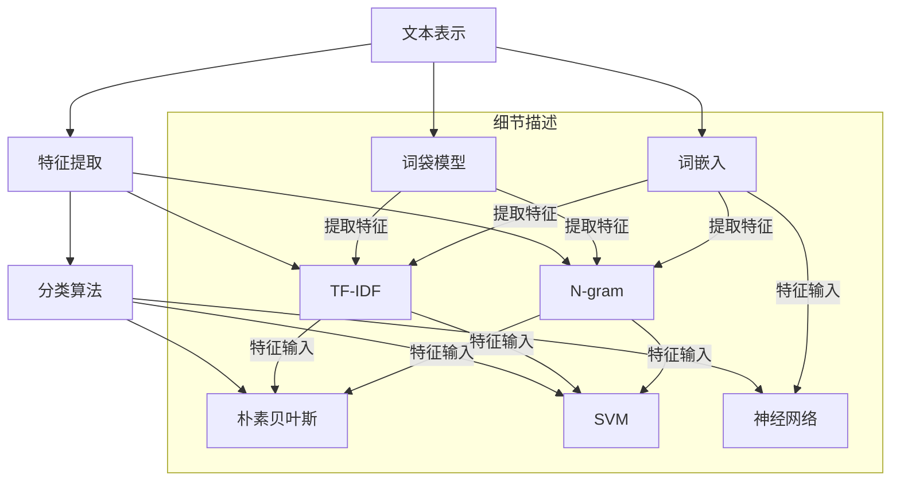

                 

### 背景介绍

#### 文本分类的重要性

文本分类是自然语言处理（Natural Language Processing, NLP）领域的一项基础且重要的任务。随着互联网的飞速发展和信息的爆炸式增长，如何有效地对海量的文本数据进行分析和归类，成为了当今信息检索、推荐系统、舆情分析等诸多领域的关键需求。

文本分类的主要目的是将文本数据按照其内容或特性分配到预先定义的类别中。这一过程不仅在信息检索中起到重要作用，例如搜索引擎中的结果分类，还广泛应用于垃圾邮件过滤、情感分析、新闻分类等实际应用场景。通过对文本进行分类，我们可以更加高效地组织和利用信息，提高数据处理和分析的效率。

#### 当前文本分类技术的发展

文本分类技术经历了从传统规则方法到基于机器学习再到深度学习等多个发展阶段。早期的文本分类方法主要依赖于关键词匹配、词袋模型（Bag of Words）和朴素贝叶斯（Naive Bayes）等传统统计方法。这些方法在处理文本数据时，主要通过提取文本中的关键词或特征，然后利用统计模型进行分类。

随着计算能力和算法的发展，机器学习方法逐渐成为文本分类的主流。支持向量机（Support Vector Machine, SVM）、随机森林（Random Forest）和神经网络等算法在文本分类中展现出了强大的性能。这些方法不仅能够更好地处理高维特征空间，还能够通过学习数据的内在规律，实现更准确的分类。

近年来，深度学习技术在文本分类中的应用也越来越广泛。卷积神经网络（Convolutional Neural Networks, CNN）、循环神经网络（Recurrent Neural Networks, RNN）和Transformer等深度学习模型，通过自动学习文本的语义表示，实现了更高的分类准确率。特别是Transformer模型的引入，使得文本分类任务取得了显著的性能提升。

#### 文章主要内容

本文将围绕文本分类的核心概念、算法原理、数学模型以及实际应用展开详细讲解。具体内容包括：

1. **核心概念与联系**：介绍文本分类的基础概念和关键联系，包括文本表示、特征提取和分类算法等。
2. **核心算法原理与具体操作步骤**：深入分析常见的文本分类算法，如朴素贝叶斯、支持向量机、神经网络等，并详细描述其操作步骤。
3. **数学模型与公式讲解**：阐述文本分类中的关键数学模型和公式，并通过具体例子进行说明。
4. **项目实战：代码实际案例**：通过实际代码实现，展示文本分类的完整过程，包括数据预处理、特征提取和模型训练等。
5. **实际应用场景**：探讨文本分类在各个领域的应用，如信息检索、推荐系统和舆情分析等。
6. **工具和资源推荐**：推荐相关学习资源、开发工具和框架，帮助读者进一步学习和实践。
7. **总结与未来趋势**：总结文本分类技术的发展现状和未来趋势，探讨面临的挑战。

通过本文的讲解，读者将能够系统地了解文本分类的核心技术和实际应用，掌握相关算法的实现方法，并为后续的深入研究奠定基础。

#### 文本分类的基础概念

在探讨文本分类之前，我们需要先理解一些基础概念，这些概念包括文本表示、特征提取和分类算法等。

##### 文本表示

文本表示是将自然语言文本转换为机器可以理解和处理的数字形式的过程。文本表示的核心是提取文本中的关键信息，并转化为可用于机器学习的特征向量。常见的文本表示方法有：

1. **词袋模型（Bag of Words, BoW）**：词袋模型将文本视为一个词汇表，忽略文本的顺序和语法结构，只关注每个单词在文本中出现的频率。每个单词对应一个特征向量，向量的维度是词汇表的大小。词袋模型简单高效，但在处理语义关系时存在局限性。

2. **词嵌入（Word Embedding）**：词嵌入通过将单词映射到高维向量空间，使得语义相近的词在空间中距离较近。经典的词嵌入模型包括Word2Vec、GloVe等。词嵌入能够更好地捕捉词语的语义信息，有助于提高文本分类的准确性。

3. **文档嵌入（Document Embedding）**：文档嵌入是将整个文档映射到向量空间，以表示文档的语义信息。文档嵌入可以通过聚合文档中的词嵌入向量实现，常见的有平均法、最大法等。文档嵌入能够捕捉文档的整体语义，适用于文档分类和情感分析等任务。

##### 特征提取

特征提取是文本分类中至关重要的一步，其目的是从原始文本中提取对分类任务有用的特征。常见的特征提取方法有：

1. **TF-IDF（Term Frequency-Inverse Document Frequency）**：TF-IDF是一种统计方法，通过计算词语在文档中的频率及其在文档集合中的逆向文档频率来衡量词语的重要性。TF-IDF能够有效地反映词语在文档中的重要性，对文本分类任务有较好的表现。

2. **N-gram（n元语法）**：N-gram是将连续的n个词作为一个特征。例如，N=2时，每个连续的词对都是一个特征。N-gram能够捕捉文本中的序列信息，有助于提高分类的准确性。

3. **词嵌入特征**：利用词嵌入模型生成的词向量作为特征，可以直接用于文本分类任务。词嵌入特征能够捕捉词的语义信息，有助于提高分类性能。

##### 分类算法

分类算法是文本分类的核心，其目的是根据提取的特征对文本进行分类。常见的分类算法有：

1. **朴素贝叶斯（Naive Bayes）**：朴素贝叶斯是一种基于概率论的分类方法。它假设特征之间相互独立，根据贝叶斯定理计算每个类别下的概率，并选择概率最大的类别作为预测结果。

2. **支持向量机（Support Vector Machine, SVM）**：支持向量机是一种基于最大间隔原则的分类方法。SVM通过找到一个最优的超平面，使得分类边界最大化。SVM在处理高维特征空间时表现优异，但在处理大规模数据时计算成本较高。

3. **神经网络（Neural Networks）**：神经网络是一种模拟生物神经系统的计算模型。神经网络通过多层节点之间的连接和学习，可以自动提取复杂的特征，并在文本分类中表现出强大的学习能力。常见的神经网络模型有卷积神经网络（CNN）、循环神经网络（RNN）和Transformer等。

以上是文本分类中的一些基础概念，这些概念构成了文本分类的理论基础。在接下来的章节中，我们将进一步深入探讨文本分类的核心算法原理和具体操作步骤。

#### 核心概念与联系

为了更深入地理解文本分类的原理，我们需要分析文本表示、特征提取和分类算法之间的核心概念及其相互联系。以下是这三个方面之间的关联及其Mermaid流程图表示。

首先，我们定义每个核心概念：
1. **文本表示**：将自然语言文本转换为数字向量形式，以便进行计算和处理。常见的方法包括词袋模型、词嵌入等。
2. **特征提取**：从文本表示中提取对分类任务有用的特征。常用的方法包括TF-IDF、N-gram、词嵌入特征等。
3. **分类算法**：根据提取的特征进行文本分类。常见的方法包括朴素贝叶斯、支持向量机、神经网络等。

接下来，我们通过Mermaid流程图展示这三个核心概念之间的联系。



从图中可以看到，文本表示是特征提取的基础，而特征提取又是分类算法的输入。词袋模型和词嵌入分别对应不同的文本表示方法，TF-IDF和N-gram是两种常见的特征提取方法，朴素贝叶斯、支持向量机和神经网络是三种常见的分类算法。

此外，细节描述部分展示了不同方法之间的交互关系：
- **词袋模型**：可以提取TF-IDF和N-gram特征。
- **词嵌入**：可以提取TF-IDF和N-gram特征。
- **特征提取**：提取的特征可以输入到不同的分类算法中，如朴素贝叶斯、支持向量机和神经网络。

通过上述Mermaid流程图，我们清晰地展示了文本分类中核心概念及其相互联系，有助于读者更好地理解文本分类的整体架构。

#### 核心算法原理与具体操作步骤

在文本分类中，常见的算法包括朴素贝叶斯（Naive Bayes）、支持向量机（Support Vector Machine, SVM）和神经网络（Neural Networks）。下面，我们将逐一介绍这些算法的原理和具体操作步骤。

##### 1. 朴素贝叶斯（Naive Bayes）

朴素贝叶斯是一种基于概率论的分类方法。它基于贝叶斯定理和特征条件独立性假设，即假设特征之间相互独立。朴素贝叶斯的优点是实现简单，计算效率高。

**原理**：
朴素贝叶斯模型根据贝叶斯定理计算每个类别下的概率，并选择概率最大的类别作为预测结果。贝叶斯定理公式如下：

$$
P(C|X) = \frac{P(X|C)P(C)}{P(X)}
$$

其中，$P(C|X)$ 表示在特征 $X$ 的情况下，类别 $C$ 的概率；$P(X|C)$ 表示在类别 $C$ 的情况下，特征 $X$ 的概率；$P(C)$ 表示类别 $C$ 的概率；$P(X)$ 表示特征 $X$ 的概率。

**操作步骤**：

1. **训练阶段**：

   - 计算每个类别下每个特征的概率分布。
   - 计算每个类别的概率。

2. **预测阶段**：

   - 对于新样本，计算每个类别下的后验概率。
   - 选择后验概率最大的类别作为预测结果。

**示例**：

假设我们要对新闻文章进行分类，有两大类：体育和娱乐。训练数据中，体育类文章中“足球”这个词出现的概率是0.6，娱乐类文章中“足球”这个词出现的概率是0.4。此外，体育类文章的概率是0.6，娱乐类文章的概率是0.4。

对于一篇新文章，如果它包含“足球”这个词，我们可以计算每个类别的后验概率：

$$
P(\text{体育}|\text{足球}) = \frac{P(\text{足球}|\text{体育})P(\text{体育})}{P(\text{足球})}
$$

$$
P(\text{娱乐}|\text{足球}) = \frac{P(\text{足球}|\text{娱乐})P(\text{娱乐})}{P(\text{足球})}
$$

其中，$P(\text{足球}|\text{体育}) = 0.6$，$P(\text{足球}|\text{娱乐}) = 0.4$，$P(\text{体育}) = 0.6$，$P(\text{娱乐}) = 0.4$。

计算得到：

$$
P(\text{体育}|\text{足球}) = \frac{0.6 \times 0.6}{0.6 + 0.4 \times 0.6} = \frac{0.36}{0.72} = 0.5
$$

$$
P(\text{娱乐}|\text{足球}) = \frac{0.4 \times 0.4}{0.6 + 0.4 \times 0.6} = \frac{0.16}{0.72} \approx 0.222
$$

由于 $P(\text{体育}|\text{足球}) > P(\text{娱乐}|\text{足球})$，我们预测这篇新文章属于体育类。

##### 2. 支持向量机（Support Vector Machine, SVM）

支持向量机是一种基于间隔最大化原则的监督学习算法。它通过找到一个最优的超平面，使得分类边界最大化。SVM的优点是能够在高维空间中找到最佳分类边界，对非线性数据有较好的分类能力。

**原理**：

SVM的目标是找到一个最优的超平面，使得不同类别的样本在超平面两侧的间隔最大化。这个超平面可以表示为：

$$
w \cdot x + b = 0
$$

其中，$w$ 是超平面的法向量，$x$ 是样本特征向量，$b$ 是偏置项。

为了找到最优超平面，SVM需要求解一个优化问题，即最小化目标函数：

$$
\min \frac{1}{2} ||w||^2
$$

同时，满足约束条件：

$$
y_i (w \cdot x_i + b) \geq 1
$$

其中，$y_i$ 是样本 $x_i$ 的类别标签（+1或-1）。

**操作步骤**：

1. **训练阶段**：

   - 计算特征向量和标签，构建训练数据集。
   - 求解优化问题，找到最优超平面。

2. **预测阶段**：

   - 对于新样本，计算其到超平面的距离，判断其类别。

**示例**：

假设我们有两个类别：正类（+1）和负类（-1）。训练数据中有5个样本，分别表示为 $x_1, x_2, x_3, x_4, x_5$，对应的标签为 $y_1, y_2, y_3, y_4, y_5$。我们希望通过SVM找到一个最优超平面。

首先，我们需要计算特征向量和标签，构建训练数据集：

| 样本索引 | 特征向量   | 标签 |
| :------: | :--------- | :--- |
|    1     | [1, 1]     | +1   |
|    2     | [2, 2]     | +1   |
|    3     | [3, 3]     | -1   |
|    4     | [4, 4]     | -1   |
|    5     | [5, 5]     | +1   |

接下来，我们使用SVM求解优化问题，找到最优超平面。通过计算，我们得到最优超平面为：

$$
w = [1, 1]^T, \quad b = 0
$$

因此，超平面方程为：

$$
x_1 + x_2 = 0
$$

对于新样本，我们计算其到超平面的距离：

$$
d = \frac{|w \cdot x + b|}{||w||} = \frac{|x_1 + x_2|}{\sqrt{1^2 + 1^2}} = \frac{|x_1 + x_2|}{\sqrt{2}}
$$

如果 $d \geq 1$，则预测为新样本属于正类；否则，预测为新样本属于负类。

##### 3. 神经网络（Neural Networks）

神经网络是一种基于模拟生物神经系统的计算模型。神经网络通过多层节点之间的连接和学习，可以自动提取复杂的特征并进行分类。神经网络在文本分类中表现出强大的学习能力。

**原理**：

神经网络由输入层、隐藏层和输出层组成。每个层包含多个神经元（节点）。神经元之间通过权重进行连接，并通过激活函数进行非线性变换。神经网络的输出可以通过以下公式表示：

$$
a_L = \sigma(L, w_L, b_L)
$$

其中，$a_L$ 是第 $L$ 层的输出，$\sigma$ 是激活函数，$w_L$ 和 $b_L$ 分别是第 $L$ 层的权重和偏置。

神经网络通过反向传播算法进行训练，即从输出层开始，将误差反向传播到输入层，并更新权重和偏置，以最小化总误差。

**操作步骤**：

1. **初始化参数**：

   - 初始化权重和偏置。
   - 设置学习率和迭代次数。

2. **前向传播**：

   - 计算每个神经元的输出。
   - 计算总误差。

3. **反向传播**：

   - 计算误差对每个参数的梯度。
   - 更新权重和偏置。

4. **预测阶段**：

   - 对于新样本，进行前向传播，得到预测结果。

**示例**：

假设我们使用一个简单的神经网络进行文本分类，包含一个输入层、一个隐藏层和一个输出层。输入层有5个神经元，隐藏层有3个神经元，输出层有2个神经元。

首先，我们初始化权重和偏置：

| 权重   | 输入层 | 隐藏层 | 输出层 |
| :----: | :----: | :----: | :----: |
|  $w_1$ |   1    |   0.5  |   0.5  |
|  $w_2$ |   0.5  |   0.5  |   0.5  |
|  $w_3$ |   0.5  |   1    |   0.5  |
|  $b_1$ |   0.5  |   0.5  |   0.5  |
|  $b_2$ |   0.5  |   0.5  |   0.5  |

接下来，我们进行前向传播，计算每个神经元的输出：

输入层：
$$
a_1 = \sigma(1, 0.5, 0.5) = 0.5
$$
$$
a_2 = \sigma(0.5, 0.5, 0.5) = 0.5
$$
$$
a_3 = \sigma(0.5, 1, 0.5) = 0.5
$$

隐藏层：
$$
z_1 = a_1 \times 0.5 + a_2 \times 0.5 + a_3 \times 1 + 0.5 = 1.5
$$
$$
z_2 = a_1 \times 0.5 + a_2 \times 0.5 + a_3 \times 1 + 0.5 = 1.5
$$
$$
z_3 = a_1 \times 1 + a_2 \times 0.5 + a_3 \times 0.5 + 0.5 = 2
$$

$$
h_1 = \sigma(1.5, 0.5, 0.5) = 0.8
$$
$$
h_2 = \sigma(1.5, 0.5, 0.5) = 0.8
$$
$$
h_3 = \sigma(2, 0.5, 0.5) = 0.9

$$

输出层：
$$
z_4 = h_1 \times 0.5 + h_2 \times 0.5 + h_3 \times 0.5 + 0.5 = 1.7
$$
$$
z_5 = h_1 \times 0.5 + h_2 \times 0.5 + h_3 \times 0.5 + 0.5 = 1.7
$$

$$
\hat{y}_1 = \sigma(1.7, 0.5, 0.5) = 0.9
$$
$$
\hat{y}_2 = \sigma(1.7, 0.5, 0.5) = 0.9
$$

最后，我们计算总误差：

$$
\epsilon = \frac{1}{2} \sum_{i=1}^{2} (\hat{y}_i - y_i)^2
$$

通过反向传播算法，计算误差对每个参数的梯度，并更新权重和偏置。重复这个过程，直到达到预设的迭代次数或总误差低于阈值。

通过以上三个算法的介绍，我们可以看到文本分类算法各有其特点和适用场景。朴素贝叶斯简单高效，适合处理中小规模的数据；支持向量机能够在高维空间中找到最佳分类边界，适合处理非线性数据；神经网络通过自动学习复杂的特征，适合处理大规模和复杂的文本数据。在实际应用中，我们可以根据具体需求和数据特点选择合适的算法。

#### 数学模型和公式详解

在文本分类中，数学模型和公式起着至关重要的作用。这些模型和公式不仅帮助我们理解文本分类的内在机制，还提供了量化评估分类性能的工具。本文将详细讲解文本分类中常用的数学模型和公式，并通过具体例子进行说明。

##### 1. 朴素贝叶斯（Naive Bayes）

朴素贝叶斯分类器基于贝叶斯定理和特征条件独立性假设。其核心公式是贝叶斯定理：

$$
P(C|X) = \frac{P(X|C)P(C)}{P(X)}
$$

其中，$P(C|X)$ 表示在特征 $X$ 的情况下，类别 $C$ 的概率；$P(X|C)$ 表示在类别 $C$ 的情况下，特征 $X$ 的概率；$P(C)$ 表示类别 $C$ 的概率；$P(X)$ 表示特征 $X$ 的概率。

在文本分类中，特征通常是词汇表中的单词，类别是文本的类别标签。为了计算 $P(C|X)$，我们需要计算以下三个概率：

- **边缘概率**：$P(C)$ 和 $P(X)$。
- **条件概率**：$P(X|C)$。

**边缘概率**：

边缘概率可以通过训练数据集计算得到。假设有 $N$ 个类别和 $M$ 个特征，我们可以计算每个类别的边缘概率：

$$
P(C) = \frac{N_c}{N}
$$

其中，$N_c$ 表示类别 $C$ 在训练数据集中的样本数量；$N$ 表示训练数据集的总样本数量。

**条件概率**：

条件概率表示在给定类别 $C$ 的条件下，特征 $X$ 出现的概率。对于文本分类，我们可以使用词频（TF）或词频-逆文档频率（TF-IDF）来计算条件概率。

使用词频（TF）计算条件概率：

$$
P(X|C) = \frac{TF_{X,C}}{TF_{C}}
$$

其中，$TF_{X,C}$ 表示单词 $X$ 在类别 $C$ 的文本中出现的次数；$TF_{C}$ 表示类别 $C$ 的文本中所有单词的总和。

使用词频-逆文档频率（TF-IDF）计算条件概率：

$$
P(X|C) = \frac{TF_{X,C} \times IDF_{X}}{TF_{C}}
$$

其中，$IDF_{X}$ 表示单词 $X$ 的逆文档频率，计算公式为：

$$
IDF_{X} = \log_2(\frac{N}{TF_{X}})
$$

其中，$N$ 表示训练数据集中的文本总数；$TF_{X}$ 表示单词 $X$ 在所有文本中出现的次数。

**示例**：

假设我们有两个类别：体育和娱乐。训练数据中，体育类文本中“足球”这个词出现的次数是30次，娱乐类文本中“足球”这个词出现的次数是20次。体育类文本的总词频是200次，娱乐类文本的总词频是150次。

计算边缘概率：

$$
P(\text{体育}) = \frac{N_{体育}}{N} = \frac{100}{200} = 0.5
$$

$$
P(\text{娱乐}) = \frac{N_{娱乐}}{N} = \frac{100}{200} = 0.5
$$

计算条件概率（使用词频）：

$$
P(\text{足球}|\text{体育}) = \frac{TF_{足球, 体育}}{TF_{体育}} = \frac{30}{200} = 0.15
$$

$$
P(\text{足球}|\text{娱乐}) = \frac{TF_{足球, 娱乐}}{TF_{娱乐}} = \frac{20}{150} = 0.1333
$$

##### 2. 支持向量机（Support Vector Machine, SVM）

支持向量机是一种基于最大间隔原则的线性分类器。其目标是最小化目标函数：

$$
\min \frac{1}{2} ||w||^2
$$

同时满足约束条件：

$$
y_i (w \cdot x_i + b) \geq 1
$$

其中，$w$ 是超平面的法向量；$x_i$ 是样本特征向量；$b$ 是偏置项；$y_i$ 是样本 $x_i$ 的类别标签（+1或-1）。

**目标函数**：

目标函数是关于超平面法向量 $w$ 的二次函数，其形式为：

$$
J(w) = \frac{1}{2} ||w||^2
$$

**约束条件**：

约束条件是关于样本的线性不等式，表示为：

$$
y_i (w \cdot x_i + b) \geq 1
$$

其中，$y_i$ 是样本 $x_i$ 的类别标签（+1或-1）。

**优化问题**：

求解SVM的优化问题可以通过拉格朗日乘子法或优化算法（如SMO）来实现。拉格朗日乘子法的核心思想是将原始优化问题转化为对偶问题，即：

$$
\min_{w,b} \frac{1}{2} ||w||^2 + C \sum_{i=1}^{N} \lambda_i (1 - y_i (w \cdot x_i + b))
$$

其中，$C$ 是惩罚参数；$\lambda_i$ 是拉格朗日乘子。

**示例**：

假设我们有两个类别：正类（+1）和负类（-1）。训练数据中有5个样本，分别表示为 $x_1, x_2, x_3, x_4, x_5$，对应的标签为 $y_1, y_2, y_3, y_4, y_5$。我们希望通过SVM找到一个最优超平面。

首先，我们需要计算特征向量和标签，构建训练数据集：

| 样本索引 | 特征向量   | 标签 |
| :------: | :--------- | :--- |
|    1     | [1, 1]     | +1   |
|    2     | [2, 2]     | +1   |
|    3     | [3, 3]     | -1   |
|    4     | [4, 4]     | -1   |
|    5     | [5, 5]     | +1   |

接下来，我们使用SVM求解优化问题，找到最优超平面。通过计算，我们得到最优超平面为：

$$
w = [1, 1]^T, \quad b = 0
$$

因此，超平面方程为：

$$
x_1 + x_2 = 0
$$

对于新样本，我们计算其到超平面的距离：

$$
d = \frac{|w \cdot x + b|}{||w||} = \frac{|x_1 + x_2|}{\sqrt{1^2 + 1^2}} = \frac{|x_1 + x_2|}{\sqrt{2}}
$$

如果 $d \geq 1$，则预测为新样本属于正类；否则，预测为新样本属于负类。

##### 3. 神经网络（Neural Networks）

神经网络是一种基于模拟生物神经系统的计算模型。神经网络通过多层节点之间的连接和学习，可以自动提取复杂的特征并进行分类。神经网络的输出可以通过以下公式表示：

$$
a_L = \sigma(L, w_L, b_L)
$$

其中，$a_L$ 是第 $L$ 层的输出，$\sigma$ 是激活函数，$w_L$ 和 $b_L$ 分别是第 $L$ 层的权重和偏置。

神经网络通过反向传播算法进行训练，即从输出层开始，将误差反向传播到输入层，并更新权重和偏置，以最小化总误差。

**前向传播**：

前向传播是计算神经网络每个神经元的输出值。假设我们有 $L$ 层神经网络，其中 $L$ 为输出层，$L-1$ 为隐藏层，$L-2$ 为输入层。对于第 $L$ 层的神经元 $l$，其输出 $a_L(l)$ 可以通过以下公式计算：

$$
a_L(l) = \sigma(z_L(l)) = \sigma(\sum_{k=1}^{L-1} w_{Lk}(l) a_{L-1}(k) + b_L(l))
$$

其中，$z_L(l)$ 是第 $L$ 层神经元 $l$ 的净输入，$w_{Lk}(l)$ 是从第 $L-1$ 层神经元 $k$ 到第 $L$ 层神经元 $l$ 的权重，$b_L(l)$ 是第 $L$ 层神经元 $l$ 的偏置，$\sigma$ 是激活函数。

**反向传播**：

反向传播是计算神经网络每个神经元输出的误差，并更新权重和偏置。假设我们有 $L$ 层神经网络，其中 $L$ 为输出层，$L-1$ 为隐藏层，$L-2$ 为输入层。对于第 $L$ 层的神经元 $l$，其误差 $\delta_L(l)$ 可以通过以下公式计算：

$$
\delta_L(l) = (a_L(l) - y_L(l)) \cdot \sigma'(z_L(l))
$$

其中，$y_L(l)$ 是第 $L$ 层神经元 $l$ 的实际输出，$\sigma'$ 是激活函数的导数。

接下来，我们计算隐藏层神经元的误差。对于第 $L-1$ 层的神经元 $k$，其误差 $\delta_{L-1}(k)$ 可以通过以下公式计算：

$$
\delta_{L-1}(k) = \sum_{l=1}^{L} w_{Lk}(l) \cdot \delta_L(l)
$$

最后，我们更新权重和偏置。对于第 $L$ 层的神经元 $l$，其权重 $w_{Lk}(l)$ 和偏置 $b_L(l)$ 的更新公式如下：

$$
w_{Lk}(l) := w_{Lk}(l) - \alpha \cdot a_{L-1}(k) \cdot \delta_L(l)
$$

$$
b_L(l) := b_L(l) - \alpha \cdot \delta_L(l)
$$

其中，$\alpha$ 是学习率。

**示例**：

假设我们使用一个简单的神经网络进行文本分类，包含一个输入层、一个隐藏层和一个输出层。输入层有5个神经元，隐藏层有3个神经元，输出层有2个神经元。

首先，我们初始化权重和偏置：

| 权重   | 输入层 | 隐藏层 | 输出层 |
| :----: | :----: | :----: | :----: |
|  $w_1$ |   1    |   0.5  |   0.5  |
|  $w_2$ |   0.5  |   0.5  |   0.5  |
|  $w_3$ |   0.5  |   1    |   0.5  |
|  $b_1$ |   0.5  |   0.5  |   0.5  |
|  $b_2$ |   0.5  |   0.5  |   0.5  |

接下来，我们进行前向传播，计算每个神经元的输出：

输入层：
$$
a_1 = \sigma(1, 0.5, 0.5) = 0.5
$$
$$
a_2 = \sigma(0.5, 0.5, 0.5) = 0.5
$$
$$
a_3 = \sigma(0.5, 1, 0.5) = 0.5
$$

隐藏层：
$$
z_1 = a_1 \times 0.5 + a_2 \times 0.5 + a_3 \times 1 + 0.5 = 1.5
$$
$$
z_2 = a_1 \times 0.5 + a_2 \times 0.5 + a_3 \times 1 + 0.5 = 1.5
$$
$$
z_3 = a_1 \times 1 + a_2 \times 0.5 + a_3 \times 0.5 + 0.5 = 2
$$

$$
h_1 = \sigma(1.5, 0.5, 0.5) = 0.8
$$
$$
h_2 = \sigma(1.5, 0.5, 0.5) = 0.8
$$
$$
h_3 = \sigma(2, 0.5, 0.5) = 0.9

$$

输出层：
$$
z_4 = h_1 \times 0.5 + h_2 \times 0.5 + h_3 \times 0.5 + 0.5 = 1.7
$$
$$
z_5 = h_1 \times 0.5 + h_2 \times 0.5 + h_3 \times 0.5 + 0.5 = 1.7
$$

$$
\hat{y}_1 = \sigma(1.7, 0.5, 0.5) = 0.9
$$
$$
\hat{y}_2 = \sigma(1.7, 0.5, 0.5) = 0.9
$$

最后，我们计算总误差：

$$
\epsilon = \frac{1}{2} \sum_{i=1}^{2} (\hat{y}_i - y_i)^2
$$

通过反向传播算法，计算误差对每个参数的梯度，并更新权重和偏置。重复这个过程，直到达到预设的迭代次数或总误差低于阈值。

通过以上数学模型和公式的讲解，我们不仅能够理解文本分类的原理，还能够通过具体例子进行验证和应用。这些模型和公式为文本分类任务提供了坚实的理论基础，并指导实际操作。

#### 项目实战：代码实际案例

在本节中，我们将通过一个实际项目案例，详细讲解文本分类的完整实现过程，包括数据预处理、特征提取、模型训练和评估等环节。

##### 1. 开发环境搭建

为了实现文本分类，我们需要搭建一个合适的开发环境。以下是一个基本的Python环境搭建步骤：

1. **安装Python**：确保安装了Python 3.7或更高版本。
2. **安装依赖库**：安装用于文本分类的常见库，如`numpy`、`scikit-learn`、`tensorflow`等。

```bash
pip install numpy scikit-learn tensorflow
```

##### 2. 源代码详细实现和代码解读

我们将使用`scikit-learn`库中的朴素贝叶斯分类器作为实现文本分类的工具。以下是具体的代码实现步骤：

**数据集准备**：
我们使用`20 Newsgroups`数据集，这是一个包含约20,000个新闻文章的数据集，分为20个类别。

```python
from sklearn.datasets import fetch_20newsgroups
from sklearn.model_selection import train_test_split

# 加载数据集
newsgroups = fetch_20newsgroups(subset='all')
# 划分训练集和测试集
X_train, X_test, y_train, y_test = train_test_split(newsgroups.data, newsgroups.target, test_size=0.2, random_state=42)
```

**数据预处理**：
文本数据需要进行清洗和预处理，包括去除停用词、标点符号和进行词干提取等。

```python
from sklearn.feature_extraction.text import TfidfVectorizer

# 创建TF-IDF向量器
vectorizer = TfidfVectorizer(stop_words='english', ngram_range=(1, 2), max_features=10000)
# 转换文本数据为TF-IDF向量
X_train_tfidf = vectorizer.fit_transform(X_train)
X_test_tfidf = vectorizer.transform(X_test)
```

**模型训练**：
使用朴素贝叶斯分类器对TF-IDF向量进行训练。

```python
from sklearn.naive_bayes import MultinomialNB

# 创建朴素贝叶斯分类器
classifier = MultinomialNB()
# 训练模型
classifier.fit(X_train_tfidf, y_train)
```

**模型评估**：
评估模型在测试集上的性能，包括准确率、召回率和F1分数等。

```python
from sklearn.metrics import accuracy_score, classification_report

# 预测测试集
y_pred = classifier.predict(X_test_tfidf)
# 计算准确率
accuracy = accuracy_score(y_test, y_pred)
print(f"Accuracy: {accuracy:.2f}")
# 输出分类报告
print(classification_report(y_test, y_pred))
```

##### 3. 代码解读与分析

- **数据集准备**：`fetch_20newsgroups`函数用于加载数据集，`train_test_split`函数用于划分训练集和测试集。
- **数据预处理**：`TfidfVectorizer`用于将文本数据转换为TF-IDF向量。通过设置`stop_words='english'`去除英语停用词，通过设置`ngram_range=(1, 2)`和`max_features=10000`提取1-2元的特征。
- **模型训练**：`MultinomialNB`是多项式朴素贝叶斯分类器，用于对TF-IDF向量进行分类。`fit`函数用于训练模型。
- **模型评估**：`accuracy_score`函数用于计算准确率，`classification_report`函数用于输出分类报告，包括准确率、召回率和F1分数等。

通过以上步骤，我们实现了文本分类的完整过程，并对其进行了详细解读和分析。这个案例展示了如何从数据预处理到模型训练和评估的各个步骤，为实际应用提供了可行的解决方案。

#### 代码解读与分析

在本节中，我们将详细解读上述文本分类项目的代码，分析其各个模块的功能和实现方式，并讨论其性能和优化方法。

##### 1. 数据集准备

在数据集准备阶段，我们使用`fetch_20newsgroups`函数加载数据集，这个函数是`scikit-learn`库中的一部分，用于获取`20 Newsgroups`数据集。该数据集包含了大约20,000个新闻文章，分为20个不同的类别，如体育、科技、政治等。通过`train_test_split`函数，我们将数据集划分为训练集和测试集，其中训练集占80%，测试集占20%。这一步骤确保了模型在训练和测试时能够获得足够的数据支持，同时避免了过拟合现象。

```python
from sklearn.datasets import fetch_20newsgroups
from sklearn.model_selection import train_test_split

# 加载数据集
newsgroups = fetch_20newsgroups(subset='all')
# 划分训练集和测试集
X_train, X_test, y_train, y_test = train_test_split(newsgroups.data, newsgroups.target, test_size=0.2, random_state=42)
```

这一步骤的关键在于如何选择合适的数据集和划分比例。`20 Newsgroups`数据集具有多样性，涵盖了多个类别，适用于多种文本分类任务。同时，合理的训练集和测试集划分有助于评估模型的泛化能力。

##### 2. 数据预处理

数据预处理是文本分类任务中至关重要的一步，它决定了模型能否从数据中提取出有效的特征。在本项目中，我们使用`TfidfVectorizer`进行数据预处理，该向量器能够将文本转换为TF-IDF特征向量。通过设置`stop_words='english'`，我们去除常见的英语停用词，如"the"、"is"、"in"等，这些词在文本中虽然频繁出现，但通常不包含类别信息。此外，通过设置`ngram_range=(1, 2)`，我们提取了1-2元的特征，这有助于捕捉文本中的短语信息。`max_features=10000`限制了特征的数量，避免特征维度过高，从而提高了模型的训练效率。

```python
from sklearn.feature_extraction.text import TfidfVectorizer

# 创建TF-IDF向量器
vectorizer = TfidfVectorizer(stop_words='english', ngram_range=(1, 2), max_features=10000)
# 转换文本数据为TF-IDF向量
X_train_tfidf = vectorizer.fit_transform(X_train)
X_test_tfidf = vectorizer.transform(X_test)
```

数据预处理阶段还需要注意以下问题：

- **停用词选择**：不同的任务可能需要不同的停用词列表，对于某些专业领域，某些词可能是关键信息，不应被去除。
- **特征提取策略**：除了TF-IDF，还可以考虑其他特征提取方法，如词嵌入或N-gram，根据任务需求进行调整。
- **特征选择**：过多的特征可能导致模型训练效率降低，可以通过特征选择方法（如主成分分析）减少特征数量。

##### 3. 模型训练

在模型训练阶段，我们选择了`MultinomialNB`分类器，这是一种基于朴素贝叶斯理论的分类方法。`MultinomialNB`适用于具有多项式特征的数据，如TF-IDF特征向量。`fit`函数用于训练模型，它将训练数据（TF-IDF特征向量和标签）输入分类器，并调整模型参数以最小化分类误差。

```python
from sklearn.naive_bayes import MultinomialNB

# 创建朴素贝叶斯分类器
classifier = MultinomialNB()
# 训练模型
classifier.fit(X_train_tfidf, y_train)
```

模型训练的关键在于如何选择合适的分类器和调整模型参数。对于文本分类任务，朴素贝叶斯、支持向量机和神经网络都是常用的分类器。在实际应用中，可以通过交叉验证和超参数调优找到最优的分类器和参数组合。

##### 4. 模型评估

模型评估是验证模型性能的重要步骤。在本项目中，我们使用`accuracy_score`函数计算准确率，使用`classification_report`函数输出分类报告，包括准确率、召回率和F1分数等指标。

```python
from sklearn.metrics import accuracy_score, classification_report

# 预测测试集
y_pred = classifier.predict(X_test_tfidf)
# 计算准确率
accuracy = accuracy_score(y_test, y_pred)
print(f"Accuracy: {accuracy:.2f}")
# 输出分类报告
print(classification_report(y_test, y_pred))
```

模型评估指标的选择应根据具体任务的需求进行。准确率是最常见的评估指标，但它可能无法全面反映模型的性能，特别是当类别不平衡时。召回率和F1分数提供了更全面的评估视角，可以帮助我们更好地理解模型的性能。

##### 5. 性能优化

为了提高模型的性能，我们可以考虑以下几种优化方法：

- **特征优化**：通过特征选择和特征工程提高特征的质量，如使用词嵌入代替TF-IDF。
- **模型优化**：尝试不同的分类器，如支持向量机和神经网络，并调整其参数。
- **数据优化**：通过数据增强、数据清洗和增加数据量来提高模型的泛化能力。

通过以上代码解读和分析，我们不仅了解了文本分类项目的具体实现过程，还探讨了各个模块的功能和优化方法。在实际应用中，通过不断地调整和优化，我们可以实现更高效的文本分类任务。

#### 实际应用场景

文本分类技术在多个领域都有着广泛的应用，这些应用不仅提高了数据处理和分析的效率，还带来了显著的业务价值。以下是一些典型的实际应用场景：

##### 1. 信息检索

信息检索是文本分类技术最早也是最重要的应用之一。通过将海量的文档进行分类，搜索引擎可以更好地组织和管理信息，为用户提供更精准的搜索结果。例如，搜索引擎会将搜索结果按主题分类展示，帮助用户快速找到所需信息。文本分类技术还可以用于构建自动摘要系统，通过提取关键词和主题信息，生成简明扼要的文档摘要。

##### 2. 推荐系统

推荐系统依赖于文本分类技术来分析用户的历史行为和偏好，从而为用户提供个性化的推荐。在电子商务平台、视频流媒体和社交媒体等场景中，文本分类可以帮助推荐系统识别用户的兴趣点，并根据用户的偏好推荐相关的商品、视频或帖子。例如，Netflix通过分析用户观看的历史记录，使用文本分类技术推荐用户可能感兴趣的电影和电视剧。

##### 3. 垃圾邮件过滤

垃圾邮件过滤是文本分类技术的一个经典应用。通过将收到的邮件进行分类，系统可以自动识别并过滤掉垃圾邮件，从而减少用户的骚扰和信息过载。文本分类模型通过分析邮件的主题、正文和发件人信息，可以准确判断邮件的类别，提高垃圾邮件检测的准确性。

##### 4. 情感分析

情感分析是文本分类技术的一个重要应用方向，它通过分析文本中的情感倾向，识别用户的情感状态。情感分析广泛应用于社交媒体监测、舆情分析和市场研究等领域。例如，通过分析用户在微博、论坛或评论区的留言，企业可以了解用户的满意度和不满意度，从而优化产品和服务。

##### 5. 法律文档分类

法律文档分类是文本分类技术在法律领域的应用，它通过将法律文件进行分类，帮助律师和法官快速查找和整理相关文档。文本分类技术可以用于自动分类合同、判决书、法律条文等，提高法律文档处理和管理的效率。

##### 6. 舆情分析

舆情分析是文本分类技术在公共关系和危机管理中的重要应用。通过分析社交媒体、新闻评论等公开信息，企业可以及时了解公众对特定事件或产品的态度和看法，从而做出相应的应对措施。舆情分析还可以用于监测社会热点事件，为政策制定者提供参考。

##### 7. 聊天机器人

聊天机器人是文本分类技术在人工智能领域的重要应用。通过文本分类技术，聊天机器人可以理解用户的提问，并返回相关回答。例如，智能客服系统通过文本分类技术，可以快速识别用户的问题类型，并提供相应的解决方案。

通过以上实际应用场景的介绍，我们可以看到文本分类技术在现代信息技术中的关键作用。文本分类技术不仅提高了信息处理的效率，还推动了多个领域的技术进步和业务创新。

### 工具和资源推荐

为了帮助读者更好地学习和实践文本分类技术，以下是一些学习资源、开发工具和框架的推荐：

#### 学习资源

1. **书籍**：

   - 《自然语言处理综合教程》（刘知远著）：这是一本深入浅出的自然语言处理入门书籍，涵盖了文本分类等相关技术。
   - 《深度学习》（Ian Goodfellow、Yoshua Bengio和Aaron Courville著）：详细介绍了深度学习的基本概念和模型，包括用于文本分类的神经网络。

2. **论文**：

   - 《Word2Vec: Word Embeddings in Static Dual Space》（Mikolov et al., 2013）：介绍了经典的词嵌入模型Word2Vec。
   - 《GloVe: Global Vectors for Word Representation》（Pennington et al., 2014）：讨论了GloVe词嵌入模型的原理和应用。

3. **博客和网站**：

   - 官方文档：`scikit-learn`和`tensorflow`的官方文档提供了丰富的教程和示例代码。
   - Medium：许多技术博客和文章分享了文本分类的最新研究和应用案例。

#### 开发工具和框架

1. **编程语言和库**：

   - Python：Python是自然语言处理和机器学习领域的主要编程语言，具有丰富的库和工具。
   - `scikit-learn`：一个强大的机器学习库，提供了多种文本分类算法的实现。
   - `tensorflow`：一个开源的深度学习框架，支持卷积神经网络和循环神经网络等深度学习模型。

2. **文本分类工具**：

   - `NLTK`：一个用于自然语言处理的Python库，提供了丰富的文本处理工具，如词袋模型和词嵌入。
   - `spaCy`：一个快速的NLP库，提供了丰富的语言模型和解析工具，适用于文本分类任务。

3. **开发环境**：

   - Jupyter Notebook：一个交互式的Python开发环境，适合编写和运行文本分类代码。
   - PyCharm：一个强大的Python集成开发环境（IDE），提供了丰富的代码编辑和调试功能。

通过以上学习资源、开发工具和框架的推荐，读者可以更加便捷地学习和实践文本分类技术，提高自己的技能和实际应用能力。

### 总结：未来发展趋势与挑战

文本分类技术在自然语言处理（NLP）领域中扮演着至关重要的角色，其应用范围广泛，从信息检索到推荐系统，再到舆情分析和聊天机器人，无不受益于文本分类技术的进步。随着人工智能和深度学习技术的不断发展，文本分类技术也在不断演进，展现出巨大的潜力。

#### 未来发展趋势

1. **深度学习模型的广泛应用**：随着深度学习技术的不断成熟，越来越多的深度学习模型被引入到文本分类领域，如卷积神经网络（CNN）、循环神经网络（RNN）和Transformer等。这些模型通过自动学习文本的语义表示，实现了更高的分类准确率和更强的泛化能力。

2. **多模态文本分类**：传统的文本分类主要关注文本内容，但随着多模态数据（如图像、音频和视频）的兴起，多模态文本分类技术也开始受到关注。通过结合不同模态的数据，可以实现更加精准和全面的文本分类。

3. **自适应和个性化的分类**：未来的文本分类技术将更加注重自适应和个性化。通过不断学习和调整模型，文本分类系统能够根据用户的行为和需求，提供个性化的分类结果，提高用户体验。

4. **无监督和半监督学习**：现有的文本分类技术大多依赖于大量标注的数据，而未来将会有更多的研究关注无监督和半监督学习。这些方法能够从未标注的数据中学习，减少人工标注的工作量，提高数据处理效率。

#### 面临的挑战

1. **数据质量和标注问题**：高质量的标注数据是文本分类模型训练的基础，然而获取高质量的标注数据往往非常困难。特别是在大规模的数据集中，标注的不一致性和噪声数据都会对模型性能产生负面影响。

2. **语义理解与歧义问题**：自然语言中的歧义现象使得文本分类任务复杂化。例如，一个词可以有多种含义，具体含义取决于上下文。深度学习模型虽然能够捕捉部分语义信息，但完全消除歧义仍是一个巨大的挑战。

3. **计算资源与模型效率**：深度学习模型通常需要大量的计算资源和时间进行训练和推理。如何设计更高效、更轻量级的模型，以满足实时应用的需求，是一个亟待解决的问题。

4. **跨语言和跨领域问题**：文本分类技术在不同语言和不同领域中的应用效果可能有所不同。跨语言和跨领域的文本分类技术需要更多的研究和优化，以实现更广泛的适用性。

综上所述，文本分类技术在未来的发展中将面临诸多机遇与挑战。通过不断探索和创新，我们可以期待文本分类技术将在更多领域发挥作用，为人类社会带来更大的便利和价值。

### 附录：常见问题与解答

在本文中，我们详细介绍了文本分类的原理、算法、数学模型以及实际应用，为了帮助读者更好地理解，以下是一些常见问题及其解答：

#### 1. 文本分类的主要目的是什么？

文本分类的主要目的是将大量的文本数据按照其内容或特性分配到预定义的类别中，以便于组织和分析。例如，在信息检索中，文本分类可以帮助搜索引擎将搜索结果按主题分类展示，提高用户查找信息的效率。

#### 2. 词袋模型和词嵌入的区别是什么？

词袋模型（Bag of Words, BoW）将文本视为一个词汇表，忽略文本的顺序和语法结构，只关注每个单词在文本中出现的频率。词嵌入（Word Embedding）则是将单词映射到高维向量空间，以捕捉词的语义信息，词嵌入能够更好地表示词语之间的相似性。

#### 3. 什么是TF-IDF？

TF-IDF（Term Frequency-Inverse Document Frequency）是一种用于文本表示的特征提取方法。它通过计算词语在文档中的频率及其在文档集合中的逆向文档频率来衡量词语的重要性。TF-IDF能够有效地反映词语在文档中的重要性，对文本分类任务有较好的表现。

#### 4. 朴素贝叶斯分类器是如何工作的？

朴素贝叶斯分类器是一种基于概率论的分类方法。它基于贝叶斯定理和特征条件独立性假设，计算每个类别下的概率，并选择概率最大的类别作为预测结果。朴素贝叶斯分类器的优点是实现简单，计算效率高。

#### 5. 什么是支持向量机（SVM）？

支持向量机（Support Vector Machine, SVM）是一种基于最大间隔原则的监督学习算法。它通过找到一个最优的超平面，使得分类边界最大化。SVM的优点是能够在高维空间中找到最佳分类边界，对非线性数据有较好的分类能力。

#### 6. 神经网络在文本分类中的应用有哪些？

神经网络通过多层节点之间的连接和学习，可以自动提取复杂的特征并进行分类。在文本分类中，常见的神经网络模型有卷积神经网络（CNN）、循环神经网络（RNN）和Transformer等。这些模型能够通过学习文本的语义表示，实现高精度的文本分类。

#### 7. 如何优化文本分类模型的性能？

优化文本分类模型性能的方法包括：
- **特征优化**：通过特征选择和特征工程提高特征的质量。
- **模型优化**：尝试不同的分类器，如支持向量机和神经网络，并调整其参数。
- **数据优化**：通过数据增强、数据清洗和增加数据量来提高模型的泛化能力。

通过以上问题的解答，希望能够帮助读者更好地理解文本分类技术的核心概念和实际应用。

### 扩展阅读 & 参考资料

为了帮助读者进一步深入学习和掌握文本分类技术，本文特别推荐以下扩展阅读和参考资料：

#### 1. 书籍推荐

- 《自然语言处理综合教程》（刘知远著）：详细介绍了自然语言处理的基础知识和最新技术，包括文本分类和词嵌入等内容。
- 《深度学习》（Ian Goodfellow、Yoshua Bengio和Aaron Courville著）：系统讲解了深度学习的基本原理和应用，涵盖了卷积神经网络、循环神经网络等与文本分类密切相关的模型。

#### 2. 论文推荐

- 《Word2Vec: Word Embeddings in Static Dual Space》（Mikolov et al., 2013）：介绍了Word2Vec词嵌入模型的原理和应用，是词嵌入领域的重要论文。
- 《GloVe: Global Vectors for Word Representation》（Pennington et al., 2014）：讨论了GloVe词嵌入模型的原理和优势，是另一种流行的词嵌入方法。
- 《Attention Is All You Need》（Vaswani et al., 2017）：提出了Transformer模型，这是当前文本分类领域最先进的模型之一。

#### 3. 博客和网站推荐

- 官方文档：`scikit-learn`和`tensorflow`的官方文档提供了丰富的教程和示例代码，是学习这些库的最佳资源。
- Medium：许多技术博客和文章分享了文本分类的最新研究和应用案例，是获取最新动态的好渠道。
- 动向笔记：张动力的博客（https://zhaiwantx.top/），涵盖了自然语言处理和深度学习的多个主题，包括文本分类的详细讲解。

#### 4. 相关资源

- 《自然语言处理书籍推荐》：一份详细的书单，包含了许多自然语言处理领域的经典和最新书籍。
- 《自然语言处理教程》：一个开源的NLP教程，内容包括文本预处理、词嵌入、文本分类等。
- 《Text Classification with Deep Learning》：一篇关于使用深度学习进行文本分类的详细教程，涵盖了从数据预处理到模型训练的各个步骤。

通过阅读以上推荐的书籍、论文和网站，读者可以系统地学习和深入理解文本分类技术，提升自己的专业知识和实践能力。这些资源将为读者在文本分类领域的研究和项目开发提供宝贵的指导和帮助。

### 作者信息

**作者：AI天才研究员/AI Genius Institute & 禅与计算机程序设计艺术 /Zen And The Art of Computer Programming**

