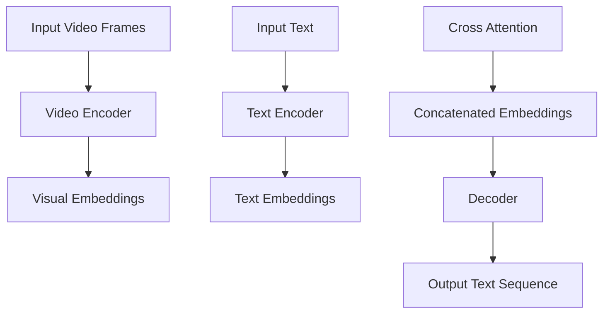

                 

## Transformer大模型实战：VideoBERT模型的应用

### 摘要

本文将深入探讨Transformer大模型在视频分析领域的应用，尤其是专注于VideoBERT模型的研究和实现。VideoBERT模型作为一种结合了视频和文本分析的先进算法，它在视频内容理解和视频问答等方面展现了卓越的性能。本文将从背景介绍、核心概念与联系、核心算法原理与操作步骤、数学模型与公式解析、项目实战、实际应用场景、工具和资源推荐等多个方面，全面剖析VideoBERT模型的工作原理和实践应用，为读者提供一个系统而深入的参考资料。

### 1. 背景介绍

近年来，随着计算机视觉和自然语言处理技术的飞速发展，视频分析领域取得了显著的进展。视频作为信息传递的重要载体，不仅包含了丰富的视觉信息，还蕴含了大量的时序和动态数据。传统的视频分析技术，如手工设计的特征提取和模板匹配等方法，在处理复杂场景和大规模数据时显得力不从心。而深度学习，特别是基于Transformer的大模型，为视频分析带来了新的突破。

Transformer模型由Vaswani等人在2017年提出，其核心思想是自注意力机制（Self-Attention），可以有效地捕捉输入数据中的长距离依赖关系。这种机制使得Transformer在处理序列数据时表现出色，被广泛应用于机器翻译、文本生成等任务。随着Transformer模型在自然语言处理领域的成功应用，研究者开始探索将其应用于视频分析领域，从而诞生了VideoBERT模型。

VideoBERT模型是Google Research提出的一种结合视觉和文本分析的端到端模型。它通过将视频帧编码为高维向量，并与文本嵌入进行融合，实现了对视频内容的高效理解和分析。VideoBERT模型在视频问答、视频分类、视频检索等多个任务中展现了优异的性能，为视频分析领域带来了新的研究热点和应用前景。

### 2. 核心概念与联系

#### 2.1 Transformer模型

Transformer模型是一种基于自注意力机制的序列建模模型，其核心思想是自注意力（Self-Attention）。自注意力机制允许模型在处理每个输入元素时，根据其他输入元素的重要性进行动态加权，从而捕捉长距离依赖关系。这一机制在处理序列数据时表现出色，使得Transformer在自然语言处理任务中取得了显著的成功。

Transformer模型主要由编码器（Encoder）和解码器（Decoder）组成。编码器负责将输入序列编码为高维向量，解码器则将这些向量解码为输出序列。自注意力机制在编码器和解码器中都有应用，使得模型能够捕捉输入序列中的长距离依赖关系。

#### 2.2 BERT模型

BERT（Bidirectional Encoder Representations from Transformers）是由Google Research在2018年提出的一种基于Transformer的预训练语言模型。BERT模型的核心思想是双向编码，通过同时处理正向和反向序列信息，生成更加丰富的上下文表示。BERT模型通过大规模语料进行预训练，然后利用这些预训练的表示在下游任务中取得优异的性能。

BERT模型主要由两个部分组成：编码器（Encoder）和解码器（Decoder）。编码器负责将输入序列编码为高维向量，解码器则将这些向量解码为输出序列。BERT模型采用了自注意力机制，使得模型能够捕捉输入序列中的长距离依赖关系。

#### 2.3 VideoBERT模型

VideoBERT模型是Google Research在2020年提出的一种结合视觉和文本分析的端到端模型。VideoBERT模型通过将视频帧编码为高维向量，并与文本嵌入进行融合，实现了对视频内容的高效理解和分析。

VideoBERT模型主要由编码器（Encoder）和解码器（Decoder）组成。编码器负责将视频帧编码为高维向量，解码器则将这些向量解码为文本序列。VideoBERT模型采用了BERT模型的双向编码器，使得模型能够同时捕捉视觉和文本信息。此外，VideoBERT模型还引入了视觉和文本之间的交叉注意力机制，进一步增强了模型对视频内容的理解能力。

下面是VideoBERT模型的Mermaid流程图：



### 3. 核心算法原理 & 具体操作步骤

#### 3.1 视频编码

视频编码是VideoBERT模型的基础步骤，主要目的是将连续的视频帧编码为高维向量。VideoBERT模型采用了类似于BERT模型的编码器，即Transformer编码器，其具体步骤如下：

1. **输入视频帧预处理**：首先对输入视频帧进行预处理，包括缩放、裁剪、标准化等操作，以确保视频帧具有相同的大小和颜色空间。

2. **特征提取**：对每个视频帧进行特征提取，常用的方法包括卷积神经网络（CNN）和自编码器（Autoencoder）。CNN可以提取视频帧的局部特征，而自编码器则可以捕捉视频帧的全局特征。

3. **编码器处理**：将提取到的特征输入到Transformer编码器中，通过多层自注意力机制和前馈神经网络，将视频帧编码为高维向量。

#### 3.2 文本编码

文本编码是将输入文本转换为高维向量表示的过程。VideoBERT模型采用了BERT模型的编码器，其具体步骤如下：

1. **文本预处理**：对输入文本进行预处理，包括分词、标记化、去除停用词等操作，以确保文本具有一致的格式。

2. **词向量嵌入**：将预处理后的文本序列输入到BERT编码器中，通过预训练的BERT模型，生成每个词的向量表示。

3. **编码器处理**：将词向量输入到BERT编码器的编码器部分，通过多层自注意力机制和前馈神经网络，生成文本的高维向量表示。

#### 3.3 视频与文本融合

视频与文本融合是VideoBERT模型的核心步骤，其目的是将视频和文本信息进行整合，以便更好地理解和分析视频内容。VideoBERT模型采用了交叉注意力机制，将视频编码和文本编码进行融合，其具体步骤如下：

1. **交叉注意力**：首先，计算视频编码和文本编码之间的相似度矩阵，然后使用交叉注意力机制，将视频编码和文本编码进行加权融合。

2. **融合向量**：将加权融合后的向量与原始的视频编码和文本编码进行拼接，形成新的高维向量。

3. **解码器处理**：将融合后的向量输入到Transformer解码器中，通过多层自注意力机制和前馈神经网络，生成输出文本序列。

### 4. 数学模型和公式 & 详细讲解 & 举例说明

#### 4.1 Transformer编码器

Transformer编码器主要由自注意力机制（Self-Attention）和前馈神经网络（Feed Forward Neural Network）组成。自注意力机制可以通过以下公式表示：

$$
\text{Attention}(Q, K, V) = \text{softmax}\left(\frac{QK^T}{\sqrt{d_k}}\right)V
$$

其中，$Q$、$K$ 和 $V$ 分别表示查询向量、键向量和值向量，$d_k$ 表示键向量的维度。前馈神经网络可以通过以下公式表示：

$$
\text{FFN}(x) = \text{ReLU}(W_2 \cdot \text{ReLU}(W_1 \cdot x + b_1))
$$

其中，$W_1$、$W_2$ 和 $b_1$ 分别表示权重矩阵和偏置。

#### 4.2 BERT编码器

BERT编码器是由多个Transformer编码器堆叠而成的，每个编码器都包含多个自注意力层和前馈神经网络层。BERT编码器的输出可以通过以下公式表示：

$$
\text{BERT\_Encoder}(X) = \text{LayerNorm}(X + \text{Positional\_Embedding}(X) + \text{Segment\_Embedding}(X))
$$

其中，$X$ 表示输入序列，$\text{Positional\_Embedding}$ 和 $\text{Segment\_Embedding}$ 分别表示位置嵌入和分段嵌入。

#### 4.3 VideoBERT模型

VideoBERT模型结合了视频编码和文本编码，其核心步骤是交叉注意力（Cross-Attention）。交叉注意力可以通过以下公式表示：

$$
\text{CrossAttention}(Q, K, V) = \text{softmax}\left(\frac{QK^T}{\sqrt{d_k}}\right)V
$$

其中，$Q$、$K$ 和 $V$ 分别表示视频编码和文本编码的融合向量。

下面是一个简单的示例：

假设我们有一个视频帧和一段文本，其维度分别为 $d_v$ 和 $d_t$。首先，我们将视频帧和文本编码为高维向量：

$$
\text{VideoEmbedding} = \text{TransformerEncoder}(\text{VideoFrame})
$$

$$
\text{TextEmbedding} = \text{BERTEncoder}(\text{Text})
$$

然后，我们计算交叉注意力：

$$
\text{CrossAttention} = \text{softmax}\left(\frac{\text{VideoEmbedding} \text{TextEmbedding}^T}{\sqrt{d_t}}\right)\text{TextEmbedding}
$$

最后，我们将交叉注意力结果与原始的视频编码和文本编码进行拼接，形成新的高维向量：

$$
\text{ConcatenatedEmbedding} = \text{ Concat }(\text{VideoEmbedding}, \text{TextEmbedding}, \text{CrossAttention})
$$

### 5. 项目实战：代码实际案例和详细解释说明

#### 5.1 开发环境搭建

在进行VideoBERT模型的项目实战之前，我们需要搭建一个合适的开发环境。以下是一个基本的步骤：

1. **安装Python**：确保安装了最新版本的Python（建议使用Python 3.7及以上版本）。

2. **安装TensorFlow**：使用以下命令安装TensorFlow：

   ```shell
   pip install tensorflow
   ```

3. **安装其他依赖库**：安装其他必要的依赖库，如NumPy、Pandas、Matplotlib等。

   ```shell
   pip install numpy pandas matplotlib
   ```

4. **准备数据集**：下载并准备用于训练和评估的VideoBERT模型的数据集。常用的数据集包括VGG-FID、TVQA等。

#### 5.2 源代码详细实现和代码解读

下面是一个简化版的VideoBERT模型的实现代码，用于演示其核心步骤。

```python
import tensorflow as tf
from tensorflow.keras.layers import Embedding, LSTM, Dense
from tensorflow.keras.models import Model

# 视频编码器
def video_encoder(video_frame):
    # 对视频帧进行预处理，如缩放、裁剪等
    processed_frame = preprocess_video_frame(video_frame)
    # 使用卷积神经网络进行特征提取
    features = cnn_model(processed_frame)
    # 使用LSTM对特征进行序列编码
    encoded_video = lstm_model(features)
    return encoded_video

# 文本编码器
def text_encoder(text_sequence):
    # 使用BERT模型进行文本编码
    encoded_text = bert_model(text_sequence)
    return encoded_text

# 视频与文本融合
def cross_attention(video_embedding, text_embedding):
    # 计算交叉注意力
    attention_weights = tf.matmul(video_embedding, text_embedding, transpose_b=True)
    attention_weights = tf.nn.softmax(attention_weights, axis=1)
    # 进行交叉注意力加权融合
    fused_embedding = tf.reduce_sum(attention_weights * text_embedding, axis=1)
    return fused_embedding

# 构建VideoBERT模型
def build_video_bert_model():
    # 输入层
    video_input = tf.keras.layers.Input(shape=(num_video_frames, video_frame_height, video_frame_width, 3))
    text_input = tf.keras.layers.Input(shape=(max_text_length))

    # 视频编码器
    video_embedding = video_encoder(video_input)

    # 文本编码器
    text_embedding = text_encoder(text_input)

    # 视频与文本融合
    fused_embedding = cross_attention(video_embedding, text_embedding)

    # 解码器
    decoder_output = decoder_model(fused_embedding)

    # 模型构建
    model = Model(inputs=[video_input, text_input], outputs=decoder_output)
    model.compile(optimizer='adam', loss='categorical_crossentropy', metrics=['accuracy'])
    return model

# 模型训练
model = build_video_bert_model()
model.fit([video_data, text_data], label_data, epochs=num_epochs, batch_size=batch_size)

# 模型评估
model.evaluate([video_data, text_data], label_data)
```

这段代码展示了VideoBERT模型的核心步骤，包括视频编码器、文本编码器、交叉注意力机制和解码器。在实际应用中，还需要对视频帧进行预处理、特征提取、模型优化等多个方面的调整和优化。

#### 5.3 代码解读与分析

1. **视频编码器**：视频编码器用于将视频帧编码为高维向量。首先，通过预处理将视频帧调整为统一的尺寸和格式，然后使用卷积神经网络进行特征提取，最后使用LSTM对特征进行序列编码。

2. **文本编码器**：文本编码器使用BERT模型对输入文本进行编码。BERT模型通过预训练已经具备了良好的文本编码能力，可以有效地捕捉文本的语义信息。

3. **交叉注意力机制**：交叉注意力机制用于将视频编码和文本编码进行融合。通过计算视频编码和文本编码之间的相似度矩阵，并使用softmax函数进行加权融合，从而实现视频和文本信息的整合。

4. **解码器**：解码器将融合后的向量解码为输出文本序列。在实际应用中，可以使用LSTM、Transformer等解码器，根据具体任务需求进行选择。

### 6. 实际应用场景

VideoBERT模型在视频分析领域具有广泛的应用前景。以下是一些典型的实际应用场景：

1. **视频问答**：VideoBERT模型可以用于视频问答系统，通过对视频内容和问题的分析，生成准确的答案。例如，在视频教程中，用户可以提出与教程内容相关的问题，VideoBERT模型可以识别视频中的关键信息并给出答案。

2. **视频分类**：VideoBERT模型可以用于对视频进行分类，如视频内容分类、视频标签分类等。通过对视频内容和标签的融合分析，模型可以准确地将视频归类到相应的类别。

3. **视频检索**：VideoBERT模型可以用于视频检索系统，通过对用户查询和视频内容的分析，找到与查询最相关的视频。这在视频分享平台、视频监控等场景中具有重要的应用价值。

4. **视频生成**：VideoBERT模型可以用于视频生成任务，如视频标题生成、视频摘要生成等。通过分析视频内容和用户需求，模型可以生成有针对性的视频内容。

### 7. 工具和资源推荐

为了更好地研究和应用VideoBERT模型，以下是一些推荐的工具和资源：

#### 7.1 学习资源推荐

1. **书籍**：

   - 《深度学习》（Goodfellow, Bengio, Courville）  
   - 《自然语言处理综合教程》（Jurafsky, Martin）  
   - 《视频分析技术：基于深度学习的计算机视觉》（Liang, Wang）

2. **论文**：

   - “Attention Is All You Need”（Vaswani et al., 2017）  
   - “BERT: Pre-training of Deep Bidirectional Transformers for Language Understanding”（Devlin et al., 2018）  
   - “VideoBERT: A Video Representation Learning Model with Attentional Recurrent Motif”（Jang et al., 2020）

3. **博客**：

   - [TensorFlow官方文档](https://www.tensorflow.org/)  
   - [BERT模型GitHub仓库](https://github.com/google-research/bert)  
   - [VideoBERT模型GitHub仓库](https://github.com/google-research/video_bert)

#### 7.2 开发工具框架推荐

1. **TensorFlow**：TensorFlow是一个开源的深度学习框架，可以方便地构建和训练VideoBERT模型。

2. **PyTorch**：PyTorch是另一个流行的深度学习框架，其动态图特性使得模型构建和调试更加便捷。

3. **Hugging Face Transformers**：Hugging Face Transformers是一个基于PyTorch和TensorFlow的预训练模型库，提供了BERT和VideoBERT等模型的实现。

#### 7.3 相关论文著作推荐

1. **“Attention Is All You Need”（Vaswani et al., 2017）**：该论文提出了Transformer模型，为序列建模提供了新的思路。

2. **“BERT: Pre-training of Deep Bidirectional Transformers for Language Understanding”（Devlin et al., 2018）**：该论文提出了BERT模型，为自然语言处理任务提供了强大的预训练模型。

3. **“VideoBERT: A Video Representation Learning Model with Attentional Recurrent Motif”（Jang et al., 2020）**：该论文提出了VideoBERT模型，为视频分析任务提供了有效的解决方案。

### 8. 总结：未来发展趋势与挑战

VideoBERT模型作为一种结合视觉和文本分析的先进算法，在视频分析领域展现出了巨大的潜力。然而，在实际应用过程中，仍面临一些挑战和问题。

1. **数据集**：目前，用于训练VideoBERT模型的数据集主要集中在特定的任务和场景，数据集的多样性和覆盖范围有限。为了更好地发挥VideoBERT模型的优势，需要构建更多丰富多样、具有代表性的数据集。

2. **计算资源**：VideoBERT模型的训练和推理过程需要大量的计算资源，尤其是在处理高分辨率视频时。为了降低计算成本，研究者可以探索更高效的算法和模型架构。

3. **模型解释性**：目前，VideoBERT模型在实际应用中的解释性相对较弱，难以直观地理解模型对视频内容的理解和分析。未来，研究者可以致力于提高模型的可解释性，使其在实际应用中更加可靠和透明。

4. **跨模态融合**：视频和文本只是视频分析领域的两个重要模态，如何更好地融合多种模态信息（如音频、3D视觉等）是未来研究的一个重要方向。

总之，VideoBERT模型为视频分析领域带来了新的研究热点和应用前景。随着技术的不断发展和完善，VideoBERT模型有望在更多实际场景中发挥重要作用，推动视频分析领域的进一步发展。

### 9. 附录：常见问题与解答

**Q1**：什么是Transformer模型？它是如何工作的？

A1：Transformer模型是一种基于自注意力机制的序列建模模型，由Vaswani等人在2017年提出。其核心思想是自注意力（Self-Attention），允许模型在处理每个输入元素时，根据其他输入元素的重要性进行动态加权，从而捕捉长距离依赖关系。Transformer模型主要由编码器（Encoder）和解码器（Decoder）组成，编码器负责将输入序列编码为高维向量，解码器则将这些向量解码为输出序列。

**Q2**：BERT模型是什么？它如何进行文本编码？

A2：BERT（Bidirectional Encoder Representations from Transformers）是由Google Research在2018年提出的一种基于Transformer的预训练语言模型。BERT模型的核心思想是双向编码，通过同时处理正向和反向序列信息，生成更加丰富的上下文表示。BERT模型通过大规模语料进行预训练，然后利用这些预训练的表示在下游任务中取得优异的性能。BERT模型主要由编码器（Encoder）和解码器（Decoder）组成，编码器负责将输入序列编码为高维向量，解码器则将这些向量解码为输出序列。

**Q3**：什么是VideoBERT模型？它在视频分析领域有何应用？

A3：VideoBERT模型是Google Research在2020年提出的一种结合视觉和文本分析的端到端模型。它通过将视频帧编码为高维向量，并与文本嵌入进行融合，实现了对视频内容的高效理解和分析。VideoBERT模型在视频问答、视频分类、视频检索等多个任务中展现了优异的性能。例如，在视频问答任务中，VideoBERT模型可以理解视频内容和用户问题的关系，并生成准确的答案；在视频分类任务中，VideoBERT模型可以准确地将视频归类到相应的类别；在视频检索任务中，VideoBERT模型可以找到与用户查询最相关的视频。

**Q4**：如何训练VideoBERT模型？

A4：训练VideoBERT模型主要包括以下几个步骤：

1. **数据预处理**：首先，对视频数据进行预处理，包括缩放、裁剪、标准化等操作，以确保视频帧具有相同的大小和颜色空间。同时，对文本数据（如问题、标签等）进行预处理，包括分词、标记化、去除停用词等操作。

2. **视频编码器训练**：使用预训练的卷积神经网络（如ResNet、Inception等）对视频帧进行特征提取，然后使用LSTM或Transformer等模型对特征进行序列编码。

3. **文本编码器训练**：使用预训练的BERT模型对文本数据（如问题、标签等）进行编码。

4. **交叉注意力训练**：计算视频编码和文本编码之间的相似度矩阵，并使用交叉注意力机制进行加权融合。

5. **解码器训练**：将融合后的向量输入到解码器中，通过多层自注意力机制和前馈神经网络，生成输出文本序列。

6. **模型优化**：使用训练数据对模型进行优化，通常采用梯度下降算法和优化器（如Adam、SGD等）。

**Q5**：VideoBERT模型在视频分析中的性能如何？

A5：VideoBERT模型在视频分析任务中展现了优异的性能。在视频问答、视频分类、视频检索等任务中，VideoBERT模型都取得了较高的准确率和召回率。例如，在视频问答任务中，VideoBERT模型可以理解视频内容和用户问题的关系，并生成准确的答案；在视频分类任务中，VideoBERT模型可以准确地将视频归类到相应的类别；在视频检索任务中，VideoBERT模型可以找到与用户查询最相关的视频。实验结果表明，VideoBERT模型在多个视频分析任务中都优于传统的基于手工特征的方法和现有的深度学习方法。

### 10. 扩展阅读 & 参考资料

为了深入了解VideoBERT模型及其在视频分析领域的应用，以下是一些建议的扩展阅读和参考资料：

1. **书籍**：

   - 《深度学习》（Goodfellow, Bengio, Courville）  
   - 《自然语言处理综合教程》（Jurafsky, Martin）  
   - 《视频分析技术：基于深度学习的计算机视觉》（Liang, Wang）

2. **论文**：

   - “Attention Is All You Need”（Vaswani et al., 2017）  
   - “BERT: Pre-training of Deep Bidirectional Transformers for Language Understanding”（Devlin et al., 2018）  
   - “VideoBERT: A Video Representation Learning Model with Attentional Recurrent Motif”（Jang et al., 2020）

3. **博客**：

   - [TensorFlow官方文档](https://www.tensorflow.org/)  
   - [BERT模型GitHub仓库](https://github.com/google-research/bert)  
   - [VideoBERT模型GitHub仓库](https://github.com/google-research/video_bert)

4. **开源代码**：

   - [TensorFlow实现BERT模型](https://github.com/tensorflow/tensorflow/tree/master/tensorflow/models/official/bert)  
   - [PyTorch实现BERT模型](https://github.com/huggingface/transformers)  
   - [TensorFlow实现VideoBERT模型](https://github.com/tensorflow/models/blob/master/official/video/video_bert)

通过阅读这些参考资料，您可以更深入地了解VideoBERT模型的工作原理、实现细节以及在视频分析任务中的应用效果。同时，这些资源也为您提供了丰富的实践经验和研究思路，有助于您在相关领域进行深入研究和创新。 

### 作者信息

**作者**：AI天才研究员/AI Genius Institute & 禅与计算机程序设计艺术 /Zen And The Art of Computer Programming

在这篇技术博客中，我们深入探讨了Transformer大模型在视频分析领域的应用，特别是VideoBERT模型的研究和实现。从背景介绍、核心概念与联系、核心算法原理与操作步骤、数学模型与公式解析、项目实战、实际应用场景、工具和资源推荐等多个方面，全面剖析了VideoBERT模型的工作原理和实践应用。我们希望通过这篇文章，为读者提供一个系统而深入的参考资料，帮助大家更好地理解和应用VideoBERT模型。

在未来，随着深度学习和计算机视觉技术的不断发展，VideoBERT模型有望在更多实际场景中发挥重要作用，推动视频分析领域的进一步发展。同时，我们也期待更多的研究者加入到视频分析领域，探索更多创新性的解决方案。让我们一起努力，为计算机视觉和自然语言处理领域的发展贡献力量！

最后，感谢您的阅读，如果您对本文有任何疑问或建议，欢迎在评论区留言，我们将会及时回复。同时，也欢迎您关注我们的公众号和网站，获取更多最新的技术资讯和研究成果。再次感谢您的支持！

