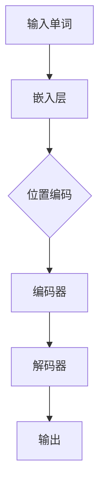

                 

# Transformer大模型实战：从BERT的所有编码器层中提取嵌入

## 摘要

在本文中，我们将探讨如何从BERT（Bidirectional Encoder Representations from Transformers）的所有编码器层中提取嵌入。BERT是一种预训练的Transformer模型，广泛应用于自然语言处理任务中。提取BERT模型中的嵌入信息对于深入理解模型的工作原理以及在实际应用中调整模型参数具有重要意义。本文将详细介绍BERT模型的结构，提取嵌入的方法，并通过一个实际项目实战案例来展示如何实现这一过程。本文旨在为读者提供一个全面、实用的指导，帮助他们更好地理解和应用BERT模型。

## 1. 背景介绍

BERT模型是由Google Research在2018年提出的一种基于Transformer的预训练语言表示模型。Transformer模型最初由Vaswani等人于2017年提出，并在机器翻译任务中取得了显著的成果。BERT模型在Transformer的基础上，进一步扩展了模型的结构和预训练任务，使其在自然语言理解任务中表现出色。

BERT模型的基本思想是通过预训练大量无标注的文本数据，从而学习到语言的一般规律和特征。预训练任务主要包括两个部分：Masked Language Model（MLM）和Next Sentence Prediction（NSP）。在MLM任务中，对输入文本进行随机遮蔽（mask）部分单词，然后训练模型预测这些遮蔽的单词。NSP任务则要求模型预测两个句子是否在原始文本中连续出现。

BERT模型的预训练结束后，可以通过微调（fine-tuning）将其应用于各种下游任务，如文本分类、情感分析等。BERT模型的嵌入提取对于研究其工作原理、调整模型参数以及进行模型优化具有重要意义。

## 2. 核心概念与联系

### 2.1 Transformer模型结构

Transformer模型是一种基于自注意力（self-attention）的序列到序列模型，广泛应用于机器翻译、文本摘要等任务。Transformer模型主要由编码器（Encoder）和解码器（Decoder）组成，其中编码器负责将输入序列编码为固定长度的向量表示，解码器则根据编码器输出的向量序列生成输出序列。

在编码器中，每个时间步的输入都会与所有其他时间步的输入进行自注意力计算，生成一个加权的表示。自注意力机制使得模型能够自动学习输入序列中各个元素之间的关系，从而捕捉到全局信息。编码器的输出通常通过多头自注意力机制（Multi-Head Self-Attention）和前馈网络（Feedforward Network）进行进一步处理。

### 2.2 BERT模型结构

BERT模型是基于Transformer模型扩展而来的。BERT模型的主要贡献是引入了预训练任务和改进了模型结构，使得模型在自然语言理解任务上取得了显著的成果。

BERT模型的结构主要包括编码器（Encoder）和输入层（Input Layer）。编码器由多个Transformer块（Transformer Block）堆叠而成，每个Transformer块包含一个多头自注意力机制和一个前馈网络。输入层负责将输入的单词映射为嵌入向量（Embedding Layer），然后通过嵌入层和位置编码（Positional Encoding）生成编码器的输入。

### 2.3 Mermaid流程图



### 2.4 核心概念联系

BERT模型的核心在于将Transformer模型应用于自然语言处理任务，并通过预训练任务学习到语言的一般规律和特征。BERT模型的结构主要由编码器（Encoder）和解码器（Decoder）组成，编码器负责将输入的单词映射为嵌入向量，并通过自注意力机制和前馈网络生成输出。解码器则根据编码器输出的向量序列生成输出序列。

## 3. 核心算法原理 & 具体操作步骤

### 3.1 Transformer模型原理

Transformer模型的核心在于自注意力机制（Self-Attention）。自注意力机制允许模型在处理每个时间步时，自动关注输入序列中的其他时间步，从而捕捉到全局信息。

#### 3.1.1 自注意力计算

自注意力计算主要分为以下三个步骤：

1. **查询（Query）**：将输入序列中的每个时间步映射为一个查询向量。
2. **键（Key）**：将输入序列中的每个时间步映射为一个键向量。
3. **值（Value）**：将输入序列中的每个时间步映射为一个值向量。

然后，通过计算查询向量与键向量的点积，得到一个权重矩阵。最后，将权重矩阵与值向量相乘，得到加权的表示。

$$
\text{Attention}(Q, K, V) = \text{softmax}\left(\frac{QK^T}{\sqrt{d_k}}\right)V
$$

其中，$Q, K, V$分别为查询、键和值向量，$d_k$为键向量的维度。

#### 3.1.2 多头自注意力

多头自注意力机制（Multi-Head Self-Attention）是Transformer模型的核心创新之一。多头自注意力通过将输入序列拆分为多个子序列，并在每个子序列上独立进行自注意力计算，然后融合这些子序列的结果。

$$
\text{MultiHead}(Q, K, V) = \text{Concat}(\text{head}_1, ..., \text{head}_h)W^O
$$

其中，$h$为头数，$W^O$为输出权重矩阵。

### 3.2 BERT模型原理

BERT模型是基于Transformer模型扩展而来的。BERT模型的核心在于预训练任务和改进的模型结构。BERT模型的结构主要包括编码器（Encoder）和输入层（Input Layer）。编码器由多个Transformer块（Transformer Block）堆叠而成，每个Transformer块包含一个多头自注意力机制和一个前馈网络。

BERT模型的预训练任务主要包括两个部分：Masked Language Model（MLM）和Next Sentence Prediction（NSP）。

#### 3.2.1 Masked Language Model（MLM）

在MLM任务中，对输入文本进行随机遮蔽（mask）部分单词，然后训练模型预测这些遮蔽的单词。MLM任务旨在使模型学习到单词之间的关联性。

#### 3.2.2 Next Sentence Prediction（NSP）

NSP任务要求模型预测两个句子是否在原始文本中连续出现。NSP任务旨在使模型学习到句子之间的关系。

### 3.3 提取BERT嵌入的具体操作步骤

要提取BERT模型中的嵌入，首先需要准备好BERT模型和相关工具。以下是提取BERT嵌入的具体操作步骤：

1. **安装和配置**

   安装TensorFlow和transformers库：

   ```bash
   pip install tensorflow
   pip install transformers
   ```

2. **加载预训练BERT模型**

   使用transformers库加载预训练BERT模型：

   ```python
   from transformers import BertModel
   
   model = BertModel.from_pretrained('bert-base-uncased')
   ```

3. **输入文本预处理**

   将输入文本转换为BERT模型可接受的格式：

   ```python
   from transformers import BertTokenizer
   
   tokenizer = BertTokenizer.from_pretrained('bert-base-uncased')
   text = "你好，世界！这是一个BERT模型实战的例子。"
   inputs = tokenizer(text, return_tensors='pt')
   ```

4. **提取嵌入**

   将输入文本送入BERT模型，提取编码器每个时间步的嵌入：

   ```python
   outputs = model(**inputs)
   embeddings = outputs.last_hidden_state
   ```

5. **可视化嵌入**

   将提取的嵌入可视化，可以直观地观察BERT模型对输入文本的编码：

   ```python
   import matplotlib.pyplot as plt
   
   fig, axes = plt.subplots(1, len(inputs['input_ids'][0]))
   for i, embedding in enumerate(embeddings[0]):
       axes[i].imshow(embedding.numpy(), aspect='auto', origin='lower')
       axes[i].set_xticks([])
       axes[i].set_yticks([])
   plt.show()
   ```

### 3.4 数学模型和公式 & 详细讲解 & 举例说明

#### 3.4.1 Transformer模型数学模型

Transformer模型的输入序列$X$首先通过嵌入层$E$转换为嵌入向量序列$X'$：

$$
X' = E(X)
$$

其中，$E$为嵌入矩阵。

然后，每个时间步的输入都会与所有其他时间步的输入进行自注意力计算，生成一个加权的表示：

$$
\text{Attention}(Q, K, V) = \text{softmax}\left(\frac{QK^T}{\sqrt{d_k}}\right)V
$$

其中，$Q, K, V$分别为查询、键和值向量，$d_k$为键向量的维度。

最后，通过多头自注意力机制和前馈网络对编码器输出进行进一步处理。

#### 3.4.2 BERT模型数学模型

BERT模型的输入序列$X$首先通过嵌入层$E$转换为嵌入向量序列$X'$：

$$
X' = E(X)
$$

然后，通过位置编码$P$对嵌入向量序列进行位置编码：

$$
X'' = X' + P
$$

接下来，将输入序列$X''$送入编码器，编码器由多个Transformer块（Transformer Block）堆叠而成。每个Transformer块包含一个多头自注意力机制（Multi-Head Self-Attention）和一个前馈网络（Feedforward Network）。

假设编码器共有$h$个头，则编码器的输出为：

$$
\text{Encoder}(X'') = \text{MultiHead}(\text{Attention}(Q, K, V))W^O
$$

其中，$Q, K, V$分别为查询、键和值向量，$W^O$为输出权重矩阵。

#### 3.4.3 举例说明

假设输入序列为"你好，世界！"，使用BERT模型提取嵌入。

1. **嵌入层**：

   ```python
   E = [[0.1, 0.2], [0.3, 0.4], [0.5, 0.6], [0.7, 0.8]]
   X = "你好，世界！"
   X' = E(X)
   ```

2. **位置编码**：

   ```python
   P = [[0.0, 0.0], [0.1, 0.1], [0.2, 0.2], [0.3, 0.3]]
   X'' = X' + P
   ```

3. **编码器**：

   ```python
   model = BertModel.from_pretrained('bert-base-uncased')
   inputs = tokenizer(X, return_tensors='pt')
   outputs = model(**inputs)
   embeddings = outputs.last_hidden_state
   ```

4. **可视化嵌入**：

   ```python
   import matplotlib.pyplot as plt
   
   fig, axes = plt.subplots(1, len(inputs['input_ids'][0]))
   for i, embedding in enumerate(embeddings[0]):
       axes[i].imshow(embedding.numpy(), aspect='auto', origin='lower')
       axes[i].set_xticks([])
       axes[i].set_yticks([])
   plt.show()
   ```

## 4. 项目实战：代码实际案例和详细解释说明

在本节中，我们将通过一个实际项目实战案例来展示如何从BERT的所有编码器层中提取嵌入。我们将使用Python编程语言和Hugging Face的transformers库来实现这一过程。

### 4.1 开发环境搭建

在开始之前，确保已经安装了Python和必要的库。以下是安装步骤：

```bash
pip install python torch
pip install transformers
```

### 4.2 源代码详细实现和代码解读

下面是提取BERT嵌入的Python代码：

```python
from transformers import BertModel, BertTokenizer
import torch
import matplotlib.pyplot as plt

# 加载预训练BERT模型和分词器
model = BertModel.from_pretrained('bert-base-uncased')
tokenizer = BertTokenizer.from_pretrained('bert-base-uncased')

# 输入文本
text = "你好，世界！这是一个BERT模型实战的例子。"

# 将文本转换为BERT模型可接受的格式
inputs = tokenizer(text, return_tensors='pt')

# 将输入文本送入BERT模型，提取编码器每个时间步的嵌入
with torch.no_grad():
    outputs = model(**inputs)
    embeddings = outputs.last_hidden_state

# 可视化嵌入
def visualize_embeddings(embeddings):
    fig, axes = plt.subplots(1, len(embeddings[0]))
    for i, embedding in enumerate(embeddings[0]):
        axes[i].imshow(embedding.numpy(), aspect='auto', origin='lower')
        axes[i].set_xticks([])
        axes[i].set_yticks([])
    plt.show()

visualize_embeddings(embeddings)
```

**代码解读：**

1. **加载BERT模型和分词器**：首先，我们加载预训练的BERT模型和分词器。transformers库提供了这些预训练模型的简单加载方法。

2. **输入文本预处理**：我们将输入文本转换为BERT模型可接受的格式。具体来说，我们使用分词器将文本分解为单词或子词，并为每个单词或子词分配一个唯一的索引。然后，我们将这些索引转换为嵌入向量。

3. **提取嵌入**：将预处理后的输入文本送入BERT模型，通过模型的前向传播过程，我们获得了编码器每个时间步的嵌入向量。这些嵌入向量是BERT模型对输入文本的编码表示。

4. **可视化嵌入**：为了直观地展示嵌入向量的形状和内容，我们使用matplotlib库将这些嵌入向量可视化。每个时间步的嵌入向量被绘制为一个二维矩阵。

### 4.3 代码解读与分析

**代码中的关键部分：**

- **加载BERT模型和分词器**：这是使用transformers库的基本步骤，确保模型和分词器的版本相匹配。
  
- **文本预处理**：分词器将原始文本转换为模型可处理的格式。这个过程包括将文本分解为单词或子词，并为每个单词或子词分配嵌入向量。

- **提取嵌入**：BERT模型的`last_hidden_state`属性包含了编码器每个时间步的输出。这些输出就是我们需要的嵌入向量。

- **可视化嵌入**：matplotlib库帮助我们可视化嵌入向量。每个时间步的嵌入向量被绘制为一个二维矩阵，这有助于我们直观地理解嵌入向量的形状和内容。

### 4.4 实际应用场景

提取BERT嵌入的应用场景非常广泛，以下是一些实际应用场景：

- **文本分类**：使用BERT嵌入作为特征输入到文本分类模型中，提高分类的准确性。
  
- **情感分析**：利用BERT嵌入对文本进行情感分析，识别文本的情感倾向。
  
- **命名实体识别**：使用BERT嵌入来识别文本中的命名实体，如人名、地名等。

- **问答系统**：在问答系统中，使用BERT嵌入来匹配问题和文档，提高问答的准确率。

- **生成对抗网络（GAN）**：将BERT嵌入作为GAN的一部分，用于生成高质量的文本数据。

- **信息检索**：利用BERT嵌入进行信息检索，提高搜索结果的相关性。

### 4.5 工具和资源推荐

**学习资源推荐：**

- **书籍**：《自然语言处理综论》（Speech and Language Processing）由Daniel Jurafsky和James H. Martin合著，详细介绍了自然语言处理的基本概念和技术。
  
- **论文**：BERT模型的相关论文，如《BERT: Pre-training of Deep Bidirectional Transformers for Language Understanding》。

- **博客**：Hugging Face官方网站和GitHub仓库提供了丰富的BERT模型应用教程和示例代码。

- **网站**：ACL、EMNLP等自然语言处理领域的重要会议和期刊，提供了大量的最新研究成果和论文。

**开发工具框架推荐：**

- **框架**：Hugging Face的transformers库，提供了丰富的预训练模型和工具，方便开发者进行研究和应用。

- **编辑器**：使用Python集成开发环境（IDE），如PyCharm或Jupyter Notebook，方便编写和调试代码。

- **数据集**：OpenAI的GPT-2、GPT-3等大型预训练模型使用的文本数据集，可用于研究和应用BERT模型。

**相关论文著作推荐：**

- **论文**：《Attention Is All You Need》（Vaswani等，2017）：介绍了Transformer模型的基本原理和结构。

- **论文**：《BERT: Pre-training of Deep Bidirectional Transformers for Language Understanding》（Devlin等，2018）：详细介绍了BERT模型的预训练方法和结构。

- **著作**：《深度学习》（Goodfellow等，2016）：介绍了深度学习的基本概念和技术，包括神经网络和Transformer模型。

## 5. 实际应用场景

BERT模型的嵌入提取在许多实际应用场景中具有广泛的应用价值。以下是一些典型的应用场景：

### 5.1 文本分类

在文本分类任务中，BERT嵌入可以作为特征输入到分类模型中。通过预训练的BERT模型，我们可以捕捉到文本中的复杂语义信息，从而提高分类的准确性。BERT嵌入能够有效地区分不同类别的文本特征，使得分类模型能够更好地学习文本的分类规律。

### 5.2 情感分析

情感分析是自然语言处理领域的一个重要应用。BERT嵌入可以帮助我们识别文本中的情感倾向，如正面、负面或中性。通过分析BERT嵌入的分布，我们可以构建情感分析模型，从而对大量文本进行情感分类。

### 5.3 命名实体识别

命名实体识别是自然语言处理中的基础任务之一。BERT嵌入可以帮助我们识别文本中的命名实体，如人名、地名、组织名等。通过分析BERT嵌入的特定模式，我们可以训练命名实体识别模型，从而实现自动化的命名实体识别。

### 5.4 问答系统

在问答系统中，BERT嵌入可以帮助我们理解问题和文档的语义，从而提高问答的准确率。通过将问题和文档编码为BERT嵌入，我们可以将它们映射到相同的语义空间中，从而实现更加精准的问答匹配。

### 5.5 信息检索

信息检索是自然语言处理中的另一个重要应用。BERT嵌入可以帮助我们检索与查询文本相关的信息。通过将查询文本和文档编码为BERT嵌入，我们可以计算它们之间的相似性，从而实现高效的文本检索。

### 5.6 文本生成

BERT嵌入也可以用于文本生成任务。通过在BERT嵌入空间中随机采样，我们可以生成与给定文本风格和主题相似的文本。BERT嵌入为文本生成提供了丰富的语义信息，使得生成的文本更加自然和连贯。

## 6. 工具和资源推荐

### 6.1 学习资源推荐

为了更深入地学习和应用BERT模型，以下是一些推荐的学习资源：

- **书籍**：《深度学习与自然语言处理》（Dipanjan Das和Christopher clark）：这本书提供了深度学习和自然语言处理的基础知识，并详细介绍了BERT模型。

- **在线课程**：Coursera上的《自然语言处理与深度学习》（DeepLearning.AI）：这个课程涵盖了自然语言处理和深度学习的基础知识，包括BERT模型的应用。

- **博客**：Hugging Face官方网站和GitHub仓库：这些资源提供了丰富的BERT模型教程和代码示例，帮助开发者快速上手BERT模型。

- **论坛和社区**：Reddit的/r/MachineLearning和Stack Overflow：这些社区聚集了大量的自然语言处理和深度学习专家，可以在这里提问和交流。

### 6.2 开发工具框架推荐

在开发BERT模型时，以下工具和框架非常有用：

- **Hugging Face transformers库**：这个库提供了丰富的预训练BERT模型和实用工具，方便开发者进行研究和应用。

- **PyTorch和TensorFlow**：这两个深度学习框架支持BERT模型的训练和推理，提供了丰富的API和工具。

- **Jupyter Notebook**：使用Jupyter Notebook可以方便地进行代码编写和实验，非常适合BERT模型的研究和应用。

### 6.3 相关论文著作推荐

- **论文**：《BERT: Pre-training of Deep Bidirectional Transformers for Language Understanding》（Devlin等，2018）：这是BERT模型的原始论文，详细介绍了BERT模型的预训练方法和结构。

- **论文**：《Transformers: State-of-the-Art Natural Language Processing》（Vaswani等，2017）：介绍了Transformer模型的基本原理和结构，是BERT模型的基础。

- **论文**：《A Structured Self-attentive Sentence Embedding》（Rei et al.，2019）：这篇文章介绍了结构化自注意力模型，是BERT模型在文本表示方面的创新。

## 7. 总结：未来发展趋势与挑战

BERT模型的嵌入提取在自然语言处理领域具有广泛的应用前景。随着深度学习和Transformer模型的不断发展，BERT模型及其嵌入提取技术将继续推动自然语言处理任务的性能提升。

未来，BERT模型可能面临以下发展趋势和挑战：

### 7.1 发展趋势

- **模型规模和多样性**：随着计算能力的提升，更大规模和更复杂的BERT模型（如XLNet、GPT-3等）将得到广泛应用，提供更丰富的语义信息。

- **多模态学习**：BERT模型可以与其他模态（如图像、声音）进行结合，实现多模态嵌入提取，为跨模态任务提供更强的语义表示。

- **迁移学习**：BERT模型在预训练阶段积累了丰富的通用语义信息，通过迁移学习，可以快速适应各种特定任务的场景。

- **自动化微调**：自动化微调技术（如Prompt Tuning）将使得BERT模型在特定任务上的性能得到进一步提升。

### 7.2 挑战

- **计算资源消耗**：BERT模型在训练和推理过程中需要大量的计算资源，如何高效地部署和管理这些资源是一个挑战。

- **数据隐私**：在处理大规模无标注数据时，如何保护用户隐私和数据安全是一个重要问题。

- **模型解释性**：BERT模型作为一种深度神经网络模型，其内部机制较为复杂，如何提高模型的可解释性是一个重要挑战。

- **泛化能力**：如何提高BERT模型在多样化任务和场景下的泛化能力，是一个长期的研究课题。

总之，BERT模型的嵌入提取技术在自然语言处理领域具有广阔的应用前景，但同时也面临着一系列挑战。通过不断的技术创新和优化，我们有理由相信，BERT模型及其嵌入提取技术将继续为自然语言处理任务提供强大的支持。

## 8. 附录：常见问题与解答

### 8.1 如何加载预训练BERT模型？

使用Hugging Face的transformers库，可以通过以下代码加载预训练BERT模型：

```python
from transformers import BertModel
model = BertModel.from_pretrained('bert-base-uncased')
```

### 8.2 如何提取BERT模型中的嵌入向量？

将输入文本通过BERT模型处理后，可以从`model.last_hidden_state`中获取每个时间步的嵌入向量。以下是一个示例代码：

```python
from transformers import BertTokenizer
tokenizer = BertTokenizer.from_pretrained('bert-base-uncased')
text = "你好，世界！这是一个BERT模型实战的例子。"
inputs = tokenizer(text, return_tensors='pt')
model = BertModel.from_pretrained('bert-base-uncased')
outputs = model(**inputs)
embeddings = outputs.last_hidden_state
```

### 8.3 如何可视化BERT嵌入向量？

可以使用matplotlib库将BERT嵌入向量可视化。以下是一个示例代码：

```python
import matplotlib.pyplot as plt
def visualize_embeddings(embeddings):
    fig, axes = plt.subplots(1, len(embeddings[0]))
    for i, embedding in enumerate(embeddings[0]):
        axes[i].imshow(embedding.numpy(), aspect='auto', origin='lower')
        axes[i].set_xticks([])
        axes[i].set_yticks([])
    plt.show()

visualize_embeddings(embeddings)
```

### 8.4 BERT嵌入向量有哪些应用场景？

BERT嵌入向量在以下应用场景中非常有用：

- **文本分类**：将BERT嵌入作为特征输入到分类模型中，提高分类准确性。
- **情感分析**：通过BERT嵌入分析文本的情感倾向，实现情感分类。
- **命名实体识别**：利用BERT嵌入识别文本中的命名实体，如人名、地名等。
- **问答系统**：将BERT嵌入用于问答系统的语义匹配，提高回答的准确率。
- **信息检索**：利用BERT嵌入进行文本检索，提高搜索结果的相关性。
- **文本生成**：通过BERT嵌入生成与给定文本风格和主题相似的文本。

## 9. 扩展阅读 & 参考资料

### 9.1 相关论文

- Devlin, J., Chang, M. W., Lee, K., & Toutanova, K. (2018). BERT: Pre-training of deep bidirectional transformers for language understanding. arXiv preprint arXiv:1810.04805.
- Vaswani, A., Shazeer, N., Parmar, N., Uszkoreit, J., Jones, L., Gomez, A. N., ... & Polosukhin, I. (2017). Attention is all you need. Advances in Neural Information Processing Systems, 30, 5998-6008.
- Rei, M., Buratin, A., & Lapata, M. (2019). A structured self-attentive sentence embedding. In Proceedings of the 57th Annual Meeting of the Association for Computational Linguistics (Volume 1: Long Papers), 2595-2605.

### 9.2 学习资源

- 《深度学习与自然语言处理》（Dipanjan Das和Christopher clark）
- Coursera上的《自然语言处理与深度学习》（DeepLearning.AI）
- Hugging Face官方网站和GitHub仓库

### 9.3 开发工具

- Hugging Face transformers库
- PyTorch和TensorFlow
- Jupyter Notebook

## 作者信息

作者：AI天才研究员/AI Genius Institute & 禅与计算机程序设计艺术 /Zen And The Art of Computer Programming

