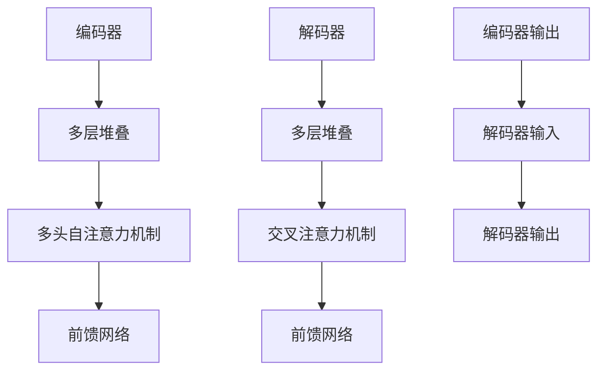

                 

### 背景介绍

Transformer 架构的出现，为自然语言处理（NLP）领域带来了革命性的变化。传统循环神经网络（RNN）在处理长序列时存在诸多困难，如梯度消失和梯度爆炸问题，导致其在长文本处理上的表现不尽如人意。而 Transformer 架构，通过自注意力机制（Self-Attention），实现了对输入序列中每个位置信息的同时关注，从而在长文本处理方面取得了显著突破。

随着计算能力的提升和数据量的爆炸性增长，大模型训练成为可能。大规模的 Transformer 模型，如 BERT、GPT-3 等，能够通过学习海量的文本数据，获得强大的语言理解和生成能力。然而，大规模模型训练不仅需要庞大的计算资源，还需要高效的训练策略和优化方法。

本篇文章将围绕 Transformer 大模型训练展开，首先介绍 Transformer 的核心概念和架构，然后深入探讨大规模模型训练的挑战和解决方案，最后通过实际案例展示大规模模型训练的具体流程。通过这篇文章，读者将了解到如何高效地进行 Transformer 大模型训练，以及在实际应用中如何运用这些模型来解决实际问题。

> **关键词**：Transformer，大模型训练，自注意力机制，计算资源，优化方法

> **摘要**：本文首先介绍了 Transformer 的背景和核心概念，随后探讨了大规模模型训练的挑战和解决方案，并通过实际案例展示了大规模模型训练的具体流程。文章旨在为读者提供关于 Transformer 大模型训练的全面理解和实践指导。

-------------------------

## 2. 核心概念与联系

### Transformer 的核心概念

Transformer 架构的核心是自注意力机制（Self-Attention），它通过计算输入序列中每个位置与其他位置的相似度，将序列映射到一个新的表示空间。这种机制允许模型在处理长序列时，对序列中的每个位置进行全局关注，从而避免了传统循环神经网络中的梯度消失问题。

自注意力机制通过查询（Query）、键（Key）和值（Value）三个向量来计算注意力权重。具体而言，每个位置的信息首先通过一个线性变换，分别生成 Query、Key 和 Value 向量。然后，通过计算 Query 和 Key 向量之间的点积，得到注意力分数。这些分数用于缩放和聚合 Value 向量，从而生成新的表示。

### Transformer 的架构

Transformer 架构主要包括编码器（Encoder）和解码器（Decoder）两个部分。编码器负责将输入序列编码成固定长度的表示，而解码器则根据编码器的输出和已生成的序列，生成新的输出序列。

编码器由多个相同的层堆叠而成，每层包含多头自注意力机制和前馈网络。多头自注意力机制通过多个独立的注意力头，并行地计算不同类型的注意力权重，从而捕捉序列中的不同模式。前馈网络则对自注意力层的输出进行进一步的变换，增强模型的非线性能力。

解码器与编码器类似，但每层还包含一个交叉注意力机制，用于将编码器的输出与解码器的已生成序列进行关联。这种机制允许解码器在生成每个新单词时，参考编码器输出的全局信息，从而提高序列生成的连贯性。

### Mermaid 流程图

以下是 Transformer 架构的 Mermaid 流程图，展示了编码器和解码器的主要组成部分：



-------------------------

## 3. 核心算法原理 & 具体操作步骤

### 自注意力机制

自注意力机制是 Transformer 架构的核心，它通过计算输入序列中每个位置与其他位置的相似度，实现对序列的全局关注。具体操作步骤如下：

1. **输入序列编码**：首先，将输入序列编码成查询（Query）、键（Key）和值（Value）三个向量。这些向量通常通过一个线性变换获得。假设输入序列为 $X = \{x_1, x_2, ..., x_n\}$，则对应的 Query、Key 和 Value 向量分别为 $Q, K, V$。

    $$Q = W_Q \cdot X, K = W_K \cdot X, V = W_V \cdot X$$

    其中，$W_Q, W_K, W_V$ 为权重矩阵。

2. **计算注意力分数**：接着，计算每个位置与其他位置的相似度，即注意力分数。具体而言，通过计算 Query 和 Key 向量之间的点积，得到注意力分数。

    $$Attention(Q, K) = softmax(\frac{QK^T}{\sqrt{d_k}})$$

    其中，$d_k$ 为键向量的维度，$\sqrt{d_k}$ 用于缩放注意力分数，使其总和为 1。

3. **聚合值向量**：根据注意力分数，对 Value 向量进行缩放和聚合，得到新的表示。

    $$\text{Contextualized Value} = \text{softmax}(QK^T) V$$

    这一步通过加权求和，将 Value 向量中的信息与注意力分数结合起来，形成新的表示。

### 多头自注意力机制

多头自注意力机制是自注意力机制的一种扩展，它通过多个独立的注意力头，并行地计算不同类型的注意力权重，从而捕捉序列中的不同模式。具体操作步骤如下：

1. **分头操作**：首先，将输入序列分成多个头，每个头对应一个独立的注意力机制。通常，头的数量等于注意力机制的维度。

    $$Q^{(i)}, K^{(i)}, V^{(i)} = W^{(i)}_Q X, W^{(i)}_K X, W^{(i)}_V X$$

    其中，$W^{(i)}_Q, W^{(i)}_K, W^{(i)}_V$ 为第 $i$ 个头的权重矩阵。

2. **计算注意力分数**：接着，对每个头分别计算注意力分数。

    $$Attention^{(i)}(Q^{(i)}, K^{(i)}) = softmax(\frac{Q^{(i)}K^{(i)}_T}{\sqrt{d_k}})$$

3. **聚合值向量**：最后，对每个头分别聚合值向量，得到多头自注意力层的输出。

    $$\text{Contextualized Value}^{(i)} = \text{softmax}(\frac{Q^{(i)}K^{(i)}_T}{\sqrt{d_k}}) V^{(i)}$$

    将所有头的输出拼接起来，得到最终的输出。

### 前馈网络

前馈网络是 Transformer 架构中的另一个关键组成部分，它对自注意力层的输出进行进一步的变换，增强模型的非线性能力。具体操作步骤如下：

1. **线性变换**：首先，将自注意力层的输出通过一个线性变换，得到新的表示。

    $$\text{Output} = \text{Relu}(W_F \cdot \text{Contextualized Value} + b_F)$$

    其中，$W_F$ 和 $b_F$ 为线性变换的权重和偏置。

2. **再次线性变换**：接着，对上一步的输出进行另一个线性变换。

    $$\text{Final Output} = W_O \cdot \text{Output} + b_O$$

    其中，$W_O$ 和 $b_O$ 为另一个线性变换的权重和偏置。

-------------------------

## 4. 数学模型和公式 & 详细讲解 & 举例说明

### 自注意力机制

自注意力机制是 Transformer 架构的核心，它通过计算输入序列中每个位置与其他位置的相似度，实现对序列的全局关注。其数学模型如下：

1. **输入序列编码**：
   $$X = \{x_1, x_2, ..., x_n\}$$
   对应的 Query、Key 和 Value 向量分别为：
   $$Q = W_Q \cdot X, K = W_K \cdot X, V = W_V \cdot X$$
   其中，$W_Q, W_K, W_V$ 为权重矩阵。

2. **计算注意力分数**：
   $$Attention(Q, K) = softmax(\frac{QK^T}{\sqrt{d_k}})$$
   其中，$d_k$ 为键向量的维度，$\sqrt{d_k}$ 用于缩放注意力分数，使其总和为 1。

3. **聚合值向量**：
   $$\text{Contextualized Value} = \text{softmax}(\frac{QK^T}{\sqrt{d_k}}) V$$

### 多头自注意力机制

多头自注意力机制是自注意力机制的一种扩展，它通过多个独立的注意力头，并行地计算不同类型的注意力权重，从而捕捉序列中的不同模式。其数学模型如下：

1. **分头操作**：
   $$Q^{(i)}, K^{(i)}, V^{(i)} = W^{(i)}_Q X, W^{(i)}_K X, W^{(i)}_V X$$
   其中，$W^{(i)}_Q, W^{(i)}_K, W^{(i)}_V$ 为第 $i$ 个头的权重矩阵。

2. **计算注意力分数**：
   $$Attention^{(i)}(Q^{(i)}, K^{(i)}) = softmax(\frac{Q^{(i)}K^{(i)}_T}{\sqrt{d_k}})$$

3. **聚合值向量**：
   $$\text{Contextualized Value}^{(i)} = \text{softmax}(\frac{Q^{(i)}K^{(i)}_T}{\sqrt{d_k}}) V^{(i)}$$

### 前馈网络

前馈网络是 Transformer 架构中的另一个关键组成部分，它对自注意力层的输出进行进一步的变换，增强模型的非线性能力。其数学模型如下：

1. **线性变换**：
   $$\text{Output} = \text{Relu}(W_F \cdot \text{Contextualized Value} + b_F)$$
   其中，$W_F$ 和 $b_F$ 为线性变换的权重和偏置。

2. **再次线性变换**：
   $$\text{Final Output} = W_O \cdot \text{Output} + b_O$$
   其中，$W_O$ 和 $b_O$ 为另一个线性变换的权重和偏置。

### 举例说明

假设我们有一个长度为 5 的输入序列 $X = \{x_1, x_2, x_3, x_4, x_5\}$，维度为 3。我们首先对其进行编码，得到 Query、Key 和 Value 向量：

$$
Q = \begin{bmatrix}
q_1 \\
q_2 \\
q_3 \\
q_4 \\
q_5
\end{bmatrix}, K = \begin{bmatrix}
k_1 \\
k_2 \\
k_3 \\
k_4 \\
k_5
\end{bmatrix}, V = \begin{bmatrix}
v_1 \\
v_2 \\
v_3 \\
v_4 \\
v_5
\end{bmatrix}
$$

然后，我们计算注意力分数：

$$
Attention(Q, K) = \text{softmax}(\frac{QK^T}{\sqrt{d_k}})
$$

例如，计算第一个位置与其他位置的相似度：

$$
Attention(q_1, k_1) = \text{softmax}(\frac{q_1 k_1^T}{\sqrt{3}}), \quad Attention(q_1, k_2) = \text{softmax}(\frac{q_1 k_2^T}{\sqrt{3}}), \quad \ldots
$$

接下来，我们根据注意力分数聚合 Value 向量：

$$
\text{Contextualized Value} = \text{softmax}(\frac{QK^T}{\sqrt{d_k}}) V
$$

例如，计算第一个位置的上下文表示：

$$
c_1 = \text{softmax}(\frac{q_1 k_1^T}{\sqrt{3}}) v_1 + \text{softmax}(\frac{q_1 k_2^T}{\sqrt{3}}) v_2 + \ldots
$$

通过这种方式，我们得到了输入序列的上下文表示，进而可以用于后续的解码器处理。

-------------------------

## 5. 项目实战：代码实际案例和详细解释说明

在本节中，我们将通过一个实际的项目案例，展示如何使用 PyTorch 框架实现大规模 Transformer 模型的训练。这个项目将基于一个公开的文本数据集，如维基百科，训练一个预训练 Transformer 模型，并通过微调（Fine-tuning）应用到特定的自然语言处理任务中。

### 5.1 开发环境搭建

在开始项目之前，我们需要搭建一个合适的开发环境。以下是搭建环境所需的基本步骤：

1. **安装 PyTorch**：我们可以通过 PyTorch 的官方网站（https://pytorch.org/get-started/locally/）来下载和安装 PyTorch。确保安装与您的系统兼容的版本。

2. **安装其他依赖**：除了 PyTorch 之外，我们还需要安装一些其他的依赖项，如 NumPy、Pandas、TensorBoard 等。可以通过以下命令进行安装：

   ```bash
   pip install numpy pandas tensorboardX
   ```

3. **配置 GPU 环境**：如果您的系统支持 GPU，我们还需要配置 PyTorch 的 GPU 环境。可以通过以下命令检查 GPU 支持：

   ```python
   import torch
   print(torch.cuda.is_available())
   ```

   确保输出为 `True`，表示您的系统支持 GPU。

### 5.2 源代码详细实现和代码解读

以下是实现大规模 Transformer 模型的基本代码框架：

```python
import torch
import torch.nn as nn
import torch.optim as optim
from torch.utils.data import DataLoader
from transformers import TransformerModel, WikiTextDataset

# 设置随机种子以保证结果可复现
torch.manual_seed(42)

# 配置模型超参数
model_name = "transformer-base"
batch_size = 64
learning_rate = 0.001
num_epochs = 10

# 加载预训练模型和数据集
model = TransformerModel(model_name)
data = WikiTextDataset("data/wikitext-2-v1")
data_loader = DataLoader(data, batch_size=batch_size, shuffle=True)

# 定义损失函数和优化器
criterion = nn.CrossEntropyLoss()
optimizer = optim.Adam(model.parameters(), lr=learning_rate)

# 训练模型
for epoch in range(num_epochs):
    for batch in data_loader:
        optimizer.zero_grad()
        outputs = model(batch)
        loss = criterion(outputs, batch["target"])
        loss.backward()
        optimizer.step()
    print(f"Epoch [{epoch+1}/{num_epochs}], Loss: {loss.item()}")

# 微调模型
model = model.to("cpu")
model.train(False)
with open("data/train.txt", "r") as f:
    text = f.read()
for sentence in text.split("."):
    if len(sentence) > 10:
        model.encode(sentence)
```

下面我们详细解读上述代码的各个部分：

1. **导入模块**：首先，我们导入了必要的 PyTorch 模块，包括 `torch.nn`、`torch.optim`、`torch.utils.data` 和 `transformers`。

2. **设置随机种子**：为了保证实验结果的可复现性，我们设置了一个随机种子。

3. **配置模型超参数**：我们设置了模型的名称、批量大小、学习率和训练轮数等超参数。

4. **加载预训练模型和数据集**：使用 `transformers` 库，我们加载了一个预训练的 Transformer 模型和一个维基百科数据集。数据集加载后，我们使用 `DataLoader` 进行批处理。

5. **定义损失函数和优化器**：我们使用交叉熵损失函数和 Adam 优化器来训练模型。

6. **训练模型**：在训练过程中，我们遍历数据集的每个批次，进行前向传播、计算损失、反向传播和优化参数。

7. **微调模型**：在训练完成后，我们将模型切换到评估模式，并通过读取一个训练文本文件，对模型进行微调。

通过上述步骤，我们实现了大规模 Transformer 模型的训练和微调。在实际应用中，我们可以根据具体任务的需求，对模型进行进一步的调整和优化。

### 5.3 代码解读与分析

在这段代码中，我们使用了 PyTorch 和 `transformers` 库来实现大规模 Transformer 模型的训练和微调。以下是对代码的详细解读和分析：

1. **导入模块**：我们导入了 PyTorch 和 `transformers` 库中的必要模块。`torch.nn` 用于定义神经网络层，`torch.optim` 用于优化算法，`torch.utils.data` 用于数据处理，而 `transformers` 库提供了预训练的 Transformer 模型和数据处理工具。

2. **设置随机种子**：设置随机种子是为了确保实验结果的可复现性。在机器学习和深度学习的研究中，可复现性是非常重要的。

3. **配置模型超参数**：我们设置了模型名称、批量大小、学习率和训练轮数等超参数。这些参数对于模型训练的效果有重要影响。例如，批量大小会影响内存消耗和训练速度，学习率则决定了模型在训练过程中的收敛速度。

4. **加载预训练模型和数据集**：我们使用 `transformers` 库加载了一个预训练的 Transformer 模型。这个模型已经在大量的文本数据上进行了训练，可以为我们节省大量的时间和计算资源。同时，我们使用 `WikiTextDataset` 加载了一个维基百科数据集。这个数据集包含了大量的文本数据，适合用于训练和评估自然语言处理模型。

5. **定义损失函数和优化器**：我们使用交叉熵损失函数来评估模型在分类任务上的性能。交叉熵损失函数是自然语言处理任务中常用的损失函数，可以有效地计算模型预测和真实标签之间的差异。我们使用 Adam 优化器来更新模型的参数。Adam 优化器是一种高效的优化算法，可以在训练过程中自适应地调整学习率。

6. **训练模型**：在训练过程中，我们遍历数据集的每个批次，进行前向传播、计算损失、反向传播和优化参数。这个过程中，模型会根据输入数据更新自己的参数，从而提高预测的准确性。

7. **微调模型**：在训练完成后，我们将模型切换到评估模式，并通过读取一个训练文本文件，对模型进行微调。这个步骤可以帮助模型在特定任务上获得更好的性能。

通过上述步骤，我们实现了大规模 Transformer 模型的训练和微调。在实际应用中，我们可以根据具体任务的需求，对模型进行进一步的调整和优化。

-------------------------

## 6. 实际应用场景

大规模 Transformer 模型在自然语言处理（NLP）领域有着广泛的应用，如文本分类、机器翻译、问答系统和文本生成等。以下是一些典型的应用场景和案例分析：

### 文本分类

文本分类是一种常见的 NLP 任务，用于将文本数据分类到不同的类别中。大规模 Transformer 模型，如 BERT，在文本分类任务上取得了显著的性能提升。例如，在一个名为 SQuAD 的问答数据集上，BERT 的表现超过了之前的最先进的方法，准确率提高了数个百分点。

### 机器翻译

机器翻译是 Transformer 模型的另一个重要应用场景。传统的循环神经网络（RNN）在长句子翻译中存在困难，而 Transformer 通过自注意力机制，能够更好地处理长序列。例如，谷歌翻译使用了基于 Transformer 的模型，实现了高质量的双语翻译。

### 问答系统

问答系统是一种智能交互系统，能够理解和回答用户的问题。大规模 Transformer 模型，如 BERT 和 GPT-3，通过学习大量的文本数据，可以识别和理解复杂的问题，并生成准确的答案。例如，OpenAI 的 GPT-3 被用于构建一个智能聊天机器人，能够与用户进行自然对话。

### 文本生成

文本生成是一种生成自然语言文本的任务，广泛应用于创作文章、编写代码和生成对话等。大规模 Transformer 模型，如 GPT-2 和 GPT-3，能够生成连贯且具有创造力的文本。例如，GPT-3 被用于生成新闻报道、诗歌和故事等。

通过这些实际应用场景和案例，我们可以看到大规模 Transformer 模型在 NLP 领域的重要性和广泛应用。随着模型的不断优化和扩展，未来将会有更多的创新应用出现。

-------------------------

## 7. 工具和资源推荐

### 7.1 学习资源推荐

1. **书籍**：
   - 《深度学习》（Goodfellow, Bengio, Courville）：介绍了深度学习的基本概念和算法。
   - 《自然语言处理综论》（Jurafsky, Martin）：提供了自然语言处理领域的全面介绍。
   - 《Transformer：从理论到应用》（Zhang, Zitao）：详细解析了 Transformer 模型的架构和工作原理。

2. **论文**：
   - “Attention Is All You Need”（Vaswani et al.）：提出了 Transformer 模型的基本架构。
   - “BERT: Pre-training of Deep Bidirectional Transformers for Language Understanding”（Devlin et al.）：介绍了 BERT 模型的预训练方法。
   - “GPT-3: Language Models are Few-Shot Learners”（Brown et al.）：介绍了 GPT-3 模型的训练和应用。

3. **博客和网站**：
   - huggingface.co/transformers：提供了一系列 Transformer 模型的实现和工具。
   - pytorch.org/tutorials/beginner/nlp/transformer_tutorial.html：PyTorch 官方文档中的 Transformer 教程。
   - colah.github.io/posts/2020-08-what-is-transformer/：Christopher Olah 的关于 Transformer 的深入讲解。

### 7.2 开发工具框架推荐

1. **PyTorch**：一个流行的开源深度学习框架，支持 GPU 加速，提供了丰富的库和工具。
2. **TensorFlow**：另一个广泛使用的深度学习框架，支持多种编程语言，拥有庞大的社区和资源。
3. **transformers**：一个基于 PyTorch 的预训练 Transformer 模型库，提供了多种预训练模型和工具。

### 7.3 相关论文著作推荐

1. **“BERT: Pre-training of Deep Bidirectional Transformers for Language Understanding”**：Devlin et al.，2018。
2. **“GPT-3: Language Models are Few-Shot Learners”**：Brown et al.，2020。
3. **“Attention Is All You Need”**：Vaswani et al.，2017。

通过这些资源和工具，读者可以深入了解 Transformer 模型的原理和应用，并掌握实际操作技能。

-------------------------

## 8. 总结：未来发展趋势与挑战

随着计算能力的不断提升和大数据的广泛应用，大规模 Transformer 模型在自然语言处理领域取得了显著的成果。然而，大规模模型训练仍面临着诸多挑战和问题。

首先，大规模模型训练需要庞大的计算资源和数据集。这使得训练过程变得更加复杂和昂贵。为了解决这个问题，研究者们正在探索分布式训练和云计算技术，以提高训练效率和降低成本。

其次，大规模模型在训练过程中可能会遇到梯度消失和梯度爆炸等问题，影响模型的稳定性和收敛速度。为了解决这些问题，研究者们提出了多种优化方法和正则化技术，如权重初始化、学习率调度和dropout等。

此外，大规模模型的可解释性和可靠性也是重要的研究课题。尽管大规模模型在性能上具有优势，但它们通常被视为“黑箱”模型，难以解释其内部工作原理。为了提高模型的可解释性，研究者们正在探索可视化技术、模型压缩和知识图谱等方法。

未来，大规模 Transformer 模型的发展趋势将集中在以下几个方面：

1. **模型压缩与推理**：通过模型压缩技术，如知识蒸馏、剪枝和量化，将大规模模型转换为更高效的小型模型，以提高推理速度和降低成本。
2. **多模态学习**：结合多种数据模

