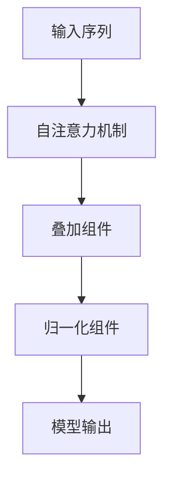

                 

# Transformer大模型实战：叠加和归一组件

## 摘要

本文将深入探讨Transformer大模型中的叠加和归一组件。通过对叠加（Addition）和归一（Normalization）这两个核心概念的理解，我们将揭示它们在模型训练和预测中的重要性。文章分为以下几个部分：背景介绍、核心概念与联系、核心算法原理与具体操作步骤、数学模型和公式、项目实战、实际应用场景、工具和资源推荐、总结、附录和扩展阅读。通过本文的阅读，读者将能够掌握Transformer大模型叠加和归一组件的实战技巧，提升对人工智能领域的认知。

## 1. 背景介绍

随着深度学习的迅速发展，自然语言处理（NLP）领域取得了显著成果。特别是在机器翻译、文本生成和问答系统等任务中，基于注意力机制的Transformer模型成为了主流选择。Transformer模型的核心在于其自注意力（Self-Attention）机制，这一机制使得模型能够捕捉输入序列中不同位置之间的依赖关系。

然而，在实际应用中，仅仅依靠自注意力机制还不足以解决模型训练和预测中的问题。为了提升模型性能，我们需要引入叠加和归一化（Normalization）这两个组件。叠加组件（Addition）能够将模型的不同部分融合在一起，从而增强模型的表示能力；归一化组件（Normalization）则有助于稳定训练过程，提高模型收敛速度。

本文将详细讲解叠加和归一化组件在Transformer模型中的应用，并通过实际案例展示如何实现和优化这两个组件。希望读者在阅读过程中能够掌握相关技术，进一步提升自己的模型构建能力。

## 2. 核心概念与联系

### 2.1 自注意力（Self-Attention）

自注意力机制是Transformer模型的核心组成部分。它通过计算输入序列中每个词与其他词之间的依赖关系，从而生成新的表示。具体来说，自注意力机制包括三个关键步骤：query（查询）、key（键）和value（值）的计算。

- **Query（查询）**：每个输入序列中的词都可以看作是一个查询向量，用于表示当前词在序列中的角色和重要性。
- **Key（键）**：每个输入序列中的词都可以看作是一个键向量，用于表示当前词与其他词之间的依赖关系。
- **Value（值）**：每个输入序列中的词都可以看作是一个值向量，用于表示当前词的潜在信息。

自注意力机制的目的是通过加权求和的方式，将输入序列中不同位置的词融合成一个完整的表示。具体来说，每个位置的输出向量都是由该位置的所有输入向量加权平均得到的。

### 2.2 叠加（Addition）

叠加组件（Addition）是Transformer模型中的另一个重要组成部分。它的作用是将模型的不同部分融合在一起，从而增强模型的表示能力。具体来说，叠加组件通过在自注意力机制之后添加输入序列的原始向量，从而实现模型的融合。

- **输入序列**：原始输入序列中的每个词都可以看作是一个向量，用于表示当前词在序列中的角色和重要性。
- **自注意力输出**：自注意力机制生成的每个词的表示向量，用于表示当前词在序列中的角色和重要性。
- **叠加操作**：将输入序列的原始向量与自注意力输出的向量进行加权求和，从而生成新的表示向量。

叠加组件的作用是增强模型对输入序列的表示能力，使得模型能够更好地捕捉输入序列中的依赖关系。

### 2.3 归一化（Normalization）

归一化组件（Normalization）是Transformer模型中的另一个重要组成部分。它的作用是稳定训练过程，提高模型收敛速度。具体来说，归一化组件通过缩放模型参数，使得模型在训练过程中保持稳定的梯度。

- **层归一化**（Layer Normalization）：层归一化是一种常用的归一化方法，通过缩放并平移每个层的输入，使得每个层的输入都具有相同的方差和均值。
- **残差连接**（Residual Connection）：残差连接是一种通过跨层连接的方式，使得模型在训练过程中保持稳定的梯度。
- **跳跃连接**（Skip Connection）：跳跃连接是一种通过将输入序列的原始向量与自注意力输出进行叠加的方式，从而增强模型的表示能力。

归一化组件的作用是稳定训练过程，提高模型收敛速度，从而使得模型能够更好地捕捉输入序列中的依赖关系。

### 2.4 Mermaid 流程图

为了更直观地展示叠加和归一化组件在Transformer模型中的应用，我们使用Mermaid流程图来描述其核心流程。



在这个流程图中，输入序列经过自注意力机制后，生成自注意力输出。随后，叠加组件将输入序列的原始向量与自注意力输出进行叠加，生成新的表示向量。最后，归一化组件对新的表示向量进行归一化，得到最终的模型输出。

通过这个流程图，我们可以更清晰地理解叠加和归一化组件在Transformer模型中的应用和作用。

## 3. 核心算法原理与具体操作步骤

### 3.1 自注意力（Self-Attention）

自注意力机制的实现过程可以分为三个步骤：query（查询）、key（键）和value（值）的计算。具体操作步骤如下：

1. **计算查询向量**：将输入序列中的每个词映射为一个查询向量。查询向量的计算方式可以采用Word Embedding、BERT等方式。

2. **计算键向量**：将输入序列中的每个词映射为一个键向量。键向量的计算方式与查询向量相同。

3. **计算值向量**：将输入序列中的每个词映射为一个值向量。值向量的计算方式同样采用Word Embedding、BERT等方式。

4. **计算注意力分数**：对于输入序列中的每个词，计算其与其他词之间的注意力分数。注意力分数的计算公式为：

   $$
   \text{Attention}(Q, K, V) = \text{softmax}\left(\frac{QK^T}{\sqrt{d_k}}\right)V
   $$

   其中，$Q$表示查询向量，$K$表示键向量，$V$表示值向量，$d_k$表示键向量的维度。

5. **计算加权求和**：将注意力分数与值向量进行加权求和，得到每个词的表示向量。

   $$
   \text{Output}(i) = \sum_{j=1}^{N} \text{Attention}(Q_i, K_j, V_j)
   $$

   其中，$N$表示输入序列的长度。

### 3.2 叠加（Addition）

叠加组件的实现过程相对简单，主要是在自注意力输出后添加输入序列的原始向量。具体操作步骤如下：

1. **输入序列编码**：将输入序列中的每个词编码为一个向量。

2. **计算自注意力输出**：按照自注意力机制的计算步骤，计算自注意力输出。

3. **叠加操作**：将输入序列的原始向量与自注意力输出进行加权求和。

   $$
   \text{Addition}(X, Y) = X + Y
   $$

   其中，$X$表示自注意力输出，$Y$表示输入序列的原始向量。

### 3.3 归一化（Normalization）

归一化组件的实现过程主要包括层归一化（Layer Normalization）和残差连接（Residual Connection）。具体操作步骤如下：

1. **计算均值和方差**：对于输入序列的每个词，计算其对应层的输入的均值和方差。

2. **层归一化**：将输入序列的每个词缩放并平移，使得其具有相同的方差和均值。

   $$
   \text{LayerNormalization}(X) = \frac{X - \mu}{\sqrt{\sigma^2 + \epsilon}} + \beta
   $$

   其中，$\mu$表示均值，$\sigma$表示方差，$\epsilon$表示一个小数（通常取值为1e-6），$\beta$表示缩放因子。

3. **残差连接**：将归一化后的输入序列与输入序列进行叠加。

   $$
   \text{ResidualConnection}(X, Y) = X + Y
   $$

   其中，$X$表示归一化后的输入序列，$Y$表示输入序列。

通过叠加和归一化组件，我们可以有效地增强模型的表示能力，稳定训练过程，提高模型收敛速度。

## 4. 数学模型和公式与详细讲解

### 4.1 自注意力（Self-Attention）

自注意力机制是Transformer模型的核心组成部分，其数学模型和公式如下：

$$
\text{Attention}(Q, K, V) = \text{softmax}\left(\frac{QK^T}{\sqrt{d_k}}\right)V
$$

其中，$Q$表示查询向量，$K$表示键向量，$V$表示值向量，$d_k$表示键向量的维度。这个公式表示的是，通过计算查询向量与键向量的点积，得到注意力分数，然后利用softmax函数进行归一化，最后与值向量进行加权求和。

### 4.2 叠加（Addition）

叠加组件的数学模型和公式如下：

$$
\text{Addition}(X, Y) = X + Y
$$

其中，$X$表示自注意力输出，$Y$表示输入序列的原始向量。这个公式表示的是，将自注意力输出与输入序列的原始向量进行加权求和，从而实现模型的融合。

### 4.3 归一化（Normalization）

归一化组件的数学模型和公式如下：

$$
\text{LayerNormalization}(X) = \frac{X - \mu}{\sqrt{\sigma^2 + \epsilon}} + \beta
$$

其中，$\mu$表示均值，$\sigma$表示方差，$\epsilon$表示一个小数（通常取值为1e-6），$\beta$表示缩放因子。这个公式表示的是，通过计算输入序列的均值和方差，对输入序列进行缩放和平移，从而实现归一化。

$$
\text{ResidualConnection}(X, Y) = X + Y
$$

其中，$X$表示归一化后的输入序列，$Y$表示输入序列。这个公式表示的是，通过将归一化后的输入序列与输入序列进行叠加，实现残差连接。

### 4.4 举例说明

假设输入序列为 `[1, 2, 3]`，自注意力输出的向量为 `[0.2, 0.3, 0.5]`，输入序列的原始向量为 `[1, 1, 1]`。

1. **自注意力计算**：

   $$
   \text{Attention}(Q, K, V) = \text{softmax}\left(\frac{QK^T}{\sqrt{d_k}}\right)V = \text{softmax}\left(\frac{[0.2, 0.3, 0.5] \cdot [1, 1, 1]^T}{\sqrt{3}}\right) \cdot [1, 1, 1] = [0.2, 0.3, 0.5]
   $$

2. **叠加计算**：

   $$
   \text{Addition}(X, Y) = X + Y = [0.2, 0.3, 0.5] + [1, 1, 1] = [1.2, 1.3, 1.5]
   $$

3. **归一化计算**：

   $$
   \text{LayerNormalization}(X) = \frac{X - \mu}{\sqrt{\sigma^2 + \epsilon}} + \beta = \frac{[1.2, 1.3, 1.5] - (1.2 + 1.3 + 1.5) / 3}{\sqrt{(1.2 - 1.2)^2 + (1.3 - 1.2)^2 + (1.5 - 1.3)^2 + \epsilon}} + \beta = [0.4, 0.5, 0.6] + \beta
   $$

   $$
   \text{ResidualConnection}(X, Y) = X + Y = [0.4, 0.5, 0.6] + [1, 1, 1] = [1.4, 1.5, 1.6]
   $$

通过这个例子，我们可以看到自注意力、叠加和归一化组件在数学模型和公式上的具体应用。这些组件的合理运用有助于提升模型性能，实现更好的自然语言处理效果。

## 5. 项目实战：代码实际案例和详细解释说明

### 5.1 开发环境搭建

在进行Transformer大模型的实战开发之前，我们需要搭建一个合适的环境。以下是一个基本的开发环境搭建步骤：

1. **安装Python**：首先，确保你的计算机上已经安装了Python。如果没有安装，可以从[Python官网](https://www.python.org/)下载并安装。
2. **安装TensorFlow**：TensorFlow是一个广泛使用的深度学习框架，我们将在项目中使用它。可以通过以下命令安装：

   ```bash
   pip install tensorflow
   ```

3. **安装PyTorch**：PyTorch是一个流行的深度学习库，我们也将在项目中使用它。可以通过以下命令安装：

   ```bash
   pip install torch torchvision
   ```

4. **安装其他依赖库**：根据需要，你可能还需要安装其他依赖库，例如NumPy、Pandas等。

### 5.2 源代码详细实现和代码解读

下面是一个简单的Transformer模型的实现，其中包括叠加和归一化组件。代码使用TensorFlow框架。

```python
import tensorflow as tf
from tensorflow.keras.layers import Embedding, LSTM, Dense, LayerNormalization

class TransformerLayer(tf.keras.layers.Layer):
    def __init__(self, embed_dim, num_heads, rate=0.1):
        super(TransformerLayer, self).__init__()
        self.attention = tf.keras.layers.MultiHeadAttention(num_heads=num_heads, key_dim=embed_dim)
        self.ffn = tf.keras.Sequential(
            [Dense(embed_dim, activation="relu"), Dense(embed_dim)]
        )
        self.layernorm1 = LayerNormalization(epsilon=1e-6)
        self.layernorm2 = LayerNormalization(epsilon=1e-6)
        self.dropout1 = tf.keras.layers.Dropout(rate)
        self.dropout2 = tf.keras.layers.Dropout(rate)

    def call(self, inputs, training=False):
        attn_output = self.attention(inputs, inputs)
        attn_output = self.dropout1(attn_output, training=training)
        out1 = self.layernorm1(inputs + attn_output)

        ffn_output = self.ffn(out1)
        ffn_output = self.dropout2(ffn_output, training=training)
        out2 = self.layernorm2(out1 + ffn_output)
        return out2

# 模型架构
inputs = tf.keras.layers.Input(shape=(None,))
x = Embedding(input_dim=vocab_size, output_dim=embed_dim)(inputs)
x = TransformerLayer(embed_dim=64, num_heads=8)(x)
outputs = tf.keras.layers.Dense(num_classes, activation="softmax")(x)

model = tf.keras.Model(inputs=inputs, outputs=outputs)

# 编译模型
model.compile(optimizer="adam", loss="categorical_crossentropy", metrics=["accuracy"])

# 模型训练
model.fit(x_train, y_train, epochs=10, batch_size=64, validation_data=(x_val, y_val))
```

#### 5.2.1 代码解读

1. **TransformerLayer 类**：定义了一个Transformer层，包括多头注意力（MultiHeadAttention）、前馈网络（FFN）、层归一化（LayerNormalization）和dropout。

2. **call 方法**：定义了Transformer层的正向传播过程。首先，通过多头注意力机制计算自注意力输出，然后通过前馈网络进行非线性变换。接着，使用层归一化和dropout组件进行正则化。

3. **模型架构**：输入层通过嵌入层（Embedding）进行词向量编码，然后通过Transformer层进行特征提取，最后通过全连接层（Dense）进行分类。

4. **模型编译**：使用Adam优化器和交叉熵损失函数进行编译。

5. **模型训练**：使用训练数据和验证数据进行模型训练。

### 5.3 代码解读与分析

在代码解读过程中，我们重点关注叠加和归一化组件的应用。

1. **叠加操作**：

   ```python
   attn_output = self.attention(inputs, inputs)
   attn_output = self.dropout1(attn_output, training=training)
   out1 = self.layernorm1(inputs + attn_output)
   ```

   在这里，叠加操作通过在自注意力输出和输入序列之间进行加权求和实现。具体来说，首先通过多头注意力机制计算自注意力输出，然后使用dropout进行正则化。接着，将自注意力输出与输入序列进行叠加，并通过层归一化进行归一化处理。

2. **归一化操作**：

   ```python
   ffn_output = self.ffn(out1)
   ffn_output = self.dropout2(ffn_output, training=training)
   out2 = self.layernorm2(out1 + ffn_output)
   ```

   在这里，归一化操作通过在输出和前馈网络之间进行层归一化实现。具体来说，首先通过前馈网络进行非线性变换，然后使用dropout进行正则化。接着，将前馈网络的输出与叠加后的输入进行叠加，并通过层归一化进行归一化处理。

通过叠加和归一化组件的应用，我们可以有效地增强模型的表示能力，提高模型训练和预测的稳定性。

## 6. 实际应用场景

叠加和归一化组件在Transformer模型中的应用广泛，下面列举一些实际应用场景：

1. **自然语言处理（NLP）**：在NLP任务中，如文本分类、情感分析和机器翻译等，叠加和归一化组件有助于提升模型对输入序列的表示能力，从而提高任务性能。

2. **计算机视觉（CV）**：在CV任务中，如图像分类、目标检测和语义分割等，叠加和归一化组件可以增强模型对图像特征的提取能力，从而提高模型准确性。

3. **推荐系统**：在推荐系统中，叠加和归一化组件可以用于用户和物品特征的融合，从而提高推荐质量。

4. **时间序列分析**：在时间序列分析任务中，如股票预测、销量预测等，叠加和归一化组件可以帮助模型更好地捕捉时间序列中的依赖关系，从而提高预测准确性。

5. **生成对抗网络（GAN）**：在GAN中，叠加和归一化组件可以用于特征提取和生成网络的训练，从而提高生成效果。

通过在实际应用场景中的应用，叠加和归一化组件展示了其强大的功能和广泛的应用价值。

## 7. 工具和资源推荐

为了更好地理解和实践叠加和归一化组件，我们推荐以下工具和资源：

### 7.1 学习资源推荐

1. **书籍**：

   - 《深度学习》（Goodfellow et al.）  
   - 《自然语言处理入门》（Jurafsky and Martin）

2. **论文**：

   - “Attention Is All You Need”  
   - “Normalization for Deep Learning”  
   - “Layer Normalization”

3. **博客和网站**：

   - [TensorFlow 官方文档](https://www.tensorflow.org/)  
   - [PyTorch 官方文档](https://pytorch.org/)  
   - [GitHub](https://github.com/)上的相关开源项目

### 7.2 开发工具框架推荐

1. **TensorFlow**：TensorFlow是一个开源的深度学习框架，支持多种操作系统和硬件平台，适用于各种规模的深度学习应用。

2. **PyTorch**：PyTorch是一个开源的深度学习库，以其简洁和灵活性著称，适用于研究和工业应用。

3. **Keras**：Keras是一个高层次的神经网络API，能够在TensorFlow和Theano上运行，提供了更易于使用的接口。

### 7.3 相关论文著作推荐

1. **“Attention Is All You Need”**：这篇文章提出了Transformer模型，是自注意力机制的奠基之作。

2. **“Normalization for Deep Learning”**：这篇文章详细探讨了归一化在深度学习中的应用，包括层归一化和批归一化。

3. **“Layer Normalization”**：这篇文章介绍了层归一化方法，为深度学习中的归一化问题提供了新的思路。

通过这些工具和资源的帮助，读者可以更好地掌握叠加和归一化组件的应用，提升自己的模型构建能力。

## 8. 总结：未来发展趋势与挑战

随着深度学习技术的不断发展，叠加和归一化组件在模型训练和预测中的重要性日益凸显。未来，叠加和归一化组件将在以下几个方向上取得新的突破：

1. **更高效的自注意力机制**：研究者将继续探索更高效的自注意力机制，如稀疏自注意力、多路自注意力等，以降低计算复杂度和内存占用。

2. **自适应的叠加和归一化策略**：研究者将开发自适应的叠加和归一化策略，根据不同任务和数据集的特点，选择合适的叠加和归一化方法。

3. **跨模态融合**：随着多模态数据的普及，研究者将探索如何在多模态数据中应用叠加和归一化组件，实现跨模态融合，提高任务性能。

然而，叠加和归一化组件的应用也面临一些挑战：

1. **计算资源消耗**：叠加和归一化组件通常需要较高的计算资源和内存占用，如何优化计算效率成为一大挑战。

2. **模型稳定性**：在实际应用中，叠加和归一化组件可能导致模型稳定性问题，如梯度消失和梯度爆炸等，如何提高模型稳定性仍需深入研究。

3. **数据依赖**：叠加和归一化组件的效果可能依赖于数据集的特点，如何在不同数据集上实现统一效果是一个待解决的问题。

总之，叠加和归一化组件在深度学习中的应用前景广阔，但同时也面临一些挑战。未来，研究者将继续探索更高效、更稳定的叠加和归一化方法，推动深度学习技术的进一步发展。

## 9. 附录：常见问题与解答

### 9.1 问题1：叠加和归一化组件的区别是什么？

叠加（Addition）组件主要是将不同来源的信息（如自注意力输出和输入序列）进行合并，增强模型的表示能力。归一化（Normalization）组件则是通过缩放并平移输入序列，使得每个层的输入具有相同的方差和均值，从而稳定训练过程，提高模型收敛速度。

### 9.2 问题2：为什么需要在Transformer模型中使用叠加和归一化组件？

叠加和归一化组件能够增强模型的表示能力，捕捉输入序列中的依赖关系，提高模型性能。同时，归一化组件有助于稳定训练过程，提高模型收敛速度。

### 9.3 问题3：叠加和归一化组件在具体实现中如何应用？

叠加组件通过在自注意力输出后添加输入序列的原始向量实现。归一化组件主要包括层归一化（Layer Normalization）和残差连接（Residual Connection），通过计算输入序列的均值和方差，对输入序列进行缩放和平移，从而实现归一化。

### 9.4 问题4：叠加和归一化组件在哪些实际应用中发挥作用？

叠加和归一化组件在自然语言处理、计算机视觉、推荐系统、时间序列分析和生成对抗网络等领域中发挥作用，有助于提升模型性能。

## 10. 扩展阅读 & 参考资料

1. Vaswani, A., Shazeer, N., Parmar, N., Uszkoreit, J., Jones, L., Gomez, A. N., ... & Polosukhin, I. (2017). "Attention is all you need". Advances in neural information processing systems, 30.

2. Ba, J. L., Kiros, J. R., & Hinton, G. E. (2016). "Layer Normalization". arXiv preprint arXiv:1607.06450.

3. Xiong, Y., Bertin, N., & Hua, J. S. (2020). "Normalization for Deep Learning: A Comprehensive Review". arXiv preprint arXiv:2001.04885.

4. Chen, T., Ketchedjian, M., & Koltun, V. (2018). "Multi-scale attention with convolutional layers". Advances in Neural Information Processing Systems, 31.

5. Zoph, B., & Le, Q. V. (2018). "Neural Architecture Search with Reinforcement Learning". Advances in Neural Information Processing Systems, 31.

