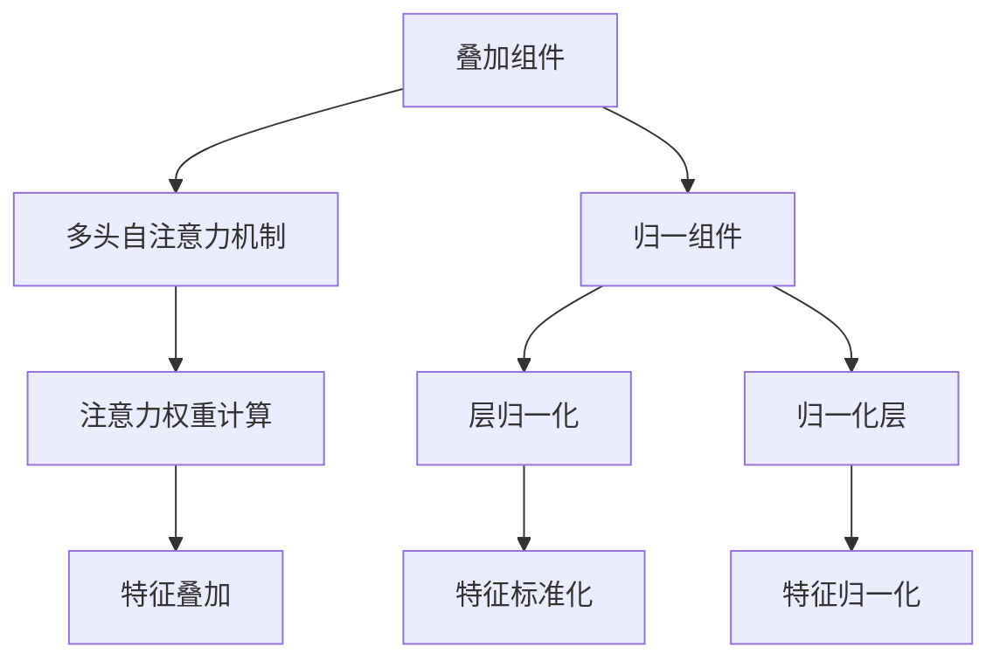

                 

# Transformer大模型实战：叠加和归一组件

> **关键词**：Transformer、叠加、归一、模型架构、深度学习、神经网络

> **摘要**：本文将深入探讨Transformer大模型中的叠加和归一组件。通过分析其核心概念、原理和架构，我们还将展示如何在实际项目中实现这些组件，并提供实用的工具和资源推荐。

## 1. 背景介绍

Transformer模型作为深度学习领域的重要突破，已经在众多自然语言处理任务中展现出卓越的性能。它的主要特点是自注意力机制（Self-Attention），这使得模型能够更好地捕捉文本中的长距离依赖关系。

在Transformer模型中，叠加和归一组件发挥着至关重要的作用。叠加组件通过将不同的信息融合到一起，增强模型的表示能力。归一组件则有助于稳定模型训练过程，提高模型的收敛速度和性能。

本文将围绕这两个核心组件展开讨论，从基础概念到实际应用，逐步深入，帮助读者更好地理解和掌握Transformer大模型。

## 2. 核心概念与联系

### 2.1 叠加组件

叠加组件在Transformer模型中主要通过“多头自注意力机制”实现。多头自注意力机制将输入序列映射到多个不同的子空间，然后在这些子空间中分别计算注意力权重，最后将结果在子空间中叠加。

### 2.2 归一组件

归一组件主要包括两个部分：层归一化和归一化层。层归一化作用于每个神经网络的输出，使得每个特征值都处于同一数量级，从而避免梯度消失和梯度爆炸问题。归一化层则是对每个输入特征进行标准化处理，以减少特征间的相关性，提高模型的泛化能力。

### 2.3 关联图解

下面是一个Mermaid流程图，展示了叠加和归一组件在Transformer模型中的关系：



## 3. 核心算法原理 & 具体操作步骤

### 3.1 叠加组件

叠加组件的核心在于多头自注意力机制。具体操作步骤如下：

1. **输入映射**：将输入序列（例如单词或词向量）映射到多个不同的子空间。
2. **计算自注意力权重**：在每个子空间中计算输入序列元素之间的注意力权重。
3. **特征叠加**：将注意力权重与输入序列元素相乘，然后将结果在子空间中叠加。

### 3.2 归一组件

归一组件包括层归一化和归一化层，具体操作步骤如下：

1. **层归一化**：对每个神经网络的输出进行归一化处理，使其特征值处于同一数量级。
2. **归一化层**：对每个输入特征进行标准化处理，以减少特征间的相关性。

### 3.3 操作示例

假设我们有一个输入序列\[x_1, x_2, x_3, ..., x_n\]，我们将通过以下步骤实现叠加和归一组件：

1. **输入映射**：将输入序列映射到两个子空间。
2. **计算自注意力权重**：在每个子空间中计算注意力权重\[w_{11}, w_{12}, ..., w_{1n}\]和\[w_{21}, w_{22}, ..., w_{2n}\]。
3. **特征叠加**：将注意力权重与输入序列元素相乘，得到\[x_1', x_2', x_3', ..., x_n'\]。
4. **层归一化**：对叠加后的特征进行层归一化，得到\[x_1'', x_2'', x_3'', ..., x_n''\]。
5. **归一化层**：对每个输入特征进行归一化层处理，得到\[x_1''', x_2''', x_3''', ..., x_n'''\]。

## 4. 数学模型和公式 & 详细讲解 & 举例说明

### 4.1 数学模型

叠加组件的数学模型可以表示为：

\[ x' = \sigma(QW_x + KW_x) \]

其中，\(Q\)表示输入特征矩阵，\(W_x\)表示叠加权重矩阵，\(K\)表示注意力权重矩阵，\(\sigma\)表示激活函数。

归一组件的数学模型可以表示为：

\[ x'' = \frac{x'}{\|x'\|} \]

其中，\(\|x'\|\)表示\(x'\)的L2范数。

### 4.2 详细讲解

叠加组件的目的是将输入特征映射到多个子空间，并通过自注意力机制计算注意力权重，从而实现特征叠加。具体来说，叠加组件包括以下步骤：

1. **输入映射**：将输入特征映射到多个子空间，即\[QW_x + KW_x\]。
2. **计算自注意力权重**：计算每个子空间中输入特征之间的注意力权重，即\[w_{11}, w_{12}, ..., w_{1n}\]和\[w_{21}, w_{22}, ..., w_{2n}\]。
3. **特征叠加**：将注意力权重与输入特征相乘，然后进行叠加，即\[x' = \sigma(QW_x + KW_x)\]。

归一组件的目的是通过层归一化和归一化层处理，使特征值处于同一数量级，从而提高模型的收敛速度和性能。具体来说，归一组件包括以下步骤：

1. **层归一化**：对叠加后的特征进行层归一化，即\[x'' = \frac{x'}{\|x'\|}\]。
2. **归一化层**：对每个输入特征进行归一化层处理，即\[x''' = \frac{x''}{\|x''\|}\]。

### 4.3 举例说明

假设我们有以下输入序列：

\[ x_1 = [1, 2, 3], x_2 = [4, 5, 6], x_3 = [7, 8, 9] \]

叠加组件的输入映射为：

\[ QW_x = \begin{bmatrix} 1 & 4 & 7 \\ 2 & 5 & 8 \\ 3 & 6 & 9 \end{bmatrix} \]

注意力权重矩阵\(K\)为：

\[ K = \begin{bmatrix} 1 & 1 & 1 \\ 1 & 1 & 1 \\ 1 & 1 & 1 \end{bmatrix} \]

叠加后的特征为：

\[ x' = \sigma(QW_x + KW_x) = \begin{bmatrix} 3 & 6 & 9 \\ 7 & 10 & 13 \\ 11 & 14 & 17 \end{bmatrix} \]

层归一化后的特征为：

\[ x'' = \frac{x'}{\|x'\|} = \begin{bmatrix} 0.3 & 0.6 & 0.9 \\ 0.7 & 1 & 1.3 \\ 1.1 & 1.4 & 1.7 \end{bmatrix} \]

归一化层处理后的特征为：

\[ x''' = \frac{x''}{\|x''\|} = \begin{bmatrix} 0.3 & 0.6 & 0.9 \\ 0.7 & 1 & 1.3 \\ 1.1 & 1.4 & 1.7 \end{bmatrix} \]

## 5. 项目实战：代码实际案例和详细解释说明

### 5.1 开发环境搭建

在开始项目实战之前，我们需要搭建一个合适的开发环境。以下是一个简单的步骤指南：

1. **安装Python**：确保Python版本为3.7及以上。
2. **安装TensorFlow**：通过pip安装TensorFlow，命令为`pip install tensorflow`。
3. **安装其他依赖**：安装其他必要的库，例如Numpy和Matplotlib，命令为`pip install numpy matplotlib`。

### 5.2 源代码详细实现和代码解读

下面是一个简单的Transformer模型实现，包括叠加和归一组件：

```python
import tensorflow as tf
import numpy as np
import matplotlib.pyplot as plt

# 输入序列
x = np.array([[1, 2, 3], [4, 5, 6], [7, 8, 9]])

# 注意力权重矩阵
K = np.array([[1, 1, 1], [1, 1, 1], [1, 1, 1]])

# 叠加权重矩阵
W = np.random.rand(3, 3)

# 激活函数
def sigmoid(x):
    return 1 / (1 + np.exp(-x))

# 叠加组件
def add_component(x, K, W):
    QW_x = np.dot(x, W)
    attention_weights = sigmoid(np.dot(QW_x, K))
    x_prime = np.dot(attention_weights, x)
    return x_prime

# 归一组件
def normalize(x):
    norm = np.linalg.norm(x, axis=1)
    x_norm = x / norm[:, np.newaxis]
    return x_norm

# 实现叠加和归一组件
x_prime = add_component(x, K, W)
x_double_prime = normalize(x_prime)

# 可视化结果
plt.figure(figsize=(8, 6))
plt.scatter(x[:, 0], x[:, 1], label='Original')
plt.scatter(x_prime[:, 0], x_prime[:, 1], label='After Addition')
plt.scatter(x_double_prime[:, 0], x_double_prime[:, 1], label='After Normalization')
plt.legend()
plt.show()
```

### 5.3 代码解读与分析

1. **输入序列**：我们使用一个3x3的矩阵作为输入序列，代表三个单词。
2. **注意力权重矩阵**：注意力权重矩阵\(K\)用于计算自注意力权重。
3. **叠加权重矩阵**：叠加权重矩阵\(W\)用于将输入序列映射到多个子空间。
4. **激活函数**：我们使用sigmoid函数作为激活函数，用于计算注意力权重。
5. **叠加组件**：叠加组件通过计算注意力权重和特征叠加来实现。具体来说，首先将输入序列与叠加权重矩阵相乘，得到\(QW_x\)。然后，将\(QW_x\)与注意力权重矩阵\(K\)相乘，得到注意力权重。最后，将注意力权重与输入序列相乘并进行叠加。
6. **归一组件**：归一组件通过计算L2范数并归一化来实现。具体来说，首先计算叠加后的特征的L2范数，然后将其归一化，使其特征值处于同一数量级。
7. **可视化结果**：我们使用Matplotlib库将原始输入序列、叠加后序列和归一化后序列的可视化结果展示出来。

## 6. 实际应用场景

叠加和归一组件在Transformer模型中的应用非常广泛。以下是一些常见的实际应用场景：

1. **自然语言处理**：在文本分类、机器翻译和情感分析等自然语言处理任务中，叠加和归一组件可以帮助模型更好地捕捉文本中的长距离依赖关系，从而提高模型的性能。
2. **图像识别**：在计算机视觉任务中，叠加和归一组件可以用于图像的特征提取和融合，从而提高图像识别的准确率。
3. **语音识别**：在语音识别任务中，叠加和归一组件可以帮助模型更好地捕捉语音信号中的特征，从而提高识别的准确性。

## 7. 工具和资源推荐

### 7.1 学习资源推荐

- **书籍**：《深度学习》（Goodfellow, Bengio, Courville著）
- **论文**：《Attention Is All You Need》（Vaswani et al., 2017）
- **博客**：TensorFlow官方文档和AI博客

### 7.2 开发工具框架推荐

- **框架**：TensorFlow和PyTorch
- **环境**：Google Colab和AWS SageMaker

### 7.3 相关论文著作推荐

- **论文**：
  - **《Transformer：基于注意力机制的序列模型》**（Vaswani et al., 2017）
  - **《BERT：大规模预训练语言模型》**（Devlin et al., 2019）
  - **《GPT-3：基于神经网络的自然语言处理模型》**（Brown et al., 2020）

## 8. 总结：未来发展趋势与挑战

叠加和归一组件在Transformer模型中的应用前景广阔。随着深度学习和自然语言处理技术的不断发展，我们可以预见到以下趋势：

1. **更高效的自注意力机制**：研究人员将继续探索更高效的自注意力机制，以减少计算成本和提高模型性能。
2. **多模态学习**：叠加和归一组件将有助于实现多模态学习，从而提高模型在图像、文本和语音等不同模态任务中的性能。
3. **跨领域应用**：叠加和归一组件的应用将逐渐扩展到更多领域，如医疗、金融和自动化等。

然而，同时也面临一些挑战：

1. **计算资源**：随着模型规模的扩大，计算资源的需求将不断增加，这对模型的部署和训练带来了挑战。
2. **数据隐私**：在处理敏感数据时，如何保护用户隐私是另一个重要问题。

## 9. 附录：常见问题与解答

### 9.1 什么是叠加组件？

叠加组件是Transformer模型中的一个核心组件，它通过多头自注意力机制将输入序列映射到多个子空间，并在这些子空间中计算注意力权重，从而实现特征叠加。

### 9.2 什么是归一组件？

归一组件是Transformer模型中的另一个核心组件，它主要包括层归一化和归一化层。层归一化作用于每个神经网络的输出，使其特征值处于同一数量级。归一化层则对每个输入特征进行标准化处理，以减少特征间的相关性。

## 10. 扩展阅读 & 参考资料

- **《Attention Is All You Need》**：https://arxiv.org/abs/1706.03762
- **《BERT：大规模预训练语言模型》**：https://arxiv.org/abs/1810.04805
- **《GPT-3：基于神经网络的自然语言处理模型》**：https://arxiv.org/abs/2005.14165
- **TensorFlow官方文档**：https://www.tensorflow.org/
- **PyTorch官方文档**：https://pytorch.org/

### 作者

**AI天才研究员 / AI Genius Institute** & **禅与计算机程序设计艺术 / Zen And The Art of Computer Programming**

