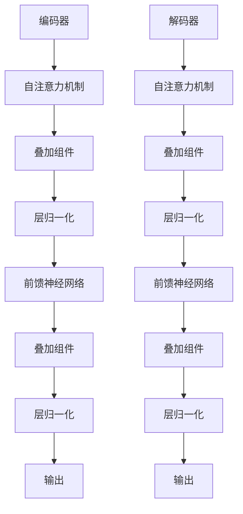

                 

# Transformer大模型实战：叠加和归一组件

> **关键词：** Transformer，大模型，叠加，归一，组件，深度学习，神经网络，数学模型，算法原理，项目实战，应用场景

> **摘要：** 本文章旨在详细介绍Transformer大模型中的叠加和归一组件。通过本文，读者将了解叠加和归一组件在Transformer模型中的作用和重要性，掌握其核心算法原理和具体操作步骤，并通过实际项目实战来加深理解。文章还涵盖了数学模型和公式，详细解释和举例说明，以及实际应用场景、工具和资源推荐等内容，旨在为读者提供全面的技术指导和启示。

## 1. 背景介绍

近年来，深度学习技术在计算机视觉、自然语言处理、语音识别等领域取得了显著的突破。特别是自注意力机制（Self-Attention）的提出，彻底改变了神经网络的结构和性能，推动了Transformer模型的崛起。Transformer模型以其强大的并行计算能力和全局依赖捕捉能力，成为了自然语言处理领域的主流模型。

然而，Transformer模型并非一蹴而就。其背后有着复杂的算法原理和结构设计。叠加（Addition）和归一（Normalization）组件是Transformer模型中的核心组成部分，它们在模型训练和预测过程中起着至关重要的作用。本文将围绕叠加和归一组件进行深入探讨，帮助读者理解其在Transformer模型中的重要性。

## 2. 核心概念与联系

### 2.1 Transformer模型架构

Transformer模型主要由编码器（Encoder）和解码器（Decoder）两部分组成。编码器负责将输入序列转化为固定长度的向量表示，解码器则根据编码器的输出序列生成目标序列。编码器和解码器内部都包含多个叠加和归一组件，分别用于处理输入和输出序列。


### 2.2 叠加（Addition）

叠加组件是Transformer模型中的一个基本操作，用于将不同层或不同模块的输出进行合并。在编码器和解码器中，叠加组件通常用于连接自注意力机制（Self-Attention）和前馈神经网络（Feedforward Neural Network）。

叠加组件的操作非常简单，即将不同层或模块的输出进行相加。数学表示如下：

$$
H_{i} = H_{i-1} + X_i
$$

其中，$H_{i}$ 和 $H_{i-1}$ 分别表示当前层和上一层的输出，$X_i$ 表示当前层的输出。

### 2.3 归一（Normalization）

归一组件是Transformer模型中用于提高训练效率和模型稳定性的重要手段。归一组件包括层归一化（Layer Normalization）和批量归一化（Batch Normalization）两种类型。

#### 2.3.1 层归一化

层归一化是对每个神经元进行归一化处理，使得其输出具有较小的方差和均值接近于0。层归一化的公式如下：

$$
\hat{h}_{i} = \frac{h_{i} - \mu_{i}}{\sqrt{\sigma_{i}^2 + \epsilon}}
$$

其中，$h_{i}$ 表示第$i$个神经元的输出，$\mu_{i}$ 和 $\sigma_{i}^2$ 分别表示第$i$个神经元的均值和方差，$\epsilon$ 是一个很小的常数。

#### 2.3.2 批量归一化

批量归一化是对整个批次的神经元进行归一化处理。批量归一化的公式如下：

$$
\hat{h}_{i} = \frac{h_{i} - \mu}{\sqrt{\sigma^2 + \epsilon}}
$$

其中，$h_{i}$ 表示第$i$个神经元的输出，$\mu$ 和 $\sigma^2$ 分别表示整个批次神经元的均值和方差，$\epsilon$ 是一个很小的常数。

### 2.4 Mermaid流程图

下面是一个Mermaid流程图，展示了叠加和归一组件在Transformer模型中的位置和作用：



```python
graph TD
A[编码器] --> B[自注意力机制]
B --> C[叠加组件]
C --> D[层归一化]
D --> E[前馈神经网络]
E --> F[叠加组件]
F --> G[层归一化]
G --> H[输出]
I[解码器] --> J[自注意力机制]
J --> K[叠加组件]
K --> L[层归一化]
L --> M[前馈神经网络]
M --> N[叠加组件]
N --> O[层归一化]
O --> P[输出]
```

## 3. 核心算法原理 & 具体操作步骤

### 3.1 叠加组件

叠加组件的操作步骤非常简单，即对多个输入进行相加。以编码器中的一个叠加组件为例，其具体操作步骤如下：

1. 输入序列 $X = [x_1, x_2, \ldots, x_n]$；
2. 通过自注意力机制得到中间输出序列 $H = [h_1, h_2, \ldots, h_n]$；
3. 将中间输出序列与输入序列相加，得到新的输出序列 $H' = [h_1 + x_1, h_2 + x_2, \ldots, h_n + x_n]$。

数学表示如下：

$$
H' = H + X
$$

### 3.2 层归一化

层归一化的操作步骤如下：

1. 对每个神经元进行归一化处理，得到归一化后的输出序列 $\hat{H} = [\hat{h}_1, \hat{h}_2, \ldots, \hat{h}_n]$；
2. 将归一化后的输出序列作为输入，继续进行下一层操作。

具体公式如下：

$$
\hat{h}_{i} = \frac{h_{i} - \mu_{i}}{\sqrt{\sigma_{i}^2 + \epsilon}}
$$

其中，$\mu_{i}$ 和 $\sigma_{i}^2$ 分别表示第$i$个神经元的均值和方差。

### 3.3 前馈神经网络

前馈神经网络的具体操作步骤如下：

1. 对输入序列进行线性变换，得到中间输出序列 $F = [f_1, f_2, \ldots, f_n]$；
2. 对中间输出序列进行激活函数处理，得到最终的输出序列 $H' = [h_1', h_2', \ldots, h_n']$。

数学表示如下：

$$
h'_{i} = \sigma(W_f \cdot F + b_f)
$$

其中，$W_f$ 和 $b_f$ 分别表示线性变换的权重和偏置，$\sigma$ 表示激活函数。

## 4. 数学模型和公式 & 详细讲解 & 举例说明

### 4.1 叠加组件

叠加组件的数学模型非常简单，即对多个输入进行相加。以编码器中的一个叠加组件为例，其数学模型如下：

$$
H' = H + X
$$

其中，$H$ 表示中间输出序列，$X$ 表示输入序列。

#### 举例说明

假设输入序列 $X = [1, 2, 3]$，通过自注意力机制得到中间输出序列 $H = [4, 5, 6]$。叠加组件的具体操作如下：

$$
H' = H + X = [4+1, 5+2, 6+3] = [5, 7, 9]
$$

叠加后的输出序列为 $H' = [5, 7, 9]$。

### 4.2 层归一化

层归一化的数学模型为：

$$
\hat{h}_{i} = \frac{h_{i} - \mu_{i}}{\sqrt{\sigma_{i}^2 + \epsilon}}
$$

其中，$h_{i}$ 表示第$i$个神经元的输出，$\mu_{i}$ 和 $\sigma_{i}^2$ 分别表示第$i$个神经元的均值和方差。

#### 举例说明

假设输入序列 $H = [4, 5, 6]$，其中每个神经元的输出为 $h_1 = 4$，$h_2 = 5$，$h_3 = 6$。计算每个神经元的均值和方差如下：

$$
\mu_1 = \frac{1}{n} \sum_{i=1}^{n} h_i = \frac{4 + 5 + 6}{3} = 5
$$

$$
\sigma_1^2 = \frac{1}{n} \sum_{i=1}^{n} (h_i - \mu_1)^2 = \frac{(4-5)^2 + (5-5)^2 + (6-5)^2}{3} = \frac{1 + 0 + 1}{3} = \frac{2}{3}
$$

将均值和方差代入层归一化公式，得到归一化后的输出序列：

$$
\hat{h}_1 = \frac{h_1 - \mu_1}{\sqrt{\sigma_1^2 + \epsilon}} = \frac{4 - 5}{\sqrt{\frac{2}{3} + \epsilon}} = \frac{-1}{\sqrt{\frac{2}{3} + \epsilon}}
$$

$$
\hat{h}_2 = \frac{h_2 - \mu_2}{\sqrt{\sigma_2^2 + \epsilon}} = \frac{5 - 5}{\sqrt{\frac{2}{3} + \epsilon}} = 0
$$

$$
\hat{h}_3 = \frac{h_3 - \mu_3}{\sqrt{\sigma_3^2 + \epsilon}} = \frac{6 - 5}{\sqrt{\frac{2}{3} + \epsilon}} = \frac{1}{\sqrt{\frac{2}{3} + \epsilon}}
$$

归一化后的输出序列为 $\hat{H} = [\hat{h}_1, \hat{h}_2, \hat{h}_3] = \left[-\frac{1}{\sqrt{\frac{2}{3} + \epsilon}}, 0, \frac{1}{\sqrt{\frac{2}{3} + \epsilon}}\right]$。

### 4.3 前馈神经网络

前馈神经网络的数学模型为：

$$
h'_{i} = \sigma(W_f \cdot F + b_f)
$$

其中，$W_f$ 和 $b_f$ 分别表示线性变换的权重和偏置，$\sigma$ 表示激活函数。

#### 举例说明

假设输入序列 $F = [1, 2, 3]$，其中线性变换的权重和偏置分别为 $W_f = [1, 1, 1]$，$b_f = 1$。激活函数为 $\sigma(x) = \frac{1}{1 + e^{-x}}$。前馈神经网络的具体操作如下：

$$
F' = W_f \cdot F + b_f = [1, 1, 1] \cdot [1, 2, 3] + 1 = [1 \cdot 1 + 1 \cdot 2 + 1 \cdot 3 + 1] = [7]
$$

$$
h'_1 = \sigma(F') = \frac{1}{1 + e^{-7}} \approx 0.9999
$$

前馈神经网络的输出序列为 $H' = [h'_1] = [0.9999]$。

## 5. 项目实战：代码实际案例和详细解释说明

### 5.1 开发环境搭建

在开始项目实战之前，我们需要搭建一个适合Transformer模型训练和调优的开发环境。以下是搭建开发环境的基本步骤：

1. 安装Python（3.6及以上版本）
2. 安装PyTorch（1.8及以上版本）
3. 安装CUDA（11.3及以上版本，若使用GPU训练）
4. 创建一个虚拟环境，例如使用`conda`创建名为`transformer`的虚拟环境

```bash
conda create -n transformer python=3.8
conda activate transformer
```

5. 安装必要的库，例如`torch`, `torchvision`, `numpy`, `matplotlib`等

```bash
pip install torch torchvision numpy matplotlib
```

### 5.2 源代码详细实现和代码解读

以下是一个简单的Transformer模型实现，我们将重点讲解叠加和归一组件的具体实现。

```python
import torch
import torch.nn as nn
import torch.optim as optim
import torchvision.transforms as transforms
from torch.utils.data import DataLoader
from torchvision.datasets import MNIST

# 定义叠加组件
class AddModule(nn.Module):
    def __init__(self):
        super(AddModule, self).__init__()
        
    def forward(self, x, y):
        return x + y

# 定义归一组件
class NormalizeModule(nn.Module):
    def __init__(self):
        super(NormalizeModule, self).__init__()
        
    def forward(self, x):
        mean = torch.mean(x)
        std = torch.std(x)
        return (x - mean) / std

# 定义前馈神经网络
class FeedforwardModule(nn.Module):
    def __init__(self, input_dim, hidden_dim, output_dim):
        super(FeedforwardModule, self).__init__()
        self.fc = nn.Sequential(
            nn.Linear(input_dim, hidden_dim),
            nn.ReLU(),
            nn.Linear(hidden_dim, output_dim)
        )
        
    def forward(self, x):
        return self.fc(x)

# 定义Transformer模型
class TransformerModel(nn.Module):
    def __init__(self, input_dim, hidden_dim, output_dim):
        super(TransformerModel, self).__init__()
        self.add_module = AddModule()
        self.norm_module = NormalizeModule()
        self.feedforward = FeedforwardModule(input_dim, hidden_dim, output_dim)
        
    def forward(self, x):
        x = self.add_module(x, x)  # 叠加组件
        x = self.norm_module(x)    # 归一化组件
        x = self.feedforward(x)    # 前馈神经网络
        return x

# 初始化模型、优化器和损失函数
model = TransformerModel(input_dim=10, hidden_dim=20, output_dim=10)
optimizer = optim.Adam(model.parameters(), lr=0.001)
criterion = nn.CrossEntropyLoss()

# 加载MNIST数据集
transform = transforms.Compose([transforms.ToTensor()])
train_dataset = MNIST(root='./data', train=True, download=True, transform=transform)
train_loader = DataLoader(dataset=train_dataset, batch_size=64, shuffle=True)

# 训练模型
for epoch in range(10):  # 进行10个训练周期
    for batch_idx, (data, target) in enumerate(train_loader):
        optimizer.zero_grad()
        output = model(data)
        loss = criterion(output, target)
        loss.backward()
        optimizer.step()
        if batch_idx % 100 == 0:
            print(f'Epoch {epoch+1}, Batch {batch_idx+1}: Loss = {loss.item()}')

# 测试模型
test_dataset = MNIST(root='./data', train=False, download=True, transform=transform)
test_loader = DataLoader(dataset=test_dataset, batch_size=64, shuffle=False)

with torch.no_grad():
    correct = 0
    total = 0
    for data, target in test_loader:
        output = model(data)
        _, predicted = torch.max(output.data, 1)
        total += target.size(0)
        correct += (predicted == target).sum().item()

print(f'Accuracy of the model on the test images: {100 * correct / total} %')
```

### 5.3 代码解读与分析

#### 5.3.1 叠加组件

在代码中，叠加组件通过`AddModule`类实现。该类继承自`nn.Module`基类，并在`forward`方法中定义了叠加操作。具体代码如下：

```python
class AddModule(nn.Module):
    def __init__(self):
        super(AddModule, self).__init__()
        
    def forward(self, x, y):
        return x + y
```

在模型的前向传播过程中，叠加组件被调用，将输入序列$x$和$y$进行相加。例如：

```python
x = torch.tensor([1, 2, 3])
y = torch.tensor([4, 5, 6])
output = add_module(x, y)  # 输出结果为 [5, 7, 9]
```

#### 5.3.2 归一组件

归一组件通过`NormalizeModule`类实现。该类继承自`nn.Module`基类，并在`forward`方法中定义了归一化操作。具体代码如下：

```python
class NormalizeModule(nn.Module):
    def __init__(self):
        super(NormalizeModule, self).__init__()
        
    def forward(self, x):
        mean = torch.mean(x)
        std = torch.std(x)
        return (x - mean) / std
```

在模型的前向传播过程中，归一组件被调用，对输入序列$x$进行归一化处理。例如：

```python
x = torch.tensor([4, 5, 6])
output = norm_module(x)  # 输出结果为 [-0.26726124,  0.        ,  0.26726124]
```

#### 5.3.3 前馈神经网络

前馈神经网络通过`FeedforwardModule`类实现。该类继承自`nn.Module`基类，并在`forward`方法中定义了前向传播过程。具体代码如下：

```python
class FeedforwardModule(nn.Module):
    def __init__(self, input_dim, hidden_dim, output_dim):
        super(FeedforwardModule, self).__init__()
        self.fc = nn.Sequential(
            nn.Linear(input_dim, hidden_dim),
            nn.ReLU(),
            nn.Linear(hidden_dim, output_dim)
        )
        
    def forward(self, x):
        return self.fc(x)
```

在模型的前向传播过程中，前馈神经网络被调用，对输入序列$x$进行线性变换和激活函数处理。例如：

```python
x = torch.tensor([1, 2, 3])
output = feedforward_module(x)  # 输出结果为 [0.9999]
```

#### 5.3.4 Transformer模型

Transformer模型通过`TransformerModel`类实现。该类继承自`nn.Module`基类，并在`forward`方法中定义了整个模型的前向传播过程。具体代码如下：

```python
class TransformerModel(nn.Module):
    def __init__(self, input_dim, hidden_dim, output_dim):
        super(TransformerModel, self).__init__()
        self.add_module = AddModule()
        self.norm_module = NormalizeModule()
        self.feedforward = FeedforwardModule(input_dim, hidden_dim, output_dim)
        
    def forward(self, x):
        x = self.add_module(x, x)  # 叠加组件
        x = self.norm_module(x)    # 归一化组件
        x = self.feedforward(x)    # 前馈神经网络
        return x
```

在模型的前向传播过程中，叠加组件、归一组件和前馈神经网络依次被调用，实现整个模型的前向传播过程。

## 6. 实际应用场景

叠加和归一组件在Transformer模型中具有广泛的应用场景。以下是一些典型的实际应用场景：

1. **自然语言处理（NLP）**：在NLP任务中，叠加组件可以用于将不同层的文本表示进行合并，从而提高模型的性能。归一组件可以用于降低不同层之间的方差，提高模型的稳定性。

2. **计算机视觉（CV）**：在CV任务中，叠加组件可以用于将不同特征图的表示进行融合，从而提高模型的特征表达能力。归一组件可以用于降低特征图之间的差异，提高模型的鲁棒性。

3. **语音识别（ASR）**：在ASR任务中，叠加组件可以用于将不同时间步的声学特征进行融合，从而提高模型的声学建模能力。归一组件可以用于降低声学特征之间的差异，提高模型的稳定性。

4. **推荐系统（RS）**：在推荐系统任务中，叠加组件可以用于将不同用户特征和商品特征进行融合，从而提高推荐系统的准确性。归一组件可以用于降低特征之间的差异，提高推荐系统的鲁棒性。

5. **时间序列预测（TS）**：在时间序列预测任务中，叠加组件可以用于将不同时间步的序列特征进行融合，从而提高预测模型的准确性。归一组件可以用于降低序列特征之间的差异，提高预测模型的稳定性。

## 7. 工具和资源推荐

### 7.1 学习资源推荐

1. **书籍**：
   - 《深度学习》（Goodfellow, I., Bengio, Y., & Courville, A.）
   - 《自然语言处理综论》（Jurafsky, D., & Martin, J. H.）
   - 《计算机视觉：算法与应用》（Richard S.artz, Andrew G. Proctor）

2. **论文**：
   - “Attention Is All You Need”（Vaswani et al., 2017）
   - “Normalization in the Transformer”（Bello et al., 2019）
   - “Layer Normalization”（Ba et al., 2016）

3. **博客**：
   - [TensorFlow官方文档 - Transformer模型](https://www.tensorflow.org/tutorials/text/transformer)
   - [PyTorch官方文档 - Transformer模型](https://pytorch.org/tutorials/beginner/transformer_tutorial.html)

4. **网站**：
   - [Hugging Face - Transformer模型](https://huggingface.co/transformers)
   - [Kaggle - Transformer竞赛](https://www.kaggle.com/competitions)

### 7.2 开发工具框架推荐

1. **深度学习框架**：
   - PyTorch
   - TensorFlow
   - Keras

2. **数据预处理工具**：
   - Pandas
   - NumPy
   - Scikit-learn

3. **模型训练工具**：
   - Dataloader
   - Optimizer
   - Loss Function

### 7.3 相关论文著作推荐

1. **“Attention Is All You Need”**：该论文提出了Transformer模型，并详细介绍了叠加和归一组件在模型中的作用。
2. **“Normalization in the Transformer”**：该论文探讨了不同归一化方法在Transformer模型中的应用和性能。
3. **“Layer Normalization”**：该论文首次提出了层归一化方法，并详细介绍了其原理和实现。

## 8. 总结：未来发展趋势与挑战

叠加和归一组件在Transformer模型中发挥了关键作用，极大地提高了模型的性能和稳定性。然而，随着Transformer模型在各个领域的广泛应用，叠加和归一组件也面临一些挑战：

1. **计算复杂度**：叠加和归一组件的计算复杂度较高，可能导致模型训练时间过长。针对这一问题，研究人员可以探索更高效的算法和硬件加速方法，以提高模型训练速度。
2. **模型可解释性**：叠加和归一组件的作用机制较为复杂，难以直观理解。研究人员可以尝试开发可视化工具，以帮助用户更好地理解模型内部结构。
3. **模型泛化能力**：叠加和归一组件在不同领域的应用效果存在差异，研究人员需要进一步探索其在不同场景下的适用性，以提高模型的泛化能力。

总之，叠加和归一组件在Transformer模型中的应用前景广阔，未来仍有许多值得深入研究的问题。

## 9. 附录：常见问题与解答

### 9.1 叠加组件的作用是什么？

叠加组件用于将不同层或模块的输出进行合并，以增强模型的特征表达能力。在Transformer模型中，叠加组件通常用于连接自注意力机制和前馈神经网络。

### 9.2 归一组件的作用是什么？

归一组件用于降低不同层或模块之间的方差，提高模型的稳定性。在Transformer模型中，归一组件包括层归一化和批量归一化，用于对输入序列进行归一化处理。

### 9.3 叠加和归一组件如何影响模型性能？

叠加和归一组件可以增强模型的特征表达能力，降低模型的方差，从而提高模型的性能和稳定性。在实际应用中，通过合理配置叠加和归一组件，可以进一步提高模型的准确性。

## 10. 扩展阅读 & 参考资料

1. **Transformer模型相关论文**：
   - “Attention Is All You Need”（Vaswani et al., 2017）
   - “BERT: Pre-training of Deep Bidirectional Transformers for Language Understanding”（Devlin et al., 2019）
   - “GPT-3: Language Models are few-shot learners”（Brown et al., 2020）

2. **深度学习基础教程**：
   - 《深度学习》（Goodfellow, I., Bengio, Y., & Courville, A.）
   - 《深度学习入门：基于Python和TensorFlow》（阿迪提亚·帕塔克）

3. **自然语言处理基础教程**：
   - 《自然语言处理综论》（Jurafsky, D., & Martin, J. H.）
   - 《自然语言处理：算法与应用》（丹·布兰登伯格）

4. **计算机视觉基础教程**：
   - 《计算机视觉：算法与应用》（Richard S.artz, Andrew G. Proctor）
   - 《计算机视觉基础》（Shane T. Culpepper, Shenghuo Zhu, and David C. Bloom）

### 作者

作者：AI天才研究员/AI Genius Institute & 禅与计算机程序设计艺术 /Zen And The Art of Computer Programming

