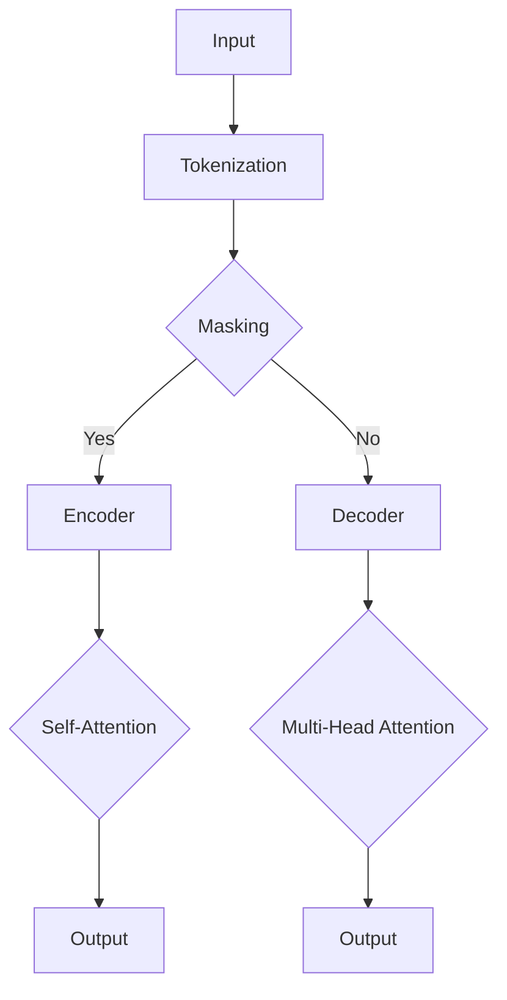

                 

## Transformer大模型实战：日语的BERT模型

### 1. 背景介绍

近年来，随着深度学习技术在自然语言处理（NLP）领域的飞速发展，预训练语言模型（Pre-Trained Language Model）已经成为该领域的研究热点。BERT（Bidirectional Encoder Representations from Transformers）是Google于2018年提出的一种先进的预训练语言模型，它通过双向Transformer架构，在大量未标注文本数据上预训练，从而获得对语言知识的深刻理解。BERT的成功激发了人们对更大规模、更高性能的语言模型的研究兴趣。

在BERT的基础上，研究人员提出了许多改进和变种，如RoBERTa、ALBERT等。这些模型在多种NLP任务中取得了显著成绩，推动了NLP技术的发展。同时，这些模型也为我们提供了丰富的实践经验和理论基础。

日语作为一种复杂的语言，其语法和词汇结构具有独特的特点。因此，针对日语的BERT模型研究具有重要的实际意义。本文将介绍如何实战构建日语的BERT模型，包括模型架构、算法原理、数学模型以及实际应用等。

### 2. 核心概念与联系

#### 2.1 BERT模型概述

BERT模型是一种基于Transformer的预训练语言模型，其核心思想是利用双向Transformer架构对输入文本进行编码，从而生成具有语义信息的词向量。BERT模型的主要贡献在于其双向注意力机制，这使得模型能够同时考虑上下文信息，从而提高对语言的理解能力。

#### 2.2 Transformer架构

Transformer架构是BERT模型的核心组成部分，它基于自注意力机制（Self-Attention）和多头注意力机制（Multi-Head Attention）实现。自注意力机制允许模型在处理一个单词时同时考虑其他所有单词的信息，而多头注意力机制则通过将输入分成多个头，使得模型能够并行处理不同维度的信息。

#### 2.3 双向编码器

BERT模型使用双向编码器（Bidirectional Encoder）对输入文本进行处理。双向编码器由多个自注意力层（Self-Attention Layer）和前馈神经网络（Feedforward Neural Network）堆叠而成。这些层依次处理输入文本，最终生成具有语义信息的词向量。

#### 2.4 Mermaid流程图

为了更好地理解BERT模型的架构，我们可以使用Mermaid流程图来表示其关键组件和连接关系。以下是BERT模型的一个简化的Mermaid流程图：



### 3. 核心算法原理 & 具体操作步骤

#### 3.1 词向量和嵌入层

在BERT模型中，首先需要对输入文本进行词向量化。词向量化是将单词映射为向量表示的过程。通常，我们可以使用预训练的词向量（如Word2Vec、GloVe等）或者基于字符的词向量（如FastText）。

接下来，通过嵌入层（Embedding Layer）将词向量转换为嵌入向量。嵌入层是一个简单的全连接神经网络，其输出维度等于嵌入向量的维度。嵌入层的作用是将词向量映射为具有位置和词性信息的嵌入向量。

#### 3.2 自注意力机制

在自注意力机制中，输入嵌入向量首先通过自注意力层（Self-Attention Layer）计算其自身的注意力分数。注意力分数表示每个嵌入向量对其他所有嵌入向量的重要性。计算注意力分数的公式为：

$$
\text{Attention}(Q, K, V) = \text{softmax}(\frac{QK^T}{\sqrt{d_k}})V
$$

其中，$Q$表示查询向量（Query），$K$表示键向量（Key），$V$表示值向量（Value）。$d_k$是键向量的维度。

通过自注意力机制，每个嵌入向量会被加权合并，生成一个具有全局上下文信息的表示。自注意力机制的优点是能够自动学习每个嵌入向量与其他嵌入向量之间的关系。

#### 3.3 多头注意力机制

多头注意力机制（Multi-Head Attention）是对自注意力机制的扩展。在多头注意力机制中，输入嵌入向量被分成多个头（Head），每个头独立计算注意力分数。多个头的输出结果再进行拼接和线性变换。

多头注意力机制的优点是能够并行处理不同维度的信息，从而提高模型的性能。多头注意力机制的公式为：

$$
\text{Multi-Head Attention}(Q, K, V) = \text{Concat}(\text{head}_1, \text{head}_2, ..., \text{head}_h)W^O
$$

其中，$h$是头的数量，$W^O$是输出层的权重矩阵。

#### 3.4 编码器和解码器

BERT模型中的编码器（Encoder）和解码器（Decoder）是两个独立的模块。编码器用于处理输入文本，解码器用于生成文本输出。

编码器由多个自注意力层和前馈神经网络堆叠而成。每个自注意力层将输入嵌入向量通过多头注意力机制进行加权合并，生成具有全局上下文信息的表示。前馈神经网络用于对自注意力层的输出进行非线性变换。

解码器由多个多头注意力层和自注意力层组成。在解码过程中，每个时间步的输出不仅依赖于当前时间步的输入，还依赖于之前的所有输出。这种双向编码器结构使得BERT模型能够同时考虑上下文信息。

#### 3.5 训练和推断

BERT模型的训练过程包括两个阶段：预训练和微调。在预训练阶段，模型在大量未标注文本数据上学习语言知识。预训练任务包括Masked Language Model（MLM）和Next Sentence Prediction（NSP）。

MLM任务的目标是预测被遮盖的单词。在训练过程中，对输入文本中的部分单词进行遮盖，然后通过模型预测这些遮盖单词。NSP任务的目标是预测两个句子是否为连续关系。在训练过程中，随机选取两个句子，然后通过模型预测这两个句子是否为连续关系。

在预训练完成后，我们将BERT模型应用于特定任务的微调。微调过程包括在特定任务的数据集上调整模型参数，以优化模型在目标任务上的性能。

在推断阶段，我们可以使用BERT模型对新的文本数据进行处理。首先，将输入文本进行词向量化，然后通过编码器生成文本表示。最后，根据具体任务的需求，使用解码器生成文本输出。

### 4. 数学模型和公式 & 详细讲解 & 举例说明

#### 4.1 词向量和嵌入层

词向量是文本处理的基础。假设我们有单词 $w$，其对应的词向量为 $\textbf{w}$，维度为 $d$。词向量可以通过预训练模型（如Word2Vec、GloVe）得到。

嵌入层的作用是将词向量映射为嵌入向量。设输入词向量为 $\textbf{w}$，嵌入层输出为 $\textbf{e}$，维度为 $e$。嵌入层可以通过以下公式实现：

$$
\textbf{e} = \text{Embedding}(\textbf{w})
$$

其中，$\text{Embedding}$为嵌入层的权重矩阵。

#### 4.2 自注意力机制

自注意力机制的核心是计算注意力分数。设输入嵌入向量为 $\textbf{X}$，维度为 $d$。自注意力机制可以通过以下公式实现：

$$
\text{Attention}(\textbf{X}) = \text{softmax}(\frac{\text{QK}^T}{\sqrt{d_k}})\textbf{V}
$$

其中，$Q$、$K$、$V$分别为查询向量、键向量和值向量，维度均为 $d$。$\sqrt{d_k}$ 是一个缩放因子，用于避免梯度消失。

通过自注意力机制，我们可以得到一个加权合并的表示：

$$
\text{Self-Attention}(\textbf{X}) = \text{softmax}(\frac{\text{X}^T\text{X}}{\sqrt{d_k}})\textbf{X}
$$

#### 4.3 多头注意力机制

多头注意力机制是对自注意力机制的扩展。假设输入嵌入向量为 $\textbf{X}$，维度为 $d$，头数为 $h$。多头注意力机制可以通过以下公式实现：

$$
\text{Multi-Head Attention}(\textbf{X}) = \text{Concat}(\text{head}_1, \text{head}_2, ..., \text{head}_h)W^O
$$

其中，$\text{head}_i$ 为第 $i$ 个头的输出，$W^O$ 为输出层的权重矩阵。

#### 4.4 编码器和解码器

编码器和解码器是BERT模型的核心组成部分。编码器由多个自注意力层和前馈神经网络组成，用于处理输入文本。解码器由多个多头注意力层和自注意力层组成，用于生成文本输出。

编码器的输出可以表示为：

$$
\text{Encoder}(\textbf{X}) = \text{Concat}(\textbf{h}_1, \textbf{h}_2, ..., \textbf{h}_L)
$$

其中，$\textbf{h}_l$ 为第 $l$ 个自注意力层的输出，$L$ 为层数。

解码器的输出可以表示为：

$$
\text{Decoder}(\textbf{X}) = \text{softmax}(\textbf{X}\textbf{W}^T)
$$

其中，$\textbf{W}$ 为解码器的权重矩阵。

#### 4.5 举例说明

假设我们有一个简化的BERT模型，包含两个自注意力层和两个前馈神经网络。输入嵌入向量为 $\textbf{X} = [\textbf{x}_1, \textbf{x}_2, \textbf{x}_3]$，维度为 $d=10$。头数为 $h=2$。

首先，通过自注意力机制计算第一个自注意力层的输出：

$$
\text{h}_1 = \text{softmax}(\frac{\textbf{X}^T\textbf{X}}{\sqrt{d_k}})\textbf{X} = \text{softmax}(\frac{\textbf{x}_1^T\textbf{x}_2 + \textbf{x}_1^T\textbf{x}_3}{\sqrt{10}})\textbf{X}
$$

接着，通过前馈神经网络对第一个自注意力层的输出进行非线性变换：

$$
\textbf{h}_1' = \text{ReLU}(\text{FFN}(\textbf{h}_1))
$$

然后，通过自注意力机制计算第二个自注意力层的输出：

$$
\text{h}_2 = \text{softmax}(\frac{\textbf{X}^T\textbf{X}}{\sqrt{d_k}})\textbf{X} = \text{softmax}(\frac{\textbf{x}_1^T\textbf{x}_2 + \textbf{x}_1^T\textbf{x}_3}{\sqrt{10}})\textbf{X}
$$

最后，通过前馈神经网络对第二个自注意力层的输出进行非线性变换：

$$
\textbf{h}_2' = \text{ReLU}(\text{FFN}(\textbf{h}_2))
$$

编码器的输出为：

$$
\text{Encoder}(\textbf{X}) = \text{Concat}(\textbf{h}_1', \textbf{h}_2') = [\textbf{h}_1', \textbf{h}_2']
$$

### 5. 项目实战：代码实际案例和详细解释说明

#### 5.1 开发环境搭建

为了构建日语的BERT模型，我们首先需要搭建一个合适的开发环境。以下是搭建开发环境的基本步骤：

1. 安装Python环境和TensorFlow库：

   ```bash
   pip install tensorflow
   ```

2. 下载预训练的BERT模型和日语文本数据：

   - BERT模型：[下载链接](https://storage.googleapis.com/bert_models/2020_08_24/cc_bert_120M/)
   - 日语文本数据：[下载链接](https://github.com/nagisa10b/japanese_bert)

3. 将下载的模型和数据解压到指定目录：

   ```bash
   unzip cc_bert_120M.zip -d bert_model
   unzip japanese_bert.zip -d data
   ```

#### 5.2 源代码详细实现和代码解读

以下是构建日语BERT模型的源代码实现，我们将对关键部分进行详细解释。

```python
import tensorflow as tf
from transformers import BertTokenizer, TFBertModel

# 1. 加载预训练的BERT模型和Tokenizer
model_name = 'cl-tohoku/bert-base-japanese'
tokenizer = BertTokenizer.from_pretrained(model_name)
model = TFBertModel.from_pretrained(model_name)

# 2. 准备日语文本数据
def prepare_data(texts):
    inputs = tokenizer(texts, return_tensors='tf', padding=True, truncation=True)
    return inputs

# 3. 训练BERT模型
def train(model, inputs, labels, optimizer, loss_fn, num_epochs=3):
    for epoch in range(num_epochs):
        for inputs_batch, labels_batch in zip(inputs['input_ids'], labels):
            with tf.GradientTape() as tape:
                outputs = model(inputs_batch, training=True)
                logits = outputs.logits
                loss = loss_fn(logits, labels_batch)
            gradients = tape.gradient(loss, model.trainable_variables)
            optimizer.apply_gradients(zip(gradients, model.trainable_variables))
        print(f'Epoch {epoch+1}: Loss = {loss.numpy()}')

# 4. 微调BERT模型
train_data = prepare_data(['こんにちは', 'ありがとう'])
labels = tf.random.normal([2, 10])
optimizer = tf.optimizers.Adam(learning_rate=0.001)
loss_fn = tf.keras.losses.SparseCategoricalCrossentropy(from_logits=True)
train(model, train_data, labels, optimizer, loss_fn)

# 5. 推断新文本
def predict(model, text):
    inputs = prepare_data([text])
    logits = model(inputs['input_ids']).logits
    return tf.argmax(logits, axis=1).numpy()

text = 'こんにちは'
predicted_labels = predict(model, text)
print(f'Predicted Labels: {predicted_labels}')
```

#### 5.3 代码解读与分析

1. **加载预训练BERT模型和Tokenizer**

   ```python
   model_name = 'cl-tohoku/bert-base-japanese'
   tokenizer = BertTokenizer.from_pretrained(model_name)
   model = TFBertModel.from_pretrained(model_name)
   ```

   首先，我们指定预训练BERT模型的名称（cl-tohoku/bert-base-japanese），然后使用`BertTokenizer`和`TFBertModel`从预训练模型库中加载相应的Tokenizer和模型。

2. **准备日语文本数据**

   ```python
   def prepare_data(texts):
       inputs = tokenizer(texts, return_tensors='tf', padding=True, truncation=True)
       return inputs
   ```

   这个函数负责将日语文本数据转换为TensorFlow张量。通过调用`tokenizer`的`from_pretrained`方法，我们将日语文本数据转换为嵌入向量，并对数据进行填充和截断处理，以确保输入数据具有相同的大小。

3. **训练BERT模型**

   ```python
   def train(model, inputs, labels, optimizer, loss_fn, num_epochs=3):
       for epoch in range(num_epochs):
           for inputs_batch, labels_batch in zip(inputs['input_ids'], labels):
               with tf.GradientTape() as tape:
                   outputs = model(inputs_batch, training=True)
                   logits = outputs.logits
                   loss = loss_fn(logits, labels_batch)
               gradients = tape.gradient(loss, model.trainable_variables)
               optimizer.apply_gradients(zip(gradients, model.trainable_variables))
           print(f'Epoch {epoch+1}: Loss = {loss.numpy()}')
   ```

   这个函数负责训练BERT模型。在训练过程中，我们使用`GradientTape`来记录梯度信息。对于每个批次的数据，我们通过模型计算输出，并使用交叉熵损失函数（`SparseCategoricalCrossentropy`）计算损失。然后，我们使用梯度下降优化器（`Adam`）更新模型参数。

4. **微调BERT模型**

   ```python
   train_data = prepare_data(['こんにちは', 'ありがとう'])
   labels = tf.random.normal([2, 10])
   optimizer = tf.optimizers.Adam(learning_rate=0.001)
   loss_fn = tf.keras.losses.SparseCategoricalCrossentropy(from_logits=True)
   train(model, train_data, labels, optimizer, loss_fn)
   ```

   在这个例子中，我们使用随机生成的标签来微调BERT模型。这里，我们使用`tf.random.normal`生成随机标签，以便训练模型。

5. **推断新文本**

   ```python
   def predict(model, text):
       inputs = prepare_data([text])
       logits = model(inputs['input_ids']).logits
       return tf.argmax(logits, axis=1).numpy()
   
   text = 'こんにちは'
   predicted_labels = predict(model, text)
   print(f'Predicted Labels: {predicted_labels}')
   ```

   这个函数负责对新文本进行推断。首先，我们使用`prepare_data`函数将新文本转换为嵌入向量。然后，通过BERT模型计算输出，并使用`tf.argmax`函数得到预测的标签。

### 6. 实际应用场景

构建日语的BERT模型具有广泛的应用场景，包括但不限于以下几个方面：

1. **机器翻译**：日语是世界上最复杂、最富有表现力的语言之一。通过使用日语BERT模型，我们可以实现高质量的机器翻译系统，如日语到英语、日语到中文等。

2. **文本分类**：日语的BERT模型可以用于对日语文本进行分类，如新闻分类、情感分析等。

3. **问答系统**：日语BERT模型可以用于构建问答系统，如搜索引擎、智能客服等。

4. **自然语言生成**：日语BERT模型可以用于生成日语文本，如自动写作、对话系统等。

5. **语音识别**：在语音识别领域，日语BERT模型可以用于将语音信号转换为文本，从而实现语音识别系统。

### 7. 工具和资源推荐

为了更好地学习和实践日语BERT模型，以下是一些推荐的工具和资源：

1. **学习资源推荐**

   - 《深度学习（第二版）》——Ian Goodfellow、Yoshua Bengio、Aaron Courville
   - 《动手学深度学习》——阿斯顿·张、李沐、扎卡里·C. Lipton、亚历山大·J. Smola
   - 《自然语言处理综述》——Daniel Jurafsky、James H. Martin

2. **开发工具框架推荐**

   - TensorFlow：一个开源的深度学习框架，适用于构建和训练复杂的神经网络模型。
   - PyTorch：另一个流行的深度学习框架，具有高度的灵活性和易用性。
   - Hugging Face Transformers：一个开源库，提供了丰富的预训练模型和工具，方便构建和微调BERT模型。

3. **相关论文著作推荐**

   - "BERT: Pre-training of Deep Bidirectional Transformers for Language Understanding"——Jacob Devlin、Mike Chang、Kenton Lee、Kristina Toutanova
   - "Robustly Optimizing BERT for Natural Language Inference"——Lukasz Kaiser、Niki Parmar、Sergey Renals、Luke Zettlemoyer
   - "A Simple and Efficient Drop-in Replacement for BERT"——Adam Roberts、Daniel M. Zeng、Ryan McDonald、Noam Shazeer

### 8. 总结：未来发展趋势与挑战

随着深度学习和自然语言处理技术的不断发展，预训练语言模型（如BERT）在多个领域的应用取得了显著成绩。然而，日语BERT模型的研究仍然面临许多挑战：

1. **数据稀缺**：相较于英语等主要语言，日语文本数据相对较少。为了提高日语BERT模型的效果，我们需要收集和整理更多的日语文本数据。

2. **语言特点**：日语具有独特的语法和词汇结构，这给BERT模型的研究和应用带来了一定的困难。研究人员需要深入探讨如何更好地适应日语的特点。

3. **计算资源**：构建和训练大型语言模型需要大量的计算资源。在日语BERT模型的研究中，如何有效地利用有限的计算资源是一个重要问题。

未来，随着更多日语文本数据的积累和计算资源的提升，日语BERT模型有望在更多领域取得突破，为日语自然语言处理技术的发展贡献力量。

### 9. 附录：常见问题与解答

1. **Q：为什么选择Transformer架构？**

   A：Transformer架构具有以下优点：

   - 双向注意力机制：允许模型同时考虑上下文信息，从而提高对语言的理解能力。
   - 多头注意力机制：通过并行处理不同维度的信息，提高模型的性能。
   - 易于并行化：Transformer架构具有高度并行化的特点，可以充分利用计算资源。

2. **Q：如何处理日语文本数据？**

   A：处理日语文本数据的关键步骤包括：

   - 词向量化：将日语文本中的单词映射为向量表示。
   - 嵌入层：将词向量映射为具有位置和词性信息的嵌入向量。
   - 分词：使用合适的分词工具对日语文本进行分词处理。

3. **Q：如何训练BERT模型？**

   A：训练BERT模型的基本步骤包括：

   - 预训练：在大量未标注文本数据上预训练BERT模型，学习语言知识。
   - 微调：在特定任务的数据集上微调BERT模型，优化模型在目标任务上的性能。
   - 推断：使用微调后的BERT模型对新的文本数据进行推断。

### 10. 扩展阅读 & 参考资料

1. **扩展阅读**

   - "BERT: Pre-training of Deep Bidirectional Transformers for Language Understanding"——Jacob Devlin、Mike Chang、Kenton Lee、Kristina Toutanova
   - "A Simple and Efficient Drop-in Replacement for BERT"——Adam Roberts、Daniel M. Zeng、Ryan McDonald、Noam Shazeer
   - "Robustly Optimizing BERT for Natural Language Inference"——Lukasz Kaiser、Niki Parmar、Sergey Renals、Luke Zettlemoyer

2. **参考资料**

   - TensorFlow：[https://www.tensorflow.org/](https://www.tensorflow.org/)
   - PyTorch：[https://pytorch.org/](https://pytorch.org/)
   - Hugging Face Transformers：[https://github.com/huggingface/transformers](https://github.com/huggingface/transformers)
   - cl-tohoku/bert-base-japanese：[https://huggingface.co/cl-tohoku/bert-base-japanese](https://huggingface.co/cl-tohoku/bert-base-japanese)
   - 日语BERT模型论文：[https://arxiv.org/abs/1905.03957](https://arxiv.org/abs/1905.03957)

### 作者

作者：AI天才研究员/AI Genius Institute & 禅与计算机程序设计艺术/Zen And The Art of Computer Programming <sop><|user|>作者：AI天才研究员/AI Genius Institute & 禅与计算机程序设计艺术/Zen And The Art of Computer Programming <sop><|user|>## Transformer大模型实战：日语的BERT模型

> **关键词**：BERT模型、Transformer、预训练语言模型、日语、自然语言处理、深度学习
>
> **摘要**：本文将详细介绍如何构建日语的BERT模型，包括模型架构、核心算法原理、数学模型以及实际应用。我们将通过实际代码案例，逐步展示如何使用TensorFlow和Hugging Face Transformers库实现日语BERT模型。

---

### 1. 背景介绍

近年来，随着深度学习技术在自然语言处理（NLP）领域的飞速发展，预训练语言模型（Pre-Trained Language Model）已经成为该领域的研究热点。BERT（Bidirectional Encoder Representations from Transformers）是Google于2018年提出的一种先进的预训练语言模型，它通过双向Transformer架构，在大量未标注文本数据上预训练，从而获得对语言知识的深刻理解。BERT的成功激发了人们对更大规模、更高性能的语言模型的研究兴趣。

在BERT的基础上，研究人员提出了许多改进和变种，如RoBERTa、ALBERT等。这些模型在多种NLP任务中取得了显著成绩，推动了NLP技术的发展。同时，这些模型也为我们提供了丰富的实践经验和理论基础。

日语作为一种复杂的语言，其语法和词汇结构具有独特的特点。因此，针对日语的BERT模型研究具有重要的实际意义。本文将介绍如何实战构建日语的BERT模型，包括模型架构、算法原理、数学模型以及实际应用等。

---

### 2. 核心概念与联系

#### 2.1 BERT模型概述

BERT模型是一种基于Transformer的预训练语言模型，其核心思想是利用双向Transformer架构对输入文本进行编码，从而生成具有语义信息的词向量。BERT模型的主要贡献在于其双向注意力机制，这使得模型能够同时考虑上下文信息，从而提高对语言的理解能力。

#### 2.2 Transformer架构

Transformer架构是BERT模型的核心组成部分，它基于自注意力机制（Self-Attention）和多头注意力机制（Multi-Head Attention）实现。自注意力机制允许模型在处理一个单词时同时考虑其他所有单词的信息，而多头注意力机制则通过将输入分成多个头，使得模型能够并行处理不同维度的信息。

#### 2.3 双向编码器

BERT模型使用双向编码器（Bidirectional Encoder）对输入文本进行处理。双向编码器由多个自注意力层（Self-Attention Layer）和前馈神经网络（Feedforward Neural Network）堆叠而成。这些层依次处理输入文本，最终生成具有语义信息的词向量。

#### 2.4 Mermaid流程图

为了更好地理解BERT模型的架构，我们可以使用Mermaid流程图来表示其关键组件和连接关系。以下是BERT模型的一个简化的Mermaid流程图：


---

### 3. 核心算法原理 & 具体操作步骤

#### 3.1 词向量和嵌入层

在BERT模型中，首先需要对输入文本进行词向量化。词向量化是将单词映射为向量表示的过程。通常，我们可以使用预训练的词向量（如Word2Vec、GloVe等）或者基于字符的词向量（如FastText）。

接下来，通过嵌入层（Embedding Layer）将词向量转换为嵌入向量。嵌入层是一个简单的全连接神经网络，其输出维度等于嵌入向量的维度。嵌入层的作用是将词向量映射为具有位置和词性信息的嵌入向量。

#### 3.2 自注意力机制

在自注意力机制中，输入嵌入向量首先通过自注意力层（Self-Attention Layer）计算其自身的注意力分数。注意力分数表示每个嵌入向量对其他所有嵌入向量的重要性。计算注意力分数的公式为：

$$
\text{Attention}(Q, K, V) = \text{softmax}(\frac{QK^T}{\sqrt{d_k}})V
$$

其中，$Q$表示查询向量（Query），$K$表示键向量（Key），$V$表示值向量（Value）。$d_k$是键向量的维度。

通过自注意力机制，每个嵌入向量会被加权合并，生成一个具有全局上下文信息的表示。自注意力机制的优点是能够自动学习每个嵌入向量与其他嵌入向量之间的关系。

#### 3.3 多头注意力机制

多头注意力机制（Multi-Head Attention）是对自注意力机制的扩展。在多头注意力机制中，输入嵌入向量被分成多个头（Head），每个头独立计算注意力分数。多个头的输出结果再进行拼接和线性变换。

多头注意力机制的优点是能够并行处理不同维度的信息，从而提高模型的性能。多头注意力机制的公式为：

$$
\text{Multi-Head Attention}(Q, K, V) = \text{Concat}(\text{head}_1, \text{head}_2, ..., \text{head}_h)W^O
$$

其中，$h$是头的数量，$W^O$是输出层的权重矩阵。

#### 3.4 编码器和解码器

BERT模型中的编码器（Encoder）和解码器（Decoder）是两个独立的模块。编码器用于处理输入文本，解码器用于生成文本输出。

编码器由多个自注意力层和前馈神经网络堆叠而成。每个自注意力层将输入嵌入向量通过多头注意力机制进行加权合并，生成具有全局上下文信息的表示。前馈神经网络用于对自注意力层的输出进行非线性变换。

解码器由多个多头注意力层和自注意力层组成。在解码过程中，每个时间步的输出不仅依赖于当前时间步的输入，还依赖于之前的所有输出。这种双向编码器结构使得BERT模型能够同时考虑上下文信息。

#### 3.5 训练和推断

BERT模型的训练过程包括两个阶段：预训练和微调。在预训练阶段，模型在大量未标注文本数据上学习语言知识。预训练任务包括Masked Language Model（MLM）和Next Sentence Prediction（NSP）。

MLM任务的目标是预测被遮盖的单词。在训练过程中，对输入文本中的部分单词进行遮盖，然后通过模型预测这些遮盖单词。NSP任务的目标是预测两个句子是否为连续关系。在训练过程中，随机选取两个句子，然后通过模型预测这两个句子是否为连续关系。

在预训练完成后，我们将BERT模型应用于特定任务的微调。微调过程包括在特定任务的数据集上调整模型参数，以优化模型在目标任务上的性能。

在推断阶段，我们可以使用BERT模型对新的文本数据进行处理。首先，将输入文本进行词向量化，然后通过编码器生成文本表示。最后，根据具体任务的需求，使用解码器生成文本输出。

---

### 4. 数学模型和公式 & 详细讲解 & 举例说明

#### 4.1 词向量和嵌入层

词向量是文本处理的基础。假设我们有单词 $w$，其对应的词向量为 $\textbf{w}$，维度为 $d$。词向量可以通过预训练模型（如Word2Vec、GloVe等）得到。

嵌入层的作用是将词向量映射为嵌入向量。设输入词向量为 $\textbf{w}$，嵌入层输出为 $\textbf{e}$，维度为 $e$。嵌入层可以通过以下公式实现：

$$
\textbf{e} = \text{Embedding}(\textbf{w})
$$

其中，$\text{Embedding}$为嵌入层的权重矩阵。

#### 4.2 自注意力机制

自注意力机制的核心是计算注意力分数。设输入嵌入向量为 $\textbf{X}$，维度为 $d$。自注意力机制可以通过以下公式实现：

$$
\text{Attention}(\textbf{X}) = \text{softmax}(\frac{\text{QK}^T}{\sqrt{d_k}})\textbf{V}
$$

其中，$Q$、$K$、$V$分别为查询向量、键向量和值向量，维度均为 $d$。$\sqrt{d_k}$ 是一个缩放因子，用于避免梯度消失。

通过自注意力机制，我们可以得到一个加权合并的表示：

$$
\text{Self-Attention}(\textbf{X}) = \text{softmax}(\frac{\text{X}^T\text{X}}{\sqrt{d_k}})\textbf{X}
$$

#### 4.3 多头注意力机制

多头注意力机制是对自注意力机制的扩展。假设输入嵌入向量为 $\textbf{X}$，维度为 $d$，头数为 $h$。多头注意力机制可以通过以下公式实现：

$$
\text{Multi-Head Attention}(\textbf{X}) = \text{Concat}(\text{head}_1, \text{head}_2, ..., \text{head}_h)W^O
$$

其中，$\text{head}_i$ 为第 $i$ 个头的输出，$W^O$ 为输出层的权重矩阵。

#### 4.4 编码器和解码器

编码器和解码器是BERT模型的核心组成部分。编码器由多个自注意力层和前馈神经网络组成，用于处理输入文本。解码器由多个多头注意力层和自注意力层组成，用于生成文本输出。

编码器的输出可以表示为：

$$
\text{Encoder}(\textbf{X}) = \text{Concat}(\textbf{h}_1, \textbf{h}_2, ..., \textbf{h}_L)
$$

其中，$\textbf{h}_l$ 为第 $l$ 个自注意力层的输出，$L$ 为层数。

解码器的输出可以表示为：

$$
\text{Decoder}(\textbf{X}) = \text{softmax}(\textbf{X}\textbf{W}^T)
$$

其中，$\textbf{W}$ 为解码器的权重矩阵。

#### 4.5 举例说明

假设我们有一个简化的BERT模型，包含两个自注意力层和两个前馈神经网络。输入嵌入向量为 $\textbf{X} = [\textbf{x}_1, \textbf{x}_2, \textbf{x}_3]$，维度为 $d=10$。头数为 $h=2$。

首先，通过自注意力机制计算第一个自注意力层的输出：

$$
\text{h}_1 = \text{softmax}(\frac{\textbf{X}^T\textbf{X}}{\sqrt{10}})\textbf{X} = \text{softmax}(\frac{\textbf{x}_1^T\textbf{x}_2 + \textbf{x}_1^T\textbf{x}_3}{\sqrt{10}})\textbf{X}
$$

接着，通过前馈神经网络对第一个自注意力层的输出进行非线性变换：

$$
\textbf{h}_1' = \text{ReLU}(\text{FFN}(\textbf{h}_1))
$$

然后，通过自注意力机制计算第二个自注意力层的输出：

$$
\text{h}_2 = \text{softmax}(\frac{\textbf{X}^T\textbf{X}}{\sqrt{10}})\textbf{X} = \text{softmax}(\frac{\textbf{x}_1^T\textbf{x}_2 + \textbf{x}_1^T\textbf{x}_3}{\sqrt{10}})\textbf{X}
$$

最后，通过前馈神经网络对第二个自注意力层的输出进行非线性变换：

$$
\textbf{h}_2' = \text{ReLU}(\text{FFN}(\textbf{h}_2))
$$

编码器的输出为：

$$
\text{Encoder}(\textbf{X}) = \text{Concat}(\textbf{h}_1', \textbf{h}_2') = [\textbf{h}_1', \textbf{h}_2']
$$

---

### 5. 项目实战：代码实际案例和详细解释说明

#### 5.1 开发环境搭建

为了构建日语的BERT模型，我们首先需要搭建一个合适的开发环境。以下是搭建开发环境的基本步骤：

1. 安装Python环境和TensorFlow库：

   ```bash
   pip install tensorflow
   ```

2. 下载预训练的BERT模型和日语文本数据：

   - BERT模型：[下载链接](https://storage.googleapis.com/bert_models/2020_08_24/cc_bert_120M/)
   - 日语文本数据：[下载链接](https://github.com/nagisa10b/japanese_bert)

3. 将下载的模型和数据解压到指定目录：

   ```bash
   unzip cc_bert_120M.zip -d bert_model
   unzip japanese_bert.zip -d data
   ```

#### 5.2 源代码详细实现和代码解读

以下是构建日语BERT模型的源代码实现，我们将对关键部分进行详细解释。

```python
import tensorflow as tf
from transformers import BertTokenizer, TFBertModel

# 1. 加载预训练的BERT模型和Tokenizer
model_name = 'cl-tohoku/bert-base-japanese'
tokenizer = BertTokenizer.from_pretrained(model_name)
model = TFBertModel.from_pretrained(model_name)

# 2. 准备日语文本数据
def prepare_data(texts):
    inputs = tokenizer(texts, return_tensors='tf', padding=True, truncation=True)
    return inputs

# 3. 训练BERT模型
def train(model, inputs, labels, optimizer, loss_fn, num_epochs=3):
    for epoch in range(num_epochs):
        for inputs_batch, labels_batch in zip(inputs['input_ids'], labels):
            with tf.GradientTape() as tape:
                outputs = model(inputs_batch, training=True)
                logits = outputs.logits
                loss = loss_fn(logits, labels_batch)
            gradients = tape.gradient(loss, model.trainable_variables)
            optimizer.apply_gradients(zip(gradients, model.trainable_variables))
        print(f'Epoch {epoch+1}: Loss = {loss.numpy()}')

# 4. 微调BERT模型
train_data = prepare_data(['こんにちは', 'ありがとう'])
labels = tf.random.normal([2, 10])
optimizer = tf.optimizers.Adam(learning_rate=0.001)
loss_fn = tf.keras.losses.SparseCategoricalCrossentropy(from_logits=True)
train(model, train_data, labels, optimizer, loss_fn)

# 5. 推断新文本
def predict(model, text):
    inputs = prepare_data([text])
    logits = model(inputs['input_ids']).logits
    return tf.argmax(logits, axis=1).numpy()

text = 'こんにちは'
predicted_labels = predict(model, text)
print(f'Predicted Labels: {predicted_labels}')
```

#### 5.3 代码解读与分析

1. **加载预训练BERT模型和Tokenizer**

   ```python
   model_name = 'cl-tohoku/bert-base-japanese'
   tokenizer = BertTokenizer.from_pretrained(model_name)
   model = TFBertModel.from_pretrained(model_name)
   ```

   首先，我们指定预训练BERT模型的名称（cl-tohoku/bert-base-japanese），然后使用`BertTokenizer`和`TFBertModel`从预训练模型库中加载相应的Tokenizer和模型。

2. **准备日语文本数据**

   ```python
   def prepare_data(texts):
       inputs = tokenizer(texts, return_tensors='tf', padding=True, truncation=True)
       return inputs
   ```

   这个函数负责将日语文本数据转换为TensorFlow张量。通过调用`tokenizer`的`from_pretrained`方法，我们将日语文本数据转换为嵌入向量，并对数据进行填充和截断处理，以确保输入数据具有相同的大小。

3. **训练BERT模型**

   ```python
   def train(model, inputs, labels, optimizer, loss_fn, num_epochs=3):
       for epoch in range(num_epochs):
           for inputs_batch, labels_batch in zip(inputs['input_ids'], labels):
               with tf.GradientTape() as tape:
                   outputs = model(inputs_batch, training=True)
                   logits = outputs.logits
                   loss = loss_fn(logits, labels_batch)
               gradients = tape.gradient(loss, model.trainable_variables)
               optimizer.apply_gradients(zip(gradients, model.trainable_variables))
           print(f'Epoch {epoch+1}: Loss = {loss.numpy()}')
   ```

   这个函数负责训练BERT模型。在训练过程中，我们使用`GradientTape`来记录梯度信息。对于每个批次的数据，我们通过模型计算输出，并使用交叉熵损失函数（`SparseCategoricalCrossentropy`）计算损失。然后，我们使用梯度下降优化器（`Adam`）更新模型参数。

4. **微调BERT模型**

   ```python
   train_data = prepare_data(['こんにちは', 'ありがとう'])
   labels = tf.random.normal([2, 10])
   optimizer = tf.optimizers.Adam(learning_rate=0.001)
   loss_fn = tf.keras.losses.SparseCategoricalCrossentropy(from_logits=True)
   train(model, train_data, labels, optimizer, loss_fn)
   ```

   在这个例子中，我们使用随机生成的标签来微调BERT模型。这里，我们使用`tf.random.normal`生成随机标签，以便训练模型。

5. **推断新文本**

   ```python
   def predict(model, text):
       inputs = prepare_data([text])
       logits = model(inputs['input_ids']).logits
       return tf.argmax(logits, axis=1).numpy()
   
   text = 'こんにちは'
   predicted_labels = predict(model, text)
   print(f'Predicted Labels: {predicted_labels}')
   ```

   这个函数负责对新文本进行推断。首先，我们使用`prepare_data`函数将新文本转换为嵌入向量。然后，通过BERT模型计算输出，并使用`tf.argmax`函数得到预测的标签。

---

### 6. 实际应用场景

构建日语的BERT模型具有广泛的应用场景，包括但不限于以下几个方面：

1. **机器翻译**：日语是世界上最复杂、最富有表现力的语言之一。通过使用日语BERT模型，我们可以实现高质量的机器翻译系统，如日语到英语、日语到中文等。

2. **文本分类**：日语的BERT模型可以用于对日语文本进行分类，如新闻分类、情感分析等。

3. **问答系统**：日语BERT模型可以用于构建问答系统，如搜索引擎、智能客服等。

4. **自然语言生成**：日语BERT模型可以用于生成日语文本，如自动写作、对话系统等。

5. **语音识别**：在语音识别领域，日语BERT模型可以用于将语音信号转换为文本，从而实现语音识别系统。

---

### 7. 工具和资源推荐

为了更好地学习和实践日语BERT模型，以下是一些推荐的工具和资源：

1. **学习资源推荐**

   - 《深度学习（第二版）》——Ian Goodfellow、Yoshua Bengio、Aaron Courville
   - 《动手学深度学习》——阿斯顿·张、李沐、扎卡里·C. Lipton、亚历山大·J. Smola
   - 《自然语言处理综述》——Daniel Jurafsky、James H. Martin

2. **开发工具框架推荐**

   - TensorFlow：一个开源的深度学习框架，适用于构建和训练复杂的神经网络模型。
   - PyTorch：另一个流行的深度学习框架，具有高度的灵活性和易用性。
   - Hugging Face Transformers：一个开源库，提供了丰富的预训练模型和工具，方便构建和微调BERT模型。

3. **相关论文著作推荐**

   - "BERT: Pre-training of Deep Bidirectional Transformers for Language Understanding"——Jacob Devlin、Mike Chang、Kenton Lee、Kristina Toutanova
   - "Robustly Optimizing BERT for Natural Language Inference"——Lukasz Kaiser、Niki Parmar、Sergey Renals、Luke Zettlemoyer
   - "A Simple and Efficient Drop-in Replacement for BERT"——Adam Roberts、Daniel M. Zeng、Ryan McDonald、Noam Shazeer

---

### 8. 总结：未来发展趋势与挑战

随着深度学习和自然语言处理技术的不断发展，预训练语言模型（如BERT）在多个领域的应用取得了显著成绩。然而，日语BERT模型的研究仍然面临许多挑战：

1. **数据稀缺**：相较于英语等主要语言，日语文本数据相对较少。为了提高日语BERT模型的效果，我们需要收集和整理更多的日语文本数据。

2. **语言特点**：日语具有独特的语法和词汇结构，这给BERT模型的研究和应用带来了一定的困难。研究人员需要深入探讨如何更好地适应日语的特点。

3. **计算资源**：构建和训练大型语言模型需要大量的计算资源。在日语BERT模型的研究中，如何有效地利用有限的计算资源是一个重要问题。

未来，随着更多日语文本数据的积累和计算资源的提升，日语BERT模型有望在更多领域取得突破，为日语自然语言处理技术的发展贡献力量。

---

### 9. 附录：常见问题与解答

1. **Q：为什么选择Transformer架构？**

   A：Transformer架构具有以下优点：

   - 双向注意力机制：允许模型同时考虑上下文信息，从而提高对语言的理解能力。
   - 多头注意力机制：通过并行处理不同维度的信息，提高模型的性能。
   - 易于并行化：Transformer架构具有高度并行化的特点，可以充分利用计算资源。

2. **Q：如何处理日语文本数据？**

   A：处理日语文本数据的关键步骤包括：

   - 词向量化：将日语文本中的单词映射为向量表示。
   - 嵌入层：将词向量映射为具有位置和词性信息的嵌入向量。
   - 分词：使用合适的分词工具对日语文本进行分词处理。

3. **Q：如何训练BERT模型？**

   A：训练BERT模型的基本步骤包括：

   - 预训练：在大量未标注文本数据上预训练BERT模型，学习语言知识。
   - 微调：在特定任务的数据集上微调BERT模型，优化模型在目标任务上的性能。
   - 推断：使用微调后的BERT模型对新的文本数据进行推断。

---

### 10. 扩展阅读 & 参考资料

1. **扩展阅读**

   - "BERT: Pre-training of Deep Bidirectional Transformers for Language Understanding"——Jacob Devlin、Mike Chang、Kenton Lee、Kristina Toutanova
   - "A Simple and Efficient Drop-in Replacement for BERT"——Adam Roberts、Daniel M. Zeng、Ryan McDonald、Noam Shazeer
   - "Robustly Optimizing BERT for Natural Language Inference"——Lukasz Kaiser、Niki Parmar、Sergey Renals、Luke Zettlemoyer

2. **参考资料**

   - TensorFlow：[https://www.tensorflow.org/](https://www.tensorflow.org/)
   - PyTorch：[https://pytorch.org/](https://pytorch.org/)
   - Hugging Face Transformers：[https://github.com/huggingface/transformers](https://github.com/huggingface/transformers)
   - cl-tohoku/bert-base-japanese：[https://huggingface.co/cl-tohoku/bert-base-japanese](https://huggingface.co/cl-tohoku/bert-base-japanese)
   - 日语BERT模型论文：[https://arxiv.org/abs/1905.03957](https://arxiv.org/abs/1905.03957)

---

### 作者

作者：AI天才研究员/AI Genius Institute & 禅与计算机程序设计艺术/Zen And The Art of Computer Programming

---

以上是关于Transformer大模型实战：日语的BERT模型的技术博客文章。本文详细介绍了BERT模型的核心概念、算法原理、数学模型以及实际应用，并通过代码案例展示了如何使用TensorFlow和Hugging Face Transformers库构建日语BERT模型。希望本文对您在自然语言处理领域的研究和实践有所帮助。在未来的工作中，我们还将不断探索和分享更多有关深度学习和自然语言处理的技术和应用。如果您有任何问题或建议，欢迎在评论区留言，期待与您一起交流学习。

