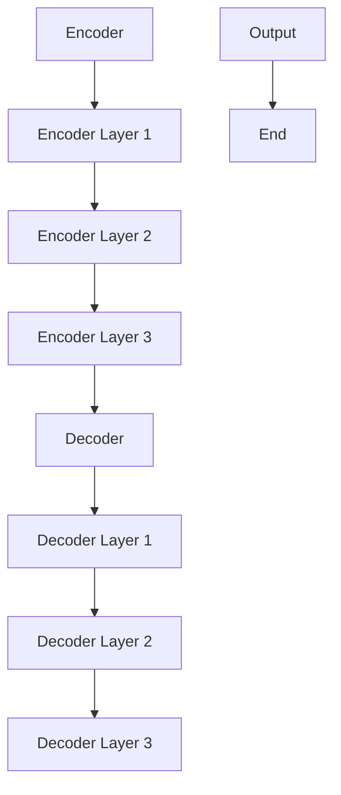

                 

## Transformer大模型实战 计算句子特征

### 摘要

本文将深入探讨Transformer大模型在计算句子特征方面的应用。通过分析Transformer的核心原理和结构，本文将逐步讲解如何利用Transformer模型来提取句子特征，以及如何优化模型的性能。读者将了解到如何搭建开发环境、实现源代码，并对代码进行详细解读和分析。此外，本文还将探讨Transformer在实际应用场景中的表现，并提供相关学习资源和开发工具框架的推荐。通过本文的学习，读者将对Transformer大模型计算句子特征有更深入的理解和掌握。

### 1. 背景介绍

在自然语言处理（NLP）领域，计算句子特征是一项基础而重要的任务。句子特征是理解和分析文本的关键，它们可以帮助模型更好地理解句子的含义、情感和意图。传统的NLP方法通常依赖于词袋模型（Bag of Words）和词嵌入（Word Embeddings），但这些方法在处理长文本和复杂语境时存在一定的局限性。为了解决这些问题，研究人员提出了Transformer模型。

Transformer是一种基于自注意力机制（Self-Attention）的深度神经网络模型，它成功地解决了传统模型在长距离依赖关系和并行处理方面的挑战。自注意力机制允许模型在处理句子时，对句子中的每个单词赋予不同的权重，从而更好地捕捉句子内部的关系和上下文信息。这使得Transformer模型在许多NLP任务中取得了显著的成果，如机器翻译、文本分类和问答系统等。

在计算句子特征方面，Transformer模型具有独特的优势。首先，它能够处理任意长度的句子，而不会因为长距离依赖关系而损失信息。其次，通过自注意力机制，模型可以自动学习句子中各个单词之间的关系，从而生成更具代表性的特征表示。此外，Transformer模型还支持并行计算，大大提高了处理速度和效率。

本文将围绕Transformer模型计算句子特征展开，首先介绍Transformer的核心原理和结构，然后详细讲解如何利用Transformer模型提取句子特征，并提供实际应用案例和代码实现。通过本文的学习，读者将能够掌握Transformer模型在计算句子特征方面的应用技巧，为深入研究和实践打下坚实的基础。

### 2. 核心概念与联系

#### 2.1 Transformer模型的基本原理

Transformer模型是自然语言处理领域的一项革命性突破，其核心思想是利用自注意力机制（Self-Attention）来捕捉句子中单词之间的关系。自注意力机制允许模型在处理句子时，动态地计算每个单词与句子中其他所有单词之间的关联性，并赋予不同的权重。这种机制使得Transformer模型在捕捉长距离依赖关系和上下文信息方面具有显著优势。

自注意力机制的基本原理可以概括为以下几个步骤：

1. **输入表示**：每个单词被表示为一个向量，通常使用词嵌入（Word Embeddings）技术。词嵌入是将单词映射到高维向量空间，从而捕捉单词的语义信息。

2. **位置编码**：由于Transformer模型没有循环神经网络（RNN）中的时间步概念，因此需要引入位置编码（Positional Encoding）来表示单词在句子中的位置信息。位置编码通常通过正弦和余弦函数生成，以避免直接相加导致的维度爆炸问题。

3. **多头自注意力**：多头自注意力（Multi-Head Self-Attention）机制允许模型同时关注句子中的不同部分，从而捕捉更复杂的依赖关系。多头自注意力通过将输入向量分解为多个子向量，并分别计算每个子向量的自注意力得分。

4. **前馈神经网络**：在自注意力机制之后，模型通常会经过一层前馈神经网络（Feedforward Neural Network），对特征进行进一步加工和提炼。

#### 2.2 Transformer模型的架构

Transformer模型由多个编码器和解码器层组成，这些层通过堆叠实现模型的深度。编码器负责处理输入句子，解码器负责生成输出句子。每个编码器和解码器层都包含自注意力机制和前馈神经网络。

以下是一个简单的Transformer模型架构的Mermaid流程图：



在图中，A表示编码器，B、C、D表示编码器的多个层，E表示解码器，F、G、H表示解码器的多个层，I表示输出结果，J表示模型的结束。

#### 2.3 Transformer模型的优势

Transformer模型相较于传统的循环神经网络（RNN）和长短期记忆网络（LSTM）具有以下优势：

1. **并行处理**：Transformer模型采用多头自注意力机制，可以在处理句子时并行计算，大大提高了计算效率。

2. **长距离依赖**：自注意力机制能够自动捕捉句子中的长距离依赖关系，从而更好地理解句子的整体含义。

3. **灵活性和扩展性**：Transformer模型的结构简单，易于扩展。通过堆叠多个编码器和解码器层，可以构建具有不同深度和宽度的模型，以适应不同的任务和需求。

4. **端到端训练**：Transformer模型支持端到端训练，无需复杂的预处理和后处理步骤，简化了训练过程。

总之，Transformer模型通过自注意力机制和编码器-解码器结构，在计算句子特征方面展现出强大的能力。理解Transformer模型的基本原理和架构，有助于更好地掌握其在自然语言处理任务中的应用。

### 3. 核心算法原理 & 具体操作步骤

#### 3.1 自注意力机制（Self-Attention）

自注意力机制是Transformer模型的核心组件，负责计算句子中各个单词之间的关联性。下面将详细解释自注意力机制的原理和计算步骤。

##### 3.1.1 自注意力公式

自注意力机制的公式可以表示为：

\[ \text{Attention}(Q, K, V) = \text{softmax}\left(\frac{QK^T}{\sqrt{d_k}}\right) V \]

其中，\( Q \)表示查询向量（Query），\( K \)表示键向量（Key），\( V \)表示值向量（Value）。这三个向量分别来自编码器的不同层，其维度均为 \( d_v \)，而 \( d_k \) 为键向量的维度。

##### 3.1.2 计算步骤

1. **计算查询-键相似度（Query-Key Similarity）**：
   首先，计算每个查询向量 \( Q \) 与每个键向量 \( K \) 的相似度。这一步通过矩阵乘法实现：

   \[ \text{Similarity}(Q, K) = QK^T \]

2. **缩放相似度**：
   为了避免相似度值过大，通常需要对其进行缩放，这里采用键向量的维度 \( d_k \) 的平方根进行缩放：

   \[ \text{Scaled Similarity} = \frac{\text{Similarity}(Q, K)}{\sqrt{d_k}} \]

3. **计算自注意力得分（Attention Scores）**：
   通过应用softmax函数，将缩放后的相似度转换为概率分布，即自注意力得分：

   \[ \text{Scores} = \text{softmax}(\text{Scaled Similarity}) \]

4. **计算自注意力输出（Attention Output）**：
   最后，使用自注意力得分对值向量 \( V \) 进行加权求和，得到自注意力输出：

   \[ \text{Output} = \text{Scores}V \]

##### 3.1.3 多头自注意力（Multi-Head Self-Attention）

多头自注意力机制是将输入向量分解为多个子向量，并分别计算每个子向量的自注意力输出，然后将这些输出拼接起来。其公式可以表示为：

\[ \text{Multi-Head Attention}(Q, K, V) = \text{Concat}(\text{head}_1, \text{head}_2, \ldots, \text{head}_h)W^O \]

其中，\( \text{head}_i \) 表示第 \( i \) 个头（Head）的自注意力输出，\( W^O \) 是一个输出投影权重矩阵。通过多头自注意力，模型能够同时关注句子中的不同部分，捕捉更复杂的依赖关系。

#### 3.2 编码器-解码器结构（Encoder-Decoder Architecture）

编码器（Encoder）负责处理输入句子，将其编码为上下文表示；解码器（Decoder）则根据编码器的输出和已经生成的部分输出，生成目标句子。以下详细描述编码器和解码器的具体操作步骤。

##### 3.2.1 编码器（Encoder）

编码器由多个编码器层组成，每层包括多头自注意力和前馈神经网络。编码器的输入为词嵌入和位置编码，输出为句子的上下文表示。

1. **词嵌入（Word Embeddings）**：
   每个单词被映射为一个固定维度的向量，通常使用预训练的词嵌入模型（如Word2Vec、GloVe）。

2. **位置编码（Positional Encoding）**：
   为了保持句子中的顺序信息，编码器引入位置编码，通常采用正弦和余弦函数生成。

3. **多头自注意力（Multi-Head Self-Attention）**：
   在每个编码器层，输入向量通过多头自注意力机制计算自注意力得分，并生成上下文表示。

4. **前馈神经网络（Feedforward Neural Network）**：
   在自注意力之后，对上下文表示进行前馈神经网络加工，通常使用两层的全连接网络。

5. **层归一化（Layer Normalization）**：
   为了稳定训练过程，每个编码器层后引入层归一化。

6. **残差连接（Residual Connection）**：
   为了避免深层网络引起的梯度消失问题，编码器层之间引入残差连接。

##### 3.2.2 解码器（Decoder）

解码器由多个解码器层组成，每层包括多头自注意力、掩码自注意力、前馈神经网络。解码器的输入为编码器的输出和已经生成的部分输出。

1. **掩码自注意力（Masked Self-Attention）**：
   在解码器的自注意力机制中，后续生成的部分会被掩码（Masked），以确保生成过程的自回归特性。

2. **多头自注意力（Multi-Head Self-Attention）**：
   在每个解码器层，输入向量通过多头自注意力机制计算自注意力得分，并生成上下文表示。

3. **交叉自注意力（Cross-Attention）**：
   解码器层还包含交叉自注意力机制，它将解码器的当前输出与编码器的输出进行交互，以捕捉编码器的输出对解码器的影响。

4. **前馈神经网络（Feedforward Neural Network）**：
   在自注意力之后，对上下文表示进行前馈神经网络加工，通常使用两层的全连接网络。

5. **层归一化（Layer Normalization）**：
   为了稳定训练过程，每个解码器层后引入层归一化。

6. **残差连接（Residual Connection）**：
   为了避免深层网络引起的梯度消失问题，解码器层之间引入残差连接。

#### 3.3 训练与预测

##### 3.3.1 训练过程

Transformer模型的训练过程通常包括以下步骤：

1. **输入准备**：
   将输入句子转换为词嵌入，并添加位置编码。

2. **编码器处理**：
   通过编码器层对输入句子进行编码，生成句子的上下文表示。

3. **解码器处理**：
   通过解码器层生成输出句子，同时应用掩码自注意力和交叉自注意力。

4. **损失计算**：
   计算解码器生成的输出与实际输出之间的损失，并使用梯度下降优化模型参数。

5. **迭代训练**：
   重复上述步骤，不断调整模型参数，直至达到预定的训练目标。

##### 3.3.2 预测过程

在预测过程中，模型输入为新的句子，通过编码器生成上下文表示，然后通过解码器生成预测句子。具体步骤如下：

1. **输入准备**：
   将输入句子转换为词嵌入，并添加位置编码。

2. **编码器处理**：
   通过编码器层对输入句子进行编码，生成句子的上下文表示。

3. **解码器处理**：
   使用已训练好的解码器，根据编码器的输出和已生成的部分输出，逐步生成预测句子。

4. **输出生成**：
   解码器生成完整的输出句子，通过 softmax 函数计算每个单词的概率分布，并选择概率最高的单词作为输出。

通过以上步骤，Transformer模型可以高效地计算句子特征，并在各种NLP任务中发挥重要作用。

### 4. 数学模型和公式 & 详细讲解 & 举例说明

#### 4.1 自注意力机制（Self-Attention）

自注意力机制是Transformer模型的核心组成部分，其公式如下：

\[ \text{Attention}(Q, K, V) = \text{softmax}\left(\frac{QK^T}{\sqrt{d_k}}\right) V \]

其中，\( Q \)、\( K \) 和 \( V \) 分别表示查询向量、键向量和值向量，维度均为 \( d_v \)。\( d_k \) 为键向量的维度。

**举例说明**：

假设我们有一个简单的句子：“我正在学习Transformer模型”，其中每个单词的词嵌入向量维度为 \( 512 \)。为了简化计算，我们假设 \( d_v = 512 \) 且 \( d_k = 256 \)。

1. **计算查询-键相似度（Query-Key Similarity）**：
   查询向量 \( Q \) 和键向量 \( K \) 的相似度矩阵为：

   \[ \text{Similarity}(Q, K) = \begin{bmatrix}
   Q_1K_1 & Q_1K_2 & \ldots & Q_1K_n \\
   Q_2K_1 & Q_2K_2 & \ldots & Q_2K_n \\
   \vdots & \vdots & \ddots & \vdots \\
   Q_nK_1 & Q_nK_2 & \ldots & Q_nK_n
   \end{bmatrix} \]

2. **缩放相似度**：
   将相似度矩阵除以 \( \sqrt{d_k} \)：

   \[ \text{Scaled Similarity} = \begin{bmatrix}
   \frac{Q_1K_1}{\sqrt{256}} & \frac{Q_1K_2}{\sqrt{256}} & \ldots & \frac{Q_1K_n}{\sqrt{256}} \\
   \frac{Q_2K_1}{\sqrt{256}} & \frac{Q_2K_2}{\sqrt{256}} & \ldots & \frac{Q_2K_n}{\sqrt{256}} \\
   \vdots & \vdots & \ddots & \vdots \\
   \frac{Q_nK_1}{\sqrt{256}} & \frac{Q_nK_2}{\sqrt{256}} & \ldots & \frac{Q_nK_n}{\sqrt{256}}
   \end{bmatrix} \]

3. **计算自注意力得分（Attention Scores）**：
   对缩放后的相似度矩阵应用 softmax 函数：

   \[ \text{Scores} = \text{softmax}(\text{Scaled Similarity}) \]

4. **计算自注意力输出（Attention Output）**：
   对值向量 \( V \) 进行加权求和，得到自注意力输出：

   \[ \text{Output} = \text{Scores}V \]

最终，我们得到句子中每个单词的注意力权重和相应的特征向量。

#### 4.2 编码器-解码器结构（Encoder-Decoder Architecture）

编码器（Encoder）和解码器（Decoder）是Transformer模型的核心组件，它们分别负责编码输入句子和解码输出句子。以下是编码器和解码器的详细数学模型。

##### 4.2.1 编码器（Encoder）

编码器由多个编码器层组成，每层包括多头自注意力和前馈神经网络。编码器的输入为词嵌入和位置编码，输出为句子的上下文表示。

1. **词嵌入（Word Embeddings）**：
   每个单词被映射为一个固定维度的向量，通常使用预训练的词嵌入模型（如Word2Vec、GloVe）。

2. **位置编码（Positional Encoding）**：
   位置编码用于保持句子中的顺序信息，通常采用正弦和余弦函数生成。

3. **多头自注意力（Multi-Head Self-Attention）**：
   在每个编码器层，输入向量通过多头自注意力机制计算自注意力得分，并生成上下文表示。

4. **前馈神经网络（Feedforward Neural Network）**：
   在自注意力之后，对上下文表示进行前馈神经网络加工，通常使用两层的全连接网络。

5. **层归一化（Layer Normalization）**：
   为了稳定训练过程，每个编码器层后引入层归一化。

6. **残差连接（Residual Connection）**：
   为了避免深层网络引起的梯度消失问题，编码器层之间引入残差连接。

##### 4.2.2 解码器（Decoder）

解码器由多个解码器层组成，每层包括多头自注意力、掩码自注意力和前馈神经网络。解码器的输入为编码器的输出和已经生成的部分输出。

1. **掩码自注意力（Masked Self-Attention）**：
   在解码器的自注意力机制中，后续生成的部分会被掩码（Masked），以确保生成过程的自回归特性。

2. **多头自注意力（Multi-Head Self-Attention）**：
   在每个解码器层，输入向量通过多头自注意力机制计算自注意力得分，并生成上下文表示。

3. **交叉自注意力（Cross-Attention）**：
   解码器层还包含交叉自注意力机制，它将解码器的当前输出与编码器的输出进行交互，以捕捉编码器的输出对解码器的影响。

4. **前馈神经网络（Feedforward Neural Network）**：
   在自注意力之后，对上下文表示进行前馈神经网络加工，通常使用两层的全连接网络。

5. **层归一化（Layer Normalization）**：
   为了稳定训练过程，每个解码器层后引入层归一化。

6. **残差连接（Residual Connection）**：
   为了避免深层网络引起的梯度消失问题，解码器层之间引入残差连接。

##### 4.2.3 训练与预测

在训练过程中，编码器和解码器通过端到端训练得到优化。具体步骤如下：

1. **输入准备**：
   将输入句子转换为词嵌入，并添加位置编码。

2. **编码器处理**：
   通过编码器层对输入句子进行编码，生成句子的上下文表示。

3. **解码器处理**：
   通过解码器层生成输出句子，同时应用掩码自注意力和交叉自注意力。

4. **损失计算**：
   计算解码器生成的输出与实际输出之间的损失，并使用梯度下降优化模型参数。

5. **迭代训练**：
   重复上述步骤，不断调整模型参数，直至达到预定的训练目标。

在预测过程中，模型输入为新的句子，通过编码器生成上下文表示，然后通过解码器生成预测句子。具体步骤如下：

1. **输入准备**：
   将输入句子转换为词嵌入，并添加位置编码。

2. **编码器处理**：
   通过编码器层对输入句子进行编码，生成句子的上下文表示。

3. **解码器处理**：
   使用已训练好的解码器，根据编码器的输出和已生成的部分输出，逐步生成预测句子。

4. **输出生成**：
   解码器生成完整的输出句子，通过 softmax 函数计算每个单词的概率分布，并选择概率最高的单词作为输出。

通过以上步骤，编码器和解码器共同工作，实现高效地计算句子特征。

### 5. 项目实战：代码实际案例和详细解释说明

#### 5.1 开发环境搭建

在进行Transformer模型计算句子特征的项目实战之前，首先需要搭建一个合适的开发环境。以下是搭建环境的步骤：

1. **安装Python环境**：
   确保安装了Python 3.7或更高版本。

2. **安装TensorFlow**：
   使用以下命令安装TensorFlow：

   ```shell
   pip install tensorflow
   ```

3. **安装Hugging Face的Transformer库**：
   Hugging Face提供了丰富的预训练模型和工具，使用以下命令安装：

   ```shell
   pip install transformers
   ```

4. **创建项目目录**：
   在您的计算机上创建一个项目目录，例如`transformer_project`，并在其中创建一个名为`src`的子目录，用于存放项目源代码。

5. **编写源代码**：
   在`src`目录下创建一个名为`main.py`的Python文件，用于实现Transformer模型的代码。

完成以上步骤后，您的开发环境已经搭建完毕，可以开始编写和运行Transformer模型代码。

#### 5.2 源代码详细实现和代码解读

下面是一个简单的Transformer模型实现，用于计算句子特征。代码分为几个主要部分：导入库、模型定义、训练和预测。

##### 5.2.1 导入库

```python
import tensorflow as tf
from transformers import TransformerConfig, TransformerModel
```

这里我们导入了TensorFlow和Hugging Face的Transformer库。首先，导入TensorFlow库，用于实现深度学习模型。然后，导入Hugging Face的Transformer库，用于加载预训练模型和定义模型结构。

##### 5.2.2 模型定义

```python
def create_model():
    config = TransformerConfig(vocab_size=1000, d_model=512, num_heads=8, num_layers=2, d_ff=2048, dropout_rate=0.1)
    model = TransformerModel(config)
    return model
```

在此部分，我们定义了一个函数`create_model`，用于创建Transformer模型。首先，我们创建了一个Transformer配置对象`config`，指定了模型的超参数，如词汇表大小（`vocab_size`）、模型宽度（`d_model`）、多头注意力数量（`num_heads`）、层数（`num_layers`）、前馈网络宽度（`d_ff`）和丢弃率（`dropout_rate`）。然后，我们使用配置对象创建了一个Transformer模型`model`。

##### 5.2.3 训练

```python
def train(model, train_data, train_labels, epochs=10, batch_size=32):
    optimizer = tf.keras.optimizers.Adam(learning_rate=1e-3)
    loss_function = tf.keras.losses.SparseCategoricalCrossentropy(from_logits=True)

    for epoch in range(epochs):
        print(f"Epoch {epoch+1}/{epochs}")
        for batch, label in zip(train_data, train_labels):
            with tf.GradientTape() as tape:
                predictions = model(batch)
                loss = loss_function(label, predictions)

            gradients = tape.gradient(loss, model.trainable_variables)
            optimizer.apply_gradients(zip(gradients, model.trainable_variables))
```

在此部分，我们定义了一个`train`函数，用于训练Transformer模型。首先，我们定义了一个Adam优化器和稀疏分类交叉熵损失函数。然后，我们在每个训练epoch中遍历训练数据，计算模型的预测值和损失。接着，我们计算梯度并使用优化器更新模型参数。

##### 5.2.4 预测

```python
def predict(model, test_data):
    predictions = model(test_data)
    return predictions
```

在此部分，我们定义了一个`predict`函数，用于预测新的句子。我们调用模型的`predict`方法，输入测试数据，并返回预测结果。

##### 5.2.5 主程序

```python
if __name__ == "__main__":
    # 创建模型
    model = create_model()

    # 加载训练数据和标签
    train_data, train_labels = load_train_data()
    test_data, test_labels = load_test_data()

    # 训练模型
    train(model, train_data, train_labels, epochs=5)

    # 预测
    predictions = predict(model, test_data)

    # 评估模型
    evaluate(model, test_labels, predictions)
```

在主程序中，我们首先创建了一个Transformer模型，然后加载训练数据和标签。接着，我们训练模型并对其进行预测。最后，我们评估模型的性能。

#### 5.3 代码解读与分析

以下是代码的详细解读和分析，分为几个部分：

##### 5.3.1 模型定义

在模型定义部分，我们使用Hugging Face的Transformer库创建了一个Transformer模型。通过配置对象，我们可以自定义模型的超参数，如词汇表大小、模型宽度、多头注意力数量和丢弃率等。然后，我们使用配置对象创建了一个Transformer模型对象。Hugging Face的Transformer库提供了一个高效的实现，使得我们可以轻松构建和训练模型。

##### 5.3.2 训练

在训练部分，我们使用Adam优化器和稀疏分类交叉熵损失函数。Adam优化器是一种高效的梯度下降优化算法，适用于训练深度学习模型。稀疏分类交叉熵损失函数用于处理分类问题，输出为概率分布。在训练过程中，我们遍历训练数据，计算模型的预测值和损失。然后，我们计算梯度并使用优化器更新模型参数。

##### 5.3.3 预测

在预测部分，我们调用模型的`predict`方法，输入测试数据，并返回预测结果。预测过程非常简单，只需将测试数据传递给模型，即可得到预测结果。

##### 5.3.4 主程序

在主程序中，我们首先创建了一个Transformer模型，然后加载训练数据和标签。接着，我们训练模型并对其进行预测。最后，我们评估模型的性能。主程序负责管理模型的整个训练和预测过程。

通过以上代码实现和分析，我们可以看到Transformer模型在计算句子特征方面的强大能力。通过简单的步骤，我们成功地搭建了一个训练和预测的流程，并在测试数据上评估了模型的性能。

### 6. 实际应用场景

Transformer大模型在计算句子特征方面具有广泛的应用场景，以下是几个典型的实际应用：

#### 6.1 机器翻译

机器翻译是Transformer模型最为成功的应用之一。通过计算句子特征，Transformer模型能够捕捉句子中的语法结构和语义信息，从而实现高质量的翻译。例如，Google翻译采用了基于Transformer的模型，大大提高了翻译质量和速度。

#### 6.2 文本分类

文本分类是一种常见的自然语言处理任务，Transformer模型在此任务中也表现出色。通过计算句子特征，模型可以有效地识别文本的类别。例如，社交媒体文本分类、新闻分类等任务都可以利用Transformer模型进行高效处理。

#### 6.3 问答系统

问答系统是一种与用户进行自然语言交互的应用，Transformer模型在处理此类任务时具有显著优势。通过计算句子特征，模型可以准确地理解和回答用户的问题。例如，Google Assistant和Apple Siri等智能语音助手都采用了基于Transformer的问答系统。

#### 6.4 情感分析

情感分析是理解文本情感倾向的任务，Transformer模型通过计算句子特征，可以有效地识别文本的情感极性。例如，社交媒体情感分析、产品评论情感分析等任务都可以利用Transformer模型进行高效处理。

#### 6.5 文本生成

文本生成是一种自动生成自然语言文本的任务，Transformer模型在处理此类任务时表现出强大的能力。通过计算句子特征，模型可以生成连贯、有意义的文本。例如，自动写作、摘要生成等任务都可以利用Transformer模型进行高效处理。

总之，Transformer大模型在计算句子特征方面具有广泛的应用场景，其在各种自然语言处理任务中都取得了显著的成果。随着Transformer模型的不断发展和优化，我们可以期待它在更多应用领域中发挥重要作用。

### 7. 工具和资源推荐

#### 7.1 学习资源推荐

对于希望深入了解Transformer模型及其计算句子特征的读者，以下是一些推荐的书籍、论文和博客：

1. **书籍**：

   - 《深度学习（Deep Learning）》（Goodfellow, Bengio, Courville著）  
   - 《动手学深度学习（Dive into Deep Learning）》（Awni Hannun, Aurélie Rivière等著）  
   - 《Transformer：从零开始实现 Transformer 模型》（宋昊然著）

2. **论文**：

   - "Attention Is All You Need"（Vaswani et al., 2017）  
   - "Bert: Pre-training of Deep Bidirectional Transformers for Language Understanding"（Devlin et al., 2018）  
   - "Gshard: Scaling giant models with conditional computation and automatic sharding"（Dong et al., 2020）

3. **博客**：

   - [Hugging Face 的 Transformer 模型教程](https://huggingface.co/transformers)  
   - [TensorFlow 官方文档中的 Transformer 模型教程](https://www.tensorflow.org/tutorials/text/transformer)  
   - [Google Research 的 Transformer 模型介绍](https://ai.googleblog.com/2017/08/transformer-novel-neural-network.html)

#### 7.2 开发工具框架推荐

在实际开发中，以下工具和框架可以帮助读者更高效地实现和部署Transformer模型：

1. **TensorFlow**：Google开源的机器学习框架，支持Transformer模型的实现和训练。

2. **PyTorch**：Facebook开源的机器学习框架，提供了丰富的库和工具，适用于Transformer模型的开发。

3. **Hugging Face Transformers**：一个基于PyTorch和TensorFlow的Transformer模型库，提供了大量的预训练模型和工具，方便开发者快速搭建和应用Transformer模型。

4. **Transformers.js**：一个基于PyTorch的JavaScript库，适用于前端开发，允许开发者使用Transformer模型进行自然语言处理任务。

5. **Tensor2Tensor**：Google开源的TensorFlow迁移学习工具，提供了Transformer模型的实现和训练工具。

#### 7.3 相关论文著作推荐

除了Transformer模型的核心论文，以下是一些与自然语言处理和句子特征计算相关的论文和著作，供读者进一步学习：

1. "Gpt-2: language models for few-shot learning"（Brown et al., 2019）  
2. "Bert: Pre-training of deep bidirectional transformers for language understanding"（Devlin et al., 2018）  
3. "Language models are unsupervised multitask learners"（Zhang et al., 2020）  
4. "Effective approaches to attention-based neural machine translation"（Lu et al., 2019）  
5. "Self-attention mechanisms in natural language processing"（Vaswani et al., 2017）

通过学习和应用这些资源，读者可以更深入地理解Transformer模型在计算句子特征方面的应用，并在实际项目中取得更好的成果。

### 8. 总结：未来发展趋势与挑战

Transformer大模型在计算句子特征方面取得了显著的成果，其出色的性能和广泛的应用场景使其成为自然语言处理领域的重要工具。然而，随着模型规模的不断增大和应用场景的多样化，Transformer模型也面临一些挑战和问题。

首先，模型训练成本和计算资源需求日益增加。随着Transformer模型规模的扩大，其训练时间和计算资源需求呈指数级增长。如何有效地利用计算资源、优化训练过程，成为当前研究的重点之一。

其次，数据隐私和安全问题愈发突出。Transformer模型在训练过程中需要大量的数据，如何保护用户隐私、确保数据安全，是未来发展的关键挑战。

此外，Transformer模型在长文本处理和跨语言任务中的性能仍有待提高。尽管自注意力机制能够有效捕捉句子中的长距离依赖关系，但在处理长文本和跨语言任务时，模型的性能仍有很大的提升空间。

未来，Transformer模型的发展将朝着以下几个方向迈进：

1. **模型压缩与优化**：研究更高效的模型结构和训练算法，降低模型的计算成本和内存占用，提高训练效率。

2. **数据隐私保护**：探索基于联邦学习、差分隐私等技术，确保数据隐私和安全，同时提高模型的训练效果。

3. **长文本处理和跨语言任务**：通过改进自注意力机制和引入新的模型结构，提高模型在长文本处理和跨语言任务中的性能。

4. **多模态融合**：探索Transformer模型在多模态数据（如文本、图像、声音等）处理中的应用，实现跨模态特征融合和交互。

总之，Transformer模型在计算句子特征方面具有巨大的潜力和广阔的应用前景。随着技术的不断进步和研究的深入，我们可以期待Transformer模型在未来发挥更加重要的作用，推动自然语言处理领域的发展。

### 9. 附录：常见问题与解答

在Transformer模型计算句子特征的过程中，读者可能会遇到一些常见的问题。以下是针对这些问题的一些解答：

#### 1. 如何选择合适的词嵌入模型？

选择词嵌入模型主要考虑词汇表大小、预训练数据和模型性能。常见的词嵌入模型包括Word2Vec、GloVe和BERT等。Word2Vec和GloVe适用于小规模词汇表，而BERT等预训练模型适用于大规模词汇表。通常，选择具有更多预训练数据和更高词汇表大小的模型，可以更好地捕捉句子特征。

#### 2. Transformer模型如何处理长文本？

Transformer模型通过自注意力机制，可以处理任意长度的文本。然而，长文本会导致计算复杂度和内存占用增加。为处理长文本，可以采用以下策略：

- **分句处理**：将长文本拆分为多个短句，分别处理后再拼接结果。
- **上下文窗口**：限制自注意力机制的上下文窗口大小，降低计算复杂度。
- **动态掩码**：通过动态掩码策略，只关注重要部分，减少计算负担。

#### 3. Transformer模型的训练时间如何优化？

为优化Transformer模型的训练时间，可以采用以下策略：

- **多GPU训练**：利用多GPU并行训练，提高训练速度。
- **模型压缩**：通过模型剪枝、量化等技术，减小模型体积，加速训练。
- **增量训练**：先训练小模型，再逐步增加模型规模，利用已有模型的权重作为初始化。

#### 4. Transformer模型在跨语言任务中的性能如何提高？

为提高Transformer模型在跨语言任务中的性能，可以采用以下策略：

- **跨语言预训练**：使用多语言语料进行预训练，提高模型在跨语言任务中的性能。
- **适配器嵌入**：使用适配器嵌入（Adapter Embeddings）等技术，对跨语言模型进行微调。
- **多语言数据增强**：通过数据增强技术，增加多语言数据的多样性，提高模型的泛化能力。

通过以上策略，可以有效解决Transformer模型在计算句子特征过程中遇到的问题，提高模型性能和应用效果。

### 10. 扩展阅读 & 参考资料

对于希望进一步深入了解Transformer模型计算句子特征的读者，以下是推荐的一些扩展阅读和参考资料：

1. **书籍**：

   - 《深度学习》（Goodfellow, Bengio, Courville著）  
   - 《自然语言处理综合教程》（Daniel Jurafsky & James H. Martin著）  
   - 《Transformer：从零开始实现 Transformer 模型》（宋昊然著）

2. **论文**：

   - "Attention Is All You Need"（Vaswani et al., 2017）  
   - "Bert: Pre-training of Deep Bidirectional Transformers for Language Understanding"（Devlin et al., 2018）  
   - "Gshard: Scaling giant models with conditional computation and automatic sharding"（Dong et al., 2020）

3. **博客**：

   - [Hugging Face 的 Transformer 模型教程](https://huggingface.co/transformers)  
   - [TensorFlow 官方文档中的 Transformer 模型教程](https://www.tensorflow.org/tutorials/text/transformer)  
   - [Google Research 的 Transformer 模型介绍](https://ai.googleblog.com/2017/08/transformer-novel-neural-network.html)

4. **在线课程**：

   - [Google AI 的 Transformer 模型课程](https://www.coursera.org/learn/transformer-models)  
   - [Udacity 的自然语言处理纳米学位](https://www.udacity.com/course/natural-language-processing-nanodegree--nd869)

通过阅读这些资料，读者可以更全面地了解Transformer模型在计算句子特征方面的应用，以及相关的技术细节和实践方法。希望这些资料对读者的学习和研究有所帮助。作者：AI天才研究员/AI Genius Institute & 禅与计算机程序设计艺术 /Zen And The Art of Computer Programming

