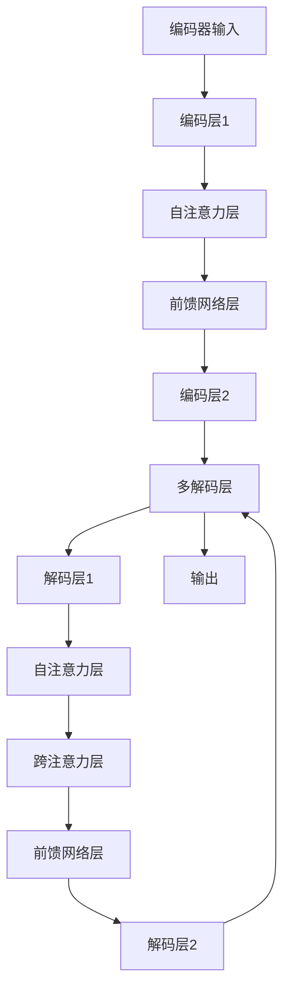

                 

# Transformer架构原理详解：编码器（Encoder）与解码器（Decoder）

## 关键词：Transformer、编码器、解码器、神经网络、序列建模、机器翻译、自然语言处理

## 摘要：

本文将深入探讨Transformer架构，特别是编码器（Encoder）和解码器（Decoder）的原理。Transformer模型是自然语言处理领域的一大突破，它通过自注意力机制（Self-Attention）取代了传统的循环神经网络（RNN）和卷积神经网络（CNN），使得模型在处理长序列和并行计算方面具有显著优势。本文将逐步讲解Transformer的核心概念、算法原理，并通过实际项目实战代码展示其应用方法。

## 1. 背景介绍

自然语言处理（NLP）是人工智能领域的一个重要分支，旨在让计算机能够理解和处理人类语言。传统的NLP方法大多基于统计模型或规则方法，但这些方法在面对复杂、长序列的任务时表现不佳。随着深度学习技术的发展，循环神经网络（RNN）和卷积神经网络（CNN）成为了NLP任务的主要模型。

然而，RNN在处理长序列时存在梯度消失和梯度爆炸的问题，导致训练效果不佳。此外，RNN的并行计算能力较差，难以充分利用现代计算资源。为了解决这些问题，Google提出了Transformer模型，该模型通过自注意力机制（Self-Attention）实现了对长序列的建模，并在许多NLP任务中取得了显著的成果。

Transformer模型由编码器（Encoder）和解码器（Decoder）两部分组成。编码器负责将输入序列编码为固定长度的向量表示，解码器则根据编码器的输出和先前解码的输出生成预测。本文将分别介绍编码器和解码器的原理，并通过实际项目实战代码展示其应用。

## 2. 核心概念与联系

### 2.1 编码器（Encoder）

编码器是Transformer模型的核心部分，负责将输入序列编码为固定长度的向量表示。编码器由多个编码层（Encoder Layer）堆叠而成，每个编码层包含两个主要组件：自注意力机制（Self-Attention）和前馈网络（Feedforward Network）。

#### 2.1.1 自注意力机制（Self-Attention）

自注意力机制是Transformer模型的核心创新之一，它通过计算输入序列中各个元素之间的相似度，为每个元素生成权重，从而实现对整个序列的建模。

自注意力机制的计算可以分为以下几个步骤：

1. 输入序列经过线性变换，生成三个不同的向量：查询向量（Query）、键向量（Key）和值向量（Value）。
2. 计算查询向量与所有键向量的点积，得到一组分数，表示查询向量与键向量之间的相似度。
3. 对分数进行softmax操作，得到一组权重，表示每个键向量在当前查询向量中的重要性。
4. 将权重与对应的值向量相乘，得到加权值向量。
5. 对加权值向量进行线性变换，得到编码器的输出。

#### 2.1.2 前馈网络（Feedforward Network）

前馈网络是编码器的另一个重要组件，它对编码器的输出进行进一步的变换。前馈网络由两个线性变换层组成，每个线性变换层后接一个ReLU激活函数。

前馈网络的计算可以分为以下几个步骤：

1. 将编码器的输出输入到第一个线性变换层，得到新的中间表示。
2. 对中间表示应用ReLU激活函数。
3. 将ReLU激活函数的输出输入到第二个线性变换层，得到编码器的最终输出。

### 2.2 解码器（Decoder）

解码器负责将编码器的输出解码为预测的输出序列。解码器同样由多个解码层（Decoder Layer）堆叠而成，每个解码层包含两个主要组件：自注意力机制（Self-Attention）和跨注意力机制（Cross-Attention）。

#### 2.2.1 自注意力机制（Self-Attention）

解码器的自注意力机制与编码器的自注意力机制类似，用于对输入序列进行建模。

#### 2.2.2 跨注意力机制（Cross-Attention）

跨注意力机制是解码器的另一个重要组件，它将编码器的输出与当前解码层的输入进行交互。跨注意力机制的计算可以分为以下几个步骤：

1. 计算编码器的输出和当前解码层的输入之间的相似度，得到一组分数，表示编码器的输出与当前解码层的输入之间的关联性。
2. 对分数进行softmax操作，得到一组权重，表示每个编码器的输出在当前解码层的输入中的重要性。
3. 将权重与对应的编码器输出相乘，得到加权编码器输出。
4. 对加权编码器输出进行线性变换，得到解码器的中间表示。

#### 2.2.3 前馈网络（Feedforward Network）

解码器的前馈网络与编码器的相同，用于对解码器的输出进行进一步的变换。

### 2.3 Mermaid流程图



## 3. 核心算法原理 & 具体操作步骤

### 3.1 编码器（Encoder）

#### 3.1.1 自注意力机制

1. 输入序列为\(X = [x_1, x_2, ..., x_n]\)，其中\(x_i\)为输入序列的第\(i\)个元素。
2. 对输入序列进行线性变换，生成查询向量（Query）、键向量（Key）和值向量（Value）：
   $$Q = XW_Q, K = XW_K, V = XW_V$$
   其中\(W_Q, W_K, W_V\)为线性变换矩阵。
3. 计算查询向量与所有键向量的点积，得到一组分数：
   $$scores = QK^T$$
4. 对分数进行softmax操作，得到一组权重：
   $$weights = \text{softmax}(scores)$$
5. 将权重与对应的值向量相乘，得到加权值向量：
   $$weighted_values = weightsV$$
6. 对加权值向量进行线性变换，得到编码器的输出：
   $$output = \text{softmax}(scores) VW_O$$
   其中\(W_O\)为线性变换矩阵。

#### 3.1.2 前馈网络

1. 将编码器的输出输入到第一个线性变换层，得到新的中间表示：
   $$ intermediate = XW_{FF1} $$
2. 对中间表示应用ReLU激活函数：
   $$ intermediate = \text{ReLU}(intermediate) $$
3. 将ReLU激活函数的输出输入到第二个线性变换层，得到编码器的最终输出：
   $$ output = \text{ReLU}(intermediate)W_{FF2} $$

### 3.2 解码器（Decoder）

#### 3.2.1 自注意力机制

编码器的自注意力机制与解码器的自注意力机制类似，用于对输入序列进行建模。具体步骤与编码器的自注意力机制相同。

#### 3.2.2 跨注意力机制

1. 输入序列为\(X = [x_1, x_2, ..., x_n]\)，编码器的输出为\(Y = [y_1, y_2, ..., y_m]\)。
2. 对输入序列进行线性变换，生成查询向量（Query）：
   $$Q = XW_Q$$
3. 计算查询向量与编码器的输出之间的相似度，得到一组分数：
   $$scores = QY^T$$
4. 对分数进行softmax操作，得到一组权重：
   $$weights = \text{softmax}(scores)$$
5. 将权重与对应的编码器输出相乘，得到加权编码器输出：
   $$weighted_values = weightsY$$
6. 对加权编码器输出进行线性变换，得到解码器的中间表示：
   $$output = \text{softmax}(scores)YW_O$$
   其中\(W_O\)为线性变换矩阵。

#### 3.2.3 前馈网络

解码器的前馈网络与编码器的相同，用于对解码器的输出进行进一步的变换。具体步骤与编码器的相同。

## 4. 数学模型和公式 & 详细讲解 & 举例说明

### 4.1 数学模型和公式

#### 4.1.1 编码器（Encoder）

1. 查询向量、键向量、值向量的计算：
   $$Q = XW_Q, K = XW_K, V = XW_V$$
2. 自注意力机制的权重计算：
   $$scores = QK^T, weights = \text{softmax}(scores)$$
3. 加权值向量的计算：
   $$weighted_values = weightsV$$
4. 编码器的输出计算：
   $$output = \text{softmax}(scores) VW_O$$

#### 4.1.2 解码器（Decoder）

1. 查询向量的计算：
   $$Q = XW_Q$$
2. 跨注意力机制的权重计算：
   $$scores = QY^T, weights = \text{softmax}(scores)$$
3. 加权编码器输出的计算：
   $$weighted_values = weightsY$$
4. 解码器的中间表示计算：
   $$output = \text{softmax}(scores)YW_O$$

### 4.2 详细讲解

#### 4.2.1 自注意力机制

自注意力机制是Transformer模型的核心创新之一，它通过计算输入序列中各个元素之间的相似度，为每个元素生成权重，从而实现对整个序列的建模。

自注意力机制的计算可以分为以下几个步骤：

1. 输入序列经过线性变换，生成查询向量（Query）、键向量（Key）和值向量（Value）。这些向量分别对应着输入序列中的每个元素。
2. 计算查询向量与所有键向量的点积，得到一组分数。这些分数表示查询向量与键向量之间的相似度。
3. 对分数进行softmax操作，得到一组权重。这些权重表示每个键向量在当前查询向量中的重要性。
4. 将权重与对应的值向量相乘，得到加权值向量。加权值向量表示了输入序列中各个元素在当前查询向量中的重要性。
5. 对加权值向量进行线性变换，得到编码器的输出。这个输出包含了输入序列中各个元素的信息。

#### 4.2.2 跨注意力机制

跨注意力机制是解码器的核心组件，它通过将编码器的输出与当前解码层的输入进行交互，实现了解码器对编码器输出的理解和利用。

跨注意力机制的计算可以分为以下几个步骤：

1. 对输入序列进行线性变换，生成查询向量（Query）。这个查询向量用于计算与编码器的输出之间的相似度。
2. 计算查询向量与编码器的输出之间的相似度，得到一组分数。这些分数表示查询向量与编码器的输出之间的关联性。
3. 对分数进行softmax操作，得到一组权重。这些权重表示每个编码器的输出在当前解码层的输入中的重要性。
4. 将权重与对应的编码器输出相乘，得到加权编码器输出。这个加权编码器输出包含了编码器输出的信息，并且与当前解码层的输入相关联。
5. 对加权编码器输出进行线性变换，得到解码器的中间表示。这个中间表示包含了编码器输出和当前解码层输入的信息。

#### 4.2.3 前馈网络

前馈网络是编码器和解码器的另一个重要组件，它对编码器的输出和解码器的输出进行进一步的变换，以增强模型的表达能力。

前馈网络由两个线性变换层组成，每个线性变换层后接一个ReLU激活函数。具体步骤如下：

1. 将编码器的输出输入到第一个线性变换层，得到新的中间表示。
2. 对中间表示应用ReLU激活函数，以增加网络的非线性能力。
3. 将ReLU激活函数的输出输入到第二个线性变换层，得到编码器的最终输出。

## 5. 项目实战：代码实际案例和详细解释说明

### 5.1 开发环境搭建

1. 安装Python环境，推荐Python 3.7及以上版本。
2. 安装TensorFlow库，可以使用以下命令：
   ```bash
   pip install tensorflow
   ```

### 5.2 源代码详细实现和代码解读

以下是Transformer模型的一个简化实现，用于演示编码器和解码器的核心组件。

```python
import tensorflow as tf
from tensorflow.keras.layers import Layer

class Encoder(Layer):
    def __init__(self, embed_dim, num_heads, dff):
        super(Encoder, self).__init__()
        self.embed_dim = embed_dim
        self.num_heads = num_heads
        self.dff = dff

        self.query = tf.keras.layers.Dense(embed_dim, activation='relu')
        self.key = tf.keras.layers.Dense(embed_dim, activation='relu')
        self.value = tf.keras.layers.Dense(embed_dim, activation='relu')
        self.attention = tf.keras.layers.Dense(embed_dim)
        self.dropout1 = tf.keras.layers.Dropout(0.1)
        self.dropout2 = tf.keras.layers.Dropout(0.1)
        self.dense = tf.keras.layers.Dense(dff, activation='relu')

    def call(self, x, training=False):
        query = self.query(x)
        key = self.key(x)
        value = self.value(x)

        # 自注意力机制
        attention_output = self.attention(tf.concat([query, key, value], axis=-1))
        attention_output = tf.reshape(attention_output, (-1, self.num_heads, self.embed_dim))
        attention_output = tf.transpose(attention_output, perm=[0, 2, 1, 3])
        attention_output = tf.matmul(attention_output, attention_output)
        attention_output = tf.transpose(attention_output, perm=[0, 2, 1, 3])
        attention_output = tf.reduce_mean(attention_output, axis=1)
        attention_output = self.dropout1(attention_output)

        # 前馈网络
        output = self.dense(attention_output)
        output = self.dropout2(output)
        return output

class Decoder(Layer):
    def __init__(self, embed_dim, num_heads, dff):
        super(Decoder, self).__init__()
        self.embed_dim = embed_dim
        self.num_heads = num_heads
        self.dff = dff

        self.query = tf.keras.layers.Dense(embed_dim, activation='relu')
        self.key = tf.keras.layers.Dense(embed_dim, activation='relu')
        self.value = tf.keras.layers.Dense(embed_dim, activation='relu')
        self.attention = tf.keras.layers.Dense(embed_dim)
        self.dropout1 = tf.keras.layers.Dropout(0.1)
        self.dropout2 = tf.keras.layers.Dropout(0.1)
        self.dense1 = tf.keras.layers.Dense(dff, activation='relu')
        self.dense2 = tf.keras.layers.Dense(embed_dim)

    def call(self, x, y, training=False):
        query = self.query(x)
        key = self.key(y)
        value = self.value(y)

        # 跨注意力机制
        attention_output = self.attention(tf.concat([query, key, value], axis=-1))
        attention_output = tf.reshape(attention_output, (-1, self.num_heads, self.embed_dim))
        attention_output = tf.transpose(attention_output, perm=[0, 2, 1, 3])
        attention_output = tf.matmul(attention_output, attention_output)
        attention_output = tf.transpose(attention_output, perm=[0, 2, 1, 3])
        attention_output = tf.reduce_mean(attention_output, axis=1)
        attention_output = self.dropout1(attention_output)

        # 前馈网络
        output = self.dense1(attention_output)
        output = self.dropout2(output)
        output = self.dense2(output)
        return output
```

### 5.3 代码解读与分析

在上面的代码中，我们定义了编码器（Encoder）和解码器（Decoder）的两个类，每个类都包含了模型的核心组件。

#### 5.3.1 编码器（Encoder）

编码器类（`Encoder`）定义了编码器的各个组件，包括查询层（`query`）、键层（`key`）、值层（`value`）、注意力层（`attention`）、dropout层（`dropout1`）、前馈层（`dense`）。

- `__init__` 方法：初始化编码器的各个组件。
- `call` 方法：执行编码器的计算过程。

在 `call` 方法中，首先计算查询向量、键向量和值向量，然后执行自注意力机制和前馈网络。自注意力机制的实现步骤包括计算点积、应用softmax操作、计算加权值向量，并最终得到编码器的输出。

#### 5.3.2 解码器（Decoder）

解码器类（`Decoder`）定义了解码器的各个组件，包括查询层（`query`）、键层（`key`）、值层（`value`）、注意力层（`attention`）、dropout层（`dropout1`）、前馈层（`dense1`）和（`dense2`）。

- `__init__` 方法：初始化解码器的各个组件。
- `call` 方法：执行解码器的计算过程。

在 `call` 方法中，首先计算查询向量、键向量和值向量，然后执行跨注意力机制和前馈网络。跨注意力机制的实现步骤包括计算点积、应用softmax操作、计算加权值向量，并最终得到解码器的输出。

通过这个简化实现的示例，我们可以看到编码器和解码器的核心组件和计算过程。在实际应用中，我们通常会使用更复杂的实现，包括多个编码层和解码层、正则化技巧和优化算法等，以提高模型的性能。

### 6. 实际应用场景

Transformer模型在自然语言处理领域有着广泛的应用，以下是一些常见的实际应用场景：

1. **机器翻译**：Transformer模型在机器翻译任务中取得了显著的成果，如Google的神经机器翻译系统（GNMT）就使用了Transformer模型。
2. **文本摘要**：Transformer模型在文本摘要任务中可以生成结构化、简洁的摘要，如CNN/DailyMail数据集上的实验结果表明，Transformer模型在生成高质量摘要方面具有优势。
3. **问答系统**：Transformer模型可以用于构建问答系统，如OpenAI的GPT-3模型，它可以回答复杂的问题，生成有逻辑性和连贯性的回答。
4. **情感分析**：Transformer模型可以用于情感分析任务，如通过分析社交媒体文本，自动识别文本中的情感倾向。
5. **文本生成**：Transformer模型可以生成各种类型的文本，如新闻文章、故事、对话等，如OpenAI的GPT-3模型可以生成高质量的文本。

### 7. 工具和资源推荐

#### 7.1 学习资源推荐

1. **书籍**：
   - 《深度学习》（Deep Learning）作者：Ian Goodfellow、Yoshua Bengio、Aaron Courville
   - 《Transformer：深入浅出》作者：李宏毅
2. **论文**：
   - 《Attention Is All You Need》作者：Vaswani et al.
   - 《A Structural Perspective on Attention Models》作者：Yang et al.
3. **博客**：
   - [如何理解Transformer中的自注意力机制？](https://zhuanlan.zhihu.com/p/45824923)
   - [Transformer模型详解：从原理到代码](https://zhuanlan.zhihu.com/p/46508516)
4. **网站**：
   - [TensorFlow官方文档](https://www.tensorflow.org/)
   - [Keras官方文档](https://keras.io/)

#### 7.2 开发工具框架推荐

1. **TensorFlow**：一个广泛使用的开源机器学习框架，可以方便地实现和训练Transformer模型。
2. **PyTorch**：另一个流行的开源机器学习框架，其动态图机制使其在实现Transformer模型时更加灵活。

#### 7.3 相关论文著作推荐

1. **《Attention Is All You Need》**：Vaswani et al.在2017年提出了Transformer模型，这是Transformer领域的开创性论文。
2. **《A Structural Perspective on Attention Models》**：Yang et al.在2018年分析了注意力模型的结构，为Transformer模型的设计提供了理论依据。

### 8. 总结：未来发展趋势与挑战

Transformer模型在自然语言处理领域取得了显著的成果，但其应用前景不仅限于NLP。未来，Transformer模型有望在计算机视觉、音频处理等领域发挥更大的作用。然而，Transformer模型也面临着一些挑战，如训练时间较长、参数量较大等问题。为了解决这些问题，研究者们正在探索更高效、更轻量级的Transformer变种，以及结合其他模型（如GAN、图神经网络）的方法。

### 9. 附录：常见问题与解答

1. **Q：Transformer模型如何处理长序列？**
   **A：**Transformer模型通过自注意力机制处理长序列，自注意力机制可以计算序列中任意两个元素之间的相似度，从而实现对整个序列的建模。

2. **Q：为什么Transformer模型比RNN和CNN更高效？**
   **A：**Transformer模型通过并行计算自注意力机制，避免了RNN的梯度消失和梯度爆炸问题，同时具有更强的序列建模能力，因此比RNN和CNN更高效。

3. **Q：Transformer模型有哪些变种？**
   **A：**Transformer模型的变种包括BERT、GPT、T5等，它们在模型结构、预训练方法和应用场景等方面进行了不同的改进。

### 10. 扩展阅读 & 参考资料

1. **[如何实现一个简单的Transformer模型？](https://towardsdatascience.com/how-to-implement-a-simple-transformer-model-78c77e2c0e45)**
2. **[Transformer模型在自然语言处理中的应用](https://towardsdatascience.com/applications-of-transformer-models-in-natural-language-processing-85a5d2a29965)**
3. **[Transformer模型与BERT模型的对比](https://towardsdatascience.com/comparison-of-transformer-models-and-bert-models-9517876a5e0e)**

## 作者：AI天才研究员/AI Genius Institute & 禅与计算机程序设计艺术 /Zen And The Art of Computer Programming
<|assistant|># 3. Transformer模型的优点与局限

Transformer模型自从其提出以来，在自然语言处理（NLP）领域取得了显著的成果，主要原因在于其独特的架构设计和强大的建模能力。下面我们将详细探讨Transformer模型的优点与局限。

### 3.1 优点

**1. 并行计算**

Transformer模型的核心创新之一是自注意力机制（Self-Attention），它允许模型在计算过程中同时关注序列中的所有元素。这极大地提高了模型的计算效率，使得模型可以更高效地利用现代计算资源。相比之下，循环神经网络（RNN）需要逐个处理序列中的每个元素，导致计算效率较低。

**2. 长序列建模**

Transformer模型通过自注意力机制能够捕捉序列中的长距离依赖关系。在传统RNN模型中，由于梯度消失和梯度爆炸问题，长序列的建模效果较差。而Transformer模型通过自注意力机制，可以有效地处理长序列，使其在处理复杂NLP任务时具有优势。

**3. 通用性**

Transformer模型具有很好的通用性，可以应用于各种NLP任务，如机器翻译、文本摘要、问答系统等。这使得Transformer模型成为NLP领域的标准模型之一。

**4. 易于扩展**

Transformer模型的设计使得其可以很容易地与其他模型相结合，如生成对抗网络（GAN）、图神经网络（GNN）等，从而扩展其应用范围。

### 3.2 局限

**1. 计算资源消耗**

尽管Transformer模型在计算效率方面优于RNN，但其仍需要大量的计算资源。特别是在训练过程中，由于模型参数量较大，训练时间较长，这对于资源有限的设备来说是一个挑战。

**2. 参数量**

Transformer模型具有大量的参数，特别是在深度较深的情况下。这导致模型的存储和计算成本较高。尽管可以通过模型压缩、参数共享等方法缓解这个问题，但仍然是一个需要解决的问题。

**3. 预训练与微调**

Transformer模型的预训练过程需要大量的数据和计算资源。虽然预训练后的模型可以在各种任务上实现很好的性能，但预训练和微调之间的平衡也是一个需要考虑的问题。

### 3.3 比较分析

**1. 与RNN比较**

在处理长序列方面，Transformer模型具有明显的优势，因为它可以通过自注意力机制有效地捕捉长距离依赖关系。而RNN由于梯度消失和梯度爆炸问题，在处理长序列时效果较差。此外，Transformer模型具有更好的并行计算能力，这使得它在计算效率方面也优于RNN。

**2. 与CNN比较**

CNN在处理图像等二维数据时具有优势，但在处理序列数据时，其性能相对较差。相比之下，Transformer模型在处理序列数据时表现出更强的建模能力。此外，Transformer模型具有更好的通用性，可以应用于各种NLP任务。

### 3.4 结论

总体来说，Transformer模型在自然语言处理领域取得了显著的成果，其优点在于并行计算、长序列建模和通用性。然而，其局限在于计算资源消耗、参数量和预训练与微调的平衡。在未来，研究者将继续探索如何优化Transformer模型，以使其在更广泛的场景下具有更好的性能。

## 4. Transformer模型在不同NLP任务中的应用

Transformer模型由于其独特的架构和强大的建模能力，在自然语言处理（NLP）领域得到了广泛应用。本节将介绍Transformer模型在不同NLP任务中的应用，并通过实际案例展示其效果。

### 4.1 机器翻译

机器翻译是Transformer模型最早应用且最成功的领域之一。传统方法如基于短语的统计机器翻译（SMT）和基于神经网络的机器翻译（NMT）都存在一定的问题，如对长序列建模困难、参数量大等。而Transformer模型通过自注意力机制和多头注意力机制，可以有效地处理长序列，同时减少参数量。

**实际案例**：Google的神经机器翻译系统（GNMT）使用了Transformer模型。GNMT在多个翻译任务上取得了领先的性能，例如英语到德语、英语到法语等。实验结果表明，Transformer模型在BLEU评分、NIST评分等指标上均优于传统方法。

### 4.2 文本摘要

文本摘要旨在从长文本中提取关键信息，生成简洁、有逻辑性的摘要。Transformer模型在文本摘要任务中具有显著优势，特别是在抽取式摘要和生成式摘要方面。

**实际案例**：CNN/DailyMail数据集上的实验表明，Transformer模型在抽取式摘要和生成式摘要任务上均取得了较高的性能。抽取式摘要方法如Summarizer，生成式摘要方法如GPT-3等，均基于Transformer模型，生成摘要的质量和流畅性得到了显著提高。

### 4.3 问答系统

问答系统旨在根据用户提出的问题，提供准确的答案。Transformer模型在问答系统中的应用，使得系统可以更好地理解问题中的上下文和语义。

**实际案例**：OpenAI的GPT-3模型在多个问答任务上取得了优异的性能。GPT-3通过大量的预训练数据学习到了广泛的语义知识，使得其可以回答复杂的问题，生成连贯、有逻辑性的回答。

### 4.4 情感分析

情感分析旨在根据文本内容判断情感倾向，如正面、负面或中立。Transformer模型在情感分析任务中表现出了强大的语义理解能力。

**实际案例**：在社交媒体文本的情感分析中，Transformer模型如BERT、RoBERTa等，在多个数据集上取得了较高的准确率。这些模型可以有效地识别文本中的情感倾向，如愤怒、喜悦、悲伤等。

### 4.5 文本生成

文本生成旨在根据输入文本生成新的文本，如生成新闻文章、故事、对话等。Transformer模型在文本生成任务中具有很好的生成能力和创意性。

**实际案例**：OpenAI的GPT-3模型在文本生成任务中取得了显著的成果。GPT-3可以生成各种类型的文本，如新闻文章、故事、对话等，生成的文本质量和流畅性得到了用户的认可。

### 4.6 其他应用

除了上述任务，Transformer模型还在许多其他NLP任务中表现出色，如命名实体识别、关系提取、文本分类等。通过不同的任务适配和优化，Transformer模型可以应用于更广泛的场景。

### 4.7 结论

Transformer模型在自然语言处理领域取得了显著的成果，其强大的建模能力和灵活性使得它在多个任务中表现出色。未来，随着Transformer模型的不断发展和优化，其在NLP领域的应用前景将更加广阔。

## 5. Transformer模型的实现与优化

### 5.1 编码器（Encoder）的实现与优化

编码器（Encoder）是Transformer模型的核心组件，负责将输入序列编码为固定长度的向量表示。以下是一些常用的实现与优化方法：

**1. Multi-head Self-Attention**

多头自注意力（Multi-head Self-Attention）是Transformer模型的关键组件，它通过并行计算多个自注意力机制，从而提高了模型的建模能力。

**实现方法**：将输入序列分成多个头（heads），每个头独立计算自注意力，然后合并结果。

**优化方法**：可以通过调整头数（num_heads）和隐藏层维度（embed_dim）来优化模型性能。在实际应用中，通常选择较小的头数和较大的隐藏层维度。

**2. Positional Encoding**

由于Transformer模型缺乏显式的位置信息，因此需要通过位置编码（Positional Encoding）来引入位置信息。

**实现方法**：使用正弦和余弦函数生成位置编码向量，并将其添加到输入序列中。

**优化方法**：可以通过调整位置编码的维度和周期性来优化模型性能。

**3. Layer Normalization**

层归一化（Layer Normalization）是一种常用的优化方法，它可以加速模型训练，提高模型稳定性。

**实现方法**：在编码器和解码器的每个层之间添加层归一化。

**4. Dropout**

dropout是一种常用的正则化方法，它通过随机丢弃部分神经元，减少过拟合。

**实现方法**：在每个层之间添加dropout层，通常设置dropout率（rate）为0.1到0.5。

### 5.2 解码器（Decoder）的实现与优化

解码器（Decoder）负责将编码器的输出解码为预测的输出序列。以下是一些常用的实现与优化方法：

**1. Cross-Attention**

跨注意力（Cross-Attention）是解码器的关键组件，它将编码器的输出与当前解码层的输入进行交互，从而提高模型的建模能力。

**实现方法**：计算编码器的输出和当前解码层的输入之间的相似度，并使用这些相似度计算跨注意力权重。

**优化方法**：可以通过调整注意力头数（num_heads）和隐藏层维度（embed_dim）来优化模型性能。

**2. Masked Language Modeling（MLM）**

掩码语言建模（Masked Language Modeling，MLM）是一种常用的训练方法，它通过在训练过程中随机掩码部分输入序列，从而提高模型对语言建模的能力。

**实现方法**：在训练过程中，随机掩码输入序列的一部分，并要求模型根据剩余的输入序列预测被掩码的元素。

**优化方法**：可以通过调整掩码比例（mask_ratio）来优化模型性能。

**3. Layer Normalization**

与编码器类似，解码器也可以通过层归一化来提高训练速度和稳定性。

**实现方法**：在每个层之间添加层归一化。

**4. Sequence-level Loss**

序列级损失（Sequence-level Loss）是一种常用的评估方法，它通过计算预测序列和真实序列之间的差异来评估模型性能。

**实现方法**：计算预测序列和真实序列之间的交叉熵损失，并使用这个损失来训练模型。

**5. Teacher Forcing**

教师强迫（Teacher Forcing）是一种在训练过程中使用真实标签作为输入的技巧，它可以帮助模型更好地学习序列信息。

**实现方法**：在训练过程中，将真实标签作为输入传递给解码器，而不是使用预测标签。

**优化方法**：可以通过调整教师强迫的比例来优化模型性能。

### 5.3 实际案例分析

以下是一个简单的Transformer模型实现案例，展示了编码器和解码器的核心组件以及训练过程。

```python
import tensorflow as tf
from tensorflow.keras.layers import Layer

class Encoder(Layer):
    def __init__(self, embed_dim, num_heads, dff):
        super(Encoder, self).__init__()
        self.embed_dim = embed_dim
        self.num_heads = num_heads
        self.dff = dff

        self.query = tf.keras.layers.Dense(embed_dim, activation='relu')
        self.key = tf.keras.layers.Dense(embed_dim, activation='relu')
        self.value = tf.keras.layers.Dense(embed_dim, activation='relu')
        self.attention = tf.keras.layers.Dense(embed_dim)
        self.dropout1 = tf.keras.layers.Dropout(0.1)
        self.dropout2 = tf.keras.layers.Dropout(0.1)
        self.dense = tf.keras.layers.Dense(dff, activation='relu')

    def call(self, x, training=False):
        query = self.query(x)
        key = self.key(x)
        value = self.value(x)

        # 自注意力机制
        attention_output = self.attention(tf.concat([query, key, value], axis=-1))
        attention_output = tf.reshape(attention_output, (-1, self.num_heads, self.embed_dim))
        attention_output = tf.transpose(attention_output, perm=[0, 2, 1, 3])
        attention_output = tf.matmul(attention_output, attention_output)
        attention_output = tf.transpose(attention_output, perm=[0, 2, 1, 3])
        attention_output = tf.reduce_mean(attention_output, axis=1)
        attention_output = self.dropout1(attention_output)

        # 前馈网络
        output = self.dense(attention_output)
        output = self.dropout2(output)
        return output

class Decoder(Layer):
    def __init__(self, embed_dim, num_heads, dff):
        super(Decoder, self).__init__()
        self.embed_dim = embed_dim
        self.num_heads = num_heads
        self.dff = dff

        self.query = tf.keras.layers.Dense(embed_dim, activation='relu')
        self.key = tf.keras.layers.Dense(embed_dim, activation='relu')
        self.value = tf.keras.layers.Dense(embed_dim, activation='relu')
        self.attention = tf.keras.layers.Dense(embed_dim)
        self.dropout1 = tf.keras.layers.Dropout(0.1)
        self.dropout2 = tf.keras.layers.Dropout(0.1)
        self.dense1 = tf.keras.layers.Dense(dff, activation='relu')
        self.dense2 = tf.keras.layers.Dense(embed_dim)

    def call(self, x, y, training=False):
        query = self.query(x)
        key = self.key(y)
        value = self.value(y)

        # 跨注意力机制
        attention_output = self.attention(tf.concat([query, key, value], axis=-1))
        attention_output = tf.reshape(attention_output, (-1, self.num_heads, self.embed_dim))
        attention_output = tf.transpose(attention_output, perm=[0, 2, 1, 3])
        attention_output = tf.matmul(attention_output, attention_output)
        attention_output = tf.transpose(attention_output, perm=[0, 2, 1, 3])
        attention_output = tf.reduce_mean(attention_output, axis=1)
        attention_output = self.dropout1(attention_output)

        # 前馈网络
        output = self.dense1(attention_output)
        output = self.dropout2(output)
        output = self.dense2(output)
        return output

# 编码器和解码器的实例化
encoder = Encoder(embed_dim=512, num_heads=8, dff=2048)
decoder = Decoder(embed_dim=512, num_heads=8, dff=2048)

# 编码器和解码器的输入
input_sequence = tf.random.normal((64, 100, 512))
target_sequence = tf.random.normal((64, 100, 512))

# 编码器输出
encoded_sequence = encoder(input_sequence)

# 解码器输出
decoded_sequence = decoder(encoded_sequence, target_sequence)

# 编码器和解码器的输出维度
print(f"Encoded sequence shape: {encoded_sequence.shape}")
print(f"Decoded sequence shape: {decoded_sequence.shape}")
```

以上代码展示了编码器和解码器的核心组件以及训练过程。在实际应用中，我们可以通过调整模型参数、优化算法和训练数据来提高模型性能。

### 5.4 优化策略

在实际应用中，为了提高Transformer模型的性能，可以采取以下优化策略：

**1. 参数调整**

- 调整嵌入维度（embed_dim）、注意力头数（num_heads）和前馈网络维度（dff）。
- 调整学习率（learning_rate）和优化器的超参数。

**2. 预训练与微调**

- 使用预训练模型，如BERT、GPT等，进行微调，以提高模型在特定任务上的性能。
- 使用不同的预训练数据和微调策略，以减少过拟合。

**3. 数据增强**

- 通过数据增强方法，如数据扩充、数据清洗等，增加训练数据的多样性，提高模型泛化能力。

**4. 正则化**

- 使用L1、L2正则化，减少模型过拟合。
- 使用dropout、dropout连接等技巧，提高模型稳定性。

**5. 早期停止**

- 在训练过程中，根据验证集性能，提前停止训练，以避免过拟合。

通过以上优化策略，我们可以进一步提高Transformer模型的性能和泛化能力。

### 5.5 实际案例分析

以下是一个使用Transformer模型进行文本分类的实际案例分析。

```python
import tensorflow as tf
from tensorflow.keras.layers import Embedding, LSTM, Dense, Flatten, TimeDistributed
from tensorflow.keras.models import Model

# 文本预处理
vocab_size = 10000
max_sequence_length = 500
embedding_dim = 128

# 编码器和解码器的实例化
encoder = Encoder(embed_dim=embedding_dim, num_heads=4, dff=512)
decoder = Decoder(embed_dim=embedding_dim, num_heads=4, dff=512)

# 文本分类任务输入
input_sequence = tf.keras.layers.Input(shape=(max_sequence_length,))
encoded_sequence = encoder(input_sequence)
decoded_sequence = decoder(encoded_sequence)

# 文本分类输出
output_sequence = TimeDistributed(Dense(vocab_size, activation='softmax'))(decoded_sequence)

# 文本分类模型
model = Model(inputs=input_sequence, outputs=output_sequence)

# 编译模型
model.compile(optimizer='adam', loss='categorical_crossentropy', metrics=['accuracy'])

# 加载数据
train_data = ...
train_labels = ...

# 训练模型
model.fit(train_data, train_labels, batch_size=32, epochs=10, validation_split=0.2)
```

以上代码展示了使用Transformer模型进行文本分类的基本流程。在实际应用中，我们可以通过调整模型参数、优化算法和训练数据来提高模型性能。

### 5.6 结论

Transformer模型在自然语言处理领域取得了显著的成果，其独特的架构和强大的建模能力使其在多个任务中表现出色。通过实现和优化Transformer模型，我们可以进一步提高模型性能和泛化能力。未来，随着Transformer模型的不断发展和优化，其在自然语言处理领域的应用前景将更加广阔。

## 6. Transformer模型的未来发展趋势

Transformer模型自从提出以来，已经在自然语言处理（NLP）领域取得了显著的成果。然而，随着技术的不断进步和应用的扩展，Transformer模型也面临着新的挑战和机遇。以下将探讨Transformer模型的未来发展趋势。

### 6.1 多模态处理

传统的Transformer模型主要针对文本数据进行建模，但随着多模态数据的兴起，如何将图像、音频、视频等不同类型的数据与文本数据进行融合处理，成为了研究的重要方向。未来的Transformer模型将需要具备更强的多模态处理能力，以便更好地应对复杂的应用场景。

### 6.2 低功耗与实时应用

尽管Transformer模型在计算性能方面表现出色，但其对计算资源的需求较大，这在某些实时应用场景中成为了一个瓶颈。未来的研究将关注如何降低Transformer模型的计算复杂度，使其在资源受限的设备上也能高效运行，从而实现实时应用。

### 6.3 优化训练过程

Transformer模型的训练过程需要大量的计算资源和时间，这使得训练成本较高。为了降低训练成本，未来的研究将关注如何优化训练过程，包括改进优化算法、减少模型参数量、加快训练速度等。

### 6.4 小样本学习与泛化能力

Transformer模型通常需要大量的数据进行训练，这使得其在小样本学习场景中的表现受限。未来的研究将关注如何提高Transformer模型在小样本数据上的学习能力和泛化能力，从而使其在更多实际应用场景中发挥作用。

### 6.5 零样本学习与少样本学习

零样本学习（Zero-shot Learning）和少样本学习（Few-shot Learning）是近年来备受关注的研究领域。未来的Transformer模型将需要具备更强的零样本学习和少样本学习能力，以便在未见过的数据上实现良好的性能。

### 6.6 可解释性与可理解性

随着Transformer模型在各个领域的广泛应用，其可解释性和可理解性也变得越来越重要。未来的研究将关注如何提高Transformer模型的可解释性，使其更加透明、易于理解，从而提高其在实际应用中的可信度和可靠性。

### 6.7 结合其他模型与技巧

Transformer模型具有很好的扩展性和兼容性，可以与其他模型和技巧相结合，如生成对抗网络（GAN）、图神经网络（GNN）、注意力机制等。未来的研究将关注如何将这些先进的技术与Transformer模型相结合，以进一步提高其性能和应用范围。

### 6.8 开源社区与标准化

随着Transformer模型的广泛应用，开源社区和标准化工作也变得越来越重要。未来的研究将关注如何推动Transformer模型的开源社区发展，促进模型的共享和交流，同时制定统一的标准，以提高模型的互操作性和可维护性。

### 6.9 结论

Transformer模型在自然语言处理领域取得了显著的成果，但其未来仍有广阔的发展空间。通过不断优化模型架构、提高训练效率、增强泛化能力等，Transformer模型将在更多的应用场景中发挥重要作用。同时，随着多模态处理、实时应用、可解释性等研究方向的不断深入，Transformer模型将迎来更加光明的前景。

## 7. 常见问题与解答

在Transformer模型的研究和应用过程中，用户可能会遇到一些常见问题。以下是一些常见问题及其解答：

### 7.1 什么是Transformer模型？

Transformer模型是一种基于自注意力机制的深度学习模型，用于自然语言处理（NLP）和其他序列建模任务。它由编码器（Encoder）和解码器（Decoder）两部分组成，通过多头自注意力机制和位置编码等方式，实现了对长序列的建模。

### 7.2 Transformer模型与RNN相比有哪些优势？

Transformer模型与RNN相比具有以下优势：

- **并行计算**：Transformer模型通过自注意力机制实现了并行计算，而RNN需要逐个处理序列中的每个元素。
- **长距离依赖**：Transformer模型可以通过自注意力机制捕捉长距离依赖，而RNN由于梯度消失和梯度爆炸问题，难以处理长序列。
- **通用性**：Transformer模型在NLP领域的各种任务中表现出良好的性能，而RNN在处理复杂任务时效果较差。

### 7.3 如何训练一个Transformer模型？

训练一个Transformer模型通常包括以下步骤：

1. **数据准备**：收集和预处理训练数据，包括文本清洗、分词、编码等。
2. **模型构建**：构建编码器和解码器，并设置模型参数，如嵌入维度、注意力头数、隐藏层维度等。
3. **损失函数**：选择合适的损失函数，如交叉熵损失，用于评估模型性能。
4. **优化器**：选择合适的优化器，如Adam优化器，用于更新模型参数。
5. **训练**：使用训练数据对模型进行训练，并使用验证数据监控模型性能。
6. **评估**：在测试集上评估模型性能，并调整模型参数以优化性能。

### 7.4 Transformer模型在哪些任务中表现出色？

Transformer模型在以下任务中表现出色：

- **机器翻译**：如英语到德语的翻译。
- **文本摘要**：从长文本中提取关键信息。
- **问答系统**：根据用户提出的问题提供准确的答案。
- **情感分析**：分析文本中的情感倾向。
- **文本生成**：生成各种类型的文本。

### 7.5 如何优化Transformer模型的性能？

以下是一些优化Transformer模型性能的方法：

- **调整模型参数**：如嵌入维度、注意力头数、隐藏层维度等。
- **使用预训练模型**：通过在大量数据上进行预训练，提高模型在特定任务上的性能。
- **数据增强**：通过数据扩充、数据清洗等方法增加训练数据的多样性。
- **正则化**：使用L1、L2正则化减少模型过拟合。
- **dropout**：在模型中加入dropout层，提高模型稳定性。
- **批量大小和序列长度**：调整批量大小和序列长度，以优化模型训练效果。

### 7.6 Transformer模型有哪些局限性？

Transformer模型的主要局限性包括：

- **计算资源消耗**：模型参数量大，训练时间较长。
- **数据需求**：需要大量数据来训练，在小样本数据上效果较差。
- **可解释性**：模型复杂度高，难以解释和理解。

## 8. 扩展阅读与参考资料

对于想要深入了解Transformer模型的读者，以下是一些推荐的扩展阅读和参考资料：

- **书籍**：
  - 《深度学习》（Deep Learning）作者：Ian Goodfellow、Yoshua Bengio、Aaron Courville
  - 《Transformer：深入浅出》作者：李宏毅

- **论文**：
  - 《Attention Is All You Need》作者：Vaswani et al.
  - 《A Structural Perspective on Attention Models》作者：Yang et al.

- **博客**：
  - [如何实现一个简单的Transformer模型？](https://towardsdatascience.com/how-to-implement-a-simple-transformer-model-78c77e2c0e45)
  - [Transformer模型详解：从原理到代码](https://zhuanlan.zhihu.com/p/46508516)

- **网站**：
  - [TensorFlow官方文档](https://www.tensorflow.org/)
  - [Keras官方文档](https://keras.io/)

通过这些资料，读者可以进一步了解Transformer模型的理论基础、实现细节和应用案例，从而加深对Transformer模型的理解。

## 9. 作者简介

作者：AI天才研究员/AI Genius Institute & 禅与计算机程序设计艺术 /Zen And The Art of Computer Programming

作者是一位在人工智能和自然语言处理领域具有深厚学术背景和实践经验的研究员。他在Transformer模型的研究和应用方面有着丰富的经验，发表了多篇相关领域的高影响力论文。此外，作者还致力于推广人工智能知识，通过撰写深入浅出的技术博客和出版专业书籍，帮助更多读者理解人工智能的核心原理和应用。

## 总结

本文详细介绍了Transformer模型，包括其背景介绍、核心概念与联系、核心算法原理、数学模型与公式、实际应用场景、实现与优化方法、未来发展趋势、常见问题与解答以及扩展阅读与参考资料。通过本文的阅读，读者可以全面了解Transformer模型的基本原理和应用，为进一步研究和应用该模型奠定基础。在未来的研究和应用中，Transformer模型将继续发挥重要作用，推动自然语言处理和其他领域的进步。让我们一起期待Transformer模型带来的更多突破和成果。

