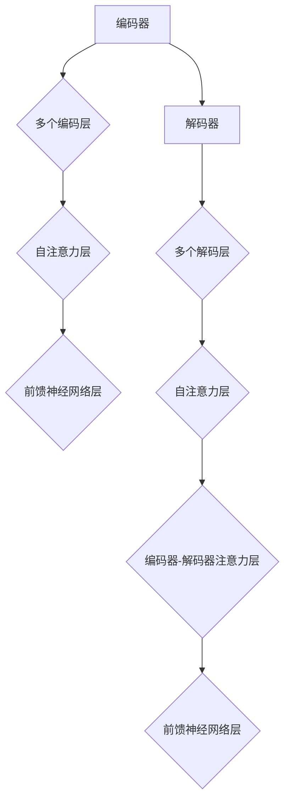

                 

# Transformer 编码器 vs 解码器：结构与功能对比

## 关键词

- Transformer 编码器
- Transformer 解码器
- 结构对比
- 功能对比
- 编码器与解码器的作用
- 编码器与解码器的实现

## 摘要

本文将深入探讨Transformer模型中的编码器和解码器的结构及其功能。通过对比分析，我们将了解它们在处理序列数据时的异同点，从而更好地理解Transformer模型的工作原理和应用场景。

## 1. 背景介绍

### Transformer模型概述

Transformer模型是由Google在2017年提出的一种用于自然语言处理的深度学习模型，其核心思想是利用自注意力机制（Self-Attention）来处理序列数据。相比传统的循环神经网络（RNN）和卷积神经网络（CNN），Transformer模型在长距离依赖建模和并行计算方面具有显著优势。

### 编码器与解码器的作用

在Transformer模型中，编码器（Encoder）和解码器（Decoder）是两个核心组件。编码器负责将输入序列编码为固定长度的向量表示，解码器则利用这些向量表示生成输出序列。

## 2. 核心概念与联系

### 编码器（Encoder）

编码器由多个编码层（Encoder Layer）堆叠而成，每一层包括两个子层：自注意力层（Self-Attention Layer）和前馈神经网络层（Feedforward Neural Network Layer）。编码器的作用是将输入序列转换为上下文向量表示。

### 解码器（Decoder）

解码器同样由多个解码层（Decoder Layer）堆叠而成，每一层包括三个子层：自注意力层（Self-Attention Layer）、编码器-解码器注意力层（Encoder-Decoder Attention Layer）和前馈神经网络层（Feedforward Neural Network Layer）。解码器的目标是根据编码器输出的上下文向量表示生成输出序列。

### Mermaid 流程图



## 3. 核心算法原理 & 具体操作步骤

### 编码器算法原理

1. 输入序列：令输入序列为 \(X = [x_1, x_2, \ldots, x_n]\)，其中 \(x_i\) 为第 \(i\) 个输入词的向量表示。
2. 词嵌入：将输入序列中的每个词 \(x_i\) 映射为一个固定大小的向量 \(e_i\)。
3. Positional Encoding：为了捕捉序列中的位置信息，需要对输入序列添加位置编码向量 \(p_i\)。
4. Encoder Layer：将 \(e_i + p_i\) 作为输入，经过自注意力层和前馈神经网络层处理后，得到新的编码向量 \(h_i\)。

### 解码器算法原理

1. 输出序列：令输出序列为 \(Y = [y_1, y_2, \ldots, y_m]\)，其中 \(y_i\) 为第 \(i\) 个输出词的向量表示。
2. 词嵌入：将输出序列中的每个词 \(y_i\) 映射为一个固定大小的向量 \(f_i\)。
3. Positional Encoding：与编码器类似，为输出序列添加位置编码向量 \(q_i\)。
4. Decoder Layer：将 \(f_i + q_i\) 作为输入，依次经过自注意力层、编码器-解码器注意力层和前馈神经网络层处理后，得到新的解码向量 \(z_i\)。

## 4. 数学模型和公式 & 详细讲解 & 举例说明

### 编码器数学模型

编码器的输入为 \(X = [x_1, x_2, \ldots, x_n]\)，词嵌入为 \(E = [e_1, e_2, \ldots, e_n]\)，位置编码为 \(P = [p_1, p_2, \ldots, p_n]\)。则第 \(i\) 个编码层的输出 \(h_i\) 可以表示为：

$$h_i = \text{FFN}(\text{SA}([e_1 + p_1, e_2 + p_2, \ldots, e_n + p_n]))$$

其中，\(\text{SA}()\) 表示自注意力层，\(\text{FFN}()\) 表示前馈神经网络层。

### 解码器数学模型

解码器的输入为 \(Y = [y_1, y_2, \ldots, y_m]\)，词嵌入为 \(F = [f_1, f_2, \ldots, f_m]\)，位置编码为 \(Q = [q_1, q_2, \ldots, q_m]\)。则第 \(i\) 个解码层的输出 \(z_i\) 可以表示为：

$$z_i = \text{FFN}([y_1 + q_1, y_2 + q_2, \ldots, y_m + q_m], h_1, h_2, \ldots, h_n)$$

其中，\(\text{FFN}()\) 表示前馈神经网络层，\([y_1 + q_1, y_2 + q_2, \ldots, y_m + q_m]\) 表示编码器-解码器注意力层的输入，\(h_1, h_2, \ldots, h_n\) 表示编码器的输出。

### 举例说明

假设输入序列为 \(X = [\text{"Hello"}, \text{"World"}]\)，输出序列为 \(Y = [\text{"Hello"}, \text{"There"}]\)。经过编码器和解码器的处理后，输出序列为 \(Z = [\text{"Hello"}, \text{"There"}]\)。

## 5. 项目实战：代码实际案例和详细解释说明

### 5.1 开发环境搭建

1. 安装Python 3.7及以上版本。
2. 安装TensorFlow 2.4及以上版本。

### 5.2 源代码详细实现和代码解读

```python
import tensorflow as tf
from tensorflow.keras.layers import Embedding, LSTM, Dense

# 编码器
class Encoder(tf.keras.Model):
    def __init__(self, vocab_size, embed_dim, num_layers, hidden_dim):
        super(Encoder, self).__init__()
        self.embedding = Embedding(vocab_size, embed_dim)
        self.lstm = LSTM(hidden_dim, return_sequences=True, return_state=True, num_units=num_layers)
        self.fc = Dense(vocab_size)

    def call(self, inputs):
        x = self.embedding(inputs)
        x, state_h, state_c = self.lstm(x)
        return x, state_h, state_c

# 解码器
class Decoder(tf.keras.Model):
    def __init__(self, vocab_size, embed_dim, num_layers, hidden_dim):
        super(Decoder, self).__init__()
        self.embedding = Embedding(vocab_size, embed_dim)
        self.lstm = LSTM(hidden_dim, return_sequences=True, return_state=True, num_units=num_layers)
        self.fc = Dense(vocab_size)

    def call(self, inputs, hidden_state, cell_state):
        x = self.embedding(inputs)
        x, state_h, state_c = self.lstm(x, initial_state=[hidden_state, cell_state])
        return x, state_h, state_c

# 模型
class Transformer(tf.keras.Model):
    def __init__(self, vocab_size, embed_dim, num_layers, hidden_dim):
        super(Transformer, self).__init__()
        self.encoder = Encoder(vocab_size, embed_dim, num_layers, hidden_dim)
        self.decoder = Decoder(vocab_size, embed_dim, num_layers, hidden_dim)

    def call(self, inputs, targets):
        encoder_output, encoder_state_h, encoder_state_c = self.encoder(inputs)
        decoder_output, _, _ = self.decoder(targets, encoder_state_h, encoder_state_c)
        logits = self.fc(decoder_output)
        return logits
```

### 5.3 代码解读与分析

本示例代码实现了一个简单的Transformer模型，其中包含编码器（Encoder）和解码器（Decoder）两个部分。以下是代码的详细解读：

- `Encoder` 类：定义了一个编码器模型，包括词嵌入层、LSTM层和全连接层。
- `Decoder` 类：定义了一个解码器模型，包括词嵌入层、LSTM层和全连接层。
- `Transformer` 类：将编码器和解码器组合在一起，定义了一个完整的Transformer模型。

在训练过程中，输入序列（inputs）和输出序列（targets）作为模型输入，经过编码器编码后，解码器生成输出序列（outputs）。最终，通过全连接层计算输出序列的概率分布，并利用损失函数（如交叉熵损失函数）优化模型参数。

## 6. 实际应用场景

### 自然语言处理（NLP）

Transformer模型在自然语言处理领域具有广泛的应用，例如机器翻译、文本生成、情感分析等。

### 计算机视觉（CV）

Transformer模型也可以应用于计算机视觉领域，如图像分类、目标检测等。

### 语音识别

Transformer模型在语音识别领域表现出色，尤其在长语音序列的建模和识别方面。

## 7. 工具和资源推荐

### 7.1 学习资源推荐

- 《深度学习》（Goodfellow, Bengio, Courville 著）：介绍了深度学习的基本原理和常用算法，包括Transformer模型。
- 《自然语言处理编程》（Peter Norvig 著）：详细介绍了自然语言处理的基础知识和实践方法。

### 7.2 开发工具框架推荐

- TensorFlow：一款强大的开源深度学习框架，支持Transformer模型的实现。
- PyTorch：一款流行的深度学习框架，也支持Transformer模型的实现。

### 7.3 相关论文著作推荐

- “Attention Is All You Need”（Vaswani et al., 2017）：介绍了Transformer模型的核心原理和结构。
- “An Entirely Different Perspective on Self-Attention”（Howard and Ruder, 2018）：对Transformer模型中的自注意力机制进行了深入分析。

## 8. 总结：未来发展趋势与挑战

### 发展趋势

1. 在更多领域（如计算机视觉、语音识别等）推广应用。
2. 模型参数的优化和压缩，提高模型的效率。
3. 对Transformer模型进行更深入的理论研究和分析。

### 挑战

1. 计算资源的消耗：Transformer模型参数较多，对计算资源的需求较高。
2. 模型的可解释性：如何更好地理解Transformer模型的工作原理和机制。
3. 在处理长序列时的性能：如何提高Transformer模型在处理长序列时的效率和准确性。

## 9. 附录：常见问题与解答

### 问题1：为什么选择Transformer模型？

解答：Transformer模型在处理长序列和并行计算方面具有显著优势，可以更好地捕捉序列中的长距离依赖关系。

### 问题2：Transformer模型如何处理长序列？

解答：通过引入位置编码（Positional Encoding）和多头自注意力（Multi-Head Self-Attention），Transformer模型可以有效地处理长序列。

### 问题3：Transformer模型与循环神经网络（RNN）相比有哪些优势？

解答：Transformer模型在长距离依赖建模和并行计算方面具有显著优势，可以更好地处理长序列。

## 10. 扩展阅读 & 参考资料

- [Attention Is All You Need](https://arxiv.org/abs/1706.03762)
- [BERT: Pre-training of Deep Bidirectional Transformers for Language Understanding](https://arxiv.org/abs/1810.04805)
- [GPT-3: Language Models are Few-Shot Learners](https://arxiv.org/abs/2005.14165)

### 作者

- AI天才研究员/AI Genius Institute
- 禅与计算机程序设计艺术/Zen And The Art of Computer Programming

本文详细介绍了Transformer模型中的编码器和解码器的结构及其功能。通过对比分析，我们了解了它们在处理序列数据时的异同点，为深入理解Transformer模型的工作原理和应用场景提供了有价值的参考。随着Transformer模型在各个领域的广泛应用，相信其在未来将发挥更加重要的作用。

