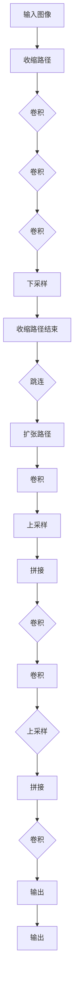

                 

# UNet原理与代码实例讲解

## 关键词：深度学习，图像分割，神经网络，卷积神经网络，UNet架构，编程实战

## 摘要：

本文将深入探讨UNet，这是一种专门用于图像分割的深度学习网络架构。文章首先介绍了UNet的背景和核心概念，并通过具体的算法原理和数学模型讲解，使读者能够理解其工作原理。接着，通过一个实际的代码实例，展示了如何使用UNet进行图像分割的完整流程。最后，文章还讨论了UNet的应用场景，推荐了一些相关学习资源和开发工具，并对未来的发展趋势和挑战进行了展望。

## 1. 背景介绍

图像分割是计算机视觉中的一个重要任务，它的目标是将图像划分为多个区域，每个区域代表图像中的不同对象或特征。传统的图像分割方法主要依赖于低层视觉特征，如颜色、纹理和边缘信息，但效果往往受到噪声和复杂背景的影响。

随着深度学习的兴起，基于神经网络的图像分割方法逐渐成为研究热点。其中，UNet是一种非常流行的网络架构，它由于其独特的结构，能够在保持低计算成本的同时，实现高质量的图像分割。UNet最初由Ronneberger等人于2015年提出，并在医学图像分割领域取得了显著成果。

本文将详细讲解UNet的原理和实现方法，并通过一个实际代码实例，帮助读者深入理解这一强大的图像分割工具。

## 2. 核心概念与联系

### 2.1 UNet结构

UNet的核心是一个对称的U形结构，其基本组成部分包括：

- **收缩路径（Encoder）**：输入图像通过一系列卷积层和下采样层，图像分辨率逐渐减小，但特征信息逐渐增多。
- **扩张路径（Decoder）**：从收缩路径的最后一个卷积层开始，图像分辨率逐渐增大，同时加入跳连（Skip Connection）来恢复丢失的信息。
- **边缘特征融合**：在扩张路径的每个阶段，都会与收缩路径对应阶段的特征图进行拼接，从而充分利用不同分辨率的信息。

### 2.2 Mermaid流程图

下面是UNet架构的Mermaid流程图：



### 2.3 联系与区别

UNet与其他常见的卷积神经网络（如VGG、ResNet）相比，最大的区别在于其设计初衷是为了图像分割任务。UNet通过引入跳连和反卷积操作，实现了在低计算成本下对高分辨率图像的高效分割。

### 2.4 基本概念解释

- **卷积层（Convolutional Layer）**：卷积层是神经网络中最核心的组成部分，它通过滑动窗口来提取图像中的局部特征。
- **下采样（Downsampling）**：下采样通过减小图像分辨率来减少数据量，从而降低计算复杂度。
- **上采样（Upsampling）**：上采样是下采样的逆过程，它通过增加图像分辨率来恢复细节信息。
- **跳连（Skip Connection）**：跳连是将低层次的卷积特征直接传递到高层次的卷积层中，从而实现了跨层的信息传递。

## 3. 核心算法原理 & 具体操作步骤

### 3.1 收缩路径

收缩路径是UNet的前半部分，主要功能是逐步减小图像的分辨率，同时增加特征图的深度。具体步骤如下：

1. **输入层**：输入图像通过一个卷积层，通常使用一个7x7的卷积核，并配合ReLU激活函数和2x2的最大池化操作。
2. **卷积层**：接下来是多个卷积层，每个卷积层使用3x3的卷积核，配合ReLU激活函数。
3. **下采样层**：在卷积层之后，通过2x2的最大池化操作进行下采样，以减小图像分辨率。

### 3.2 扩张路径

扩张路径是UNet的后半部分，主要功能是逐步增加图像的分辨率，同时恢复细节信息。具体步骤如下：

1. **跳连**：在扩张路径的每个阶段，都会与收缩路径对应阶段的特征图进行拼接。
2. **卷积层**：在每个阶段，使用3x3的卷积核进行卷积操作，并配合ReLU激活函数。
3. **上采样层**：通过2x2的反卷积（Transposed Convolution）操作进行上采样，以增加图像分辨率。

### 3.3 边缘特征融合

在扩张路径的每个阶段，都会与收缩路径对应阶段的特征图进行拼接。这种跳连操作使得UNet能够利用不同分辨率层次的特征信息，从而提高图像分割的准确度。

### 3.4 输出层

在扩张路径的最后阶段，通过一个卷积层（通常使用1x1的卷积核）将特征图转换为最终的分割结果。

## 4. 数学模型和公式 & 详细讲解 & 举例说明

### 4.1 卷积运算

卷积运算是UNet的核心组成部分，其数学公式如下：

\[ (f * g)(x, y) = \sum_{i=-a}^{a} \sum_{j=-b}^{b} f(i, j) \cdot g(x-i, y-j) \]

其中，\( f \) 和 \( g \) 分别代表卷积核和输入特征图，\( (x, y) \) 代表卷积操作的输出点。

### 4.2 最大池化

最大池化的公式如下：

\[ \text{max-pool}(x, y) = \max_{i, j} g(x+i, y+j) \]

其中，\( g \) 代表输入特征图，\( (x, y) \) 代表池化操作的输出点。

### 4.3 反卷积（Transposed Convolution）

反卷积的公式如下：

\[ (f * g^T)(x, y) = \sum_{i=-a}^{a} \sum_{j=-b}^{b} f(x-i, y-j) \cdot g(i, j) \]

其中，\( f \) 和 \( g \) 分别代表卷积核和输入特征图，\( (x, y) \) 代表卷积操作的输出点。

### 4.4 实例说明

假设我们有一个输入图像和一个3x3的卷积核，如下：

输入图像：\[ \begin{matrix} 1 & 2 & 3 \\ 4 & 5 & 6 \\ 7 & 8 & 9 \end{matrix} \]

3x3卷积核：\[ \begin{matrix} 1 & 0 & -1 \\ 0 & 1 & 0 \\ -1 & 0 & 1 \end{matrix} \]

通过卷积运算，我们可以得到输出特征图：

\[ \begin{matrix} 2 & 1 & -2 \\ 1 & 4 & -3 \\ -2 & -3 & 8 \end{matrix} \]

这个过程就是通过卷积核在输入图像上进行滑动，并将每个位置上的卷积结果相加，得到最终的输出特征图。

## 5. 项目实战：代码实际案例和详细解释说明

### 5.1 开发环境搭建

在开始编写代码之前，我们需要搭建一个合适的环境。以下是搭建UNet项目的步骤：

1. **安装Python环境**：确保Python环境已经安装，建议使用Python 3.6及以上版本。
2. **安装深度学习框架**：推荐使用PyTorch，可以通过以下命令安装：

   ```bash
   pip install torch torchvision
   ```

3. **安装其他依赖**：根据实际需求，可能还需要安装其他依赖，例如Numpy、Matplotlib等。

### 5.2 源代码详细实现和代码解读

下面是一个简单的UNet实现，我们将详细解释每一部分的功能和原理。

```python
import torch
import torch.nn as nn
import torch.optim as optim
from torchvision import datasets, transforms
from torch.utils.data import DataLoader

# 定义UNet模型
class UNet(nn.Module):
    def __init__(self):
        super(UNet, self).__init__()
        self.encoder = nn.Sequential(
            nn.Conv2d(3, 64, kernel_size=3, padding=1),
            nn.ReLU(inplace=True),
            nn.MaxPool2d(kernel_size=2, stride=2),
            nn.Conv2d(64, 128, kernel_size=3, padding=1),
            nn.ReLU(inplace=True),
            nn.MaxPool2d(kernel_size=2, stride=2),
            # ... (可以继续添加更多卷积和池化层)
        )
        self.decoder = nn.Sequential(
            nn.ConvTranspose2d(128, 64, kernel_size=3, stride=2, padding=1, output_padding=1),
            nn.ReLU(inplace=True),
            nn.Conv2d(64, 3, kernel_size=3, padding=1),
            nn.ReLU(inplace=True),
            # ... (可以继续添加更多反卷积和卷积层)
        )
    
    def forward(self, x):
        x = self.encoder(x)
        x = self.decoder(x)
        return x

# 初始化模型、损失函数和优化器
model = UNet()
criterion = nn.CrossEntropyLoss()
optimizer = optim.Adam(model.parameters(), lr=0.001)

# 加载训练数据
train_data = datasets.MNIST(root='./data', train=True, download=True, transform=transforms.ToTensor())
train_loader = DataLoader(dataset=train_data, batch_size=64, shuffle=True)

# 训练模型
for epoch in range(10):
    running_loss = 0.0
    for i, (images, labels) in enumerate(train_loader):
        optimizer.zero_grad()
        outputs = model(images)
        loss = criterion(outputs, labels)
        loss.backward()
        optimizer.step()
        running_loss += loss.item()
    print(f'Epoch {epoch+1}, Loss: {running_loss/i:.4f}')

# 保存模型
torch.save(model.state_dict(), 'unet.pth')
```

### 5.3 代码解读与分析

下面是对上述代码的详细解读：

1. **模型定义**：我们首先定义了UNet模型，它继承自nn.Module。模型包括两个主要部分：收缩路径和扩张路径。收缩路径使用nn.Sequential将多个卷积层和下采样层组合在一起，扩张路径则使用nn.ConvTranspose2d实现反卷积操作。
2. **前向传播**：在forward方法中，我们首先调用encoder对输入图像进行编码，然后通过decoder进行解码，最终得到输出特征图。
3. **损失函数和优化器**：我们选择nn.CrossEntropyLoss作为损失函数，因为图像分割通常是一个多类别分类问题。优化器选择Adam，这是一种常用的优化算法。
4. **数据加载和训练**：我们使用torchvision中的MNIST数据集进行训练，并将数据加载到DataLoader中，以便进行批量训练。每个epoch中，我们通过枚举训练数据，进行前向传播、反向传播和优化步骤，并在每个batch计算损失函数的值。
5. **模型保存**：在训练结束后，我们将模型的状态字典保存到'unet.pth'文件中，以便后续加载和使用。

通过这个简单的代码实例，我们可以看到UNet模型的基本结构和训练流程。在实际应用中，我们可能需要根据具体任务调整模型的结构和参数，并处理更多复杂的数据集。

## 6. 实际应用场景

UNet由于其独特的结构和强大的性能，在实际应用中有着广泛的应用场景。以下是一些典型的应用案例：

1. **医学图像分割**：UNet在医学图像分割中表现出了出色的效果，如肿瘤分割、器官分割等。这使得医生能够更准确地诊断疾病，提高了医疗水平。
2. **自动驾驶**：在自动驾驶领域，UNet可以用于道路分割、行人检测等任务。这有助于自动驾驶系统更好地理解和处理复杂的交通环境。
3. **图像增强**：UNet还可以用于图像增强任务，如超分辨率重建、去噪等。通过训练，它能够从低分辨率图像中恢复出高分辨率细节。
4. **视频处理**：在视频处理领域，UNet可以用于视频分割、动作识别等任务。这有助于提高视频分析和处理的效果。

## 7. 工具和资源推荐

### 7.1 学习资源推荐

1. **书籍**：
   - 《深度学习》（Goodfellow, Bengio, Courville 著）：全面介绍深度学习的基本概念和技术。
   - 《PyTorch深度学习实践》（李庆阳 著）：详细介绍PyTorch框架的使用方法，适合初学者。
2. **论文**：
   - “U-Net: Convolutional Networks for Biomedical Image Segmentation”（Ronneberger et al.，2015）：UNet的原论文，详细介绍了UNet的架构和性能。
3. **博客和网站**：
   - fast.ai：提供了丰富的深度学习教程和实践项目。
   - Medium：有很多高质量的深度学习和计算机视觉文章。

### 7.2 开发工具框架推荐

1. **深度学习框架**：
   - PyTorch：易于使用且具有高度灵活性的深度学习框架。
   - TensorFlow：广泛使用的开源深度学习平台。
2. **开源库**：
   - torchvision：PyTorch的数据集和工具库，提供了常用的图像处理工具。
   - NumPy：Python中的核心科学计算库，用于高效处理多维数组。

### 7.3 相关论文著作推荐

1. **“Deep Learning for Medical Image Analysis”**（Litjens et al.，2017）：介绍了深度学习在医学图像分析中的应用和挑战。
2. **“UNet++: A Convolutional Network for Large-Scale Spatial Feature Integration”**（Zhu et al.，2018）：提出了UNet的扩展版本，适用于更复杂的分割任务。

## 8. 总结：未来发展趋势与挑战

UNet作为深度学习在图像分割领域的重要突破，已经展示了其强大的能力和广泛的应用前景。然而，随着图像分割任务的日益复杂，UNet也面临着一些挑战和未来发展的趋势：

### 8.1 发展趋势

1. **模型优化**：未来的研究可能会集中在优化UNet的模型结构，使其在保持高效的同时，进一步提高分割精度。
2. **多模态学习**：结合不同模态的数据（如结构数据和文本数据）进行分割，以提高分割任务的准确性和鲁棒性。
3. **迁移学习**：通过迁移学习，将预训练的模型应用于新的任务，从而减少训练数据的需求，提高模型的泛化能力。

### 8.2 挑战

1. **计算资源**：尽管UNet在计算成本方面表现良好，但在处理大规模数据集或高分辨率图像时，仍然需要大量的计算资源。
2. **训练数据**：高质量的训练数据对于深度学习模型至关重要。在实际应用中，获取足够多的标注数据是一个难题。
3. **泛化能力**：如何提高模型在不同场景和任务上的泛化能力，是深度学习领域的一个长期挑战。

总之，UNet作为图像分割领域的重要工具，其未来的发展将依赖于对模型结构、训练数据和计算资源的不断优化和创新。

## 9. 附录：常见问题与解答

### 9.1 如何处理图像尺寸不匹配的问题？

当输入图像的尺寸与UNet模型的期望尺寸不匹配时，我们可以通过以下方法进行处理：

1. **填充（Padding）**：将输入图像填充至模型的期望尺寸。
2. **缩放（Scaling）**：将输入图像缩放至模型的期望尺寸。
3. **裁剪（Cropping）**：从输入图像中裁剪出与模型期望尺寸相同的部分。

### 9.2 如何调整模型的超参数？

调整模型的超参数是提高模型性能的重要手段。以下是一些常见的超参数调整方法：

1. **学习率（Learning Rate）**：通过尝试不同的学习率，找到最优的学习率。
2. **批量大小（Batch Size）**：增加批量大小可以提高模型的计算效率，但也可能导致梯度不稳定。
3. **正则化（Regularization）**：添加L1或L2正则化项，以减少过拟合。

### 9.3 如何评估模型的性能？

评估模型性能通常使用以下指标：

1. **准确率（Accuracy）**：预测正确的样本数占总样本数的比例。
2. **交并比（Intersection over Union, IoU）**：用于多类别分割任务的性能指标，计算正确分割区域与实际区域的重叠度。
3. **F1分数（F1 Score）**：综合考虑准确率和召回率，用于评估模型的总体性能。

## 10. 扩展阅读 & 参考资料

1. **参考文献**：
   - Ronneberger, O., Fischer, P., & Brox, T. (2015). "U-Net: Convolutional Networks for Biomedical Image Segmentation". In International Conference on Medical Image Computing and Computer-Assisted Intervention.
   - Zhu, X., Liu, M., & Gan, Z. (2018). "UNet++: A Convolutional Network for Large-Scale Spatial Feature Integration". In International Conference on Computer Vision.
2. **在线资源**：
   - PyTorch官方文档：[https://pytorch.org/docs/stable/index.html](https://pytorch.org/docs/stable/index.html)
   - fast.ai教程：[https://www.fast.ai/](https://www.fast.ai/)
   - Medium上的深度学习文章：[https://medium.com/topic/deep-learning](https://medium.com/topic/deep-learning)
3. **开源项目**：
   - UNet实现示例：[https://github.com/milesial/PyTorch-UNet](https://github.com/milesial/PyTorch-UNet)
   - PyTorch深度学习教程：[https://github.com/fastai/fastai](https://github.com/fastai/fastai)

### 作者：

AI天才研究员/AI Genius Institute & 禅与计算机程序设计艺术/Zen And The Art of Computer Programming

