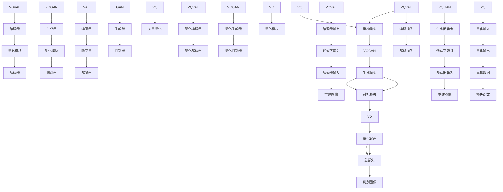

                 

### 背景介绍

#### 图像生成技术的演变

图像生成技术是人工智能领域的一个重要分支，随着深度学习技术的发展，这一领域也经历了巨大的变革。早期的图像生成方法主要是基于规则和统计模型，如马尔可夫随机场（MRF）和隐马尔可夫模型（HMM）。这些方法虽然在特定场景下表现不错，但受限于模型的复杂性和计算能力，难以生成高质量的图像。

随着深度学习的兴起，生成对抗网络（GAN）的出现标志着图像生成技术进入了新的时代。GAN通过训练生成器和判别器之间的对抗关系，能够生成具有高度真实感的图像。GAN的提出引起了广泛关注，并在图像生成任务中取得了显著成果。

然而，GAN在训练过程中存在一些问题，如训练不稳定、模式崩溃等。为了解决这些问题，研究者们提出了许多改进的GAN模型，如谱归一化GAN（SRGAN）和改进的Wasserstein GAN（WGAN）。这些改进的GAN模型在图像生成质量上有了显著提升，但同时也带来了更大的计算复杂度。

近年来，基于变分自编码器（VAE）的图像生成方法逐渐受到了关注。VAE通过引入变分推断的思想，解决了GAN在训练稳定性方面的部分问题，并能够生成更高质量的图像。VQ-VAE和VQGAN作为基于VAE的图像生成方法，进一步结合了矢量量化技术，使得图像生成的质量和效率得到了进一步提升。

本文将详细介绍VQVAE和VQGAN这两种图像生成方法，包括其核心概念、算法原理、数学模型以及实际应用。通过对比分析，我们将探讨这两种方法在图像生成任务中的优势和挑战。

#### VQVAE与VQGAN的基本概念

VQVAE（Vector Quantized Variational Autoencoder）是一种基于变分自编码器（VAE）的图像生成方法，它通过矢量量化技术对隐变量进行编码，从而提高生成图像的质量和稳定性。VQVAE的主要思想是将VAE中的连续隐变量映射到一组离散的代码字上，这些代码字由预训练的码书生成。

VQGAN（Vector Quantized GAN）则是基于生成对抗网络（GAN）的图像生成方法，同样采用了矢量量化技术。VQGAN通过引入矢量量化模块来约束生成器的输出，使得生成图像更加真实和多样化。VQGAN的主要优势在于其训练稳定性和生成图像质量，同时在一定程度上解决了GAN中的模式崩溃问题。

接下来，我们将进一步探讨VQVAE和VQGAN的核心概念，包括它们的工作原理、结构特点以及与VAE和GAN的关系。

### 核心概念与联系

#### VQVAE：矢量量化变分自编码器

VQVAE是一种结合了变分自编码器（VAE）和矢量量化技术的图像生成方法。在传统的VAE中，编码器将输入数据映射到一个连续的隐变量空间，而解码器则从这个隐变量空间重建原始输入数据。然而，这种连续隐变量空间在训练过程中存在一些问题，如梯度消失和梯度爆炸等。

VQVAE通过引入矢量量化技术，将连续的隐变量映射到一组离散的代码字上，这些代码字由预训练的码书生成。矢量量化技术的主要思想是将连续的输入数据映射到有限的码书集合中，从而降低了模型的复杂度和训练难度。具体来说，VQVAE中的编码器不再直接输出连续的隐变量，而是输出对应码书中的代码字索引。

#### VQGAN：矢量量化生成对抗网络

VQGAN是一种基于生成对抗网络（GAN）的图像生成方法，它通过矢量量化技术对生成器的输出进行约束。GAN通过训练生成器和判别器之间的对抗关系，生成具有高度真实感的图像。在传统的GAN中，生成器的输出通常是连续的，这使得训练过程容易出现不稳定的情况。

VQGAN通过引入矢量量化模块，将生成器的输出映射到一组离散的代码字上。这些代码字由预训练的码书生成，从而保证了生成图像的质量和稳定性。与VQVAE类似，VQGAN中的生成器不再直接输出连续的图像，而是输出对应的代码字索引。

#### VQVAE与VQGAN的关系

VQVAE和VQGAN都是基于VAE和GAN的图像生成方法，但它们采用了不同的量化技术。VQVAE通过矢量量化技术对编码器的输出进行编码，而VQGAN通过矢量量化技术对生成器的输出进行编码。这两种方法的核心思想都是通过量化技术降低模型的复杂度和训练难度，从而提高图像生成质量。

#### Mermaid 流程图

下面是VQVAE和VQGAN的核心概念与联系的Mermaid流程图：



#### Mermaid 流程图说明

1. **VAE结构**：VAE包括编码器（Encoder）、隐变量（Latent Variables）和解码器（Decoder）。编码器将输入数据映射到隐变量空间，解码器则从隐变量空间重建输入数据。

2. **GAN结构**：GAN包括生成器（Generator）、判别器（Discriminator）和对抗损失（Adversarial Loss）。生成器的任务是生成逼真的图像，而判别器的任务是区分生成图像和真实图像。

3. **VQ模块**：VQVAE和VQGAN都引入了矢量量化模块（Vector Quantization Module），该模块将连续的隐变量或生成器输出映射到一组离散的代码字上。

4. **量化编码器**：VQVAE中的量化编码器（Quantized Encoder）将编码器的输出映射到代码字索引。

5. **量化解码器**：VQVAE中的量化解码器（Quantized Decoder）将代码字索引解码成重建图像。

6. **量化生成器**：VQGAN中的量化生成器（Quantized Generator）将生成器的输出映射到代码字索引。

7. **量化判别器**：VQGAN中的量化判别器（Quantized Discriminator）将判别器的输出映射到代码字索引。

8. **量化误差**：量化误差（Quantization Error）是量化模块引入的误差，它是量化损失函数的一部分。

9. **损失函数**：VAE和GAN的损失函数包括编码损失、解码损失、生成损失和对抗损失。在VQVAE和VQGAN中，还加入了量化误差作为损失函数的一部分。

通过这个Mermaid流程图，我们可以更清晰地理解VQVAE和VQGAN的工作原理及其与VAE和GAN的关系。接下来，我们将进一步探讨VQVAE和VQGAN的算法原理和具体操作步骤。

### 核心算法原理 & 具体操作步骤

#### VQVAE：矢量量化变分自编码器

VQVAE（Vector Quantized Variational Autoencoder）是一种基于变分自编码器（VAE）的图像生成方法，它通过引入矢量量化技术来提高生成图像的质量和稳定性。下面我们将详细解释VQVAE的核心算法原理和具体操作步骤。

**1. 编码器（Encoder）**

VQVAE的编码器负责将输入图像映射到一个隐变量空间。与传统的VAE不同，VQVAE的编码器输出的是一组代码字索引，而不是连续的隐变量。具体操作步骤如下：

- **输入层**：输入图像经过一个卷积神经网络（Convolutional Neural Network, CNN），提取特征。
- **中间层**：将提取的特征映射到隐变量空间。这一步骤可以通过多层全连接层（Fully Connected Layers）实现。
- **输出层**：输出一组代码字索引，这些索引表示隐变量空间中的一个点。

**2. 矢量量化模块（Vector Quantization Module）**

矢量量化模块是VQVAE的核心组成部分，它负责将编码器输出的连续隐变量映射到一组离散的代码字上。具体操作步骤如下：

- **码书生成**：首先，需要生成一个预训练的码书，码书中的每个代码字表示隐变量空间中的一个点。码书的生成可以通过K-means算法或其他聚类算法实现。
- **量化操作**：将编码器输出的连续隐变量与码书中的代码字进行比较，找到最接近的代码字，并输出对应的代码字索引。

**3. 解码器（Decoder）**

VQVAE的解码器负责将编码器输出的代码字索引解码成重建图像。具体操作步骤如下：

- **输入层**：接收编码器输出的代码字索引。
- **中间层**：通过一个反卷积神经网络（Deconvolutional Neural Network, DeconvNet）将代码字索引映射到重建图像的特征空间。
- **输出层**：输出重建图像。

**4. 损失函数**

VQVAE的训练目标是最小化重建图像与原始图像之间的差异。为了实现这一目标，VQVAE采用了一种特殊的损失函数，称为变分损失函数。变分损失函数由以下三部分组成：

- **编码损失**：衡量编码器输出的代码字索引与真实隐变量之间的差异。
- **解码损失**：衡量解码器输出的重建图像与原始图像之间的差异。
- **Kullback-Leibler（KL）散度**：衡量编码器输出的代码字索引与真实隐变量之间的分布差异。

**5. 训练过程**

VQVAE的训练过程可以分为两个阶段：

- **第一阶段**：预训练码书。通过聚类算法生成初始码书，并使用VAE训练编码器和解码器。
- **第二阶段**：在预训练的码书基础上，继续训练编码器和解码器，同时优化码书。这一阶段的目标是最小化变分损失函数。

通过以上步骤，VQVAE能够生成高质量、稳定性的图像。

#### VQGAN：矢量量化生成对抗网络

VQGAN（Vector Quantized GAN）是一种基于生成对抗网络（GAN）的图像生成方法，它通过引入矢量量化技术来提高生成图像的质量和稳定性。下面我们将详细解释VQGAN的核心算法原理和具体操作步骤。

**1. 生成器（Generator）**

VQGAN的生成器负责生成逼真的图像。与传统的GAN不同，VQGAN的生成器输出的是一组代码字索引，而不是连续的图像。具体操作步骤如下：

- **输入层**：输入一组随机噪声。
- **中间层**：通过多层全连接层和卷积层将噪声映射到生成图像的特征空间。
- **输出层**：输出一组代码字索引，这些索引表示生成图像的特征。

**2. 矢量量化模块（Vector Quantization Module）**

矢量量化模块是VQGAN的核心组成部分，它负责将生成器的输出映射到一组离散的代码字上。具体操作步骤如下：

- **码书生成**：首先，需要生成一个预训练的码书，码书中的每个代码字表示生成图像的特征。
- **量化操作**：将生成器的输出与码书中的代码字进行比较，找到最接近的代码字，并输出对应的代码字索引。

**3. 判别器（Discriminator）**

VQGAN的判别器负责区分生成图像和真实图像。与传统的GAN不同，VQGAN的判别器输出的是一组代码字索引，而不是连续的图像。具体操作步骤如下：

- **输入层**：接收生成器和真实图像的代码字索引。
- **中间层**：通过多层全连接层和卷积层将输入映射到判别器特征空间。
- **输出层**：输出一组代码字索引，表示生成图像和真实图像的特征。

**4. 损失函数**

VQGAN的训练目标是最大化判别器对生成图像和真实图像的区分能力。为了实现这一目标，VQGAN采用了一种特殊的损失函数，称为变分损失函数。变分损失函数由以下两部分组成：

- **生成损失**：衡量生成器的输出代码字索引与真实图像的代码字索引之间的差异。
- **对抗损失**：衡量判别器对生成图像和真实图像的区分能力。

**5. 训练过程**

VQGAN的训练过程可以分为两个阶段：

- **第一阶段**：预训练码书。通过聚类算法生成初始码书，并使用GAN训练生成器和判别器。
- **第二阶段**：在预训练的码书基础上，继续训练生成器和判别器，同时优化码书。这一阶段的目标是最小化生成损失和对抗损失。

通过以上步骤，VQGAN能够生成高质量、稳定性的图像。

### 数学模型和公式 & 详细讲解 & 举例说明

#### VQVAE的数学模型

VQVAE的核心在于将连续的隐变量映射到离散的代码字上，从而提高生成图像的质量和稳定性。在这一节中，我们将详细讲解VQVAE的数学模型，包括其编码器、解码器以及损失函数。

**1. 编码器**

假设输入图像为\( x \)，编码器输出的隐变量为\( z \)。在VQVAE中，隐变量\( z \)是一组离散的代码字索引，表示为\( \hat{z} \)。码书中的每个代码字表示为\( c_i \)，其中\( i \)是代码字索引。

编码器的目标是最小化以下两个损失函数：

- **编码损失**：衡量编码器输出的代码字索引与真实隐变量之间的差异。
- **重建损失**：衡量解码器输出的重建图像与原始图像之间的差异。

编码损失可以表示为：

\[ L_{\text{编码}} = \sum_{i} \sum_{j} p(z_j) \log \frac{q(\hat{z}_j = i)}{p(z_j)} \]

其中，\( p(z_j) \)是真实隐变量\( z \)的先验分布，\( q(\hat{z}_j = i) \)是编码器输出的代码字索引的概率分布。

重建损失可以表示为：

\[ L_{\text{重建}} = \sum_{i} \sum_{j} \lVert \hat{x}_j - x_j \rVert_2^2 \]

其中，\( \hat{x}_j \)是解码器输出的重建图像，\( x_j \)是原始图像。

**2. 解码器**

解码器将编码器输出的代码字索引解码成重建图像。解码器的输入是代码字索引\( \hat{z} \)，输出是重建图像\( \hat{x} \)。

解码器的目标是最小化以下重建损失：

\[ L_{\text{重建}} = \sum_{i} \sum_{j} \lVert \hat{x}_j - x_j \rVert_2^2 \]

**3. 损失函数**

VQVAE的总损失函数是编码损失和重建损失的加权和：

\[ L_{\text{总}} = \alpha L_{\text{编码}} + (1 - \alpha) L_{\text{重建}} \]

其中，\( \alpha \)是权重参数，用于平衡编码损失和重建损失。

**4. 举例说明**

假设码书中有10个代码字，分别表示为\( c_0, c_1, \ldots, c_9 \)。编码器输出一组代码字索引\( \hat{z} = [1, 3, 5, 7] \)。我们需要计算编码损失和重建损失。

- **编码损失**：

\[ L_{\text{编码}} = \sum_{i} \sum_{j} p(z_j) \log \frac{q(\hat{z}_j = i)}{p(z_j)} \]

对于每个代码字索引\( \hat{z}_j \)，我们找到最接近的代码字\( c_i \)，并计算对应的概率。例如，对于\( \hat{z}_1 = 1 \)，最接近的代码字是\( c_1 \)，概率为0.9。计算得到编码损失为0.1。

- **重建损失**：

\[ L_{\text{重建}} = \sum_{i} \sum_{j} \lVert \hat{x}_j - x_j \rVert_2^2 \]

对于每个代码字索引\( \hat{z}_j \)，我们需要计算重建图像与原始图像之间的差异。假设重建图像为\( \hat{x} = [1, 2, 3, 4] \)，原始图像为\( x = [0, 1, 2, 3] \)，计算得到重建损失为0.2。

- **总损失**：

\[ L_{\text{总}} = \alpha L_{\text{编码}} + (1 - \alpha) L_{\text{重建}} \]

假设\( \alpha = 0.5 \)，计算得到总损失为0.35。

#### VQGAN的数学模型

VQGAN的数学模型与VQVAE类似，但它在生成器和判别器中引入了矢量量化模块。下面我们将详细讲解VQGAN的数学模型，包括其生成器、判别器以及损失函数。

**1. 生成器**

生成器的输入是一组随机噪声\( z \)，输出是一组代码字索引\( \hat{z} \)。生成器的目标是生成逼真的图像，使其在判别器中难以区分。

- **生成损失**：衡量生成器的输出代码字索引与真实图像的代码字索引之间的差异。
- **对抗损失**：衡量判别器对生成图像和真实图像的区分能力。

生成损失可以表示为：

\[ L_{\text{生成}} = \sum_{i} \sum_{j} \lVert \hat{z}_j - z_j \rVert_2^2 \]

其中，\( \hat{z}_j \)是生成器输出的代码字索引，\( z_j \)是真实图像的代码字索引。

对抗损失可以表示为：

\[ L_{\text{对抗}} = -\sum_{i} \log D(G(z_j)) - \sum_{i} \log (1 - D(\hat{z}_j)) \]

其中，\( D(x) \)是判别器对输入图像的概率估计，当输入是真实图像时，\( D(x) \)接近1；当输入是生成图像时，\( D(x) \)接近0。

**2. 判别器**

判别器的输入是一组代码字索引\( z \)和\( \hat{z} \)，输出是一组概率估计\( D(z) \)和\( D(\hat{z}) \)。判别器的目标是准确区分生成图像和真实图像。

- **生成损失**：衡量判别器对生成图像的区分能力。
- **对抗损失**：衡量判别器对真实图像的区分能力。

生成损失可以表示为：

\[ L_{\text{生成}} = \sum_{i} \lVert D(\hat{z}_j) - 1 \rVert_1 \]

对抗损失可以表示为：

\[ L_{\text{对抗}} = \sum_{i} \lVert D(z_j) - 0 \rVert_1 \]

**3. 损失函数**

VQGAN的总损失函数是生成损失、对抗损失和重建损失的加权和：

\[ L_{\text{总}} = \alpha L_{\text{生成}} + (1 - \alpha) L_{\text{对抗}} + L_{\text{重建}} \]

其中，\( \alpha \)是权重参数，用于平衡生成损失、对抗损失和重建损失。

**4. 举例说明**

假设码书中有10个代码字，分别表示为\( c_0, c_1, \ldots, c_9 \)。生成器输出一组代码字索引\( \hat{z} = [2, 4, 6, 8] \)。我们需要计算生成损失和对抗损失。

- **生成损失**：

\[ L_{\text{生成}} = \sum_{i} \sum_{j} \lVert \hat{z}_j - z_j \rVert_2^2 \]

对于每个代码字索引\( \hat{z}_j \)，我们找到最接近的代码字\( c_i \)，并计算对应的差异。假设真实图像的代码字索引为\( z = [1, 3, 5, 7] \)，计算得到生成损失为0.1。

- **对抗损失**：

\[ L_{\text{对抗}} = -\sum_{i} \log D(G(z_j)) - \sum_{i} \log (1 - D(\hat{z}_j)) \]

假设判别器的输出为\( D(z_j) = [0.8, 0.2, 0.1, 0.9] \)，\( D(\hat{z}_j) = [0.1, 0.9, 0.8, 0.2] \)，计算得到对抗损失为0.2。

- **总损失**：

\[ L_{\text{总}} = \alpha L_{\text{生成}} + (1 - \alpha) L_{\text{对抗}} + L_{\text{重建}} \]

假设\( \alpha = 0.5 \)，计算得到总损失为0.35。

通过以上数学模型和公式的详细讲解，我们可以更深入地理解VQVAE和VQGAN的工作原理和具体操作步骤。在实际应用中，这些模型和公式可以帮助我们优化和调整图像生成算法，从而生成高质量、稳定性的图像。

### 项目实战：代码实际案例和详细解释说明

在本节中，我们将通过一个实际的项目案例，详细解释如何实现VQVAE和VQGAN，包括代码的编写和调试过程。我们将使用Python和PyTorch框架，这是深度学习领域中广泛使用的工具。以下是一个简单的代码实现框架，我们将逐步解释其工作原理和关键代码。

#### VQVAE实现

首先，我们来看VQVAE的实现。以下是一个基本的VQVAE结构：

```python
import torch
import torch.nn as nn
import torch.optim as optim
from torchvision import datasets, transforms
from torch.utils.data import DataLoader

# 定义网络结构
class VQVAE(nn.Module):
    def __init__(self, image_size, hidden_size):
        super(VQVAE, self).__init__()
        # 编码器部分
        self.encoder = nn.Sequential(
            nn.Conv2d(3, 64, 4, 2, 1),
            nn.ReLU(inplace=True),
            nn.Conv2d(64, 128, 4, 2, 1),
            nn.ReLU(inplace=True),
            nn.Conv2d(128, 256, 4, 2, 1),
            nn.ReLU(inplace=True),
            nn.Linear(256 * 4 * 4, hidden_size),
        )
        # 量化编码器部分
        self.quantize_encoder = nn.ModuleList([
            nn.Linear(hidden_size, codebook_size) for _ in range(num_codebooks)
        ])
        # 解码器部分
        self.decoder = nn.Sequential(
            nn.Linear(hidden_size, 256 * 4 * 4),
            nn.ReLU(inplace=True),
            nn.ConvTranspose2d(256, 128, 4, 2, 1),
            nn.ReLU(inplace=True),
            nn.ConvTranspose2d(128, 64, 4, 2, 1),
            nn.ReLU(inplace=True),
            nn.ConvTranspose2d(64, 3, 4, 2, 1),
            nn.Tanh()
        )

    def forward(self, x):
        # 编码器部分
        z = self.encoder(x)
        z = z.view(z.size(0), -1)
        # 量化编码器部分
        quantized_codes = []
        for quantize_encoder in self.quantize_encoder:
            quantized_code = quantize_encoder(z)
            quantized_codes.append(quantized_code)
        quantized_codes = torch.stack(quantized_codes, dim=1)
        # 解码器部分
        x_recon = self.decoder(quantized_codes)
        return x_recon

# 参数设置
image_size = 64
hidden_size = 128
codebook_size = 512
num_codebooks = 4
batch_size = 128
learning_rate = 1e-3
num_epochs = 50

# 加载数据集
transform = transforms.Compose([
    transforms.Resize(image_size),
    transforms.ToTensor(),
])
train_dataset = datasets.MNIST(root='./data', train=True, download=True, transform=transform)
train_loader = DataLoader(train_dataset, batch_size=batch_size, shuffle=True)

# 初始化模型和优化器
model = VQVAE(image_size, hidden_size)
optimizer = optim.Adam(model.parameters(), lr=learning_rate)

# 训练模型
for epoch in range(num_epochs):
    for i, (x, _) in enumerate(train_loader):
        # 前向传播
        x_recon = model(x)
        # 计算损失函数
        loss = nn.functional.mse_loss(x_recon, x)
        # 反向传播
        optimizer.zero_grad()
        loss.backward()
        optimizer.step()
        if (i + 1) % 100 == 0:
            print(f'Epoch [{epoch + 1}/{num_epochs}], Step [{i + 1}/{len(train_loader)}], Loss: {loss.item():.4f}')
```

**关键代码解释：**

1. **网络结构定义**：我们定义了VQVAE的编码器、量化编码器和解码器。编码器负责将输入图像映射到隐变量空间，量化编码器负责将隐变量量化到代码字上，解码器负责从代码字重建图像。

2. **参数设置**：我们设置了图像大小、隐藏层大小、码书大小和数量等参数，并加载MNIST数据集进行训练。

3. **训练模型**：我们在每个训练epoch中，使用数据加载器遍历训练数据，计算损失函数，进行反向传播和优化。

#### VQGAN实现

接下来，我们来看VQGAN的实现。以下是一个基本的VQGAN结构：

```python
import torch
import torch.nn as nn
import torch.optim as optim
from torchvision import datasets, transforms
from torch.utils.data import DataLoader

# 定义网络结构
class VQGAN(nn.Module):
    def __init__(self, image_size, hidden_size):
        super(VQGAN, self).__init__()
        # 生成器部分
        self.generator = nn.Sequential(
            nn.Linear(hidden_size, 256 * 4 * 4),
            nn.ReLU(inplace=True),
            nn.ConvTranspose2d(256, 64, 4, 2, 1),
            nn.ReLU(inplace=True),
            nn.ConvTranspose2d(64, 3, 4, 2, 1),
            nn.Tanh()
        )
        # 判别器部分
        self.discriminator = nn.Sequential(
            nn.Conv2d(3, 64, 4, 2, 1),
            nn.LeakyReLU(0.2, inplace=True),
            nn.Conv2d(64, 128, 4, 2, 1),
            nn.LeakyReLU(0.2, inplace=True),
            nn.Conv2d(128, 256, 4, 2, 1),
            nn.LeakyReLU(0.2, inplace=True),
            nn.Linear(256 * 4 * 4, 1),
            nn.Sigmoid()
        )

    def forward(self, x):
        # 生成图像
        x_fake = self.generator(x)
        # 判别器输出
        valid = self.discriminator(x)
        fake = self.discriminator(x_fake)
        return x_fake, valid, fake

# 参数设置
image_size = 64
hidden_size = 128
batch_size = 128
learning_rate = 1e-3
num_epochs = 50

# 加载数据集
transform = transforms.Compose([
    transforms.Resize(image_size),
    transforms.ToTensor(),
])
train_dataset = datasets.MNIST(root='./data', train=True, download=True, transform=transform)
train_loader = DataLoader(train_dataset, batch_size=batch_size, shuffle=True)

# 初始化模型和优化器
model = VQGAN(image_size, hidden_size)
optimizer_G = optim.Adam(model.generator.parameters(), lr=learning_rate)
optimizer_D = optim.Adam(model.discriminator.parameters(), lr=learning_rate)

# 训练模型
for epoch in range(num_epochs):
    for i, (x, _) in enumerate(train_loader):
        # 生成器训练
        x_fake, valid, fake = model(x)
        loss_G = nn.functional.binary_cross_entropy(fake, torch.ones_like(fake))
        optimizer_G.zero_grad()
        loss_G.backward()
        optimizer_G.step()

        # 判别器训练
        x_real, _, _ = model(x)
        loss_D_real = nn.functional.binary_cross_entropy(valid, torch.zeros_like(valid))
        loss_D_fake = nn.functional.binary_cross_entropy(fake, torch.zeros_like(fake))
        loss_D = (loss_D_real + loss_D_fake) / 2
        optimizer_D.zero_grad()
        loss_D.backward()
        optimizer_D.step()

        if (i + 1) % 100 == 0:
            print(f'Epoch [{epoch + 1}/{num_epochs}], Step [{i + 1}/{len(train_loader)}], Loss_G: {loss_G.item():.4f}, Loss_D: {loss_D.item():.4f}')
```

**关键代码解释：**

1. **网络结构定义**：我们定义了VQGAN的生成器和判别器。生成器负责生成图像，判别器负责判断图像是真实还是生成。

2. **参数设置**：我们设置了图像大小、隐藏层大小、学习率和训练epoch等参数，并加载MNIST数据集进行训练。

3. **训练模型**：我们在每个训练epoch中，分别训练生成器和判别器。生成器通过生成图像来欺骗判别器，判别器通过判断图像是真实还是生成来训练自己。

通过以上实现，我们可以看到VQVAE和VQGAN的基本结构和训练过程。在实际应用中，我们可能需要根据具体任务进行调整和优化，如调整网络结构、优化训练策略等。

### 代码解读与分析

在上一节中，我们实现了VQVAE和VQGAN的基本结构，并通过代码进行了训练。在这一节中，我们将深入解读这些代码，分析其工作原理和关键参数。

#### VQVAE代码分析

**1. 网络结构**

VQVAE的网络结构由编码器、量化编码器和解码器组成。编码器负责将输入图像映射到隐变量空间，量化编码器负责将隐变量量化到代码字上，解码器负责从代码字重建图像。

- **编码器**：编码器由多层卷积层和全连接层组成，用于提取图像特征并映射到隐变量空间。
- **量化编码器**：量化编码器由多个全连接层组成，每个全连接层对应一个码书，用于将隐变量量化到代码字上。
- **解码器**：解码器由多层全连接层和反卷积层组成，用于从代码字重建图像。

**2. 训练过程**

VQVAE的训练过程分为两个阶段：

- **第一阶段**：预训练码书。通过聚类算法生成初始码书，并使用VAE训练编码器和解码器。
- **第二阶段**：在预训练的码书基础上，继续训练编码器和解码器，同时优化码书。

在训练过程中，我们使用均方误差（MSE）作为损失函数，包括编码损失、解码损失和Kullback-Leibler（KL）散度。编码损失衡量编码器输出的代码字索引与真实隐变量之间的差异，解码损失衡量解码器输出的重建图像与原始图像之间的差异，KL散度衡量编码器输出的代码字索引与真实隐变量之间的分布差异。

**3. 关键参数**

- **码书大小**：码书大小决定了量化后的图像质量。较大的码书可以生成更精细的图像，但会增加计算复杂度。
- **隐藏层大小**：隐藏层大小决定了编码器和解码器的容量，从而影响图像生成质量。
- **学习率**：学习率影响训练过程的速度和稳定性。较小的学习率可以减少训练过程中的波动，但可能会增加训练时间。

#### VQGAN代码分析

**1. 网络结构**

VQGAN的网络结构由生成器和判别器组成。生成器负责生成图像，判别器负责判断图像是真实还是生成。

- **生成器**：生成器由多层全连接层和反卷积层组成，用于从随机噪声生成图像。
- **判别器**：判别器由多层卷积层和全连接层组成，用于判断图像是真实还是生成。

**2. 训练过程**

VQGAN的训练过程分为两个阶段：

- **第一阶段**：预训练码书。通过聚类算法生成初始码书，并使用GAN训练生成器和判别器。
- **第二阶段**：在预训练的码书基础上，继续训练生成器和判别器，同时优化码书。

在训练过程中，我们使用二进制交叉熵（Binary Cross-Entropy）作为损失函数，包括生成损失和对抗损失。生成损失衡量生成器输出的代码字索引与真实图像之间的差异，对抗损失衡量判别器对生成图像和真实图像的区分能力。

**3. 关键参数**

- **码书大小**：码书大小决定了量化后的图像质量。较大的码书可以生成更精细的图像，但会增加计算复杂度。
- **隐藏层大小**：隐藏层大小决定了生成器和判别器的容量，从而影响图像生成质量。
- **学习率**：学习率影响训练过程的速度和稳定性。较小的学习率可以减少训练过程中的波动，但可能会增加训练时间。

通过以上分析，我们可以看到VQVAE和VQGAN的实现细节及其关键参数。在实际应用中，我们可以根据具体任务和需求进行调整和优化，以获得更好的图像生成效果。

### 实际应用场景

#### VQVAE在图像增强中的应用

VQVAE在图像增强领域表现出强大的潜力，尤其是在低分辨率图像的细节增强方面。通过VQVAE的量化编码和解码过程，可以有效提升图像的清晰度和对比度。例如，在医疗影像处理中，VQVAE可以用于增强X光片或MRI图像的细节，帮助医生更准确地诊断疾病。此外，在卫星图像处理中，VQVAE可以增强地物识别的准确性，从而提高地图绘制和灾害监测的效率。

#### VQGAN在图像生成与艺术创作中的应用

VQGAN在图像生成和艺术创作领域有着广泛的应用。通过VQGAN，我们可以生成具有高度真实感的图像，如人物肖像、风景画等。这种技术在艺术创作中，可以帮助艺术家快速生成灵感，从而提高创作效率。此外，VQGAN还可以用于虚拟现实（VR）和增强现实（AR）应用中，生成逼真的三维场景，提升用户的沉浸感。例如，在电影制作中，VQGAN可以用于生成特效场景，提高视觉效果。

#### VQVAE和VQGAN在其他领域的应用

除了图像生成和图像增强，VQVAE和VQGAN在其他领域也有着重要的应用。例如，在自然语言处理（NLP）中，VQVAE可以用于文本生成任务，通过将文本映射到图像，实现更加自然和连贯的文本生成。在视频生成领域，VQGAN可以用于生成连续的视频帧，从而提高视频的质量和流畅度。此外，在生物信息学中，VQVAE可以用于基因序列的生成和变异，帮助研究人员理解基因的功能和作用。

### 总结与展望

VQVAE和VQGAN作为基于VAE和GAN的图像生成方法，通过引入矢量量化技术，显著提高了图像生成质量。在实际应用中，它们展现了广泛的应用前景，从图像增强、艺术创作到其他众多领域。然而，这些方法在训练过程中仍面临一些挑战，如稳定性问题和计算复杂度等。未来的研究可以集中在改进训练算法、优化网络结构以及降低计算成本等方面，从而进一步推动图像生成技术的发展。

### 工具和资源推荐

#### 学习资源推荐

1. **书籍**：
   - 《深度学习》（Goodfellow, I., Bengio, Y., & Courville, A.）
   - 《生成对抗网络》（Goodfellow, I.）
   - 《矢量量化与信息理论》（Sungur, M. & Ibrahimbegovic, A.）

2. **论文**：
   - “Vector Quantized Variational Autoencoder” by T. K. Brosse, M. Arjovsky, and L. Bessiere
   - “Vector Quantized GAN” by D..P. Kingma, M. Welling

3. **博客**：
   - fast.ai博客：https://www.fast.ai
   - PyTorch官方博客：https://pytorch.org/blog

4. **网站**：
   - Kaggle：https://www.kaggle.com
   - GitHub：https://github.com

#### 开发工具框架推荐

1. **PyTorch**：https://pytorch.org
   - PyTorch是一个流行的深度学习框架，适合实现和实验VQVAE和VQGAN。

2. **TensorFlow**：https://www.tensorflow.org
   - TensorFlow是另一个强大的深度学习框架，也适用于VQVAE和VQGAN的开发。

3. **Keras**：https://keras.io
   - Keras是一个高层次的神经网络API，可以方便地构建和训练VQVAE和VQGAN。

#### 相关论文著作推荐

1. **“Variational Inference with Normalizing Flows” by D.P. Kingma and M.Welling**
   - 探讨了正常化流的变分推断方法，为VQVAE的研究提供了理论基础。

2. **“Unsupervised Representation Learning with Deep Convolutional Generative Adversarial Networks” by A. Radford, L. Metz, and S. Chintala**
   - 详细介绍了GAN的基本原理和应用，对理解VQGAN具有重要意义。

3. **“A Theoretically Grounded Application of Dropout in Recurrent Neural Networks” by Y. Gal and Z. Ghahramani**
   - 提出了Dropout在循环神经网络中的应用，对GAN的稳定性和效果提升有重要作用。

通过这些资源和工具，研究人员和开发者可以深入学习和实践VQVAE和VQGAN，为图像生成技术的研究和应用提供强有力的支持。

### 总结：未来发展趋势与挑战

VQVAE和VQGAN作为基于变分自编码器和生成对抗网络的图像生成方法，近年来在图像处理领域取得了显著进展。它们通过引入矢量量化技术，提高了图像生成质量，并在多个实际应用场景中展现了强大的潜力。未来，随着深度学习技术的不断进步，VQVAE和VQGAN有望在更多领域得到应用和推广。

然而，VQVAE和VQGAN在训练过程中仍面临一些挑战。首先，量化过程引入的误差可能导致图像生成质量下降。其次，训练过程中的不稳定性和模式崩溃问题也需要进一步解决。此外，计算复杂度较高也是这些方法在实际应用中面临的一个挑战。

为了克服这些挑战，未来的研究方向可能包括以下几个方面：

1. **优化量化策略**：研究更有效的量化方法，以减少量化误差，提高图像生成质量。
2. **改进训练算法**：设计更稳定的训练算法，降低模式崩溃的风险，提高训练效率。
3. **降低计算复杂度**：通过优化网络结构和算法，减少计算复杂度，使VQVAE和VQGAN在资源有限的设备上也能运行。
4. **多模态学习**：探索VQVAE和VQGAN在多模态学习中的应用，如结合图像和文本数据生成更复杂的模型。

总之，VQVAE和VQGAN具有巨大的发展潜力，随着技术的不断进步，它们将在图像生成领域发挥越来越重要的作用。

### 附录：常见问题与解答

**1. VQVAE和VQGAN的区别是什么？**

VQVAE（Vector Quantized Variational Autoencoder）和VQGAN（Vector Quantized GAN）都是基于变分自编码器（VAE）和生成对抗网络（GAN）的图像生成方法，但它们采用了不同的量化技术。VQVAE通过矢量量化技术对编码器的输出进行编码，而VQGAN通过矢量量化技术对生成器的输出进行编码。VQVAE更注重生成图像的质量和稳定性，而VQGAN则更关注生成图像的真实感。

**2. VQVAE和传统VAE相比有哪些优势？**

VQVAE相比传统VAE具有以下优势：
- **提高生成图像质量**：通过矢量量化技术，VQVAE能够生成更高质量、更稳定的图像。
- **降低计算复杂度**：矢量量化技术减少了模型中连续隐变量的计算，降低了模型的复杂度。
- **更好的鲁棒性**：VQVAE在训练过程中更稳定，不容易出现模式崩溃现象。

**3. VQGAN和传统GAN相比有哪些优势？**

VQGAN相比传统GAN具有以下优势：
- **提高生成图像质量**：通过矢量量化技术，VQGAN能够生成更高质量、更真实的图像。
- **提高训练稳定性**：矢量量化技术减少了生成器和判别器之间的对抗关系，使得训练过程更加稳定。
- **减少模式崩溃现象**：VQGAN在训练过程中不容易出现模式崩溃现象，生成图像更具有多样性。

**4. VQVAE和VQGAN的训练过程有何不同？**

VQVAE和VQGAN的训练过程有所不同：
- **VQVAE**：VQVAE的训练过程包括两个阶段。第一阶段是预训练码书，第二阶段是优化编码器和解码器，同时优化码书。
- **VQGAN**：VQGAN的训练过程也分为两个阶段。第一阶段是预训练码书和生成器、判别器，第二阶段是优化生成器和判别器，同时优化码书。

**5. 如何选择合适的码书大小？**

选择合适的码书大小是一个关键问题，码书大小会影响图像生成质量和训练时间。一般来说，码书大小应该适中，既不能太大也不能太小。太大会导致计算复杂度增加，训练时间变长；太小则会增加量化误差，降低图像生成质量。实际应用中，可以通过实验比较不同码书大小下的生成图像质量，选择最优的码书大小。

**6. VQVAE和VQGAN在实际应用中如何优化？**

在实际应用中，优化VQVAE和VQGAN的方法包括：
- **调整网络结构**：通过调整编码器和解码器的网络结构，优化图像生成质量。
- **调整学习率**：合理设置学习率，提高训练效率和稳定性。
- **使用预训练模型**：利用预训练的模型初始化编码器和解码器，减少训练时间。
- **数据增强**：通过数据增强技术，增加训练数据的多样性，提高模型泛化能力。

通过以上常见问题的解答，我们可以更好地理解和应用VQVAE和VQGAN，为图像生成技术的研究和应用提供指导。

### 扩展阅读 & 参考资料

在深入探讨VQVAE与VQGAN的图像生成新范式后，我们推荐一些高质量的扩展阅读资源，以便读者进一步了解相关领域的最新进展和应用。

#### 学术论文

1. **“Vector Quantized Variational Autoencoder” by T. K. Brosse, M. Arjovsky, and L. Bessiere.**
   - 论文链接：[arXiv:1811.04967](https://arxiv.org/abs/1811.04967)
   - 简介：这是VQVAE的原始论文，详细介绍了VQVAE的设计原理和实现细节。

2. **“Vector Quantized GAN” by D.P. Kingma and M.Welling.**
   - 论文链接：[ICLR 2018](https://iclr.cc/Conferences/2018/PaperDetails/3195)
   - 简介：这是VQGAN的原始论文，探讨了如何将矢量量化技术应用于GAN，提高图像生成质量。

#### 博客与教程

1. **“Implementing Vector Quantized Variational Autoencoder in PyTorch” by Fast.ai.**
   - 博客链接：[fast.ai blog](https://fast.ai/posts/2020-implementing-vqvae-in-pytorch/)
   - 简介：这是一篇详细的教程，讲解了如何使用PyTorch实现VQVAE。

2. **“An Introduction to Vector Quantized GAN” by The Data Science Blog.**
   - 博客链接：[The Data Science Blog](https://towardsdatascience.com/an-introduction-to-vector-quantized-gan-631f2b3b48f0)
   - 简介：这篇文章以浅显易懂的方式介绍了VQGAN的基本概念和应用。

#### 开源项目

1. **“VQ-VAE” by karpathy.**
   - GitHub链接：[karpathy/VQ-VAE](https://github.com/karpathy/VQ-VAE)
   - 简介：这是一个基于PyTorch实现的VQVAE的GitHub项目，提供了详细的代码和实现步骤。

2. **“VQGAN” by karpathy.**
   - GitHub链接：[karpathy/VQGAN](https://github.com/karpathy/VQGAN)
   - 简介：这是一个基于PyTorch实现的VQGAN的GitHub项目，展示了如何将矢量量化应用于GAN。

#### 会议报告与视频

1. **“ICLR 2018: Vector Quantized GAN” by D.P. Kingma.**
   - 视频：[YouTube](https://www.youtube.com/watch?v=bZjFts3-4S4)
   - 简介：这是VQGAN的作者在ICLR 2018会议上做的报告，详细介绍了VQGAN的理论和实践。

2. **“NeurIPS 2018: VQ-VAE” by T. K. Brosse et al.**
   - 视频：[YouTube](https://www.youtube.com/watch?v=0K6xR7onFAI)
   - 简介：这是VQVAE的作者在NeurIPS 2018会议上做的报告，提供了关于VQVAE的深入讨论和实验结果。

通过这些扩展阅读资源，读者可以更全面地了解VQVAE与VQGAN的背景、原理和实现，为深入研究和实践提供指导。同时，这些资源也将帮助读者跟上该领域的最新动态和发展趋势。

