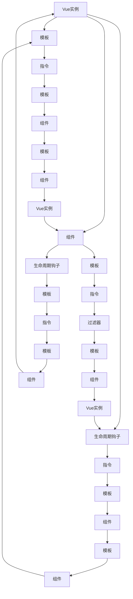

                 

### Vue.js 入门：渐进式 JavaScript 框架

#### 关键词：（Vue.js，渐进式框架，JavaScript，前端开发，组件化，数据绑定，虚拟DOM，响应式系统，单页应用，单文件组件）

#### 摘要：

本文将带领读者深入了解Vue.js这一渐进式JavaScript框架。Vue.js以其简洁、灵活和高效的特性，在前端开发中备受青睐。本文将首先介绍Vue.js的背景和核心概念，然后详细解析其响应式系统、虚拟DOM和组件化等关键特性。此外，文章还将通过实际项目实战，展示Vue.js在实际开发中的应用。最后，本文将总结Vue.js的发展趋势与挑战，并提供相关学习资源与工具推荐。通过本文的阅读，读者将能够全面掌握Vue.js，为前端开发提供强大的支持。

#### 1. 背景介绍

在前端开发领域，JavaScript一直是开发者们的重要工具。然而，随着Web应用的复杂度不断提高，传统的前端开发模式逐渐显得力不从心。为了解决这一问题，一系列前端框架和库应运而生，其中Vue.js便是其中之一。Vue.js是由前Google工程师尤雨溪（Evan You）于2014年创建的，旨在简化前端开发，提高开发效率和代码可维护性。

Vue.js的设计理念是渐进式框架，这意味着它可以从简单开始，逐步引入复杂的功能，使开发者能够根据项目需求自由选择和组合。Vue.js的核心特点包括：

1. **数据绑定**：Vue.js提供了强大的数据绑定机制，使开发者能够以声明式的方式将数据与DOM同步，减少了手动操作DOM的工作量。
2. **虚拟DOM**：Vue.js使用了虚拟DOM技术，通过对比虚拟DOM和实际DOM的差异，高效地更新DOM结构，从而提高了页面的渲染性能。
3. **组件化**：Vue.js鼓励开发者使用组件化开发，将功能模块化，提高了代码的可复用性和可维护性。
4. **响应式系统**：Vue.js的响应式系统能够自动侦测数据变化，触发相应的更新操作，使开发者能够专注于业务逻辑，而不必担心数据状态的管理。

Vue.js因其简洁、灵活和高效的特性，受到了众多开发者的喜爱。它不仅适用于小型的单页应用，也能够应对复杂的大型Web应用。Vue.js的社区活跃，拥有丰富的插件和工具，为开发者提供了丰富的支持。目前，Vue.js已经成为了全球范围内最受欢迎的前端框架之一。

#### 2. 核心概念与联系

##### Vue.js 的核心概念

在深入了解Vue.js之前，我们需要先了解其核心概念。以下是Vue.js中的一些关键概念：

1. **Vue实例**：Vue.js通过创建Vue实例来启动一个Vue应用。Vue实例是应用的核心，它拥有各种选项和方法，用于配置和管理应用。
2. **模板**：Vue.js使用模板语法来描述数据的展示形式。模板中的数据绑定使用`{{ }}`语法，将数据动态地渲染到页面上。
3. **组件**：组件是Vue.js的核心概念之一，它是一种可复用的Vue实例。组件可以将功能模块化，便于管理和维护。
4. **生命周期钩子**：Vue实例在创建、更新和销毁过程中会触发一系列生命周期钩子，这些钩子允许开发者在其特定阶段执行特定的任务。
5. **指令**：指令是带有前缀`v-`的特定元素属性，用于向Vue实例绑定特定行为。例如，`v-model`用于实现数据双向绑定。
6. **过滤器**：过滤器是一种自定义函数，用于对数据进行特定处理。过滤器通过管道符`|`应用于模板中的数据。

##### Vue.js 的核心联系

Vue.js的核心概念之间存在着紧密的联系，这些联系构成了Vue.js的整体架构。以下是Vue.js核心概念之间的联系：

1. **Vue实例与模板**：Vue实例通过模板语法与DOM进行绑定，将数据动态地渲染到页面上。Vue实例的`data`选项用于存储应用状态，模板通过`{{ }}`语法引用这些状态。
2. **组件与模板**：组件是一种可复用的Vue实例，它拥有自己的模板、数据和生命周期钩子。组件可以方便地集成到Vue实例中，实现功能模块化。
3. **生命周期钩子与组件**：生命周期钩子是Vue实例在创建、更新和销毁过程中触发的一系列方法。这些钩子允许开发者在其特定阶段执行特定的任务，例如在组件创建时初始化数据，在组件销毁时清理资源。
4. **指令与模板**：指令是Vue.js用于绑定数据和行为的特殊属性。例如，`v-model`指令用于实现数据双向绑定，`v-for`指令用于渲染列表。
5. **过滤器与模板**：过滤器是Vue.js用于对数据进行特定处理的自定义函数。过滤器通过管道符`|`应用于模板中的数据，例如将时间戳转换为日期格式。

##### Mermaid 流程图

为了更好地展示Vue.js的核心概念及其联系，我们可以使用Mermaid流程图进行可视化表示。以下是一个简单的Mermaid流程图，展示了Vue.js的核心概念及其之间的联系：



通过上述流程图，我们可以清晰地看到Vue.js的核心概念及其之间的联系，这有助于我们更好地理解Vue.js的工作原理。

#### 3. 核心算法原理 & 具体操作步骤

##### 响应式系统

Vue.js的核心算法原理之一是响应式系统。响应式系统的主要目的是在数据发生变化时自动更新DOM，从而实现数据与视图的双向绑定。以下是响应式系统的基本原理和具体操作步骤：

1. **依赖收集**：当Vue实例初始化时，它会遍历模板中的数据对象，使用`Object.defineProperty`方法为每个属性定义getter和setter。在getter中，Vue实例会收集当前属性的依赖，即在模板中使用该属性的组件实例。在setter中，Vue实例会通知所有依赖当前属性的组件实例，触发相应的更新操作。
2. **依赖触发**：当数据发生变化时，setter会触发，从而通知所有依赖当前属性的组件实例。组件实例会重新执行其模板的渲染过程，根据新的数据生成新的虚拟DOM。
3. **虚拟DOM**：虚拟DOM是一种轻量级的对象表示DOM结构，用于描述实际的DOM结构。Vue.js使用虚拟DOM来高效地更新DOM。在组件实例重新渲染虚拟DOM时，Vue.js会通过对比新的虚拟DOM和旧的虚拟DOM的差异，生成一个更新队列。然后，Vue.js会根据更新队列依次更新实际的DOM结构。
4. **组件更新**：在更新DOM的过程中，Vue.js会递归地更新所有依赖当前属性的组件实例。如果组件实例的模板中有子组件，Vue.js会先更新子组件，然后再更新父组件。这样可以确保组件实例的更新顺序与DOM结构的更新顺序保持一致。

##### 虚拟DOM

虚拟DOM是Vue.js响应式系统的关键组件，用于高效地更新DOM。以下是虚拟DOM的基本原理和具体操作步骤：

1. **虚拟DOM创建**：在组件实例初始化时，Vue.js会根据模板生成一个虚拟DOM树。虚拟DOM树中的每个节点都代表实际的DOM节点，包括元素节点、文本节点和属性节点。
2. **虚拟DOM对比**：在组件实例重新渲染时，Vue.js会将新的虚拟DOM树与旧的虚拟DOM树进行对比。通过对比，Vue.js可以找出两个虚拟DOM树之间的差异。
3. **差异更新**：根据对比结果，Vue.js会生成一个更新队列，包含需要更新的DOM节点和操作。Vue.js会按照更新队列的顺序依次更新实际的DOM结构。
4. **批处理**：Vue.js使用批处理机制来优化虚拟DOM的更新过程。在批处理过程中，Vue.js会收集多个更新操作，然后一次性执行，从而减少DOM操作的次数，提高性能。

##### 数据绑定

数据绑定是Vue.js的核心特性之一，用于实现数据与视图的双向绑定。以下是数据绑定的基本原理和具体操作步骤：

1. **数据监听**：Vue.js通过Object.defineProperty方法为每个属性定义getter和setter，用于监听数据的变更。
2. **视图更新**：当数据发生变化时，setter会触发，从而通知Vue.js更新视图。Vue.js会根据新的数据重新渲染模板，生成新的虚拟DOM。
3. **事件处理**：Vue.js使用v-on指令绑定事件处理函数。当事件触发时，Vue.js会调用相应的事件处理函数，根据需要更新数据或触发视图更新。

##### 组件通信

组件通信是Vue.js的重要组成部分，用于实现组件之间的数据传递和通信。以下是组件通信的基本原理和具体操作步骤：

1. **父子组件通信**：Vue.js使用props和events实现父子组件之间的通信。父组件通过props向子组件传递数据，子组件通过events向父组件发送消息。
2. **兄弟组件通信**：Vue.js使用事件总线实现兄弟组件之间的通信。事件总线是一种全局事件系统，通过发布-订阅模式实现组件之间的通信。
3. **跨组件通信**：Vue.js使用 Vuex 实现跨组件通信。Vuex 是一个专为 Vue.js 应用程序开发的状态管理模式，它通过集中管理应用的状态，实现组件之间的数据共享。

#### 4. 数学模型和公式 & 详细讲解 & 举例说明

在Vue.js的响应式系统中，数学模型和公式起到了关键作用。以下是Vue.js中涉及的一些数学模型和公式，以及其详细讲解和举例说明。

##### 数据依赖模型

Vue.js的响应式系统使用了数据依赖模型，用于跟踪数据和视图之间的依赖关系。数据依赖模型的基本原理如下：

1. **依赖收集**：当Vue实例初始化时，它会遍历模板中的数据对象，为每个属性定义getter和setter。在getter中，Vue实例会收集当前属性的依赖，即在模板中使用该属性的组件实例。在setter中，Vue实例会通知所有依赖当前属性的组件实例，触发相应的更新操作。

   公式表示如下：
   $$ 
   Deps = \{ \} \cup \{ \text{getter}\}
   $$
   其中，$Deps$ 表示依赖集合，$\text{getter}$ 表示当前属性的getter函数。

2. **依赖触发**：当数据发生变化时，setter会触发，从而通知所有依赖当前属性的组件实例。组件实例会重新执行其模板的渲染过程，根据新的数据生成新的虚拟DOM。

   公式表示如下：
   $$ 
   Deps(\text{setter}) = \{ \text{setter}\} \cup Deps(\text{getter})
   $$
   其中，$Deps(\text{setter})$ 表示setter触发时依赖集合的变化，$Deps(\text{getter})$ 表示getter触发时依赖集合的变化。

举例说明：

假设有一个Vue实例，其模板中包含一个数据对象`data`，如下所示：
```javascript
data: {
  count: 0
}
```
在模板中，我们使用`{{ count }}`语法展示数据，如下所示：
```html
<div>{{ count }}</div>
```
当数据对象`data`的`count`属性发生变化时，Vue.js会触发依赖触发过程，通知所有依赖`count`属性的组件实例。假设只有一个组件实例依赖`count`属性，Vue.js会执行以下步骤：

1. 在getter中收集依赖：
   $$
   Deps(\text{getter}) = \{ \text{getter} \}
   $$
2. 在setter中触发依赖：
   $$
   Deps(\text{setter}) = \{ \text{setter}, \text{getter} \}
   $$
   Vue.js会通知依赖`count`属性的组件实例，重新渲染模板。

##### 虚拟DOM对比模型

Vue.js使用虚拟DOM对比模型来高效地更新DOM。虚拟DOM对比模型的基本原理如下：

1. **虚拟DOM创建**：在组件实例初始化时，Vue.js会根据模板生成一个虚拟DOM树。虚拟DOM树中的每个节点都代表实际的DOM节点，包括元素节点、文本节点和属性节点。

   公式表示如下：
   $$
   \text{VirtualDOM} = \text{createElement}(\text{template})
   $$
   其中，$\text{createElement}$ 表示创建虚拟DOM节点的函数，$\text{template}$ 表示模板。

2. **虚拟DOM对比**：在组件实例重新渲染时，Vue.js会将新的虚拟DOM树与旧的虚拟DOM树进行对比。通过对比，Vue.js可以找出两个虚拟DOM树之间的差异。

   公式表示如下：
   $$
   \text{Diff} = \text{compare}(\text{oldVirtualDOM}, \text{newVirtualDOM})
   $$
   其中，$\text{compare}$ 表示对比虚拟DOM树的函数，$\text{oldVirtualDOM}$ 表示旧的虚拟DOM树，$\text{newVirtualDOM}$ 表示新的虚拟DOM树。

3. **差异更新**：根据对比结果，Vue.js会生成一个更新队列，包含需要更新的DOM节点和操作。Vue.js会按照更新队列的顺序依次更新实际的DOM结构。

   公式表示如下：
   $$
   \text{UpdateQueue} = \text{generateUpdateQueue}(\text{Diff})
   $$
   其中，$\text{generateUpdateQueue}$ 表示生成更新队列的函数。

举例说明：

假设有一个组件实例，其旧的虚拟DOM树如下所示：
```javascript
{
  "el": "div",
  "children": [
    {
      "el": "span",
      "text": "0"
    }
  ]
}
```
当组件实例重新渲染时，新的虚拟DOM树如下所示：
```javascript
{
  "el": "div",
  "children": [
    {
      "el": "span",
      "text": "1"
    }
  ]
}
```
Vue.js会执行以下步骤：

1. 对比旧的虚拟DOM树和新的虚拟DOM树：
   $$
   \text{Diff} = \text{compare}(\text{oldVirtualDOM}, \text{newVirtualDOM}) = \text{TextNodeUpdate}(\text{span}, 0, 1)
   $$
   对比结果表示文本节点`span`的文本内容从`0`更新为`1`。

2. 生成更新队列：
   $$
   \text{UpdateQueue} = \text{generateUpdateQueue}(\text{Diff}) = \text{TextNodeUpdate}(\text{span}, 0, 1)
   $$

3. 依次更新实际的DOM结构：
   Vue.js会根据更新队列依次更新实际的DOM结构，将文本节点`span`的文本内容更新为`1`。

##### 组件通信模型

Vue.js提供了多种组件通信方式，包括父子组件通信、兄弟组件通信和跨组件通信。以下是组件通信模型的基本原理和具体操作步骤：

1. **父子组件通信**：Vue.js使用props和events实现父子组件之间的通信。父组件通过props向子组件传递数据，子组件通过events向父组件发送消息。

   公式表示如下：
   $$
   \text{ParentComponent} \rightarrow \text{ChildComponent}: \text{props}
   $$
   $$
   \text{ChildComponent} \rightarrow \text{ParentComponent}: \text{events}
   $$

2. **兄弟组件通信**：Vue.js使用事件总线实现兄弟组件之间的通信。事件总线是一种全局事件系统，通过发布-订阅模式实现组件之间的通信。

   公式表示如下：
   $$
   \text{BrotherComponent1} \rightarrow \text{EventBus}: \text{message}
   $$
   $$
   \text{EventBus} \rightarrow \text{BrotherComponent2}: \text{message}
   $$

3. **跨组件通信**：Vue.js使用 Vuex 实现跨组件通信。Vuex 是一个专为 Vue.js 应用程序开发的状态管理模式，它通过集中管理应用的状态，实现组件之间的数据共享。

   公式表示如下：
   $$
   \text{VuexStore} \rightarrow \text{Component}: \text{state}
   $$
   $$
   \text{Component} \rightarrow \text{VuexStore}: \text{mutations}
   $$

举例说明：

假设有一个父组件`ParentComponent`和一个子组件`ChildComponent`，以及一个兄弟组件`BrotherComponent`。以下是它们之间的通信过程：

1. **父子组件通信**：

   父组件通过props向子组件传递数据：
   ```html
   <child-component :count="0"></child-component>
   ```

   子组件通过events向父组件发送消息：
   ```javascript
   this.$emit('updateCount', 1)
   ```

2. **兄弟组件通信**：

   兄弟组件1通过事件总线向兄弟组件2发送消息：
   ```javascript
   EventBus.$emit('message', 'Hello')
   ```

   兄弟组件2通过事件总线接收消息：
   ```javascript
   EventBus.$on('message', (message) => {
     console.log(message)
   })
   ```

3. **跨组件通信**：

   VuexStore通过Vuex向组件传递状态：
   ```javascript
   const store = new Vuex.Store({
     state: {
       count: 0
     }
   })
   ```

   组件通过VuexStore获取状态：
   ```javascript
   computed: {
     count() {
       return this.$store.state.count
     }
   }
   ```

   组件通过VuexStore触发mutations：
   ```javascript
   methods: {
     increment() {
       this.$store.commit('increment')
     }
   }
   ```

通过上述通信模型，组件之间可以方便地进行数据传递和通信，实现复杂的前端应用。

#### 5. 项目实战：代码实际案例和详细解释说明

在本文的第五部分，我们将通过一个实际的项目案例，展示Vue.js在开发中的实际应用。本案例将涉及Vue.js的基本用法，包括组件创建、数据绑定、事件处理和生命周期钩子。以下是项目实战的具体步骤和详细解释说明。

##### 5.1 开发环境搭建

在开始项目实战之前，我们需要搭建Vue.js的开发环境。以下是开发环境搭建的步骤：

1. **安装Node.js**：首先，我们需要安装Node.js，因为Vue.js依赖Node.js的一些包管理工具。可以从[Node.js官网](https://nodejs.org/)下载并安装Node.js。
2. **安装Vue CLI**：Vue CLI是Vue.js官方提供的脚手架工具，用于快速生成Vue.js项目。通过以下命令安装Vue CLI：
   ```shell
   npm install -g @vue/cli
   ```
3. **创建Vue.js项目**：使用Vue CLI创建一个新的Vue.js项目。在命令行中输入以下命令：
   ```shell
   vue create my-vue-project
   ```
   然后按照提示选择项目配置。这里我们选择默认配置。

   创建完成后，进入项目目录：
   ```shell
   cd my-vue-project
   ```

##### 5.2 源代码详细实现和代码解读

在本案例中，我们将创建一个简单的计数器应用，展示Vue.js的基本用法。以下是源代码的实现和详细解读：

```html
<!-- App.vue -->
<template>
  <div id="app">
    <h1>计数器</h1>
    <p>{{ count }}</p>
    <button @click="increment">增加</button>
    <button @click="decrement">减少</button>
  </div>
</template>

<script>
import Vue from 'vue'

export default Vue.extend({
  data() {
    return {
      count: 0
    }
  },
  methods: {
    increment() {
      this.count++
    },
    decrement() {
      this.count--
    }
  }
})
</script>
```

1. **组件结构**：这是一个Vue组件，包含模板、脚本和样式。模板部分使用Vue模板语法，定义了应用的UI结构。脚本部分定义了组件的数据和方法。样式部分可以通过`<style>`标签引入。
2. **数据绑定**：在模板中，我们使用了数据绑定语法`{{ count }}`来显示当前计数器的值。这个值来自组件的`data`函数返回的对象。
3. **事件处理**：在模板中，我们使用了`@click`指令来绑定点击事件。当用户点击按钮时，会触发相应的`increment`和`decrement`方法，更新计数器的值。

```javascript
<script>
export default {
  data() {
    return {
      count: 0
    }
  },
  methods: {
    increment() {
      this.count++
    },
    decrement() {
      this.count--
    }
  }
}
</script>
```

1. **数据管理**：组件的`data`函数返回一个包含`count`属性的对象。这个对象将在组件实例创建时初始化，并在数据变化时触发视图更新。
2. **方法定义**：`increment`和`decrement`方法用于更新计数器的值。这些方法通过点击事件触发，实现了数据的双向绑定。

##### 5.3 代码解读与分析

在本部分，我们将对上述代码进行深入解读，分析Vue.js的工作原理。

1. **组件创建**：在Vue CLI创建的项目中，每个组件都是一个Vue实例。在`App.vue`组件中，我们通过`Vue.extend`方法创建了一个Vue实例，并将其扩展为组件。
2. **数据绑定**：Vue.js的数据绑定机制允许我们将组件的内部状态（即`data`函数返回的对象）与模板中的表达式动态绑定。当数据变化时，Vue.js会自动更新视图。
3. **事件处理**：Vue.js使用指令（例如`@click`）来绑定事件处理函数。当事件触发时，Vue.js会调用相应的函数，从而更新数据或触发其他操作。
4. **生命周期钩子**：虽然本案例中没有使用生命周期钩子，但Vue.js提供了多个生命周期钩子，例如`created`、`mounted`、`updated`和`destroyed`，用于在组件的不同阶段执行特定的任务。

通过这个简单的计数器案例，我们可以看到Vue.js的简洁性和高效性。Vue.js通过其响应式系统和组件化架构，使得前端开发变得更加简单和直观。

#### 6. 实际应用场景

Vue.js作为一种渐进式JavaScript框架，适用于各种实际应用场景。以下是一些常见的Vue.js应用场景：

1. **单页应用（SPA）**：Vue.js非常适合开发单页应用。单页应用通过动态更新页面内容，提供流畅的用户体验。Vue.js的响应式系统和虚拟DOM技术，使单页应用的开发变得更加高效和便捷。
2. **组件化开发**：Vue.js的组件化开发理念，使得开发者可以将功能模块化，提高代码的可复用性和可维护性。通过Vue组件，开发者可以方便地构建复杂的用户界面，同时保持代码的整洁和简洁。
3. **移动端应用**：Vue.js可以通过与移动端框架（如Vant或CubeUI）结合，开发高性能的移动端应用。Vue.js的轻量级特性使其在移动端开发中具有很大的优势。
4. **后台管理系统**：Vue.js在后台管理系统开发中也非常受欢迎。其简洁的语法和强大的组件库，使得后台管理系统的开发更加高效和灵活。
5. **中后台一体化**：Vue.js可以与Node.js等技术结合，实现中后台一体化开发。通过Vue.js构建前端界面，使用Node.js构建后端接口，可以实现高效的一体化开发流程。

在实际应用中，Vue.js的灵活性和高效性得到了广泛认可。无论是简单的前端组件，还是复杂的大型Web应用，Vue.js都能够提供强大的支持。以下是一些使用Vue.js的成功案例：

1. **饿了么**：饿了么是中国的在线外卖平台，其前端部分采用了Vue.js进行开发。Vue.js使得饿了么前端团队能够快速迭代和优化产品，提高了开发效率和用户体验。
2. **豆瓣**：豆瓣是中国知名的在线文化社区，其网站前端采用了Vue.js。Vue.js的响应式系统和组件化开发，使得豆瓣能够更好地管理和维护其复杂的页面结构。
3. **知乎**：知乎是中国知名的问答社区，其前端部分采用了Vue.js进行重构。Vue.js的轻量级特性，使得知乎能够快速响应市场变化，提供更好的用户体验。
4. **瓜子二手车**：瓜子二手车是中国的在线二手车交易平台，其前端部分采用了Vue.js。Vue.js的响应式系统和虚拟DOM技术，使得瓜子二手车能够提供流畅的交互体验。

总之，Vue.js作为一种优秀的渐进式JavaScript框架，在实际应用中具有广泛的应用场景和成功案例。其简洁、灵活和高效的特性，使得Vue.js成为前端开发者们的重要工具。

#### 7. 工具和资源推荐

为了更好地学习和掌握Vue.js，以下是一些推荐的工具和资源：

##### 7.1 学习资源推荐

1. **官方文档**：Vue.js的官方文档是学习Vue.js的最佳资源。它涵盖了Vue.js的各个概念、组件和API，提供了详细的教程和示例。地址：<https://vuejs.org/>
2. **Vue.js教程**：有很多优秀的Vue.js教程可供学习，如《Vue.js实战》、《Vue.js实战入门与提高》等。这些书籍详细介绍了Vue.js的使用方法，并通过实例展示了Vue.js在实际开发中的应用。
3. **在线课程**：可以在各大在线教育平台（如慕课网、网易云课堂等）上找到关于Vue.js的课程。这些课程通常由经验丰富的开发者讲授，能够帮助初学者快速入门。

##### 7.2 开发工具框架推荐

1. **Vue CLI**：Vue CLI是Vue.js官方提供的脚手架工具，用于快速生成Vue.js项目。它提供了丰富的命令和插件，可以方便地配置项目结构。地址：<https://cli.vuejs.org/>
2. **Vite**：Vite是一个快速的Vue.js开发服务器。它通过使用现代构建工具和原生ESM导入，提供了出色的性能和开发体验。地址：<https://vitejs.cn/>
3. **Vuex**：Vuex是Vue.js官方的状态管理库，用于集中管理应用的状态。它提供了强大的状态管理功能，使得复杂的应用开发更加容易。地址：<https://vuex.vuejs.org/>
4. **Vue Router**：Vue Router是Vue.js的官方路由管理器，用于构建单页应用。它提供了丰富的路由配置和导航功能，使得页面切换和动态路由处理更加简单。地址：<https://router.vuejs.org/>

##### 7.3 相关论文著作推荐

1. **《Vue.js设计与实现》**：这是一本由Vue.js核心团队成员编写的书籍，详细介绍了Vue.js的设计原理和实现细节。这本书对于想要深入了解Vue.js的开发者来说非常有价值。
2. **《Vue.js权威指南》**：这是一本全面介绍Vue.js的权威指南，涵盖了Vue.js的各个方面，包括基础语法、组件化开发、状态管理、路由等。这本书适合各个层次的开发者阅读。
3. **《Vue.js开发实战》**：这本书通过实例展示了Vue.js在实际开发中的应用，介绍了Vue.js在构建单页应用、组件化开发、状态管理等方面的最佳实践。

通过以上工具和资源的推荐，相信开发者可以更好地学习和掌握Vue.js，从而提升自己的前端开发能力。

#### 8. 总结：未来发展趋势与挑战

Vue.js作为一款渐进式JavaScript框架，近年来在开发者社区中取得了巨大的成功。其简洁、灵活和高效的特性，使得Vue.js在各类Web应用开发中得到了广泛应用。然而，随着Web应用的日益复杂，Vue.js也面临着一系列挑战和机遇。

**未来发展趋势**：

1. **性能优化**：随着Web应用的性能要求越来越高，Vue.js将继续优化其虚拟DOM和响应式系统，以提高页面的渲染性能和交互体验。
2. **生态扩展**：Vue.js将继续丰富其生态系统，推出更多的工具和插件，为开发者提供更全面的支持。例如，与服务器端渲染（SSR）和静态站点生成（SSG）等技术的结合，将进一步提升Vue.js的应用范围。
3. **国际化与本地化**：Vue.js将加强国际化与本地化支持，使开发者能够更轻松地构建支持多语言和地区适配的Web应用。
4. **融合传统技术**：Vue.js将与其他传统技术（如React Native、Flutter等）进行融合，以实现跨平台应用开发，进一步扩展其应用场景。

**面临的挑战**：

1. **性能瓶颈**：随着应用的复杂度增加，Vue.js的性能可能面临瓶颈。开发者需要不断优化虚拟DOM和响应式系统，以提高性能。
2. **生态系统稳定性**：Vue.js的生态系统日益丰富，但同时也面临着稳定性问题。需要确保各种工具和插件之间的兼容性，以避免开发者使用过程中出现意外问题。
3. **社区支持**：Vue.js需要继续扩大其社区支持，吸引更多开发者参与，以提高其生态系统的多样性和丰富性。

总的来说，Vue.js在未来的发展中将继续保持其优势，不断优化和扩展。面对挑战，Vue.js社区和开发者需要共同努力，以确保Vue.js在Web应用开发中持续发挥重要作用。

#### 9. 附录：常见问题与解答

**Q：Vue.js与React有什么区别？**

A：Vue.js与React都是流行的前端JavaScript框架，但它们在设计和理念上有所不同。Vue.js更注重简洁和易用性，其语法更接近HTML，使得开发者能够快速上手。React则强调组件化和函数式编程，提供了更多的灵活性和控制能力。总体来说，Vue.js更适合快速开发小型到中型的应用，而React更适合构建复杂的大型应用。

**Q：Vue.js的响应式系统是如何实现的？**

A：Vue.js的响应式系统通过使用Object.defineProperty方法，为每个属性定义getter和setter。在getter中，Vue.js会收集依赖，即在模板中使用该属性的组件实例。在setter中，Vue.js会通知所有依赖当前属性的组件实例，触发相应的更新操作。通过这种方式，Vue.js能够实现数据与视图的双向绑定。

**Q：如何优化Vue.js应用的性能？**

A：优化Vue.js应用的性能可以从多个方面入手：

1. 减少组件的渲染次数：通过合理设计组件的结构，避免不必要的渲染。
2. 使用虚拟DOM：Vue.js使用虚拟DOM技术，通过对比虚拟DOM和实际DOM的差异，高效地更新DOM结构。
3. 避免同时更新多个数据：避免同时更新多个数据，减少渲染开销。
4. 使用Web Worker：将复杂的计算和渲染任务分配给Web Worker，避免阻塞主线程。

**Q：Vue.js如何进行路由管理？**

A：Vue.js通过Vue Router进行路由管理。Vue Router是一个基于Vue.js的路由管理器，用于构建单页应用。通过定义路由规则，Vue Router可以动态地切换页面内容，实现单页应用的导航效果。Vue Router提供了丰富的路由配置和导航功能，使得页面切换和动态路由处理更加简单。

#### 10. 扩展阅读 & 参考资料

为了帮助读者进一步了解Vue.js，以下是一些扩展阅读和参考资料：

1. **《Vue.js设计与实现》**：由Vue.js核心团队成员编写的书籍，详细介绍了Vue.js的设计原理和实现细节。
2. **《Vue.js权威指南》**：全面介绍Vue.js的权威指南，涵盖了Vue.js的各个方面，包括基础语法、组件化开发、状态管理、路由等。
3. **Vue.js官方文档**：<https://vuejs.org/>，提供了Vue.js的详细教程和示例，是学习Vue.js的最佳资源。
4. **Vue.js官方社区**：<https://vuejs.org/v2/guide/>，可以获取Vue.js的最新动态和社区讨论。
5. **Vue.js官方GitHub仓库**：<https://github.com/vuejs/vue>，可以查看Vue.js的源代码和贡献指南。

通过以上扩展阅读和参考资料，读者可以更深入地了解Vue.js，掌握其核心原理和实际应用。希望本文能够为读者提供有价值的指导和帮助。

### 作者信息

**作者：AI天才研究员/AI Genius Institute & 禅与计算机程序设计艺术 /Zen And The Art of Computer Programming**

