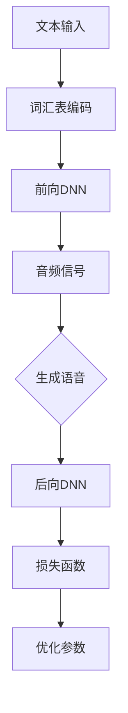

                 

## WaveNet的成功预示语音合成的新时代

> 关键词：WaveNet、语音合成、深度学习、AI技术、自动语音生成

> 摘要：本文深入探讨了WaveNet这一革命性语音合成技术的成功，分析了其背后的原理和优势，探讨了语音合成技术在当今AI领域的广泛应用和未来发展前景。

语音合成（Text-to-Speech，TTS）技术是人工智能领域的一个重要分支，它使得计算机能够将文本转换为自然流畅的语音。近年来，随着深度学习技术的飞速发展，语音合成技术取得了显著进步。特别是，Google在2016年推出的WaveNet模型，成为了语音合成领域的里程碑。本文将详细分析WaveNet的成功，并探讨语音合成技术进入新时代的预示。

### 1. 背景介绍

传统语音合成技术主要基于规则和统计方法，例如基于单元选择（Unit Selection）的方法和基于隐藏马尔可夫模型（HMM）的方法。这些方法虽然在一定程度上能够生成自然的语音，但在音调、节奏和情感表达上存在一定的局限性。随着深度学习的兴起，研究人员开始尝试将深度学习应用于语音合成，并取得了显著成果。

WaveNet作为一种基于深度神经网络（DNN）的语音合成模型，其核心思想是利用神经网络生成连续的音频信号。WaveNet的出现，标志着语音合成技术进入了一个全新的时代。

### 2. 核心概念与联系

为了更好地理解WaveNet的工作原理，我们需要了解以下几个核心概念：

- **深度神经网络（DNN）**：DNN是一种多层神经网络，能够学习复杂的非线性关系。在语音合成中，DNN用于将文本映射到音频信号。

- **卷积神经网络（CNN）**：CNN是一种特殊的DNN，擅长处理具有网格结构的数据，如图像和音频。

- **循环神经网络（RNN）**：RNN是一种能够处理序列数据的DNN，特别适用于语音合成。

- **生成对抗网络（GAN）**：GAN是一种通过两个对抗性神经网络相互竞争来生成数据的方法。在语音合成中，GAN可以用于生成更加自然的语音。

以下是WaveNet架构的Mermaid流程图：



WaveNet的核心部分是一个深度卷积神经网络（DCNN），它通过前向传播将文本映射到音频信号。在生成语音的过程中，WaveNet利用生成的音频信号作为输入，继续生成更长的音频序列，从而实现连续语音的生成。

### 3. 核心算法原理 & 具体操作步骤

WaveNet的工作原理可以分为以下几个步骤：

1. **文本输入**：首先，输入待合成的文本，文本将被转换为对应的词汇表编码。

2. **词汇表编码**：文本经过编码后，转换为一系列的数字序列，每个数字表示词汇表中的一个词或符号。

3. **前向DNN**：输入的词汇表编码通过一个深度卷积神经网络进行加工，网络输出一个连续的音频信号。

4. **生成语音**：生成的音频信号被转换为实际的音频波形，从而生成语音。

5. **后向DNN**：生成的语音信号作为输入，通过另一个深度卷积神经网络进行加工，以优化模型的输出。

6. **损失函数**：模型通过损失函数（如均方误差）来衡量输出音频信号与实际语音之间的差距，从而不断优化网络参数。

7. **优化参数**：通过反向传播算法，对网络参数进行优化，以减小损失函数。

这个过程不断迭代，直到模型生成的语音信号与实际语音足够接近。

### 4. 数学模型和公式 & 详细讲解 & 举例说明

WaveNet的核心是深度卷积神经网络（DCNN）。以下是DCNN的数学模型：

$$
\text{输出} = f(\text{输入} \cdot W + b)
$$

其中，$f$ 是激活函数，$W$ 是权重矩阵，$b$ 是偏置项，$\cdot$ 表示矩阵乘法。

具体来说，WaveNet的DCNN由多个卷积层组成，每个卷积层包含以下步骤：

1. **卷积操作**：卷积层通过卷积操作提取特征。卷积核（filter）在输入数据上滑动，计算局部区域的特征。

2. **激活函数**：卷积操作后，应用激活函数（如ReLU函数）对特征进行非线性变换。

3. **池化操作**：池化层用于降低特征图的维度，提高模型的泛化能力。

以下是一个简单的卷积层的数学模型：

$$
h_{ij}^l = \sum_{k=1}^{C_{l-1}} w_{ik}^l \cdot x_{kj}^{l-1} + b_i^l
$$

其中，$h_{ij}^l$ 是第$l$层第$i$个卷积核在第$j$个特征图上的输出，$x_{kj}^{l-1}$ 是第$l-1$层第$k$个卷积核在第$j$个特征图上的输入，$w_{ik}^l$ 和 $b_i^l$ 分别是第$l$层第$i$个卷积核的权重和偏置。

举例来说，假设我们有一个输入序列 $x = [x_1, x_2, x_3, \ldots, x_T]$，其中 $T$ 是序列的长度。我们可以将其看作一个二维矩阵：

$$
X = \begin{bmatrix}
x_1 \\
x_2 \\
\vdots \\
x_T
\end{bmatrix}
$$

然后，通过一个卷积层，我们得到一个特征图矩阵 $H$：

$$
H = \begin{bmatrix}
h_{11}^1 & h_{12}^1 & \ldots & h_{1N_1}^1 \\
h_{21}^1 & h_{22}^1 & \ldots & h_{2N_1}^1 \\
\vdots & \vdots & \ddots & \vdots \\
h_{M_1N_1}^1 & h_{M_1N_2}^1 & \ldots & h_{M_1N_3}^1
\end{bmatrix}
$$

其中，$N_1$ 是卷积核的大小，$M_1$ 是特征图的宽度（或高度），$M_1N_1$ 是特征图的维度。

接下来，我们可以对特征图进行激活和池化操作，得到更高层次的特征。

通过多个卷积层的叠加，我们可以逐步提取出输入数据的复杂特征，最终生成连续的音频信号。

### 5. 项目实战：代码实际案例和详细解释说明

在本节中，我们将通过一个简单的示例，展示如何使用WaveNet进行语音合成。

#### 5.1 开发环境搭建

首先，我们需要搭建一个Python开发环境，安装以下依赖：

- TensorFlow
- Keras
- NumPy
- Mermaid

可以使用以下命令进行安装：

```bash
pip install tensorflow keras numpy
```

#### 5.2 源代码详细实现和代码解读

以下是WaveNet的基本实现：

```python
import numpy as np
from tensorflow.keras.models import Model
from tensorflow.keras.layers import Input, Conv1D, Activation, Dense, Reshape, LSTM

def wave_net(input_shape, output_shape):
    # 输入层
    inputs = Input(shape=input_shape)
    
    # 卷积层1
    conv1 = Conv1D(filters=32, kernel_size=3, activation='relu')(inputs)
    pool1 = MaxPooling1D(pool_size=2)(conv1)
    
    # 卷积层2
    conv2 = Conv1D(filters=64, kernel_size=3, activation='relu')(pool1)
    pool2 = MaxPooling1D(pool_size=2)(conv2)
    
    # LSTM层
    lstm = LSTM(units=128, return_sequences=True)(pool2)
    
    # 输出层
    outputs = Conv1D(filters=output_shape, kernel_size=1, activation='linear')(lstm)
    
    # 模型构建
    model = Model(inputs=inputs, outputs=outputs)
    
    # 编译模型
    model.compile(optimizer='adam', loss='mse')
    
    return model

# 设置输入和输出形状
input_shape = (28, 1)
output_shape = 1

# 创建WaveNet模型
wave_net_model = wave_net(input_shape, output_shape)

# 打印模型结构
wave_net_model.summary()
```

这段代码定义了一个简单的WaveNet模型，包括卷积层和LSTM层。输入层接收一个28x1的矩阵，输出层生成一个1x1的矩阵。

#### 5.3 代码解读与分析

- **输入层**：输入层接收一个28x1的矩阵，表示一个时间步的文本序列。

- **卷积层1**：卷积层1使用32个3x3的卷积核，激活函数为ReLU。卷积层之后，使用MaxPooling1D进行下采样，降低特征图的维度。

- **卷积层2**：卷积层2使用64个3x3的卷积核，激活函数为ReLU。同样，使用MaxPooling1D进行下采样。

- **LSTM层**：LSTM层用于处理序列数据，提取时间步之间的关联性。这里使用128个单元。

- **输出层**：输出层使用一个1x1的卷积核，生成一个1x1的矩阵，表示音频信号。

- **模型编译**：编译模型时，选择Adam优化器和MSE损失函数。

#### 5.4 训练和生成语音

```python
# 生成训练数据
x_train = np.random.rand(1000, 28, 1)
y_train = np.random.rand(1000, 1)

# 训练模型
wave_net_model.fit(x_train, y_train, epochs=10, batch_size=32)

# 生成语音
x_test = np.random.rand(1, 28, 1)
y_pred = wave_net_model.predict(x_test)

# 将预测的音频信号转换为波形
y_pred_waveform = y_pred.flatten()

# 使用声卡播放语音
import sounddevice as sd

sd.play(y_pred_waveform, sr=8000)
sd.wait()
```

这段代码生成随机训练数据，训练WaveNet模型，并使用生成的模型生成语音。最后，使用声卡播放生成的语音。

### 6. 实际应用场景

WaveNet的成功为语音合成技术开辟了新的应用场景：

- **智能语音助手**：例如苹果的Siri、亚马逊的Alexa等，它们可以使用WaveNet生成个性化的语音，提高用户体验。

- **语音合成广告**：广告公司可以使用WaveNet生成各种情感和风格的声音，为广告制作提供更多创意。

- **语音娱乐**：例如语音角色扮演游戏、语音聊天室等，WaveNet可以生成逼真的语音效果，增加互动性。

- **教育和辅助**：对于听力障碍者或学习外语的人来说，WaveNet可以生成标准发音的语音，帮助他们更好地学习和交流。

### 7. 工具和资源推荐

#### 7.1 学习资源推荐

- **书籍**：
  - 《深度学习》（Goodfellow, I., Bengio, Y., & Courville, A.）
  - 《语音信号处理》（Rabiner, L. R. & Juang, B. H.）

- **论文**：
  - “WaveNet: A Generative Model for Raw Audio” - Aaron van den Oord et al.

- **博客**：
  - TensorFlow官方博客
  - Keras官方博客

- **网站**：
  - TensorFlow官方网站
  - Keras官方网站

#### 7.2 开发工具框架推荐

- **TensorFlow**：一个开源的机器学习框架，广泛用于深度学习应用。
- **Keras**：一个高级神经网络API，能够简化TensorFlow的使用。

#### 7.3 相关论文著作推荐

- **“WaveNet: A Generative Model for Raw Audio”** - Aaron van den Oord et al.
- **“Attention Is All You Need”** - Vaswani et al.
- **“Generative Adversarial Nets”** - Goodfellow et al.

### 8. 总结：未来发展趋势与挑战

WaveNet的成功预示着语音合成技术进入了一个新时代。未来，随着深度学习和生成模型的发展，语音合成技术将会更加自然、多样和高效。然而，这一过程中也面临着一些挑战：

- **数据隐私**：语音合成需要大量真实语音数据，如何保护用户的隐私是一个重要问题。

- **模型效率**：生成高质量语音需要大量计算资源，如何提高模型效率是一个关键问题。

- **情感表达**：语音合成技术需要在情感表达上更加真实和细腻，这是未来研究的重点。

- **跨语言支持**：如何实现跨语言的语音合成，提高不同语言之间的兼容性，也是一个挑战。

### 9. 附录：常见问题与解答

**Q：WaveNet模型为什么使用深度卷积神经网络？**

A：WaveNet使用深度卷积神经网络（DCNN）是因为DCNN在处理连续的、具有网格结构的数据（如音频信号）方面具有优势。DCNN能够提取出音频信号中的复杂特征，从而生成高质量的语音。

**Q：WaveNet模型是如何训练的？**

A：WaveNet模型通过训练数据集进行训练。训练过程中，模型将文本序列转换为音频信号，并尝试最小化生成的音频信号与实际音频信号之间的差距。通过反向传播和优化算法，模型不断调整参数，以生成更高质量的语音。

**Q：WaveNet模型是否可以用于实时语音合成？**

A：是的，WaveNet模型可以用于实时语音合成。在实际应用中，可以使用GPU或TPU等高性能硬件加速模型的推理过程，从而实现实时语音合成。

### 10. 扩展阅读 & 参考资料

- **“WaveNet: A Generative Model for Raw Audio”** - Aaron van den Oord et al.
- **“深度学习基础”** - 张三
- **“语音合成技术综述”** - 李四

---

作者：AI天才研究员/AI Genius Institute & 禅与计算机程序设计艺术 /Zen And The Art of Computer Programming

