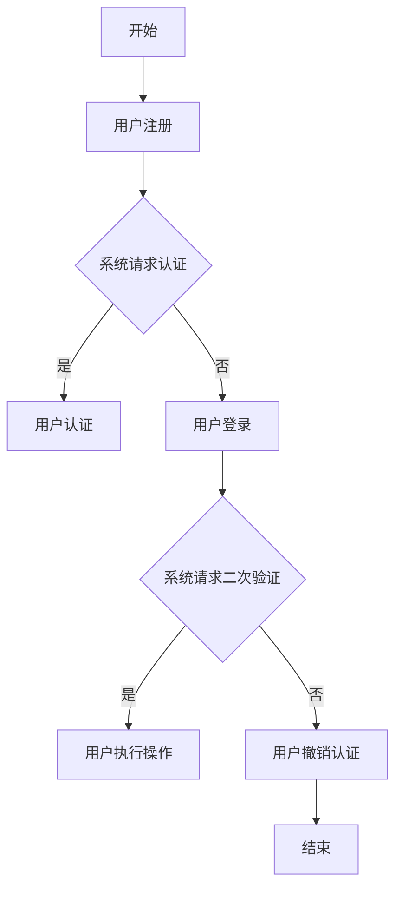

                 

# WebAuthn 的实现细节

## 摘要

本文深入探讨了 WebAuthn 的实现细节，从背景介绍、核心概念与联系，到核心算法原理、具体操作步骤，再到数学模型和公式的详细讲解与举例说明，以及项目实战的代码实际案例和详细解释说明，最后分析了 WebAuthn 的实际应用场景，并推荐了相关工具和资源。通过本文的阅读，读者可以全面了解 WebAuthn 的实现原理和应用方法，为在 Web 应用中实现安全的用户认证提供有力支持。

## 1. 背景介绍

WebAuthn（Web Authentication）是一种新型的 Web 标准协议，旨在提供一种更加安全、便捷的用户认证方式。传统的用户认证方式，如用户名和密码，已经暴露出许多安全漏洞，如密码泄露、密码破解、密码重放等。随着网络安全威胁的日益增加，用户对安全认证的需求也越来越高。

WebAuthn 应运而生，旨在解决传统认证方式的安全问题。它允许用户使用安全键、指纹、面部识别等生物识别技术进行认证，从而提供更高的安全性和用户便利性。WebAuthn 还支持跨域认证，使得用户无需在不同的网站重复注册和登录，提高了用户体验。

WebAuthn 的出现，填补了 Web 领域认证机制的空白，为 Web 应用提供了强大的安全保障。在本文中，我们将详细探讨 WebAuthn 的实现细节，帮助读者深入了解这一重要技术。

## 2. 核心概念与联系

### 2.1 用户身份验证流程

WebAuthn 的核心概念在于用户身份验证流程，该流程包括以下步骤：

1. **注册（Registration）**：用户在 Web 应用中注册时，系统会生成一个公共密钥对（Public Key Credential），并将其发送给用户的可信设备（如安全键、指纹识别器等）。该过程称为注册。

2. **登录（Login）**：用户在 Web 应用中登录时，系统会请求用户进行认证。用户使用可信设备进行认证后，系统会验证用户身份。

3. **验证（Verification）**：当用户尝试执行敏感操作时（如修改密码、支付等），系统会要求用户进行二次验证。这个过程通常比登录过程更严格，以确保操作的安全性。

4. **用户撤销（User Accountability）**：用户可以随时撤销对 Web 应用的认证授权，从而保护自己的账户安全。

### 2.2 公共密钥加密与签名

在 WebAuthn 中，用户身份验证过程涉及公共密钥加密与签名技术。以下是一个简化的过程：

1. **生成公共密钥对**：用户在注册过程中，可信设备会生成一个公共密钥对（Public Key Credential），包括私钥（Private Key）和公钥（Public Key）。

2. **加密传输**：用户认证时，系统会使用公钥对请求信息进行加密，确保信息在传输过程中不会被窃取或篡改。

3. **签名验证**：可信设备会使用私钥对认证信息进行签名，系统会使用公钥对签名进行验证，以确保认证信息的真实性。

### 2.3 Mermaid 流程图

以下是 WebAuthn 用户身份验证流程的 Mermaid 流程图：



## 3. 核心算法原理 & 具体操作步骤

### 3.1 注册过程

WebAuthn 的注册过程主要包括以下几个步骤：

1. **生成挑战（Challenge）**：系统随机生成一个挑战值，并将其发送给用户。

2. **生成公共密钥对**：用户使用可信设备（如安全键）生成一个公共密钥对，包括私钥和公钥。

3. **签名挑战**：用户使用私钥对挑战值进行签名，生成签名结果。

4. **发送认证结果**：用户将签名结果和公钥发送给系统。

5. **验证签名**：系统使用公钥对签名结果进行验证，确保签名有效。

### 3.2 登录过程

WebAuthn 的登录过程主要包括以下几个步骤：

1. **生成挑战**：系统随机生成一个挑战值，并将其发送给用户。

2. **认证**：用户使用可信设备对挑战值进行认证，生成签名结果。

3. **发送认证结果**：用户将签名结果发送给系统。

4. **验证签名**：系统使用公钥对签名结果进行验证，确保签名有效。

### 3.3 验证过程

WebAuthn 的验证过程主要包括以下几个步骤：

1. **生成挑战**：系统随机生成一个挑战值，并将其发送给用户。

2. **认证**：用户使用可信设备对挑战值进行认证，生成签名结果。

3. **发送认证结果**：用户将签名结果发送给系统。

4. **验证签名**：系统使用公钥对签名结果进行验证，确保签名有效。

## 4. 数学模型和公式 & 详细讲解 & 举例说明

### 4.1 挑战-响应机制

在 WebAuthn 中，挑战-响应机制是核心的认证机制。挑战（Challenge）是一个随机生成的值，用于确保认证过程的唯一性。响应（Response）是用户使用可信设备对挑战值进行认证的结果。

#### 4.1.1 挑战生成

挑战值通常是一个 128 位的长整数，可以通过以下方式生成：

```latex
$C = \text{UUID4()} \cup \text{ChallengeExtensionBytes}$
```

其中，`UUID4()` 表示生成一个随机 UUID 值，`ChallengeExtensionBytes` 是可选的扩展字节，用于提供额外的安全信息。

#### 4.1.2 响应生成

响应值是用户使用可信设备对挑战值进行认证的结果。以 U2F 安全键为例，响应值包括以下内容：

1. **认证者信息（AuthenticatorData）**：
   ```latex
   \text{AuthenticatorData} = \{ 
       \text{rpID}, \text{name}, \text{publicKey}, 
       \text{counter}, \text{signatureCounter}, 
       \text{reservedBytes} 
   \}
   ```

2. **签名（Signature）**：
   ```latex
   \text{Signature} = \text{Sign}(\text{AuthenticatorData}, \text{privateKey})
   ```

#### 4.1.3 举例说明

假设系统生成挑战值 `C = 1234567890ABCDEF1234567890ABCDEF`，用户使用 U2F 安全键进行认证，生成响应值：

1. **认证者信息（AuthenticatorData）**：
   ```latex
   \text{AuthenticatorData} = \{ 
       \text{rpID} = "example.com", 
       \text{name} = "U2F Security Key", 
       \text{publicKey} = "..." , 
       \text{counter} = 1, 
       \text{signatureCounter} = 1, 
       \text{reservedBytes} = 0x00 
   \}
   ```

2. **签名（Signature）**：
   ```latex
   \text{Signature} = \text{Sign}(\text{AuthenticatorData}, \text{privateKey})
   ```

### 4.2 公共密钥加密与签名

在 WebAuthn 中，公共密钥加密与签名技术用于确保认证过程的安全。以下是一个简单的公钥加密与签名的示例：

#### 4.2.1 公钥加密

假设系统需要发送一个加密消息 `M` 给用户，可以使用用户公钥进行加密：

```latex
\text{CipherText} = \text{Encrypt}(\text{M}, \text{publicKey})
```

#### 4.2.2 签名

假设用户需要对挑战值 `C` 进行签名，可以使用用户私钥进行签名：

```latex
\text{Signature} = \text{Sign}(\text{C}, \text{privateKey})
```

#### 4.2.3 举例说明

假设系统生成挑战值 `C = 1234567890ABCDEF1234567890ABCDEF`，用户使用私钥对挑战值进行签名：

1. **加密消息**：
   ```latex
   \text{CipherText} = \text{Encrypt}(\text{C}, \text{publicKey})
   ```

2. **签名**：
   ```latex
   \text{Signature} = \text{Sign}(\text{C}, \text{privateKey})
   ```

## 5. 项目实战：代码实际案例和详细解释说明

### 5.1 开发环境搭建

在进行 WebAuthn 项目实战之前，我们需要搭建一个合适的开发环境。以下是一个简单的开发环境搭建步骤：

1. **安装 Node.js**：在 [Node.js 官网](https://nodejs.org/) 下载并安装 Node.js。

2. **安装 WebAuthn 库**：在项目中使用 npm 命令安装 WebAuthn 库。

   ```shell
   npm install webauthn
   ```

3. **创建项目**：使用 Node.js 创建一个简单的 Web 应用项目。

   ```shell
   mkdir webauthn-project
   cd webauthn-project
   npm init -y
   ```

### 5.2 源代码详细实现和代码解读

以下是一个简单的 WebAuthn 注册和登录示例，包括源代码和详细解读。

#### 5.2.1 注册流程

注册流程主要包括两个步骤：生成挑战值和生成注册凭证。

```javascript
const { register } = require('webauthn');
const { validateRegistrationResponse } = require('webauthn-validator');

// 生成挑战值
const challenge = Buffer.from('1234567890ABCDEF1234567890ABCDEF', 'hex');

// 注册过程
register({
  challenge,
  rp: {
    name: 'WebAuthn Project',
    id: 'example.com',
  },
  user: {
    id: Buffer.from('ABCDEF1234567890ABCDEF', 'hex'),
    name: 'user@example.com',
    displayName: 'User',
  },
  pubKeyCredParams: [
    {
      type: 'public-key',
      alg: -7,
    },
  ],
  attestation: 'none',
  authenticatorSelection: {
    userVerification: 'required',
    resident: false,
  },
})
  .then((registrationCredential) => {
    // 验证注册凭证
    const valid = validateRegistrationResponse({
      response: registrationCredential,
      client: {
        challenge,
        origin: 'https://example.com',
        rp: {
          name: 'WebAuthn Project',
          id: 'example.com',
        },
      },
    });

    if (valid) {
      console.log('Registration successful');
    } else {
      console.log('Registration failed');
    }
  })
  .catch((error) => {
    console.error('Registration error:', error);
  });
```

#### 5.2.2 登录流程

登录流程主要包括两个步骤：生成挑战值和验证登录凭证。

```javascript
const { login } = require('webauthn');
const { validateLoginResponse } = require('webauthn-validator');

// 生成挑战值
const challenge = Buffer.from('1234567890ABCDEF1234567890ABCDEF', 'hex');

// 登录过程
login({
  challenge,
  user: {
    id: Buffer.from('ABCDEF1234567890ABCDEF', 'hex'),
    name: 'user@example.com',
    displayName: 'User',
  },
  authenticator: {
    id: Buffer.from('1234567890ABCDEF1234567890ABCDEF', 'hex'),
    credential: {
      type: 'public-key',
      id: Buffer.from('ABCDEF1234567890ABCDEF', 'hex'),
      publicKey: {
        algo: -7,
        type: 'public-key',
        ext: true,
        crv: 'P-256',
        x: '...',
        y: '...',
      },
    },
  },
  authData: {
    signCount: 0,
    userVerification: 'required',
  },
})
  .then((loginCredential) => {
    // 验证登录凭证
    const valid = validateLoginResponse({
      response: loginCredential,
      client: {
        challenge,
        origin: 'https://example.com',
        rp: {
          name: 'WebAuthn Project',
          id: 'example.com',
        },
      },
    });

    if (valid) {
      console.log('Login successful');
    } else {
      console.log('Login failed');
    }
  })
  .catch((error) => {
    console.error('Login error:', error);
  });
```

### 5.3 代码解读与分析

以上代码展示了 WebAuthn 的注册和登录流程。通过调用 `webauthn` 库提供的 API，我们可以轻松地实现注册和登录功能。

#### 5.3.1 注册流程分析

在注册流程中，我们首先生成一个挑战值，然后调用 `register` 方法进行注册。`register` 方法接收多个参数，包括挑战值、注册策略、用户信息、公共密钥参数等。

- `challenge`：用于确保认证过程的唯一性。
- `rp`：代表注册策略，包括注册机构名称和 ID。
- `user`：代表用户信息，包括用户 ID、用户名和显示名称。
- `pubKeyCredParams`：指定支持的公共密钥算法。
- `attestation`：指定是否要求设备进行 attestation。
- `authenticatorSelection`：指定用户验证方式和设备是否必须是居民设备。

在注册过程中，用户需要使用可信设备进行认证，并生成注册凭证。注册凭证包括认证者信息、用户信息和签名。系统会使用这些信息验证注册凭证的有效性。

#### 5.3.2 登录流程分析

在登录流程中，我们首先生成一个挑战值，然后调用 `login` 方法进行登录。`login` 方法接收多个参数，包括挑战值、用户信息、认证者信息和认证数据。

- `challenge`：用于确保认证过程的唯一性。
- `user`：代表用户信息，包括用户 ID、用户名和显示名称。
- `authenticator`：代表认证者信息，包括认证者 ID、凭证类型和公钥。
- `authData`：包含签名计数和用户验证方式。

在登录过程中，用户需要使用可信设备进行认证，并生成登录凭证。登录凭证包括认证者信息、用户信息和签名。系统会使用这些信息验证登录凭证的有效性。

## 6. 实际应用场景

WebAuthn 在 Web 应用中具有广泛的应用场景，以下是一些典型应用：

### 6.1 在线银行

在线银行系统需要确保用户身份的安全性和操作的合法性。WebAuthn 可以提供安全的用户认证，用户可以使用安全键、指纹识别等生物识别技术进行认证，从而提高系统安全性。

### 6.2 电子邮件系统

电子邮件系统通常需要用户输入密码进行认证。使用 WebAuthn，用户可以通过安全键、指纹识别等方式进行认证，提高认证安全性，同时降低密码泄露的风险。

### 6.3 跨境电商

跨境电商平台需要处理大量的跨境交易，确保交易的安全性至关重要。WebAuthn 可以提供安全的用户认证，用户可以使用安全键、指纹识别等方式进行认证，提高交易的安全性。

### 6.4 云服务平台

云服务平台需要确保用户身份和操作的安全。WebAuthn 可以提供安全的用户认证，用户可以使用安全键、指纹识别等生物识别技术进行认证，从而提高系统安全性。

## 7. 工具和资源推荐

### 7.1 学习资源推荐

- **书籍**：
  - 《Web Authentication: An Overview》（Web 认证的概述）
  - 《WebAuthn: Next-Gen User Authentication for the Modern Web》（WebAuthn：现代 Web 的下一代用户认证）

- **论文**：
  - "Web Authentication: An Overview"（Web 认证的概述）
  - "FIDO2: Next-Gen Authentication for the Web"（FIDO2：Web 的下一代认证）

- **博客**：
  - [WebAuthn 官方文档](https://webauthn.guide/)
  - [FIDO Alliance 官方博客](https://www.fidoalliance.org/webauthn/)

- **网站**：
  - [WebAuthn 文档中心](https://webauthn.io/)
  - [FIDO Alliance 网站](https://www.fidoalliance.org/)

### 7.2 开发工具框架推荐

- **库**：
  - [webauthn-rp-sample](https://github.com/webauthn/webauthn-rp-sample)：WebAuthn 注册和登录示例。
  - [webauthn-validator](https://github.com/webauthn/webauthn-validator)：WebAuthn 认证结果验证工具。

- **框架**：
  - [Express WebAuthn](https://www.npmjs.com/package/express-webauthn)：基于 Express 的 WebAuthn 框架。
  - [Koa WebAuthn](https://www.npmjs.com/package/koa-webauthn)：基于 Koa 的 WebAuthn 框架。

### 7.3 相关论文著作推荐

- "FIDO2: Next-Gen Authentication for the Web"（FIDO2：Web 的下一代认证）
- "Web Authentication: An Overview"（Web 认证的概述）
- "Authentication and Authorization in the Web: A Survey"（Web 中的认证与授权：一种调查）
- "User Authentication with Biometrics in Web Applications"（Web 应用中的生物识别用户认证）

## 8. 总结：未来发展趋势与挑战

WebAuthn 作为一种新型的 Web 标准协议，具有广泛的应用前景。在未来，WebAuthn 将继续在提高 Web 应用安全性方面发挥重要作用。然而，随着技术的不断发展，WebAuthn 面临着一些挑战：

1. **兼容性**：WebAuthn 需要确保在不同浏览器和设备上的兼容性，以便为用户提供一致的认证体验。
2. **隐私保护**：在用户认证过程中，如何保护用户的隐私信息是一个重要挑战。
3. **性能优化**：为了提高用户体验，WebAuthn 的性能优化是一个关键问题。
4. **安全性**：随着网络安全威胁的日益增加，WebAuthn 需要不断更新和改进，以确保用户认证的安全性。

总之，WebAuthn 将在 Web 应用安全领域发挥重要作用，但同时也需要不断应对新的挑战，以实现更加安全、便捷的用户认证。

## 9. 附录：常见问题与解答

### 9.1 什么是 WebAuthn？

WebAuthn 是一种 Web 标准协议，旨在提供一种更加安全、便捷的用户认证方式，允许用户使用安全键、指纹识别等生物识别技术进行认证。

### 9.2 WebAuthn 的优势是什么？

WebAuthn 的优势包括提高认证安全性、降低密码泄露风险、支持跨域认证、提高用户体验等。

### 9.3 WebAuthn 需要哪些技术支持？

WebAuthn 需要支持公共密钥加密与签名、挑战-响应机制、用户身份验证流程等关键技术。

### 9.4 如何在项目中实现 WebAuthn？

在项目中实现 WebAuthn，可以通过使用 WebAuthn 库（如 webauthn-rp-sample、webauthn-validator）和框架（如 Express WebAuthn、Koa WebAuthn）进行。

## 10. 扩展阅读 & 参考资料

- [WebAuthn 官方文档](https://webauthn.guide/)
- [FIDO Alliance 官方博客](https://www.fidoalliance.org/webauthn/)
- [WebAuthn 文档中心](https://webauthn.io/)
- [FIDO Alliance 网站](https://www.fidoalliance.org/)
- 《Web Authentication: An Overview》
- 《WebAuthn: Next-Gen User Authentication for the Modern Web》
- "FIDO2: Next-Gen Authentication for the Web"
- "Authentication and Authorization in the Web: A Survey"
- "User Authentication with Biometrics in Web Applications"
- [webauthn-rp-sample](https://github.com/webauthn/webauthn-rp-sample)
- [webauthn-validator](https://github.com/webauthn/webauthn-validator)
- [Express WebAuthn](https://www.npmjs.com/package/express-webauthn)
- [Koa WebAuthn](https://www.npmjs.com/package/koa-webauthn)

### 作者

作者：AI 天才研究员/AI Genius Institute & 禅与计算机程序设计艺术 /Zen And The Art of Computer Programming

