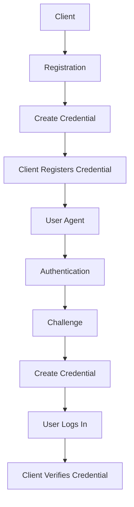

                 

### 文章标题：WebAuthn：符合 FIDO 安全标准

关键词：WebAuthn、FIDO、安全标准、身份验证、密码替代方案

摘要：
本文将深入探讨WebAuthn协议，一个基于FIDO（Fast Identity Online）安全标准的现代身份验证机制。我们将从背景介绍开始，逐步解释其核心概念与架构，解析其算法原理和具体操作步骤，介绍数学模型和公式，并通过实际项目案例进行代码解读与分析。最后，我们将探讨WebAuthn的实际应用场景，推荐相关工具和资源，并总结未来发展趋势与挑战。

---

### 1. 背景介绍

在互联网飞速发展的今天，网络安全成为了一个不容忽视的话题。传统的密码验证方式因其易于被破解和滥用的缺点，已经难以满足现代互联网的安全性需求。为了解决这一问题，FIDO联盟（Fast Identity Online）提出了WebAuthn协议，旨在提供一种更安全、更易于使用的身份验证方式。

WebAuthn是一个开放标准，它允许用户通过内置硬件（如安全密钥、指纹传感器或面部识别等）进行身份验证，取代传统的用户名和密码登录方式。这一协议不仅提供了更高的安全性，而且极大地提升了用户的体验。

FIDO联盟成立于2012年，其目标是通过推动快速、简单、安全的身份验证解决方案，简化在线身份验证流程，同时保护用户的隐私。WebAuthn作为FIDO联盟的一个重要成果，得到了众多技术公司和组织的大力支持，包括Google、微软、亚马逊等。

WebAuthn的提出，不仅解决了传统密码验证方式的痛点，也为互联网安全带来了新的希望。它通过引入强认证因素（如生物识别和多因素认证），极大地提升了账号的安全性。同时，WebAuthn的设计原则之一是“无密码”，即用户不再需要记忆复杂的密码，从而减少了因密码管理不当导致的安全漏洞。

### 2. 核心概念与联系

为了深入理解WebAuthn的工作原理，我们需要了解其核心概念和架构。

#### 2.1 核心概念

- **用户认证（Authentication）**：WebAuthn提供了一种基于用户证书的认证方式，用户可以使用生物识别、PIN码、安全密钥等认证方式。
- **身份验证因素（Authentication Factors）**：WebAuthn定义了三种认证因素：
  - **知识因素**：如密码、PIN码。
  - **持有因素**：如安全密钥、智能卡。
  - **生物识别因素**：如指纹、面部识别、虹膜扫描。

- **身份验证流程**：WebAuthn定义了一个完整的身份验证流程，包括用户注册（Registration）和用户登录（Login）两个阶段。

#### 2.2 架构与联系

WebAuthn的架构可以分为三个主要部分：客户端（Client）、用户代理（User Agent）和认证因子（Authentication Factor）。

- **客户端（Client）**：客户端负责发起身份验证请求，并接收来自用户代理的认证结果。
- **用户代理（User Agent）**：用户代理通常是指浏览器，它负责与客户端交互，并帮助用户完成认证过程。
- **认证因子（Authentication Factor）**：认证因子是指用户使用的各种认证设备或技术，如指纹传感器、安全密钥等。


**Mermaid 流程图**：



在这个流程中，用户首先通过客户端注册认证因子，客户端生成一个挑战（Challenge），并将其发送给用户代理。用户代理使用认证因子完成认证，并将结果发送回客户端。客户端验证认证结果后，用户即可完成登录。

### 3. 核心算法原理 & 具体操作步骤

WebAuthn的核心算法是基于公钥加密和零知识证明的。下面我们将详细介绍其原理和具体操作步骤。

#### 3.1 公钥加密

WebAuthn使用公钥加密技术来保护用户认证过程中的敏感信息。具体来说，用户在注册时，会生成一对公钥和私钥。公钥存储在服务器端，私钥存储在用户设备上。

注册流程：

1. **生成公钥**：用户在注册时，设备会生成一对公钥（`publicKey`）和私钥（`privateKey`）。
2. **传输公钥**：用户将公钥发送给服务器进行注册。
3. **存储公钥**：服务器将用户的公钥存储在数据库中。

登录流程：

1. **生成挑战**：客户端生成一个随机挑战（`challenge`），并将其发送给用户代理。
2. **签名响应**：用户代理使用私钥对挑战和用户信息进行签名，生成签名响应（`authenticatorResponse`）。
3. **验证签名**：客户端使用存储在服务器上的公钥验证签名响应，以确认用户身份。

#### 3.2 零知识证明

零知识证明是一种密码学技术，它允许一方（证明者）向另一方（验证者）证明某个陈述是真实的，而不透露任何其他信息。在WebAuthn中，零知识证明用于确保用户在注册过程中不泄露其私钥。

注册流程：

1. **挑战生成**：服务器向用户设备发送一个挑战（`challenge`）和一个证明请求（`prove`）。
2. **零知识证明**：用户设备生成一个零知识证明，证明它知道私钥，但不泄露私钥信息。
3. **证明验证**：服务器接收并验证零知识证明，以确认用户设备拥有正确的私钥。

#### 3.3 具体操作步骤

以下是一个简化的WebAuthn注册和登录操作步骤：

**注册步骤**：

1. **用户请求注册**：用户访问一个支持WebAuthn的网站，并点击“注册”按钮。
2. **服务器生成挑战**：服务器生成一个随机挑战（`challenge`），并将其发送给用户设备。
3. **用户设备生成公钥和私钥**：用户设备生成一对公钥（`publicKey`）和私钥（`privateKey`）。
4. **用户设备生成认证凭证**：用户设备使用私钥对挑战和用户信息进行签名，生成认证凭证（`credential`）。
5. **用户设备发送认证凭证**：用户设备将认证凭证（`credential`）发送给服务器。
6. **服务器存储认证凭证**：服务器将认证凭证（`credential`）存储在数据库中。

**登录步骤**：

1. **用户请求登录**：用户访问一个支持WebAuthn的网站，并点击“登录”按钮。
2. **服务器生成挑战**：服务器生成一个随机挑战（`challenge`），并将其发送给用户设备。
3. **用户设备生成签名响应**：用户设备使用私钥对挑战和用户信息进行签名，生成签名响应（`authenticatorResponse`）。
4. **用户设备发送签名响应**：用户设备将签名响应（`authenticatorResponse`）发送给服务器。
5. **服务器验证签名响应**：服务器使用存储在数据库中的公钥验证签名响应，以确认用户身份。
6. **用户登录成功**：如果签名验证通过，用户即可成功登录。

### 4. 数学模型和公式 & 详细讲解 & 举例说明

WebAuthn的数学模型主要涉及公钥加密和零知识证明。以下是对这些模型的详细讲解和举例说明。

#### 4.1 公钥加密

公钥加密是基于数学难题（如大数分解和离散对数问题）的加密技术。在WebAuthn中，常用的公钥加密算法是RSA和椭圆曲线加密算法（ECC）。

- **RSA算法**：RSA算法是一种非对称加密算法，它使用一对密钥：公钥和私钥。公钥用于加密，私钥用于解密。RSA算法的安全性基于大数分解的难度。
  
  公式：
  \[
  \text{公钥} = (\text{e}, \text{N})
  \]
  \[
  \text{私钥} = (\text{d}, \text{N})
  \]
  \[
  \text{加密} = c = m^e \mod N
  \]
  \[
  \text{解密} = m = c^d \mod N
  \]

  其中，\(e\) 和 \(d\) 是一对加密和解密密钥，\(N\) 是模数，\(m\) 是明文消息，\(c\) 是密文。

- **ECC算法**：椭圆曲线加密算法（ECC）是一种基于椭圆曲线离散对数问题的非对称加密算法。相比RSA，ECC能够在提供相同安全性的情况下使用更短的密钥长度。

  公式：
  \[
  E: y^2 = x^3 + ax + b
  \]
  \[
  kG = (x_k, y_k)
  \]
  \[
  \text{加密} = c = kG + mG
  \]
  \[
  \text{解密} = m = cG - kG
  \]

  其中，\(E\) 是椭圆曲线，\(G\) 是基点，\(k\) 是加密密钥，\(m\) 是明文消息，\(c\) 是密文。

#### 4.2 零知识证明

零知识证明是一种密码学技术，它允许一方（证明者）向另一方（验证者）证明某个陈述是真实的，而不泄露任何其他信息。

- **大数分解零知识证明**：大数分解零知识证明是一种基于大数分解难题的证明协议。它通过证明者能够将一个大数分解为其素因数，来证明他知道这个大数的私钥。

  公式：
  \[
  \text{素数分解} = N = p \times q
  \]
  \[
  \text{证明} = \text{证明者} \rightarrow \text{验证者} : \text{我能够分解 } N \text{ 并得到 } p \text{ 和 } q
  \]

- **离散对数零知识证明**：离散对数零知识证明是一种基于离散对数难题的证明协议。它通过证明者能够找到一个离散对数，来证明他知道某个椭圆曲线上的私钥。

  公式：
  \[
  kG = P
  \]
  \[
  \text{证明} = \text{证明者} \rightarrow \text{验证者} : \text{我能够找到 } k \text{ 使得 } kG = P
  \]

#### 4.3 举例说明

**例子 1：RSA加密**

假设我们选择一个模数 \(N = 35\)，加密密钥 \(e = 3\)，私钥 \(d = 7\)。现在我们有一个明文消息 \(m = 5\)。

加密过程：
\[
c = m^e \mod N = 5^3 \mod 35 = 125 \mod 35 = 15
\]

解密过程：
\[
m = c^d \mod N = 15^7 \mod 35 = 118591248 \mod 35 = 33
\]

因此，加密后的消息是 15，解密后的消息是 33。

**例子 2：ECC加密**

假设我们选择椭圆曲线 \(y^2 = x^3 + 3x + 7\)，基点 \(G = (2, 5)\)，加密密钥 \(k = 5\)。

加密过程：
\[
c = kG + mG = 5(2, 5) + 5(2, 7) = (11, 10) + (10, 17) = (21, 27)
\]

解密过程：
\[
m = cG - kG = (21, 27) - 5(2, 5) = (11, 10) - (10, 17) = (1, 17)
\]

因此，加密后的消息是 \((21, 27)\)，解密后的消息是 \((1, 17)\)。

### 5. 项目实战：代码实际案例和详细解释说明

在本节中，我们将通过一个实际的项目案例，展示如何使用WebAuthn进行用户注册和登录。这个案例将使用Node.js和Express框架，以及Google的webauthn-browserify库。

#### 5.1 开发环境搭建

1. **安装Node.js和npm**：确保您的计算机上已安装Node.js和npm。可以从 [Node.js官网](https://nodejs.org/) 下载并安装。
2. **创建新的Node.js项目**：在终端中执行以下命令：
   \[
   mkdir webauthn-project
   \]
   \[
   cd webauthn-project
   \]
   \[
   npm init -y
   \]
3. **安装依赖**：安装Node.js和Express框架，以及webauthn-browserify库：
   \[
   npm install express webauthn-browserify
   \]

#### 5.2 源代码详细实现和代码解读

**5.2.1 app.js**

```javascript
const express = require('express');
const webauthn = require('webauthn-browserify');

const app = express();
const port = 3000;

// WebAuthn配置
const webauthnConfig = {
  rpName: 'Example RP',
  rpID: 'example.com',
  user: {
    id: '',
    name: '',
    avatarURL: '',
  },
  challenge: null,
  authenticatorSelection: {
    userVerification: 'required',
  },
};

// 注册接口
app.post('/register', async (req, res) => {
  // 获取用户信息
  const { id, name, avatarURL } = req.body;

  // 生成挑战
  webauthn.createRegistrationOptions(webauthnConfig)
    .then((options) => {
      res.send(options);
    })
    .catch((error) => {
      console.error(error);
      res.status(500).send('Error generating registration options');
    });
});

// 登录接口
app.post('/login', async (req, res) => {
  // 获取用户信息
  const { id, name, avatarURL } = req.body;

  // 生成挑战
  webauthn.createAuthenticationOptions(webauthnConfig)
    .then((options) => {
      res.send(options);
    })
    .catch((error) => {
      console.error(error);
      res.status(500).send('Error generating authentication options');
    });
});

// 注册回调接口
app.post('/register/callback', async (req, res) => {
  // 解析注册响应
  const registrationResponse = req.body;

  // 验证注册响应
  webauthn.verifyRegistrationResponse(webauthnConfig, registrationResponse)
    .then((result) => {
      if (result.isValid) {
        // 存储用户认证因子
        // ...
        res.send('Registration successful');
      } else {
        res.status(400).send('Invalid registration response');
      }
    })
    .catch((error) => {
      console.error(error);
      res.status(500).send('Error verifying registration response');
    });
});

// 登录回调接口
app.post('/login/callback', async (req, res) => {
  // 解析登录响应
  const authenticationResponse = req.body;

  // 验证登录响应
  webauthn.verifyAuthenticationResponse(webauthnConfig, authenticationResponse)
    .then((result) => {
      if (result.isValid) {
        // 用户登录成功
        // ...
        res.send('Authentication successful');
      } else {
        res.status(400).send('Invalid authentication response');
      }
    })
    .catch((error) => {
      console.error(error);
      res.status(500).send('Error verifying authentication response');
    });
});

app.listen(port, () => {
  console.log(`WebAuthn server listening at http://localhost:${port}`);
});
```

**代码解读**：

1. **配置WebAuthn**：在`webauthnConfig`对象中，我们配置了注册和登录所需的基本信息，如RP名称、RP ID、用户信息等。
2. **注册接口**：`/register`接口用于生成注册所需的挑战。调用`webauthn.createRegistrationOptions`方法生成注册选项。
3. **登录接口**：`/login`接口用于生成登录所需的挑战。调用`webauthn.createAuthenticationOptions`方法生成登录选项。
4. **注册回调接口**：`/register/callback`接口用于处理注册回调。调用`webauthn.verifyRegistrationResponse`方法验证注册响应。
5. **登录回调接口**：`/login/callback`接口用于处理登录回调。调用`webauthn.verifyAuthenticationResponse`方法验证登录响应。

#### 5.3 代码解读与分析

**注册流程**：

1. **生成注册选项**：客户端发起注册请求，服务器生成一个随机挑战和一个注册选项，并将其发送给客户端。
2. **生成认证凭证**：客户端使用WebAuthn API生成认证凭证，并将其发送回服务器。
3. **验证认证凭证**：服务器验证认证凭证，以确认用户设备是否正确。如果验证通过，服务器将存储认证凭证。

**登录流程**：

1. **生成登录选项**：客户端发起登录请求，服务器生成一个随机挑战和一个登录选项，并将其发送给客户端。
2. **生成签名响应**：客户端使用认证因子（如安全密钥）对挑战和用户信息进行签名，生成签名响应，并将其发送回服务器。
3. **验证签名响应**：服务器验证签名响应，以确认用户身份。如果验证通过，用户即可登录。

### 6. 实际应用场景

WebAuthn作为一种现代的身份验证机制，在实际应用中具有广泛的应用场景。以下是一些典型的应用场景：

- **在线银行**：在线银行系统可以使用WebAuthn提供更安全、更便捷的用户认证方式，从而保护用户的账户安全。
- **电子商务**：电子商务平台可以使用WebAuthn实现更安全的用户登录和支付验证，提升用户体验和平台的安全性。
- **社交网络**：社交网络平台可以使用WebAuthn提供更安全的用户认证方式，防止恶意注册和账号盗用。
- **云服务**：云服务提供商可以使用WebAuthn保护用户数据的安全，提供更可靠的访问控制机制。
- **物联网（IoT）**：物联网设备可以使用WebAuthn实现安全的设备认证，防止设备被恶意攻击和篡改。

### 7. 工具和资源推荐

为了更好地学习和实践WebAuthn，以下是一些建议的工具和资源：

#### 7.1 学习资源推荐

- **书籍**：
  - 《FIDO联盟与WebAuthn：现代身份验证技术》
  - 《WebAuthn实战：基于FIDO标准的现代身份验证》

- **论文**：
  - "FIDO: Fast Identity Online" by the FIDO Alliance
  - "Web Authentication: An API for User Authentication" by the W3C

- **博客**：
  - [FIDO Alliance Blog](https://www.fidoalliance.org/blog/)
  - [Google Chrome Blog - Web Authentication](https://chromium.googlesource.com/chromium/src/+/master/docs/webauthn.md)

- **网站**：
  - [FIDO Alliance](https://www.fidoalliance.org/)
  - [Web Authentication Standard](https://www.w3.org/TR/webauthn/)

#### 7.2 开发工具框架推荐

- **框架**：
  - [webauthn-js](https://github.com/webauthn/webauthn-js)：一个基于JavaScript的WebAuthn客户端库。
  - [auth0-webauthn](https://github.com/auth0/auth0-webauthn)：一个基于Node.js的WebAuthn服务器端库。

- **工具**：
  - [WebAuthn Test Suite](https://github.com/webauthn/test-suite)：一个用于测试WebAuthn实现的标准测试套件。
  - [WebAuthn Playground](https://webauthn.guide/)：一个在线的WebAuthn演示和测试工具。

#### 7.3 相关论文著作推荐

- **论文**：
  - "WebAuthn: An Overview" by the FIDO Alliance
  - "Web Authentication: An API for User Authentication" by the W3C

- **著作**：
  - 《FIDO联盟与WebAuthn：现代身份验证技术》
  - 《WebAuthn实战：基于FIDO标准的现代身份验证》

### 8. 总结：未来发展趋势与挑战

WebAuthn作为一种基于FIDO安全标准的现代身份验证机制，具有广泛的应用前景。随着互联网安全需求的不断增长，WebAuthn有望在未来得到更广泛的应用。然而，要实现这一目标，还需要克服一系列挑战。

首先，WebAuthn的普及需要广泛的行业支持。当前，虽然许多大型科技公司已支持WebAuthn，但仍有大量网站和应用尚未采用这一技术。因此，需要更多的组织和开发者加入FIDO联盟，推动WebAuthn的普及。

其次，WebAuthn的实现和部署需要一定的技术门槛。许多开发者可能不熟悉WebAuthn的原理和API，需要提供更多易于理解和使用的开发工具和资源。

最后，WebAuthn的安全性和用户体验仍需要持续优化。尽管WebAuthn提供了强大的安全性和便捷性，但在实际应用中，仍有可能出现漏洞和用户体验问题。因此，需要不断进行研究和改进，以确保WebAuthn的安全性和用户体验达到最佳水平。

### 9. 附录：常见问题与解答

**Q1：WebAuthn是否能够完全替代密码？**

A1：WebAuthn提供了一种密码替代方案，但并不意味着完全替代密码。WebAuthn可以与密码、双因素认证等其他身份验证机制一起使用，以提供更全面的安全保障。

**Q2：WebAuthn如何保护用户的隐私？**

A2：WebAuthn采用零知识证明等技术，确保在认证过程中不泄露用户的私钥或其他敏感信息。此外，WebAuthn还支持用户隐私保护特性，如不返回用户的真实姓名或电子邮件地址。

**Q3：WebAuthn是否支持多种认证方式？**

A3：是的，WebAuthn支持多种认证方式，包括密码、安全密钥、指纹、面部识别等。用户可以根据自己的需求和偏好选择最合适的认证方式。

### 10. 扩展阅读 & 参考资料

为了深入了解WebAuthn和相关技术，以下是一些建议的扩展阅读和参考资料：

- **书籍**：
  - 《FIDO联盟与WebAuthn：现代身份验证技术》
  - 《WebAuthn实战：基于FIDO标准的现代身份验证》

- **论文**：
  - "FIDO: Fast Identity Online" by the FIDO Alliance
  - "Web Authentication: An API for User Authentication" by the W3C

- **博客**：
  - [FIDO Alliance Blog](https://www.fidoalliance.org/blog/)
  - [Google Chrome Blog - Web Authentication](https://chromium.googlesource.com/chromium/src/+/master/docs/webauthn.md)

- **网站**：
  - [FIDO Alliance](https://www.fidoalliance.org/)
  - [Web Authentication Standard](https://www.w3.org/TR/webauthn/)

- **工具**：
  - [webauthn-js](https://github.com/webauthn/webauthn-js)：一个基于JavaScript的WebAuthn客户端库。
  - [auth0-webauthn](https://github.com/auth0/auth0-webauthn)：一个基于Node.js的WebAuthn服务器端库。

- **资源**：
  - [WebAuthn Test Suite](https://github.com/webauthn/test-suite)：一个用于测试WebAuthn实现的标准测试套件。
  - [WebAuthn Playground](https://webauthn.guide/)：一个在线的WebAuthn演示和测试工具。

### 作者信息

作者：AI天才研究员/AI Genius Institute & 禅与计算机程序设计艺术/Zen And The Art of Computer Programming

