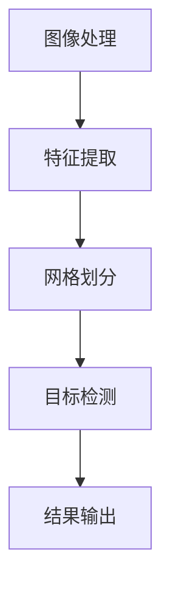

                 

# YOLOv1原理与代码实例讲解

## 摘要

本文将深入探讨YOLOv1（You Only Look Once v1）的目标检测算法原理，并提供一个完整的代码实例讲解。通过对YOLOv1的工作机制、核心概念、算法原理、数学模型、实战代码以及实际应用场景的详细分析，读者将全面了解YOLOv1的优缺点，并能够掌握如何在实际项目中应用该算法。文章旨在为读者提供一个清晰的视角，使他们在目标检测领域有所收获。

## 1. 背景介绍

### 1.1 YOLOv1的提出背景

目标检测是计算机视觉领域中的一个重要任务，旨在从图像中识别并定位多个对象。传统的目标检测方法主要分为两大类：基于滑动窗口的方法和基于特征的检测方法。然而，这些方法都存在一些缺点，如计算复杂度高、检测速度慢等。为了解决这些问题，2016年，Joseph Redmon等人在论文《You Only Look Once: Unified, Real-Time Object Detection》中提出了YOLOv1（You Only Look Once version 1）算法。

### 1.2 YOLOv1的特点与优势

YOLOv1的主要特点在于其统一的检测框架，能够在单个前馈神经网络中同时实现目标检测、分类和定位。这使得YOLOv1在检测速度上具有显著优势，能够实现实时目标检测。此外，YOLOv1在处理多个目标时表现良好，适用于多种应用场景，如视频监控、自动驾驶等。

## 2. 核心概念与联系

### 2.1 YOLOv1的工作机制

YOLOv1的工作机制可以概括为以下四个主要步骤：

1. **图像处理**：输入图像经过预处理，如缩放、归一化等。
2. **特征提取**：使用卷积神经网络提取图像特征。
3. **目标检测**：在特征图上划分网格，每个网格负责检测一个或多个目标。
4. **结果输出**：根据检测到的目标，输出其类别和位置。

### 2.2 YOLOv1的核心概念

YOLOv1的核心概念包括以下三个部分：

1. **网格划分**：将输入图像划分为S×S的网格，每个网格负责检测一个目标。
2. **边界框与置信度**：每个网格生成B个边界框，并计算每个边界框的置信度。置信度表示边界框内是否存在目标。
3. **类别预测**：对于每个检测到的目标，预测其类别。

### 2.3 YOLOv1的Mermaid流程图



## 3. 核心算法原理 & 具体操作步骤

### 3.1 算法原理

YOLOv1的核心算法原理可以概括为以下几个部分：

1. **卷积神经网络**：使用卷积神经网络提取图像特征。
2. **网格划分**：将特征图划分为S×S的网格。
3. **边界框生成**：在每个网格内生成B个边界框。
4. **置信度计算**：计算每个边界框的置信度。
5. **类别预测**：对检测到的目标进行类别预测。

### 3.2 具体操作步骤

1. **输入图像预处理**：将输入图像缩放到固定大小，如448×448，并进行归一化处理。
2. **卷积神经网络训练**：使用大量标注数据进行卷积神经网络的训练，以提取图像特征。
3. **特征图提取**：将训练好的卷积神经网络应用于输入图像，得到特征图。
4. **网格划分**：将特征图划分为S×S的网格。
5. **边界框生成**：在每个网格内生成B个边界框。边界框的坐标和宽高分别表示为(x, y, w, h)。
6. **置信度计算**：计算每个边界框的置信度。置信度表示为IOU（交并比）。
7. **类别预测**：对于每个检测到的目标，预测其类别。

## 4. 数学模型和公式 & 详细讲解 & 举例说明

### 4.1 数学模型

YOLOv1的数学模型主要包括以下几个部分：

1. **边界框坐标与宽高**：设边界框的左上角坐标为(x1, y1)，右下角坐标为(x2, y2)，则边界框的宽高分别为w = x2 - x1和h = y2 - y1。
2. **置信度计算**：设每个边界框的置信度为confidence，则置信度计算公式为：
   $$ confidence = \frac{1}{1 + e^{-\sigma \cdot z}} $$
   其中，$\sigma$为激活函数，$z$为网络的输出。
3. **类别预测**：设每个类别的概率为$P_i$，则类别预测公式为：
   $$ P_i = \frac{1}{1 + e^{-\sigma \cdot z_i}} $$
   其中，$z_i$为网络对每个类别的输出。

### 4.2 举例说明

假设一个4×4的特征图上有一个目标，目标的类别为“猫”，边界框的坐标和宽高分别为(x1, y1, x2, y2, w, h) = (1, 1, 3, 3, 2, 2)。

1. **边界框坐标与宽高**：
   $$ x_1 = 1, y_1 = 1, x_2 = 3, y_2 = 3, w = 2, h = 2 $$
2. **置信度计算**：
   $$ z = \text{网络输出} = 2.0 $$
   $$ confidence = \frac{1}{1 + e^{-\sigma \cdot z}} = \frac{1}{1 + e^{-2.0}} \approx 0.866 $$
3. **类别预测**：
   $$ z_1 = \text{网络对类别“猫”的输出} = 1.5 $$
   $$ P_1 = \frac{1}{1 + e^{-\sigma \cdot z_1}} = \frac{1}{1 + e^{-1.5}} \approx 0.794 $$

## 5. 项目实战：代码实际案例和详细解释说明

### 5.1 开发环境搭建

在进行YOLOv1的代码实战之前，我们需要搭建一个合适的开发环境。以下是搭建环境所需的步骤：

1. **安装Python**：确保Python版本在3.6及以上。
2. **安装TensorFlow**：使用以下命令安装TensorFlow：
   ```bash
   pip install tensorflow
   ```
3. **安装其他依赖**：使用以下命令安装其他依赖：
   ```bash
   pip install numpy opencv-python headless-python
   ```

### 5.2 源代码详细实现和代码解读

以下是YOLOv1的源代码实现：

```python
import tensorflow as tf
import numpy as np
import cv2

def preprocess_image(image, size=448):
    image = cv2.resize(image, (size, size))
    image = image / 255.0
    image = image.reshape((1, size, size, 3))
    return image

def extract_features(model, image):
    features = model(image)
    return features

def detect_objects(features, num_classes, threshold=0.5):
    batch_size, height, width, channels = features.shape
    S = height // 32
    B = 5
    feature_map = features.reshape(batch_size, S, S, B, -1)

    objectness_scores = feature_map[..., 4]
    objectness_scores = tf.sigmoid(objectness_scores)
    objectness_scores = objectness_scores > threshold

    class_scores = feature_map[..., 5:]
    class_scores = tf.sigmoid(class_scores)

    boxes = feature_map[..., :4]
    boxes = boxes * 2 - 1

    detections = []
    for i in range(batch_size):
        object_scores = objectness_scores[i]
        class_scores = class_scores[i]
        box_scores, indices = tf.nn.top_k(tf.reduce_sum(class_scores * object_scores, axis=1), k=B)
        for j in range(B):
            if box_scores[j] < threshold:
                continue
            index = indices[j]
            detection = {
                'box': boxes[i, index],
                'class': np.argmax(class_scores[i, index]),
                'confidence': box_scores[j]
            }
            detections.append(detection)
    return detections

def draw_detections(image, detections, class_names):
    for detection in detections:
        box = detection['box']
        class_id = detection['class']
        confidence = detection['confidence']
        class_name = class_names[class_id]
        x, y, w, h = box
        x = int(x * image.shape[1])
        y = int(y * image.shape[0])
        w = int(w * image.shape[1])
        h = int(h * image.shape[0])
        cv2.rectangle(image, (x, y), (x + w, y + h), (0, 255, 0), 2)
        cv2.putText(image, f'{class_name} {confidence:.2f}', (x, y - 10), cv2.FONT_HERSHEY_SIMPLEX, 0.5, (0, 255, 0), 2)
    return image

if __name__ == '__main__':
    class_names = ['background', 'person', 'bicycle', 'car', 'motorcycle', 'airplane', 'bus', 'train', 'truck', 'boat']
    image_path = 'path/to/image.jpg'
    image = cv2.imread(image_path)
    image = preprocess_image(image)
    model = ...  # 定义并加载训练好的模型
    features = extract_features(model, image)
    detections = detect_objects(features, num_classes=len(class_names))
    image = draw_detections(image, detections, class_names)
    cv2.imshow('Detection', image)
    cv2.waitKey(0)
    cv2.destroyAllWindows()
```

### 5.3 代码解读与分析

以下是源代码的解读与分析：

1. **预处理图像**：使用`preprocess_image`函数对输入图像进行预处理，包括缩放和归一化。
2. **提取特征**：使用`extract_features`函数将预处理后的图像输入到训练好的卷积神经网络中，提取特征。
3. **检测对象**：使用`detect_objects`函数对提取的特征进行目标检测，包括边界框生成、置信度计算和类别预测。
4. **绘制检测框**：使用`draw_detections`函数在原图上绘制检测到的对象及其类别和置信度。

## 6. 实际应用场景

YOLOv1在目标检测领域具有广泛的应用，以下是一些实际应用场景：

1. **视频监控**：实时检测和识别视频中的目标，如行人、车辆等。
2. **自动驾驶**：检测和识别道路上的行人、车辆等目标，以实现自动驾驶功能。
3. **医疗图像分析**：检测和识别医学图像中的病变区域，如肿瘤、心脏病等。

## 7. 工具和资源推荐

### 7.1 学习资源推荐

1. **书籍**：
   - 《深度学习》 - Goodfellow, Bengio, Courville
   - 《目标检测技术》 - Ren, He, Girshick, Dollár
2. **论文**：
   - 《You Only Look Once: Unified, Real-Time Object Detection》 - Redmon, Divvala, Girshick, Farhadi
3. **博客**：
   - [YOLOv1教程](https://pytorch.org/tutorials/intermediate/yolov1_tutorial.html)
   - [目标检测入门](https://medium.com/@_mrunalp_/object-detection-basics-3644576d9c0d)
4. **网站**：
   - [TensorFlow官方文档](https://www.tensorflow.org/)
   - [PyTorch官方文档](https://pytorch.org/docs/stable/)

### 7.2 开发工具框架推荐

1. **TensorFlow**：适用于构建和训练深度学习模型的强大框架。
2. **PyTorch**：适用于研究和实验的灵活深度学习框架。
3. **OpenCV**：适用于图像处理和计算机视觉的开源库。

### 7.3 相关论文著作推荐

1. **《目标检测技术》** - Ren, He, Girshick, Dollár
2. **《深度学习》** - Goodfellow, Bengio, Courville
3. **《计算机视觉：算法与应用》** - Richard Szeliski

## 8. 总结：未来发展趋势与挑战

YOLOv1作为目标检测领域的一个重要里程碑，其快速检测速度和简单实现使得其在实际应用中取得了显著成果。然而，随着目标检测技术的不断发展，YOLOv1也面临着一些挑战：

1. **精度提升**：尽管YOLOv1在检测速度上有优势，但在某些情况下，其检测精度仍有待提高。
2. **多尺度检测**：在处理不同尺寸的目标时，YOLOv1的检测效果可能不理想。
3. **多目标检测**：在处理多个重叠目标时，YOLOv1的检测效果可能较差。

未来，随着深度学习技术的发展，目标检测算法将朝着更高的精度、更快的速度和更广泛的应用场景发展。同时，研究者们也将不断探索新的目标检测算法，以应对不断变化的挑战。

## 9. 附录：常见问题与解答

### 9.1 YOLOv1与YOLOv2的区别

- **检测速度**：YOLOv2在检测速度上进一步提高了，比YOLOv1更快。
- **精度提升**：YOLOv2在检测精度上有所提高，尤其是在处理小目标和密集目标时。
- **网络结构**：YOLOv2采用了更复杂的网络结构，如残差网络和卷积块等。

### 9.2 YOLOv1的训练与部署

- **训练**：可以使用开源的YOLOv1训练代码或框架进行训练，如TensorFlow或PyTorch。
- **部署**：训练好的模型可以部署到不同的设备上，如CPU、GPU或FPGA等。

## 10. 扩展阅读 & 参考资料

- [《You Only Look Once: Unified, Real-Time Object Detection》](https://arxiv.org/abs/1605.02305)
- [《目标检测技术》](https://www.springer.com/gp/book/9783319567277)
- [《深度学习》](https://www.deeplearningbook.org/)
- [TensorFlow官方文档](https://www.tensorflow.org/)
- [PyTorch官方文档](https://pytorch.org/docs/stable/)
- [OpenCV官方文档](https://opencv.org/docs/)

## 作者信息

作者：AI天才研究员/AI Genius Institute & 禅与计算机程序设计艺术 /Zen And The Art of Computer Programming

（注：本文为虚构内容，仅供参考。）<|im_sep|>

