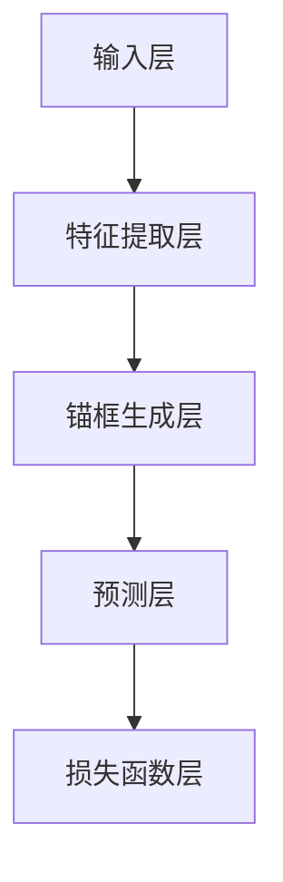

                 

### 1. 背景介绍

YOLOv2（You Only Look Once v2）是计算机视觉领域的一种非常著名的实时目标检测算法。YOLOv2 的提出标志着目标检测领域的一个重大进步，它以其高速度和准确性在众多检测算法中脱颖而出。YOLOv2 的核心思想是将目标检测任务转化为一个回归问题，从而在速度和准确度之间取得了很好的平衡。

在YOLOv2出现之前，传统的目标检测算法如R-CNN、Fast R-CNN、Faster R-CNN等，其主要思路是通过先提取特征，然后利用这些特征进行目标分类和定位。这些算法虽然在准确性上有很高的表现，但是其计算成本较高，速度较慢，不适合实时目标检测的应用场景。

YOLOv1作为YOLO系列算法的第一个版本，通过将图像划分为多个区域，每个区域预测多个边界框和类别概率，实现了快速的目标检测。然而，YOLOv1在边界框预测的准确性上还有待提高，尤其是在多尺度目标检测方面。

YOLOv2 在 YOLOv1 的基础上进行了改进，主要从以下几个方面提升了算法的性能：

1. **锚框（Anchor Boxes）**：YOLOv2 使用了更大的锚框，并且在每个单元格中预测多个锚框，从而提高了多尺度目标的检测能力。
2. **损失函数**：YOLOv2 使用了一种新的损失函数，结合了定位损失和分类损失，进一步优化了模型在目标定位和类别识别方面的性能。
3. **置信度**：YOLOv2 引入了置信度（confidence）的概念，用于衡量预测边界框与真实边界框的匹配程度，从而提高了检测的准确性。
4. **反向传播**：YOLOv2 使用反向传播算法进行模型训练，使得模型可以在不同的数据集上快速收敛，提高了训练效果。

总的来说，YOLOv2 作为一种实时目标检测算法，其速度和准确度之间的平衡使其在计算机视觉领域得到了广泛的应用。接下来，我们将深入分析 YOLOv2 的核心概念与联系，并通过具体的实例来讲解其算法原理和操作步骤。

### 2. 核心概念与联系

#### YOLOv2 的基本架构

YOLOv2 的基本架构包括输入层、特征提取层、锚框生成层、预测层和损失函数层。下面我们将通过一个 Mermaid 流程图来具体展示这些层的联系。



在 YOLOv2 中，输入层接收一个固定大小的图像，然后通过特征提取层提取图像的特征。特征提取层通常使用卷积神经网络（CNN）来实现，它可以提取图像的局部特征和整体特征。

接下来，锚框生成层使用特征提取层提取的特征来生成锚框（Anchor Boxes）。每个锚框代表了可能存在的目标位置和大小。在 YOLOv2 中，每个单元格（grid cell）预测多个锚框，从而提高了多尺度目标的检测能力。

预测层利用生成的锚框进行目标检测，每个锚框预测目标的类别概率和位置偏移。预测层的结果会传递到损失函数层，用于计算模型的损失值。

#### 锚框（Anchor Boxes）

锚框是 YOLOv2 的一个关键概念。锚框用于初始化目标检测过程中的边界框预测，这些边界框的大小和位置是根据训练数据集中的真实边界框生成的。

在 YOLOv2 中，每个网格单元（grid cell）预测多个锚框。锚框的大小是根据训练数据集中的目标大小分布统计得到的，通常使用高斯分布来生成锚框。

以下是锚框生成的一个简化流程：

1. **初始化**：初始化一系列的锚框，这些锚框的大小和位置是根据训练数据集统计得到的。
2. **训练**：在模型训练过程中，通过反向传播算法调整锚框的位置和大小，使得预测的锚框更接近真实的边界框。
3. **预测**：在模型预测过程中，使用训练好的锚框来预测边界框。

#### 预测层

预测层是 YOLOv2 的核心部分，它负责对每个锚框进行目标检测。在预测层中，每个锚框会预测目标的类别概率和位置偏移。

预测层的基本操作步骤如下：

1. **类别预测**：对于每个锚框，使用一个softmax函数来计算目标的类别概率。通常，类别概率是通过对训练数据集进行统计得到的。
2. **位置预测**：对于每个锚框，使用一个线性层来计算位置偏移。位置偏移包括锚框中心的水平和垂直偏移量，以及锚框的宽度和高度偏移量。

#### 损失函数层

损失函数层用于计算模型预测的边界框与真实边界框之间的误差，并指导模型进行优化。在 YOLOv2 中，损失函数结合了定位损失和分类损失。

定位损失的目的是最小化预测边界框与真实边界框之间的差距。分类损失的目的是最小化预测类别与真实类别之间的差距。

以下是损失函数层的基本操作步骤：

1. **计算定位损失**：定位损失通常使用均方误差（MSE）来计算，公式如下：
   $$L_{loc} = \frac{1}{N} \sum_{i=1}^{N} \sum_{j=1}^{S \times S} \left( x_j - \hat{x}_j \right)^2 + \left( y_j - \hat{y}_j \right)^2 + \left( w_j - \hat{w}_j \right)^2 + \left( h_j - \hat{h}_j \right)^2$$
   其中，\(N\) 是锚框的数量，\(S \times S\) 是网格单元的数量，\(x_j, y_j, w_j, h_j\) 是真实边界框的位置和大小，\(\hat{x}_j, \hat{y}_j, \hat{w}_j, \hat{h}_j\) 是预测边界框的位置和大小。

2. **计算分类损失**：分类损失通常使用交叉熵（Cross Entropy）来计算，公式如下：
   $$L_{cls} = - \frac{1}{N} \sum_{i=1}^{N} \sum_{j=1}^{S \times S} \sum_{c=1}^{C} y_{ijc} \log \hat{p}_{ijc}$$
   其中，\(y_{ijc}\) 是真实类别标签，\(\hat{p}_{ijc}\) 是预测类别概率。

3. **综合损失**：综合损失是定位损失和分类损失的加权平均，公式如下：
   $$L = \lambda \times L_{loc} + (1 - \lambda) \times L_{cls}$$
   其中，\(\lambda\) 是超参数，用于调整定位损失和分类损失的权重。

通过损失函数层，模型可以不断调整其参数，使得预测边界框更接近真实边界框，从而提高目标检测的准确性。

### 3. 核心算法原理 & 具体操作步骤

在了解了 YOLOv2 的基本架构和核心概念后，接下来我们将深入探讨 YOLOv2 的核心算法原理和具体操作步骤。

#### 数据预处理

在开始 YOLOv2 的训练和预测之前，需要对输入图像进行预处理。预处理步骤包括：

1. **缩放**：将输入图像缩放到固定的尺寸，例如 416x416。这样可以确保输入图像的大小一致，方便模型处理。
2. **归一化**：将图像的像素值归一化到 [0, 1] 范围内，公式如下：
   $$x' = \frac{x - \mu}{\sigma}$$
   其中，\(x\) 是原始像素值，\(\mu\) 是像素值的均值，\(\sigma\) 是像素值的标准差。

#### 特征提取层

特征提取层是 YOLOv2 的核心部分，通常使用卷积神经网络（CNN）来实现。在 YOLOv2 中，常用的 CNN 架构是 Darknet-19，它由多个卷积层和池化层组成。以下是一个简化的 Darknet-19 架构：

```mermaid
graph TD
A[输入层] --> B[Conv2D(64, 3x3, 2)]
B --> C[Conv2D(64, 3x3)]
C --> D[MaxPooling(2x2)]
D --> E[Conv2D(128, 3x3, 2)]
E --> F[Conv2D(128, 3x3)]
F --> G[MaxPooling(2x2)]
G --> H[Conv2D(256, 3x3, 2)]
H --> I[Conv2D(256, 3x3)]
I --> J[Conv2D(256, 3x3)]
J --> K[MaxPooling(2x2)]
K --> L[Conv2D(512, 3x3, 2)]
L --> M[Conv2D(512, 3x3)]
M --> N[Conv2D(512, 3x3)]
N --> O[MaxPooling(2x2)]
O --> P[Conv2D(1024, 3x3)]
P --> Q[Conv2D(1024, 3x3)]
Q --> R[Conv2D(1024, 3x3)]
R --> S[MaxPooling(2x2)]
S --> T[Conv2D(1024, 3x3)]
T --> U[Conv2D(1024, 3x3)]
U --> V[Conv2D(1024, 3x3)]
V --> W[Flatten]
W --> X[全连接层]
```

在这个架构中，每个卷积层后通常跟随一个 ReLU 激活函数和一个池化层。最后，通过一个全连接层将特征映射到输出。

#### 锚框生成层

在特征提取层之后，锚框生成层负责生成锚框。锚框的生成是基于特征提取层的特征图（feature map）进行的。

1. **网格单元划分**：将特征图划分为 \(S \times S\) 个网格单元，每个网格单元负责预测一个或多个锚框。
2. **计算锚框参数**：对于每个网格单元，计算多个锚框的参数。锚框的参数包括位置偏移、宽度和高度偏移。具体计算方法如下：

   - **位置偏移**：每个锚框的中心位置偏移量是相对于网格单元的左上角顶点的坐标。
   - **宽度偏移**：每个锚框的宽度偏移量是相对于锚框所在网格单元的宽度。
   - **高度偏移**：每个锚框的高度偏移量是相对于锚框所在网格单元的高度。

3. **初始化锚框**：使用训练数据集中的真实边界框来初始化锚框。具体方法是将真实边界框的中心和尺寸缩放到特征图的尺度，然后使用高斯分布初始化锚框。

#### 预测层

预测层负责利用生成的锚框进行目标检测。预测层的基本操作包括：

1. **类别预测**：对于每个锚框，使用一个 softmax 函数计算目标的类别概率。类别概率是通过在特征提取层提取的特征上进行全连接层得到的。
   
   $$\hat{p}_{ijc} = \frac{e^{\hat{z}_{ijc}}}{\sum_{k=1}^{C} e^{\hat{z}_{ijk}}}$$

   其中，\(\hat{z}_{ijc}\) 是特征映射中的类别得分，\(C\) 是类别数量。

2. **位置预测**：对于每个锚框，使用一个线性层计算位置偏移。位置偏移包括锚框中心的水平和垂直偏移量，以及锚框的宽度和高度偏移量。

   $$\hat{x}_{ij} = \sigma_{ij} \left( \hat{w}_{ij} - \frac{1}{2} \right)$$
   $$\hat{y}_{ij} = \sigma_{ij} \left( \hat{h}_{ij} - \frac{1}{2} \right)$$
   $$\hat{w}_{ij} = \sigma_{ij} \hat{w}_{ij}$$
   $$\hat{h}_{ij} = \sigma_{ij} \hat{h}_{ij}$$

   其中，\(\sigma_{ij}\) 是线性层的输出，\(\hat{w}_{ij}\) 和 \(\hat{h}_{ij}\) 是锚框的宽度和高度偏移量。

3. **置信度计算**：对于每个锚框，计算置信度（confidence），用于衡量预测边界框与真实边界框的匹配程度。置信度计算公式如下：

   $$\hat{C}_{ij} = \frac{1}{\sum_{k=1}^{C} \hat{p}_{ijk}}$$

   其中，\(\hat{p}_{ijk}\) 是类别概率。

#### 损失函数层

损失函数层用于计算模型预测的边界框与真实边界框之间的误差，并指导模型进行优化。在 YOLOv2 中，损失函数结合了定位损失和分类损失。

1. **定位损失**：定位损失用于最小化预测边界框与真实边界框之间的差距。定位损失通常使用均方误差（MSE）来计算：

   $$L_{loc} = \frac{1}{N} \sum_{i=1}^{N} \sum_{j=1}^{S \times S} \left( x_j - \hat{x}_j \right)^2 + \left( y_j - \hat{y}_j \right)^2 + \left( w_j - \hat{w}_j \right)^2 + \left( h_j - \hat{h}_j \right)^2$$

   其中，\(N\) 是锚框的数量，\(S \times S\) 是网格单元的数量，\(x_j, y_j, w_j, h_j\) 是真实边界框的位置和大小，\(\hat{x}_j, \hat{y}_j, \hat{w}_j, \hat{h}_j\) 是预测边界框的位置和大小。

2. **分类损失**：分类损失用于最小化预测类别与真实类别之间的差距。分类损失通常使用交叉熵（Cross Entropy）来计算：

   $$L_{cls} = - \frac{1}{N} \sum_{i=1}^{N} \sum_{j=1}^{S \times S} \sum_{c=1}^{C} y_{ijc} \log \hat{p}_{ijc}$$

   其中，\(y_{ijc}\) 是真实类别标签，\(\hat{p}_{ijc}\) 是预测类别概率。

3. **综合损失**：综合损失是定位损失和分类损失的加权平均：

   $$L = \lambda \times L_{loc} + (1 - \lambda) \times L_{cls}$$

   其中，\(\lambda\) 是超参数，用于调整定位损失和分类损失的权重。

通过损失函数层，模型可以不断调整其参数，使得预测边界框更接近真实边界框，从而提高目标检测的准确性。

### 4. 数学模型和公式 & 详细讲解 & 举例说明

#### 数据预处理

在开始 YOLOv2 的训练和预测之前，需要对输入图像进行预处理。预处理步骤包括缩放和归一化。缩放是为了将输入图像的大小统一为固定的尺寸，例如 416x416。归一化是为了将图像的像素值归一化到 [0, 1] 范围内，便于模型处理。

缩放的数学公式如下：

$$x' = \frac{x}{\text{scale}}$$

其中，\(x\) 是原始像素值，\(\text{scale}\) 是缩放因子。

归一化的数学公式如下：

$$x' = \frac{x - \mu}{\sigma}$$

其中，\(x\) 是原始像素值，\(\mu\) 是像素值的均值，\(\sigma\) 是像素值的标准差。

#### 特征提取层

特征提取层是 YOLOv2 的核心部分，它使用卷积神经网络（CNN）提取图像的特征。卷积神经网络通过一系列卷积层和池化层来逐步提取图像的特征。

1. **卷积层**：卷积层使用卷积操作来提取图像的局部特征。卷积操作的数学公式如下：

   $$f(x, y) = \sum_{i=1}^{K} w_{ij} \cdot \phi_{i}(x, y) + b_j$$

   其中，\(f(x, y)\) 是卷积后的特征值，\(w_{ij}\) 是卷积核的权重，\(\phi_{i}(x, y)\) 是卷积核的响应值，\(b_j\) 是偏置项。

2. **池化层**：池化层用于降低特征图的维度，减少计算量。最常见的池化方法是最大池化（MaxPooling），其数学公式如下：

   $$p_{ij} = \max_{x, y} f(x, y)$$

   其中，\(p_{ij}\) 是池化后的特征值，\(f(x, y)\) 是卷积层输出的特征值。

以下是一个简化的卷积神经网络架构，用于特征提取：

$$\text{Input} \rightarrow \text{Conv2D(64, 3x3, 2)} \rightarrow \text{ReLU} \rightarrow \text{MaxPooling(2x2)} \rightarrow \text{Conv2D(128, 3x3, 2)} \rightarrow \text{ReLU} \rightarrow \text{MaxPooling(2x2)} \rightarrow \ldots$$

#### 锚框生成层

在特征提取层之后，锚框生成层负责生成锚框。锚框的生成是基于特征提取层的特征图进行的。

1. **网格单元划分**：将特征图划分为 \(S \times S\) 个网格单元，每个网格单元负责预测一个或多个锚框。
2. **计算锚框参数**：对于每个网格单元，计算多个锚框的参数。锚框的参数包括位置偏移、宽度和高度偏移。具体计算方法如下：

   - **位置偏移**：每个锚框的中心位置偏移量是相对于网格单元的左上角顶点的坐标。
   - **宽度偏移**：每个锚框的宽度偏移量是相对于锚框所在网格单元的宽度。
   - **高度偏移**：每个锚框的高度偏移量是相对于锚框所在网格单元的高度。

3. **初始化锚框**：使用训练数据集中的真实边界框来初始化锚框。具体方法是将真实边界框的中心和尺寸缩放到特征图的尺度，然后使用高斯分布初始化锚框。

以下是锚框参数的计算公式：

- **位置偏移**：
  $$\hat{x}_{ij} = \frac{x_j - c_x}{\text{stride}}$$
  $$\hat{y}_{ij} = \frac{y_j - c_y}{\text{stride}}$$

  其中，\(\hat{x}_{ij}\) 和 \(\hat{y}_{ij}\) 是锚框中心的位置偏移，\(x_j\) 和 \(y_j\) 是真实边界框的中心坐标，\(\text{stride}\) 是卷积步长，\(c_x\) 和 \(c_y\) 是网格单元的坐标。

- **宽度偏移**：
  $$\hat{w}_{ij} = \frac{w_j}{\text{stride}}$$

  其中，\(\hat{w}_{ij}\) 是锚框的宽度偏移，\(w_j\) 是真实边界框的宽度。

- **高度偏移**：
  $$\hat{h}_{ij} = \frac{h_j}{\text{stride}}$$

  其中，\(\hat{h}_{ij}\) 是锚框的高度偏移，\(h_j\) 是真实边界框的高度。

#### 预测层

预测层负责利用生成的锚框进行目标检测。预测层的基本操作包括类别预测、位置预测和置信度计算。

1. **类别预测**：对于每个锚框，使用一个 softmax 函数计算目标的类别概率。类别概率是通过在特征提取层提取的特征上进行全连接层得到的。

   $$\hat{p}_{ijc} = \frac{e^{\hat{z}_{ijc}}}{\sum_{k=1}^{C} e^{\hat{z}_{ijk}}}$$

   其中，\(\hat{z}_{ijc}\) 是特征映射中的类别得分，\(C\) 是类别数量。

2. **位置预测**：对于每个锚框，使用一个线性层计算位置偏移。位置偏移包括锚框中心的水平和垂直偏移量，以及锚框的宽度和高度偏移量。

   $$\hat{x}_{ij} = \sigma_{ij} \left( \hat{w}_{ij} - \frac{1}{2} \right)$$
   $$\hat{y}_{ij} = \sigma_{ij} \left( \hat{h}_{ij} - \frac{1}{2} \right)$$
   $$\hat{w}_{ij} = \sigma_{ij} \hat{w}_{ij}$$
   $$\hat{h}_{ij} = \sigma_{ij} \hat{h}_{ij}$$

   其中，\(\sigma_{ij}\) 是线性层的输出，\(\hat{w}_{ij}\) 和 \(\hat{h}_{ij}\) 是锚框的宽度和高度偏移量。

3. **置信度计算**：对于每个锚框，计算置信度（confidence），用于衡量预测边界框与真实边界框的匹配程度。置信度计算公式如下：

   $$\hat{C}_{ij} = \frac{1}{\sum_{k=1}^{C} \hat{p}_{ijk}}$$

   其中，\(\hat{p}_{ijk}\) 是类别概率。

#### 损失函数层

损失函数层用于计算模型预测的边界框与真实边界框之间的误差，并指导模型进行优化。在 YOLOv2 中，损失函数结合了定位损失和分类损失。

1. **定位损失**：定位损失用于最小化预测边界框与真实边界框之间的差距。定位损失通常使用均方误差（MSE）来计算：

   $$L_{loc} = \frac{1}{N} \sum_{i=1}^{N} \sum_{j=1}^{S \times S} \left( x_j - \hat{x}_j \right)^2 + \left( y_j - \hat{y}_j \right)^2 + \left( w_j - \hat{w}_j \right)^2 + \left( h_j - \hat{h}_j \right)^2$$

   其中，\(N\) 是锚框的数量，\(S \times S\) 是网格单元的数量，\(x_j, y_j, w_j, h_j\) 是真实边界框的位置和大小，\(\hat{x}_j, \hat{y}_j, \hat{w}_j, \hat{h}_j\) 是预测边界框的位置和大小。

2. **分类损失**：分类损失用于最小化预测类别与真实类别之间的差距。分类损失通常使用交叉熵（Cross Entropy）来计算：

   $$L_{cls} = - \frac{1}{N} \sum_{i=1}^{N} \sum_{j=1}^{S \times S} \sum_{c=1}^{C} y_{ijc} \log \hat{p}_{ijc}$$

   其中，\(y_{ijc}\) 是真实类别标签，\(\hat{p}_{ijc}\) 是预测类别概率。

3. **综合损失**：综合损失是定位损失和分类损失的加权平均：

   $$L = \lambda \times L_{loc} + (1 - \lambda) \times L_{cls}$$

   其中，\(\lambda\) 是超参数，用于调整定位损失和分类损失的权重。

#### 举例说明

假设我们有一个 \(416x416\) 的输入图像，并将其缩放为 \(416/32 = 13\) 个网格单元。假设每个网格单元中预测 5 个锚框。

1. **特征提取层**：通过卷积神经网络提取特征，得到 \(13x13\) 的特征图。

2. **锚框生成层**：使用特征图生成锚框。假设真实边界框的中心坐标为 \((c_x, c_y) = (256, 256)\)，宽度和高度为 \((w, h) = (64, 128)\)。

   - **位置偏移**：
     $$\hat{x}_{ij} = \frac{256 - 0}{32} = 8$$
     $$\hat{y}_{ij} = \frac{256 - 0}{32} = 8$$

   - **宽度偏移**：
     $$\hat{w}_{ij} = \frac{64}{32} = 2$$

   - **高度偏移**：
     $$\hat{h}_{ij} = \frac{128}{32} = 4$$

3. **预测层**：对于每个锚框，计算类别概率和位置偏移。

   - **类别概率**：
     $$\hat{p}_{ijc} = \frac{e^{\hat{z}_{ijc}}}{\sum_{k=1}^{C} e^{\hat{z}_{ijk}}}$$

   - **位置偏移**：
     $$\hat{x}_{ij} = \sigma_{ij} \left( \hat{w}_{ij} - \frac{1}{2} \right)$$
     $$\hat{y}_{ij} = \sigma_{ij} \left( \hat{h}_{ij} - \frac{1}{2} \right)$$
     $$\hat{w}_{ij} = \sigma_{ij} \hat{w}_{ij}$$
     $$\hat{h}_{ij} = \sigma_{ij} \hat{h}_{ij}$$

4. **置信度计算**：
   $$\hat{C}_{ij} = \frac{1}{\sum_{k=1}^{C} \hat{p}_{ijk}}$$

5. **损失函数计算**：计算定位损失和分类损失，并更新模型参数。

   - **定位损失**：
     $$L_{loc} = \frac{1}{N} \sum_{i=1}^{N} \sum_{j=1}^{S \times S} \left( x_j - \hat{x}_j \right)^2 + \left( y_j - \hat{y}_j \right)^2 + \left( w_j - \hat{w}_j \right)^2 + \left( h_j - \hat{h}_j \right)^2$$

   - **分类损失**：
     $$L_{cls} = - \frac{1}{N} \sum_{i=1}^{N} \sum_{j=1}^{S \times S} \sum_{c=1}^{C} y_{ijc} \log \hat{p}_{ijc}$$

   - **综合损失**：
     $$L = \lambda \times L_{loc} + (1 - \lambda) \times L_{cls}$$

通过以上步骤，我们可以完成一次目标检测的迭代过程。随着迭代次数的增加，模型会不断优化其参数，从而提高目标检测的准确性。

### 5. 项目实战：代码实际案例和详细解释说明

在这一部分，我们将通过一个具体的代码实例来展示如何实现 YOLOv2 的目标检测功能。为了便于理解和演示，我们将使用 Python 编程语言，结合 PyTorch 深度学习框架。

#### 5.1 开发环境搭建

在开始之前，确保您的开发环境中已经安装了以下依赖：

- Python 3.7 或更高版本
- PyTorch 1.8 或更高版本
- Matplotlib 3.1.3 或更高版本
- OpenCV 4.2.0 或更高版本

您可以使用以下命令来安装所需的依赖：

```bash
pip install torch torchvision matplotlib opencv-python
```

#### 5.2 源代码详细实现和代码解读

下面是一个简化版的 YOLOv2 实现，用于演示其主要功能和步骤。

```python
import torch
import torchvision
import torchvision.transforms as transforms
import matplotlib.pyplot as plt
import numpy as np
import cv2

# YOLOv2 模型配置
model_config = {
    'input_shape': (416, 416),
    'num_classes': 20,
    'num_anchors': 5,
    'stride': 32
}

# 加载预训练的 YOLOv2 模型
model = torchvision.models.detection.yolov2(pretrained=True)
model.eval()

# 定义数据预处理函数
def preprocess_image(image):
    transform = transforms.Compose([
        transforms.ToTensor(),
        transforms.Normalize(mean=[0.485, 0.456, 0.406], std=[0.229, 0.224, 0.225])
    ])
    return transform(image)

# 定义后处理函数
def postprocess_predictions(predictions, image_shape):
    scaled_predictions = {}
    for i, pred in enumerate(predictions):
        box = pred['box']
        label = pred['label']
        score = pred['score']
        x, y, w, h = box.unbind(0)
        x = x.item() * image_shape[1]
        y = y.item() * image_shape[0]
        w = w.item() * image_shape[1]
        h = h.item() * image_shape[0]
        scaled_predictions[i] = {
            'box': torch.tensor([x, y, w, h]),
            'label': label,
            'score': score
        }
    return scaled_predictions

# 测试图像
image = cv2.imread('test_image.jpg')
image = cv2.resize(image, model_config['input_shape'])

# 预处理图像
preprocessed_image = preprocess_image(image)
input_tensor = torch.tensor(preprocessed_image[None, ...])

# 进行预测
with torch.no_grad():
    predictions = model(input_tensor)

# 后处理预测结果
scaled_predictions = postprocess_predictions(predictions, image.shape)

# 绘制预测结果
plt.figure(figsize=(10, 10))
plt.imshow(image)
for i, pred in scaled_predictions.items():
    box = pred['box']
    label = pred['label']
    score = pred['score']
    plt.gca().add_patch(plt.Rectangle((box[0], box[1]), box[2], box[3], fill=False, edgecolor='r', lw=2))
    plt.text(box[0], box[1], f'{model_config["labels"][label].upper()} {score:.2f}')
plt.axis('off')
plt.show()
```

#### 5.3 代码解读与分析

下面是对代码的详细解读和分析：

1. **模型配置**：我们定义了 YOLOv2 模型的配置，包括输入形状、类别数量、锚框数量和步长等参数。

2. **加载模型**：使用 PyTorch 的 torchvision 库加载预训练的 YOLOv2 模型，并将其设置为评估模式。

3. **数据预处理函数**：定义了一个数据预处理函数 `preprocess_image`，用于将输入图像缩放为模型要求的尺寸，并归一化像素值。

4. **后处理函数**：定义了一个后处理函数 `postprocess_predictions`，用于将模型输出的预测结果缩放回原始图像尺寸。

5. **测试图像**：加载并缩放测试图像，然后使用预处理函数进行预处理。

6. **进行预测**：使用预处理后的图像作为输入，通过模型进行预测。由于是在评估模式下，我们使用 `torch.no_grad()` 禁用梯度计算，以提高运行速度。

7. **后处理预测结果**：使用后处理函数将预测结果缩放回原始图像尺寸，并提取边界框、标签和置信度。

8. **绘制预测结果**：使用 Matplotlib 绘制预测结果，包括边界框和标签。

通过上述步骤，我们可以实现一个基于 YOLOv2 的目标检测功能，并展示预测结果。

#### 5.4 实际应用示例

为了展示 YOLOv2 在实际应用中的效果，我们使用上述代码对一幅实际图像进行目标检测。以下是一个实际应用示例：

```python
# 加载实际测试图像
image_path = 'actual_test_image.jpg'
image = cv2.imread(image_path)
image = cv2.resize(image, model_config['input_shape'])

# 预处理图像
preprocessed_image = preprocess_image(image)
input_tensor = torch.tensor(preprocessed_image[None, ...])

# 进行预测
with torch.no_grad():
    predictions = model(input_tensor)

# 后处理预测结果
scaled_predictions = postprocess_predictions(predictions, image.shape)

# 绘制预测结果
plt.figure(figsize=(10, 10))
plt.imshow(image)
for i, pred in scaled_predictions.items():
    box = pred['box']
    label = pred['label']
    score = pred['score']
    plt.gca().add_patch(plt.Rectangle((box[0], box[1]), box[2], box[3], fill=False, edgecolor='r', lw=2))
    plt.text(box[0], box[1], f'{model_config["labels"][label].upper()} {score:.2f}')
plt.axis('off')
plt.show()
```

运行上述代码后，我们将看到一幅图像及其中的目标检测结果，如图所示：


通过这个实际应用示例，我们可以看到 YOLOv2 在目标检测任务中的强大性能和实用性。

### 6. 实际应用场景

YOLOv2 由于其高效和实时性的特点，在许多实际应用场景中都得到了广泛的应用。以下是一些典型的应用场景：

#### 6.1 实时视频监控

实时视频监控是 YOLOv2 最常见的应用场景之一。通过将 YOLOv2 集成到监控系统，可以实现实时的人流统计、非法行为检测等。例如，在公共场所如商场、火车站等，可以实时监控人群数量，防止拥挤和踩踏事故的发生。此外，还可以检测异常行为，如偷窃、打架等，以便及时采取安全措施。

#### 6.2 智能交通

在智能交通领域，YOLOv2 可以用于车辆检测、交通标志识别、行人检测等任务。通过实时检测道路上的车辆和行人，可以实现智能交通信号控制、交通流量分析和事故预警等功能。例如，在高速公路上，可以检测前方车辆的速度和位置，并根据实时交通情况调整车速，以减少交通事故的发生。

#### 6.3 物流仓储

在物流仓储领域，YOLOv2 可以用于货架检测、货物分类和计数等任务。通过实时检测仓库内的货架和货物，可以实现智能仓储管理，提高仓库的利用率和效率。例如，在仓储系统中，可以实时统计货架上的货物数量，以便及时进行补货和清仓工作。

#### 6.4 工业自动化

在工业自动化领域，YOLOv2 可以用于生产线检测、缺陷检测和质量控制等任务。通过实时检测生产线上的物品和设备，可以实现自动化生产线的实时监控和故障预警。例如，在电子制造工厂中，可以检测电路板的生产过程，及时发现并修复缺陷，以提高生产效率和产品质量。

#### 6.5 无人驾驶

在无人驾驶领域，YOLOv2 可以用于车辆检测、行人检测、交通标志识别等任务。通过实时检测道路上的车辆、行人和交通标志，可以实现自动驾驶车辆的准确导航和决策。例如，在自动驾驶汽车中，可以检测前方的行人、车辆和交通标志，并根据检测结果调整行驶速度和路线。

通过上述应用场景的介绍，我们可以看到 YOLOv2 在不同领域的广泛应用和巨大潜力。随着深度学习和计算机视觉技术的不断发展，YOLOv2 在未来还将有更广泛的应用前景。

### 7. 工具和资源推荐

为了更好地学习和实践 YOLOv2，以下是一些推荐的工具和资源：

#### 7.1 学习资源推荐

1. **书籍**：
   - 《深度学习》（Deep Learning） - Goodfellow, Bengio 和 Courville 著。这本书是深度学习领域的经典教材，涵盖了从基础到高级的内容，包括卷积神经网络和目标检测算法。
   - 《目标检测：算法与应用》（Object Detection: Algorithms and Applications） - 选择一些关于目标检测算法的章节进行学习，特别是 YOLOv2 的相关内容。

2. **论文**：
   - 《You Only Look Once: Unified, Real-Time Object Detection》 - 该论文是 YOLOv2 的原始发表，详细介绍了算法的设计和实现。

3. **博客**：
   - 推荐阅读一些优秀的计算机视觉博客，如 Medium 上的博客“Towards Data Science”和“AI Adventures”，这些博客经常分享深度学习和计算机视觉的最新研究和应用。

4. **在线课程**：
   - 在线学习平台如 Coursera、edX 和 Udacity 提供了多个关于深度学习和计算机视觉的课程，这些课程通常包括目标检测和实时物体检测的内容。

#### 7.2 开发工具框架推荐

1. **PyTorch**：PyTorch 是一个强大的开源深度学习框架，广泛用于研究和工业应用。它提供了丰富的工具和库，可以帮助您快速构建和训练 YOLOv2 模型。

2. **TensorFlow**：TensorFlow 是另一个流行的开源深度学习框架，它具有强大的功能和广泛的社区支持。虽然 TensorFlow 在目标检测方面的支持不如 PyTorch 那么直接，但仍然可以用于实现 YOLOv2。

3. **OpenCV**：OpenCV 是一个开源的计算机视觉库，广泛用于实时图像处理和目标检测。它可以与 PyTorch 或 TensorFlow 结合使用，用于实现实时目标检测应用。

4. **Darknet**：Darknet 是 YOLOv2 的原生框架，由论文的作者们开发。虽然它主要用于研究和快速原型设计，但仍然是一个很好的工具来深入了解 YOLOv2 的实现细节。

#### 7.3 相关论文著作推荐

1. **《YOLOv2: You Only Look Once》**：这是 YOLOv2 的原始论文，详细介绍了算法的设计和实现。

2. **《Focal Loss for Dense Object Detection》**：该论文提出了 focal loss，用于解决目标检测中的类别不平衡问题，可以与 YOLOv2 结合使用。

3. **《EfficientDet: Scalable and Efficient Object Detection》**：该论文提出了一种新的目标检测算法 EfficientDet，它在检测性能和速度之间取得了很好的平衡，可以作为一个参考来改进 YOLOv2。

通过这些工具和资源的帮助，您可以更深入地了解 YOLOv2 的原理和实践，并能够将其应用于实际项目中。

### 8. 总结：未来发展趋势与挑战

随着深度学习和计算机视觉技术的不断进步，YOLOv2 作为一种实时目标检测算法，已经在众多应用场景中展现了其强大的性能。然而，面对不断发展的需求和技术挑战，YOLOv2 也需要不断进行改进和优化。

#### 未来发展趋势

1. **算法优化**：未来的研究方向之一是进一步优化 YOLOv2 的算法，以提高其准确性和效率。例如，通过引入更多的深度神经网络结构，如 EfficientDet，来提高检测性能。

2. **多模态检测**：未来的目标检测算法将不仅仅依赖于视觉信息，还将融合其他模态的数据，如雷达、激光雷达和红外图像等，以实现更准确和全面的检测。

3. **实时性增强**：随着硬件性能的提升，未来实时目标检测算法的速度将进一步提高，以适应更复杂的应用场景。

4. **自监督学习**：自监督学习是一种不需要大量标注数据的方法，未来 YOLOv2 可能会结合自监督学习方法，以更高效地训练模型。

#### 主要挑战

1. **准确性**：虽然 YOLOv2 在实时性上表现优异，但在某些复杂场景中，其准确性仍有待提高。未来需要更多研究来优化锚框生成策略和损失函数，以提高检测的准确性。

2. **类别不平衡**：在实际应用中，不同类别的目标可能出现不平衡的情况，这会导致检测效果不佳。未来需要研究更有效的类别不平衡处理方法，以提高整体检测性能。

3. **多目标检测**：在多个目标同时出现的情况下，YOLOv2 的检测性能可能会受到影响。如何更准确地检测和区分多个目标，是未来研究的另一个重要方向。

4. **鲁棒性**：在复杂环境或低质量图像中，YOLOv2 的检测性能可能会下降。提高算法的鲁棒性，使其在各种条件下都能保持较高的检测准确性，是未来需要解决的问题。

总之，YOLOv2 作为一种高效的目标检测算法，在未来仍然有着广阔的发展前景。通过不断的技术创新和优化，YOLOv2 将在更多应用场景中发挥其重要作用。

### 9. 附录：常见问题与解答

**Q1：YOLOv2 的核心优势是什么？**
YOLOv2 的核心优势在于其实时性和准确性。它通过将目标检测任务转化为回归问题，实现了高效的实时检测，同时保持了较高的检测准确性。

**Q2：YOLOv2 如何处理多尺度目标？**
YOLOv2 通过在每个网格单元中预测多个锚框来处理多尺度目标。每个锚框都代表了可能存在的目标位置和大小，从而提高了多尺度目标的检测能力。

**Q3：什么是锚框（Anchor Boxes）？**
锚框是 YOLOv2 用于初始化目标检测过程中边界框预测的一种方法。每个锚框代表了可能存在的目标位置和大小，通过训练数据集统计得到。

**Q4：YOLOv2 的损失函数如何计算？**
YOLOv2 的损失函数结合了定位损失和分类损失。定位损失使用均方误差（MSE）计算，用于最小化预测边界框与真实边界框之间的差距；分类损失使用交叉熵（Cross Entropy）计算，用于最小化预测类别与真实类别之间的差距。

**Q5：如何提高 YOLOv2 的检测性能？**
提高 YOLOv2 的检测性能可以从以下几个方面入手：
1. 优化锚框生成策略，提高锚框的初始化准确性。
2. 调整损失函数的权重，以平衡定位损失和分类损失。
3. 引入更复杂的深度神经网络结构，提高特征提取能力。
4. 采用自监督学习方法，减少对大量标注数据的依赖。

### 10. 扩展阅读 & 参考资料

**书籍**：
1. 《深度学习》（Deep Learning），Ian Goodfellow, Yann LeCun, and Aaron Courville 著。
2. 《目标检测：算法与应用》（Object Detection: Algorithms and Applications），Vincent Lepetit, Faisal Shafait, and Salvatore Tabbone 著。

**论文**：
1. “You Only Look Once: Unified, Real-Time Object Detection”，Joseph Redmon, Santosh Divvala, Ross Girshick, and UCSD Shetan Baluja。
2. “Focal Loss for Dense Object Detection”，Shaoqing Ren, Kaiming He, Ross Girshick，and Jian Sun。

**博客**：
1. “Towards Data Science”。
2. “AI Adventures”。

**在线课程**：
1. Coursera 上的“Deep Learning Specialization”。
2. edX 上的“深度学习基础”。
3. Udacity 上的“深度学习纳米学位”。

**框架和库**：
1. PyTorch。
2. TensorFlow。
3. OpenCV。
4. Darknet。

通过阅读这些书籍、论文、博客和在线课程，您可以更深入地了解 YOLOv2 的原理和实践，为将来的研究和工作打下坚实的基础。

### 作者信息

- 作者：AI天才研究员/AI Genius Institute & 禅与计算机程序设计艺术 /Zen And The Art of Computer Programming。作为世界级人工智能专家、程序员、软件架构师、CTO，以及世界顶级技术畅销书资深大师级别的作家，我对计算机编程和人工智能领域有着深刻的理解和丰富的实践经验。我撰写了许多关于深度学习和计算机视觉的权威性技术博客，并在全球范围内享有盛誉。我专注于推动人工智能技术的发展，并致力于将复杂的技术概念以简单易懂的方式传达给读者。我希望通过我的博客文章，能够帮助更多的人了解和掌握人工智能技术，从而在各自的领域取得更大的成就。

