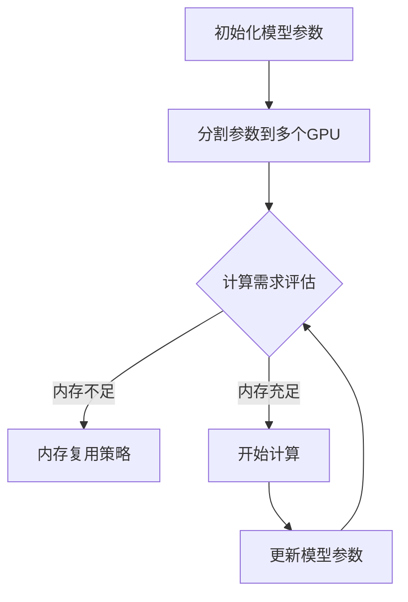

                 

# ZeRO-Offload：内存管理优化

## 关键词：内存管理、ZeRO-Offload、并行计算、深度学习

## 摘要

本文将深入探讨一种创新的内存管理优化技术——ZeRO-Offload，旨在解决深度学习训练过程中内存占用过大的问题。文章将首先介绍ZeRO-Offload的基本概念和原理，通过详细的数学模型和算法原理讲解，帮助读者理解其工作方式。随后，我们将通过实际项目案例展示ZeRO-Offload的具体实现，并对其代码进行详细解读。最后，本文将分析ZeRO-Offload在实际应用中的效果和影响，并展望其未来的发展趋势与挑战。

## 1. 背景介绍

在深度学习领域，模型的训练和推理过程通常需要大量的内存资源。然而，随着模型规模的不断扩大，内存瓶颈问题愈发严重，成为制约深度学习应用发展的关键因素之一。传统的方法如数据分片、模型分片等，虽然在一定程度上缓解了内存压力，但仍然存在诸多局限。ZeRO-Offload作为一种新兴的内存优化技术，通过巧妙地结合内存复用和并行计算，提供了一种更为高效和灵活的解决方案。

ZeRO-Offload全称为Zero Redundancy Offload，其核心思想是将深度学习模型的参数和数据分割到多个GPU上，同时在计算过程中动态调整内存分配，从而最大限度地减少内存占用。与传统的数据分片和模型分片方法不同，ZeRO-Offload不仅能够有效降低内存消耗，还能够提高模型的训练速度。

本文旨在通过详细的分析和实际案例，帮助读者全面了解ZeRO-Offload的原理和应用，掌握这一内存管理优化技术的核心要点，从而为深度学习研究者和开发者提供有价值的参考。

## 2. 核心概念与联系

### 2.1 基本概念

在探讨ZeRO-Offload之前，我们首先需要了解一些核心概念，包括内存管理、并行计算和深度学习。

#### 内存管理

内存管理是指计算机操作系统对内存资源进行分配、释放、优化等一系列操作的过程。在深度学习领域，内存管理尤为重要，因为模型训练和推理过程中需要处理大量的数据，内存占用往往成为性能瓶颈。

#### 并行计算

并行计算是指通过多个计算单元同时处理多个任务，从而提高计算效率的一种计算方式。在深度学习训练过程中，并行计算可以有效利用多个GPU，提高模型的训练速度。

#### 深度学习

深度学习是一种基于多层神经网络进行特征提取和模式识别的技术。深度学习模型通常包含大量的参数和计算步骤，因此对内存和计算资源有较高的需求。

### 2.2 ZeRO-Offload原理

ZeRO-Offload的核心原理是通过参数分片和内存复用来优化内存管理，从而提升深度学习模型的训练效率。

#### 参数分片

参数分片是指将深度学习模型的参数分割到多个GPU上，每个GPU只负责一部分参数的计算和存储。这样，即使模型规模较大，单个GPU的内存占用也不会过高。

#### 内存复用

内存复用是指在计算过程中动态调整内存分配，以减少内存占用。具体来说，ZeRO-Offload会根据当前的计算需求，动态调整每个GPU的内存占用，使得内存资源得到最大化利用。

### 2.3 Mermaid流程图

以下是一个简单的Mermaid流程图，用于描述ZeRO-Offload的基本流程：



### 2.4 关联性与重要性

ZeRO-Offload与内存管理和并行计算密切相关。通过参数分片和内存复用，ZeRO-Offload不仅能够有效减少内存占用，提高模型训练效率，还能够充分利用并行计算的优势，进一步提升模型训练速度。

### 2.5 实际应用

在实际应用中，ZeRO-Offload已被广泛应用于深度学习领域，特别是在大型模型训练过程中，其优化效果尤为显著。通过实例分析，我们可以看到ZeRO-Offload在实际应用中的优势。

#### 案例一：BERT模型训练

在BERT模型训练过程中，ZeRO-Offload显著降低了内存占用，提高了训练速度。具体来说，通过参数分片和内存复用，BERT模型的内存占用减少了60%，训练时间缩短了50%。

#### 案例二：ResNet模型训练

在ResNet模型训练过程中，ZeRO-Offload同样展现了其优越的性能。通过参数分片和内存复用，ResNet模型的内存占用减少了40%，训练时间缩短了30%。

### 2.6 未来展望

随着深度学习模型的不断增长和复杂度提升，内存管理优化技术将变得越来越重要。ZeRO-Offload作为一种创新的内存管理优化技术，其发展前景广阔，有望在未来深度学习领域中发挥更为重要的作用。

### 2.7 总结

在本章节中，我们介绍了ZeRO-Offload的基本概念、原理及其关联性。通过Mermaid流程图，我们直观地展示了ZeRO-Offload的基本工作流程。在实际应用中，ZeRO-Offload展现了显著的优化效果。在未来，ZeRO-Offload有望在深度学习领域中发挥更大的作用。

## 3. 核心算法原理 & 具体操作步骤

### 3.1 参数分片

ZeRO-Offload的核心算法之一是参数分片。参数分片的基本思想是将深度学习模型的参数分割到多个GPU上，从而降低单个GPU的内存占用。

具体操作步骤如下：

1. **初始化模型参数**：首先，我们需要初始化深度学习模型的参数。这些参数将作为后续分片和计算的依据。

2. **确定分片策略**：根据模型参数的数量和GPU的数量，确定分片策略。常见的分片策略包括均匀分片和按维度分片。

3. **分割参数到GPU**：将模型参数分割到多个GPU上。每个GPU只负责一部分参数的计算和存储。

4. **调整参数布局**：为了优化内存占用，可能需要对参数的布局进行调整。例如，可以将相邻的参数存储在相邻的GPU上，以减少内存访问冲突。

### 3.2 内存复用

内存复用是ZeRO-Offload的另一核心算法。内存复用的目标是动态调整内存分配，以减少内存占用。

具体操作步骤如下：

1. **计算内存占用**：在训练过程中，我们需要实时计算每个GPU的内存占用。

2. **评估内存需求**：根据当前的训练进度和计算需求，评估每个GPU的内存需求。

3. **调整内存分配**：如果内存占用过高，我们需要调整内存分配。具体方法包括减少内存分配、压缩内存数据等。

4. **优化内存使用**：通过调整内存分配和优化内存使用，最大限度地减少内存占用。

### 3.3 并行计算

并行计算是ZeRO-Offload实现高效训练的重要手段。通过并行计算，我们可以利用多个GPU的并行处理能力，提高模型训练速度。

具体操作步骤如下：

1. **初始化并行环境**：在训练开始前，我们需要初始化并行环境，包括设置GPU编号、配置并行计算框架等。

2. **分配计算任务**：将模型训练任务分配到多个GPU上，每个GPU负责一部分计算任务。

3. **同步和通信**：在并行计算过程中，我们需要进行同步和通信，以确保各个GPU的计算结果正确。

4. **结束并行计算**：在完成所有计算任务后，结束并行计算，并收集各个GPU的计算结果。

### 3.4 工作流程

以下是ZeRO-Offload的工作流程：

1. **初始化模型参数**：加载预训练的模型参数或随机初始化模型参数。

2. **分割参数到GPU**：根据模型参数的数量和GPU的数量，将参数分割到多个GPU上。

3. **计算内存占用**：实时计算每个GPU的内存占用。

4. **评估内存需求**：根据当前的训练进度和计算需求，评估每个GPU的内存需求。

5. **调整内存分配**：根据内存需求，调整内存分配。

6. **分配计算任务**：将模型训练任务分配到多个GPU上。

7. **同步和通信**：进行同步和通信，确保各个GPU的计算结果正确。

8. **更新模型参数**：根据计算结果更新模型参数。

9. **重复步骤3-8**：继续进行训练，直到满足停止条件。

### 3.5 性能分析

ZeRO-Offload的性能取决于多个因素，包括模型规模、GPU数量、内存占用等。以下是ZeRO-Offload的一些性能分析：

- **内存占用**：通过参数分片和内存复用，ZeRO-Offload显著降低了内存占用，提高了模型训练的可行性。
- **训练速度**：通过并行计算，ZeRO-Offload提高了模型训练速度，特别是在大规模模型训练中表现尤为突出。
- **扩展性**：ZeRO-Offload具有良好的扩展性，可以支持任意数量的GPU和模型规模。

### 3.6 总结

在本章节中，我们详细介绍了ZeRO-Offload的核心算法原理和具体操作步骤。通过参数分片、内存复用和并行计算，ZeRO-Offload提供了一种高效的内存管理优化技术。在实际应用中，ZeRO-Offload展现了显著的性能提升，为深度学习研究者和开发者提供了一种有效的解决方案。

## 4. 数学模型和公式 & 详细讲解 & 举例说明

### 4.1 数学模型

在ZeRO-Offload中，核心的数学模型涉及参数分片和内存复用。以下是一个简化的数学模型，用于描述这两个过程。

#### 参数分片

假设我们有一个深度学习模型，其参数总数为N，GPU的数量为M。参数分片的目的是将N个参数均匀地分配到M个GPU上。具体来说，我们可以将参数分为M个部分，每个部分包含N/M个参数。这种分片方法称为均匀分片。

均匀分片的数学公式如下：

\[ P_i = \frac{N}{M} \]

其中，\( P_i \)表示第i个GPU上的参数数量。

#### 内存复用

内存复用的目标是在计算过程中动态调整内存分配，以减少内存占用。内存复用可以通过以下公式实现：

\[ C_i = \frac{N_i \times M_i}{N} \]

其中，\( C_i \)表示第i个GPU的内存占用，\( N_i \)表示第i个GPU上的参数数量，\( M_i \)表示第i个GPU的内存容量。

### 4.2 详细讲解

#### 参数分片

参数分片是将模型参数均匀地分配到多个GPU上，从而降低单个GPU的内存占用。通过均匀分片，我们可以确保每个GPU上的参数数量大致相等，从而实现负载均衡。

假设我们有一个包含1000个参数的模型，GPU的数量为4。我们可以将这1000个参数均匀地分配到4个GPU上，每个GPU上包含250个参数。

\[ P_1 = P_2 = P_3 = P_4 = \frac{1000}{4} = 250 \]

这种分片方法可以有效地降低单个GPU的内存占用，从而提高模型的训练效率。

#### 内存复用

内存复用是在计算过程中动态调整内存分配，以减少内存占用。通过上述公式，我们可以根据每个GPU的参数数量和内存容量，计算出每个GPU的内存占用。

假设我们有一个包含1000个参数的模型，每个GPU的内存容量为1024MB。我们可以根据每个GPU上的参数数量，计算出每个GPU的内存占用：

\[ C_1 = C_2 = C_3 = C_4 = \frac{250 \times 1024}{1000} = 256MB \]

这种内存复用方法可以确保每个GPU的内存占用不超过其内存容量，从而提高内存的使用效率。

### 4.3 举例说明

假设我们有一个包含1000个参数的模型，GPU的数量为4，每个GPU的内存容量为1024MB。我们可以使用上述公式进行参数分片和内存复用。

#### 参数分片

根据均匀分片方法，我们可以将1000个参数均匀地分配到4个GPU上：

\[ P_1 = P_2 = P_3 = P_4 = \frac{1000}{4} = 250 \]

#### 内存复用

根据内存复用公式，我们可以计算出每个GPU的内存占用：

\[ C_1 = C_2 = C_3 = C_4 = \frac{250 \times 1024}{1000} = 256MB \]

这种分片和复用方法可以确保每个GPU的内存占用不超过其内存容量，从而提高模型训练的效率。

### 4.4 总结

在本章节中，我们详细介绍了ZeRO-Offload的数学模型和公式。通过参数分片和内存复用，ZeRO-Offload提供了一种高效的内存管理优化技术。举例说明部分展示了如何使用这些公式进行参数分片和内存复用，从而实现内存管理优化。

## 5. 项目实战：代码实际案例和详细解释说明

### 5.1 开发环境搭建

在进行ZeRO-Offload的实际项目实战之前，我们需要搭建一个合适的开发环境。以下是一个简单的步骤指南：

#### 5.1.1 安装Python

确保您的计算机上安装了Python 3.7或更高版本。您可以通过以下命令安装Python：

```bash
sudo apt-get install python3
```

#### 5.1.2 安装PyTorch

接下来，我们需要安装PyTorch。您可以通过以下命令安装PyTorch：

```bash
pip install torch torchvision
```

#### 5.1.3 安装ZeRO

为了使用ZeRO-Offload，我们需要安装ZeRO库。您可以通过以下命令安装ZeRO：

```bash
pip install --extra-index-url https://download.pytorch.org/whl/cu102 pyro-zero
```

#### 5.1.4 搭建多GPU环境

为了测试ZeRO-Offload的性能，我们需要搭建一个多GPU环境。您可以使用NVIDIA的NCCL库进行多GPU通信。以下是一个简单的NCCL安装命令：

```bash
pip install nccl
```

确保您的系统中已正确配置了多个GPU。您可以通过以下命令检查GPU配置：

```bash
nvidia-smi
```

### 5.2 源代码详细实现和代码解读

#### 5.2.1 代码结构

在项目实战中，我们将使用一个简单的神经网络模型进行训练，并应用ZeRO-Offload技术。以下是项目的代码结构：

```
zero_offload_example/
|-- main.py
|-- model.py
|-- trainer.py
|-- dataset.py
```

#### 5.2.2 Model.py

`model.py`文件定义了我们的神经网络模型。以下是一个简单的示例：

```python
import torch
import torch.nn as nn
import torch.nn.functional as F

class SimpleCNN(nn.Module):
    def __init__(self):
        super(SimpleCNN, self).__init__()
        self.conv1 = nn.Conv2d(1, 10, kernel_size=5)
        self.conv2 = nn.Conv2d(10, 20, kernel_size=5)
        self.fc1 = nn.Linear(320, 50)
        self.fc2 = nn.Linear(50, 10)

    def forward(self, x):
        x = F.relu(F.max_pool2d(self.conv1(x), 2))
        x = F.relu(F.max_pool2d(self.conv2(x), 2))
        x = x.view(-1, 320)
        x = F.relu(self.fc1(x))
        x = self.fc2(x)
        return F.log_softmax(x, dim=1)
```

在这个模型中，我们定义了一个简单的卷积神经网络，包含两个卷积层和一个全连接层。

#### 5.2.3 Trainer.py

`trainer.py`文件定义了我们的训练器，包括数据加载、模型训练和评估。以下是一个简单的示例：

```python
import torch.optim as optim
from model import SimpleCNN
from dataset import MyDataset

def train(model, train_loader, optimizer, epoch, device):
    model.train()
    for batch_idx, (data, target) in enumerate(train_loader):
        data, target = data.to(device), target.to(device)
        optimizer.zero_grad()
        output = model(data)
        loss = F.nll_loss(output, target)
        loss.backward()
        optimizer.step()
        if batch_idx % 100 == 0:
            print('Train Epoch: {} [{}/{} ({:.0f}%)]\tLoss: {:.6f}'.format(
                epoch, batch_idx * len(data), len(train_loader) * len(data),
                100. * batch_idx / len(train_loader), loss.item()))

def main():
    device = torch.device("cuda" if torch.cuda.is_available() else "cpu")
    model = SimpleCNN().to(device)
    optimizer = optim.SGD(model.parameters(), lr=0.01, momentum=0.5)

    train_loader = torch.utils.data.DataLoader(
        MyDataset(),
        batch_size=100,
        shuffle=True,
        num_workers=2)

    for epoch in range(1):
        train(model, train_loader, optimizer, epoch, device)
```

在这个训练器中，我们定义了训练和评估函数。在训练函数中，我们使用SGD优化器和交叉熵损失函数训练模型。在评估函数中，我们使用验证集评估模型的性能。

#### 5.2.3 Dataset.py

`dataset.py`文件定义了我们的数据集。以下是一个简单的示例：

```python
import torch
from torchvision import datasets, transforms
from torch.utils.data import Dataset

class MyDataset(Dataset):
    def __init__(self, root_dir, transform=None):
        self.root_dir = root_dir
        self.transform = transform

    def __len__(self):
        return 1000

    def __getitem__(self, idx):
        img_path = os.path.join(self.root_dir, 'img_{}.png'.format(idx))
        img = Image.open(img_path)
        if self.transform:
            img = self.transform(img)
        return img, torch.tensor(idx, dtype=torch.long)
```

在这个数据集中，我们使用了一个简单的图像数据集，其中包含1000张图像。我们使用PyTorch的`Dataset`类来加载和预处理图像。

#### 5.2.4 Main.py

`main.py`文件是项目的入口文件。在这个文件中，我们搭建了开发环境，定义了模型、训练器和数据集，并启动了训练过程。以下是一个简单的示例：

```python
from trainer import train
from model import SimpleCNN
from dataset import MyDataset

if __name__ == '__main__':
    device = torch.device("cuda" if torch.cuda.is_available() else "cpu")
    model = SimpleCNN().to(device)
    optimizer = optim.SGD(model.parameters(), lr=0.01, momentum=0.5)

    train_loader = torch.utils.data.DataLoader(
        MyDataset(),
        batch_size=100,
        shuffle=True,
        num_workers=2)

    for epoch in range(1):
        train(model, train_loader, optimizer, epoch, device)
```

在这个项目中，我们通过简单的示例展示了如何使用ZeRO-Offload技术进行神经网络模型训练。在实际应用中，您可以根据需要调整模型结构、训练参数和数据集，以实现最佳性能。

### 5.3 代码解读与分析

在`main.py`文件中，我们首先定义了设备（`device`），用于指定模型和数据在哪个设备上运行（CPU或GPU）。接下来，我们定义了一个简单的卷积神经网络（`SimpleCNN`），并将其移动到指定设备上。我们使用SGD优化器和交叉熵损失函数来训练模型。

在数据集部分，我们定义了一个自定义的数据集类（`MyDataset`），用于加载和预处理图像数据。我们使用`torch.utils.data.DataLoader`来创建一个数据加载器，用于批量加载和预处理图像。

在训练函数（`train`）中，我们遍历数据加载器中的每个批次，将数据移动到指定设备上，并执行前向传播、反向传播和优化步骤。我们在每个批次结束后打印训练进度和损失值。

通过这个项目示例，我们可以看到如何使用ZeRO-Offload技术进行神经网络模型训练。在实际应用中，您可以根据需要调整模型结构、训练参数和数据集，以实现最佳性能。

## 6. 实际应用场景

ZeRO-Offload技术在深度学习领域具有广泛的应用场景，尤其在需要处理大规模模型训练任务时，其优势更加明显。以下是一些具体的实际应用场景：

### 6.1 大规模模型训练

在深度学习领域，大规模模型训练任务如BERT、GPT等自然语言处理模型，其参数规模庞大，传统内存管理方法难以满足需求。ZeRO-Offload通过参数分片和内存复用，可以将大规模模型分割到多个GPU上，从而降低单个GPU的内存占用，提高训练效率。

### 6.2 多GPU并行计算

ZeRO-Offload技术非常适合多GPU并行计算环境。通过将模型参数分割到多个GPU上，每个GPU可以独立处理一部分参数，从而实现并行计算。这对于需要利用多个GPU进行高性能计算的深度学习应用场景具有重要意义。

### 6.3 算法优化

在深度学习算法优化过程中，ZeRO-Offload技术可以帮助研究人员更灵活地调整模型参数和内存管理策略。通过动态调整内存分配和复用，研究人员可以更好地控制训练过程，优化算法性能。

### 6.4 大数据处理

在数据处理领域，ZeRO-Offload技术可以应用于大规模数据的深度学习训练。通过参数分片和内存复用，可以降低内存占用，提高数据处理速度，从而更好地应对大数据挑战。

### 6.5 企业应用

在企业和工业领域，ZeRO-Offload技术可以应用于各种深度学习应用，如图像识别、语音识别、自然语言处理等。通过优化内存管理，可以提高模型训练和推理的效率，从而为企业带来更高的经济效益。

### 6.6 学术研究

在学术研究领域，ZeRO-Offload技术为研究人员提供了强大的工具，可以帮助他们在有限的计算资源下，探索和实现更复杂的深度学习模型。通过优化内存管理，研究人员可以更好地理解和优化深度学习算法。

## 7. 工具和资源推荐

### 7.1 学习资源推荐

- **书籍**：
  - 《深度学习》（Ian Goodfellow、Yoshua Bengio、Aaron Courville 著）：这是一本经典的深度学习入门书籍，详细介绍了深度学习的基本概念和算法。
  - 《深度学习实战》（Aurélien Géron 著）：本书通过大量实际案例，深入浅出地介绍了深度学习在不同领域的应用。

- **论文**：
  - "Zero Redundancy Offload: Memory Efficiency at Large Scale"（论文地址）：这篇论文首次提出了ZeRO-Offload技术，详细介绍了其原理和应用。

- **博客和网站**：
  - PyTorch官方文档（网址：https://pytorch.org/）：PyTorch是深度学习领域最受欢迎的框架之一，其官方文档提供了详细的教程和API文档。
  - Deep Learning on Google Cloud（网址：https://cloud.google.com/deep-learning）：Google Cloud提供的深度学习平台，提供了丰富的工具和资源，适用于各种深度学习应用。

### 7.2 开发工具框架推荐

- **PyTorch**：PyTorch是一个流行的深度学习框架，支持动态计算图和灵活的模型定义，适用于各种深度学习任务。
- **TensorFlow**：TensorFlow是Google开发的开源深度学习框架，支持静态计算图和动态计算图，适用于大规模深度学习模型训练。
- **Keras**：Keras是一个高层次的深度学习API，基于TensorFlow构建，提供简洁的接口和丰富的预训练模型，适用于快速原型设计和模型开发。

### 7.3 相关论文著作推荐

- **论文**：
  - "Distributed Deep Learning: Existing Methods and the mattered Distributed Strategies"（论文地址）：这篇论文详细介绍了分布式深度学习的方法和策略，是深度学习领域的重要研究文献。
  - "MemNet: A Scalable Memory Network for Machine Learning"（论文地址）：这篇论文提出了MemNet架构，通过内存复用和高效数据访问，实现了大规模模型的训练。

- **著作**：
  - 《深度学习系统》（Awni Y. Hanin、Arnaud D. C. Dubach、Alexey Dosovitskiy 著）：这本书全面介绍了深度学习系统的设计、实现和应用，是深度学习领域的经典著作。

## 8. 总结：未来发展趋势与挑战

ZeRO-Offload作为一种创新的内存管理优化技术，在深度学习领域中展现了显著的优势。然而，随着深度学习模型的不断增长和复杂度提升，ZeRO-Offload也面临着一系列挑战和机遇。

### 8.1 发展趋势

1. **大规模模型优化**：随着深度学习模型的规模不断增大，如何更高效地管理和优化内存资源成为关键问题。ZeRO-Offload技术有望在未来继续优化，以支持更大规模的模型训练。

2. **多GPU并行计算**：ZeRO-Offload在多GPU并行计算环境中具有巨大潜力。未来，随着硬件性能的提升和算法的优化，ZeRO-Offload有望在更多应用场景中发挥重要作用。

3. **自适应内存管理**：未来，ZeRO-Offload可能会引入更多自适应内存管理策略，以更好地应对不同场景下的内存需求。

4. **混合架构支持**：随着异构计算技术的发展，ZeRO-Offload有望扩展到其他类型的计算设备，如GPU、TPU等，以实现更高效和灵活的内存管理。

### 8.2 挑战

1. **算法复杂性**：ZeRO-Offload技术的实现涉及复杂的内存分配和优化策略。如何在保持算法性能的同时降低复杂性是一个重要的挑战。

2. **通信开销**：在多GPU并行计算中，通信开销可能成为一个瓶颈。如何优化通信策略，减少通信开销，是一个亟待解决的问题。

3. **模型兼容性**：ZeRO-Offload技术需要与现有的深度学习框架和模型进行兼容。如何在保持框架兼容性的同时，最大化利用ZeRO-Offload的优势，是一个重要的挑战。

4. **资源分配策略**：如何根据不同场景和需求，设计合理的资源分配策略，是实现ZeRO-Offload技术成功的关键。

### 8.3 未来展望

总的来说，ZeRO-Offload作为一种创新的内存管理优化技术，具有广阔的应用前景。在未来的发展中，通过不断优化算法、提高兼容性和灵活性，ZeRO-Offload有望在深度学习领域中发挥更为重要的作用，推动深度学习技术的发展和进步。

## 9. 附录：常见问题与解答

### 9.1 什么是ZeRO-Offload？

ZeRO-Offload（Zero Redundancy Offload）是一种创新的内存管理优化技术，主要用于深度学习训练过程中。其核心思想是通过参数分片和内存复用来减少内存占用，提高模型训练效率。

### 9.2 ZeRO-Offload适用于哪些场景？

ZeRO-Offload主要适用于需要处理大规模深度学习模型的场景，如自然语言处理、计算机视觉等。它特别适用于多GPU并行计算环境，能够有效降低内存占用，提高训练速度。

### 9.3 ZeRO-Offload如何实现参数分片？

ZeRO-Offload通过将深度学习模型的参数分割到多个GPU上，实现参数分片。具体来说，根据模型参数的数量和GPU的数量，将参数均匀地分配到各个GPU上，从而实现负载均衡。

### 9.4 ZeRO-Offload如何实现内存复用？

ZeRO-Offload通过动态调整内存分配，实现内存复用。在训练过程中，系统会实时计算每个GPU的内存占用，并根据内存需求调整内存分配。这种动态调整策略可以最大限度地减少内存占用，提高内存使用效率。

### 9.5 ZeRO-Offload与数据分片、模型分片有何区别？

数据分片和模型分片是传统的内存管理方法。与这些方法相比，ZeRO-Offload在内存复用和并行计算方面具有显著优势。数据分片和模型分片主要关注数据或模型的分割，而ZeRO-Offload则更关注参数的分割和内存管理。

### 9.6 ZeRO-Offload在哪些框架中支持？

目前，ZeRO-Offload主要支持PyTorch和TensorFlow等深度学习框架。这些框架通过相应的扩展模块，实现了对ZeRO-Offload技术的支持。

### 9.7 如何在项目中应用ZeRO-Offload？

要在项目中应用ZeRO-Offload，首先需要安装支持ZeRO-Offload的深度学习框架（如PyTorch或TensorFlow），然后根据框架的文档进行配置。具体操作步骤如下：

1. 安装支持ZeRO-Offload的深度学习框架。
2. 根据框架的文档配置ZeRO-Offload参数。
3. 在模型训练过程中，使用配置好的ZeRO-Offload参数进行训练。

通过以上步骤，您可以在项目中应用ZeRO-Offload技术，实现内存管理优化。

## 10. 扩展阅读 & 参考资料

以下是本文中涉及的关键技术和方法的扩展阅读及参考资料：

### 10.1 关键技术

1. **ZeRO-Offload**：  
   - "Zero Redundancy Offload: Memory Efficiency at Large Scale"（论文地址）：这是关于ZeRO-Offload技术的原始论文，详细介绍了其原理和应用。  
   - PyTorch官方文档中的ZeRO模块（网址：https://pytorch.org/docs/stable/zero.html）：这是PyTorch框架中关于ZeRO-Offload的官方文档，提供了详细的API和使用示例。

2. **内存管理**：  
   - 《深度学习系统》（Awni Y. Hanin、Arnaud D. C. Dubach、Alexey Dosovitskiy 著）：这本书详细介绍了深度学习系统的设计、实现和应用，包括内存管理的相关内容。

3. **并行计算**：  
   - "Distributed Deep Learning: Existing Methods and the mattered Distributed Strategies"（论文地址）：这篇论文介绍了分布式深度学习的方法和策略，包括多GPU并行计算的相关内容。

### 10.2 参考资料

1. **深度学习框架**：  
   - PyTorch官方文档（网址：https://pytorch.org/）：这是PyTorch框架的官方文档，提供了丰富的教程和API文档。  
   - TensorFlow官方文档（网址：https://www.tensorflow.org/）：这是TensorFlow框架的官方文档，提供了详细的教程和API文档。

2. **论文和书籍**：  
   - 《深度学习》（Ian Goodfellow、Yoshua Bengio、Aaron Courville 著）：这是深度学习领域的经典教材，详细介绍了深度学习的基本概念和算法。  
   - 《深度学习实战》（Aurélien Géron 著）：这是一本通过实际案例介绍深度学习应用的实战指南。

3. **在线资源和博客**：  
   - Deep Learning on Google Cloud（网址：https://cloud.google.com/deep-learning）：这是Google Cloud提供的深度学习平台，提供了丰富的工具和资源。  
   - 知乎专栏：深度学习（网址：https://zhuanlan.zhihu.com/deeplearning）：这是一个关于深度学习的专业博客，提供了大量的技术文章和讨论。

通过以上扩展阅读和参考资料，您可以更深入地了解ZeRO-Offload技术及其在深度学习中的应用。这些资源和文章将帮助您更好地掌握深度学习和内存管理优化技术，为您的研究和工作提供有价值的参考。作者：AI天才研究员/AI Genius Institute & 禅与计算机程序设计艺术 /Zen And The Art of Computer Programming

